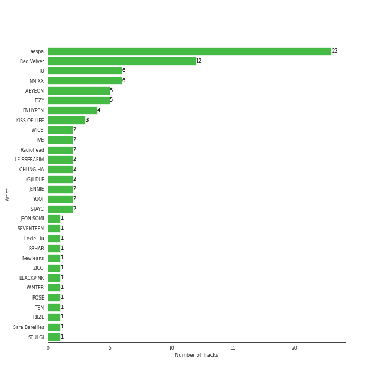
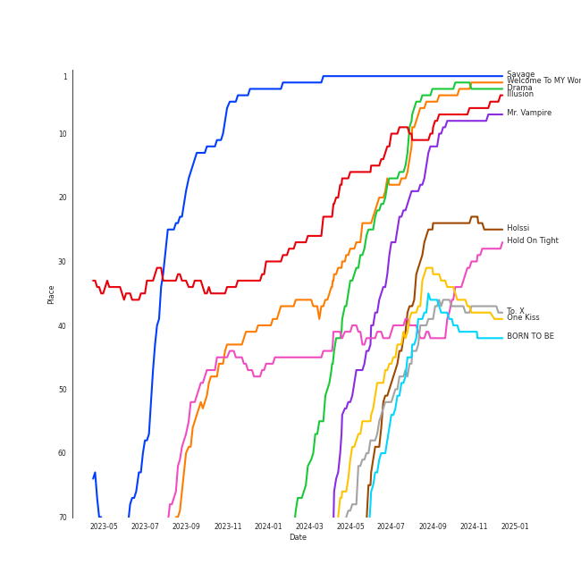
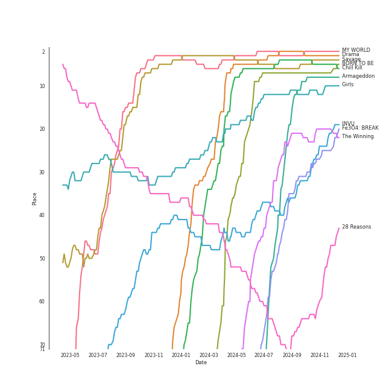
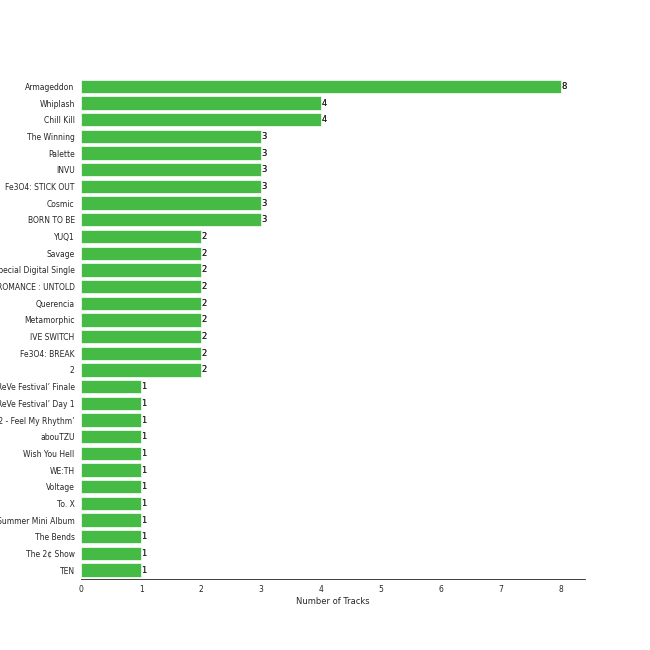
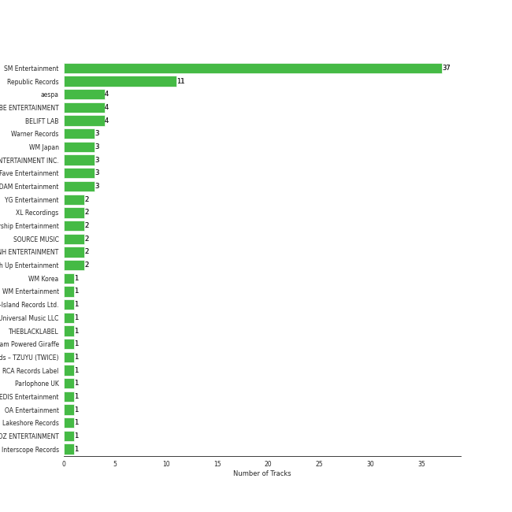
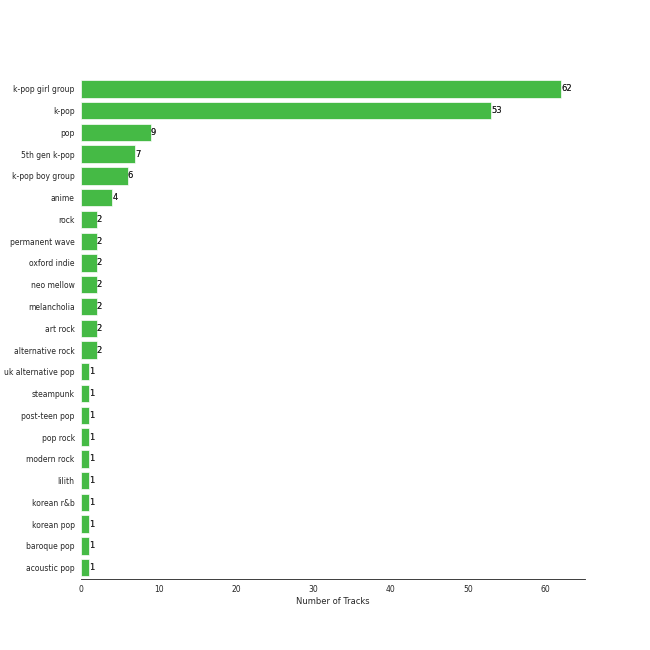
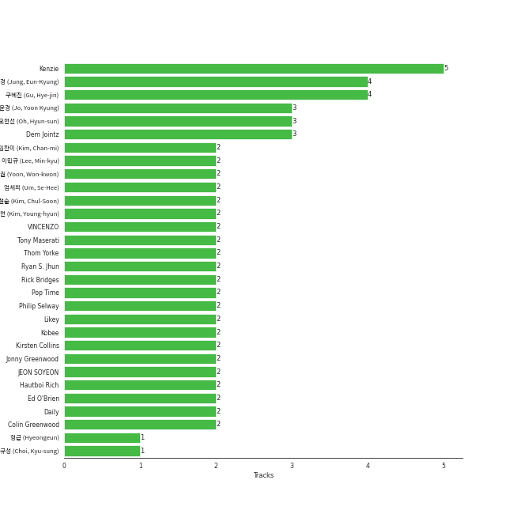
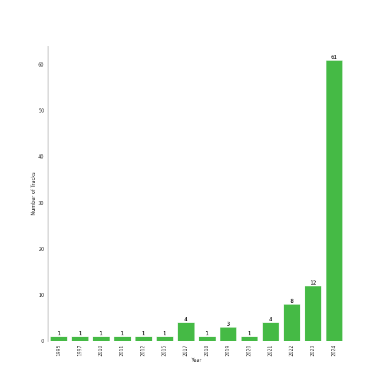

# My Top Songs 2024

[100 tracks 🔗](https://open.spotify.com/playlist/1LvIuumWRqySojWyTWkyle)

## Top Artists

| Art | Rank | Tracks | 💚 | Artist | 🔗 |
|:---|---:|---:|---:|:---|:---|
|  | 1 | 23 | 23 | [aespa](../../artists/aespa/overview.md) | [🔗](https://open.spotify.com/artist/6YVMFz59CuY7ngCxTxjpxE) |
|  | 2 | 12 | 12 | [Red Velvet](../../artists/red_velvet/overview.md) | [🔗](https://open.spotify.com/artist/1z4g3DjTBBZKhvAroFlhOM) |
|  | 3 | 6 | 6 | [IU](../../artists/iu/overview.md) | [🔗](https://open.spotify.com/artist/3HqSLMAZ3g3d5poNaI7GOU) |
|  | 17 | 6 | 6 | [NMIXX](../../artists/nmixx/overview.md) | [🔗](https://open.spotify.com/artist/28ot3wh4oNmoFOdVajibBl) |
|  | 8 | 5 | 5 | [TAEYEON](../../artists/taeyeon/overview.md) | [🔗](https://open.spotify.com/artist/3qNVuliS40BLgXGxhdBdqu) |
|  | 4 | 5 | 5 | [ITZY](../../artists/itzy/overview.md) | [🔗](https://open.spotify.com/artist/2KC9Qb60EaY0kW4eH68vr3) |
|  | 7 | 4 | 4 | [ENHYPEN](../../artists/enhypen/overview.md) | [🔗](https://open.spotify.com/artist/5t5FqBwTcgKTaWmfEbwQY9) |
|  | 35 | 3 | 3 | [KISS OF LIFE](../../artists/kiss_of_life/overview.md) | [🔗](https://open.spotify.com/artist/4TEK9tIkcoxib4GxT3O4ky) |
|  | 9 | 2 | 2 | [TWICE](../../artists/twice/overview.md) | [🔗](https://open.spotify.com/artist/7n2Ycct7Beij7Dj7meI4X0) |
|  | 18 | 2 | 2 | [IVE](../../artists/ive/overview.md) | [🔗](https://open.spotify.com/artist/6RHTUrRF63xao58xh9FXYJ) |

See all 41 artists

| Art | Rank | Tracks | 💚 | Artist | 🔗 |
|:---|---:|---:|---:|:---|:---|
|  | 48 | 2 | 2 | [Radiohead](../../artists/radiohead/overview.md) | [🔗](https://open.spotify.com/artist/4Z8W4fKeB5YxbusRsdQVPb) |
|  | 12 | 2 | 2 | [LE SSERAFIM](../../artists/le_sserafim/overview.md) | [🔗](https://open.spotify.com/artist/4SpbR6yFEvexJuaBpgAU5p) |
|  | 14 | 2 | 2 | [CHUNG HA](../../artists/chung_ha/overview.md) | [🔗](https://open.spotify.com/artist/2PSJ6YriU7JsFucxACpU7Y) |
|  | 6 | 2 | 2 | [(G)I-DLE](../../artists/(g)i-dle/overview.md) | [🔗](https://open.spotify.com/artist/2AfmfGFbe0A0WsTYm0SDTx) |
|  | 103 | 2 | 2 | JENNIE | [🔗](https://open.spotify.com/artist/250b0Wlc5Vk0CoUsaCY84M) |
|  | 65 | 2 | 2 | [YUQI](../../artists/yuqi/overview.md) | [🔗](https://open.spotify.com/artist/22aCD8IrQZjcPgZw728QT6) |
|  | 15 | 2 | 2 | [STAYC](../../artists/stayc/overview.md) | [🔗](https://open.spotify.com/artist/01XYiBYaoMJcNhPokrg0l0) |
|  | 69 | 1 | 1 | JEON SOMI | [🔗](https://open.spotify.com/artist/7zYj9S9SdIunYCfSm7vzAR) |
|  | 13 | 1 | 1 | [SEVENTEEN](../../artists/seventeen/overview.md) | [🔗](https://open.spotify.com/artist/7nqOGRxlXj7N2JYbgNEjYH) |
|  | 96 | 1 | 1 | Lexie Liu | [🔗](https://open.spotify.com/artist/6fs2or0cKLEM2xohWq8SoX) |
|  | 128 | 1 | 1 | R3HAB | [🔗](https://open.spotify.com/artist/6cEuCEZu7PAE9ZSzLLc2oQ) |
|  | 19 | 1 | 1 | [NewJeans](../../artists/newjeans/overview.md) | [🔗](https://open.spotify.com/artist/6HvZYsbFfjnjFrWF950C9d) |
|  | 138 | 1 | 1 | ZICO | [🔗](https://open.spotify.com/artist/4XpUIb8uuNlIWVKmgKZXC0) |
|  | 5 | 1 | 1 | [BLACKPINK](../../artists/blackpink/overview.md) | [🔗](https://open.spotify.com/artist/41MozSoPIsD1dJM0CLPjZF) |
|  | 71 | 1 | 1 | [WINTER](../../artists/winter/overview.md) | [🔗](https://open.spotify.com/artist/3mPquBmMu97Iq9TpzQ6ayI) |
|  | 116 | 1 | 1 | [ROSÉ](../../artists/rosé/overview.md) | [🔗](https://open.spotify.com/artist/3eVa5w3URK5duf6eyVDbu9) |
|  | 34 | 1 | 1 | [TEN](../../artists/ten/overview.md) | [🔗](https://open.spotify.com/artist/3Q5Qep7ytrjVleNnMnntgQ) |
|  | 76 | 1 | 1 | RIIZE | [🔗](https://open.spotify.com/artist/2jOm3cYujQx6o1dxuiuqaX) |
|  | 23 | 1 | 1 | [Sara Bareilles](../../artists/sara_bareilles/overview.md) | [🔗](https://open.spotify.com/artist/2Sqr0DXoaYABbjBo9HaMkM) |
|  | 37 | 1 | 1 | [SEULGI](../../artists/seulgi/overview.md) | [🔗](https://open.spotify.com/artist/2QM5S4yO6xHgnNvF0nbZZq) |
|  | 43 | 1 | 1 | nævis | [🔗](https://open.spotify.com/artist/2067CjQ2nC56cRZX8goeHg) |
|  | 91 | 1 | 1 | [OH MY GIRL](../../artists/oh_my_girl/overview.md) | [🔗](https://open.spotify.com/artist/2019zR22qK2RBvCqtudBaI) |
|  | 141 | 1 | 1 | Steam Powered Giraffe | [🔗](https://open.spotify.com/artist/1yqs45BSh7457Flyhmdv7f) |
|  | 61 | 1 | 1 | [PENTAGON](../../artists/pentagon/overview.md) | [🔗](https://open.spotify.com/artist/1wKpMkucynaTfG8lyPprYV) |
|  | 89 | 1 | 1 | BANG YEDAM | [🔗](https://open.spotify.com/artist/1slszTGbkp1uNnI6G5uD0X) |
|  | 80 | 1 | 1 | [Florence + The Machine](../../artists/florence_+_the_machine/overview.md) | [🔗](https://open.spotify.com/artist/1moxjboGR7GNWYIMWsRjgG) |
|  | 126 | 1 | 1 | TZUYU | [🔗](https://open.spotify.com/artist/1arCVYXeStgCY2UazBNBLK) |
|  | 81 | 1 | 1 | BABYMONSTER | [🔗](https://open.spotify.com/artist/1SIocsqdEefUTE6XKGUiVS) |
|  | 52 | 1 | 1 | [TAEMIN](../../artists/taemin/overview.md) | [🔗](https://open.spotify.com/artist/13rF01aOogvnkuQXOlgTW8) |
|  | 90 | 1 | 1 | [Bruno Mars](../../artists/bruno_mars/overview.md) | [🔗](https://open.spotify.com/artist/0du5cEVh5yTK9QJze8zA0C) |
|  | 26 | 1 | 1 | [WENDY](../../artists/wendy/overview.md) | [🔗](https://open.spotify.com/artist/0FRUZvZNPzM3YJMABJxf2K) |

## Top Tracks

Most and least listened tracks

| Rank | ​ | Most listened tracks | Rank | ​​ | Least listened tracks |
|---:|:---|:---|---:|:---|:---|
| 1 |  | [Savage](../../artists/aespa/overview.md) | 1063 |  | [Love Arcade](../../artists/red_velvet/overview.md) |
| 2 |  | [Welcome To MY World (feat. nævis)](../../artists/aespa/overview.md) | 744 |  | [Live My Life](../../artists/aespa/overview.md) |
| 3 |  | [Drama](../../artists/aespa/overview.md) | 726 |  | [Red Flavor](../../artists/red_velvet/overview.md) |
| 4 |  | [Illusion](../../artists/aespa/overview.md) | 652 |  | [Wife](../../artists/(g)i-dle/overview.md) |
| 7 |  | [Mr. Vampire](../../artists/itzy/overview.md) | 500 |  | [Cold As Hell](../../artists/taeyeon/overview.md) |
| 25 |  | [Holssi](../../artists/iu/overview.md) | 444 |  | [Stay Tonight](../../artists/chung_ha/overview.md) |
| 27 |  | [Hold On Tight](../../artists/aespa/overview.md) | 422 |  | [Voltage](../../artists/itzy/overview.md) |
| 38 |  | [To. X](../../artists/taeyeon/overview.md) | 399 |  | [Love wins all](../../artists/iu/overview.md) |
| 39 |  | [One Kiss](../../artists/red_velvet/overview.md) | 376 |  | [EASY](../../artists/le_sserafim/overview.md) |
| 42 |  | [BORN TO BE](../../artists/itzy/overview.md) | 374 |  | [TANK](../../artists/nmixx/overview.md) |

## Top Albums

| Art | Rank | Tracks | 💚 | Album | Release Date | 🔗 |
|:---|---:|---:|---:|:---|:---|:---|
|  | 8 | 8 | 8 | Armageddon - The 1st Album | 2024-05-26 | [🔗](https://open.spotify.com/album/4SboBpuYojDm02qS4iFeJC) |
|  | 115 | 4 | 4 | Whiplash - The 5th Mini Album | 2024-10-21 | [🔗](https://open.spotify.com/album/7J41hCLBI2kEwL6RVSxfNx) |
|  | 6 | 4 | 4 | Chill Kill - The 3rd Album | 2023-11-13 | [🔗](https://open.spotify.com/album/4UUICitfodUVCNhzmDFbrO) |
|  | 22 | 3 | 3 | The Winning | 2024-02-20 | [🔗](https://open.spotify.com/album/08CvAj58nVMpq1Nw7T6maj) |
|  | 44 | 3 | 3 | Palette | 2017-04-21 | [🔗](https://open.spotify.com/album/5V8n6fqyAPxvFTibPhQVcp) |
|  | 19 | 3 | 3 | INVU - The 3rd Album | 2022-02-14 | [🔗](https://open.spotify.com/album/7i2YLTVQ0dyngRuUqtGmr9) |
|  | 93 | 3 | 3 | Fe3O4: STICK OUT | 2024-08-19 | [🔗](https://open.spotify.com/album/2pb2RscdByJ8pc7dPT1SY2) |
|  | 73 | 3 | 3 | Cosmic | 2024-08-01 | [🔗](https://open.spotify.com/album/5lHtH6O6mCnVx1MNuPPBQK) |
|  | 5 | 3 | 3 | BORN TO BE | 2024-01-08 | [🔗](https://open.spotify.com/album/3cm3EkNQLpKu58btSJT7fz) |
|  | 106 | 2 | 2 | YUQ1 | 2024-04-23 | [🔗](https://open.spotify.com/album/7LYc8ngbhwha4aGJ5kVauc) |

See all 66 albums

| Art | Rank | Tracks | 💚 | Album | Release Date | 🔗 |
|:---|---:|---:|---:|:---|:---|:---|
|  | 4 | 2 | 2 | Savage - The 1st Mini Album | 2021-10-05 | [🔗](https://open.spotify.com/album/3vyyDkvYWC36DwgZCYd3Wu) |
|  | 108 | 2 | 2 | SYNK : PARALLEL LINE - Special Digital Single | 2024-10-09 | [🔗](https://open.spotify.com/album/4vLGHlTnlIIxMSfefCY0cU) |
|  | 85 | 2 | 2 | ROMANCE : UNTOLD | 2024-07-12 | [🔗](https://open.spotify.com/album/05I8FltCMnGa3kE38mpOkL) |
|  | 152 | 2 | 2 | Querencia | 2021-02-15 | [🔗](https://open.spotify.com/album/3ZifpmJjOEkpYCNSIq352p) |
|  | 162 | 2 | 2 | Metamorphic | 2024-07-01 | [🔗](https://open.spotify.com/album/6eTCq3XOz0rVJnelXro3Vk) |
|  | 107 | 2 | 2 | IVE SWITCH | 2024-04-29 | [🔗](https://open.spotify.com/album/7z61DsZtWO2S4nC5xd0b9p) |
|  | 20 | 2 | 2 | Fe3O4: BREAK | 2024-01-15 | [🔗](https://open.spotify.com/album/5CCxLQgcI7cVwmgFDlicbP) |
|  | 61 | 2 | 2 | 2 | 2024-01-29 | [🔗](https://open.spotify.com/album/0mC9MXPddkzggVsOXh5gd3) |
|  | 150 | 1 | 1 | ‘The ReVe Festival’ Finale | 2019-12-23 | [🔗](https://open.spotify.com/album/3rVtm00UfbuzWOewdm4iYM) |
|  | 131 | 1 | 1 | ‘The ReVe Festival’ Day 1 | 2019-06-19 | [🔗](https://open.spotify.com/album/2nLEiP268mSFZHW5dajM4R) |
|  | 81 | 1 | 1 | ‘The ReVe Festival 2022 - Feel My Rhythm’ | 2022-03-21 | [🔗](https://open.spotify.com/album/3HgoCO9wWuPcNhz8Ip4C46) |
|  | 157 | 1 | 1 | abouTZU | 2024-09-06 | [🔗](https://open.spotify.com/album/0Xj4fXPKV0h6KhGQbUkDvy) |
|  | 110 | 1 | 1 | Wish You Hell - The 2nd Mini Album | 2024-03-12 | [🔗](https://open.spotify.com/album/3f8n88uX0tNvA8HTROgSkr) |
|  | 160 | 1 | 1 | WE:TH | 2020-10-12 | [🔗](https://open.spotify.com/album/1ASYbBYBwV6Rcfc2ycqmlK) |
|  | 300 | 1 | 1 | Voltage | 2022-03-23 | [🔗](https://open.spotify.com/album/3MXVqfk9VG3B757nLlow0D) |
|  | 26 | 1 | 1 | To. X - The 5th Mini Album | 2023-11-27 | [🔗](https://open.spotify.com/album/0VciVDVU6NoqtQ0WAIlTmD) |
|  | 487 | 1 | 1 | The Red Summer - Summer Mini Album | 2017-07-09 | [🔗](https://open.spotify.com/album/6OXg149IkmbgW7zfzbwgS2) |
|  | 230 | 1 | 1 | The Bends | 1995-03-13 | [🔗](https://open.spotify.com/album/35UJLpClj5EDrhpNIi4DFg) |
|  | 182 | 1 | 1 | The 2¢ Show | 2012-05-23 | [🔗](https://open.spotify.com/album/4DECRyKlhKJgjZLLuvfAI6) |
|  | 57 | 1 | 1 | TEN - The 1st Mini Album | 2024-02-13 | [🔗](https://open.spotify.com/album/50Zo1vf3YCQtXLUZr2oBiQ) |
|  | 120 | 1 | 1 | Sticky | 2024-07-01 | [🔗](https://open.spotify.com/album/3p68B7ZhETVmNbOov8JcF5) |
|  | 78 | 1 | 1 | SQUARE UP | 2018-06-15 | [🔗](https://open.spotify.com/album/0wOiWrujRbxlKEGWRQpKYc) |
|  | 168 | 1 | 1 | SPOT! | 2024-04-26 | [🔗](https://open.spotify.com/album/3K3C9JjwCGQAzj3Bu7BUaI) |
|  | 151 | 1 | 1 | SEVENTEEN BEST ALBUM '17 IS RIGHT HERE' | 2024-04-29 | [🔗](https://open.spotify.com/album/2Jrp37x38qZqtyrIrfxN4H) |
|  | 103 | 1 | 1 | Regret of the Times (2024 aespa Remake Version) - SM STATION | 2024-01-15 | [🔗](https://open.spotify.com/album/4Nav3JE8TIOFiuY5x95MIh) |
|  | 126 | 1 | 1 | RIIZING - The 1st Mini Album | 2024-06-17 | [🔗](https://open.spotify.com/album/23TA2tnqYnphv1MKkiS6x2) |
|  | 74 | 1 | 1 | READY TO BE | 2023-03-10 | [🔗](https://open.spotify.com/album/7hzP5i7StxYG4StECA0rrJ) |
|  | 99 | 1 | 1 | Officially Cool | 2024-04-02 | [🔗](https://open.spotify.com/album/7ak1PBCmrVLvOANEenebe9) |
|  | 51 | 1 | 1 | ORANGE BLOOD | 2023-11-17 | [🔗](https://open.spotify.com/album/7dsAlxH9cMgyREm8OLdWWT) |
|  | 193 | 1 | 1 | OK Computer | 1997-05-28 | [🔗](https://open.spotify.com/album/6dVIqQ8qmQ5GBnJ9shOYGE) |
|  | 138 | 1 | 1 | NewJeans 2nd EP 'Get Up' | 2023-07-21 | [🔗](https://open.spotify.com/album/4N1fROq2oeyLGAlQ1C1j18) |
|  | 119 | 1 | 1 | Midas Touch | 2024-04-03 | [🔗](https://open.spotify.com/album/1HfTA0xDoZ0mswFO3GB3ef) |
|  | 177 | 1 | 1 | Mantra | 2024-10-10 | [🔗](https://open.spotify.com/album/3e5tDT1kfaAGx10yOjIDgW) |
|  | 2 | 1 | 1 | MY WORLD - The 3rd Mini Album | 2023-05-08 | [🔗](https://open.spotify.com/album/69xF8jTd0c4Zoo7DT3Rwrn) |
|  | 205 | 1 | 1 | Kaleidoscope Heart | 2010-09-07 | [🔗](https://open.spotify.com/album/627ukPRwYxyBREHxBq0vGJ) |
|  | 71 | 1 | 1 | Ice Cream Cake - The 1st Mini Album | 2015-03-17 | [🔗](https://open.spotify.com/album/27cBQ5FDqv0xLgiJ7qNpZr) |
|  | 165 | 1 | 1 | Ice Cream | 2024-08-02 | [🔗](https://open.spotify.com/album/5Q41ZTpaEpDVtgu1yAtAPR) |
|  | 192 | 1 | 1 | Hot Mess | 2024-07-03 | [🔗](https://open.spotify.com/album/2PvpuCui1GVO8DkFcCHzYU) |
|  | 33 | 1 | 1 | Hold On Tight | 2023-03-30 | [🔗](https://open.spotify.com/album/4bWGRs1SqNwFXaRDXRAANN) |
|  | 102 | 1 | 1 | Heaven | 2024-07-08 | [🔗](https://open.spotify.com/album/68taLckvPxHRtNa8QjQJ5e) |
|  | 10 | 1 | 1 | Girls - The 2nd Mini Album | 2022-07-08 | [🔗](https://open.spotify.com/album/4w1dbvUy1crv0knXQvcSeY) |
|  | 211 | 1 | 1 | Fraggle Rock: Back To The Rock - Season 2 (Apple TV+ Original Series Soundtrack) | 2024-03-29 | [🔗](https://open.spotify.com/album/7ADS5WrhmIaFv9r1671yNh) |
|  | 252 | 1 | 1 | FANCY YOU | 2019-04-22 | [🔗](https://open.spotify.com/album/3aLpWFejbsdyafODLXRqwF) |
|  | 121 | 1 | 1 | ETERNAL | 2024-08-19 | [🔗](https://open.spotify.com/album/13M8K1l146FLdFoObJIVj9) |
|  | 95 | 1 | 1 | EASY | 2024-02-19 | [🔗](https://open.spotify.com/album/1YCj4PZi08G20y2ekGKY0C) |
|  | 191 | 1 | 1 | Dreamy Resonance | 2024-08-26 | [🔗](https://open.spotify.com/album/4XZFgEjQ4Un1TNHAtTC87m) |
|  | 3 | 1 | 1 | Drama - The 4th Mini Album | 2023-11-10 | [🔗](https://open.spotify.com/album/5NMtxQJy4wq3mpo3ERVnLs) |
|  | 76 | 1 | 1 | DARK MOON SPECIAL ALBUM <MEMORABILIA> | 2024-05-13 | [🔗](https://open.spotify.com/album/0OhJwEzXbK9Km6GQSPdmPU) |
|  | 184 | 1 | 1 | Ceremonials (Deluxe Edition) | 2011-01-01 | [🔗](https://open.spotify.com/album/5SxudoALxEAVh9l83kSebx) |
|  | 167 | 1 | 1 | CRAZY | 2024-08-30 | [🔗](https://open.spotify.com/album/538vEfAgLJ6g2I8ubuOlap) |
|  | 66 | 1 | 1 | Born to be XX | 2023-11-08 | [🔗](https://open.spotify.com/album/6yDtQxvq1XRC7Y5qtS03Xx) |
|  | 91 | 1 | 1 | BABYMONS7ER | 2024-04-01 | [🔗](https://open.spotify.com/album/0eSbsl3j8jz96LC2NCLPc4) |
|  | 149 | 1 | 1 | Algorhythm | 2024-05-15 | [🔗](https://open.spotify.com/album/7ji7zKkvRlYOsu3ehctQRx) |
|  | 172 | 1 | 1 | APT. | 2024-10-18 | [🔗](https://open.spotify.com/album/2IYQwwgxgOIn7t3iF6ufFD) |
|  | 267 | 1 | 1 | AD MARE | 2022-02-22 | [🔗](https://open.spotify.com/album/2QbA97qjlAs81t6kVS6zBk) |
|  | 43 | 1 | 1 | 28 Reasons - The 1st Mini Album | 2022-10-04 | [🔗](https://open.spotify.com/album/1t5a29WYbJj83iy3RNICHw) |

## Top Record Labels

| Tracks | 💚 | Label |
|---:|---:|:---|
| 37 | 37 | [SM Entertainment](../../labels/sm_entertainment/overview.md) |
| 11 | 11 | [Republic Records](../../labels/republic_records/overview.md) |
| 4 | 4 | aespa |
| 4 | 4 | [CUBE ENTERTAINMENT](../../labels/cube_entertainment/overview.md) |
| 4 | 4 | [BELIFT LAB](../../labels/belift_lab/overview.md) |
| 3 | 3 | [Warner Records](../../labels/warner_records/overview.md) |
| 3 | 3 | [WM Japan](../../labels/wm_japan/overview.md) |
| 3 | 3 | [S2 ENTERTAINMENT INC.](../../labels/s2_entertainment_inc_/overview.md) |
| 3 | 3 | Fave Entertainment |
| 3 | 3 | [EDAM Entertainment](../../labels/edam_entertainment/overview.md) |

See all 35 labels

| Tracks | 💚 | Label |
|---:|---:|:---|
| 2 | 2 | [YG Entertainment](../../labels/yg_entertainment/overview.md) |
| 2 | 2 | [XL Recordings](../../labels/xl_recordings/overview.md) |
| 2 | 2 | [Starship Entertainment](../../labels/starship_entertainment/overview.md) |
| 2 | 2 | [SOURCE MUSIC](../../labels/source_music/overview.md) |
| 2 | 2 | [MNH ENTERTAINMENT](../../labels/mnh_entertainment/overview.md) |
| 2 | 2 | [High Up Entertainment](../../labels/high_up_entertainment/overview.md) |
| 1 | 1 | [WM Korea](../../labels/wm_korea/overview.md) |
| 1 | 1 | [WM Entertainment](../../labels/wm_entertainment/overview.md) |
| 1 | 1 | [Universal-Island Records Ltd.](../../labels/universal-island_records_ltd_/overview.md) |
| 1 | 1 | [Universal Music LLC](../../labels/universal_music_llc/overview.md) |
| 1 | 1 | THEBLACKLABEL |
| 1 | 1 | Steam Powered Giraffe |
| 1 | 1 | Republic Records – TZUYU (TWICE) |
| 1 | 1 | [RCA Records Label](../../labels/rca_records_label/overview.md) |
| 1 | 1 | [Parlophone UK](../../labels/parlophone_uk/overview.md) |
| 1 | 1 | [PLEDIS Entertainment](../../labels/pledis_entertainment/overview.md) |
| 1 | 1 | OA Entertainment |
| 1 | 1 | Lakeshore Records |
| 1 | 1 | KOZ ENTERTAINMENT |
| 1 | 1 | [Interscope Records](../../labels/interscope_records/overview.md) |
| 1 | 1 | [Epic](../../labels/epic/overview.md) |
| 1 | 1 | [Columbia](../../labels/columbia/overview.md) |
| 1 | 1 | BIGPLANETMADE |
| 1 | 1 | [Atlantic Records](../../labels/atlantic_records/overview.md) |
| 1 | 1 | [ADOR](../../labels/ador/overview.md) |

## Genres

| Tracks | 💚 | Genre |
|---:|---:|:---|
| 62 | 62 | [k-pop girl group](../../genres/k-pop_girl_group/overview.md) |
| 53 | 53 | [k-pop](../../genres/k-pop/overview.md) |
| 9 | 9 | [pop](../../genres/pop/overview.md) |
| 7 | 7 | [5th gen k-pop](../../genres/5th_gen_k-pop/overview.md) |
| 6 | 6 | [k-pop boy group](../../genres/k-pop_boy_group/overview.md) |
| 4 | 4 | [anime](../../genres/anime/overview.md) |
| 2 | 2 | [rock](../../genres/rock/overview.md) |
| 2 | 2 | [permanent wave](../../genres/permanent_wave/overview.md) |
| 2 | 2 | oxford indie |
| 2 | 2 | [neo mellow](../../genres/neo_mellow/overview.md) |

See all 23 genres

| Tracks | 💚 | Genre |
|---:|---:|:---|
| 2 | 2 | melancholia |
| 2 | 2 | [art rock](../../genres/art_rock/overview.md) |
| 2 | 2 | [alternative rock](../../genres/alternative_rock/overview.md) |
| 1 | 1 | [uk alternative pop](../../genres/uk_alternative_pop/overview.md) |
| 1 | 1 | steampunk |
| 1 | 1 | [post-teen pop](../../genres/post-teen_pop/overview.md) |
| 1 | 1 | [pop rock](../../genres/pop_rock/overview.md) |
| 1 | 1 | [modern rock](../../genres/modern_rock/overview.md) |
| 1 | 1 | [lilith](../../genres/lilith/overview.md) |
| 1 | 1 | [korean r&b](../../genres/korean_r_b/overview.md) |
| 1 | 1 | [korean pop](../../genres/korean_pop/overview.md) |
| 1 | 1 | baroque pop |
| 1 | 1 | [acoustic pop](../../genres/acoustic_pop/overview.md) |

## Top Producers

| Art | Producer | Tracks | Credit Types |
|:---|:---|---:|:---|
| | [Kenzie](../../producers/kenzie/overview.md) | 5 | Lyricist, Songwriter, Arranger |
| | [구혜진 (Gu, Hye-jin)](../../producers/구혜진_(gu,_hye-jin)/overview.md) | 4 | Producer |
| | [정은경 (Jung, Eun-Kyung)](../../producers/정은경_(jung,_eun-kyung)/overview.md) | 4 | Producer |
| | 오현선 (Oh, Hyun-sun) | 3 | Lyricist |
| | Dem Jointz | 3 | Songwriter, Arranger |
| | [조윤경 (Jo, Yoon Kyung)](../../producers/조윤경_(jo,_yoon_kyung)/overview.md) | 3 | Lyricist |
|  | [JEON SOYEON](../../artists/jeon_soyeon/overview.md) | 2 | Arranger, Lyricist, Songwriter |
| | [Tony Maserati](../../producers/tony_maserati/overview.md) | 2 | Producer |
| | [Ryan S. Jhun](../../producers/ryan_s__jhun/overview.md) | 2 | Songwriter, Arranger |
| | Daily | 2 | Arranger, Songwriter |

View all

| Art | Producer | Tracks | Credit Types |
|:---|:---|---:|:---|
| | 임찬미 (Kim, Chan-mi) | 2 | Producer |
| | [VINCENZO](../../producers/vincenzo/overview.md) | 2 | Arranger, Lyricist, Songwriter |
| | [Pop Time](../../producers/pop_time/overview.md) | 2 | Arranger, Songwriter |
| | Hautboi Rich | 2 | Songwriter |
| | 김영현 (Kim, Young-hyun) | 2 | Producer |
| | Likey | 2 | Arranger, Songwriter |
| | [Philip Selway](../../producers/philip_selway/overview.md) | 2 | Songwriter |
| | Kobee | 2 | Arranger, Producer, Songwriter |
| | Kirsten Collins | 2 | Songwriter |
| | [Ed O'Brien](../../producers/ed_o_brien/overview.md) | 2 | Songwriter |
| | [윤원권 (Yoon, Won-kwon)](../../producers/윤원권_(yoon,_won-kwon)/overview.md) | 2 | Producer |
| | [Thom Yorke](../../producers/thom_yorke/overview.md) | 2 | Producer, Songwriter |
| | [Jonny Greenwood](../../producers/jonny_greenwood/overview.md) | 2 | Songwriter |
| | Rick Bridges | 2 | Lyricist |
| | 이민규 (Lee, Min-kyu) | 2 | Producer |
| | [Colin Greenwood](../../producers/colin_greenwood/overview.md) | 2 | Songwriter |
| | [엄세희 (Um, Se-Hee)](../../producers/엄세희_(um,_se-hee)/overview.md) | 2 | Producer |
| | 김철순 (Kim, Chul-Soon) | 2 | Producer |
| | Tom Elmhirst | 1 | Producer |
| | Rogét Chahayed (Chahayed, Rogét) | 1 | Songwriter |
| | Zarah Christenson | 1 | Songwriter |
| | Daniel Davidsen | 1 | Songwriter |
| | 진리 (Jinri) | 1 | Lyricist |
| | Jess Morgan | 1 | Songwriter |
| | Tay Jasper | 1 | Songwriter |
| | [구종필 (Koo, Jong-Pil)](../../producers/구종필_(koo,_jong-pil)/overview.md) | 1 | Producer |
| | Kole | 1 | Songwriter |
| | Bill Zimmerman | 1 | Producer |
| | Bullion | 1 | Producer |
|  | [Bruno Mars](../../artists/bruno_mars/overview.md) | 1 | Songwriter |
| | 김지현 (Kim, Ji Hyun) | 1 | Producer |
| | [24](../../producers/24/overview.md) | 1 | Arranger, Songwriter |
|  | Bekuh Boom | 1 | Songwriter |
| | 방혜현 (Bang, Hye Hyun) | 1 | Lyricist |
|  | [Radiohead](../../artists/radiohead/overview.md) | 1 | Arranger, Producer |
| | [Fuxxy](../../producers/fuxxy/overview.md) | 1 | Lyricist, Songwriter |
| | Gusten Dahlqvist | 1 | Arranger, Producer, Songwriter |
| | MJ | 1 | Producer |
| | Gigi | 1 | Lyricist |
| | Jason Robert | 1 | Producer |
| | Joseph K | 1 | Arranger, Songwriter |
| | 노민지 (Noh, Min-ji) | 1 | Producer |
| | Rebecca King | 1 | Lyricist |
| | 정다연 (Jeong, Dayeon) | 1 | Lyricist |
| | Brian U | 1 | Arranger, Songwriter |
|  | R3HAB | 1 | Producer |
|  | [Sara Bareilles](../../artists/sara_bareilles/overview.md) | 1 | Lyricist, Songwriter |
| | Frankie Day | 1 | Songwriter |
| | 서은일 (Seo, Eun-il) | 1 | Producer |
| | [정의석 (Jung, Euisuk)](../../producers/정의석_(jung,_euisuk)/overview.md) | 1 | Producer |
| | Arineh Karimi | 1 | Songwriter |
| | 성유진 (Sung, Yoojin) | 1 | Lyricist |
| | IMLAY | 1 | Arranger |
| | [서지음 (Seo, Ji Eum)](../../producers/서지음_(seo,_ji_eum)/overview.md) | 1 | Lyricist |
| | Jia Lih | 1 | Arranger, Songwriter |
| | Deza | 1 | Lyricist |
| | 오유원 (Oh, Yoo-won) | 1 | Lyricist |
| | Hayley Aitken | 1 | Arranger, Songwriter |
| | 이경원 (Lee, Kyung-won) | 1 | Producer |
| | [TEDDY](../../producers/teddy/overview.md) | 1 | Arranger, Lyricist, Songwriter |
| | Brown Panda | 1 | Arranger, Songwriter |
| | 이주형 (Lee, Juhyeong) | 1 | Producer |
| | Cazzi Opeia | 1 | Songwriter |
| | PAPRIKAA | 1 | Arranger, Songwriter |
| | Danielle Marsh | 1 | Lyricist |
| | Michael Fatkin | 1 | Arranger, Songwriter |
| | 250 | 1 | Producer, Songwriter |
| | Rachel Furner | 1 | Songwriter |
| | 남궁진 (Nam Goong, Jin) | 1 | Producer |
| | Pyungwook Lee | 1 | Producer |
| | 정유라 (Jeong, Yu-ra) | 1 | Producer |
| | Brandon Green | 1 | Arranger, Songwriter |
| | Omer Fedi | 1 | Songwriter |
| | Michael Chapman | 1 | Songwriter |
| | Johan Gustafsson | 1 | Arranger, Songwriter |
| | 김인 (Kim, In) | 1 | Lyricist |
| | Adam von Mentzer | 1 | Songwriter |
| | 여민수 (Yeo, Min Soo) | 1 | Producer |
| | [유영진 (Yoo, Young-jin)](../../producers/유영진_(yoo,_young-jin)/overview.md) | 1 | Arranger, Lyricist, Producer, Songwriter |
| | Theron Thomas | 1 | Songwriter |
| | Philip Lawrence | 1 | Songwriter |
| | 김수정 (김수정) | 1 | Producer |
| | 이스란 (Lee, Seran) | 1 | Lyricist |
| | Nicky Chinn | 1 | Songwriter |
| | Melange | 1 | Arranger |
| | Anna Timgren | 1 | Lyricist, Songwriter |
| | Dr.JO | 1 | Lyricist |
| | Fine Glindvad Jensen | 1 | Lyricist, Songwriter |
| | Catharina Stoltenberg | 1 | Lyricist, Producer, Songwriter |
| | [Florence Welch](../../producers/florence_welch/overview.md) | 1 | Lyricist, Songwriter |

## Years

View all years

| Year | Number of Tracks |
|:---|---:|
| [2024](2024/overview.md) | 61 |
| 2023 | 12 |
| 2022 | 8 |
| 2021 | 4 |
| 2020 | 1 |
| 2019 | 3 |
| 2018 | 1 |
| 2017 | 4 |
| 2015 | 1 |
| 2012 | 1 |
| 2011 | 1 |
| 2010 | 1 |
| 1997 | 1 |
| 1995 | 1 |

| ​ | 10 newest albums | ​​ | 10 oldest albums |
|:---|:---|:---|:---|
|  | Whiplash - The 5th Mini Album (2024-10-21) |  | The Bends (1995-03-13) |
|  | APT. (2024-10-18) |  | OK Computer (1997-05-28) |
|  | Mantra (2024-10-10) |  | Kaleidoscope Heart (2010-09-07) |
|  | SYNK : PARALLEL LINE - Special Digital Single (2024-10-09) |  | Ceremonials (Deluxe Edition) (2011-01-01) |
|  | abouTZU (2024-09-06) |  | The 2¢ Show (2012-05-23) |
|  | CRAZY (2024-08-30) |  | Ice Cream Cake - The 1st Mini Album (2015-03-17) |
|  | Dreamy Resonance (2024-08-26) |  | Palette (2017-04-21) |
|  | Fe3O4: STICK OUT (2024-08-19) |  | The Red Summer - Summer Mini Album (2017-07-09) |
|  | ETERNAL (2024-08-19) |  | SQUARE UP (2018-06-15) |
|  | Ice Cream (2024-08-02) |  | FANCY YOU (2019-04-22) |