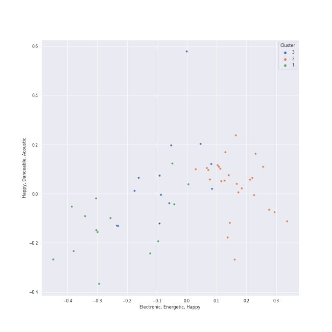

# Clusters in Not K-Pop

## Cluster #1

14 tracks

| Art | Track | Album | Artists | Label | Rank | 💚 | 🔗 |
|:---|:---|:---|:---|:---|---:|:---|:---|
|  | I Don't Think I'm Okay | I Don't Think I'm Okay | Bazzi | iamcosmic | 996 | 💚 | [🔗](https://open.spotify.com/track/0PUkanqCGTb6qseXPKOw1F) |
|  | Blue Whale - 2016 Version | REMIND | YB | 디컴퍼니 | 996 | 💚 | [🔗](https://open.spotify.com/track/1WFj1P1TUJJXH1R41PP9Vg) |
|  | i'm not okay | this is what ____ feels like (Vol. 1-4) | JVKE | JVKE | 820 | | [🔗](https://open.spotify.com/track/1fiSki9Yy5lekUUpV4mByo) |
|  | this is what falling in love feels like | this is what ____ feels like (Vol. 1-4) | JVKE | JVKE | 844 | 💚 | [🔗](https://open.spotify.com/track/2PWTZV5znjLtZC5T1EVJvL) |
|  | I Have Nothing | The Bodyguard - Original Soundtrack Album | Whitney Houston | Arista | 996 | 💚 | [🔗](https://open.spotify.com/track/31er9IGsfFbwqy1pH4aiTP) |
|  | Heartbreak Anniversary | TAKE TIME | Giveon | [Epic/Not So Fast](../../../../labels/epic) | 996 | 💚 | [🔗](https://open.spotify.com/track/3FAJ6O0NOHQV8Mc5Ri6ENp) |
|  | If I Ain't Got You | The Diary Of Alicia Keys | Alicia Keys | J Records | 996 | 💚 | [🔗](https://open.spotify.com/track/3XVBdLihbNbxUwZosxcGuJ) |
|  | I Love You 3000 II | Head In The Clouds II | 88rising, Stephanie Poetri, [Jackson Wang](../../../../artists/jackson_wang/overview.md) | [88rising Music](../../../../labels/88rising_music), [Warner Records](../../../../labels/warner_records) | 996 | 💚 | [🔗](https://open.spotify.com/track/3witRpHWHqArlnt6GTlH2Y) |
|  | ドライフラワー | 壱 | Yuuri | [Sony Music Labels Inc.](../../../../labels/sony_music_labels_inc_) | 737 | 💚 | [🔗](https://open.spotify.com/track/4kPlQKwtPrnqLgrmmKFSlA) |
|  | City Burns | Cheers to the Fall | Andra Day | [Warner Records/Buskin](../../../../labels/warner_records) | 996 | 💚 | [🔗](https://open.spotify.com/track/5hL8VGl2wsLWSXPiTq3Fdk) |
## Cluster #2

26 tracks

| Art | Track | Album | Artists | Label | Rank | 💚 | 🔗 |
|:---|:---|:---|:---|:---|---:|:---|:---|
|  | ME! (feat. Brendon Urie of Panic! At The Disco) | Lover | [Taylor Swift](../../../../artists/taylor_swift/overview.md), Brendon Urie, Panic! At The Disco | [Taylor Swift](../../../../labels/taylor_swift) | 996 | | [🔗](https://open.spotify.com/track/2Rk4JlNc2TPmZe2af99d45) |
|  | Sure Thing | All I Want Is You | Miguel | [Jive](../../../../labels/jive) | 996 | 💚 | [🔗](https://open.spotify.com/track/0JXXNGljqupsJaZsgSbMZV) |
|  | A Kind Of Magic | A Kind Of Magic | [Queen](../../../../artists/queen/overview.md) | [Hollywood Records](../../../../labels/hollywood_records) | 996 | | [🔗](https://open.spotify.com/track/74QzobuYWH5BHMTrW9X7Yu) |
|  | SILENCE | Taxidriver OST Part.1 | YB | SBS Contents Hub Co., Ltd., Music Recipe | 996 | 💚 | [🔗](https://open.spotify.com/track/2T9O6E83LKAWNAs4FD4TqD) |
|  | Cry for Me | Cry for Me | [Camila Cabello](../../../../artists/camila_cabello/overview.md) | [Epic](../../../../labels/epic), [Syco Music](../../../../labels/syco_music) | 996 | 💚 | [🔗](https://open.spotify.com/track/40nPimvmG05WYS7983bawZ) |
|  | Flowers - Cover | Flowers - Cover | [YUQI](../../../../artists/yuqi/overview.md) | YUQI | 996 | 💚 | [🔗](https://open.spotify.com/track/4KhOLC5IT1Rz8G4iHsoTAV) |
|  | Flowers | Endless Summer Vacation | Miley Cyrus | [Columbia](../../../../labels/columbia) | 996 | 💚 | [🔗](https://open.spotify.com/track/7DSAEUvxU8FajXtRloy8M0) |
|  | Ashes | Ashes | Stellar | Arista Records | 996 | 💚 | [🔗](https://open.spotify.com/track/3Pj6u2KTgepyyidp5xfbHp) |
|  | West Coast Love | The Juice: Vol. II | Emotional Oranges | Avant Garden PS | 996 | | [🔗](https://open.spotify.com/track/4NFD9ea0uH0MtoC30yNYE1) |
|  | SG (with Ozuna, Megan Thee Stallion & LISA of BLACKPINK) | SG (with Ozuna, Megan Thee Stallion & LISA of BLACKPINK) | DJ Snake, Ozuna, Megan Thee Stallion, LISA | DJ Snake Music Productions Limited | 996 | | [🔗](https://open.spotify.com/track/6IPNp9PfaEqrzotY47TIWy) |
## Cluster #3

13 tracks

| Art | Track | Album | Artists | Label | Rank | 💚 | 🔗 |
|:---|:---|:---|:---|:---|---:|:---|:---|
|  | Written In The Stars | Written In The Stars | [WENDY](../../../../artists/wendy/overview.md), John Legend | [SM Entertainment](../../../../labels/sm_entertainment) | 996 | 💚 | [🔗](https://open.spotify.com/track/6SLMyJPRTh2zCX9SJJHTZQ) |
|  | Lucky | We Sing. We Dance. We Steal Things. | Jason Mraz, Colbie Caillat | [Atlantic Records/ATG](../../../../labels/atlantic_records) | 848 | 💚 | [🔗](https://open.spotify.com/track/0IktbUcnAGrvD03AWnz3Q8) |
|  | perfect blues | perfect blues | hannah bahng | BAHNG ENTERTAINMENT LLC | 996 | 💚 | [🔗](https://open.spotify.com/track/0b5EKv77RtqF8JU64u1Q1Y) |
|  | MALAMENTE - Cap.1: Augurio | El Mal Querer | ROSALÍA | [Columbia](../../../../labels/columbia) | 996 | 💚 | [🔗](https://open.spotify.com/track/1B0BQaSRHxhI0AUlItY3LK) |
|  | Break My Heart Myself (feat. Travis Barker) | Better Mistakes | Bebe Rexha, Travis Barker | [Warner Records](../../../../labels/warner_records) | 686 | 💚 | [🔗](https://open.spotify.com/track/3UjGudrhckjEQjKHLR3p5G) |
|  | Mr. Rover | Mr. Rover | DARA | Virginia Records | 996 | 💚 | [🔗](https://open.spotify.com/track/2fV8wXxMmdeulUgAarbWJU) |
|  | River | Church Of Scars | Bishop Briggs | [Teleport Records / Island Records](../../../../labels/island_records) | 996 | 💚 | [🔗](https://open.spotify.com/track/3mRLHiSHYtC8Hk7bzZdUs1) |
|  | Motley Crew | Motley Crew | Post Malone | [Republic Records](../../../../labels/republic_records) | 996 | | [🔗](https://open.spotify.com/track/40uMIn2zJLAQhNXghRjBed) |
|  | Good Thing (with Kehlani) | Good Thing (with Kehlani) | Zedd, Kehlani | [Interscope Records](../../../../labels/interscope_records) | 996 | 💚 | [🔗](https://open.spotify.com/track/5aUSEPNd3m5xliFK4pn5mU) |
|  | Cravin (feat. G-Eazy) | Cravin | DaniLeigh, G-Eazy | [Def Jam Recordings](../../../../labels/def_jam_recordings) | 996 | | [🔗](https://open.spotify.com/track/69eXHDgEEQ6itzt03E7fKz) |