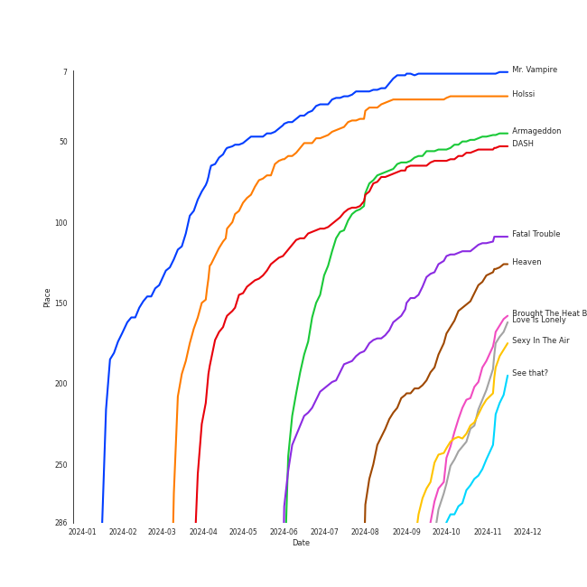

# Tracks in On Repeat from 2024

## Artists

| Art | Rank | Tracks | 💚 | Artist | 🔗 |
|:---|---:|---:|---:|:---|:---|
|  | 1 | 6 | 6 | [aespa](../../../artists/aespa/overview.md) | [🔗](https://open.spotify.com/artist/6YVMFz59CuY7ngCxTxjpxE) |
|  | 18 | 4 | 4 | [NMIXX](../../../artists/nmixx/overview.md) | [🔗](https://open.spotify.com/artist/28ot3wh4oNmoFOdVajibBl) |
|  | 7 | 2 | 2 | [ENHYPEN](../../../artists/enhypen/overview.md) | [🔗](https://open.spotify.com/artist/5t5FqBwTcgKTaWmfEbwQY9) |
|  | 2 | 2 | 2 | [Red Velvet](../../../artists/red_velvet/overview.md) | [🔗](https://open.spotify.com/artist/1z4g3DjTBBZKhvAroFlhOM) |
|  | 68 | 1 | 1 | JEON SOMI | [🔗](https://open.spotify.com/artist/7zYj9S9SdIunYCfSm7vzAR) |
|  | 13 | 1 | 1 | [LE SSERAFIM](../../../artists/le_sserafim/overview.md) | [🔗](https://open.spotify.com/artist/4SpbR6yFEvexJuaBpgAU5p) |
|  | 8 | 1 | 1 | [TAEYEON](../../../artists/taeyeon/overview.md) | [🔗](https://open.spotify.com/artist/3qNVuliS40BLgXGxhdBdqu) |
|  | 42 | 1 | 1 | [EVERGLOW](../../../artists/everglow/overview.md) | [🔗](https://open.spotify.com/artist/3ZZzT0naD25RhY2uZvIKkJ) |
|  | 56 | 1 | 1 | HYO | [🔗](https://open.spotify.com/artist/3U7bOaJLuFkrmDQ1C1OqKl) |
|  | 3 | 1 | 1 | [IU](../../../artists/iu/overview.md) | [🔗](https://open.spotify.com/artist/3HqSLMAZ3g3d5poNaI7GOU) |

View all

| Art | Rank | Tracks | 💚 | Artist | 🔗 |
|:---|---:|---:|---:|:---|:---|
|  | 246 | 1 | 1 | pH-1 | [🔗](https://open.spotify.com/artist/2u7CP5T30c8ctenzXgEV1W) |
|  | 5 | 1 | 1 | [ITZY](../../../artists/itzy/overview.md) | [🔗](https://open.spotify.com/artist/2KC9Qb60EaY0kW4eH68vr3) |
|  | 105 | 1 | 1 | JENNIE | [🔗](https://open.spotify.com/artist/250b0Wlc5Vk0CoUsaCY84M) |
|  | 173 | 1 | 1 | fromis_9 | [🔗](https://open.spotify.com/artist/24nUVBIlCGi4twz4nYxJum) |
|  | 90 | 1 | 1 | [OH MY GIRL](../../../artists/oh_my_girl/overview.md) | [🔗](https://open.spotify.com/artist/2019zR22qK2RBvCqtudBaI) |
|  | 147 | 1 | 1 | TZUYU | [🔗](https://open.spotify.com/artist/1arCVYXeStgCY2UazBNBLK) |
|  | 59 | 1 | 1 | [TAEMIN](../../../artists/taemin/overview.md) | [🔗](https://open.spotify.com/artist/13rF01aOogvnkuQXOlgTW8) |

## Albums

| Art | Rank | Tracks | 💚 | Album | Release Date | 🔗 |
|:---|---:|---:|---:|:---|:---|:---|
|  | 307 | 3 | 3 | SYNK : PARALLEL LINE - Special Digital Single | 2024-10-09 | [🔗](https://open.spotify.com/album/4vLGHlTnlIIxMSfefCY0cU) |
|  | 133 | 3 | 3 | Fe3O4: STICK OUT | 2024-08-19 | [🔗](https://open.spotify.com/album/2pb2RscdByJ8pc7dPT1SY2) |
|  | 71 | 2 | 2 | Cosmic | 2024-06-24 | [🔗](https://open.spotify.com/album/5E8apoFsaUFhZxGGSju6aW) |
|  | 8 | 2 | 2 | Armageddon - The 1st Album | 2024-05-26 | [🔗](https://open.spotify.com/album/4SboBpuYojDm02qS4iFeJC) |
|  | 201 | 1 | 1 | abouTZU | 2024-09-06 | [🔗](https://open.spotify.com/album/0Xj4fXPKV0h6KhGQbUkDvy) |
|  | 499 | 1 | 1 | ZOMBIE | 2024-06-10 | [🔗](https://open.spotify.com/album/6vGrWJmYXU9VqiqpOwPJ2r) |
|  | 18 | 1 | 1 | The Winning | 2024-02-20 | [🔗](https://open.spotify.com/album/08CvAj58nVMpq1Nw7T6maj) |
|  | 213 | 1 | 1 | Supersonic | 2024-08-12 | [🔗](https://open.spotify.com/album/1sxOavrEVy7krHpcbCsiJi) |
|  | 404 | 1 | 1 | Retro Romance | 2024-09-26 | [🔗](https://open.spotify.com/album/2G7tH2r50gCP2HYGsVG9UN) |
|  | 114 | 1 | 1 | ROMANCE : UNTOLD | 2024-07-12 | [🔗](https://open.spotify.com/album/05I8FltCMnGa3kE38mpOkL) |

View all

| Art | Rank | Tracks | 💚 | Album | Release Date | 🔗 |
|:---|---:|---:|---:|:---|:---|:---|
|  | 509 | 1 | 1 | Mantra | 2024-10-10 | [🔗](https://open.spotify.com/album/3e5tDT1kfaAGx10yOjIDgW) |
|  | 162 | 1 | 1 | Ice Cream | 2024-08-02 | [🔗](https://open.spotify.com/album/5Q41ZTpaEpDVtgu1yAtAPR) |
|  | 185 | 1 | 1 | Hot Mess | 2024-07-03 | [🔗](https://open.spotify.com/album/2PvpuCui1GVO8DkFcCHzYU) |
|  | 118 | 1 | 1 | Heaven | 2024-07-08 | [🔗](https://open.spotify.com/album/68taLckvPxHRtNa8QjQJ5e) |
|  | 25 | 1 | 1 | Fe3O4: BREAK | 2024-01-15 | [🔗](https://open.spotify.com/album/5CCxLQgcI7cVwmgFDlicbP) |
|  | 154 | 1 | 1 | ETERNAL | 2024-08-19 | [🔗](https://open.spotify.com/album/13M8K1l146FLdFoObJIVj9) |
|  | 206 | 1 | 1 | Dreamy Resonance | 2024-08-26 | [🔗](https://open.spotify.com/album/4XZFgEjQ4Un1TNHAtTC87m) |
|  | 87 | 1 | 1 | DARK MOON SPECIAL ALBUM <MEMORABILIA> | 2024-05-13 | [🔗](https://open.spotify.com/album/0OhJwEzXbK9Km6GQSPdmPU) |
|  | 175 | 1 | 1 | CRAZY | 2024-08-30 | [🔗](https://open.spotify.com/album/538vEfAgLJ6g2I8ubuOlap) |
|  | 7 | 1 | 1 | BORN TO BE | 2024-01-08 | [🔗](https://open.spotify.com/album/3cm3EkNQLpKu58btSJT7fz) |

## Tracks

| Art | Track | Album | Artists | Label | Rank | 💚 | 🔗 |
|:---|:---|:---|:---|:---|---:|:---|:---|
|  | Mr. Vampire | BORN TO BE | [ITZY](../../../artists/itzy/overview.md) | [Republic Records](../../../labels/republic_records) | 8 | 💚 | [🔗](https://open.spotify.com/track/3uI6jqO0fFBoFryc8SJOXw) |
|  | Holssi | The Winning | [IU](../../../artists/iu/overview.md) | [EDAM Entertainment](../../../labels/edam_entertainment) | 22 | 💚 | [🔗](https://open.spotify.com/track/0UTtK6hregIBOsefavRI26) |
|  | Armageddon | Armageddon - The 1st Album | [aespa](../../../artists/aespa/overview.md) | [SM Entertainment](../../../labels/sm_entertainment) | 50 | 💚 | [🔗](https://open.spotify.com/track/4b2fMv44GAYpsDSK4ihbsI) |
|  | DASH | Fe3O4: BREAK | [NMIXX](../../../artists/nmixx/overview.md) | [Republic Records](../../../labels/republic_records) | 57 | 💚 | [🔗](https://open.spotify.com/track/2RoYgkPzUY0vY7lhUuyus1) |
|  | Supernova | Armageddon - The 1st Album | [aespa](../../../artists/aespa/overview.md) | [SM Entertainment](../../../labels/sm_entertainment) | 84 | 💚 | [🔗](https://open.spotify.com/track/5lKnZbdGCBViitE1Ce5TZh) |
|  | Fatal Trouble | DARK MOON SPECIAL ALBUM <MEMORABILIA> | [ENHYPEN](../../../artists/enhypen/overview.md) | [BELIFT LAB](../../../labels/belift_lab) | 118 | 💚 | [🔗](https://open.spotify.com/track/6i1PYoUEMHqxAsAUKHkqpe) |
|  | Cosmic | Cosmic | [Red Velvet](../../../artists/red_velvet/overview.md) | [SM Entertainment](../../../labels/sm_entertainment) | 121 | 💚 | [🔗](https://open.spotify.com/track/0kE4TRJ0pWoRKzKdtbx8To) |
|  | Heaven | Heaven | [TAEYEON](../../../artists/taeyeon/overview.md) | [SM Entertainment](../../../labels/sm_entertainment) | 151 | 💚 | [🔗](https://open.spotify.com/track/1fCKxY62wMnayTNSr3S3GN) |
|  | Love Arcade | Cosmic | [Red Velvet](../../../artists/red_velvet/overview.md) | [SM Entertainment](../../../labels/sm_entertainment) | 199 | 💚 | [🔗](https://open.spotify.com/track/10BVwlzgtLNDE7mE8frtmd) |
|  | Brought The Heat Back | ROMANCE : UNTOLD | [ENHYPEN](../../../artists/enhypen/overview.md) | [BELIFT LAB](../../../labels/belift_lab) | 210 | 💚 | [🔗](https://open.spotify.com/track/3ivdlmTbUSv5JN9W8Tk9V1) |

View all

| Art | Track | Album | Artists | Label | Rank | 💚 | 🔗 |
|:---|:---|:---|:---|:---|---:|:---|:---|
|  | Ice Cream | Ice Cream | JEON SOMI | THEBLACKLABEL | 215 | 💚 | [🔗](https://open.spotify.com/track/6rXZhduf6TZb1mS1RjkHQ0) |
|  | Sexy In The Air | ETERNAL | [TAEMIN](../../../artists/taemin/overview.md) | BIGPLANETMADE | 231 | 💚 | [🔗](https://open.spotify.com/track/3wluV5HGCW1Dq1CYsjIdLu) |
|  | Love Is Lonely | Fe3O4: STICK OUT | [NMIXX](../../../artists/nmixx/overview.md) | [Republic Records](../../../labels/republic_records) | 236 | 💚 | [🔗](https://open.spotify.com/track/4IAjCbrxOPyfMqbVasSjwc) |
|  | CRAZY | CRAZY | [LE SSERAFIM](../../../artists/le_sserafim/overview.md) | [SOURCE MUSIC](../../../labels/source_music) | 241 | 💚 | [🔗](https://open.spotify.com/track/3AoEQRuFf8zVXWqSLo2UOi) |
|  | BEAT BEAT | Fe3O4: STICK OUT | [NMIXX](../../../artists/nmixx/overview.md) | [Republic Records](../../../labels/republic_records) | 254 | 💚 | [🔗](https://open.spotify.com/track/3P8l7sbL5dxKlS4gcJ1qJI) |
|  | Hot Mess | Hot Mess | [aespa](../../../artists/aespa/overview.md) | [WM Japan](../../../labels/wm_japan) | 255 | 💚 | [🔗](https://open.spotify.com/track/1SaLI6o5GhfcaxPVAJoD3r) |
|  | See that? | Fe3O4: STICK OUT | [NMIXX](../../../artists/nmixx/overview.md) | [Republic Records](../../../labels/republic_records) | 266 | 💚 | [🔗](https://open.spotify.com/track/3Zice5cXhiPVLwrdBJlyHc) |
|  | Classified | Dreamy Resonance | [OH MY GIRL](../../../artists/oh_my_girl/overview.md) | [WM ENTERTAINMENT INC.](../../../labels/wm_entertainment) | 284 | 💚 | [🔗](https://open.spotify.com/track/3zNqNoFNpPoXYrYJzCedzv) |
|  | Supersonic | Supersonic | fromis_9 | [PLEDIS Entertainment](../../../labels/pledis_entertainment) | 291 | 💚 | [🔗](https://open.spotify.com/track/6oNLSQX8bcAdbCElZYju3v) |
|  | Lazy Baby (Feat. pH-1) | abouTZU | TZUYU, pH-1 | Republic Records – TZUYU (TWICE) | 433 | 💚 | [🔗](https://open.spotify.com/track/7CYnDrufyGMIHCMGVZ3usQ) |
|  | Bored! - NINGNING Solo | SYNK : PARALLEL LINE - Special Digital Single | [aespa](../../../artists/aespa/overview.md) | [SM Entertainment](../../../labels/sm_entertainment) | 560 | 💚 | [🔗](https://open.spotify.com/track/44qlcokPO2RjD8791ohJFR) |
|  | Retro Romance | Retro Romance | HYO | [SM Entertainment](../../../labels/sm_entertainment) | 601 | 💚 | [🔗](https://open.spotify.com/track/0V7Hp8ZnDlaYasJoNtcExF) |
|  | Spark - WINTER Solo | SYNK : PARALLEL LINE - Special Digital Single | [aespa](../../../artists/aespa/overview.md) | [SM Entertainment](../../../labels/sm_entertainment) | 727 | 💚 | [🔗](https://open.spotify.com/track/2xoA126GEgFhrYzRaTH7E4) |
|  | Mantra | Mantra | JENNIE | [OA Entertainment/Columbia](../../../labels/columbia) | 766 | 💚 | [🔗](https://open.spotify.com/track/2CspwnypzT7rcWI9RfsoSb) |
|  | UP - KARINA Solo | SYNK : PARALLEL LINE - Special Digital Single | [aespa](../../../artists/aespa/overview.md) | [SM Entertainment](../../../labels/sm_entertainment) | 776 | 💚 | [🔗](https://open.spotify.com/track/5sjnkOfTLCLNfkkchI2re2) |
|  | Colourz | ZOMBIE | [EVERGLOW](../../../artists/everglow/overview.md) | [Genie Music Corporation](../../../labels/genie_music_corporation), [Stone Music Entertainment](../../../labels/stone_music_entertainment) | 943 | 💚 | [🔗](https://open.spotify.com/track/5y6iVRaRIbiLbTj2eUM2WL) |

