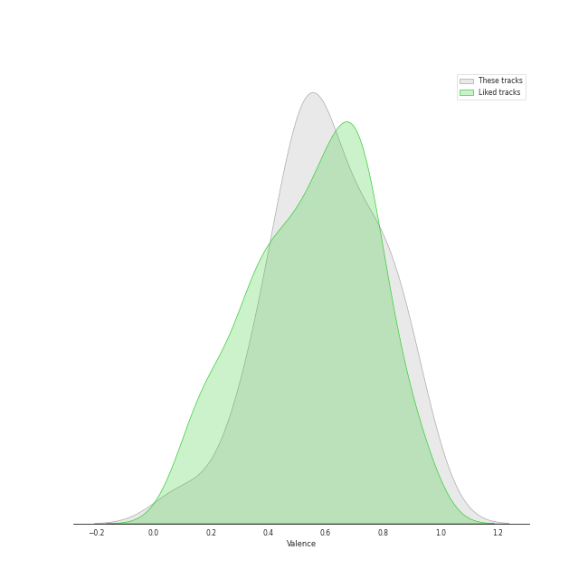

# Track Features for On Repeat

## Danceability

| ​ | 10 most Danceable tracks | ​​ | 10 least Danceable tracks |
|:---|:---|:---|:---|
|  | BATTER UP (0.903) |  | Regret of the Times - 2024 aespa Remake Version (0.472) |
|  | Wife (0.899) |  | Love wins all (0.496) |
|  | Soñar (Breaker) (0.86) |  | Chill Kill (0.531) |
|  | Sweet Venom (0.84) |  | Holssi (0.536) |
|  | To. X (0.835) |  | Bad News (0.581) |
|  | TAP (0.804) |  | Over You (feat. aespa & Chris Martin) (0.586) |
|  | Super Lady (0.795) |  | Underwater (0.59) |
|  | UNTOUCHABLE (0.762) |  | ONE SPARK (0.592) |
|  | Wish You Hell (0.754) |  | Shopper (0.6) |
|  | BLOOM (0.746) |  | BORN TO BE (0.613) |

## Energy

| ​ | 10 most Energetic tracks | ​​ | 10 least Energetic tracks |
|:---|:---|:---|:---|
|  | Regret of the Times - 2024 aespa Remake Version (0.914) |  | Shopper (0.0423) |
|  | UNTOUCHABLE (0.9) |  | Holssi (0.446) |
|  | TAP (0.873) |  | Love wins all (0.447) |
|  | Drama (0.872) |  | Burn It Down (0.495) |
|  | Super Lady (0.869) |  | To. X (0.587) |
|  | Bad News (0.857) |  | Nobody Knows (0.646) |
|  | BORN TO BE (0.857) |  | Run Away (RYUJIN) (0.663) |
|  | Trick or Trick (0.843) |  | Sweet Venom (0.673) |
|  | DASH (0.83) |  | BATTER UP (0.685) |
|  | One Kiss (0.827) |  | EASY (0.7) |

## Speechiness

| ​ | 10 most Speechy tracks | ​​ | 10 least Speechy tracks |
|:---|:---|:---|:---|
|  | TAP (0.269) |  | Love wins all (0.0317) |
|  | Bad News (0.233) |  | Holssi (0.0336) |
|  | Regret of the Times - 2024 aespa Remake Version (0.185) |  | Wish You Hell (0.0358) |
|  | Trick or Trick (0.143) |  | BLOOM (0.0388) |
|  | DASH (0.138) |  | Drama (0.0417) |
|  | One Kiss (0.127) |  | Sweet Venom (0.0427) |
|  | UNTOUCHABLE (0.127) |  | EASY (0.0507) |
|  | Soñar (Breaker) (0.123) |  | Shopper (0.0518) |
|  | Nobody Knows (0.116) |  | Over You (feat. aespa & Chris Martin) (0.0518) |
|  | Super Lady (0.116) |  | BORN TO BE (0.0605) |

## Acousticness

| ​ | 10 most Acoustic tracks | ​​ | 10 least Acoustic tracks |
|:---|:---|:---|:---|
|  | Shopper (0.949) |  | Regret of the Times - 2024 aespa Remake Version (0.00279) |
|  | Love wins all (0.82) |  | ONE SPARK (0.0151) |
|  | Holssi (0.806) |  | TAP (0.0176) |
|  | One Kiss (0.465) |  | Wife (0.0264) |
|  | BLOOM (0.412) |  | Sweet Venom (0.0426) |
|  | To. X (0.396) |  | BORN TO BE (0.0513) |
|  | Burn It Down (0.364) |  | Wish You Hell (0.0514) |
|  | Mr. Vampire (0.313) |  | Chill Kill (0.0549) |
|  | Over You (feat. aespa & Chris Martin) (0.306) |  | BATTER UP (0.069) |
|  | Underwater (0.281) |  | DASH (0.0843) |

## Instrumentalness

| ​ | 10 most Instrumental tracks | ​​ | 10 least Instrumental tracks |
|:---|:---|:---|:---|
|  | Wife (0.00222) |  | Holssi (0.0) |
|  | TAP (0.00066) |  | Shopper (0.0) |
|  | Regret of the Times - 2024 aespa Remake Version (5.8e-05) |  | UNTOUCHABLE (0.0) |
|  | Trick or Trick (4.23e-05) |  | DASH (0.0) |
|  | Wish You Hell (1.49e-05) |  | Sweet Venom (0.0) |
|  | BLOOM (1.26e-05) |  | Don't Blink (0.0) |
|  | BATTER UP (1.12e-05) |  | Mr. Vampire (0.0) |
|  | To. X (4.09e-06) |  | BORN TO BE (0.0) |
|  | EASY (2.74e-06) |  | Love wins all (0.0) |
|  | Burn It Down (2.55e-06) |  | Underwater (0.0) |

## Liveness

| ​ | 10 most Live tracks | ​​ | 10 least Live tracks |
|:---|:---|:---|:---|
|  | ONE SPARK (0.753) |  | BORN TO BE (0.037) |
|  | Mr. Vampire (0.479) |  | TAP (0.0375) |
|  | Holssi (0.396) |  | DASH (0.0605) |
|  | Don't Blink (0.384) |  | Burn It Down (0.0817) |
|  | Drama (0.363) |  | Soñar (Breaker) (0.082) |
|  | Regret of the Times - 2024 aespa Remake Version (0.342) |  | UNTOUCHABLE (0.0837) |
|  | Wife (0.342) |  | To. X (0.0862) |
|  | Over You (feat. aespa & Chris Martin) (0.333) |  | Trick or Trick (0.0916) |
|  | Shopper (0.301) |  | Sweet Venom (0.0971) |
|  | Wish You Hell (0.268) |  | Love wins all (0.098) |

## Valence

| ​ | 10 most Happy tracks | ​​ | 10 least Happy tracks |
|:---|:---|:---|:---|
|  | Nobody Knows (0.927) |  | Holssi (0.271) |
|  | Sweet Venom (0.911) |  | Shopper (0.311) |
|  | Bad News (0.879) |  | Love wins all (0.315) |
|  | BATTER UP (0.873) |  | Regret of the Times - 2024 aespa Remake Version (0.372) |
|  | TAP (0.853) |  | Drama (0.378) |
|  | Run Away (RYUJIN) (0.827) |  | ONE SPARK (0.413) |
|  | Over You (feat. aespa & Chris Martin) (0.806) |  | Underwater (0.414) |
|  | Soñar (Breaker) (0.787) |  | Chill Kill (0.434) |
|  | BORN TO BE (0.754) |  | Mr. Vampire (0.477) |
|  | DASH (0.725) |  | Super Lady (0.525) |

## Tempo

| ​ | 10 most Fast tracks | ​​ | 10 least Fast tracks |
|:---|:---|:---|:---|
|  | One Kiss (180.058) |  | Shopper (75.732) |
|  | DASH (179.977) |  | Over You (feat. aespa & Chris Martin) (80.044) |
|  | Mr. Vampire (173.873) |  | Bad News (83.687) |
|  | ONE SPARK (169.005) |  | TAP (87.94) |
|  | BORN TO BE (168.111) |  | Nobody Knows (90.055) |
|  | EASY (165.004) |  | Don't Blink (93.027) |
|  | Run Away (RYUJIN) (160.09) |  | Burn It Down (93.877) |
|  | Trick or Trick (159.0) |  | To. X (97.03) |
|  | Regret of the Times - 2024 aespa Remake Version (152.047) |  | Wish You Hell (100.009) |
|  | Chill Kill (148.039) |  | Love wins all (101.132) |
