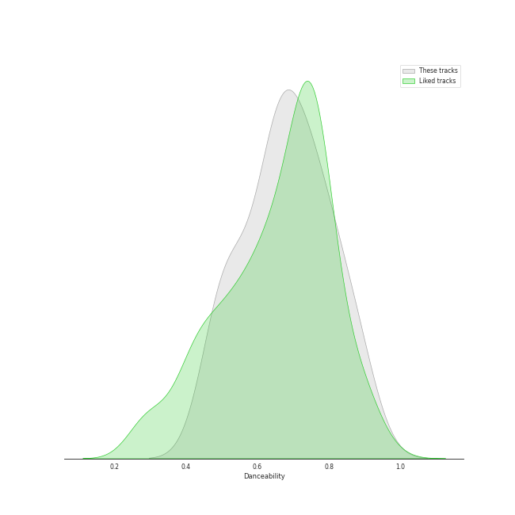
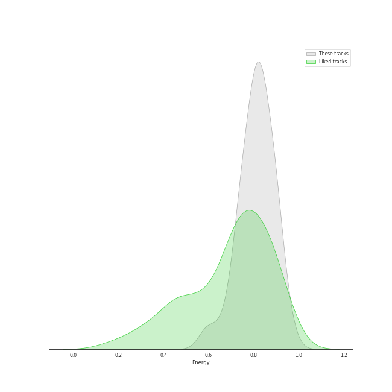
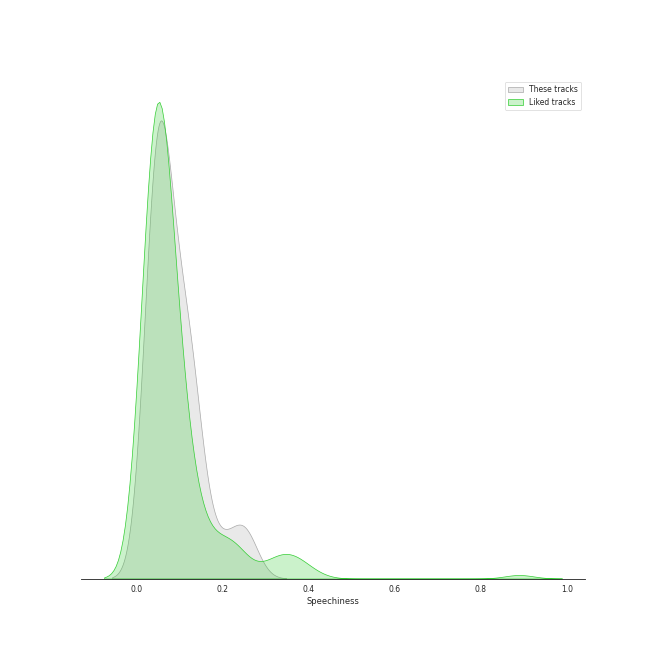
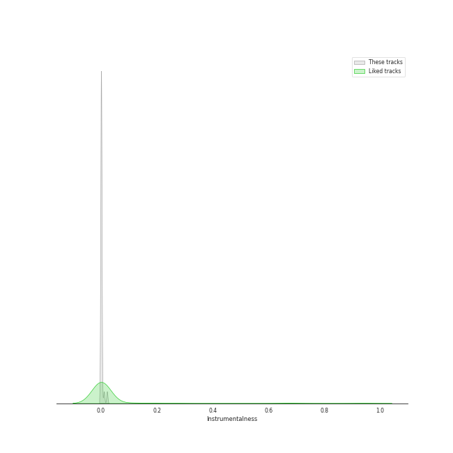

# Track Features for On Repeat

## Danceability

| ​ | 10 most Danceable tracks | ​​ | 10 least Danceable tracks |
|:---|:---|:---|:---|
|  | Dangerous (0.888) |  | Paranoid Android (0.251) |
|  | Rooftop (0.852) |  | Never Let Me Go (0.461) |
|  | Sweet Venom (0.84) |  | Regret of the Times - 2024 aespa Remake Version (0.472) |
|  | To. X (0.835) |  | Love wins all (0.496) |
|  | EENIE MEENIE (Feat. Hongjoong of ATEEZ) (0.819) |  | Holssi (0.536) |
|  | TAP (0.804) |  | Daisy (0.563) |
|  | Die Trying (0.803) |  | Shopper (0.6) |
|  | Smoothie (0.803) |  | BORN TO BE (0.613) |
|  | Officially Cool (0.796) |  | Mr. Vampire (0.63) |
|  | Midas Touch (0.796) |  | One Kiss (0.639) |

## Energy

| ​ | 10 most Energetic tracks | ​​ | 10 least Energetic tracks |
|:---|:---|:---|:---|
|  | Rooftop (0.922) |  | Shopper (0.0423) |
|  | Regret of the Times - 2024 aespa Remake Version (0.914) |  | Holssi (0.446) |
|  | UNTOUCHABLE (0.9) |  | Love wins all (0.447) |
|  | Midas Touch (0.9) |  | To. X (0.587) |
|  | TAP (0.873) |  | Officially Cool (0.589) |
|  | Drama (0.872) |  | Nobody Knows (0.646) |
|  | Daisy (0.869) |  | Dangerous (0.652) |
|  | BORN TO BE (0.857) |  | Psycho (0.666) |
|  | Paranoid Android (0.848) |  | Sweet Venom (0.673) |
|  | DASH (0.83) |  | Sunny Side Up! (0.694) |

## Speechiness

| ​ | 10 most Speechy tracks | ​​ | 10 least Speechy tracks |
|:---|:---|:---|:---|
|  | TAP (0.269) |  | Love wins all (0.0317) |
|  | EENIE MEENIE (Feat. Hongjoong of ATEEZ) (0.198) |  | Holssi (0.0336) |
|  | Regret of the Times - 2024 aespa Remake Version (0.185) |  | Wish You Hell (0.0358) |
|  | Rooftop (0.179) |  | Never Let Me Go (0.0371) |
|  | SHEESH (0.169) |  | Officially Cool (0.0378) |
|  | Smoothie (0.164) |  | BLOOM (0.0388) |
|  | DASH (0.138) |  | Drama (0.0417) |
|  | One Kiss (0.127) |  | Sweet Venom (0.0427) |
|  | UNTOUCHABLE (0.127) |  | Psycho (0.0446) |
|  | Nobody Knows (0.116) |  | Shopper (0.0518) |

## Acousticness

| ​ | 10 most Acoustic tracks | ​​ | 10 least Acoustic tracks |
|:---|:---|:---|:---|
|  | Shopper (0.949) |  | Regret of the Times - 2024 aespa Remake Version (0.00279) |
|  | Love wins all (0.82) |  | Smoothie (0.00923) |
|  | Holssi (0.806) |  | Die Trying (0.0163) |
|  | One Kiss (0.465) |  | TAP (0.0176) |
|  | BLOOM (0.412) |  | Get Goin' (0.0339) |
|  | To. X (0.396) |  | Daisy (0.0362) |
|  | Rooftop (0.314) |  | Paranoid Android (0.0377) |
|  | Mr. Vampire (0.313) |  | Sweet Venom (0.0426) |
|  | Never Let Me Go (0.295) |  | Midas Touch (0.0513) |
|  | Officially Cool (0.283) |  | BORN TO BE (0.0513) |

## Instrumentalness

| ​ | 10 most Instrumental tracks | ​​ | 10 least Instrumental tracks |
|:---|:---|:---|:---|
|  | Die Trying (0.143) |  | Holssi (0.0) |
|  | Paranoid Android (0.00591) |  | Midas Touch (0.0) |
|  | TAP (0.00066) |  | Daisy (0.0) |
|  | Regret of the Times - 2024 aespa Remake Version (5.8e-05) |  | Shopper (0.0) |
|  | Wish You Hell (1.49e-05) |  | SHEESH (0.0) |
|  | BLOOM (1.26e-05) |  | UNTOUCHABLE (0.0) |
|  | Never Let Me Go (4.31e-06) |  | DASH (0.0) |
|  | To. X (4.09e-06) |  | Sweet Venom (0.0) |
|  | One Kiss (1.67e-06) |  | Smoothie (0.0) |
|  | Nobody Knows (0.0) |  | Rooftop (0.0) |

## Liveness

| ​ | 10 most Live tracks | ​​ | 10 least Live tracks |
|:---|:---|:---|:---|
|  | Rooftop (0.561) |  | BORN TO BE (0.037) |
|  | Mr. Vampire (0.479) |  | TAP (0.0375) |
|  | Officially Cool (0.457) |  | SHEESH (0.0473) |
|  | Holssi (0.396) |  | Paranoid Android (0.0545) |
|  | Never Let Me Go (0.383) |  | EENIE MEENIE (Feat. Hongjoong of ATEEZ) (0.0558) |
|  | Drama (0.363) |  | DASH (0.0605) |
|  | Regret of the Times - 2024 aespa Remake Version (0.342) |  | UNTOUCHABLE (0.0837) |
|  | Shopper (0.301) |  | Psycho (0.0854) |
|  | Wish You Hell (0.268) |  | To. X (0.0862) |
|  | One Kiss (0.166) |  | Get Goin' (0.088) |

## Valence

| ​ | 10 most Happy tracks | ​​ | 10 least Happy tracks |
|:---|:---|:---|:---|
|  | Nobody Knows (0.927) |  | Paranoid Android (0.207) |
|  | Sweet Venom (0.911) |  | Die Trying (0.24) |
|  | Dangerous (0.905) |  | Never Let Me Go (0.253) |
|  | Midas Touch (0.854) |  | Holssi (0.271) |
|  | TAP (0.853) |  | Shopper (0.311) |
|  | Get Goin' (0.787) |  | Love wins all (0.315) |
|  | BORN TO BE (0.754) |  | Regret of the Times - 2024 aespa Remake Version (0.372) |
|  | Officially Cool (0.732) |  | Drama (0.378) |
|  | DASH (0.725) |  | Smoothie (0.39) |
|  | BLOOM (0.707) |  | Psycho (0.405) |

## Tempo

| ​ | 10 most Fast tracks | ​​ | 10 least Fast tracks |
|:---|:---|:---|:---|
|  | One Kiss (180.058) |  | Shopper (75.732) |
|  | DASH (179.977) |  | Daisy (85.016) |
|  | Mr. Vampire (173.873) |  | TAP (87.94) |
|  | BORN TO BE (168.111) |  | Nobody Knows (90.055) |
|  | Paranoid Android (163.709) |  | To. X (97.03) |
|  | Regret of the Times - 2024 aespa Remake Version (152.047) |  | EENIE MEENIE (Feat. Hongjoong of ATEEZ) (99.892) |
|  | Never Let Me Go (145.197) |  | Rooftop (99.97) |
|  | Die Trying (145.042) |  | Wish You Hell (100.009) |
|  | SHEESH (140.041) |  | Officially Cool (100.059) |
|  | Psycho (139.987) |  | Love wins all (101.132) |
