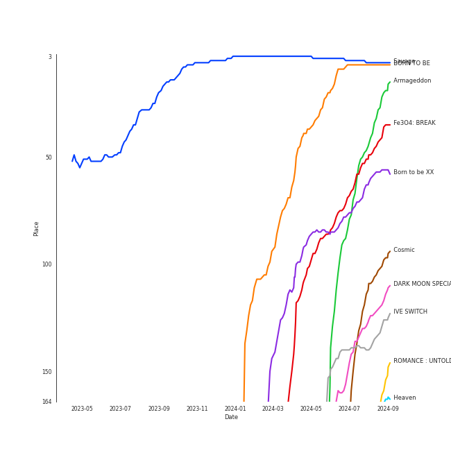

# On Repeat

[30 tracks (29 liked) 🔗](https://open.spotify.com/playlist/37i9dQZF1EpoN98LF1Ruyl)

[See Track Features](audio_features.md)

[See Clusters](clusters/overview.md)

## Top Artists

| Art | Rank | Tracks | 💚 | Artist | 🔗 |
|:---|---:|---:|---:|:---|:---|
|  | 1 | 7 | 7 | [aespa](../../artists/aespa/overview.md) | [🔗](https://open.spotify.com/artist/6YVMFz59CuY7ngCxTxjpxE) |
|  | 2 | 4 | 3 | [Red Velvet](../../artists/red_velvet/overview.md) | [🔗](https://open.spotify.com/artist/1z4g3DjTBBZKhvAroFlhOM) |
|  | 18 | 3 | 3 | [IVE](../../artists/ive/overview.md) | [🔗](https://open.spotify.com/artist/6RHTUrRF63xao58xh9FXYJ) |
|  | 7 | 2 | 2 | [ENHYPEN](../../artists/enhypen/overview.md) | [🔗](https://open.spotify.com/artist/5t5FqBwTcgKTaWmfEbwQY9) |
|  | 56 | 2 | 2 | [KISS OF LIFE](../../artists/kiss_of_life/overview.md) | [🔗](https://open.spotify.com/artist/4TEK9tIkcoxib4GxT3O4ky) |
|  | 5 | 2 | 2 | [ITZY](../../artists/itzy/overview.md) | [🔗](https://open.spotify.com/artist/2KC9Qb60EaY0kW4eH68vr3) |
|  | 103 | 2 | 2 | [YUQI](../../artists/yuqi/overview.md) | [🔗](https://open.spotify.com/artist/22aCD8IrQZjcPgZw728QT6) |
|  | 9 | 1 | 1 | [TWICE](../../artists/twice/overview.md) | [🔗](https://open.spotify.com/artist/7n2Ycct7Beij7Dj7meI4X0) |
|  | 151 | 1 | 1 | Lexie Liu | [🔗](https://open.spotify.com/artist/6fs2or0cKLEM2xohWq8SoX) |
|  | 8 | 1 | 1 | [TAEYEON](../../artists/taeyeon/overview.md) | [🔗](https://open.spotify.com/artist/3qNVuliS40BLgXGxhdBdqu) |

See all 17 artists

| Art | Rank | Tracks | 💚 | Artist | 🔗 |
|:---|---:|---:|---:|:---|:---|
|  | 74 | 1 | 1 | [WINTER](../../artists/winter/overview.md) | [🔗](https://open.spotify.com/artist/3mPquBmMu97Iq9TpzQ6ayI) |
|  | 4 | 1 | 1 | [IU](../../artists/iu/overview.md) | [🔗](https://open.spotify.com/artist/3HqSLMAZ3g3d5poNaI7GOU) |
|  | 88 | 1 | 1 | RIIZE | [🔗](https://open.spotify.com/artist/2jOm3cYujQx6o1dxuiuqaX) |
|  | 27 | 1 | 1 | [NMIXX](../../artists/nmixx/overview.md) | [🔗](https://open.spotify.com/artist/28ot3wh4oNmoFOdVajibBl) |
|  | 127 | 1 | 1 | Steam Powered Giraffe | [🔗](https://open.spotify.com/artist/1yqs45BSh7457Flyhmdv7f) |
|  | 108 | 1 | 1 | BANG YEDAM | [🔗](https://open.spotify.com/artist/1slszTGbkp1uNnI6G5uD0X) |
|  | 191 | 1 | 1 | NAYEON | [🔗](https://open.spotify.com/artist/1VwDG9aBflQupaFNjUru9A) |

## Top Tracks

Most and least listened tracks

| Rank | ​ | Most listened tracks | Rank | ​​ | Least listened tracks |
|---:|:---|:---|---:|:---|:---|
| 27 |  | [Mr. Vampire](../../artists/itzy/overview.md) | 500 |  | [ELEVEN](../../artists/ive/overview.md) |
| 49 |  | [Holssi](../../artists/iu/overview.md) | 463 |  | [Last Drop](../../artists/red_velvet/overview.md) |
| 53 |  | [Sweet Venom](../../artists/enhypen/overview.md) | 440 |  | ABCD |
| 80 |  | [Nobody Knows](../../artists/kiss_of_life/overview.md) | 437 |  | Boom Boom Bass |
| 107 |  | [DASH](../../artists/nmixx/overview.md) | 351 |  | [Love Arcade](../../artists/red_velvet/overview.md) |
| 131 |  | [Armageddon](../../artists/aespa/overview.md) | 335 |  | [Live My Life](../../artists/aespa/overview.md) |
| 159 |  | Officially Cool | 304 |  | [FANCY](../../artists/twice/overview.md) |
| 173 |  | [Supernova](../../artists/aespa/overview.md) | 299 |  | [Cosmic](../../artists/red_velvet/overview.md) |
| 184 |  | [Midas Touch](../../artists/kiss_of_life/overview.md) | 285 |  | [In the morning](../../artists/itzy/overview.md) |
| 196 |  | [INVU](../../artists/taeyeon/overview.md) | 281 |  | [Sunflower](../../artists/red_velvet/overview.md) |

## Top Albums

| Art | Rank | Tracks | 💚 | Album | Release Date | 🔗 |
|:---|---:|---:|---:|:---|:---|:---|
|  | 77 | 7 | 7 | Armageddon - The 1st Album | 2024-05-27 | [🔗](https://open.spotify.com/album/058hCti9Bupb5CJc6bd3VB) |
|  | 156 | 4 | 3 | Cosmic | 2024-06-24 | [🔗](https://open.spotify.com/album/5E8apoFsaUFhZxGGSju6aW) |
|  | 146 | 2 | 2 | YUQ1 | 2024-04-23 | [🔗](https://open.spotify.com/album/7LYc8ngbhwha4aGJ5kVauc) |
|  | 139 | 2 | 2 | IVE SWITCH | 2024-04-29 | [🔗](https://open.spotify.com/album/7z61DsZtWO2S4nC5xd0b9p) |
|  | 44 | 1 | 1 | The Winning | 2024-02-20 | [🔗](https://open.spotify.com/album/08CvAj58nVMpq1Nw7T6maj) |
|  | 153 | 1 | 1 | The 2¢ Show | 2012-05-23 | [🔗](https://open.spotify.com/album/4DECRyKlhKJgjZLLuvfAI6) |
|  | 314 | 1 | 1 | RIIZING - The 1st Mini Album | 2024-06-17 | [🔗](https://open.spotify.com/album/23TA2tnqYnphv1MKkiS6x2) |
|  | 122 | 1 | 1 | Officially Cool | 2024-04-02 | [🔗](https://open.spotify.com/album/7ak1PBCmrVLvOANEenebe9) |
|  | 50 | 1 | 1 | ORANGE BLOOD | 2023-11-17 | [🔗](https://open.spotify.com/album/7dsAlxH9cMgyREm8OLdWWT) |
|  | 317 | 1 | 1 | NA | 2024-06-14 | [🔗](https://open.spotify.com/album/5zQI9dFbS9TrhvC9clgjz7) |

See all 19 albums

| Art | Rank | Tracks | 💚 | Album | Release Date | 🔗 |
|:---|---:|---:|---:|:---|:---|:---|
|  | 140 | 1 | 1 | Midas Touch | 2024-04-03 | [🔗](https://open.spotify.com/album/1HfTA0xDoZ0mswFO3GB3ef) |
|  | 39 | 1 | 1 | INVU - The 3rd Album | 2022-02-14 | [🔗](https://open.spotify.com/album/7i2YLTVQ0dyngRuUqtGmr9) |
|  | 207 | 1 | 1 | GUESS WHO | 2021-04-30 | [🔗](https://open.spotify.com/album/4lS8nhX8cplsYPzKjvhw6G) |
|  | 66 | 1 | 1 | Fe3O4: BREAK | 2024-01-15 | [🔗](https://open.spotify.com/album/5CCxLQgcI7cVwmgFDlicbP) |
|  | 223 | 1 | 1 | FANCY YOU | 2019-04-22 | [🔗](https://open.spotify.com/album/3aLpWFejbsdyafODLXRqwF) |
|  | 345 | 1 | 1 | ELEVEN | 2021-12-01 | [🔗](https://open.spotify.com/album/1XMYvsHRt52sMi6wittWqI) |
|  | 142 | 1 | 1 | DARK MOON SPECIAL ALBUM <MEMORABILIA> | 2024-05-13 | [🔗](https://open.spotify.com/album/0OhJwEzXbK9Km6GQSPdmPU) |
|  | 76 | 1 | 1 | Born to be XX | 2023-11-08 | [🔗](https://open.spotify.com/album/6yDtQxvq1XRC7Y5qtS03Xx) |
|  | 7 | 1 | 1 | BORN TO BE | 2024-01-08 | [🔗](https://open.spotify.com/album/3cm3EkNQLpKu58btSJT7fz) |

## Top Record Labels

| Tracks | 💚 | Label |
|---:|---:|:---|
| 13 | 12 | [SM Entertainment](../../labels/sm_entertainment/overview.md) |
| 4 | 4 | [Republic Records](../../labels/republic_records/overview.md) |
| 3 | 3 | [Starship Entertainment](../../labels/starship_entertainment/overview.md) |
| 2 | 2 | [S2 ENTERTAINMENT INC.](../../labels/s2_entertainment_inc_/overview.md) |
| 2 | 2 | [CUBE ENTERTAINMENT](../../labels/cube_entertainment/overview.md) |
| 2 | 2 | [BELIFT LAB](../../labels/belift_lab/overview.md) |
| 1 | 1 | [WM Korea](../../labels/wm_korea/overview.md) |
| 1 | 1 | Steam Powered Giraffe |
| 1 | 1 | Republic Records – NAYEON (TWICE) |
| 1 | 1 | [RCA Records Label](../../labels/rca_records_label/overview.md) |

See all 11 labels

| Tracks | 💚 | Label |
|---:|---:|:---|
| 1 | 1 | [EDAM Entertainment](../../labels/edam_entertainment/overview.md) |

## Genres

| Tracks | 💚 | Genre |
|---:|---:|:---|
| 20 | 19 | [k-pop girl group](../../genres/k-pop_girl_group/overview.md) |
| 11 | 10 | [k-pop](../../genres/k-pop/overview.md) |
| 5 | 5 | [5th gen k-pop](../../genres/5th_gen_k-pop/overview.md) |
| 2 | 2 | [pop](../../genres/pop/overview.md) |
| 2 | 2 | [k-pop boy group](../../genres/k-pop_boy_group/overview.md) |
| 2 | 2 | [anime](../../genres/anime/overview.md) |
| 1 | 1 | steampunk |

## Top Producers

| Art | Producer | Tracks | Credit Types |
|:---|:---|---:|:---|
| | Rick Bridges | 2 | Lyricist |
| | [서지음 (Seo, Ji Eum)](../../producers/서지음_(seo,_ji_eum)/overview.md) | 2 | Lyricist |
| | 정다연 (Jeong, Dayeon) | 1 | Lyricist |
| | 김인 (Kim, In) | 1 | Lyricist |
| | EZIT | 1 | Arranger, Songwriter |
| | PhD | 1 | Arranger |
| | Jess Morgan | 1 | Songwriter |
| | [정은경 (Jung, Eun-Kyung)](../../producers/정은경_(jung,_eun-kyung)/overview.md) | 1 | Producer |
| | 임찬미 (Kim, Chan-mi) | 1 | Producer |
| | Daniel Davidsen | 1 | Songwriter |

View all

| Art | Producer | Tracks | Credit Types |
|:---|:---|---:|:---|
| | 진리 (Jinri) | 1 | Lyricist |
| | Adam von Mentzer | 1 | Songwriter |
| | 오현선 (Oh, Hyun-sun) | 1 | Lyricist |
| | 정유라 (Jeong, Yu-ra) | 1 | Producer |
| | Noémie Legrand (Legrand, Noémie) | 1 | Songwriter |
| | Rachel Furner | 1 | Songwriter |
| | 김영현 (Kim, Young-hyun) | 1 | Producer |
| | PAPRIKAA | 1 | Arranger, Songwriter |
| | 이주형 (Lee, Juhyeong) | 1 | Producer |
| | 서은일 (Seo, Eun-il) | 1 | Producer |
| | 정의석 (Jung, Euisuk) | 1 | Producer |
| | 성유진 (Sung, Yoojin) | 1 | Lyricist |
| | Deza | 1 | Lyricist |
| | 이민규 (Lee, Min-kyu) | 1 | Producer |
| | [조윤경 (Jo, Yoon Kyung)](../../producers/조윤경_(jo,_yoon_kyung)/overview.md) | 1 | Lyricist |
| | 원지애 (Won, Jiae) | 1 | Lyricist |
| | [Tony Maserati](../../producers/tony_maserati/overview.md) | 1 | Producer |
| | [Ryan S. Jhun](../../producers/ryan_s__jhun/overview.md) | 1 | Arranger, Songwriter |
| | PUFF | 1 | Arranger, Songwriter |
| | WKLY | 1 | Lyricist |
| | [엄세희 (Um, Se-Hee)](../../producers/엄세희_(um,_se-hee)/overview.md) | 1 | Producer |
| | [Kriz](../../producers/kriz/overview.md) | 1 | Arranger |
| | Strong Dragon | 1 | Arranger, Songwriter |
| | [라도 (Rado)](../../producers/라도_(rado)/overview.md) | 1 | Lyricist, Songwriter |
| | LOSTBOY | 1 | Arranger, Songwriter |
| | Alawn | 1 | Arranger, Producer |
| | [구혜진 (Gu, Hye-jin)](../../producers/구혜진_(gu,_hye-jin)/overview.md) | 1 | Producer |
| | Melange | 1 | Arranger |
| | 백새임 (Baek, Sae-im) | 1 | Lyricist |
| | 형근 (Hyeongeun) | 1 | Lyricist |
| | Julie Han | 1 | Lyricist |
| | Kobee | 1 | Arranger, Producer, Songwriter |
| | Lauren Aquilina | 1 | Songwriter |
| | C'SA | 1 | Arranger, Producer, Songwriter |
| | Holy M | 1 | Arranger, Songwriter |
| | 임정우 (Im, Jeong-u) | 1 | Songwriter |
| | Sofia Quinn | 1 | Songwriter |
| | [양영은 (Yang, Young-eun)](../../producers/양영은_(yang,_young-eun)/overview.md) | 1 | Producer |
|  | ADORA | 1 | Songwriter |
| | 최규성 (Choi, Kyu-sung) | 1 | Lyricist, Songwriter |

## Years

View all years

| Year | Number of Tracks |
|:---|---:|
| [2024](2024/overview.md) | 23 |
| 2023 | 2 |
| 2022 | 1 |
| 2021 | 2 |
| 2019 | 1 |
| 2012 | 1 |

| ​ | 10 newest albums | ​​ | 10 oldest albums |
|:---|:---|:---|:---|
|  | Cosmic (2024-06-24) |  | The 2¢ Show (2012-05-23) |
|  | RIIZING - The 1st Mini Album (2024-06-17) |  | FANCY YOU (2019-04-22) |
|  | NA (2024-06-14) |  | GUESS WHO (2021-04-30) |
|  | Armageddon - The 1st Album (2024-05-27) |  | ELEVEN (2021-12-01) |
|  | DARK MOON SPECIAL ALBUM <MEMORABILIA> (2024-05-13) |  | INVU - The 3rd Album (2022-02-14) |
|  | IVE SWITCH (2024-04-29) |  | Born to be XX (2023-11-08) |
|  | YUQ1 (2024-04-23) |  | ORANGE BLOOD (2023-11-17) |
|  | Midas Touch (2024-04-03) |  | BORN TO BE (2024-01-08) |
|  | Officially Cool (2024-04-02) |  | Fe3O4: BREAK (2024-01-15) |
|  | The Winning (2024-02-20) |  | The Winning (2024-02-20) |