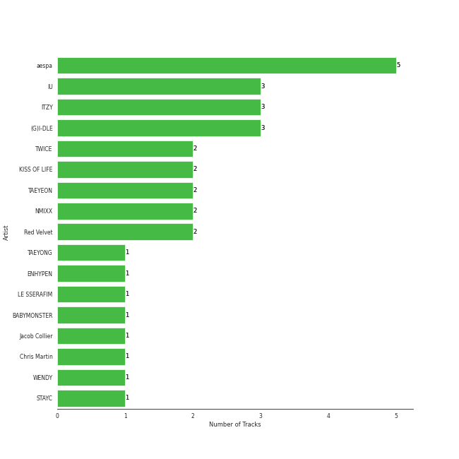
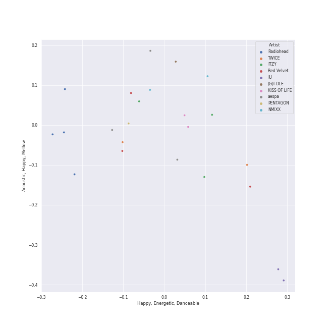
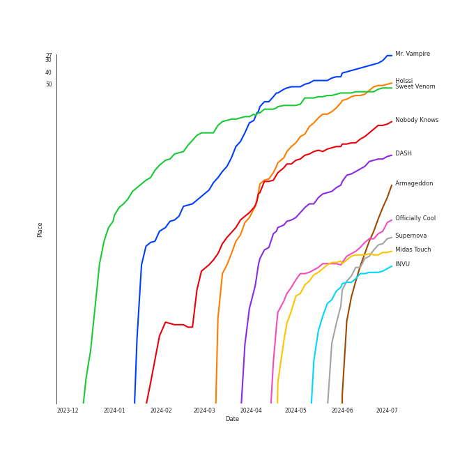
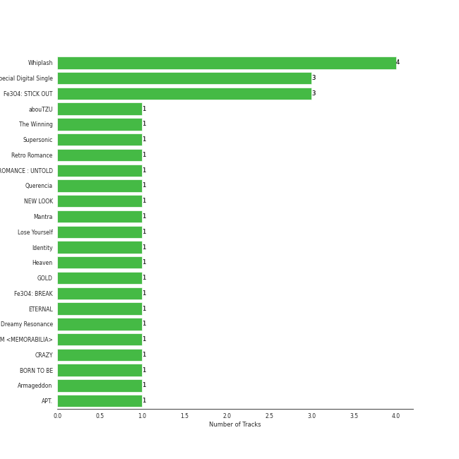
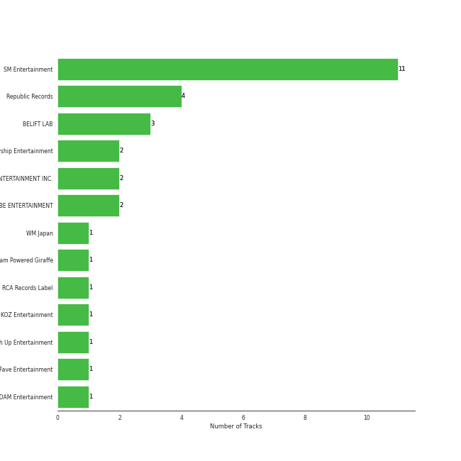
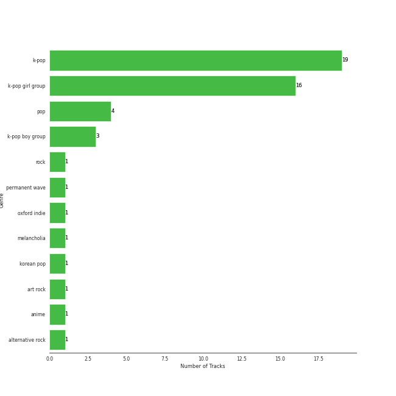
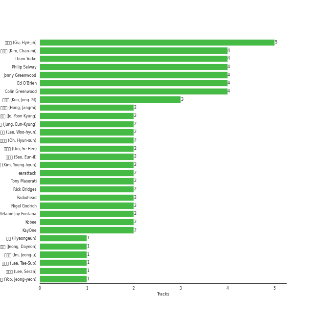
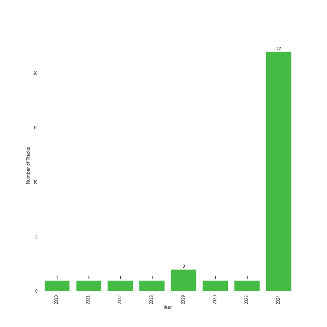

# On Repeat

[30 tracks 🔗](https://open.spotify.com/playlist/37i9dQZF1EpoN98LF1Ruyl)

[See Track Features](audio_features.md)

[See Clusters](clusters/overview.md)

## Top Artists

| Art | Tracks | 💚 | Artist | 🔗 |
|:---|---:|---:|:---|:---|
|  | 4 | 4 | [aespa](../../artists/aespa/overview.md) | [🔗](https://open.spotify.com/artist/6YVMFz59CuY7ngCxTxjpxE) |
|  | 3 | 3 | [Billy Joel](../../artists/billy_joel/overview.md) | [🔗](https://open.spotify.com/artist/6zFYqv1mOsgBRQbae3JJ9e) |
|  | 3 | 3 | [Red Velvet](../../artists/red_velvet/overview.md) | [🔗](https://open.spotify.com/artist/1z4g3DjTBBZKhvAroFlhOM) |
|  | 2 | 2 | [Radiohead](../../artists/radiohead/overview.md) | [🔗](https://open.spotify.com/artist/4Z8W4fKeB5YxbusRsdQVPb) |
|  | 2 | 2 | [KISS OF LIFE](../../artists/kiss_of_life/overview.md) | [🔗](https://open.spotify.com/artist/4TEK9tIkcoxib4GxT3O4ky) |
|  | 1 | 1 | [Kimbra](../../artists/kimbra/overview.md) | [🔗](https://open.spotify.com/artist/6hk7Yq1DU9QcCCrz9uc0Ti) |
|  | 1 | 1 | TAEYONG | [🔗](https://open.spotify.com/artist/6SKusTjOAPsTZ6kareKQdm) |
|  | 1 | 1 | [LE SSERAFIM](../../artists/le_sserafim/overview.md) | [🔗](https://open.spotify.com/artist/4SpbR6yFEvexJuaBpgAU5p) |
|  | 1 | 1 | [WINTER](../../artists/winter/overview.md) | [🔗](https://open.spotify.com/artist/3mPquBmMu97Iq9TpzQ6ayI) |
|  | 1 | 1 | Sammy Rae & The Friends | [🔗](https://open.spotify.com/artist/3lFDsTyYNPQc8WzJExnQWn) |

See all 23 artists

| Art | Tracks | 💚 | Artist | 🔗 |
|:---|---:|---:|:---|:---|
|  | 1 | 1 | alt-J | [🔗](https://open.spotify.com/artist/3XHO7cRUPCLOr6jwp8vsx5) |
|  | 1 | 1 | TOKiMONSTA | [🔗](https://open.spotify.com/artist/3VwKSHAfgzV1DOHV0aANCI) |
|  | 1 | 1 | [IU](../../artists/iu/overview.md) | [🔗](https://open.spotify.com/artist/3HqSLMAZ3g3d5poNaI7GOU) |
|  | 1 | 1 | [Rilo Kiley](../../artists/rilo_kiley/overview.md) | [🔗](https://open.spotify.com/artist/2cevwbv7ISD92VMNLYLHZA) |
|  | 1 | 1 | [Sara Bareilles](../../artists/sara_bareilles/overview.md) | [🔗](https://open.spotify.com/artist/2Sqr0DXoaYABbjBo9HaMkM) |
|  | 1 | 1 | [ITZY](../../artists/itzy/overview.md) | [🔗](https://open.spotify.com/artist/2KC9Qb60EaY0kW4eH68vr3) |
|  | 1 | 1 | [NMIXX](../../artists/nmixx/overview.md) | [🔗](https://open.spotify.com/artist/28ot3wh4oNmoFOdVajibBl) |
|  | 1 | 1 | Steam Powered Giraffe | [🔗](https://open.spotify.com/artist/1yqs45BSh7457Flyhmdv7f) |
|  | 1 | 1 | [PENTAGON](../../artists/pentagon/overview.md) | [🔗](https://open.spotify.com/artist/1wKpMkucynaTfG8lyPprYV) |
|  | 1 | 1 | BANG YEDAM | [🔗](https://open.spotify.com/artist/1slszTGbkp1uNnI6G5uD0X) |
|  | 1 | 1 | [Florence + The Machine](../../artists/florence_+_the_machine/overview.md) | [🔗](https://open.spotify.com/artist/1moxjboGR7GNWYIMWsRjgG) |
|  | 1 | 1 | BABYMONSTER | [🔗](https://open.spotify.com/artist/1SIocsqdEefUTE6XKGUiVS) |
|  | 1 | 1 | [WENDY](../../artists/wendy/overview.md) | [🔗](https://open.spotify.com/artist/0FRUZvZNPzM3YJMABJxf2K) |

## Top Tracks

Most and least listened tracks

| ​ | Most listened tracks | Rank | ​​ | Least listened tracks | Rank |
|:---|:---|---:|:---|:---|---:|
|  | [Drama](../../artists/aespa/overview.md) | 35 |  | [Only the Good Die Young](../../artists/billy_joel/overview.md) | 612 |
|  | [Mr. Vampire](../../artists/itzy/overview.md) | 52 |  | [Vienna](../../artists/billy_joel/overview.md) | 536 |
|  | [One Kiss](../../artists/red_velvet/overview.md) | 62 |  | [Movin' Out (Anthony's Song)](../../artists/billy_joel/overview.md) | 497 |
|  | [Holssi](../../artists/iu/overview.md) | 97 |  | [EASY](../../artists/le_sserafim/overview.md) | 462 |
|  | [Nobody Knows](../../artists/kiss_of_life/overview.md) | 111 |  | [I Choose You](../../artists/sara_bareilles/overview.md) | 400 |
|  | [Sunny Side Up!](../../artists/red_velvet/overview.md) | 156 |  | Breezeblocks | 363 |
|  | [DASH](../../artists/nmixx/overview.md) | 157 |  | [Silver Lining](../../artists/rilo_kiley/overview.md) | 274 |
|  | [Regret of the Times - 2024 aespa Remake Version](../../artists/aespa/overview.md) | 167 |  | Honeybee | 267 |
|  | SHEESH | 190 |  | Talk It Up | 264 |
|  | [Psycho](../../artists/red_velvet/overview.md) | 200 |  | [Die Trying](../../artists/aespa/overview.md) | 244 |

## Top Albums

| Art | Tracks | 💚 | Album | Release Date | 🔗 |
|:---|---:|---:|:---|:---|:---|
|  | 3 | 3 | The Stranger (Legacy Edition) | 1977 | [🔗](https://open.spotify.com/album/1Mhn9VosyjtWn4dMPFlna6) |
|  | 1 | 1 | ‘The ReVe Festival’ Finale | 2019-12-23 | [🔗](https://open.spotify.com/album/3rVtm00UfbuzWOewdm4iYM) |
|  | 1 | 1 | ‘The ReVe Festival’ Day 1 | 2019-06-19 | [🔗](https://open.spotify.com/album/2nLEiP268mSFZHW5dajM4R) |
|  | 1 | 1 | Wish You Hell - The 2nd Mini Album | 2024-03-12 | [🔗](https://open.spotify.com/album/3f8n88uX0tNvA8HTROgSkr) |
|  | 1 | 1 | WE:TH | 2020-10-12 | [🔗](https://open.spotify.com/album/1ASYbBYBwV6Rcfc2ycqmlK) |
|  | 1 | 1 | Vows (Deluxe Version) | 2011 | [🔗](https://open.spotify.com/album/6V9rvW05Um5bIHePPfeI8p) |
|  | 1 | 1 | Under The Blacklight (Standard Version) | 2007-08-20 | [🔗](https://open.spotify.com/album/2f9RsTZpsYMLRVZBtW7En8) |
|  | 1 | 1 | The Winning | 2024-02-20 | [🔗](https://open.spotify.com/album/08CvAj58nVMpq1Nw7T6maj) |
|  | 1 | 1 | The Good Life | 2018-07-10 | [🔗](https://open.spotify.com/album/4s1igjt5YJe7s7BdCeX3DX) |
|  | 1 | 1 | The Blessed Unrest | 2013-07-16 | [🔗](https://open.spotify.com/album/7lpbyGc4fHsQkBTsfWVBhp) |

See all 28 albums

| Art | Tracks | 💚 | Album | Release Date | 🔗 |
|:---|---:|---:|:---|:---|:---|
|  | 1 | 1 | The Bends | 1995-03-13 | [🔗](https://open.spotify.com/album/35UJLpClj5EDrhpNIi4DFg) |
|  | 1 | 1 | The 2¢ Show | 2012-05-23 | [🔗](https://open.spotify.com/album/4DECRyKlhKJgjZLLuvfAI6) |
|  | 1 | 1 | TAP - The 2nd Mini Album | 2024-02-26 | [🔗](https://open.spotify.com/album/5PliHwqYkEzdXHZnA6scC0) |
|  | 1 | 1 | Regret of the Times (2024 aespa Remake Version) - SM STATION | 2024-01-15 | [🔗](https://open.spotify.com/album/4Nav3JE8TIOFiuY5x95MIh) |
|  | 1 | 1 | Officially Cool | 2024-04-02 | [🔗](https://open.spotify.com/album/7ak1PBCmrVLvOANEenebe9) |
|  | 1 | 1 | OK Computer | 1997-05-28 | [🔗](https://open.spotify.com/album/6dVIqQ8qmQ5GBnJ9shOYGE) |
|  | 1 | 1 | Midas Touch | 2024-04-03 | [🔗](https://open.spotify.com/album/1HfTA0xDoZ0mswFO3GB3ef) |
|  | 1 | 1 | Fraggle Rock: Back To The Rock - Season 2 (Apple TV+ Original Series Soundtrack) | 2024-03-29 | [🔗](https://open.spotify.com/album/7ADS5WrhmIaFv9r1671yNh) |
|  | 1 | 1 | Fe3O4: BREAK | 2024-01-15 | [🔗](https://open.spotify.com/album/5CCxLQgcI7cVwmgFDlicbP) |
|  | 1 | 1 | EASY | 2024-02-19 | [🔗](https://open.spotify.com/album/1YCj4PZi08G20y2ekGKY0C) |
|  | 1 | 1 | Drama - The 4th Mini Album | 2023-11-10 | [🔗](https://open.spotify.com/album/5NMtxQJy4wq3mpo3ERVnLs) |
|  | 1 | 1 | Die Trying | 2024-04-04 | [🔗](https://open.spotify.com/album/2Ov7bn3HyDgvAxtYPLosUR) |
|  | 1 | 1 | Chill Kill - The 3rd Album | 2023-11-13 | [🔗](https://open.spotify.com/album/4UUICitfodUVCNhzmDFbrO) |
|  | 1 | 1 | Ceremonials (Deluxe Edition) | 2011-01-01 | [🔗](https://open.spotify.com/album/5SxudoALxEAVh9l83kSebx) |
|  | 1 | 1 | Born to be XX | 2023-11-08 | [🔗](https://open.spotify.com/album/6yDtQxvq1XRC7Y5qtS03Xx) |
|  | 1 | 1 | BORN TO BE | 2024-01-08 | [🔗](https://open.spotify.com/album/3cm3EkNQLpKu58btSJT7fz) |
|  | 1 | 1 | BABYMONS7ER | 2024-04-01 | [🔗](https://open.spotify.com/album/0eSbsl3j8jz96LC2NCLPc4) |
|  | 1 | 1 | An Awesome Wave | 2012-09-18 | [🔗](https://open.spotify.com/album/6k3vC8nep1BfqAIJ81L6OL) |

## Top Record Labels

| Tracks | 💚 | Label |
|---:|---:|:---|
| 7 | 7 | [SM Entertainment](../../labels/sm_entertainment/overview.md) |
| 3 | 3 | [Warner Records](../../labels/warner_records/overview.md) |
| 3 | 3 | [Legacy](../../labels/legacy/overview.md) |
| 3 | 3 | [Columbia](../../labels/columbia/overview.md) |
| 2 | 2 | [XL Recordings](../../labels/xl_recordings/overview.md) |
| 2 | 2 | [S2 ENTERTAINMENT INC.](../../labels/s2_entertainment_inc_/overview.md) |
| 2 | 2 | [Republic Records](../../labels/republic_records/overview.md) |
| 1 | 1 | [YG Entertainment](../../labels/yg_entertainment/overview.md) |
| 1 | 1 | [WM Korea](../../labels/wm_korea/overview.md) |
| 1 | 1 | [Universal-Island Records Ltd.](../../labels/universal-island_records_ltd_/overview.md) |

See all 20 labels

| Tracks | 💚 | Label |
|---:|---:|:---|
| 1 | 1 | [Universal Music LLC](../../labels/universal_music_llc/overview.md) |
| 1 | 1 | Steam Powered Giraffe |
| 1 | 1 | [SOURCE MUSIC](../../labels/source_music/overview.md) |
| 1 | 1 | [Nettwerk Music Group](../../labels/nettwerk_music_group/overview.md) |
| 1 | 1 | Netflix Music |
| 1 | 1 | Lakeshore Records |
| 1 | 1 | [Epic](../../labels/epic/overview.md) |
| 1 | 1 | [EDAM Entertainment](../../labels/edam_entertainment/overview.md) |
| 1 | 1 | Canvasback |
| 1 | 1 | ATL |

## Genres

| Tracks | 💚 | Genre |
|---:|---:|:---|
| 12 | 12 | [k-pop girl group](../../genres/k-pop_girl_group/overview.md) |
| 9 | 9 | [k-pop](../../genres/k-pop/overview.md) |
| 6 | 6 | [rock](../../genres/rock/overview.md) |
| 3 | 3 | [soft rock](../../genres/soft_rock/overview.md) |
| 3 | 3 | [singer-songwriter](../../genres/singer-songwriter/overview.md) |
| 3 | 3 | [piano rock](../../genres/piano_rock/overview.md) |
| 3 | 3 | [mellow gold](../../genres/mellow_gold/overview.md) |
| 3 | 3 | [heartland rock](../../genres/heartland_rock/overview.md) |
| 3 | 3 | [classic rock](../../genres/classic_rock/overview.md) |
| 3 | 3 | [album rock](../../genres/album_rock/overview.md) |

See all 39 genres

| Tracks | 💚 | Genre |
|---:|---:|:---|
| 2 | 2 | [permanent wave](../../genres/permanent_wave/overview.md) |
| 2 | 2 | oxford indie |
| 2 | 2 | [modern rock](../../genres/modern_rock/overview.md) |
| 2 | 2 | melancholia |
| 2 | 2 | [lilith](../../genres/lilith/overview.md) |
| 2 | 2 | indie rock |
| 2 | 2 | [electropop](../../genres/electropop/overview.md) |
| 2 | 2 | [art rock](../../genres/art_rock/overview.md) |
| 2 | 2 | [alternative rock](../../genres/alternative_rock/overview.md) |
| 1 | 1 | [uk alternative pop](../../genres/uk_alternative_pop/overview.md) |
| 1 | 1 | steampunk |
| 1 | 1 | [post-teen pop](../../genres/post-teen_pop/overview.md) |
| 1 | 1 | [pop rock](../../genres/pop_rock/overview.md) |
| 1 | 1 | [pop](../../genres/pop/overview.md) |
| 1 | 1 | nz pop |
| 1 | 1 | nyc pop |
| 1 | 1 | [neo mellow](../../genres/neo_mellow/overview.md) |
| 1 | 1 | modern alternative rock |
| 1 | 1 | la indie |
| 1 | 1 | [korean pop](../../genres/korean_pop/overview.md) |
| 1 | 1 | [k-pop boy group](../../genres/k-pop_boy_group/overview.md) |
| 1 | 1 | indietronica |
| 1 | 1 | indie pop |
| 1 | 1 | funktronica |
| 1 | 1 | [ectofolk](../../genres/ectofolk/overview.md) |
| 1 | 1 | chamber pop |
| 1 | 1 | bergen indie |
| 1 | 1 | baroque pop |
| 1 | 1 | [acoustic pop](../../genres/acoustic_pop/overview.md) |

## Top Producers

| Art | Producer | Tracks | Credit Types |
|:---|:---|---:|:---|
|  | [Billy Joel](../../artists/billy_joel/overview.md) | 3 | Lyricist, Songwriter |
| | [Phil Ramone](../../producers/phil_ramone/overview.md) | 3 | Producer |
| | [Jim Boyer](../../producers/jim_boyer/overview.md) | 3 | Producer |
| | [Ed O'Brien](../../producers/ed_o_brien/overview.md) | 2 | Songwriter |
| | [Thom Yorke](../../producers/thom_yorke/overview.md) | 2 | Producer, Songwriter |
| | [Philip Selway](../../producers/philip_selway/overview.md) | 2 | Songwriter |
| | [Jonny Greenwood](../../producers/jonny_greenwood/overview.md) | 2 | Songwriter |
| | [Colin Greenwood](../../producers/colin_greenwood/overview.md) | 2 | Songwriter |
| | Rick Bridges | 2 | Lyricist |
| | 임찬미 (Kim, Chan-mi) | 1 | Producer |

View all

| Art | Producer | Tracks | Credit Types |
|:---|:---|---:|:---|
| | Gus Unger-Hamilton | 1 | Songwriter |
|  | [Radiohead](../../artists/radiohead/overview.md) | 1 | Arranger, Producer |
| | Thom Green | 1 | Songwriter |
| | Bullion | 1 | Producer |
| | Tom Elmhirst | 1 | Producer |
| | [서지음 (Seo, Ji Eum)](../../producers/서지음_(seo,_ji_eum)/overview.md) | 1 | Lyricist |
| | Adam von Mentzer | 1 | Songwriter |
| | 오현선 (Oh, Hyun-sun) | 1 | Lyricist |
| | 김인 (Kim, In) | 1 | Lyricist |
| | 정다연 (Jeong, Dayeon) | 1 | Lyricist |
| | Charlie Andrew | 1 | Producer, Songwriter |
| | Joe Newman | 1 | Songwriter |
| | Jason Lader | 1 | Producer |
| | 김영현 (Kim, Young-hyun) | 1 | Producer |
| | PAPRIKAA | 1 | Arranger, Songwriter |
| | Pete Harper | 1 | Songwriter |
| | Cazzi Opeia | 1 | Songwriter |
|  | [Sara Bareilles](../../artists/sara_bareilles/overview.md) | 1 | Songwriter |
| | 서은일 (Seo, Eun-il) | 1 | Producer |
| | 성유진 (Sung, Yoojin) | 1 | Lyricist |
|  | [Rilo Kiley](../../artists/rilo_kiley/overview.md) | 1 | Producer |
| | Jason Blynn | 1 | Songwriter |
| | Deza | 1 | Lyricist |
|  | [Kimbra](../../artists/kimbra/overview.md) | 1 | Lyricist, Songwriter |
| | Jenny Lewis | 1 | Songwriter |
| | [조윤경 (Jo, Yoon Kyung)](../../producers/조윤경_(jo,_yoon_kyung)/overview.md) | 1 | Lyricist |
| | [Florence Welch](../../producers/florence_welch/overview.md) | 1 | Lyricist, Songwriter |
| | EZIT | 1 | Arranger, Songwriter |
| | PUFF | 1 | Arranger, Songwriter |
| | WKLY | 1 | Lyricist |
| | EJAE | 1 | Songwriter |
| | [엄세희 (Um, Se-Hee)](../../producers/엄세희_(um,_se-hee)/overview.md) | 1 | Producer |
| | Strong Dragon | 1 | Arranger, Songwriter |
| | [Kenzie](../../producers/kenzie/overview.md) | 1 | Songwriter |
| | [구혜진 (Gu, Hye-jin)](../../producers/구혜진_(gu,_hye-jin)/overview.md) | 1 | Producer |
| | Melange | 1 | Arranger |
| | 백새임 (Baek, Sae-im) | 1 | Lyricist |
| | 형근 (Hyeongeun) | 1 | Lyricist |
| | M-Phazes | 1 | Producer |
| | Julie Han | 1 | Lyricist |
| | Kobee | 1 | Arranger, Producer, Songwriter |
| | [Nigel Godrich](../../producers/nigel_godrich/overview.md) | 1 | Producer |
| | C'SA | 1 | Arranger, Producer, Songwriter |
| | Holy M | 1 | Arranger, Songwriter |
| | Mark Endert | 1 | Producer |
| | [François Tétaz (Tétaz, François)](../../producers/françois_tétaz_(tétaz,_françois)/overview.md) | 1 | Lyricist, Producer, Songwriter |
| | [Paul Epworth](../../producers/paul_epworth/overview.md) | 1 | Lyricist, Producer, Songwriter |
| | 임정우 (Im, Jeong-u) | 1 | Songwriter |
| | Sofia Quinn | 1 | Songwriter |
|  | ADORA | 1 | Songwriter |
| | Druski | 1 | Producer |
| | [Tony Maserati](../../producers/tony_maserati/overview.md) | 1 | Producer |
| | [Kid Harpoon](../../producers/kid_harpoon/overview.md) | 1 | Songwriter |
| | 원지애 (Won, Jiae) | 1 | Lyricist |
| | Noémie Legrand (Legrand, Noémie) | 1 | Songwriter |
| | Gwil Sainsbury | 1 | Songwriter |

## Years

| ​ | 10 newest albums | ​​ | 10 oldest albums |
|:---|:---|:---|:---|
|  | Die Trying (2024-04-04) |  | The Stranger (Legacy Edition) (1977) |
|  | Midas Touch (2024-04-03) |  | The Bends (1995-03-13) |
|  | Officially Cool (2024-04-02) |  | OK Computer (1997-05-28) |
|  | BABYMONS7ER (2024-04-01) |  | Under The Blacklight (Standard Version) (2007-08-20) |
|  | Fraggle Rock: Back To The Rock - Season 2 (Apple TV+ Original Series Soundtrack) (2024-03-29) |  | Vows (Deluxe Version) (2011) |
|  | Wish You Hell - The 2nd Mini Album (2024-03-12) |  | Ceremonials (Deluxe Edition) (2011-01-01) |
|  | TAP - The 2nd Mini Album (2024-02-26) |  | The 2¢ Show (2012-05-23) |
|  | The Winning (2024-02-20) |  | An Awesome Wave (2012-09-18) |
|  | EASY (2024-02-19) |  | The Blessed Unrest (2013-07-16) |
|  | Fe3O4: BREAK (2024-01-15) |  | The Good Life (2018-07-10) |