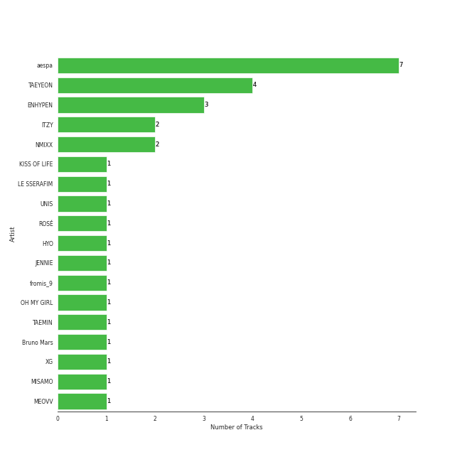
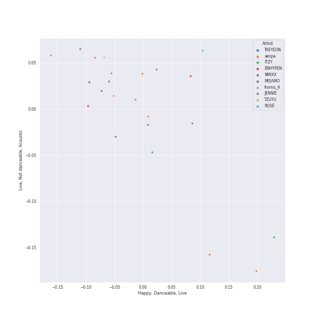
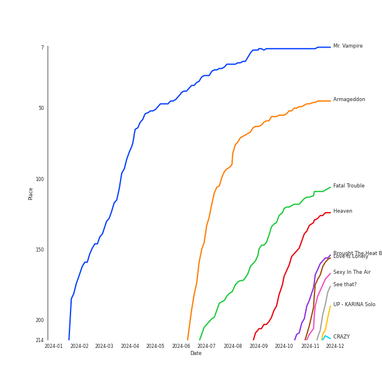
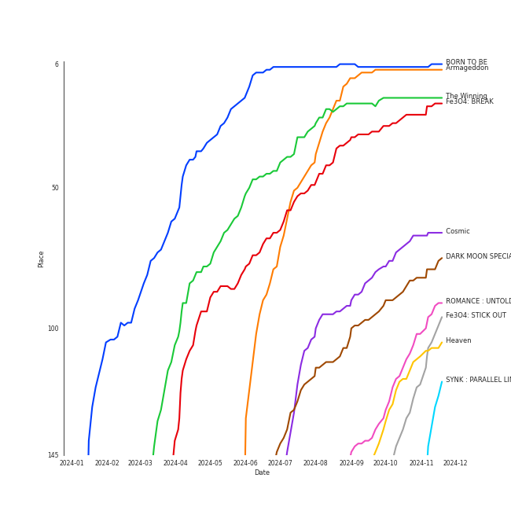
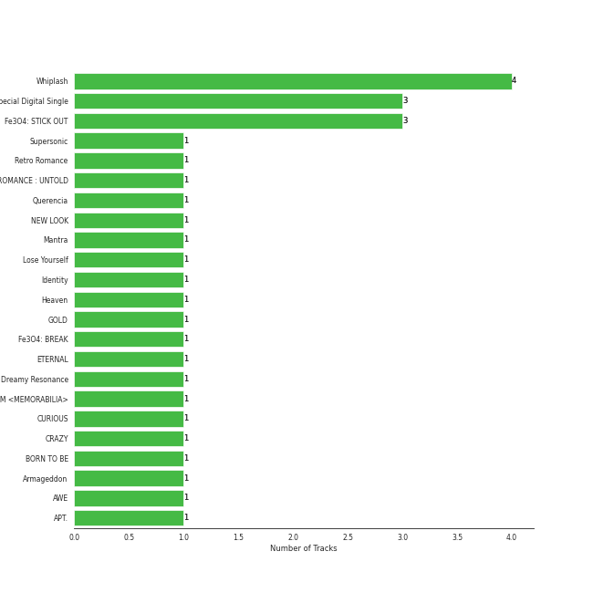
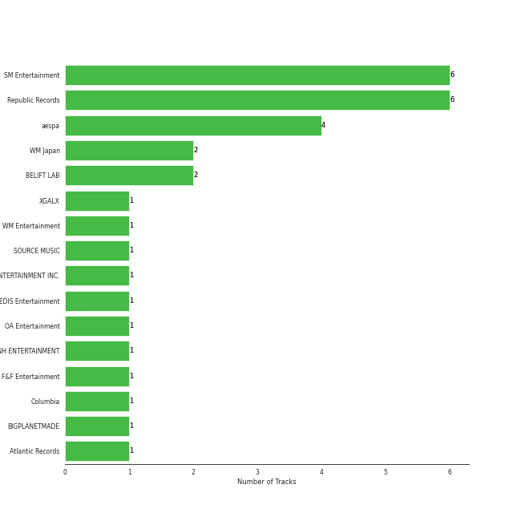
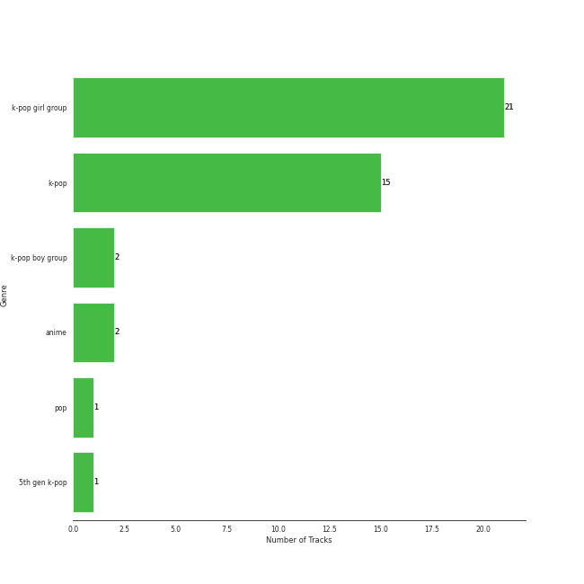
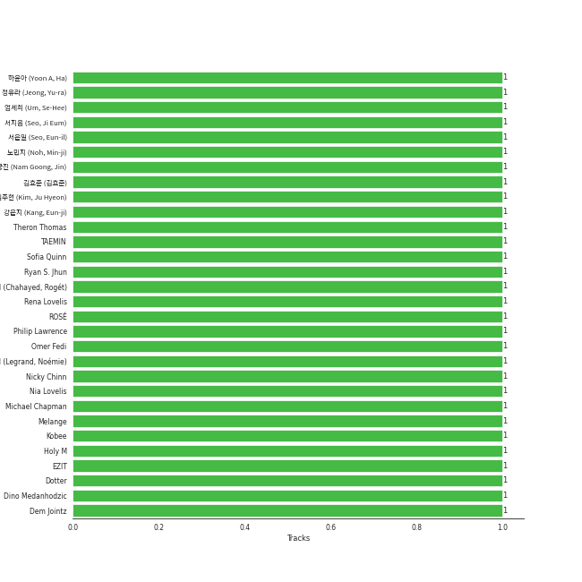

# On Repeat

[30 tracks 🔗](https://open.spotify.com/playlist/37i9dQZF1EpoN98LF1Ruyl)

[See Track Features](audio_features.md)

[See Clusters](clusters/overview.md)

## Top Artists

| Art | Rank | Tracks | 💚 | Artist | 🔗 |
|:---|---:|---:|---:|:---|:---|
|  | 1 | 8 | 8 | [aespa](../../artists/aespa/overview.md) | [🔗](https://open.spotify.com/artist/6YVMFz59CuY7ngCxTxjpxE) |
|  | 17 | 4 | 4 | [NMIXX](../../artists/nmixx/overview.md) | [🔗](https://open.spotify.com/artist/28ot3wh4oNmoFOdVajibBl) |
|  | 7 | 2 | 2 | [ENHYPEN](../../artists/enhypen/overview.md) | [🔗](https://open.spotify.com/artist/5t5FqBwTcgKTaWmfEbwQY9) |
|  | 5 | 2 | 2 | [ITZY](../../artists/itzy/overview.md) | [🔗](https://open.spotify.com/artist/2KC9Qb60EaY0kW4eH68vr3) |
|  | 39 | 2 | 2 | [MISAMO](../../artists/misamo/overview.md) | [🔗](https://open.spotify.com/artist/0IwZVmMMGE7nNXS7vN9SIo) |
|  | 122 | 1 | 1 | R3HAB | [🔗](https://open.spotify.com/artist/6cEuCEZu7PAE9ZSzLLc2oQ) |
|  | 36 | 1 | 1 | [KISS OF LIFE](../../artists/kiss_of_life/overview.md) | [🔗](https://open.spotify.com/artist/4TEK9tIkcoxib4GxT3O4ky) |
|  | 13 | 1 | 1 | [LE SSERAFIM](../../artists/le_sserafim/overview.md) | [🔗](https://open.spotify.com/artist/4SpbR6yFEvexJuaBpgAU5p) |
|  | 8 | 1 | 1 | [TAEYEON](../../artists/taeyeon/overview.md) | [🔗](https://open.spotify.com/artist/3qNVuliS40BLgXGxhdBdqu) |
|  | 137 | 1 | 1 | ROSÉ | [🔗](https://open.spotify.com/artist/3eVa5w3URK5duf6eyVDbu9) |

See all 19 artists

| Art | Rank | Tracks | 💚 | Artist | 🔗 |
|:---|---:|---:|---:|:---|:---|
|  | 3 | 1 | 1 | [IU](../../artists/iu/overview.md) | [🔗](https://open.spotify.com/artist/3HqSLMAZ3g3d5poNaI7GOU) |
|  | 14 | 1 | 1 | [CHUNG HA](../../artists/chung_ha/overview.md) | [🔗](https://open.spotify.com/artist/2PSJ6YriU7JsFucxACpU7Y) |
|  | 97 | 1 | 1 | JENNIE | [🔗](https://open.spotify.com/artist/250b0Wlc5Vk0CoUsaCY84M) |
|  | 154 | 1 | 1 | fromis_9 | [🔗](https://open.spotify.com/artist/24nUVBIlCGi4twz4nYxJum) |
|  | 88 | 1 | 1 | [OH MY GIRL](../../artists/oh_my_girl/overview.md) | [🔗](https://open.spotify.com/artist/2019zR22qK2RBvCqtudBaI) |
|  | 2 | 1 | 1 | [Red Velvet](../../artists/red_velvet/overview.md) | [🔗](https://open.spotify.com/artist/1z4g3DjTBBZKhvAroFlhOM) |
|  | 125 | 1 | 1 | TZUYU | [🔗](https://open.spotify.com/artist/1arCVYXeStgCY2UazBNBLK) |
|  | 54 | 1 | 1 | [TAEMIN](../../artists/taemin/overview.md) | [🔗](https://open.spotify.com/artist/13rF01aOogvnkuQXOlgTW8) |
|  | 91 | 1 | 1 | [Bruno Mars](../../artists/bruno_mars/overview.md) | [🔗](https://open.spotify.com/artist/0du5cEVh5yTK9QJze8zA0C) |

## Top Tracks

Most and least listened tracks

| Rank | ​ | Most listened tracks | Rank | ​​ | Least listened tracks |
|---:|:---|:---|---:|:---|:---|
| 7 |  | [Mr. Vampire](../../artists/itzy/overview.md) | 645 |  | [Imaginary Friend](../../artists/itzy/overview.md) |
| 23 |  | [Holssi](../../artists/iu/overview.md) | 401 |  | [Get Loud](../../artists/kiss_of_life/overview.md) |
| 45 |  | [Armageddon](../../artists/aespa/overview.md) | 363 |  | [Identity](../../artists/misamo/overview.md) |
| 53 |  | [DASH](../../artists/nmixx/overview.md) | 343 |  | [Flights, Not Feelings](../../artists/aespa/overview.md) |
| 108 |  | [Fatal Trouble](../../artists/enhypen/overview.md) | 317 |  | [NEW LOOK](../../artists/misamo/overview.md) |
| 110 |  | [Cosmic](../../artists/red_velvet/overview.md) | 308 |  | [Kill It](../../artists/aespa/overview.md) |
| 124 |  | [Heaven](../../artists/taeyeon/overview.md) | 306 |  | [Bored! - NINGNING Solo](../../artists/aespa/overview.md) |
| 156 |  | [Brought The Heat Back](../../artists/enhypen/overview.md) | 279 |  | Supersonic |
| 159 |  | [Love Is Lonely](../../artists/nmixx/overview.md) | 265 |  | [Whiplash](../../artists/aespa/overview.md) |
| 171 |  | [Sexy In The Air](../../artists/taemin/overview.md) | 256 |  | [BEAT BEAT](../../artists/nmixx/overview.md) |

## Top Albums

| Art | Rank | Tracks | 💚 | Album | Release Date | 🔗 |
|:---|---:|---:|---:|:---|:---|:---|
|  | 130 | 4 | 4 | Whiplash - The 5th Mini Album | 2024-10-21 | [🔗](https://open.spotify.com/album/7J41hCLBI2kEwL6RVSxfNx) |
|  | 119 | 3 | 3 | SYNK : PARALLEL LINE - Special Digital Single | 2024-10-09 | [🔗](https://open.spotify.com/album/4vLGHlTnlIIxMSfefCY0cU) |
|  | 96 | 3 | 3 | Fe3O4: STICK OUT | 2024-08-19 | [🔗](https://open.spotify.com/album/2pb2RscdByJ8pc7dPT1SY2) |
|  | 162 | 1 | 1 | abouTZU | 2024-09-06 | [🔗](https://open.spotify.com/album/0Xj4fXPKV0h6KhGQbUkDvy) |
|  | 18 | 1 | 1 | The Winning | 2024-02-20 | [🔗](https://open.spotify.com/album/08CvAj58nVMpq1Nw7T6maj) |
|  | 197 | 1 | 1 | Supersonic | 2024-08-12 | [🔗](https://open.spotify.com/album/1sxOavrEVy7krHpcbCsiJi) |
|  | 91 | 1 | 1 | ROMANCE : UNTOLD | 2024-07-12 | [🔗](https://open.spotify.com/album/05I8FltCMnGa3kE38mpOkL) |
|  | 154 | 1 | 1 | Querencia | 2021-02-15 | [🔗](https://open.spotify.com/album/3ZifpmJjOEkpYCNSIq352p) |
|  | 228 | 1 | 1 | NEW LOOK | 2024-10-09 | [🔗](https://open.spotify.com/album/0nIHweIUCe2nVy5stte3GY) |
|  | 177 | 1 | 1 | Mantra | 2024-10-10 | [🔗](https://open.spotify.com/album/3e5tDT1kfaAGx10yOjIDgW) |

See all 23 albums

| Art | Rank | Tracks | 💚 | Album | Release Date | 🔗 |
|:---|---:|---:|---:|:---|:---|:---|
|  | 282 | 1 | 1 | Lose Yourself | 2024-10-15 | [🔗](https://open.spotify.com/album/4eguh1dJUXRh0IMiLKRwab) |
|  | 255 | 1 | 1 | Identity | 2024-10-28 | [🔗](https://open.spotify.com/album/7xzn12f7FNR7ZaZ5RB7afD) |
|  | 105 | 1 | 1 | Heaven | 2024-07-08 | [🔗](https://open.spotify.com/album/68taLckvPxHRtNa8QjQJ5e) |
|  | 240 | 1 | 1 | GOLD | 2024-10-15 | [🔗](https://open.spotify.com/album/4CRfobFgSG0GOzplgTI79s) |
|  | 20 | 1 | 1 | Fe3O4: BREAK | 2024-01-15 | [🔗](https://open.spotify.com/album/5CCxLQgcI7cVwmgFDlicbP) |
|  | 124 | 1 | 1 | ETERNAL | 2024-08-19 | [🔗](https://open.spotify.com/album/13M8K1l146FLdFoObJIVj9) |
|  | 179 | 1 | 1 | Dreamy Resonance | 2024-08-26 | [🔗](https://open.spotify.com/album/4XZFgEjQ4Un1TNHAtTC87m) |
|  | 75 | 1 | 1 | DARK MOON SPECIAL ALBUM <MEMORABILIA> | 2024-05-13 | [🔗](https://open.spotify.com/album/0OhJwEzXbK9Km6GQSPdmPU) |
|  | 66 | 1 | 1 | Cosmic | 2024-06-24 | [🔗](https://open.spotify.com/album/5E8apoFsaUFhZxGGSju6aW) |
|  | 159 | 1 | 1 | CRAZY | 2024-08-30 | [🔗](https://open.spotify.com/album/538vEfAgLJ6g2I8ubuOlap) |
|  | 6 | 1 | 1 | BORN TO BE | 2024-01-08 | [🔗](https://open.spotify.com/album/3cm3EkNQLpKu58btSJT7fz) |
|  | 8 | 1 | 1 | Armageddon - The 1st Album | 2024-05-26 | [🔗](https://open.spotify.com/album/4SboBpuYojDm02qS4iFeJC) |
|  | 183 | 1 | 1 | APT. | 2024-10-18 | [🔗](https://open.spotify.com/album/2IYQwwgxgOIn7t3iF6ufFD) |

## Top Record Labels

| Tracks | 💚 | Label |
|---:|---:|:---|
| 6 | 6 | [SM Entertainment](../../labels/sm_entertainment/overview.md) |
| 6 | 6 | [Republic Records](../../labels/republic_records/overview.md) |
| 4 | 4 | aespa |
| 2 | 2 | [WM Japan](../../labels/wm_japan/overview.md) |
| 2 | 2 | [BELIFT LAB](../../labels/belift_lab/overview.md) |
| 1 | 1 | [WM Entertainment](../../labels/wm_entertainment/overview.md) |
| 1 | 1 | [SOURCE MUSIC](../../labels/source_music/overview.md) |
| 1 | 1 | [S2 ENTERTAINMENT INC.](../../labels/s2_entertainment_inc_/overview.md) |
| 1 | 1 | Republic Records – TZUYU (TWICE) |
| 1 | 1 | [PLEDIS Entertainment](../../labels/pledis_entertainment/overview.md) |

See all 16 labels

| Tracks | 💚 | Label |
|---:|---:|:---|
| 1 | 1 | OA Entertainment |
| 1 | 1 | [MNH ENTERTAINMENT](../../labels/mnh_entertainment/overview.md) |
| 1 | 1 | [EDAM Entertainment](../../labels/edam_entertainment/overview.md) |
| 1 | 1 | [Columbia](../../labels/columbia/overview.md) |
| 1 | 1 | BIGPLANETMADE |
| 1 | 1 | [Atlantic Records](../../labels/atlantic_records/overview.md) |

## Genres

| Tracks | 💚 | Genre |
|---:|---:|:---|
| 21 | 21 | [k-pop girl group](../../genres/k-pop_girl_group/overview.md) |
| 15 | 15 | [k-pop](../../genres/k-pop/overview.md) |
| 2 | 2 | [k-pop boy group](../../genres/k-pop_boy_group/overview.md) |
| 2 | 2 | [anime](../../genres/anime/overview.md) |
| 1 | 1 | [pop](../../genres/pop/overview.md) |
| 1 | 1 | [5th gen k-pop](../../genres/5th_gen_k-pop/overview.md) |

## Top Producers

| Art | Producer | Tracks | Credit Types |
|:---|:---|---:|:---|
| | 정다연 (Jeong, Dayeon) | 1 | Lyricist |
| | 오현선 (Oh, Hyun-sun) | 1 | Lyricist |
| | EZIT | 1 | Arranger, Songwriter |
| | Theron Thomas | 1 | Songwriter |
| | Michael Chapman | 1 | Songwriter |
| | Rebecca King | 1 | Lyricist |
| | [정은경 (Jung, Eun-Kyung)](../../producers/정은경_(jung,_eun-kyung)/overview.md) | 1 | Producer |
| | 임찬미 (Kim, Chan-mi) | 1 | Producer |
|  | [Bruno Mars](../../artists/bruno_mars/overview.md) | 1 | Songwriter |
| | Dem Jointz | 1 | Songwriter |

View all

| Art | Producer | Tracks | Credit Types |
|:---|:---|---:|:---|
| | Rogét Chahayed (Chahayed, Rogét) | 1 | Songwriter |
| | Lamont Dozier | 1 | Songwriter |
| | [서지음 (Seo, Ji Eum)](../../producers/서지음_(seo,_ji_eum)/overview.md) | 1 | Lyricist |
| | 김인 (Kim, In) | 1 | Lyricist |
| | Peter Hanna | 1 | Lyricist |
| | Omer Fedi | 1 | Songwriter |
| | 김영현 (Kim, Young-hyun) | 1 | Producer |
| | Michael Fatkin | 1 | Arranger, Songwriter |
| | Brian Holland | 1 | Songwriter |
| | [VINCENZO](../../producers/vincenzo/overview.md) | 1 | Arranger, Songwriter |
| | 서은일 (Seo, Eun-il) | 1 | Producer |
| | 성유진 (Sung, Yoojin) | 1 | Lyricist |
|  | R3HAB | 1 | Producer |
| | MICHICO | 1 | Lyricist |
| | T-Kura | 1 | Songwriter |
| | Deza | 1 | Lyricist |
| | Eddie Holland | 1 | Songwriter |
|  | ROSÉ | 1 | Songwriter |
| | 원지애 (Won, Jiae) | 1 | Lyricist |
| | [Tony Maserati](../../producers/tony_maserati/overview.md) | 1 | Producer |
| | Noémie Legrand (Legrand, Noémie) | 1 | Songwriter |
| | PUFF | 1 | Arranger, Songwriter |
| | WKLY | 1 | Lyricist |
| | [Cirkut](../../producers/cirkut/overview.md) | 1 | Songwriter |
| | [엄세희 (Um, Se-Hee)](../../producers/엄세희_(um,_se-hee)/overview.md) | 1 | Producer |
| | Brody Brown | 1 | Songwriter |
| | Strong Dragon | 1 | Arranger, Songwriter |
| | 김수정 (김수정) | 1 | Producer |
| | Nicky Chinn | 1 | Songwriter |
| | [구혜진 (Gu, Hye-jin)](../../producers/구혜진_(gu,_hye-jin)/overview.md) | 1 | Producer |
| | Melange | 1 | Arranger |
| | Philip Lawrence | 1 | Songwriter |
| | 백새임 (Baek, Sae-im) | 1 | Lyricist |
|  | [TAEMIN](../../artists/taemin/overview.md) | 1 | Songwriter |
| | 형근 (Hyeongeun) | 1 | Lyricist |
| | Amy Allen | 1 | Songwriter |
| | Kobee | 1 | Arranger, Producer, Songwriter |
| | C'SA | 1 | Arranger, Producer, Songwriter |
| | Holy M | 1 | Arranger, Songwriter |
| | [윤원권 (Yoon, Won-kwon)](../../producers/윤원권_(yoon,_won-kwon)/overview.md) | 1 | Producer |
| | Rebecca King | 1 | Lyricist |
| | Sofia Quinn | 1 | Songwriter |
| | [Ryan S. Jhun](../../producers/ryan_s__jhun/overview.md) | 1 | Songwriter |
| | Rick Bridges | 1 | Lyricist |

## Years

View all years

| Year | Number of Tracks |
|:---|---:|
| [2024](2024/overview.md) | 29 |
| 2021 | 1 |

| ​ | 10 newest albums | ​​ | 10 oldest albums |
|:---|:---|:---|:---|
|  | Identity (2024-10-28) |  | Querencia (2021-02-15) |
|  | Whiplash - The 5th Mini Album (2024-10-21) |  | BORN TO BE (2024-01-08) |
|  | APT. (2024-10-18) |  | Fe3O4: BREAK (2024-01-15) |
|  | Lose Yourself (2024-10-15) |  | The Winning (2024-02-20) |
|  | GOLD (2024-10-15) |  | DARK MOON SPECIAL ALBUM <MEMORABILIA> (2024-05-13) |
|  | Mantra (2024-10-10) |  | Armageddon - The 1st Album (2024-05-26) |
|  | SYNK : PARALLEL LINE - Special Digital Single (2024-10-09) |  | Cosmic (2024-06-24) |
|  | NEW LOOK (2024-10-09) |  | Heaven (2024-07-08) |
|  | abouTZU (2024-09-06) |  | ROMANCE : UNTOLD (2024-07-12) |
|  | CRAZY (2024-08-30) |  | Supersonic (2024-08-12) |