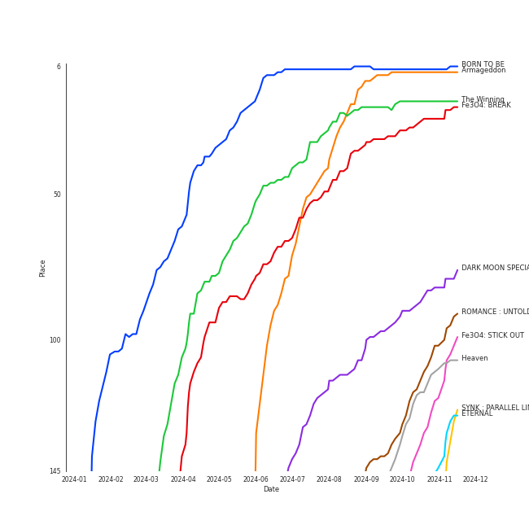

# On Repeat

[30 tracks (29 liked) 🔗](https://open.spotify.com/playlist/37i9dQZF1EpoN98LF1Ruyl)

[See Track Features](audio_features.md)

[See Clusters](clusters/overview.md)

## Top Artists

| Art | Rank | Tracks | 💚 | Artist | 🔗 |
|:---|---:|---:|---:|:---|:---|
|  | 1 | 5 | 5 | [aespa](../../artists/aespa/overview.md) | [🔗](https://open.spotify.com/artist/6YVMFz59CuY7ngCxTxjpxE) |
|  | 20 | 4 | 4 | [NMIXX](../../artists/nmixx/overview.md) | [🔗](https://open.spotify.com/artist/28ot3wh4oNmoFOdVajibBl) |
|  | 7 | 3 | 3 | [ENHYPEN](../../artists/enhypen/overview.md) | [🔗](https://open.spotify.com/artist/5t5FqBwTcgKTaWmfEbwQY9) |
|  | 2 | 3 | 3 | [Red Velvet](../../artists/red_velvet/overview.md) | [🔗](https://open.spotify.com/artist/1z4g3DjTBBZKhvAroFlhOM) |
|  | 5 | 2 | 2 | [ITZY](../../artists/itzy/overview.md) | [🔗](https://open.spotify.com/artist/2KC9Qb60EaY0kW4eH68vr3) |
|  | 70 | 2 | 2 | [TAEMIN](../../artists/taemin/overview.md) | [🔗](https://open.spotify.com/artist/13rF01aOogvnkuQXOlgTW8) |
|  | 16 | 2 | 2 | [STAYC](../../artists/stayc/overview.md) | [🔗](https://open.spotify.com/artist/01XYiBYaoMJcNhPokrg0l0) |
|  | 14 | 2 | 1 | [CHUNG HA](../../artists/chung_ha/overview.md) | [🔗](https://open.spotify.com/artist/2PSJ6YriU7JsFucxACpU7Y) |
|  | 66 | 1 | 1 | JEON SOMI | [🔗](https://open.spotify.com/artist/7zYj9S9SdIunYCfSm7vzAR) |
|  | 17 | 1 | 1 | [IVE](../../artists/ive/overview.md) | [🔗](https://open.spotify.com/artist/6RHTUrRF63xao58xh9FXYJ) |

See all 16 artists

| Art | Rank | Tracks | 💚 | Artist | 🔗 |
|:---|---:|---:|---:|:---|:---|
|  | 13 | 1 | 1 | [LE SSERAFIM](../../artists/le_sserafim/overview.md) | [🔗](https://open.spotify.com/artist/4SpbR6yFEvexJuaBpgAU5p) |
|  | 8 | 1 | 1 | [TAEYEON](../../artists/taeyeon/overview.md) | [🔗](https://open.spotify.com/artist/3qNVuliS40BLgXGxhdBdqu) |
|  | 4 | 1 | 1 | [IU](../../artists/iu/overview.md) | [🔗](https://open.spotify.com/artist/3HqSLMAZ3g3d5poNaI7GOU) |
|  | 290 | 1 | 1 | fromis_9 | [🔗](https://open.spotify.com/artist/24nUVBIlCGi4twz4nYxJum) |
|  | 67 | 1 | 1 | [PENTAGON](../../artists/pentagon/overview.md) | [🔗](https://open.spotify.com/artist/1wKpMkucynaTfG8lyPprYV) |
|  | 144 | 1 | 0 | R3HAB | [🔗](https://open.spotify.com/artist/6cEuCEZu7PAE9ZSzLLc2oQ) |

## Top Tracks

Most and least listened tracks

| Rank | ​ | Most listened tracks | Rank | ​​ | Least listened tracks |
|---:|:---|:---|---:|:---|:---|
| 1 |  | [Savage](../../artists/aespa/overview.md) | 888 |  | [MEOW](../../artists/stayc/overview.md) |
| 12 |  | [Mr. Vampire](../../artists/itzy/overview.md) | 769 |  | [CRAZY](../../artists/le_sserafim/overview.md) |
| 24 |  | [Holssi](../../artists/iu/overview.md) | 535 |  | Supersonic |
| 44 |  | [Sweet Venom](../../artists/enhypen/overview.md) | 525 |  | [Love Is Lonely](../../artists/nmixx/overview.md) |
| 64 |  | [Armageddon](../../artists/aespa/overview.md) | 493 |  | [BEAT BEAT](../../artists/nmixx/overview.md) |
| 70 |  | [DASH](../../artists/nmixx/overview.md) | 490 |  | [Voltage](../../artists/itzy/overview.md) |
| 113 |  | [Supernova](../../artists/aespa/overview.md) | 438 |  | [See that?](../../artists/nmixx/overview.md) |
| 145 |  | [Long Chat (#♥)](../../artists/aespa/overview.md) | 392 |  | [Brought The Heat Back](../../artists/enhypen/overview.md) |
| 156 |  | [Cosmic](../../artists/red_velvet/overview.md) | 310 |  | [Stay Tonight](../../artists/chung_ha/overview.md) |
| 161 |  | [Fatal Trouble](../../artists/enhypen/overview.md) | 306 |  | [Sexy In The Air](../../artists/taemin/overview.md) |

## Top Albums

| Art | Rank | Tracks | 💚 | Album | Release Date | 🔗 |
|:---|---:|---:|---:|:---|:---|:---|
|  | 185 | 3 | 3 | Fe3O4: STICK OUT | 2024-08-19 | [🔗](https://open.spotify.com/album/2pb2RscdByJ8pc7dPT1SY2) |
|  | 13 | 3 | 3 | Armageddon - The 1st Album | 2024-05-27 | [🔗](https://open.spotify.com/album/058hCti9Bupb5CJc6bd3VB) |
|  | 179 | 2 | 2 | ETERNAL | 2024-08-19 | [🔗](https://open.spotify.com/album/13M8K1l146FLdFoObJIVj9) |
|  | 94 | 2 | 2 | Cosmic | 2024-06-24 | [🔗](https://open.spotify.com/album/5E8apoFsaUFhZxGGSju6aW) |
|  | 144 | 1 | 1 | ‘The ReVe Festival’ Finale | 2019-12-23 | [🔗](https://open.spotify.com/album/3rVtm00UfbuzWOewdm4iYM) |
|  | 141 | 1 | 1 | WE:TH | 2020-10-12 | [🔗](https://open.spotify.com/album/1ASYbBYBwV6Rcfc2ycqmlK) |
|  | 345 | 1 | 1 | Voltage | 2022-03-23 | [🔗](https://open.spotify.com/album/3MXVqfk9VG3B757nLlow0D) |
|  | 21 | 1 | 1 | The Winning | 2024-02-20 | [🔗](https://open.spotify.com/album/08CvAj58nVMpq1Nw7T6maj) |
|  | 365 | 1 | 1 | Supersonic | 2024-08-12 | [🔗](https://open.spotify.com/album/1sxOavrEVy7krHpcbCsiJi) |
|  | 6 | 1 | 1 | Savage - The 1st Mini Album | 2021-10-05 | [🔗](https://open.spotify.com/album/3vyyDkvYWC36DwgZCYd3Wu) |

See all 24 albums

| Art | Rank | Tracks | 💚 | Album | Release Date | 🔗 |
|:---|---:|---:|---:|:---|:---|:---|
|  | 147 | 1 | 1 | ROMANCE : UNTOLD | 2024-07-12 | [🔗](https://open.spotify.com/album/05I8FltCMnGa3kE38mpOkL) |
|  | 163 | 1 | 1 | Querencia | 2021-02-15 | [🔗](https://open.spotify.com/album/1p2OBhqq0d1N8awjHV9xA3) |
|  | 45 | 1 | 1 | ORANGE BLOOD | 2023-11-17 | [🔗](https://open.spotify.com/album/7dsAlxH9cMgyREm8OLdWWT) |
|  | 166 | 1 | 1 | Metamorphic | 2024-07-01 | [🔗](https://open.spotify.com/album/6eTCq3XOz0rVJnelXro3Vk) |
|  | 586 | 1 | 1 | MEOW / Cheeky Icy Thang (Japanese Ver.) | 2024-08-21 | [🔗](https://open.spotify.com/album/04zQRW9brhcUtaDHQ8SH9u) |
|  | 216 | 1 | 1 | Ice Cream | 2024-08-02 | [🔗](https://open.spotify.com/album/5Q41ZTpaEpDVtgu1yAtAPR) |
|  | 121 | 1 | 1 | IVE SWITCH | 2024-04-29 | [🔗](https://open.spotify.com/album/7z61DsZtWO2S4nC5xd0b9p) |
|  | 193 | 1 | 1 | Hot Mess | 2024-07-03 | [🔗](https://open.spotify.com/album/2PvpuCui1GVO8DkFcCHzYU) |
|  | 162 | 1 | 1 | Heaven | 2024-07-08 | [🔗](https://open.spotify.com/album/68taLckvPxHRtNa8QjQJ5e) |
|  | 35 | 1 | 1 | Fe3O4: BREAK | 2024-01-15 | [🔗](https://open.spotify.com/album/5CCxLQgcI7cVwmgFDlicbP) |
|  | 108 | 1 | 1 | DARK MOON SPECIAL ALBUM <MEMORABILIA> | 2024-05-13 | [🔗](https://open.spotify.com/album/0OhJwEzXbK9Km6GQSPdmPU) |
|  | 513 | 1 | 1 | CRAZY | 2024-08-30 | [🔗](https://open.spotify.com/album/538vEfAgLJ6g2I8ubuOlap) |
|  | 7 | 1 | 1 | BORN TO BE | 2024-01-08 | [🔗](https://open.spotify.com/album/3cm3EkNQLpKu58btSJT7fz) |
|  | 214 | 1 | 0 | Querencia | 2021-02-15 | [🔗](https://open.spotify.com/album/3ZifpmJjOEkpYCNSIq352p) |

## Top Record Labels

| Tracks | 💚 | Label |
|---:|---:|:---|
| 8 | 8 | [SM Entertainment](../../labels/sm_entertainment/overview.md) |
| 5 | 5 | [Republic Records](../../labels/republic_records/overview.md) |
| 3 | 3 | [BELIFT LAB](../../labels/belift_lab/overview.md) |
| 2 | 2 | [WM Japan](../../labels/wm_japan/overview.md) |
| 2 | 2 | [Universal Music LLC](../../labels/universal_music_llc/overview.md) |
| 2 | 2 | BIGPLANETMADE |
| 2 | 1 | [MNH ENTERTAINMENT](../../labels/mnh_entertainment/overview.md) |
| 1 | 1 | THEBLACKLABEL |
| 1 | 1 | [Starship Entertainment](../../labels/starship_entertainment/overview.md) |
| 1 | 1 | [SOURCE MUSIC](../../labels/source_music/overview.md) |

See all 13 labels

| Tracks | 💚 | Label |
|---:|---:|:---|
| 1 | 1 | [PLEDIS Entertainment](../../labels/pledis_entertainment/overview.md) |
| 1 | 1 | [High Up Entertainment](../../labels/high_up_entertainment/overview.md) |
| 1 | 1 | [EDAM Entertainment](../../labels/edam_entertainment/overview.md) |

## Genres

| Tracks | 💚 | Genre |
|---:|---:|:---|
| 20 | 19 | [k-pop](../../genres/k-pop/overview.md) |
| 19 | 19 | [k-pop girl group](../../genres/k-pop_girl_group/overview.md) |
| 4 | 4 | [k-pop boy group](../../genres/k-pop_boy_group/overview.md) |
| 3 | 3 | [anime](../../genres/anime/overview.md) |
| 1 | 1 | [pop](../../genres/pop/overview.md) |

## Top Producers

| Art | Producer | Tracks | Credit Types |
|:---|:---|---:|:---|
|  | [TAEMIN](../../artists/taemin/overview.md) | 2 | Songwriter |
| | [Ryan S. Jhun](../../producers/ryan_s__jhun/overview.md) | 2 | Songwriter |
| | 정다연 (Jeong, Dayeon) | 1 | Lyricist |
| | [Fuxxy](../../producers/fuxxy/overview.md) | 1 | Lyricist, Songwriter |
| | [정은경 (Jung, Eun-Kyung)](../../producers/정은경_(jung,_eun-kyung)/overview.md) | 1 | Producer |
| | Kirsten Collins | 1 | Songwriter |
| | 임찬미 (Kim, Chan-mi) | 1 | Producer |
| | 김지현 (Kim, Ji Hyun) | 1 | Producer |
| | Tay Jasper | 1 | Songwriter |
| | Dem Jointz | 1 | Songwriter |

View all

| Art | Producer | Tracks | Credit Types |
|:---|:---|---:|:---|
| | [서지음 (Seo, Ji Eum)](../../producers/서지음_(seo,_ji_eum)/overview.md) | 1 | Lyricist |
| | 오현선 (Oh, Hyun-sun) | 1 | Lyricist |
| | EZIT | 1 | Arranger, Songwriter |
| | 김인 (Kim, In) | 1 | Lyricist |
| | 김영현 (Kim, Young-hyun) | 1 | Producer |
| | Hautboi Rich | 1 | Songwriter |
| | [VINCENZO](../../producers/vincenzo/overview.md) | 1 | Arranger, Lyricist, Songwriter |
| | Cazzi Opeia | 1 | Songwriter |
| | 서은일 (Seo, Eun-il) | 1 | Producer |
| | 성유진 (Sung, Yoojin) | 1 | Lyricist |
| | Jia Lih | 1 | Arranger, Songwriter |
| | Deza | 1 | Lyricist |
| | [유영진 (Yoo, Young-jin)](../../producers/유영진_(yoo,_young-jin)/overview.md) | 1 | Arranger, Lyricist, Producer, Songwriter |
| | 원지애 (Won, Jiae) | 1 | Lyricist |
| | 김재웅 (Kim, Jae-ung) | 1 | Arranger, Lyricist, Songwriter |
| | Anna Timgren | 1 | Lyricist, Songwriter |
| | PUFF | 1 | Arranger, Songwriter |
| | WKLY | 1 | Lyricist |
| | EJAE | 1 | Songwriter |
| | [엄세희 (Um, Se-Hee)](../../producers/엄세희_(um,_se-hee)/overview.md) | 1 | Producer |
| | Strong Dragon | 1 | Arranger, Songwriter |
| | [Kenzie](../../producers/kenzie/overview.md) | 1 | Songwriter |
| | [구혜진 (Gu, Hye-jin)](../../producers/구혜진_(gu,_hye-jin)/overview.md) | 1 | Producer |
| | Melange | 1 | Arranger |
| | 백새임 (Baek, Sae-im) | 1 | Lyricist |
| | Noémie Legrand (Legrand, Noémie) | 1 | Songwriter |
| | 형근 (Hyeongeun) | 1 | Lyricist |
| | Kobee | 1 | Arranger, Producer, Songwriter |
| | C'SA | 1 | Arranger, Producer, Songwriter |
| | Holy M | 1 | Arranger, Songwriter |
| | 윤원권 (Yoon, Won-kwon) | 1 | Producer |
| | Sofia Quinn | 1 | Songwriter |
| | Druski | 1 | Producer |
| | [Tony Maserati](../../producers/tony_maserati/overview.md) | 1 | Producer |
| | Rick Bridges | 1 | Lyricist |

## Years

View all years

| Year | Number of Tracks |
|:---|---:|
| [2024](2024/overview.md) | 23 |
| 2023 | 1 |
| 2022 | 1 |
| 2021 | 3 |
| 2020 | 1 |
| 2019 | 1 |

| ​ | 10 newest albums | ​​ | 10 oldest albums |
|:---|:---|:---|:---|
|  | CRAZY (2024-08-30) |  | ‘The ReVe Festival’ Finale (2019-12-23) |
|  | MEOW / Cheeky Icy Thang (Japanese Ver.) (2024-08-21) |  | WE:TH (2020-10-12) |
|  | ETERNAL (2024-08-19) |  | Querencia (2021-02-15) |
|  | Fe3O4: STICK OUT (2024-08-19) |  | Querencia (2021-02-15) |
|  | Supersonic (2024-08-12) |  | Savage - The 1st Mini Album (2021-10-05) |
|  | Ice Cream (2024-08-02) |  | Voltage (2022-03-23) |
|  | ROMANCE : UNTOLD (2024-07-12) |  | ORANGE BLOOD (2023-11-17) |
|  | Heaven (2024-07-08) |  | BORN TO BE (2024-01-08) |
|  | Hot Mess (2024-07-03) |  | Fe3O4: BREAK (2024-01-15) |
|  | Metamorphic (2024-07-01) |  | The Winning (2024-02-20) |