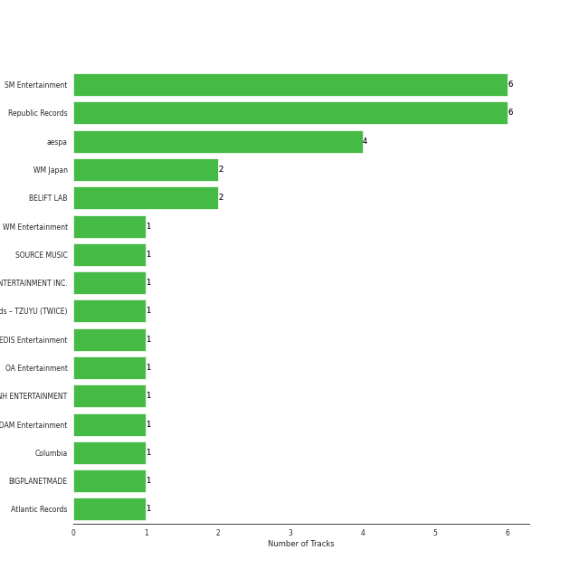

# On Repeat

[30 tracks (29 liked) 🔗](https://open.spotify.com/playlist/37i9dQZF1EpoN98LF1Ruyl)

[See Track Features](audio_features.md)

[See Clusters](clusters/overview.md)

## Top Artists

| Art | Rank | Tracks | 💚 | Artist | 🔗 |
|:---|---:|---:|---:|:---|:---|
|  | 1 | 7 | 7 | [aespa](../../artists/aespa/overview.md) | [🔗](https://open.spotify.com/artist/6YVMFz59CuY7ngCxTxjpxE) |
|  | 7 | 5 | 5 | [ENHYPEN](../../artists/enhypen/overview.md) | [🔗](https://open.spotify.com/artist/5t5FqBwTcgKTaWmfEbwQY9) |
|  | 2 | 3 | 3 | [Red Velvet](../../artists/red_velvet/overview.md) | [🔗](https://open.spotify.com/artist/1z4g3DjTBBZKhvAroFlhOM) |
|  | 14 | 3 | 2 | [CHUNG HA](../../artists/chung_ha/overview.md) | [🔗](https://open.spotify.com/artist/2PSJ6YriU7JsFucxACpU7Y) |
|  | 8 | 2 | 2 | [TAEYEON](../../artists/taeyeon/overview.md) | [🔗](https://open.spotify.com/artist/3qNVuliS40BLgXGxhdBdqu) |
|  | 4 | 2 | 2 | [IU](../../artists/iu/overview.md) | [🔗](https://open.spotify.com/artist/3HqSLMAZ3g3d5poNaI7GOU) |
|  | 5 | 2 | 2 | [ITZY](../../artists/itzy/overview.md) | [🔗](https://open.spotify.com/artist/2KC9Qb60EaY0kW4eH68vr3) |
|  | 16 | 2 | 2 | [STAYC](../../artists/stayc/overview.md) | [🔗](https://open.spotify.com/artist/01XYiBYaoMJcNhPokrg0l0) |
|  | 127 | 1 | 1 | Lexie Liu | [🔗](https://open.spotify.com/artist/6fs2or0cKLEM2xohWq8SoX) |
|  | 17 | 1 | 1 | [IVE](../../artists/ive/overview.md) | [🔗](https://open.spotify.com/artist/6RHTUrRF63xao58xh9FXYJ) |

See all 14 artists

| Art | Rank | Tracks | 💚 | Artist | 🔗 |
|:---|---:|---:|---:|:---|:---|
|  | 46 | 1 | 1 | [KISS OF LIFE](../../artists/kiss_of_life/overview.md) | [🔗](https://open.spotify.com/artist/4TEK9tIkcoxib4GxT3O4ky) |
|  | 22 | 1 | 1 | [NMIXX](../../artists/nmixx/overview.md) | [🔗](https://open.spotify.com/artist/28ot3wh4oNmoFOdVajibBl) |
|  | 85 | 1 | 1 | [YUQI](../../artists/yuqi/overview.md) | [🔗](https://open.spotify.com/artist/22aCD8IrQZjcPgZw728QT6) |
|  | 172 | 1 | 0 | R3HAB | [🔗](https://open.spotify.com/artist/6cEuCEZu7PAE9ZSzLLc2oQ) |

## Top Tracks

Most and least listened tracks

| Rank | ​ | Most listened tracks | Rank | ​​ | Least listened tracks |
|---:|:---|:---|---:|:---|:---|
| 19 |  | [Mr. Vampire](../../artists/itzy/overview.md) | 612 |  | [Stay Tonight](../../artists/chung_ha/overview.md) |
| 47 |  | [Sweet Venom](../../artists/enhypen/overview.md) | 580 |  | [Dream of You (with R3hab)](../../artists/chung_ha/overview.md) |
| 60 |  | [Ice Cream Cake](../../artists/red_velvet/overview.md) | 490 |  | [Cold As Hell](../../artists/taeyeon/overview.md) |
| 75 |  | [Armageddon](../../artists/aespa/overview.md) | 484 |  | [Bicycle](../../artists/chung_ha/overview.md) |
| 78 |  | [Jam Jam](../../artists/iu/overview.md) | 472 |  | [XO (Only If You Say Yes)](../../artists/enhypen/overview.md) |
| 82 |  | [DASH](../../artists/nmixx/overview.md) | 430 |  | [Hot Mess](../../artists/aespa/overview.md) |
| 132 |  | [Supernova](../../artists/aespa/overview.md) | 418 |  | [Moonstruck](../../artists/enhypen/overview.md) |
| 163 |  | [Long Chat (#♥)](../../artists/aespa/overview.md) | 372 |  | [Hundred Broken Hearts](../../artists/enhypen/overview.md) |
| 181 |  | [Midas Touch](../../artists/kiss_of_life/overview.md) | 337 |  | [1 Thing](../../artists/stayc/overview.md) |
| 189 |  | [Fatal Trouble](../../artists/enhypen/overview.md) | 328 |  | [Cheeky Icy Thang](../../artists/stayc/overview.md) |

## Top Albums

| Art | Rank | Tracks | 💚 | Album | Release Date | 🔗 |
|:---|---:|---:|---:|:---|:---|:---|
|  | 34 | 6 | 6 | Armageddon - The 1st Album | 2024-05-27 | [🔗](https://open.spotify.com/album/058hCti9Bupb5CJc6bd3VB) |
|  | 187 | 3 | 3 | ROMANCE : UNTOLD | 2024-07-12 | [🔗](https://open.spotify.com/album/05I8FltCMnGa3kE38mpOkL) |
|  | 166 | 2 | 2 | Querencia | 2021-02-15 | [🔗](https://open.spotify.com/album/1p2OBhqq0d1N8awjHV9xA3) |
|  | 75 | 2 | 2 | Palette | 2017-04-21 | [🔗](https://open.spotify.com/album/5V8n6fqyAPxvFTibPhQVcp) |
|  | 189 | 2 | 2 | Metamorphic | 2024-07-01 | [🔗](https://open.spotify.com/album/6eTCq3XOz0rVJnelXro3Vk) |
|  | 106 | 2 | 2 | Cosmic | 2024-06-24 | [🔗](https://open.spotify.com/album/5E8apoFsaUFhZxGGSju6aW) |
|  | 130 | 1 | 1 | YUQ1 | 2024-04-23 | [🔗](https://open.spotify.com/album/7LYc8ngbhwha4aGJ5kVauc) |
|  | 47 | 1 | 1 | ORANGE BLOOD | 2023-11-17 | [🔗](https://open.spotify.com/album/7dsAlxH9cMgyREm8OLdWWT) |
|  | 137 | 1 | 1 | Midas Touch | 2024-04-03 | [🔗](https://open.spotify.com/album/1HfTA0xDoZ0mswFO3GB3ef) |
|  | 57 | 1 | 1 | Ice Cream Cake - The 1st Mini Album | 2015-03-17 | [🔗](https://open.spotify.com/album/27cBQ5FDqv0xLgiJ7qNpZr) |

See all 19 albums

| Art | Rank | Tracks | 💚 | Album | Release Date | 🔗 |
|:---|---:|---:|---:|:---|:---|:---|
|  | 135 | 1 | 1 | IVE SWITCH | 2024-04-29 | [🔗](https://open.spotify.com/album/7z61DsZtWO2S4nC5xd0b9p) |
|  | 40 | 1 | 1 | INVU - The 3rd Album | 2022-02-14 | [🔗](https://open.spotify.com/album/7i2YLTVQ0dyngRuUqtGmr9) |
|  | 306 | 1 | 1 | Hot Mess | 2024-07-03 | [🔗](https://open.spotify.com/album/2PvpuCui1GVO8DkFcCHzYU) |
|  | 181 | 1 | 1 | Heaven | 2024-07-08 | [🔗](https://open.spotify.com/album/68taLckvPxHRtNa8QjQJ5e) |
|  | 183 | 1 | 1 | GUESS WHO | 2021-04-30 | [🔗](https://open.spotify.com/album/4lS8nhX8cplsYPzKjvhw6G) |
|  | 46 | 1 | 1 | Fe3O4: BREAK | 2024-01-15 | [🔗](https://open.spotify.com/album/5CCxLQgcI7cVwmgFDlicbP) |
|  | 123 | 1 | 1 | DARK MOON SPECIAL ALBUM <MEMORABILIA> | 2024-05-13 | [🔗](https://open.spotify.com/album/0OhJwEzXbK9Km6GQSPdmPU) |
|  | 7 | 1 | 1 | BORN TO BE | 2024-01-08 | [🔗](https://open.spotify.com/album/3cm3EkNQLpKu58btSJT7fz) |
|  | 330 | 1 | 0 | Querencia | 2021-02-15 | [🔗](https://open.spotify.com/album/3ZifpmJjOEkpYCNSIq352p) |

## Top Record Labels

| Tracks | 💚 | Label |
|---:|---:|:---|
| 11 | 11 | [SM Entertainment](../../labels/sm_entertainment/overview.md) |
| 5 | 5 | [BELIFT LAB](../../labels/belift_lab/overview.md) |
| 3 | 3 | [Republic Records](../../labels/republic_records/overview.md) |
| 3 | 2 | [MNH ENTERTAINMENT](../../labels/mnh_entertainment/overview.md) |
| 2 | 2 | [High Up Entertainment](../../labels/high_up_entertainment/overview.md) |
| 2 | 2 | Fave Entertainment |
| 1 | 1 | [WM Japan](../../labels/wm_japan/overview.md) |
| 1 | 1 | [Starship Entertainment](../../labels/starship_entertainment/overview.md) |
| 1 | 1 | [S2 ENTERTAINMENT INC.](../../labels/s2_entertainment_inc_/overview.md) |
| 1 | 1 | [CUBE ENTERTAINMENT](../../labels/cube_entertainment/overview.md) |

## Genres

| Tracks | 💚 | Genre |
|---:|---:|:---|
| 17 | 17 | [k-pop girl group](../../genres/k-pop_girl_group/overview.md) |
| 15 | 14 | [k-pop](../../genres/k-pop/overview.md) |
| 5 | 5 | [k-pop boy group](../../genres/k-pop_boy_group/overview.md) |
| 5 | 5 | [anime](../../genres/anime/overview.md) |
| 2 | 2 | [pop](../../genres/pop/overview.md) |
| 2 | 2 | [5th gen k-pop](../../genres/5th_gen_k-pop/overview.md) |

## Top Producers

| Art | Producer | Tracks | Credit Types |
|:---|:---|---:|:---|
| | [정은경 (Jung, Eun-Kyung)](../../producers/정은경_(jung,_eun-kyung)/overview.md) | 3 | Producer |
| | [Fuxxy](../../producers/fuxxy/overview.md) | 2 | Lyricist, Songwriter, Arranger |
| | 윤원권 (Yoon, Won-kwon) | 2 | Producer |
| | [VINCENZO](../../producers/vincenzo/overview.md) | 2 | Arranger, Lyricist, Songwriter |
| | 정다연 (Jeong, Dayeon) | 1 | Lyricist |
| | Daniel Kim | 1 | Arranger, Songwriter |
| | 김동현 (Kim, Dong-hyun) | 1 | Lyricist |
| | 임찬미 (Kim, Chan-mi) | 1 | Producer |
| | 김지현 (Kim, Ji Hyun) | 1 | Producer |
| | [서지음 (Seo, Ji Eum)](../../producers/서지음_(seo,_ji_eum)/overview.md) | 1 | Lyricist |

View all

| Art | Producer | Tracks | Credit Types |
|:---|:---|---:|:---|
| | 오현선 (Oh, Hyun-sun) | 1 | Lyricist |
| | 김인 (Kim, In) | 1 | Lyricist |
| | Johan Gustafsson | 1 | Arranger, Songwriter |
| | 김재웅 (Kim, Jae-ung) | 1 | Arranger, Lyricist, Songwriter |
| | Jeremy G | 1 | Songwriter |
| | 남궁진 (Nam Goong, Jin) | 1 | Producer |
| | 김영현 (Kim, Young-hyun) | 1 | Producer |
| | 서은일 (Seo, Eun-il) | 1 | Producer |
| | 성유진 (Sung, Yoojin) | 1 | Lyricist |
| | Deza | 1 | Lyricist |
| | 이민규 (Lee, Min-kyu) | 1 | Producer |
| | Hayley Aitken | 1 | Arranger, Songwriter |
| | Rick Bridges | 1 | Lyricist |
| | EZIT | 1 | Arranger, Songwriter |
| | [조윤경 (Jo, Yoon Kyung)](../../producers/조윤경_(jo,_yoon_kyung)/overview.md) | 1 | Lyricist |
|  | [CHUNG HA](../../artists/chung_ha/overview.md) | 1 | Lyricist |
| | Melange | 1 | Arranger |
| | Noémie Legrand (Legrand, Noémie) | 1 | Songwriter |
| | PUFF | 1 | Arranger, Songwriter |
| | WKLY | 1 | Lyricist |
| | [엄세희 (Um, Se-Hee)](../../producers/엄세희_(um,_se-hee)/overview.md) | 1 | Producer |
| | Strong Dragon | 1 | Arranger, Songwriter |
| | Fredrik Häggstam (Häggstam, Fredrik) | 1 | Arranger, Songwriter |
| | [Kenzie](../../producers/kenzie/overview.md) | 1 | Arranger |
| | Sebastian Lundberg | 1 | Arranger, Songwriter |
| | [구혜진 (Gu, Hye-jin)](../../producers/구혜진_(gu,_hye-jin)/overview.md) | 1 | Producer |
| | Anna Timgren | 1 | Lyricist, Songwriter |
| | 원지애 (Won, Jiae) | 1 | Lyricist |
| | 백새임 (Baek, Sae-im) | 1 | Lyricist |
| | 형근 (Hyeongeun) | 1 | Lyricist |
| | Kobee | 1 | Arranger, Producer, Songwriter |
| | Dawn Elektra | 1 | Songwriter |
| | 신지영 (Shin, Ji-young) | 1 | Producer |
| | C'SA | 1 | Arranger, Producer, Songwriter |
| | Holy M | 1 | Arranger, Songwriter |
| | Sofia Quinn | 1 | Songwriter |
| | [Tony Maserati](../../producers/tony_maserati/overview.md) | 1 | Producer |
| | 김철순 (Kim, Chul-Soon) | 1 | Producer |

## Years

View all years

| Year | Number of Tracks |
|:---|---:|
| [2024](2024/overview.md) | 21 |
| 2023 | 1 |
| 2022 | 1 |
| 2021 | 4 |
| 2017 | 2 |
| 2015 | 1 |

| ​ | 10 newest albums | ​​ | 10 oldest albums |
|:---|:---|:---|:---|
|  | ROMANCE : UNTOLD (2024-07-12) |  | Ice Cream Cake - The 1st Mini Album (2015-03-17) |
|  | Heaven (2024-07-08) |  | Palette (2017-04-21) |
|  | Hot Mess (2024-07-03) |  | Querencia (2021-02-15) |
|  | Metamorphic (2024-07-01) |  | Querencia (2021-02-15) |
|  | Cosmic (2024-06-24) |  | GUESS WHO (2021-04-30) |
|  | Armageddon - The 1st Album (2024-05-27) |  | INVU - The 3rd Album (2022-02-14) |
|  | DARK MOON SPECIAL ALBUM <MEMORABILIA> (2024-05-13) |  | ORANGE BLOOD (2023-11-17) |
|  | IVE SWITCH (2024-04-29) |  | BORN TO BE (2024-01-08) |
|  | YUQ1 (2024-04-23) |  | Fe3O4: BREAK (2024-01-15) |
|  | Midas Touch (2024-04-03) |  | Midas Touch (2024-04-03) |