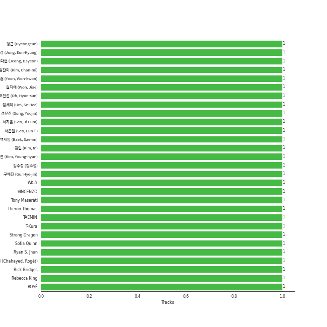

# On Repeat

[30 tracks 🔗](https://open.spotify.com/playlist/37i9dQZF1EpoN98LF1Ruyl)

[See Track Features](audio_features.md)

[See Clusters](clusters/overview.md)

## Top Artists

| Art | Rank | Tracks | 💚 | Artist | 🔗 |
|:---|---:|---:|---:|:---|:---|
|  | 1 | 5 | 5 | [aespa](../../artists/aespa/overview.md) | [🔗](https://open.spotify.com/artist/6YVMFz59CuY7ngCxTxjpxE) |
|  | 18 | 4 | 4 | [NMIXX](../../artists/nmixx/overview.md) | [🔗](https://open.spotify.com/artist/28ot3wh4oNmoFOdVajibBl) |
|  | 7 | 3 | 3 | [ENHYPEN](../../artists/enhypen/overview.md) | [🔗](https://open.spotify.com/artist/5t5FqBwTcgKTaWmfEbwQY9) |
|  | 49 | 2 | 2 | [Radiohead](../../artists/radiohead/overview.md) | [🔗](https://open.spotify.com/artist/4Z8W4fKeB5YxbusRsdQVPb) |
|  | 8 | 2 | 2 | [TAEYEON](../../artists/taeyeon/overview.md) | [🔗](https://open.spotify.com/artist/3qNVuliS40BLgXGxhdBdqu) |
|  | 14 | 2 | 2 | [CHUNG HA](../../artists/chung_ha/overview.md) | [🔗](https://open.spotify.com/artist/2PSJ6YriU7JsFucxACpU7Y) |
|  | 2 | 2 | 2 | [Red Velvet](../../artists/red_velvet/overview.md) | [🔗](https://open.spotify.com/artist/1z4g3DjTBBZKhvAroFlhOM) |
|  | 147 | 2 | 2 | TZUYU | [🔗](https://open.spotify.com/artist/1arCVYXeStgCY2UazBNBLK) |
|  | 68 | 1 | 1 | JEON SOMI | [🔗](https://open.spotify.com/artist/7zYj9S9SdIunYCfSm7vzAR) |
|  | 136 | 1 | 1 | R3HAB | [🔗](https://open.spotify.com/artist/6cEuCEZu7PAE9ZSzLLc2oQ) |

See all 19 artists

| Art | Rank | Tracks | 💚 | Artist | 🔗 |
|:---|---:|---:|---:|:---|:---|
|  | 13 | 1 | 1 | [LE SSERAFIM](../../artists/le_sserafim/overview.md) | [🔗](https://open.spotify.com/artist/4SpbR6yFEvexJuaBpgAU5p) |
|  | 57 | 1 | 1 | HYO | [🔗](https://open.spotify.com/artist/3U7bOaJLuFkrmDQ1C1OqKl) |
|  | 3 | 1 | 1 | [IU](../../artists/iu/overview.md) | [🔗](https://open.spotify.com/artist/3HqSLMAZ3g3d5poNaI7GOU) |
|  | 250 | 1 | 1 | pH-1 | [🔗](https://open.spotify.com/artist/2u7CP5T30c8ctenzXgEV1W) |
|  | 5 | 1 | 1 | [ITZY](../../artists/itzy/overview.md) | [🔗](https://open.spotify.com/artist/2KC9Qb60EaY0kW4eH68vr3) |
|  | 174 | 1 | 1 | fromis_9 | [🔗](https://open.spotify.com/artist/24nUVBIlCGi4twz4nYxJum) |
|  | 44 | 1 | 1 | nævis | [🔗](https://open.spotify.com/artist/2067CjQ2nC56cRZX8goeHg) |
|  | 90 | 1 | 1 | [OH MY GIRL](../../artists/oh_my_girl/overview.md) | [🔗](https://open.spotify.com/artist/2019zR22qK2RBvCqtudBaI) |
|  | 59 | 1 | 1 | [TAEMIN](../../artists/taemin/overview.md) | [🔗](https://open.spotify.com/artist/13rF01aOogvnkuQXOlgTW8) |

## Top Tracks

Most and least listened tracks

| Rank | ​ | Most listened tracks | Rank | ​​ | Least listened tracks |
|---:|:---|:---|---:|:---|:---|
| 3 |  | [Welcome To MY World (feat. nævis)](../../artists/aespa/overview.md) | 710 |  | Retro Romance |
| 8 |  | [Mr. Vampire](../../artists/itzy/overview.md) | 487 |  | [Stay Tonight](../../artists/chung_ha/overview.md) |
| 22 |  | [Holssi](../../artists/iu/overview.md) | 442 |  | Lazy Baby (Feat. pH-1) |
| 45 |  | [Sweet Venom](../../artists/enhypen/overview.md) | 401 |  | [Cold As Hell](../../artists/taeyeon/overview.md) |
| 52 |  | [Armageddon](../../artists/aespa/overview.md) | 322 |  | Run Away |
| 59 |  | [DASH](../../artists/nmixx/overview.md) | 292 |  | Supersonic |
| 87 |  | [Supernova](../../artists/aespa/overview.md) | 287 |  | [Classified](../../artists/oh_my_girl/overview.md) |
| 118 |  | [Fatal Trouble](../../artists/enhypen/overview.md) | 286 |  | [Fake Plastic Trees](../../artists/radiohead/overview.md) |
| 121 |  | [Cosmic](../../artists/red_velvet/overview.md) | 277 |  | [Paranoid Android](../../artists/radiohead/overview.md) |
| 153 |  | [Heaven](../../artists/taeyeon/overview.md) | 274 |  | [See that?](../../artists/nmixx/overview.md) |

## Top Albums

| Art | Rank | Tracks | 💚 | Album | Release Date | 🔗 |
|:---|---:|---:|---:|:---|:---|:---|
|  | 136 | 3 | 3 | Fe3O4: STICK OUT | 2024-08-19 | [🔗](https://open.spotify.com/album/2pb2RscdByJ8pc7dPT1SY2) |
|  | 8 | 3 | 3 | Armageddon - The 1st Album | 2024-05-27 | [🔗](https://open.spotify.com/album/058hCti9Bupb5CJc6bd3VB) |
|  | 199 | 2 | 2 | abouTZU | 2024-09-06 | [🔗](https://open.spotify.com/album/0Xj4fXPKV0h6KhGQbUkDvy) |
|  | 172 | 2 | 2 | Querencia | 2021-02-15 | [🔗](https://open.spotify.com/album/3ZifpmJjOEkpYCNSIq352p) |
|  | 72 | 2 | 2 | Cosmic | 2024-06-24 | [🔗](https://open.spotify.com/album/5E8apoFsaUFhZxGGSju6aW) |
|  | 18 | 1 | 1 | The Winning | 2024-02-20 | [🔗](https://open.spotify.com/album/08CvAj58nVMpq1Nw7T6maj) |
|  | 203 | 1 | 1 | The Bends | 1995-03-13 | [🔗](https://open.spotify.com/album/35UJLpClj5EDrhpNIi4DFg) |
|  | 213 | 1 | 1 | Supersonic | 2024-08-12 | [🔗](https://open.spotify.com/album/1sxOavrEVy7krHpcbCsiJi) |
|  | 479 | 1 | 1 | Retro Romance | 2024-09-26 | [🔗](https://open.spotify.com/album/2G7tH2r50gCP2HYGsVG9UN) |
|  | 117 | 1 | 1 | ROMANCE : UNTOLD | 2024-07-12 | [🔗](https://open.spotify.com/album/05I8FltCMnGa3kE38mpOkL) |

See all 23 albums

| Art | Rank | Tracks | 💚 | Album | Release Date | 🔗 |
|:---|---:|---:|---:|:---|:---|:---|
|  | 45 | 1 | 1 | ORANGE BLOOD | 2023-11-17 | [🔗](https://open.spotify.com/album/7dsAlxH9cMgyREm8OLdWWT) |
|  | 179 | 1 | 1 | OK Computer | 1997-05-28 | [🔗](https://open.spotify.com/album/6dVIqQ8qmQ5GBnJ9shOYGE) |
|  | 2 | 1 | 1 | MY WORLD - The 3rd Mini Album | 2023-05-08 | [🔗](https://open.spotify.com/album/69xF8jTd0c4Zoo7DT3Rwrn) |
|  | 162 | 1 | 1 | Ice Cream | 2024-08-02 | [🔗](https://open.spotify.com/album/5Q41ZTpaEpDVtgu1yAtAPR) |
|  | 28 | 1 | 1 | INVU - The 3rd Album | 2022-02-14 | [🔗](https://open.spotify.com/album/7i2YLTVQ0dyngRuUqtGmr9) |
|  | 185 | 1 | 1 | Hot Mess | 2024-07-03 | [🔗](https://open.spotify.com/album/2PvpuCui1GVO8DkFcCHzYU) |
|  | 119 | 1 | 1 | Heaven | 2024-07-08 | [🔗](https://open.spotify.com/album/68taLckvPxHRtNa8QjQJ5e) |
|  | 26 | 1 | 1 | Fe3O4: BREAK | 2024-01-15 | [🔗](https://open.spotify.com/album/5CCxLQgcI7cVwmgFDlicbP) |
|  | 156 | 1 | 1 | ETERNAL | 2024-08-19 | [🔗](https://open.spotify.com/album/13M8K1l146FLdFoObJIVj9) |
|  | 209 | 1 | 1 | Dreamy Resonance | 2024-08-26 | [🔗](https://open.spotify.com/album/4XZFgEjQ4Un1TNHAtTC87m) |
|  | 88 | 1 | 1 | DARK MOON SPECIAL ALBUM <MEMORABILIA> | 2024-05-13 | [🔗](https://open.spotify.com/album/0OhJwEzXbK9Km6GQSPdmPU) |
|  | 178 | 1 | 1 | CRAZY | 2024-08-30 | [🔗](https://open.spotify.com/album/538vEfAgLJ6g2I8ubuOlap) |
|  | 7 | 1 | 1 | BORN TO BE | 2024-01-08 | [🔗](https://open.spotify.com/album/3cm3EkNQLpKu58btSJT7fz) |

## Top Record Labels

| Tracks | 💚 | Label |
|---:|---:|:---|
| 9 | 9 | [SM Entertainment](../../labels/sm_entertainment/overview.md) |
| 5 | 5 | [Republic Records](../../labels/republic_records/overview.md) |
| 3 | 3 | [BELIFT LAB](../../labels/belift_lab/overview.md) |
| 2 | 2 | [XL Recordings](../../labels/xl_recordings/overview.md) |
| 2 | 2 | Republic Records – TZUYU (TWICE) |
| 2 | 2 | [MNH ENTERTAINMENT](../../labels/mnh_entertainment/overview.md) |
| 1 | 1 | [Warner Records](../../labels/warner_records/overview.md) |
| 1 | 1 | [WM Japan](../../labels/wm_japan/overview.md) |
| 1 | 1 | [WM Entertainment](../../labels/wm_entertainment/overview.md) |
| 1 | 1 | THEBLACKLABEL |

See all 14 labels

| Tracks | 💚 | Label |
|---:|---:|:---|
| 1 | 1 | [SOURCE MUSIC](../../labels/source_music/overview.md) |
| 1 | 1 | [PLEDIS Entertainment](../../labels/pledis_entertainment/overview.md) |
| 1 | 1 | [EDAM Entertainment](../../labels/edam_entertainment/overview.md) |
| 1 | 1 | BIGPLANETMADE |

## Genres

| Tracks | 💚 | Genre |
|---:|---:|:---|
| 17 | 17 | [k-pop](../../genres/k-pop/overview.md) |
| 15 | 15 | [k-pop girl group](../../genres/k-pop_girl_group/overview.md) |
| 3 | 3 | [k-pop boy group](../../genres/k-pop_boy_group/overview.md) |
| 3 | 3 | [anime](../../genres/anime/overview.md) |
| 2 | 2 | [rock](../../genres/rock/overview.md) |
| 2 | 2 | [permanent wave](../../genres/permanent_wave/overview.md) |
| 2 | 2 | oxford indie |
| 2 | 2 | melancholia |
| 2 | 2 | [art rock](../../genres/art_rock/overview.md) |
| 2 | 2 | [alternative rock](../../genres/alternative_rock/overview.md) |

See all 11 genres

| Tracks | 💚 | Genre |
|---:|---:|:---|
| 1 | 1 | [pop](../../genres/pop/overview.md) |

## Top Producers

| Art | Producer | Tracks | Credit Types |
|:---|:---|---:|:---|
| | [Colin Greenwood](../../producers/colin_greenwood/overview.md) | 2 | Songwriter |
| | [Thom Yorke](../../producers/thom_yorke/overview.md) | 2 | Producer, Songwriter |
| | [Jonny Greenwood](../../producers/jonny_greenwood/overview.md) | 2 | Songwriter |
| | [정은경 (Jung, Eun-Kyung)](../../producers/정은경_(jung,_eun-kyung)/overview.md) | 2 | Producer |
| | [Ed O'Brien](../../producers/ed_o_brien/overview.md) | 2 | Songwriter |
| | [VINCENZO](../../producers/vincenzo/overview.md) | 2 | Arranger, Lyricist, Songwriter |
| | 윤원권 (Yoon, Won-kwon) | 2 | Producer |
| | [Philip Selway](../../producers/philip_selway/overview.md) | 2 | Songwriter |
| | 정다연 (Jeong, Dayeon) | 1 | Lyricist |
| | Dem Jointz | 1 | Songwriter |

View all

| Art | Producer | Tracks | Credit Types |
|:---|:---|---:|:---|
| | Rebecca King | 1 | Lyricist |
| | [Fuxxy](../../producers/fuxxy/overview.md) | 1 | Lyricist, Songwriter |
| | 임찬미 (Kim, Chan-mi) | 1 | Producer |
|  | [Radiohead](../../artists/radiohead/overview.md) | 1 | Arranger, Producer |
| | 김지현 (Kim, Ji Hyun) | 1 | Producer |
| | 오현선 (Oh, Hyun-sun) | 1 | Lyricist |
| | [서지음 (Seo, Ji Eum)](../../producers/서지음_(seo,_ji_eum)/overview.md) | 1 | Lyricist |
| | 김재웅 (Kim, Jae-ung) | 1 | Arranger, Lyricist, Songwriter |
| | 김인 (Kim, In) | 1 | Lyricist |
| | 김영현 (Kim, Young-hyun) | 1 | Producer |
| | Michael Fatkin | 1 | Arranger, Songwriter |
| | 서은일 (Seo, Eun-il) | 1 | Producer |
| | 성유진 (Sung, Yoojin) | 1 | Lyricist |
|  | R3HAB | 1 | Producer |
| | Deza | 1 | Lyricist |
| | EZIT | 1 | Arranger, Songwriter |
| | [Tony Maserati](../../producers/tony_maserati/overview.md) | 1 | Producer |
| | 원지애 (Won, Jiae) | 1 | Lyricist |
| | Peter Hanna | 1 | Lyricist |
| | Noémie Legrand (Legrand, Noémie) | 1 | Songwriter |
| | PUFF | 1 | Arranger, Songwriter |
| | WKLY | 1 | Lyricist |
| | [엄세희 (Um, Se-Hee)](../../producers/엄세희_(um,_se-hee)/overview.md) | 1 | Producer |
| | Strong Dragon | 1 | Arranger, Songwriter |
| | 김수정 (김수정) | 1 | Producer |
| | [구혜진 (Gu, Hye-jin)](../../producers/구혜진_(gu,_hye-jin)/overview.md) | 1 | Producer |
| | Melange | 1 | Arranger |
| | Anna Timgren | 1 | Lyricist, Songwriter |
| | 백새임 (Baek, Sae-im) | 1 | Lyricist |
|  | [TAEMIN](../../artists/taemin/overview.md) | 1 | Songwriter |
| | 형근 (Hyeongeun) | 1 | Lyricist |
| | Kobee | 1 | Arranger, Producer, Songwriter |
| | [Nigel Godrich](../../producers/nigel_godrich/overview.md) | 1 | Producer |
| | C'SA | 1 | Arranger, Producer, Songwriter |
| | Holy M | 1 | Arranger, Songwriter |
| | Rebecca King | 1 | Lyricist |
| | Sofia Quinn | 1 | Songwriter |
| | [Ryan S. Jhun](../../producers/ryan_s__jhun/overview.md) | 1 | Songwriter |
| | Rick Bridges | 1 | Lyricist |

## Years

View all years

| Year | Number of Tracks |
|:---|---:|
| [2024](2024/overview.md) | 23 |
| 2023 | 2 |
| 2022 | 1 |
| 2021 | 2 |
| 1997 | 1 |
| 1995 | 1 |

| ​ | 10 newest albums | ​​ | 10 oldest albums |
|:---|:---|:---|:---|
|  | Retro Romance (2024-09-26) |  | The Bends (1995-03-13) |
|  | abouTZU (2024-09-06) |  | OK Computer (1997-05-28) |
|  | CRAZY (2024-08-30) |  | Querencia (2021-02-15) |
|  | Dreamy Resonance (2024-08-26) |  | INVU - The 3rd Album (2022-02-14) |
|  | Fe3O4: STICK OUT (2024-08-19) |  | MY WORLD - The 3rd Mini Album (2023-05-08) |
|  | ETERNAL (2024-08-19) |  | ORANGE BLOOD (2023-11-17) |
|  | Supersonic (2024-08-12) |  | BORN TO BE (2024-01-08) |
|  | Ice Cream (2024-08-02) |  | Fe3O4: BREAK (2024-01-15) |
|  | ROMANCE : UNTOLD (2024-07-12) |  | The Winning (2024-02-20) |
|  | Heaven (2024-07-08) |  | DARK MOON SPECIAL ALBUM <MEMORABILIA> (2024-05-13) |