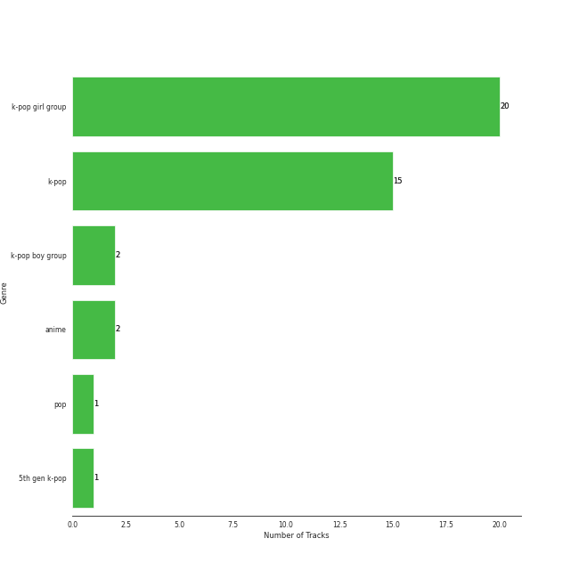

# On Repeat

[30 tracks 🔗](https://open.spotify.com/playlist/37i9dQZF1EpoN98LF1Ruyl)

[See Track Features](audio_features.md)

[See Clusters](clusters/overview.md)

## Top Artists

| Art | Tracks | 💚 | Artist | 🔗 |
|:---|---:|---:|:---|:---|
|  | 7 | 7 | [aespa](../../artists/aespa/overview.md) | [🔗](https://open.spotify.com/artist/6YVMFz59CuY7ngCxTxjpxE) |
|  | 3 | 3 | [ITZY](../../artists/itzy/overview.md) | [🔗](https://open.spotify.com/artist/2KC9Qb60EaY0kW4eH68vr3) |
|  | 2 | 2 | [KISS OF LIFE](../../artists/kiss_of_life/overview.md) | [🔗](https://open.spotify.com/artist/4TEK9tIkcoxib4GxT3O4ky) |
|  | 2 | 2 | [YUQI](../../artists/yuqi/overview.md) | [🔗](https://open.spotify.com/artist/22aCD8IrQZjcPgZw728QT6) |
|  | 2 | 2 | [Red Velvet](../../artists/red_velvet/overview.md) | [🔗](https://open.spotify.com/artist/1z4g3DjTBBZKhvAroFlhOM) |
|  | 1 | 1 | Lexie Liu | [🔗](https://open.spotify.com/artist/6fs2or0cKLEM2xohWq8SoX) |
|  | 1 | 1 | [IVE](../../artists/ive/overview.md) | [🔗](https://open.spotify.com/artist/6RHTUrRF63xao58xh9FXYJ) |
|  | 1 | 1 | [ENHYPEN](../../artists/enhypen/overview.md) | [🔗](https://open.spotify.com/artist/5t5FqBwTcgKTaWmfEbwQY9) |
|  | 1 | 1 | ZICO | [🔗](https://open.spotify.com/artist/4XpUIb8uuNlIWVKmgKZXC0) |
|  | 1 | 1 | [BLACKPINK](../../artists/blackpink/overview.md) | [🔗](https://open.spotify.com/artist/41MozSoPIsD1dJM0CLPjZF) |

See all 22 artists

| Art | Tracks | 💚 | Artist | 🔗 |
|:---|---:|---:|:---|:---|
|  | 1 | 1 | [TAEYEON](../../artists/taeyeon/overview.md) | [🔗](https://open.spotify.com/artist/3qNVuliS40BLgXGxhdBdqu) |
|  | 1 | 1 | [WINTER](../../artists/winter/overview.md) | [🔗](https://open.spotify.com/artist/3mPquBmMu97Iq9TpzQ6ayI) |
|  | 1 | 1 | [IU](../../artists/iu/overview.md) | [🔗](https://open.spotify.com/artist/3HqSLMAZ3g3d5poNaI7GOU) |
|  | 1 | 1 | [Sara Bareilles](../../artists/sara_bareilles/overview.md) | [🔗](https://open.spotify.com/artist/2Sqr0DXoaYABbjBo9HaMkM) |
|  | 1 | 1 | [CHUNG HA](../../artists/chung_ha/overview.md) | [🔗](https://open.spotify.com/artist/2PSJ6YriU7JsFucxACpU7Y) |
|  | 1 | 1 | [NMIXX](../../artists/nmixx/overview.md) | [🔗](https://open.spotify.com/artist/28ot3wh4oNmoFOdVajibBl) |
|  | 1 | 1 | JENNIE | [🔗](https://open.spotify.com/artist/250b0Wlc5Vk0CoUsaCY84M) |
|  | 1 | 1 | Steam Powered Giraffe | [🔗](https://open.spotify.com/artist/1yqs45BSh7457Flyhmdv7f) |
|  | 1 | 1 | [PENTAGON](../../artists/pentagon/overview.md) | [🔗](https://open.spotify.com/artist/1wKpMkucynaTfG8lyPprYV) |
|  | 1 | 1 | BANG YEDAM | [🔗](https://open.spotify.com/artist/1slszTGbkp1uNnI6G5uD0X) |
|  | 1 | 1 | BABYMONSTER | [🔗](https://open.spotify.com/artist/1SIocsqdEefUTE6XKGUiVS) |
|  | 1 | 1 | [WENDY](../../artists/wendy/overview.md) | [🔗](https://open.spotify.com/artist/0FRUZvZNPzM3YJMABJxf2K) |

## Top Tracks

Most and least listened tracks

| ​ | Most listened tracks | Rank | ​​ | Least listened tracks | Rank |
|:---|:---|---:|:---|:---|---:|
|  | [Mr. Vampire](../../artists/itzy/overview.md) | 35 |  | [I’m Ready](../../artists/chung_ha/overview.md) | 548 |
|  | [Holssi](../../artists/iu/overview.md) | 55 |  | [Licorice](../../artists/aespa/overview.md) | 314 |
|  | [DDU-DU DDU-DU](../../artists/blackpink/overview.md) | 78 |  | [Prologue](../../artists/aespa/overview.md) | 309 |
|  | [Nobody Knows](../../artists/kiss_of_life/overview.md) | 89 |  | [On Clap](../../artists/yuqi/overview.md) | 286 |
|  | [DASH](../../artists/nmixx/overview.md) | 112 |  | [Set The Tone](../../artists/aespa/overview.md) | 276 |
|  | SHEESH | 134 |  | [Algorhythm](../../artists/itzy/overview.md) | 256 |
|  | [Sunny Side Up!](../../artists/red_velvet/overview.md) | 147 |  | [Mine](../../artists/aespa/overview.md) | 254 |
|  | Officially Cool | 174 |  | [No Biggie](../../artists/itzy/overview.md) | 240 |
|  | [Armageddon](../../artists/aespa/overview.md) | 176 |  | [Long Chat (#♥)](../../artists/aespa/overview.md) | 239 |
|  | [Daisy](../../artists/pentagon/overview.md) | 180 |  | [Machine Gun](../../artists/sara_bareilles/overview.md) | 236 |

## Top Albums

| Art | Tracks | 💚 | Album | Release Date | 🔗 |
|:---|---:|---:|:---|:---|:---|
|  | 7 | 7 | Armageddon - The 1st Album | 2024-05-27 | [🔗](https://open.spotify.com/album/058hCti9Bupb5CJc6bd3VB) |
|  | 2 | 2 | YUQ1 | 2024-04-23 | [🔗](https://open.spotify.com/album/7LYc8ngbhwha4aGJ5kVauc) |
|  | 2 | 2 | Algorhythm | 2024-05-15 | [🔗](https://open.spotify.com/album/7ji7zKkvRlYOsu3ehctQRx) |
|  | 1 | 1 | ‘The ReVe Festival’ Finale | 2019-12-23 | [🔗](https://open.spotify.com/album/3rVtm00UfbuzWOewdm4iYM) |
|  | 1 | 1 | ‘The ReVe Festival’ Day 1 | 2019-06-19 | [🔗](https://open.spotify.com/album/2nLEiP268mSFZHW5dajM4R) |
|  | 1 | 1 | Wish You Hell - The 2nd Mini Album | 2024-03-12 | [🔗](https://open.spotify.com/album/3f8n88uX0tNvA8HTROgSkr) |
|  | 1 | 1 | WE:TH | 2020-10-12 | [🔗](https://open.spotify.com/album/1ASYbBYBwV6Rcfc2ycqmlK) |
|  | 1 | 1 | The Winning | 2024-02-20 | [🔗](https://open.spotify.com/album/08CvAj58nVMpq1Nw7T6maj) |
|  | 1 | 1 | The 2¢ Show | 2012-05-23 | [🔗](https://open.spotify.com/album/4DECRyKlhKJgjZLLuvfAI6) |
|  | 1 | 1 | SQUARE UP | 2018-06-15 | [🔗](https://open.spotify.com/album/0wOiWrujRbxlKEGWRQpKYc) |

See all 22 albums

| Art | Tracks | 💚 | Album | Release Date | 🔗 |
|:---|---:|---:|:---|:---|:---|
|  | 1 | 1 | SPOT! | 2024-04-26 | [🔗](https://open.spotify.com/album/3K3C9JjwCGQAzj3Bu7BUaI) |
|  | 1 | 1 | Officially Cool | 2024-04-02 | [🔗](https://open.spotify.com/album/7ak1PBCmrVLvOANEenebe9) |
|  | 1 | 1 | Midas Touch | 2024-04-03 | [🔗](https://open.spotify.com/album/1HfTA0xDoZ0mswFO3GB3ef) |
|  | 1 | 1 | Kaleidoscope Heart | 2010-09-07 | [🔗](https://open.spotify.com/album/627ukPRwYxyBREHxBq0vGJ) |
|  | 1 | 1 | IVE SWITCH | 2024-04-29 | [🔗](https://open.spotify.com/album/7z61DsZtWO2S4nC5xd0b9p) |
|  | 1 | 1 | INVU - The 3rd Album | 2022-02-14 | [🔗](https://open.spotify.com/album/7i2YLTVQ0dyngRuUqtGmr9) |
|  | 1 | 1 | Fe3O4: BREAK | 2024-01-15 | [🔗](https://open.spotify.com/album/5CCxLQgcI7cVwmgFDlicbP) |
|  | 1 | 1 | EENIE MEENIE | 2024-03-11 | [🔗](https://open.spotify.com/album/1q2RNzz09Vx3bOKK1yTyyg) |
|  | 1 | 1 | DARK MOON SPECIAL ALBUM <MEMORABILIA> | 2024-05-13 | [🔗](https://open.spotify.com/album/0OhJwEzXbK9Km6GQSPdmPU) |
|  | 1 | 1 | Born to be XX | 2023-11-08 | [🔗](https://open.spotify.com/album/6yDtQxvq1XRC7Y5qtS03Xx) |
|  | 1 | 1 | BORN TO BE | 2024-01-08 | [🔗](https://open.spotify.com/album/3cm3EkNQLpKu58btSJT7fz) |
|  | 1 | 1 | BABYMONS7ER | 2024-04-01 | [🔗](https://open.spotify.com/album/0eSbsl3j8jz96LC2NCLPc4) |

## Top Record Labels

| Tracks | 💚 | Label |
|---:|---:|:---|
| 11 | 11 | [SM Entertainment](../../labels/sm_entertainment/overview.md) |
| 2 | 2 | [YG Entertainment](../../labels/yg_entertainment/overview.md) |
| 2 | 2 | [WM Japan](../../labels/wm_japan/overview.md) |
| 2 | 2 | [S2 ENTERTAINMENT INC.](../../labels/s2_entertainment_inc_/overview.md) |
| 2 | 2 | [Republic Records](../../labels/republic_records/overview.md) |
| 2 | 2 | [CUBE ENTERTAINMENT](../../labels/cube_entertainment/overview.md) |
| 1 | 1 | [WM Korea](../../labels/wm_korea/overview.md) |
| 1 | 1 | [Universal Music LLC](../../labels/universal_music_llc/overview.md) |
| 1 | 1 | Steam Powered Giraffe |
| 1 | 1 | [Starship Entertainment](../../labels/starship_entertainment/overview.md) |

See all 16 labels

| Tracks | 💚 | Label |
|---:|---:|:---|
| 1 | 1 | MORE VISION |
| 1 | 1 | KOZ Entertainment |
| 1 | 1 | [Interscope Records](../../labels/interscope_records/overview.md) |
| 1 | 1 | [Epic](../../labels/epic/overview.md) |
| 1 | 1 | [EDAM Entertainment](../../labels/edam_entertainment/overview.md) |
| 1 | 1 | [BELIFT LAB](../../labels/belift_lab/overview.md) |

## Genres

| Tracks | 💚 | Genre |
|---:|---:|:---|
| 17 | 17 | [k-pop girl group](../../genres/k-pop_girl_group/overview.md) |
| 13 | 13 | [k-pop](../../genres/k-pop/overview.md) |
| 3 | 3 | [5th gen k-pop](../../genres/5th_gen_k-pop/overview.md) |
| 2 | 2 | [pop](../../genres/pop/overview.md) |
| 2 | 2 | [k-pop boy group](../../genres/k-pop_boy_group/overview.md) |
| 1 | 1 | steampunk |
| 1 | 1 | [post-teen pop](../../genres/post-teen_pop/overview.md) |
| 1 | 1 | [pop rock](../../genres/pop_rock/overview.md) |
| 1 | 1 | [neo mellow](../../genres/neo_mellow/overview.md) |
| 1 | 1 | [lilith](../../genres/lilith/overview.md) |

See all 15 genres

| Tracks | 💚 | Genre |
|---:|---:|:---|
| 1 | 1 | [korean r&b](../../genres/korean_r_b/overview.md) |
| 1 | 1 | [korean pop](../../genres/korean_pop/overview.md) |
| 1 | 1 | [ectofolk](../../genres/ectofolk/overview.md) |
| 1 | 1 | [anime](../../genres/anime/overview.md) |
| 1 | 1 | [acoustic pop](../../genres/acoustic_pop/overview.md) |

## Top Producers

| Art | Producer | Tracks | Credit Types |
|:---|:---|---:|:---|
| | Rick Bridges | 2 | Lyricist |
| | 정다연 (Jeong, Dayeon) | 1 | Lyricist |
| | 정유라 (Jeong, Yu-ra) | 1 | Producer |
| | [정은경 (Jung, Eun-Kyung)](../../producers/정은경_(jung,_eun-kyung)/overview.md) | 1 | Producer |
| | Jason Robert | 1 | Producer |
| | 임찬미 (Kim, Chan-mi) | 1 | Producer |
|  | Bekuh Boom | 1 | Songwriter |
| | [24](../../producers/24/overview.md) | 1 | Arranger, Songwriter |
| | [구종필 (Koo, Jong-Pil)](../../producers/구종필_(koo,_jong-pil)/overview.md) | 1 | Producer |
| | Daniel Davidsen | 1 | Songwriter |

View all

| Art | Producer | Tracks | Credit Types |
|:---|:---|---:|:---|
| | 진리 (Jinri) | 1 | Lyricist |
| | [서지음 (Seo, Ji Eum)](../../producers/서지음_(seo,_ji_eum)/overview.md) | 1 | Lyricist |
| | Adam von Mentzer | 1 | Songwriter |
| | 오현선 (Oh, Hyun-sun) | 1 | Lyricist |
| | 김인 (Kim, In) | 1 | Lyricist |
| | Rachel Furner | 1 | Songwriter |
|  | [CHUNG HA](../../artists/chung_ha/overview.md) | 1 | Lyricist |
| | 김영현 (Kim, Young-hyun) | 1 | Producer |
| | PAPRIKAA | 1 | Arranger, Songwriter |
| | Cazzi Opeia | 1 | Songwriter |
| | 이주형 (Lee, Juhyeong) | 1 | Producer |
|  | [Sara Bareilles](../../artists/sara_bareilles/overview.md) | 1 | Lyricist, Songwriter |
| | Digital Farm Animals | 1 | Arranger, Lyricist, Songwriter |
| | 서은일 (Seo, Eun-il) | 1 | Producer |
| | 정의석 (Jung, Euisuk) | 1 | Producer |
| | 성유진 (Sung, Yoojin) | 1 | Lyricist |
| | Jack Harvey | 1 | Arranger, Lyricist, Songwriter |
| | Deza | 1 | Lyricist |
| | 이민규 (Lee, Min-kyu) | 1 | Producer |
| | 홍장미 (Hong, Jangmi) | 1 | Producer |
| | [Fuxxy](../../producers/fuxxy/overview.md) | 1 | Arranger |
| | Jess Morgan | 1 | Songwriter |
| | 형근 (Hyeongeun) | 1 | Lyricist |
| | Noémie Legrand (Legrand, Noémie) | 1 | Songwriter |
| | PUFF | 1 | Arranger, Songwriter |
| | WKLY | 1 | Lyricist |
| | Maryjane | 1 | Lyricist |
| | EJAE | 1 | Songwriter |
| | [엄세희 (Um, Se-Hee)](../../producers/엄세희_(um,_se-hee)/overview.md) | 1 | Producer |
| | Joe Harvey | 1 | Arranger, Lyricist, Songwriter |
| | Strong Dragon | 1 | Arranger, Songwriter |
| | [Kenzie](../../producers/kenzie/overview.md) | 1 | Songwriter |
| | [구혜진 (Gu, Hye-jin)](../../producers/구혜진_(gu,_hye-jin)/overview.md) | 1 | Producer |
| | Melange | 1 | Arranger |
| | 백새임 (Baek, Sae-im) | 1 | Lyricist |
| | Julie Han | 1 | Lyricist |
| | PhD | 1 | Arranger |
| | Kobee | 1 | Arranger, Producer, Songwriter |
| | C'SA | 1 | Arranger, Producer, Songwriter |
| | Holy M | 1 | Arranger, Songwriter |
| | 임정우 (Im, Jeong-u) | 1 | Songwriter |
| | [R.Tee](../../producers/r_tee/overview.md) | 1 | Arranger, Songwriter |
| | Sofia Quinn | 1 | Songwriter |
|  | ADORA | 1 | Songwriter |
| | Druski | 1 | Producer |
| | [Tony Maserati](../../producers/tony_maserati/overview.md) | 1 | Producer |
| | 원지애 (Won, Jiae) | 1 | Lyricist |
| | [조윤경 (Jo, Yoon Kyung)](../../producers/조윤경_(jo,_yoon_kyung)/overview.md) | 1 | Lyricist |
| | EZIT | 1 | Arranger, Songwriter |
| | [TEDDY](../../producers/teddy/overview.md) | 1 | Arranger, Lyricist, Songwriter |

## Years

View all years

| Year | Number of Tracks |
|:---|---:|
| [2024](2024/overview.md) | 22 |
| 2023 | 1 |
| 2022 | 1 |
| 2020 | 1 |
| 2019 | 2 |
| 2018 | 1 |
| 2012 | 1 |
| 2010 | 1 |

| ​ | 10 newest albums | ​​ | 10 oldest albums |
|:---|:---|:---|:---|
|  | Armageddon - The 1st Album (2024-05-27) |  | Kaleidoscope Heart (2010-09-07) |
|  | Algorhythm (2024-05-15) |  | The 2¢ Show (2012-05-23) |
|  | DARK MOON SPECIAL ALBUM <MEMORABILIA> (2024-05-13) |  | SQUARE UP (2018-06-15) |
|  | IVE SWITCH (2024-04-29) |  | ‘The ReVe Festival’ Day 1 (2019-06-19) |
|  | SPOT! (2024-04-26) |  | ‘The ReVe Festival’ Finale (2019-12-23) |
|  | YUQ1 (2024-04-23) |  | WE:TH (2020-10-12) |
|  | Midas Touch (2024-04-03) |  | INVU - The 3rd Album (2022-02-14) |
|  | Officially Cool (2024-04-02) |  | Born to be XX (2023-11-08) |
|  | BABYMONS7ER (2024-04-01) |  | BORN TO BE (2024-01-08) |
|  | Wish You Hell - The 2nd Mini Album (2024-03-12) |  | Fe3O4: BREAK (2024-01-15) |