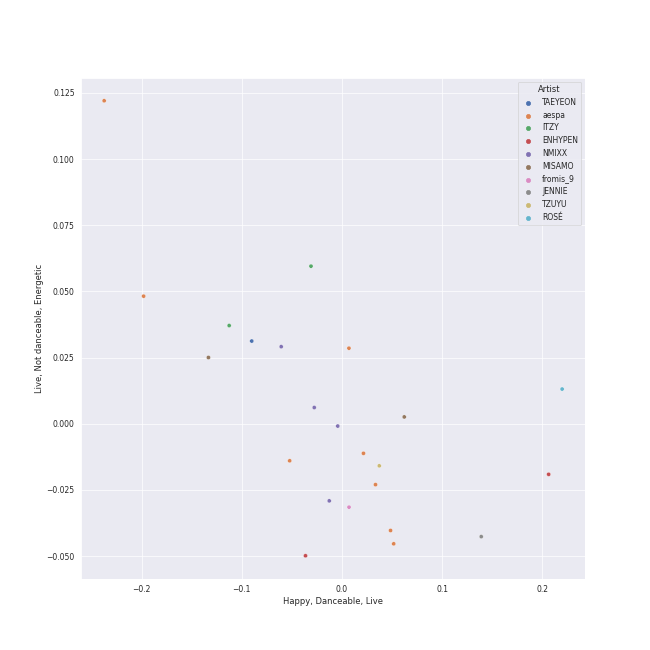

# On Repeat

[30 tracks 🔗](https://open.spotify.com/playlist/37i9dQZF1EpoN98LF1Ruyl)

[See Track Features](audio_features.md)

[See Clusters](clusters/overview.md)

## Top Artists

| Art | Tracks | 💚 | Artist | 🔗 |
|:---|---:|---:|:---|:---|
|  | 5 | 5 | [aespa](../../artists/aespa/overview.md) | [🔗](https://open.spotify.com/artist/6YVMFz59CuY7ngCxTxjpxE) |
|  | 4 | 4 | [ITZY](../../artists/itzy/overview.md) | [🔗](https://open.spotify.com/artist/2KC9Qb60EaY0kW4eH68vr3) |
|  | 3 | 3 | [IU](../../artists/iu/overview.md) | [🔗](https://open.spotify.com/artist/3HqSLMAZ3g3d5poNaI7GOU) |
|  | 3 | 3 | [Red Velvet](../../artists/red_velvet/overview.md) | [🔗](https://open.spotify.com/artist/1z4g3DjTBBZKhvAroFlhOM) |
|  | 2 | 2 | [TWICE](../../artists/twice/overview.md) | [🔗](https://open.spotify.com/artist/7n2Ycct7Beij7Dj7meI4X0) |
|  | 2 | 2 | [KISS OF LIFE](../../artists/kiss_of_life/overview.md) | [🔗](https://open.spotify.com/artist/4TEK9tIkcoxib4GxT3O4ky) |
|  | 2 | 2 | [TAEYEON](../../artists/taeyeon/overview.md) | [🔗](https://open.spotify.com/artist/3qNVuliS40BLgXGxhdBdqu) |
|  | 2 | 2 | [(G)I-DLE](../../artists/(g)i-dle/overview.md) | [🔗](https://open.spotify.com/artist/2AfmfGFbe0A0WsTYm0SDTx) |
|  | 2 | 2 | [NMIXX](../../artists/nmixx/overview.md) | [🔗](https://open.spotify.com/artist/28ot3wh4oNmoFOdVajibBl) |
|  | 1 | 1 | TAEYONG | [🔗](https://open.spotify.com/artist/6SKusTjOAPsTZ6kareKQdm) |

See all 16 artists

| Art | Tracks | 💚 | Artist | 🔗 |
|:---|---:|---:|:---|:---|
|  | 1 | 1 | [ENHYPEN](../../artists/enhypen/overview.md) | [🔗](https://open.spotify.com/artist/5t5FqBwTcgKTaWmfEbwQY9) |
|  | 1 | 1 | [LE SSERAFIM](../../artists/le_sserafim/overview.md) | [🔗](https://open.spotify.com/artist/4SpbR6yFEvexJuaBpgAU5p) |
|  | 1 | 1 | BABYMONSTER | [🔗](https://open.spotify.com/artist/1SIocsqdEefUTE6XKGUiVS) |
|  | 1 | 1 | [Jacob Collier](../../artists/jacob_collier/overview.md) | [🔗](https://open.spotify.com/artist/0QWrMNukfcVOmgEU0FEDyD) |
|  | 1 | 1 | Chris Martin | [🔗](https://open.spotify.com/artist/0LQoZQIV0mIs0y0XQb0Sw2) |
|  | 1 | 1 | [WENDY](../../artists/wendy/overview.md) | [🔗](https://open.spotify.com/artist/0FRUZvZNPzM3YJMABJxf2K) |

## Top Albums

| Art | Tracks | 💚 | Album | Release Date | 🔗 |
|:---|---:|---:|:---|:---|:---|
|  | 4 | 4 | BORN TO BE | 2024-01-08 | [🔗](https://open.spotify.com/album/3cm3EkNQLpKu58btSJT7fz) |
|  | 3 | 3 | The Winning | 2024-02-20 | [🔗](https://open.spotify.com/album/08CvAj58nVMpq1Nw7T6maj) |
|  | 3 | 3 | Drama - The 4th Mini Album | 2023-11-10 | [🔗](https://open.spotify.com/album/5NMtxQJy4wq3mpo3ERVnLs) |
|  | 3 | 3 | Chill Kill - The 3rd Album | 2023-11-13 | [🔗](https://open.spotify.com/album/4UUICitfodUVCNhzmDFbrO) |
|  | 2 | 2 | With YOU-th | 2024-02-23 | [🔗](https://open.spotify.com/album/575TQDOQqc0MAheeEeKWUR) |
|  | 2 | 2 | To. X - The 5th Mini Album | 2023-11-27 | [🔗](https://open.spotify.com/album/0VciVDVU6NoqtQ0WAIlTmD) |
|  | 2 | 2 | Fe3O4: BREAK | 2024-01-15 | [🔗](https://open.spotify.com/album/5CCxLQgcI7cVwmgFDlicbP) |
|  | 2 | 2 | Born to be XX | 2023-11-08 | [🔗](https://open.spotify.com/album/6yDtQxvq1XRC7Y5qtS03Xx) |
|  | 2 | 2 | 2 | 2024-01-29 | [🔗](https://open.spotify.com/album/0mC9MXPddkzggVsOXh5gd3) |
|  | 1 | 1 | Wish You Hell - The 2nd Mini Album | 2024-03-12 | [🔗](https://open.spotify.com/album/3f8n88uX0tNvA8HTROgSkr) |

See all 16 albums

| Art | Tracks | 💚 | Album | Release Date | 🔗 |
|:---|---:|---:|:---|:---|:---|
|  | 1 | 1 | TAP - The 2nd Mini Album | 2024-02-26 | [🔗](https://open.spotify.com/album/5PliHwqYkEzdXHZnA6scC0) |
|  | 1 | 1 | Regret of the Times (2024 aespa Remake Version) - SM STATION | 2024-01-15 | [🔗](https://open.spotify.com/album/4Nav3JE8TIOFiuY5x95MIh) |
|  | 1 | 1 | ORANGE BLOOD | 2023-11-17 | [🔗](https://open.spotify.com/album/7dsAlxH9cMgyREm8OLdWWT) |
|  | 1 | 1 | EASY | 2024-02-19 | [🔗](https://open.spotify.com/album/1YCj4PZi08G20y2ekGKY0C) |
|  | 1 | 1 | Djesse Vol. 4 | 2024-03-01 | [🔗](https://open.spotify.com/album/13r6eqjYlKELFQlNvVCBz1) |
|  | 1 | 1 | BABYMONSTER Debut Digital Single [BATTER UP] | 2023-11-27 | [🔗](https://open.spotify.com/album/2CSQuvvt3XHLDX36O3nRv7) |

## Top Record Labels

| Tracks | 💚 | Label |
|---:|---:|:---|
| 11 | 11 | [SM Entertainment](../../labels/sm_entertainment/overview.md) |
| 8 | 8 | [Republic Records](../../labels/republic_records/overview.md) |
| 3 | 3 | [Warner Records](../../labels/warner_records/overview.md) |
| 3 | 3 | [EDAM Entertainment](../../labels/edam_entertainment/overview.md) |
| 2 | 2 | [S2 ENTERTAINMENT INC.](../../labels/s2_entertainment_inc_/overview.md) |
| 2 | 2 | [CUBE ENTERTAINMENT](../../labels/cube_entertainment/overview.md) |
| 1 | 1 | [YG Entertainment](../../labels/yg_entertainment/overview.md) |
| 1 | 1 | [SOURCE MUSIC](../../labels/source_music/overview.md) |
| 1 | 1 | [Decca (UMO)](../../labels/decca_(umo)/overview.md) |
| 1 | 1 | [BELIFT LAB](../../labels/belift_lab/overview.md) |

## Genres

| Tracks | 💚 | Genre |
|---:|---:|:---|
| 20 | 20 | [k-pop girl group](../../genres/k-pop_girl_group/overview.md) |
| 18 | 18 | [k-pop](../../genres/k-pop/overview.md) |
| 5 | 5 | [pop](../../genres/pop/overview.md) |
| 1 | 1 | [uk alternative pop](../../genres/uk_alternative_pop/overview.md) |
| 1 | 1 | [korean pop](../../genres/korean_pop/overview.md) |
| 1 | 1 | [k-pop boy group](../../genres/k-pop_boy_group/overview.md) |
| 1 | 1 | [anime](../../genres/anime/overview.md) |

## Top Producers

| Art | Producer | Tracks | Credit Types |
|:---|:---|---:|:---|
| | [구혜진 (Gu, Hye-jin)](../../producers/구혜진_(gu,_hye-jin)/overview.md) | 5 | Producer |
| | 임찬미 (Kim, Chan-mi) | 4 | Producer |
| | Rick Bridges | 2 | Lyricist |
| | Daily | 2 | Arranger, Songwriter |
| | [Tony Maserati](../../producers/tony_maserati/overview.md) | 2 | Producer |
| | Likey | 2 | Arranger, Songwriter |
| | KayOne | 2 | Producer |
| | [구종필 (Koo, Jong-Pil)](../../producers/구종필_(koo,_jong-pil)/overview.md) | 2 | Producer |
| | Kobee | 2 | Arranger, Producer, Songwriter |
| | Melanie Joy Fontana | 2 | Songwriter, Lyricist |

View all

| Art | Producer | Tracks | Credit Types |
|:---|:---|---:|:---|
|  | [JEON SOYEON](../../artists/jeon_soyeon/overview.md) | 2 | Arranger, Lyricist, Songwriter |
| | 김영현 (Kim, Young-hyun) | 2 | Producer |
| | [earattack](../../producers/earattack/overview.md) | 2 | Arranger, Producer, Songwriter |
| | 오현선 (Oh, Hyun-sun) | 2 | Lyricist |
| | 서은일 (Seo, Eun-il) | 2 | Producer |
| | 이우현 (Lee, Woo-hyun) | 2 | Arranger, Songwriter |
| | [엄세희 (Um, Se-Hee)](../../producers/엄세희_(um,_se-hee)/overview.md) | 2 | Producer |
| | [Pop Time](../../producers/pop_time/overview.md) | 2 | Arranger, Songwriter |
| | Gusten Dahlqvist | 1 | Arranger, Producer, Songwriter |
| | Jared Lee | 1 | Lyricist, Songwriter |
| | 홍장미 (Hong, Jangmi) | 1 | Producer |
| | 최현석 | 1 | Lyricist |
| | Chaz Mishan | 1 | Arranger, Songwriter |
| | Joseph K | 1 | Arranger, Songwriter |
| | Deza | 1 | Lyricist |
| | 성유진 (Sung, Yoojin) | 1 | Lyricist |
| | [Arschtritt Lindgren](../../producers/arschtritt_lindgren/overview.md) | 1 | Arranger, Songwriter |
| | 여민수 (Yeo, Min Soo) | 1 | Producer |
| | Arineh Karimi | 1 | Songwriter |
| | 방혜현 (Bang, Hye Hyun) | 1 | Lyricist |
| | [정은경 (Jung, Eun-Kyung)](../../producers/정은경_(jung,_eun-kyung)/overview.md) | 1 | Producer |
| | PAPRIKAA | 1 | Arranger, Songwriter |
| | Zarah Christenson | 1 | Songwriter |
| | Kyler Niko | 1 | Songwriter |
| | Brian U | 1 | Arranger, Songwriter |
| | [서지음 (Seo, Ji Eum)](../../producers/서지음_(seo,_ji_eum)/overview.md) | 1 | Lyricist |
| | Adam von Mentzer | 1 | Songwriter |
| | Frankie Day | 1 | Songwriter |
| | 이태섭 (Lee, Tae-Sub) | 1 | Producer |
| | 김인 (Kim, In) | 1 | Lyricist |
| | Brown Panda | 1 | Arranger, Songwriter |
| | WHERE THE NOISE | 1 | Lyricist |
| | アサ (Asa) | 1 | Lyricist, Songwriter |
| | [Josh Gudwin](../../producers/josh_gudwin/overview.md) | 1 | Producer |
| | BIGTONE | 1 | Lyricist |
| | [심은지 (Sim, Eunjee)](../../producers/심은지_(sim,_eunjee)/overview.md) | 1 | Lyricist |
| | 유정연 (Yoo, Jeong-yeon) | 1 | Lyricist |
| | EZIT | 1 | Arranger, Songwriter |
| | Paulina Cerrilla | 1 | Songwriter |
| | 백새임 (Baek, Sae-im) | 1 | Lyricist |
| | 양현석 (Yang, Hyun Suk) | 1 | Arranger, Lyricist, Songwriter |
| | Maria Marcus | 1 | Songwriter |
| | Melange | 1 | Arranger |
| | 이스란 (Lee, Seran) | 1 | Lyricist |
| | 강선영 (강선영) | 1 | Producer |
| | GG Ramirez | 1 | Songwriter |
| | LSY | 1 | Arranger, Songwriter |
| | Strong Dragon | 1 | Arranger, Songwriter |
| | HONEY NOISE | 1 | Arranger, Producer, Songwriter |
| | WKLY | 1 | Lyricist |
| | 복주영 (Bok, Ju Young) | 1 | Lyricist |
| | PUFF | 1 | Arranger, Songwriter |
| | Noémie Legrand (Legrand, Noémie) | 1 | Songwriter |
| | Ayushy | 1 | Arranger, Songwriter |
| | AFTRSHOK | 1 | Arranger, Songwriter |
| | Tobias Näslund (Näslund, Tobias) | 1 | Arranger, Producer, Songwriter |
| | 형근 (Hyeongeun) | 1 | Lyricist |
| | Sofia Quinn | 1 | Songwriter |
| | 이찬혁 (Lee, Chanhyeok) | 1 | Lyricist |
| | [조윤경 (Jo, Yoon Kyung)](../../producers/조윤경_(jo,_yoon_kyung)/overview.md) | 1 | Lyricist |
| | 정다연 (Jeong, Dayeon) | 1 | Lyricist |
| | NVR know | 1 | Arranger, Songwriter |
| | Noday | 1 | Arranger, Lyricist |
|  | ADORA | 1 | Songwriter |
| | Awrii | 1 | Arranger, Songwriter |
| | Julie Han | 1 | Lyricist |
| | Jacob Aaron | 1 | Songwriter |
| | 임정우 (Im, Jeong-u) | 1 | Songwriter |
| | YUE | 1 | Producer |
| | Holy M | 1 | Arranger, Songwriter |
| | C'SA | 1 | Arranger, Producer, Songwriter |
| | Dee.P | 1 | Arranger, Songwriter |
| | 원지애 (Won, Jiae) | 1 | Lyricist |

## Most and least listened tracks
| ​ | Most listened tracks | Score | ​​ | Least listened tracks | Score |
|:---|:---|---:|:---|:---|---:|
|  | [Drama](../../artists/aespa/overview.md) | 13947 |  | [Shopper](../../artists/iu/overview.md) | 33 |
|  | [Trick or Trick](../../artists/aespa/overview.md) | 12404 |  | [Over You (feat. aespa & Chris Martin)](../../artists/jacob_collier/overview.md) | 36 |
|  | [Chill Kill](../../artists/red_velvet/overview.md) | 8219 |  | [Wife](../../artists/(g)i-dle/overview.md) | 39 |
|  | [Sweet Venom](../../artists/enhypen/overview.md) | 8093 |  | [EASY](../../artists/le_sserafim/overview.md) | 51 |
|  | [One Kiss](../../artists/red_velvet/overview.md) | 7747 |  | [ONE SPARK](../../artists/twice/overview.md) | 60 |
|  | [Mr. Vampire](../../artists/itzy/overview.md) | 5890 |  | TAP | 63 |
|  | [Don't Blink](../../artists/aespa/overview.md) | 5183 |  | [Run Away (RYUJIN)](../../artists/itzy/overview.md) | 69 |
|  | [To. X](../../artists/taeyeon/overview.md) | 5146 |  | [Wish You Hell](../../artists/wendy/overview.md) | 75 |
|  | [Burn It Down](../../artists/taeyeon/overview.md) | 3307 |  | [Soñar (Breaker)](../../artists/nmixx/overview.md) | 87 |
|  | [BORN TO BE](../../artists/itzy/overview.md) | 2371 |  | [BLOOM](../../artists/twice/overview.md) | 100 |

## Years

| ​ | 10 newest albums | ​​ | 10 oldest albums |
|:---|:---|:---|:---|
|  | Wish You Hell - The 2nd Mini Album (2024-03-12) |  | Born to be XX (2023-11-08) |
|  | Djesse Vol. 4 (2024-03-01) |  | Drama - The 4th Mini Album (2023-11-10) |
|  | TAP - The 2nd Mini Album (2024-02-26) |  | Chill Kill - The 3rd Album (2023-11-13) |
|  | With YOU-th (2024-02-23) |  | ORANGE BLOOD (2023-11-17) |
|  | The Winning (2024-02-20) |  | To. X - The 5th Mini Album (2023-11-27) |
|  | EASY (2024-02-19) |  | BABYMONSTER Debut Digital Single [BATTER UP] (2023-11-27) |
|  | 2 (2024-01-29) |  | BORN TO BE (2024-01-08) |
|  | Regret of the Times (2024 aespa Remake Version) - SM STATION (2024-01-15) |  | Regret of the Times (2024 aespa Remake Version) - SM STATION (2024-01-15) |
|  | Fe3O4: BREAK (2024-01-15) |  | Fe3O4: BREAK (2024-01-15) |
|  | BORN TO BE (2024-01-08) |  | 2 (2024-01-29) |