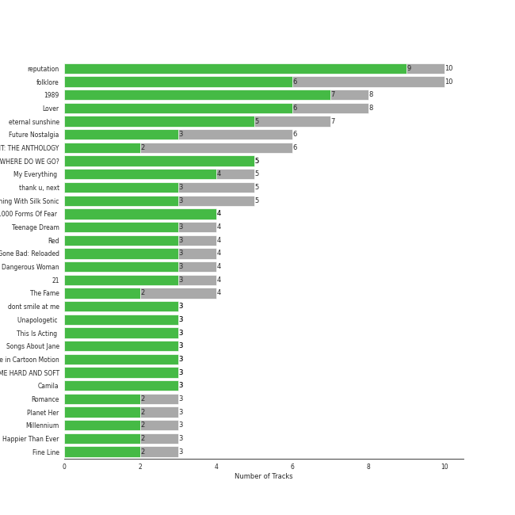

# Pop

## Top Artists

See all artists

|   Number of Tracks | Art                                                                                              | Artist                                         | 🔗                                                           |
|-------------------:|:-------------------------------------------------------------------------------------------------|:-----------------------------------------------|:------------------------------------------------------------|
|                 51 |  | [Taylor Swift](../artists/taylor_swift.md)     | [🔗](https://open.spotify.com/artist/06HL4z0CvFAxyc27GXpf02) |
|                 25 |  | [Ariana Grande](../artists/ariana_grande.md)   | [🔗](https://open.spotify.com/artist/66CXWjxzNUsdJxJ2JdwvnR) |
|                 13 |  | [Lady Gaga](../artists/lady_gaga.md)           | [🔗](https://open.spotify.com/artist/1HY2Jd0NmPuamShAr6KMms) |
|                 11 |  | [Dua Lipa](../artists/dua_lipa.md)             | [🔗](https://open.spotify.com/artist/6M2wZ9GZgrQXHCFfjv46we) |
|                 11 |  | [Rihanna](../artists/rihanna.md)               | [🔗](https://open.spotify.com/artist/5pKCCKE2ajJHZ9KAiaK11H) |
|                 11 |  | [Bruno Mars](../artists/bruno_mars.md)         | [🔗](https://open.spotify.com/artist/0du5cEVh5yTK9QJze8zA0C) |
|                 10 |  | [Billie Eilish](../artists/billie_eilish.md)   | [🔗](https://open.spotify.com/artist/6qqNVTkY8uBg9cP3Jd7DAH) |
|                  8 |  | Sia                                            | [🔗](https://open.spotify.com/artist/5WUlDfRSoLAfcVSX1WnrxN) |
|                  8 |  | Camila Cabello                                 | [🔗](https://open.spotify.com/artist/4nDoRrQiYLoBzwC5BhVJzF) |
|                  8 |  | Britney Spears                                 | [🔗](https://open.spotify.com/artist/26dSoYclwsYLMAKD3tpOr4) |
|                  7 |  | Katy Perry                                     | [🔗](https://open.spotify.com/artist/6jJ0s89eD6GaHleKKya26X) |
|                  7 |  | Doja Cat                                       | [🔗](https://open.spotify.com/artist/5cj0lLjcoR7YOSnhnX0Po5) |
|                  7 |  | Adele                                          | [🔗](https://open.spotify.com/artist/4dpARuHxo51G3z768sgnrY) |
|                  7 |  | Jason Derulo                                   | [🔗](https://open.spotify.com/artist/07YZf4WDAMNwqr4jfgOZ8y) |
|                  5 |  | Janelle Monáe                                  | [🔗](https://open.spotify.com/artist/6ueGR6SWhUJfvEhqkvMsVs) |
|                  5 |  | Clean Bandit                                   | [🔗](https://open.spotify.com/artist/6MDME20pz9RveH9rEXvrOM) |
|                  5 |  | Bebe Rexha                                     | [🔗](https://open.spotify.com/artist/64M6ah0SkkRsnPGtGiRAbb) |
|                  5 |  | Coldplay                                       | [🔗](https://open.spotify.com/artist/4gzpq5DPGxSnKTe4SA8HAU) |
|                  5 |  | Justin Bieber                                  | [🔗](https://open.spotify.com/artist/1uNFoZAHBGtllmzznpCI3s) |
|                  5 |  | Nicki Minaj                                    | [🔗](https://open.spotify.com/artist/0hCNtLu0JehylgoiP8L4Gh) |
|                  5 |  | Ellie Goulding                                 | [🔗](https://open.spotify.com/artist/0X2BH1fck6amBIoJhDVmmJ) |
|                  5 |  | Maroon 5                                       | [🔗](https://open.spotify.com/artist/04gDigrS5kc9YWfZHwBETP) |
|                  4 |  | Shawn Mendes                                   | [🔗](https://open.spotify.com/artist/7n2wHs1TKAczGzO7Dd2rGr) |
|                  4 |  | Amy Winehouse                                  | [🔗](https://open.spotify.com/artist/6Q192DXotxtaysaqNPy5yR) |
|                  4 |  | Harry Styles                                   | [🔗](https://open.spotify.com/artist/6KImCVD70vtIoJWnq6nGn3) |
|                  4 |  | Backstreet Boys                                | [🔗](https://open.spotify.com/artist/5rSXSAkZ67PYJSvpUpkOr7) |
|                  4 |  | Miley Cyrus                                    | [🔗](https://open.spotify.com/artist/5YGY8feqx7naU7z4HrwZM6) |
|                  4 |  | [Sara Bareilles](../artists/sara_bareilles.md) | [🔗](https://open.spotify.com/artist/2Sqr0DXoaYABbjBo9HaMkM) |
|                  4 |  | Usher                                          | [🔗](https://open.spotify.com/artist/23zg3TcAtWQy7J6upgbUnj) |
|                  3 |  | Calvin Harris                                  | [🔗](https://open.spotify.com/artist/7CajNmpbOovFoOoasH2HaY) |
|                  3 |  | Charlie Puth                                   | [🔗](https://open.spotify.com/artist/6VuMaDnrHyPL1p4EHjYLi7) |
|                  3 |  | Demi Lovato                                    | [🔗](https://open.spotify.com/artist/6S2OmqARrzebs0tKUEyXyp) |
|                  3 |  | John Legend                                    | [🔗](https://open.spotify.com/artist/5y2Xq6xcjJb2jVM54GHK3t) |
|                  3 |  | CeeLo Green                                    | [🔗](https://open.spotify.com/artist/5nLYd9ST4Cnwy6NHaCxbj8) |
|                  3 |  | MIKA                                           | [🔗](https://open.spotify.com/artist/5MmVJVhhYKQ86izuGHzJYA) |
|                  3 |  | Cardi B                                        | [🔗](https://open.spotify.com/artist/4kYSro6naA4h99UJvo89HB) |
|                  3 |  | Mark Ronson                                    | [🔗](https://open.spotify.com/artist/3hv9jJF3adDNsBSIQDqcjp) |
|                  3 |  | Jessie J                                       | [🔗](https://open.spotify.com/artist/2gsggkzM5R49q6jpPvazou) |
|                  3 |  | Halsey                                         | [🔗](https://open.spotify.com/artist/26VFTg2z8YR0cCuwLzESi2) |
|                  3 |  | Olivia Rodrigo                                 | [🔗](https://open.spotify.com/artist/1McMsnEElThX1knmY4oliG) |
|                  3 |  | P!nk                                           | [🔗](https://open.spotify.com/artist/1KCSPY1glIKqW2TotWuXOR) |
|                  2 |  | Lil Nas X                                      | [🔗](https://open.spotify.com/artist/7jVv8c5Fj3E9VhNjxT4snq) |
|                  2 |  | Jon McLaughlin                                 | [🔗](https://open.spotify.com/artist/6z29S0IoiBJpSMP8plyCj7) |
|                  2 |  | *NSYNC                                         | [🔗](https://open.spotify.com/artist/6Ff53KvcvAj5U7Z1vojB5o) |
|                  2 |  | Iggy Azalea                                    | [🔗](https://open.spotify.com/artist/5yG7ZAZafVaAlMTeBybKAL) |
|                  2 |  | B.o.B                                          | [🔗](https://open.spotify.com/artist/5ndkK3dpZLKtBklKjxNQwT) |
|                  2 |  | Juicy J                                        | [🔗](https://open.spotify.com/artist/5gCRApTajqwbnHHPbr2Fpi) |
|                  2 |  | OneRepublic                                    | [🔗](https://open.spotify.com/artist/5Pwc4xIPtQLFEnJriah9YJ) |
|                  2 |  | Tyga                                           | [🔗](https://open.spotify.com/artist/5LHRHt1k9lMyONurDHEdrp) |
|                  2 |  | Lizzo                                          | [🔗](https://open.spotify.com/artist/56oDRnqbIiwx4mymNEv7dS) |
|                  2 |  | Imagine Dragons                                | [🔗](https://open.spotify.com/artist/53XhwfbYqKCa1cC15pYq2q) |
|                  2 |  | Glass Animals                                  | [🔗](https://open.spotify.com/artist/4yvcSjfu4PC0CYQyLy4wSq) |
|                  2 |  | Daft Punk                                      | [🔗](https://open.spotify.com/artist/4tZwfgrHOc3mvqYlEYSvVi) |
|                  2 |  | DaBaby                                         | [🔗](https://open.spotify.com/artist/4r63FhuTkUYltbVAg5TQnk) |
|                  2 |  | Jason Mraz                                     | [🔗](https://open.spotify.com/artist/4phGZZrJZRo4ElhRtViYdl) |
|                  2 |  | [BLACKPINK](../artists/blackpink.md)           | [🔗](https://open.spotify.com/artist/41MozSoPIsD1dJM0CLPjZF) |
|                  2 |  | Twenty One Pilots                              | [🔗](https://open.spotify.com/artist/3YQKmKGau1PzlVlkL1iodx) |
|                  2 |  | [BTS](../artists/bts.md)                       | [🔗](https://open.spotify.com/artist/3Nrfpe0tUJi4K4DXYWgMUX) |
|                  2 |  | Sean Paul                                      | [🔗](https://open.spotify.com/artist/3Isy6kedDrgPYoTS1dazA9) |
|                  2 |  | The Script                                     | [🔗](https://open.spotify.com/artist/3AQRLZ9PuTAozP28Skbq8V) |
|                  2 |  | Hozier                                         | [🔗](https://open.spotify.com/artist/2FXC3k01G6Gw61bmprjgqS) |
|                  2 |  | Daniel Caesar                                  | [🔗](https://open.spotify.com/artist/20wkVLutqVOYrc0kxFs7rA) |
|                  2 |  | Fifth Harmony                                  | [🔗](https://open.spotify.com/artist/1l8Fu6IkuTP0U5QetQJ5Xt) |
|                  2 |  | Christina Aguilera                             | [🔗](https://open.spotify.com/artist/1l7ZsJRRS8wlW3WfJfPfNS) |
|                  2 |  | Mabel                                          | [🔗](https://open.spotify.com/artist/1MIVXf74SZHmTIp4V4paH4) |
|                  2 |  | [Michael Bublé](../artists/michael_bubl_.md)   | [🔗](https://open.spotify.com/artist/1GxkXlMwML1oSg5eLPiAz3) |
|                  2 |  | Megan Thee Stallion                            | [🔗](https://open.spotify.com/artist/181bsRPaVXVlUKXrxwZfHK) |
|                  2 |  | Lorde                                          | [🔗](https://open.spotify.com/artist/163tK9Wjr9P9DmM0AVK7lm) |
|                  2 |  | Shakira                                        | [🔗](https://open.spotify.com/artist/0EmeFodog0BfCgMzAIvKQp) |
|                  2 |  | Selena Gomez                                   | [🔗](https://open.spotify.com/artist/0C8ZW7ezQVs4URX5aX7Kqx) |
|                  1 |  | Rachael Yamagata                               | [🔗](https://open.spotify.com/artist/7w0qj2HiAPIeUcoPogvOZ6) |
|                  1 |  | SZA                                            | [🔗](https://open.spotify.com/artist/7tYKF4w9nC0nq9CsPZTHyP) |
|                  1 |  | Lil Jon                                        | [🔗](https://open.spotify.com/artist/7sfl4Xt5KmfyDs2T3SVSMK) |
|                  1 |  | half•alive                                     | [🔗](https://open.spotify.com/artist/7sOR7gk6XUlGnxj3p9F54k) |
|                  1 |  | Snoop Dogg                                     | [🔗](https://open.spotify.com/artist/7hJcb9fa4alzcOq3EaNPoG) |
|                  1 |  | Jonas Brothers                                 | [🔗](https://open.spotify.com/artist/7gOdHgIoIKoe4i9Tta6qdD) |
|                  1 |  | Colby O'Donis                                  | [🔗](https://open.spotify.com/artist/7fObcBw9VM3x7ntWKCYl0z) |
|                  1 |  | Ty Dolla $ign                                  | [🔗](https://open.spotify.com/artist/7c0XG5cIJTrrAgEC3ULPiq) |
|                  1 |  | Hwa Sa                                         | [🔗](https://open.spotify.com/artist/7bmYpVgQub656uNTu6qGNQ) |
|                  1 |  | Wyclef Jean                                    | [🔗](https://open.spotify.com/artist/7aBzpmFXB4WWpPl2F7RjBe) |
|                  1 |  | Christina Perri                                | [🔗](https://open.spotify.com/artist/7H55rcKCfwqkyDFH9wpKM6) |
|                  1 |  | Freshlyground                                  | [🔗](https://open.spotify.com/artist/7AcV1lk8Zrgo1691PDWEle) |
|                  1 |  | André 3000                                     | [🔗](https://open.spotify.com/artist/74V3dE1a51skRkdII8y2C6) |
|                  1 |  | The Pussycat Dolls                             | [🔗](https://open.spotify.com/artist/6wPhSqRtPu1UhRCDX5yaDJ) |
|                  1 |  | [Beyoncé](../artists/beyonc_.md)               | [🔗](https://open.spotify.com/artist/6vWDO969PvNqNYHIOW5v0m) |
|                  1 |  | Carly Rae Jepsen                               | [🔗](https://open.spotify.com/artist/6sFIWsNpZYqfjUpaCgueju) |
|                  1 |  | H 3 F                                          | [🔗](https://open.spotify.com/artist/6jIK3obS1fJqb3Vu74AYX3) |
|                  1 |  | [Kimbra](../artists/kimbra.md)                 | [🔗](https://open.spotify.com/artist/6hk7Yq1DU9QcCCrz9uc0Ti) |
|                  1 |  | 24kGoldn                                       | [🔗](https://open.spotify.com/artist/6fWVd57NKTalqvmjRd2t8Z) |
|                  1 |  | Colbie Caillat                                 | [🔗](https://open.spotify.com/artist/6aZyMrc4doVtZyKNilOmwu) |
|                  1 |  | Ally Brooke                                    | [🔗](https://open.spotify.com/artist/6TXM1kV4L8DsDAkAfbOPYk) |
|                  1 |  | Machine Gun Kelly                              | [🔗](https://open.spotify.com/artist/6TIYQ3jFPwQSRmorSezPxX) |
|                  1 |  | Silk Sonic                                     | [🔗](https://open.spotify.com/artist/6PvvGcCY2XtUcSRld1Wilr) |
|                  1 |  | Khalid                                         | [🔗](https://open.spotify.com/artist/6LuN9FCkKOj5PcnpouEgny) |
|                  1 |  | Kesha                                          | [🔗](https://open.spotify.com/artist/6LqNN22kT3074XbTVUrhzX) |
|                  1 |  | Kid Ink                                        | [🔗](https://open.spotify.com/artist/6KZDXtSj0SzGOV705nNeh3) |
|                  1 |  | The Womack Sisters                             | [🔗](https://open.spotify.com/artist/6BjLHAiun9TeqC55KB3L6s) |
|                  1 |  | Martin Garrix                                  | [🔗](https://open.spotify.com/artist/60d24wfXkVzDSfLS6hyCjZ) |
|                  1 |  | Stellar                                        | [🔗](https://open.spotify.com/artist/5yw4tA8D5uG7tT3NaDvq10) |
|                  1 |  | A Great Big World                              | [🔗](https://open.spotify.com/artist/5xKp3UyavIBUsGy3DQdXeF) |
|                  1 |  | Skrillex                                       | [🔗](https://open.spotify.com/artist/5he5w2lnU9x7JFhnwcekXX) |
|                  1 |  | ZAYN                                           | [🔗](https://open.spotify.com/artist/5ZsFI1h6hIdQRw2ti0hz81) |
|                  1 |  | Timbaland                                      | [🔗](https://open.spotify.com/artist/5Y5TRrQiqgUO4S36tzjIRZ) |
|                  1 |  | Moses Sumney                                   | [🔗](https://open.spotify.com/artist/5W10uJRsbt9bROJDKoI1Wn) |
|                  1 |  | Social House                                   | [🔗](https://open.spotify.com/artist/5UjifI1TYefXWn9GdqDOHl) |
|                  1 |  | Gnarls Barkley                                 | [🔗](https://open.spotify.com/artist/5SbkVQYYzlw1kte75QIabH) |
|                  1 |  | 5 Seconds of Summer                            | [🔗](https://open.spotify.com/artist/5Rl15oVamLq7FbSb0NNBNy) |
|                  1 |  | LISA                                           | [🔗](https://open.spotify.com/artist/5L1lO4eRHmJ7a0Q6csE5cT) |
|                  1 |  | RAYE                                           | [🔗](https://open.spotify.com/artist/5KKpBU5eC2tJDzf0wmlRp2) |
|                  1 |  | Lauv                                           | [🔗](https://open.spotify.com/artist/5JZ7CnR6gTvEMKX4g70Amv) |
|                  1 |  | benny blanco                                   | [🔗](https://open.spotify.com/artist/5CiGnKThu5ctn9pBxv7DGa) |
|                  1 |  | Jawsh 685                                      | [🔗](https://open.spotify.com/artist/56mfhUDKa1vec6rSLZV5Eg) |
|                  1 |  | DJ Snake                                       | [🔗](https://open.spotify.com/artist/540vIaP2JwjQb9dm3aArA4) |
|                  1 |  | Young Thug                                     | [🔗](https://open.spotify.com/artist/50co4Is1HCEo8bhOyUWKpn) |
|                  1 |  | Gracie Abrams                                  | [🔗](https://open.spotify.com/artist/4tuJ0bMpJh08umKkEXKUI5) |
|                  1 |  | Bad Bunny                                      | [🔗](https://open.spotify.com/artist/4q3ewBCX7sLwd24euuV69X) |
|                  1 |  | Travis Barker                                  | [🔗](https://open.spotify.com/artist/4exLIFE8sISLr28sqG1qNX) |
|                  1 |  | Marc Broussard                                 | [🔗](https://open.spotify.com/artist/4cEwEednPwWCdYT7ZhROZe) |
|                  1 |  | Daddy Yankee                                   | [🔗](https://open.spotify.com/artist/4VMYDCV2IEDYJArk749S6m) |
|                  1 |  | Luis Fonsi                                     | [🔗](https://open.spotify.com/artist/4V8Sr092TqfHkfAA5fXXqG) |
|                  1 |  | HAIM                                           | [🔗](https://open.spotify.com/artist/4Ui2kfOqGujY81UcPrb5KE) |
|                  1 |  | Jidenna                                        | [🔗](https://open.spotify.com/artist/4TsHKU8l8Wq7n7OPVikirn) |
|                  1 |  | Jess Glynne                                    | [🔗](https://open.spotify.com/artist/4ScCswdRlyA23odg9thgIO) |
|                  1 |  | Jax Jones                                      | [🔗](https://open.spotify.com/artist/4Q6nIcaBED8qUel8bBx6Cr) |
|                  1 |  | Bon Iver                                       | [🔗](https://open.spotify.com/artist/4LEiUm1SRbFMgfqnQTwUbQ) |
|                  1 |  | Mndsgn                                         | [🔗](https://open.spotify.com/artist/4GcpBLY8g8NrmimWbssM26) |
|                  1 |  | Fitz and The Tantrums                          | [🔗](https://open.spotify.com/artist/4AcHt3JxKy59IX7JNNlZn4) |
|                  1 |  | Leighton Meester                               | [🔗](https://open.spotify.com/artist/481VlDdXZAIRxnHyywNbXn) |
|                  1 |  | Ying Yang Twins                                | [🔗](https://open.spotify.com/artist/44PA0rCQXikgOWbfY7Fq7m) |
|                  1 |  | Nile Rodgers                                   | [🔗](https://open.spotify.com/artist/3yDIp0kaq9EFKe07X1X2rz) |
|                  1 |  | keshi                                          | [🔗](https://open.spotify.com/artist/3pc0bOVB5whxmD50W79wwO) |
|                  1 |  | JAY-Z                                          | [🔗](https://open.spotify.com/artist/3nFkdlSjzX9mRTtwJOzDYB) |
|                  1 |  | Anderson .Paak                                 | [🔗](https://open.spotify.com/artist/3jK9MiCrA42lLAdMGUZpwa) |
|                  1 |  | Ludacris                                       | [🔗](https://open.spotify.com/artist/3ipn9JLAPI5GUEo4y4jcoi) |
|                  1 |  | Little Mix                                     | [🔗](https://open.spotify.com/artist/3e7awlrlDSwF3iM0WBjGMp) |
|                  1 |  | Florida Georgia Line                           | [🔗](https://open.spotify.com/artist/3b8QkneNDz4JHKKKlLgYZg) |
|                  1 |  | Jhorrmountain                                  | [🔗](https://open.spotify.com/artist/3aAX2y0amckZ7WcWoz2f2o) |
|                  1 |  | H.E.R.                                         | [🔗](https://open.spotify.com/artist/3Y7RZ31TRPVadSFVy1o8os) |
|                  1 |  | Troye Sivan                                    | [🔗](https://open.spotify.com/artist/3WGpXCj9YhhfX11TToZcXP) |
|                  1 |  | ABIR                                           | [🔗](https://open.spotify.com/artist/3QUOtWgmuxFyae4C0Q0thd) |
|                  1 |  | Kelly Clarkson                                 | [🔗](https://open.spotify.com/artist/3BmGtnKgCSGYIUhmivXKWX) |
|                  1 |  | Puri                                           | [🔗](https://open.spotify.com/artist/3ADyFy1orEwODaiHmRRMQp) |
|                  1 |  | Duffy                                          | [🔗](https://open.spotify.com/artist/37NqXwtb6nIEqRt4EJSoIO) |
|                  1 |  | Miguel                                         | [🔗](https://open.spotify.com/artist/360IAlyVv4PCEVjgyMZrxK) |
|                  1 |  | The Archies                                    | [🔗](https://open.spotify.com/artist/33QmoCkSqADuQEtMCysYLh) |
|                  1 |  | Justin Timberlake                              | [🔗](https://open.spotify.com/artist/31TPClRtHm23RisEBtV3X7) |
|                  1 |  | Zedd                                           | [🔗](https://open.spotify.com/artist/2qxJFvFYMEDqd7ui6kSAcq) |
|                  1 |  | Big Boi                                        | [🔗](https://open.spotify.com/artist/2ht3wxeT69CzyKFChNnNAB) |
|                  1 |  | Frank Ocean                                    | [🔗](https://open.spotify.com/artist/2h93pZq0e7k5yf4dywlkpM) |
|                  1 |  | Cobra Starship                                 | [🔗](https://open.spotify.com/artist/2aYJ5LAta2ScCdfLhKgZOY) |
|                  1 |  | Pharrell Williams                              | [🔗](https://open.spotify.com/artist/2RdwBSPQiwcmiDo9kixcl8) |
|                  1 |  | Sofie Royer                                    | [🔗](https://open.spotify.com/artist/2P2BXSc0Wxpf10Fpno38rl) |
|                  1 |  | Tones And I                                    | [🔗](https://open.spotify.com/artist/2NjfBq1NflQcKSeiDooVjY) |
|                  1 |  | Jack Harlow                                    | [🔗](https://open.spotify.com/artist/2LIk90788K0zvyj2JJVwkJ) |
|                  1 |  | Gotye                                          | [🔗](https://open.spotify.com/artist/2AsusXITU8P25dlRNhcAbG) |
|                  1 |  | Anne-Marie                                     | [🔗](https://open.spotify.com/artist/1zNqDE7qDGCsyzJwohVaoX) |
|                  1 |  | J Balvin                                       | [🔗](https://open.spotify.com/artist/1vyhD5VmyZ7KMfW5gqLgo5) |
|                  1 |  | Julian Casablancas                             | [🔗](https://open.spotify.com/artist/1rAv1GhTQ2rmG94p9lU3rB) |
|                  1 |  | Nate Ruess                                     | [🔗](https://open.spotify.com/artist/1qUjOF5fzrpoNycD36b2jZ) |
|                  1 |  | Jackson Wang                                   | [🔗](https://open.spotify.com/artist/1kfWoWgCugPkyxQP8lkRlY) |
|                  1 |  | Ozuna                                          | [🔗](https://open.spotify.com/artist/1i8SpTcr7yvPOmcqrbnVXY) |
|                  1 |  | Mikky Ekko                                     | [🔗](https://open.spotify.com/artist/1buzCmyYZE4kcdLRudsb8V) |
|                  1 |  | Chance the Rapper                              | [🔗](https://open.spotify.com/artist/1anyVhU62p31KFi8MEzkbf) |
|                  1 |  | The Weeknd                                     | [🔗](https://open.spotify.com/artist/1Xyo4u8uXC1ZmMpatF05PJ) |
|                  1 |  | Zara Larsson                                   | [🔗](https://open.spotify.com/artist/1Xylc3o4UrD53lo9CvFvVg) |
|                  1 |  | Pink Sweat$                                    | [🔗](https://open.spotify.com/artist/1W7FNibLa0O0b572tB2w7t) |
|                  1 |  | Niall Horan                                    | [🔗](https://open.spotify.com/artist/1Hsdzj7Dlq2I7tHP7501T4) |
|                  1 |  | VÉRITÉ                                         | [🔗](https://open.spotify.com/artist/1Fr6agZ6iSM5Ynn2k4C8sc) |
|                  1 |  | 88rising                                       | [🔗](https://open.spotify.com/artist/1AhjOkOLkbHUfcHDSErXQs) |
|                  1 |  | 2 Chainz                                       | [🔗](https://open.spotify.com/artist/17lzZA2AlOHwCwFALHttmp) |
|                  1 |  | JVKE                                           | [🔗](https://open.spotify.com/artist/164Uj4eKjl6zTBKfJLFKKK) |
|                  1 |  | A$AP Rocky                                     | [🔗](https://open.spotify.com/artist/13ubrt8QOOCPljQ2FL1Kca) |
|                  1 |  | Wiz Khalifa                                    | [🔗](https://open.spotify.com/artist/137W8MRPWKqSmrBGDBFSop) |
|                  1 |  | Hundred Waters                                 | [🔗](https://open.spotify.com/artist/108ugtkRFQzP9nGgNiyERO) |
|                  1 |  | Bishop Briggs                                  | [🔗](https://open.spotify.com/artist/0yb46jwm7gqbZXVXZQ8Z1e) |
|                  1 |  | Robin Hannibal                                 | [🔗](https://open.spotify.com/artist/0qVb1coEo0OVOpP9kphf6U) |
|                  1 |  | Rixton                                         | [🔗](https://open.spotify.com/artist/0kkxsdcaWmWU2yWAqclDh4) |
|                  1 |  | SUGA                                           | [🔗](https://open.spotify.com/artist/0ebNdVaOfp6N0oZ1guIxM8) |
|                  1 |  | Jenevieve                                      | [🔗](https://open.spotify.com/artist/0dUYLC7DLjeS8gIh8cz2Pq) |
|                  1 |  | Robin Thicke                                   | [🔗](https://open.spotify.com/artist/0ZrpamOxcZybMHGg1AYtHP) |
|                  1 |  | Pitbull                                        | [🔗](https://open.spotify.com/artist/0TnOYISbd1XYRBk9myaseg) |
|                  1 |  | Stephanie Poetri                               | [🔗](https://open.spotify.com/artist/0HS00NN7MAfF59aJnfcxSO) |
|                  1 |  | Tainy                                          | [🔗](https://open.spotify.com/artist/0GM7qgcRCORpGnfcN2tCiB) |
|                  1 |  | G-Eazy                                         | [🔗](https://open.spotify.com/artist/02kJSzxNuaWGqwubyUba0Z) |
|                  1 |  | [Lana Del Rey](../artists/lana_del_rey.md)     | [🔗](https://open.spotify.com/artist/00FQb4jTyendYWaN8pK0wa) |

## Top Albums

See all albums

|   Number of Tracks | Art                                                                                              | Album                                                                                               | 🔗                                                          |
|-------------------:|:-------------------------------------------------------------------------------------------------|:----------------------------------------------------------------------------------------------------|:-----------------------------------------------------------|
|                 10 |  | reputation                                                                                          | [🔗](https://open.spotify.com/album/6DEjYFkNZh67HP7R9PSZvv) |
|                 10 |  | folklore                                                                                            | [🔗](https://open.spotify.com/album/2fenSS68JI1h4Fo296JfGr) |
|                  8 |  | Lover                                                                                               | [🔗](https://open.spotify.com/album/1NAmidJlEaVgA3MpcPFYGq) |
|                  8 |  | 1989                                                                                                | [🔗](https://open.spotify.com/album/2QJmrSgbdM35R67eoGQo4j) |
|                  5 |  | WHEN WE ALL FALL ASLEEP, WHERE DO WE GO?                                                            | [🔗](https://open.spotify.com/album/0S0KGZnfBGSIssfF54WSJh) |
|                  5 |  | My Everything (Deluxe)                                                                              | [🔗](https://open.spotify.com/album/6EVYTRG1drKdO8OnIQBeEj) |
|                  4 |  | thank u, next                                                                                       | [🔗](https://open.spotify.com/album/2fYhqwDWXjbpjaIJPEfKFw) |
|                  4 |  | This Is Acting (Deluxe Version)                                                                     | [🔗](https://open.spotify.com/album/2eV6DIPDnGl1idcjww6xyX) |
|                  4 |  | The Fame                                                                                            | [🔗](https://open.spotify.com/album/1jpUMnKpRlng1OJN7LJauV) |
|                  4 |  | Teenage Dream                                                                                       | [🔗](https://open.spotify.com/album/3BoUxfC7YhxNq3TpOfnRif) |
|                  4 |  | Red                                                                                                 | [🔗](https://open.spotify.com/album/1EoDsNmgTLtmwe1BDAVxV5) |
|                  4 |  | Future Nostalgia                                                                                    | [🔗](https://open.spotify.com/album/7fJJK56U9fHixgO0HQkhtI) |
|                  4 |  | 21                                                                                                  | [🔗](https://open.spotify.com/album/1azUkThwd2HfUDdeNeT147) |
|                  4 |  | 1000 Forms Of Fear (Deluxe Version)                                                                 | [🔗](https://open.spotify.com/album/6FdNvoO5sF4EKwCX9je1MH) |
|                  3 |  | Romance                                                                                             | [🔗](https://open.spotify.com/album/3Vsbl0diFGw8HNSjG8ue9m) |
|                  3 |  | Positions                                                                                           | [🔗](https://open.spotify.com/album/3euz4vS7ezKGnNSwgyvKcd) |
|                  3 |  | Millennium                                                                                          | [🔗](https://open.spotify.com/album/5ySxm9hxBNss01WCL7GLyQ) |
|                  3 |  | Life in Cartoon Motion                                                                              | [🔗](https://open.spotify.com/album/4wKkXYJXQWDa9sndBSx0gI) |
|                  3 |  | Good Girl Gone Bad: Reloaded                                                                        | [🔗](https://open.spotify.com/album/3JSWZWeTHF4HDGt5Eozdy7) |
|                  3 |  | Fine Line                                                                                           | [🔗](https://open.spotify.com/album/7xV2TzoaVc0ycW7fwBwAml) |
|                  3 |  | Fearless                                                                                            | [🔗](https://open.spotify.com/album/2dqn5yOQWdyGwOpOIi9O4x) |
|                  3 |  | Dangerous Woman                                                                                     | [🔗](https://open.spotify.com/album/3OZgEywV4krCZ814pTJWr7) |
|                  3 |  | Camila                                                                                              | [🔗](https://open.spotify.com/album/2vD3zSQr8hNlg0obNel4TE) |
|                  3 |  | 24K Magic                                                                                           | [🔗](https://open.spotify.com/album/4PgleR09JVnm3zY1fW3XBA) |
|                  2 |  | evermore                                                                                            | [🔗](https://open.spotify.com/album/2Xoteh7uEpea4TohMxjtaq) |
|                  2 |  | Yours Truly                                                                                         | [🔗](https://open.spotify.com/album/5xSvNPstcxHtR4ap2vvN8A) |
|                  2 |  | Who You Are (Platinum Edition)                                                                      | [🔗](https://open.spotify.com/album/3ga4adzUpLaS2LDcoqfs2r) |
|                  2 |  | What Is Love? (Deluxe Edition)                                                                      | [🔗](https://open.spotify.com/album/1MvF4ulZKH7SaDQs9rE5nc) |
|                  2 |  | We Sing. We Dance. We Steal Things.                                                                 | [🔗](https://open.spotify.com/album/04G0YylSjvDQZrjOfE5jA5) |
|                  2 |  | Unorthodox Jukebox                                                                                  | [🔗](https://open.spotify.com/album/58ufpQsJ1DS5kq4hhzQDiI) |
|                  2 |  | Unapologetic                                                                                        | [🔗](https://open.spotify.com/album/0XJya16l3K1J2dEwY19F8z) |
|                  2 |  | The Lady Killer                                                                                     | [🔗](https://open.spotify.com/album/3MXU6UoWrf4w4bOvjZTlvY) |
|                  2 |  | The Fame Monster (Deluxe Edition)                                                                   | [🔗](https://open.spotify.com/album/6rePArBMb5nLWEaY9aQqL4) |
|                  2 |  | The Blessed Unrest                                                                                  | [🔗](https://open.spotify.com/album/7lpbyGc4fHsQkBTsfWVBhp) |
|                  2 |  | Talk That Talk                                                                                      | [🔗](https://open.spotify.com/album/1Kw1bVd07oRqcjrcjQKC8T) |
|                  2 |  | Talk Dirty                                                                                          | [🔗](https://open.spotify.com/album/4PeZu0It7qVrTG40t3HM9A) |
|                  2 |  | Sweetener                                                                                           | [🔗](https://open.spotify.com/album/3tx8gQqWbGwqIGZHqDNrGe) |
|                  2 |  | Speak Now                                                                                           | [🔗](https://open.spotify.com/album/5MfAxS5zz8MlfROjGQVXhy) |
|                  2 |  | Songs About Jane: 10th Anniversary Edition                                                          | [🔗](https://open.spotify.com/album/5zClcGCSWj926AMjvBNSLc) |
|                  2 |  | Raymond v Raymond (Expanded Edition)                                                                | [🔗](https://open.spotify.com/album/6A1F3Fkq5dYeYYNkXflcTX) |
|                  2 |  | Random Access Memories                                                                              | [🔗](https://open.spotify.com/album/4m2880jivSbbyEGAKfITCa) |
|                  2 |  | Planet Her                                                                                          | [🔗](https://open.spotify.com/album/1nAQbHeOWTfQzbOoFrvndW) |
|                  2 |  | No Strings Attached                                                                                 | [🔗](https://open.spotify.com/album/20RMokVwJ2wjQ0s8FOdOFC) |
|                  2 |  | Lights                                                                                              | [🔗](https://open.spotify.com/album/3duZhvcaoqdNveQYXf9dMV) |
|                  2 |  | In The Zone                                                                                         | [🔗](https://open.spotify.com/album/0z7pVBGOD7HCIB7S8eLkLI) |
|                  2 |  | Hozier (Expanded Edition)                                                                           | [🔗](https://open.spotify.com/album/4Pv7m8D82A1Xun7xNCKZjJ) |
|                  2 |  | Future Nostalgia                                                                                    | [🔗](https://open.spotify.com/album/5lKlFlReHOLShQKyRv6AL9) |
|                  2 |  | Dua Lipa (Complete Edition)                                                                         | [🔗](https://open.spotify.com/album/0obMz8EHnr3dg6NCUK4xWp) |
|                  2 |  | Dreaming Out Loud                                                                                   | [🔗](https://open.spotify.com/album/2KSpGeDoNjqCKg6HL8LAyI) |
|                  2 |  | Doo-Wops & Hooligans                                                                                | [🔗](https://open.spotify.com/album/1uyf3l2d4XYwiEqAb7t7fX) |
|                  2 |  | Dirty Computer                                                                                      | [🔗](https://open.spotify.com/album/2PjlaxlMunGOUvcRzlTbtE) |
|                  2 |  | Circus (Deluxe Version)                                                                             | [🔗](https://open.spotify.com/album/2tve5DGwub1TtbX1khPX5j) |
|                  2 |  | Chromatica                                                                                          | [🔗](https://open.spotify.com/album/05c49JgPmL4Uz2ZeqRx5SP) |
|                  2 |  | Blurryface                                                                                          | [🔗](https://open.spotify.com/album/3cQO7jp5S9qLBoIVtbkSM1) |
|                  2 |  | Back To Black                                                                                       | [🔗](https://open.spotify.com/album/097eYvf9NKjFnv4xA9s2oV) |
|                  2 |  | A Star Is Born Soundtrack                                                                           | [🔗](https://open.spotify.com/album/4sLtOBOzn4s3GDUv3c5oJD) |
|                  2 |  | A Rush of Blood to the Head                                                                         | [🔗](https://open.spotify.com/album/0RHX9XECH8IVI3LNgWDpmQ) |
|                  1 |  | this is what falling in love feels like                                                             | [🔗](https://open.spotify.com/album/61haUqRaA5Et20JVbArrmU) |
|                  1 |  | minor                                                                                               | [🔗](https://open.spotify.com/album/2UZw04wDxLVceADw2Gi1Qy) |
|                  1 |  | lovestrong.                                                                                         | [🔗](https://open.spotify.com/album/3XNK8vPk3O1rjhDZyOMJ6n) |
|                  1 |  | lovely (with Khalid)                                                                                | [🔗](https://open.spotify.com/album/2sBB17RXTamvj7Ncps15AK) |
|                  1 |  | hopeless fountain kingdom (Deluxe)                                                                  | [🔗](https://open.spotify.com/album/7GjG91tyHQNGEHzKJaqOi0) |
|                  1 |  | good 4 u                                                                                            | [🔗](https://open.spotify.com/album/3rMjL8NA5Wh2hbMNk2fSlY) |
|                  1 |  | everything i wanted                                                                                 | [🔗](https://open.spotify.com/album/4i3rAwPw7Ln2YrKDusaWyT) |
|                  1 |  | drivers license                                                                                     | [🔗](https://open.spotify.com/album/66FPnVL9G4CMKy3wvaGTcr) |
|                  1 |  | dont smile at me                                                                                    | [🔗](https://open.spotify.com/album/7fRrTyKvE4Skh93v97gtcU) |
|                  1 |  | deja vu                                                                                             | [🔗](https://open.spotify.com/album/3lwHyR4joA1xB7Nun21EP6) |
|                  1 |  | channel ORANGE                                                                                      | [🔗](https://open.spotify.com/album/392p3shh2jkxUxY2VHvlH8) |
|                  1 |  | boyfriend                                                                                           | [🔗](https://open.spotify.com/album/3zVB99XMdbP9HTVNg0GJwV) |
|                  1 |  | bloom                                                                                               | [🔗](https://open.spotify.com/album/3yWRq9Dd2UO5xyqxTjLDmp) |
|                  1 |  | bandaids                                                                                            | [🔗](https://open.spotify.com/album/4LfFHT00C9ImLMUjHkqWjQ) |
|                  1 |  | Youngblood (Deluxe)                                                                                 | [🔗](https://open.spotify.com/album/2D0Hi3Jj6RFnpWDcSa0Otu) |
|                  1 |  | You Don't Know Me                                                                                   | [🔗](https://open.spotify.com/album/3gdmWRWWJmkp5uMBXf755B) |
|                  1 |  | Yoga                                                                                                | [🔗](https://open.spotify.com/album/5rzxGeVyCV74SvV5hjLRAU) |
|                  1 |  | Yellow Flicker Beat (From The Hunger Games: Mockingjay Part 1)                                      | [🔗](https://open.spotify.com/album/7sg5iqMiDrM2aJqLAmv83V) |
|                  1 |  | X&Y                                                                                                 | [🔗](https://open.spotify.com/album/4E7bV0pzG0LciBSWTszra6) |
|                  1 |  | Who Hurt You?                                                                                       | [🔗](https://open.spotify.com/album/15M9pZ8gsdoN67yLjyQ039) |
|                  1 |  | When It's Dark Out                                                                                  | [🔗](https://open.spotify.com/album/09Q3WwGYsQe5ognkvVkmCu) |
|                  1 |  | Waka Waka (This Time for Africa) [The Official 2010 FIFA World Cup (TM) Song] (feat. Freshlyground) | [🔗](https://open.spotify.com/album/3pzQF7YgU1f66pBayA8uHv) |
|                  1 |  | WAP (feat. Megan Thee Stallion)                                                                     | [🔗](https://open.spotify.com/album/2ogiazbrNEx0kQHGl5ZBTQ) |
|                  1 |  | Voicenotes                                                                                          | [🔗](https://open.spotify.com/album/0mZIUXje90JtHxPNzWsJNR) |
|                  1 |  | Viva La Vida or Death and All His Friends                                                           | [🔗](https://open.spotify.com/album/1CEODgTmTwLyabvwd7HBty) |
|                  1 |  | Version                                                                                             | [🔗](https://open.spotify.com/album/74ooEOK4jY2ZCWjMK6pYmk) |
|                  1 |  | V                                                                                                   | [🔗](https://open.spotify.com/album/2Auw0pTT6EcQdvHNimhLQI) |
|                  1 |  | Uptown Special                                                                                      | [🔗](https://open.spotify.com/album/3vLaOYCNCzngDf8QdBg2V1) |
|                  1 |  | Unapologetic (Deluxe)                                                                               | [🔗](https://open.spotify.com/album/4eddbruVtOqw8khwxSH6H2) |
|                  1 |  | UN DIA (ONE DAY) (Feat. Tainy)                                                                      | [🔗](https://open.spotify.com/album/6aqSlutLYNpzSsK4dV5jTr) |
|                  1 |  | Til It Happens To You                                                                               | [🔗](https://open.spotify.com/album/00qjYaNSNpQCZHhCpAlH60) |
|                  1 |  | Tick Tock (feat. 24kGoldn)                                                                          | [🔗](https://open.spotify.com/album/3tuAs968COA2vxKjiLvmxr) |
|                  1 |  | This Is What You Came For                                                                           | [🔗](https://open.spotify.com/album/3pEgGUv379EDinvg1TN7Kt) |
|                  1 |  | This Is The End: Original Motion Picture Soundtrack                                                 | [🔗](https://open.spotify.com/album/1SFKmqhTTEkE3PmSBEMpa3) |
|                  1 |  | The Very Best Of "The Archies"                                                                      | [🔗](https://open.spotify.com/album/7spOTrIPTM8RrMIAhCjLJi) |
|                  1 |  | The Truth About Love                                                                                | [🔗](https://open.spotify.com/album/0pqKb2y8h2BWS46HMfmEgD) |
|                  1 |  | The Script                                                                                          | [🔗](https://open.spotify.com/album/1r5J0N6Ep181K0i8YuTYgO) |
|                  1 |  | The Script                                                                                          | [🔗](https://open.spotify.com/album/51Hn2Wiq1jmUfI0BLaUhuF) |
|                  1 |  | The Prelude                                                                                         | [🔗](https://open.spotify.com/album/3Qj2vsFzmaB8jcH6Q60WIG) |
|                  1 |  | The Pinkprint (Deluxe)                                                                              | [🔗](https://open.spotify.com/album/5ooCuPIk58IwSo6DRr1JCu) |
|                  1 |  | The ArchAndroid                                                                                     | [🔗](https://open.spotify.com/album/7MvSB0JTdtl1pSwZcgvYQX) |
|                  1 |  | Teenage Dream: The Complete Confection                                                              | [🔗](https://open.spotify.com/album/5BvgP623rtvlc0HDcpzquz) |
|                  1 |  | Taylor Swift                                                                                        | [🔗](https://open.spotify.com/album/7mzrIsaAjnXihW3InKjlC3) |
|                  1 |  | Tattoos (Deluxe Edition)                                                                            | [🔗](https://open.spotify.com/album/3wDeTllVvayYsWTHsFNWZQ) |
|                  1 |  | Swalla (feat. Nicki Minaj & Ty Dolla $ign)                                                          | [🔗](https://open.spotify.com/album/2e5CxfyEwBW115beiwh7Mc) |
|                  1 |  | Stuck with U                                                                                        | [🔗](https://open.spotify.com/album/5mUdh6YWnUvf0MfklEk1oi) |
|                  1 |  | St. Elsewhere                                                                                       | [🔗](https://open.spotify.com/album/7p2aWivr9OLXocSTTKtG9B) |
|                  1 |  | Songs About Jane                                                                                    | [🔗](https://open.spotify.com/album/1Rv9WRKyYhFaGbuYDaQunN) |
|                  1 |  | Somebody Else                                                                                       | [🔗](https://open.spotify.com/album/3Q4yhhyFA2cpZq2FGOgMwU) |
|                  1 |  | Solo (feat. Demi Lovato)                                                                            | [🔗](https://open.spotify.com/album/1q7a5wZeti0neU2jDn8Dz3) |
|                  1 |  | Sofie's SOS Tape                                                                                    | [🔗](https://open.spotify.com/album/4HSL9qNMgDUNQFngd3ODit) |
|                  1 |  | Slow Grenade                                                                                        | [🔗](https://open.spotify.com/album/15Zgvxqql6EPHE3NJlUt0R) |
|                  1 |  | Slide Away                                                                                          | [🔗](https://open.spotify.com/album/0SHGFAL8WZUvpWb5iLPp6E) |
|                  1 |  | Skyfall                                                                                             | [🔗](https://open.spotify.com/album/6TwN6Lq9glwnG8kNp6chHY) |
|                  1 |  | Show Me Love (feat. Chance The Rapper, Moses Sumney and Robin Hannibal) [Skrillex Remix]            | [🔗](https://open.spotify.com/album/7pPVcx3O9eZrPCgBmpW5HV) |
|                  1 |  | Shawn Mendes                                                                                        | [🔗](https://open.spotify.com/album/2VP96XdMOKTXefI8Nui23s) |
|                  1 |  | See You Again (feat. Charlie Puth)                                                                  | [🔗](https://open.spotify.com/album/5FXIqS1XqbpfOKNoi5VUwS) |
|                  1 |  | Savage Love (Laxed - Siren Beat) [BTS Remix]                                                        | [🔗](https://open.spotify.com/album/5O6izFQ2veRaZOcQSyOi4o) |
|                  1 |  | Salute (Expanded Edition)                                                                           | [🔗](https://open.spotify.com/album/4cH9WxyfNWlfR257RitWBt) |
|                  1 |  | SUGA's Interlude                                                                                    | [🔗](https://open.spotify.com/album/0JfaSjTaej3QB27ofjnbQV) |
|                  1 |  | SG (with Ozuna, Megan Thee Stallion & LISA of BLACKPINK)                                            | [🔗](https://open.spotify.com/album/2TGtXG18s21Q1jnY2TC39M) |
|                  1 |  | Rockferry                                                                                           | [🔗](https://open.spotify.com/album/6freV6eqxuFjSr3E93Oqtz) |
|                  1 |  | Revival (Deluxe)                                                                                    | [🔗](https://open.spotify.com/album/7lDBDk8OQarV5dBMu3qrdz) |
|                  1 |  | Reflection (Deluxe)                                                                                 | [🔗](https://open.spotify.com/album/0zAsh6hObeNmFgFPrUiFcP) |
|                  1 |  | Red (Deluxe Edition)                                                                                | [🔗](https://open.spotify.com/album/1KlU96Hw9nlvqpBPlSqcTV) |
|                  1 |  | React                                                                                               | [🔗](https://open.spotify.com/album/0Dg7mV6QrpSw8b3o45bNkq) |
|                  1 |  | Pure Heroine                                                                                        | [🔗](https://open.spotify.com/album/0rmhjUgoVa17LZuS8xWQ3v) |
|                  1 |  | Preach                                                                                              | [🔗](https://open.spotify.com/album/32r4o1R9a1lK5DoVXGEC7E) |
|                  1 |  | Please Me                                                                                           | [🔗](https://open.spotify.com/album/5a4sJJ3qjn6hqRsvm0Veso) |
|                  1 |  | Pink Friday                                                                                         | [🔗](https://open.spotify.com/album/5jem47f4IRH6UaxNAWO6vD) |
|                  1 |  | Physical (feat. Hwa Sa)                                                                             | [🔗](https://open.spotify.com/album/6apIJi4hf7U6cBOFwIqq1b) |
|                  1 |  | Parachutes                                                                                          | [🔗](https://open.spotify.com/album/6ZG5lRT77aJ3btmArcykra) |
|                  1 |  | PRISM                                                                                               | [🔗](https://open.spotify.com/album/3jB9yFDwRe3KhtGnHXJntk) |
|                  1 |  | Oral Fixation, Vol. 2 (Expanded Edition)                                                            | [🔗](https://open.spotify.com/album/5ppnlEoj4HdRRdRihnY3jU) |
|                  1 |  | Oops!... I Did It Again                                                                             | [🔗](https://open.spotify.com/album/5PmgtkodFl2Om3hMXONDll) |
|                  1 |  | One Of The Boys                                                                                     | [🔗](https://open.spotify.com/album/5c6MKfLcLB17DlJlFtVmyc) |
|                  1 |  | One Kiss (with Dua Lipa)                                                                            | [🔗](https://open.spotify.com/album/7GEzhoTiqcPYkOprWQu581) |
|                  1 |  | OK Now                                                                                              | [🔗](https://open.spotify.com/album/3fKJJQFV6a61fnKYDDj2LU) |
|                  1 |  | Now, Not Yet                                                                                        | [🔗](https://open.spotify.com/album/2KSWrd22LGc0Hmqs2Z5i7z) |
|                  1 |  | Nothing Breaks Like a Heart (feat. Miley Cyrus)                                                     | [🔗](https://open.spotify.com/album/2hBfao8GWZwHlUGDB8HVQO) |
|                  1 |  | No Time To Die                                                                                      | [🔗](https://open.spotify.com/album/5sXSHscDjBez8VF20cSyad) |
|                  1 |  | Nine Track Mind                                                                                     | [🔗](https://open.spotify.com/album/3kndSWeE2IYOrZEToZrHEV) |
|                  1 |  | Night Visions                                                                                       | [🔗](https://open.spotify.com/album/6htgf3qv7vGcsdxLCDxKp8) |
|                  1 |  | New Eyes                                                                                            | [🔗](https://open.spotify.com/album/4a6DxkhmMvvEdPXxm4ergN) |
|                  1 |  | Monster                                                                                             | [🔗](https://open.spotify.com/album/3yVVL2EYLp8g7gT08VvYKy) |
|                  1 |  | Metropolis: The Chase Suite (Special Edition)                                                       | [🔗](https://open.spotify.com/album/3T3bJi3cvwR5U7ihwgEwF1) |
|                  1 |  | Manic                                                                                               | [🔗](https://open.spotify.com/album/68enXe5XcJdciSDAZr0Alr) |
|                  1 |  | MONTERO (Call Me By Your Name)                                                                      | [🔗](https://open.spotify.com/album/2Hjcfw8zHN4dJDZJGOzLd6) |
|                  1 |  | MONTERO                                                                                             | [🔗](https://open.spotify.com/album/6pOiDiuDQqrmo5DbG0ZubR) |
|                  1 |  | MINT                                                                                                | [🔗](https://open.spotify.com/album/5hUQgovUfTYN47QGQXF8k2) |
|                  1 |  | Low Key (feat. Tyga)                                                                                | [🔗](https://open.spotify.com/album/5Wba3IvT61Jz2kZDVKbrxH) |
|                  1 |  | Love In The Future (Expanded Edition)                                                               | [🔗](https://open.spotify.com/album/4OTAx9un4e6NfoHuVRiOrC) |
|                  1 |  | Loud                                                                                                | [🔗](https://open.spotify.com/album/6UHhmTLl9T1scRYLmpHcDX) |
|                  1 |  | Lonely (with benny blanco)                                                                          | [🔗](https://open.spotify.com/album/3P5WIUJO0Ots1lQx09TOxk) |
|                  1 |  | Little Voice                                                                                        | [🔗](https://open.spotify.com/album/2Z9WUERfMjOgQ6ze9TcGbF) |
|                  1 |  | Let The Road                                                                                        | [🔗](https://open.spotify.com/album/02ae5i5UAoFrt2peVox9Xd) |
|                  1 |  | Leave The Door Open                                                                                 | [🔗](https://open.spotify.com/album/7dfPqXck6BB9wpThrVYBss) |
|                  1 |  | Kiss Me More (feat. SZA)                                                                            | [🔗](https://open.spotify.com/album/1OnzqJTL9bwe4kvaLxRYxt) |
|                  1 |  | Kiss (Deluxe)                                                                                       | [🔗](https://open.spotify.com/album/29blfJv8AddJrjuG3DpE13) |
|                  1 |  | Kaleidoscope Heart                                                                                  | [🔗](https://open.spotify.com/album/627ukPRwYxyBREHxBq0vGJ) |
|                  1 |  | Justice                                                                                             | [🔗](https://open.spotify.com/album/5dGWwsZ9iB2Xc3UKR0gif2) |
|                  1 |  | Joanne (Deluxe)                                                                                     | [🔗](https://open.spotify.com/album/2ZUwFxlWo0gwTsvZ6L4Meh) |
|                  1 |  | Ivy To Roses (Mixtape)                                                                              | [🔗](https://open.spotify.com/album/0syM7OUAhV7S6XmOa4nLUZ) |
|                  1 |  | Is There Anybody Out There?                                                                         | [🔗](https://open.spotify.com/album/1yOcLa4euMk9sV7rRJ89Dl) |
|                  1 |  | Indiana                                                                                             | [🔗](https://open.spotify.com/album/2UpO4j1Zpptiwk3wbUIWmU) |
|                  1 |  | In the Name of Love                                                                                 | [🔗](https://open.spotify.com/album/1FOJ5IXGXe8dl0cXvCU6wK) |
|                  1 |  | In My Defense                                                                                       | [🔗](https://open.spotify.com/album/3kQvfhjfU6Mleis6k6vpmw) |
|                  1 |  | Illuminate (Deluxe)                                                                                 | [🔗](https://open.spotify.com/album/3wBabo4pmzsYjALMSKY7Iq) |
|                  1 |  | I Don’t Wanna Live Forever (Fifty Shades Darker)                                                    | [🔗](https://open.spotify.com/album/5MxXY7DbFMUiHFTPUabgJJ) |
|                  1 |  | I Don't Mind (feat. Juicy J)                                                                        | [🔗](https://open.spotify.com/album/5BAqg5IJQ7XFKfdoCiOlJw) |
|                  1 |  | Hurts 2B Human                                                                                      | [🔗](https://open.spotify.com/album/6JKkXVEljQJ1wKbRG5MywC) |
|                  1 |  | How To Be A Human Being                                                                             | [🔗](https://open.spotify.com/album/6qb9MDR0lfsN9a2pw77uJy) |
|                  1 |  | How Can I                                                                                           | [🔗](https://open.spotify.com/album/3qEib9B2LiOpc81jRYC4Fi) |
|                  1 |  | Hot Pink                                                                                            | [🔗](https://open.spotify.com/album/1MmVkhiwTH0BkNOU3nw5d3) |
|                  1 |  | Hot Mess                                                                                            | [🔗](https://open.spotify.com/album/41TUivD915ztiKgyu99H9T) |
|                  1 |  | Head In The Clouds II                                                                               | [🔗](https://open.spotify.com/album/7bOpX6Ilc9UCFmH9uGyUDy) |
|                  1 |  | Harry Styles                                                                                        | [🔗](https://open.spotify.com/album/1FZKIm3JVDCxTchXDo5jOV) |
|                  1 |  | Happiness Begins                                                                                    | [🔗](https://open.spotify.com/album/1Uf67JAtkVWfdydzFFqNF2) |
|                  1 |  | Happier Than Ever                                                                                   | [🔗](https://open.spotify.com/album/0JGOiO34nwfUdDrD612dOp) |
|                  1 |  | Happenstance (Deluxe Version)                                                                       | [🔗](https://open.spotify.com/album/66p6CIMdxQFO3Igg9xo14a) |
|                  1 |  | Hands All Over (Deluxe)                                                                             | [🔗](https://open.spotify.com/album/2H4DCvJiZknLngsD2Yqf6k) |
|                  1 |  | FutureSex/LoveSounds                                                                                | [🔗](https://open.spotify.com/album/2scB1uhcCI1TSf6b9TCZK3) |
|                  1 |  | Freudian                                                                                            | [🔗](https://open.spotify.com/album/3xybjP7r2VsWzwvDQipdM0) |
|                  1 |  | Focus                                                                                               | [🔗](https://open.spotify.com/album/3IGM1sXYke2UGII2DORrof) |
|                  1 |  | Flicker (Deluxe)                                                                                    | [🔗](https://open.spotify.com/album/7ahctQBwcSxDdP0fRAPo2p) |
|                  1 |  | Fitz and The Tantrums (Deluxe Edition)                                                              | [🔗](https://open.spotify.com/album/4eoIRaV8z8v2LaXQSWy2LC) |
|                  1 |  | Finesse (Remix) [feat. Cardi B]                                                                     | [🔗](https://open.spotify.com/album/3mumK2ar9b4JPhVOZR0V2p) |
|                  1 |  | Fifty Shades Freed (Original Motion Picture Soundtrack)                                             | [🔗](https://open.spotify.com/album/4w0N1CaZwQ5RPIuawqlYyy) |
|                  1 |  | Fearless (Taylor's Version)                                                                         | [🔗](https://open.spotify.com/album/4hDok0OAJd57SGIT8xuWJH) |
|                  1 |  | Expectations                                                                                        | [🔗](https://open.spotify.com/album/4TOkZvtqNpg5UHyGxCn0mS) |
|                  1 |  | Evolver                                                                                             | [🔗](https://open.spotify.com/album/11sKu4dBGvmEZTuVw9EC9A) |
|                  1 |  | Evolve                                                                                              | [🔗](https://open.spotify.com/album/33pt9HBdGlAbRGBHQgsZsU) |
|                  1 |  | Everything Is 4                                                                                     | [🔗](https://open.spotify.com/album/59eUYETmE1zi31ESb3SUkI) |
|                  1 |  | Dreamland (+ Bonus Levels)                                                                          | [🔗](https://open.spotify.com/album/0KTj6k94XZh0c6IEMfxeWV) |
|                  1 |  | Despacito Feat. Justin Bieber (Remix)                                                               | [🔗](https://open.spotify.com/album/3Gq2Dme9nesdgoqNNlcN8O) |
|                  1 |  | Demi                                                                                                | [🔗](https://open.spotify.com/album/6Kssm2LosQ0WyLukFZkEG5) |
|                  1 |  | Delirium                                                                                            | [🔗](https://open.spotify.com/album/4A43DyDoAVa1Fb8pq6Yejl) |
|                  1 |  | Darling                                                                                             | [🔗](https://open.spotify.com/album/7pDkPCnYRapjr8dXcwkNIB) |
|                  1 |  | Dangerous Woman                                                                                     | [🔗](https://open.spotify.com/album/1QRP5lutJodPixU2EWfnD7) |
|                  1 |  | Dance Monkey (Stripped Back) / Dance Monkey                                                         | [🔗](https://open.spotify.com/album/0UywfDKYlyiu1b38DRrzYD) |
|                  1 |  | Cuz I Love You (Deluxe)                                                                             | [🔗](https://open.spotify.com/album/74gSdSHe71q7urGWMMn3qB) |
|                  1 |  | Cry for Me                                                                                          | [🔗](https://open.spotify.com/album/2dq4ae5hiyxlFPG1s8rlq5) |
|                  1 |  | Crazy Love                                                                                          | [🔗](https://open.spotify.com/album/3MXDonOIzrIrCh0HvlACyj) |
|                  1 |  | Coño                                                                                                | [🔗](https://open.spotify.com/album/1h3x5tLWXhf438Y5AK60Ml) |
|                  1 |  | Confident                                                                                           | [🔗](https://open.spotify.com/album/56yYgfX6M5FlpETfyZSHkn) |
|                  1 |  | Confessions (Expanded Edition)                                                                      | [🔗](https://open.spotify.com/album/1RM6MGv6bcl6NrAG8PGoZk) |
|                  1 |  | Church Of Scars                                                                                     | [🔗](https://open.spotify.com/album/1TTxcgs3zEngN0EB56yXzY) |
|                  1 |  | Charlie's Angels (Original Motion Picture Soundtrack)                                               | [🔗](https://open.spotify.com/album/4NBuascXb3uK0mFUYuJ63f) |
|                  1 |  | Carencro                                                                                            | [🔗](https://open.spotify.com/album/15dP7BadtY55t9VvFlVrBA) |
|                  1 |  | Call Me Irresponsible                                                                               | [🔗](https://open.spotify.com/album/3h4pyWRJIB9ZyRKXChbX22) |
|                  1 |  | Britney Jean (Deluxe Version)                                                                       | [🔗](https://open.spotify.com/album/5rlB2HPoNHg2m1wmmh0TRv) |
|                  1 |  | Britney (Digital Deluxe Version)                                                                    | [🔗](https://open.spotify.com/album/5ax3GTsfX5uCUaNgnJsSG5) |
|                  1 |  | Breakaway                                                                                           | [🔗](https://open.spotify.com/album/5gDAEao3VxFdbm8vS0koQq) |
|                  1 |  | Boss Bitch                                                                                          | [🔗](https://open.spotify.com/album/4pmyFpGicLLIgNPc1TQXKc) |
|                  1 |  | Born This Way                                                                                       | [🔗](https://open.spotify.com/album/2KkMVsxymoNR7hRmBcMttd) |
|                  1 |  | Blue Neighbourhood (Deluxe)                                                                         | [🔗](https://open.spotify.com/album/5ouTDazE4LF9bVJPx1nlgW) |
|                  1 |  | Better Mistakes                                                                                     | [🔗](https://open.spotify.com/album/0ypVp54cO3kexiJNu33wYp) |
|                  1 |  | Beautiful Trauma                                                                                    | [🔗](https://open.spotify.com/album/7hwhuEQT4Fp5bzwLlYZtiz) |
|                  1 |  | Bangerz (Deluxe Version)                                                                            | [🔗](https://open.spotify.com/album/3RDqXDc1bAETps54MSSOW0) |
|                  1 |  | Back To Black (Deluxe Edition)                                                                      | [🔗](https://open.spotify.com/album/0E4xv5gPjykrwBgBZzI8XG) |
|                  1 |  | Back To Basics                                                                                      | [🔗](https://open.spotify.com/album/0zRJsgzHZUUdk8Rjk6Segd) |
|                  1 |  | Baby, I'm Jealous (feat. Doja Cat)                                                                  | [🔗](https://open.spotify.com/album/2N367tN1eIXrHNVe86aVy4) |
|                  1 |  | Baby Powder                                                                                         | [🔗](https://open.spotify.com/album/3nqQxvxUB95Bi2UBseY1u1) |
|                  1 |  | Aussie Legends                                                                                      | [🔗](https://open.spotify.com/album/3IGRFGa4ErR0CU8aMMrRql) |
|                  1 |  | Ashes                                                                                               | [🔗](https://open.spotify.com/album/41gMZm0ib3Je8hU0eFNUwS) |
|                  1 |  | Animal (Expanded Edition)                                                                           | [🔗](https://open.spotify.com/album/6fpLLJsDSSAlToEDW2jv4F) |
|                  1 |  | All I Want Is You                                                                                   | [🔗](https://open.spotify.com/album/493HYe7N5pleudEZRyhE7R) |
|                  1 |  | After Hours                                                                                         | [🔗](https://open.spotify.com/album/4yP0hdKOZPNshxUOjY0cZj) |
|                  1 |  | About Damn Time                                                                                     | [🔗](https://open.spotify.com/album/4JApkbiesQxv5drdEZRlZC) |
|                  1 |  | ANTI (Deluxe)                                                                                       | [🔗](https://open.spotify.com/album/4UlGauD7ROb3YbVOFMgW5u) |
|                  1 |  | A Beautiful World                                                                                   | [🔗](https://open.spotify.com/album/76wI74XuASLFrY9pUVLhO9) |
|                  1 |  | 7/27 (Deluxe)                                                                                       | [🔗](https://open.spotify.com/album/0pF0oyuPNdOObniB1Ng0kW) |
|                  1 |  | 30                                                                                                  | [🔗](https://open.spotify.com/album/21jF5jlMtzo94wbxmJ18aa) |
|                  1 |  | 19                                                                                                  | [🔗](https://open.spotify.com/album/1ydnyXPdmHrWXqXDgtQCPf) |
|                  1 |  | ...Baby One More Time (Digital Deluxe Version)                                                      | [🔗](https://open.spotify.com/album/3WNxdumkSMGMJRhEgK80qx) |

## Top Record Labels

See all labels

|   Number of Tracks | Label                                                        |
|-------------------:|:-------------------------------------------------------------|
|                 29 | Big Machine Records, LLC                                     |
|                 21 | Taylor Swift                                                 |
|                 16 | Columbia                                                     |
|                 14 | Jive                                                         |
|                 12 | Universal Records                                            |
|                 12 | RCA Records Label                                            |
|                 12 | Atlantic Records                                             |
|                 11 | Warner Records                                               |
|                 11 | Republic Records                                             |
|                 11 | Interscope                                                   |
|                  9 | Syco Music/Epic                                              |
|                  9 | Def Jam Recordings                                           |
|                  8 | Polydor Records                                              |
|                  8 | Monkey Puzzle Records/RCA Records                            |
|                  8 | Darkroom/Interscope Records                                  |
|                  8 | Capitol Records                                              |
|                  7 | Epic                                                         |
|                  5 | XL Recordings/Columbia                                       |
|                  5 | Interscope Records*                                          |
|                  5 | Beluga Heights/Warner Records                                |
|                  4 | Kemosabe Records/RCA Records                                 |
|                  4 | Island Records                                               |
|                  4 | Atlantic Records UK                                          |
|                  3 | Universal-Island Records Ltd.                                |
|                  3 | Parlophone Records Limited                                   |
|                  3 | Olivia Rodrigo PS                                            |
|                  3 | LaFace Records                                               |
|                  3 | Casablanca Records/Island UK                                 |
|                  3 | Bad Boy Records                                              |
|                  2 | Radiculture/Elektra                                          |
|                  2 | Parlophone UK                                                |
|                  2 | Nicki Minaj/Cash Money                                       |
|                  2 | Nice Life/Atlantic                                           |
|                  2 | Mosley / Interscope                                          |
|                  2 | Lava Music/Republic Records                                  |
|                  2 | Kid Ina Korner / Interscope                                  |
|                  2 | Island Def Jam                                               |
|                  2 | Hollywood Records                                            |
|                  2 | Golden Child Recordings                                      |
|                  2 | G.O.O.D. Music/Columbia                                      |
|                  2 | Fueled By Ramen                                              |
|                  2 | Elektra (NEK)                                                |
|                  2 | Darkroom                                                     |
|                  2 | Atlantic/KSR                                                 |
|                  2 | Atlantic Records/ATG                                         |
|                  2 | Artist Partner                                               |
|                  2 | A Star is Born OST                                           |
|                  2 | 143/Reprise                                                  |
|                  1 | half·alive/RCA Records                                       |
|                  1 | ZAR                                                          |
|                  1 | XL Recordings                                                |
|                  1 | Wondaland Records/Epic                                       |
|                  1 | Wolf Tone                                                    |
|                  1 | Warner Bros.                                                 |
|                  1 | VÉRITÉ                                                       |
|                  1 | Universal Music New Zealand Limited                          |
|                  1 | Universal Music Latino/ NEON16                               |
|                  1 | Universal Music Group                                        |
|                  1 | UMG Recordings, Inc.                                         |
|                  1 | Teleport Records / Island Records                            |
|                  1 | Syco Music                                                   |
|                  1 | Stones Throw Records                                         |
|                  1 | Spinnin' Records                                             |
|                  1 | Sony Music UK                                                |
|                  1 | Silver Cloud/Charlie's Angels                                |
|                  1 | Silent Records/Giant Little Man                              |
|                  1 | Silent Records IGA                                           |
|                  1 | Shawn Mendes LP4-5 PS/ Island                                |
|                  1 | Selena Gomez PS                                              |
|                  1 | Ron Dante                                                    |
|                  1 | Roc Nation / Rihanna                                         |
|                  1 | Republic/Universal/FSF                                       |
|                  1 | Republic/UMLE                                                |
|                  1 | Red Zone Entertainment / IDJ                                 |
|                  1 | RBMG/Def Jam                                                 |
|                  1 | Private Music                                                |
|                  1 | Phonogenic                                                   |
|                  1 | OWSLA                                                        |
|                  1 | Nu America Music                                             |
|                  1 | Latium/Atlantic                                              |
|                  1 | Jonas Brothers Recording                                     |
|                  1 | JVKE                                                         |
|                  1 | JOYFACE Records, LLC                                         |
|                  1 | Hunger Games 3/Mockingjay                                    |
|                  1 | H 3 F                                                        |
|                  1 | Gracie Abrams, under exclusive license to Interscope Records |
|                  1 | Friends Keep Secrets/Def Jam Recordings/Interscope Records   |
|                  1 | Fez's Finest, LLC                                            |
|                  1 | Epic/Phonogenic                                              |
|                  1 | Epic Amsterdam                                               |
|                  1 | EMI Recorded Music Australia Pty Ltd                         |
|                  1 | Downtown Recordings/Atl                                      |
|                  1 | Decaydance/Fueled By Ramen                                   |
|                  1 | DJ Snake Music Productions Limited                           |
|                  1 | Capitol Records (US1A)                                       |
|                  1 | Capitol Records (CAP)                                        |
|                  1 | Capitol                                                      |
|                  1 | Big Beat Records/Atlantic                                    |
|                  1 | Bad Dreams Records / EMPIRE                                  |
|                  1 | Bad Boy/Wondaland                                            |
|                  1 | Bad Boy / Interscope                                         |
|                  1 | BPG/RVG/RCA Records                                          |
|                  1 | Astralwerks (ASW)                                            |
|                  1 | Arista Records                                               |
|                  1 | Ariana Grande & Justin Bieber "Stuck With U"- Charity        |
|                  1 | Aftermath Entertainment/Atlantic                             |
|                  1 | Access Records                                               |
|                  1 | 88rising Music/Warner Records                                |

## Tracks

| Art                                                                                              | Track                                                                                                              | Album                                                                                               | Artists                                                                                               | Label                                                        | 💚   | 🔗                                                          |
|:-------------------------------------------------------------------------------------------------|:-------------------------------------------------------------------------------------------------------------------|:----------------------------------------------------------------------------------------------------|:------------------------------------------------------------------------------------------------------|:-------------------------------------------------------------|:----|:-----------------------------------------------------------|
|  | Bye Bye Bye                                                                                                        | No Strings Attached                                                                                 | *NSYNC                                                                                                | Jive                                                         | 💚   | [🔗](https://open.spotify.com/track/62bOmKYxYg7dhrC6gH9vFn) |
|  | It's Gonna Be Me                                                                                                   | No Strings Attached                                                                                 | *NSYNC                                                                                                | Jive                                                         | 💚   | [🔗](https://open.spotify.com/track/2AW37v0bDyuOzGP3XnmFuA) |
|  | Youngblood                                                                                                         | Youngblood (Deluxe)                                                                                 | 5 Seconds of Summer                                                                                   | Capitol                                                      | 💚   | [🔗](https://open.spotify.com/track/2iUXsYOEPhVqEBwsqP70rE) |
|  | Tango                                                                                                              | MINT                                                                                                | ABIR                                                                                                  | Fez's Finest, LLC                                            |     | [🔗](https://open.spotify.com/track/24jrwTJSlYOCguuLa4j28A) |
|  | Chasing Pavements                                                                                                  | 19                                                                                                  | Adele                                                                                                 | XL Recordings                                                |     | [🔗](https://open.spotify.com/track/71WAtDcWVYMoCsblD2uQXx) |
|  | Rolling in the Deep                                                                                                | 21                                                                                                  | Adele                                                                                                 | XL Recordings/Columbia                                       |     | [🔗](https://open.spotify.com/track/1CkvWZme3pRgbzaxZnTl5X) |
|  | Set Fire to the Rain                                                                                               | 21                                                                                                  | Adele                                                                                                 | XL Recordings/Columbia                                       | 💚   | [🔗](https://open.spotify.com/track/3CKCZ9pfwAfoMZlMncA1Nc) |
|  | Someone Like You                                                                                                   | 21                                                                                                  | Adele                                                                                                 | XL Recordings/Columbia                                       | 💚   | [🔗](https://open.spotify.com/track/4kflIGfjdZJW4ot2ioixTB) |
|  | Take It All                                                                                                        | 21                                                                                                  | Adele                                                                                                 | XL Recordings/Columbia                                       | 💚   | [🔗](https://open.spotify.com/track/6jL1DEdjmOa27inIgU088B) |
|  | Skyfall                                                                                                            | Skyfall                                                                                             | Adele                                                                                                 | XL Recordings/Columbia                                       | 💚   | [🔗](https://open.spotify.com/track/6VObnIkLVruX4UVyxWhlqm) |
|  | Oh My God                                                                                                          | 30                                                                                                  | Adele                                                                                                 | Columbia                                                     |     | [🔗](https://open.spotify.com/track/3Kkjo3cT83cw09VJyrLNwX) |
|  | Low Key (feat. Tyga)                                                                                               | Low Key (feat. Tyga)                                                                                | Ally Brooke, Tyga                                                                                     | Latium/Atlantic                                              | 💚   | [🔗](https://open.spotify.com/track/7xhvCzIguRfyfQyGrnWuVn) |
|  | Valerie - Live At BBC Radio 1 Live Lounge, London / 2007                                                           | Back To Black (Deluxe Edition)                                                                      | Amy Winehouse                                                                                         | Universal-Island Records Ltd.                                |     | [🔗](https://open.spotify.com/track/6nLvaCZFR1wEzW3sIKpsnr) |
|  | Back To Black                                                                                                      | Back To Black                                                                                       | Amy Winehouse                                                                                         | Universal-Island Records Ltd.                                | 💚   | [🔗](https://open.spotify.com/track/30FURVTCpbKyykjSEQzGkH) |
|  | Rehab                                                                                                              | Back To Black                                                                                       | Amy Winehouse                                                                                         | Universal-Island Records Ltd.                                | 💚   | [🔗](https://open.spotify.com/track/1L5tZi0izXsi5Kk5OJf4W0) |
|  | Valerie (feat. Amy Winehouse) - Version Revisited                                                                  | Version                                                                                             | Amy Winehouse, Mark Ronson                                                                            | RCA Records Label                                            | 💚   | [🔗](https://open.spotify.com/track/631U6DaszJisq3TiaQ0vTM) |
|  | Baby I                                                                                                             | Yours Truly                                                                                         | [Ariana Grande](../artists/ariana_grande.md)                                                          | Universal Records                                            | 💚   | [🔗](https://open.spotify.com/track/6EIsMa5lbvljYxqCkjZVDi) |
|  | Honeymoon Avenue                                                                                                   | Yours Truly                                                                                         | [Ariana Grande](../artists/ariana_grande.md)                                                          | Universal Records                                            | 💚   | [🔗](https://open.spotify.com/track/2ofOe2OaXFpZF5ETbsc7Qu) |
|  | My Everything                                                                                                      | My Everything (Deluxe)                                                                              | [Ariana Grande](../artists/ariana_grande.md)                                                          | Universal Records                                            | 💚   | [🔗](https://open.spotify.com/track/4eumFsTnduH3zRfaASoAPs) |
|  | One Last Time                                                                                                      | My Everything (Deluxe)                                                                              | [Ariana Grande](../artists/ariana_grande.md)                                                          | Universal Records                                            | 💚   | [🔗](https://open.spotify.com/track/7xoUc6faLbCqZO6fQEYprd) |
|  | Focus                                                                                                              | Focus                                                                                               | [Ariana Grande](../artists/ariana_grande.md)                                                          | Universal Records                                            | 💚   | [🔗](https://open.spotify.com/track/1cdzfFjEbUbgTm5nv3FgXR) |
|  | Greedy                                                                                                             | Dangerous Woman                                                                                     | [Ariana Grande](../artists/ariana_grande.md)                                                          | Universal Records                                            | 💚   | [🔗](https://open.spotify.com/track/7aLT0tLcS40Penaplqu2cZ) |
|  | Dangerous Woman                                                                                                    | Dangerous Woman                                                                                     | [Ariana Grande](../artists/ariana_grande.md)                                                          | Universal Records                                            | 💚   | [🔗](https://open.spotify.com/track/7l94dyN2hX9c6wWcZQuOGJ) |
|  | Into You                                                                                                           | Dangerous Woman                                                                                     | [Ariana Grande](../artists/ariana_grande.md)                                                          | Universal Records                                            | 💚   | [🔗](https://open.spotify.com/track/2meEiZKWkiN28gITzFwQo5) |
|  | breathin                                                                                                           | Sweetener                                                                                           | [Ariana Grande](../artists/ariana_grande.md)                                                          | Republic Records                                             | 💚   | [🔗](https://open.spotify.com/track/4OafepJy2teCjYJbvFE60J) |
|  | no tears left to cry                                                                                               | Sweetener                                                                                           | [Ariana Grande](../artists/ariana_grande.md)                                                          | Republic Records                                             | 💚   | [🔗](https://open.spotify.com/track/2qT1uLXPVPzGgFOx4jtEuo) |
|  | 7 rings                                                                                                            | thank u, next                                                                                       | [Ariana Grande](../artists/ariana_grande.md)                                                          | Republic Records                                             | 💚   | [🔗](https://open.spotify.com/track/6ocbgoVGwYJhOv1GgI9NsF) |
|  | break up with your girlfriend, i'm bored                                                                           | thank u, next                                                                                       | [Ariana Grande](../artists/ariana_grande.md)                                                          | Republic Records                                             |     | [🔗](https://open.spotify.com/track/4kV4N9D1iKVxx1KLvtTpjS) |
|  | imagine                                                                                                            | thank u, next                                                                                       | [Ariana Grande](../artists/ariana_grande.md)                                                          | Republic Records                                             | 💚   | [🔗](https://open.spotify.com/track/39LmTF9RgyakzSYX8txrow) |
|  | thank u, next                                                                                                      | thank u, next                                                                                       | [Ariana Grande](../artists/ariana_grande.md)                                                          | Republic Records                                             |     | [🔗](https://open.spotify.com/track/3e9HZxeyfWwjeyPAMmWSSQ) |
|  | positions                                                                                                          | Positions                                                                                           | [Ariana Grande](../artists/ariana_grande.md)                                                          | Republic Records                                             | 💚   | [🔗](https://open.spotify.com/track/35mvY5S1H3J2QZyna3TFe0) |
|  | pov                                                                                                                | Positions                                                                                           | [Ariana Grande](../artists/ariana_grande.md)                                                          | Republic Records                                             |     | [🔗](https://open.spotify.com/track/3UoULw70kMsiVXxW0L3A33) |
|  | motive (with Doja Cat)                                                                                             | Positions                                                                                           | [Ariana Grande](../artists/ariana_grande.md), Doja Cat                                                | Republic Records                                             |     | [🔗](https://open.spotify.com/track/5GkQIP5mWPi4KZLLXeuFTT) |
|  | Problem                                                                                                            | My Everything (Deluxe)                                                                              | [Ariana Grande](../artists/ariana_grande.md), Iggy Azalea                                             | Universal Records                                            | 💚   | [🔗](https://open.spotify.com/track/7vS3Y0IKjde7Xg85LWIEdP) |
|  | Stuck with U (with Justin Bieber)                                                                                  | Stuck with U                                                                                        | [Ariana Grande](../artists/ariana_grande.md), Justin Bieber                                           | Ariana Grande & Justin Bieber "Stuck With U"- Charity        | 💚   | [🔗](https://open.spotify.com/track/4HBZA5flZLE435QTztThqH) |
|  | Don’t Call Me Angel (Charlie’s Angels) (with Miley Cyrus & Lana Del Rey)                                           | Charlie's Angels (Original Motion Picture Soundtrack)                                               | [Ariana Grande](../artists/ariana_grande.md), Miley Cyrus, [Lana Del Rey](../artists/lana_del_rey.md) | Silver Cloud/Charlie's Angels                                |     | [🔗](https://open.spotify.com/track/6zegtH6XXd2PDPLvy1Y0n2) |
|  | Side To Side                                                                                                       | Dangerous Woman                                                                                     | [Ariana Grande](../artists/ariana_grande.md), Nicki Minaj                                             | Universal Records                                            | 💚   | [🔗](https://open.spotify.com/track/1pKeFVVUOPjFsOABub0OaV) |
|  | Bang Bang                                                                                                          | My Everything (Deluxe)                                                                              | [Ariana Grande](../artists/ariana_grande.md), Nicki Minaj, Jessie J                                   | Universal Records                                            | 💚   | [🔗](https://open.spotify.com/track/466s1BacUmiRdR3ISvNjyx) |
|  | boyfriend (with Social House)                                                                                      | boyfriend                                                                                           | [Ariana Grande](../artists/ariana_grande.md), Social House                                            | Republic Records                                             |     | [🔗](https://open.spotify.com/track/0Ryd8975WihbObpp5cPW1t) |
|  | Break Free                                                                                                         | My Everything (Deluxe)                                                                              | [Ariana Grande](../artists/ariana_grande.md), Zedd                                                    | Universal Records                                            |     | [🔗](https://open.spotify.com/track/12KUFSHFgT0XCoiSlvdQi4) |
|  | Price Tag                                                                                                          | Who You Are (Platinum Edition)                                                                      | B.o.B, Jessie J                                                                                       | Lava Music/Republic Records                                  | 💚   | [🔗](https://open.spotify.com/track/5mvKuE9Lf9ARVXVXA32kK9) |
|  | I Want It That Way                                                                                                 | Millennium                                                                                          | Backstreet Boys                                                                                       | Jive                                                         | 💚   | [🔗](https://open.spotify.com/track/47BBI51FKFwOMlIiX6m8ya) |
|  | Larger Than Life                                                                                                   | Millennium                                                                                          | Backstreet Boys                                                                                       | Jive                                                         | 💚   | [🔗](https://open.spotify.com/track/6sbXGUn9V9ZaLwLdOfpKRE) |
|  | Show Me the Meaning of Being Lonely                                                                                | Millennium                                                                                          | Backstreet Boys                                                                                       | Jive                                                         |     | [🔗](https://open.spotify.com/track/3BsaRV5QIulYz2lV9WWa8T) |
|  | Everybody (Backstreet's Back) - Radio Edit                                                                         | This Is The End: Original Motion Picture Soundtrack                                                 | Backstreet Boys                                                                                       | RCA Records Label                                            |     | [🔗](https://open.spotify.com/track/4rTeOSYqwXNz5qPR2DUTFZ) |
|  | Baby, I'm Jealous (feat. Doja Cat)                                                                                 | Baby, I'm Jealous (feat. Doja Cat)                                                                  | Bebe Rexha, Doja Cat                                                                                  | Warner Records                                               | 💚   | [🔗](https://open.spotify.com/track/2fTdRdN73RgIgcUZN33dvt) |
|  | Meant to Be (feat. Florida Georgia Line)                                                                           | Expectations                                                                                        | Bebe Rexha, Florida Georgia Line                                                                      | Warner Bros.                                                 |     | [🔗](https://open.spotify.com/track/4e4fqjx0Izh4svvTef1z7e) |
|  | Me, Myself & I                                                                                                     | When It's Dark Out                                                                                  | Bebe Rexha, G-Eazy                                                                                    | BPG/RVG/RCA Records                                          |     | [🔗](https://open.spotify.com/track/40YcuQysJ0KlGQTeGUosTC) |
|  | In the Name of Love                                                                                                | In the Name of Love                                                                                 | Bebe Rexha, Martin Garrix                                                                             | Epic Amsterdam                                               |     | [🔗](https://open.spotify.com/track/23L5CiUhw2jV1OIMwthR3S) |
|  | Break My Heart Myself (feat. Travis Barker)                                                                        | Better Mistakes                                                                                     | Bebe Rexha, Travis Barker                                                                             | Warner Records                                               | 💚   | [🔗](https://open.spotify.com/track/3UjGudrhckjEQjKHLR3p5G) |
|  | ocean eyes                                                                                                         | dont smile at me                                                                                    | [Billie Eilish](../artists/billie_eilish.md)                                                          | Darkroom                                                     | 💚   | [🔗](https://open.spotify.com/track/7hDVYcQq6MxkdJGweuCtl9) |
|  | bad guy                                                                                                            | WHEN WE ALL FALL ASLEEP, WHERE DO WE GO?                                                            | [Billie Eilish](../artists/billie_eilish.md)                                                          | Darkroom/Interscope Records                                  | 💚   | [🔗](https://open.spotify.com/track/2Fxmhks0bxGSBdJ92vM42m) |
|  | bury a friend                                                                                                      | WHEN WE ALL FALL ASLEEP, WHERE DO WE GO?                                                            | [Billie Eilish](../artists/billie_eilish.md)                                                          | Darkroom/Interscope Records                                  | 💚   | [🔗](https://open.spotify.com/track/4SSnFejRGlZikf02HLewEF) |
|  | when the party's over                                                                                              | WHEN WE ALL FALL ASLEEP, WHERE DO WE GO?                                                            | [Billie Eilish](../artists/billie_eilish.md)                                                          | Darkroom/Interscope Records                                  | 💚   | [🔗](https://open.spotify.com/track/43zdsphuZLzwA9k4DJhU0I) |
|  | xanny                                                                                                              | WHEN WE ALL FALL ASLEEP, WHERE DO WE GO?                                                            | [Billie Eilish](../artists/billie_eilish.md)                                                          | Darkroom/Interscope Records                                  | 💚   | [🔗](https://open.spotify.com/track/4QIo4oxwzzafcBWkKjDpXY) |
|  | you should see me in a crown                                                                                       | WHEN WE ALL FALL ASLEEP, WHERE DO WE GO?                                                            | [Billie Eilish](../artists/billie_eilish.md)                                                          | Darkroom/Interscope Records                                  | 💚   | [🔗](https://open.spotify.com/track/3XF5xLJHOQQRbWya6hBp7d) |
|  | everything i wanted                                                                                                | everything i wanted                                                                                 | [Billie Eilish](../artists/billie_eilish.md)                                                          | Darkroom/Interscope Records                                  | 💚   | [🔗](https://open.spotify.com/track/3ZCTVFBt2Brf31RLEnCkWJ) |
|  | No Time To Die                                                                                                     | No Time To Die                                                                                      | [Billie Eilish](../artists/billie_eilish.md)                                                          | Darkroom/Interscope Records                                  | 💚   | [🔗](https://open.spotify.com/track/73SpzrcaHk0RQPFP73vqVR) |
|  | Therefore I Am                                                                                                     | Happier Than Ever                                                                                   | [Billie Eilish](../artists/billie_eilish.md)                                                          | Darkroom/Interscope Records                                  | 💚   | [🔗](https://open.spotify.com/track/20R4HfKloPKgXDqU7UKk3x) |
|  | lovely (with Khalid)                                                                                               | lovely (with Khalid)                                                                                | [Billie Eilish](../artists/billie_eilish.md), Khalid                                                  | Darkroom                                                     | 💚   | [🔗](https://open.spotify.com/track/0u2P5u6lvoDfwTYjAADbn4) |
|  | River                                                                                                              | Church Of Scars                                                                                     | Bishop Briggs                                                                                         | Teleport Records / Island Records                            | 💚   | [🔗](https://open.spotify.com/track/3mRLHiSHYtC8Hk7bzZdUs1) |
|  | Kiss and Make Up                                                                                                   | Dua Lipa (Complete Edition)                                                                         | [BLACKPINK](../artists/blackpink.md), [Dua Lipa](../artists/dua_lipa.md)                              | Warner Records                                               | 💚   | [🔗](https://open.spotify.com/track/7jr3iPu4O4bTCVwLMbdU2i) |
|  | Sour Candy (with BLACKPINK)                                                                                        | Chromatica                                                                                          | [BLACKPINK](../artists/blackpink.md), [Lady Gaga](../artists/lady_gaga.md)                            | Interscope                                                   | 💚   | [🔗](https://open.spotify.com/track/1IWNylpZ477gIVUDpJL66u) |
|  | ...Baby One More Time                                                                                              | ...Baby One More Time (Digital Deluxe Version)                                                      | Britney Spears                                                                                        | Jive                                                         | 💚   | [🔗](https://open.spotify.com/track/3MjUtNVVq3C8Fn0MP3zhXa) |
|  | Oops!...I Did It Again                                                                                             | Oops!... I Did It Again                                                                             | Britney Spears                                                                                        | Jive                                                         | 💚   | [🔗](https://open.spotify.com/track/6naxalmIoLFWR0siv8dnQQ) |
|  | I'm a Slave 4 U                                                                                                    | Britney (Digital Deluxe Version)                                                                    | Britney Spears                                                                                        | Jive                                                         | 💚   | [🔗](https://open.spotify.com/track/6ldwfK0yWgTAlmIfuQkTYN) |
|  | Toxic                                                                                                              | In The Zone                                                                                         | Britney Spears                                                                                        | Jive                                                         | 💚   | [🔗](https://open.spotify.com/track/6I9VzXrHxO9rA9A5euc8Ak) |
|  | If U Seek Amy                                                                                                      | Circus (Deluxe Version)                                                                             | Britney Spears                                                                                        | Jive                                                         |     | [🔗](https://open.spotify.com/track/2hdy9Wt9qp7M7d0U3ossu2) |
|  | Womanizer                                                                                                          | Circus (Deluxe Version)                                                                             | Britney Spears                                                                                        | Jive                                                         |     | [🔗](https://open.spotify.com/track/4fixebDZAVToLbUCuEloa2) |
|  | Work Bitch                                                                                                         | Britney Jean (Deluxe Version)                                                                       | Britney Spears                                                                                        | RCA Records Label                                            |     | [🔗](https://open.spotify.com/track/3KliPMvk1EvFZu9cvkj8p1) |
|  | (I Got That) Boom Boom (feat. Ying Yang Twins)                                                                     | In The Zone                                                                                         | Britney Spears, Ying Yang Twins                                                                       | Jive                                                         |     | [🔗](https://open.spotify.com/track/5epx5YtoMbV0GrL9qx9kVY) |
|  | Grenade                                                                                                            | Doo-Wops & Hooligans                                                                                | [Bruno Mars](../artists/bruno_mars.md)                                                                | Atlantic Records                                             | 💚   | [🔗](https://open.spotify.com/track/2tJulUYLDKOg9XrtVkMgcJ) |
|  | Locked out of Heaven                                                                                               | Unorthodox Jukebox                                                                                  | [Bruno Mars](../artists/bruno_mars.md)                                                                | Atlantic Records                                             | 💚   | [🔗](https://open.spotify.com/track/3w3y8KPTfNeOKPiqUTakBh) |
|  | When I Was Your Man                                                                                                | Unorthodox Jukebox                                                                                  | [Bruno Mars](../artists/bruno_mars.md)                                                                | Atlantic Records                                             | 💚   | [🔗](https://open.spotify.com/track/0nJW01T7XtvILxQgC5J7Wh) |
|  | 24K Magic                                                                                                          | 24K Magic                                                                                           | [Bruno Mars](../artists/bruno_mars.md)                                                                | Atlantic Records                                             |     | [🔗](https://open.spotify.com/track/6b8Be6ljOzmkOmFslEb23P) |
|  | Finesse                                                                                                            | 24K Magic                                                                                           | [Bruno Mars](../artists/bruno_mars.md)                                                                | Atlantic Records                                             | 💚   | [🔗](https://open.spotify.com/track/5XMkENs3GfeRza8MfVAhjK) |
|  | That's What I Like                                                                                                 | 24K Magic                                                                                           | [Bruno Mars](../artists/bruno_mars.md)                                                                | Atlantic Records                                             | 💚   | [🔗](https://open.spotify.com/track/0KKkJNfGyhkQ5aFogxQAPU) |
|  | Leave The Door Open                                                                                                | Leave The Door Open                                                                                 | [Bruno Mars](../artists/bruno_mars.md), Anderson .Paak, Silk Sonic                                    | Aftermath Entertainment/Atlantic                             | 💚   | [🔗](https://open.spotify.com/track/7MAibcTli4IisCtbHKrGMh) |
|  | Finesse - Remix; feat. Cardi B                                                                                     | Finesse (Remix) [feat. Cardi B]                                                                     | [Bruno Mars](../artists/bruno_mars.md), Cardi B                                                       | Atlantic Records                                             | 💚   | [🔗](https://open.spotify.com/track/3Vo4wInECJQuz9BIBMOu8i) |
|  | Please Me                                                                                                          | Please Me                                                                                           | [Bruno Mars](../artists/bruno_mars.md), Cardi B                                                       | Atlantic/KSR                                                 | 💚   | [🔗](https://open.spotify.com/track/0PG9fbaaHFHfre2gUVo7AN) |
|  | Uptown Funk (feat. Bruno Mars)                                                                                     | Uptown Special                                                                                      | [Bruno Mars](../artists/bruno_mars.md), Mark Ronson                                                   | Columbia                                                     | 💚   | [🔗](https://open.spotify.com/track/32OlwWuMpZ6b0aN2RZOeMS) |
|  | SUGA's Interlude                                                                                                   | SUGA's Interlude                                                                                    | [BTS](../artists/bts.md), Halsey, SUGA                                                                | Capitol Records                                              | 💚   | [🔗](https://open.spotify.com/track/5a0nHa7F4S9hb0Zi0zLS8w) |
|  | Savage Love (Laxed – Siren Beat) [BTS Remix]                                                                       | Savage Love (Laxed - Siren Beat) [BTS Remix]                                                        | [BTS](../artists/bts.md), Jason Derulo, Jawsh 685                                                     | Columbia                                                     | 💚   | [🔗](https://open.spotify.com/track/4TgxFMOn5yoESW6zCidCXL) |
|  | We Found Love                                                                                                      | Talk That Talk                                                                                      | Calvin Harris, [Rihanna](../artists/rihanna.md)                                                       | Def Jam Recordings                                           | 💚   | [🔗](https://open.spotify.com/track/0U10zFw4GlBacOy9VDGfGL) |
|  | This Is What You Came For                                                                                          | This Is What You Came For                                                                           | Calvin Harris, [Rihanna](../artists/rihanna.md)                                                       | Columbia                                                     |     | [🔗](https://open.spotify.com/track/0azC730Exh71aQlOt9Zj3y) |
|  | Consequences                                                                                                       | Camila                                                                                              | Camila Cabello                                                                                        | Syco Music/Epic                                              | 💚   | [🔗](https://open.spotify.com/track/7sTtHHrD0zDpmzQzH3zegz) |
|  | Never Be the Same                                                                                                  | Camila                                                                                              | Camila Cabello                                                                                        | Syco Music/Epic                                              | 💚   | [🔗](https://open.spotify.com/track/4eWQlBRaTjPPUlzacqEeoQ) |
|  | Cry for Me                                                                                                         | Cry for Me                                                                                          | Camila Cabello                                                                                        | Syco Music/Epic                                              | 💚   | [🔗](https://open.spotify.com/track/40nPimvmG05WYS7983bawZ) |
|  | Living Proof                                                                                                       | Romance                                                                                             | Camila Cabello                                                                                        | Syco Music/Epic                                              |     | [🔗](https://open.spotify.com/track/4jFD7byoPdGkEdjHLMduR9) |
|  | My Oh My (feat. DaBaby)                                                                                            | Romance                                                                                             | Camila Cabello, DaBaby                                                                                | Syco Music/Epic                                              | 💚   | [🔗](https://open.spotify.com/track/3yOlyBJuViE2YSGn3nVE1K) |
|  | Bad Things (with Camila Cabello)                                                                                   | bloom                                                                                               | Camila Cabello, Machine Gun Kelly                                                                     | Bad Boy / Interscope                                         | 💚   | [🔗](https://open.spotify.com/track/1PSBzsahR2AKwLJgx8ehBj) |
|  | Señorita                                                                                                           | Romance                                                                                             | Camila Cabello, Shawn Mendes                                                                          | Syco Music/Epic                                              | 💚   | [🔗](https://open.spotify.com/track/3BVgrFWuH01GmCUy9Y2EE8) |
|  | Havana (feat. Young Thug)                                                                                          | Camila                                                                                              | Camila Cabello, Young Thug                                                                            | Syco Music/Epic                                              | 💚   | [🔗](https://open.spotify.com/track/1rfofaqEpACxVEHIZBJe6W) |
|  | Call Me Maybe                                                                                                      | Kiss (Deluxe)                                                                                       | Carly Rae Jepsen                                                                                      | Silent Records IGA                                           |     | [🔗](https://open.spotify.com/track/3TGRqZ0a2l1LRblBkJoaDx) |
|  | Fuck You                                                                                                           | The Lady Killer                                                                                     | CeeLo Green                                                                                           | Radiculture/Elektra                                          | 💚   | [🔗](https://open.spotify.com/track/4ycLiPVzE5KamivXrAzGFG) |
|  | Old Fashioned                                                                                                      | The Lady Killer                                                                                     | CeeLo Green                                                                                           | Radiculture/Elektra                                          | 💚   | [🔗](https://open.spotify.com/track/3lVoGZoKXQUElnJbU668Jf) |
|  | The Other Side (feat. CeeLo Green and B.o.B)                                                                       | Doo-Wops & Hooligans                                                                                | CeeLo Green, [Bruno Mars](../artists/bruno_mars.md), B.o.B                                            | Atlantic Records                                             | 💚   | [🔗](https://open.spotify.com/track/0HasfWMrNxTjycDy9TkRtA) |
|  | Attention                                                                                                          | Voicenotes                                                                                          | Charlie Puth                                                                                          | Artist Partner                                               | 💚   | [🔗](https://open.spotify.com/track/5cF0dROlMOK5uNZtivgu50) |
|  | See You Again (feat. Charlie Puth)                                                                                 | See You Again (feat. Charlie Puth)                                                                  | Charlie Puth, Wiz Khalifa                                                                             | Atlantic Records                                             | 💚   | [🔗](https://open.spotify.com/track/2JzZzZUQj3Qff7wapcbKjc) |
|  | Candyman                                                                                                           | Back To Basics                                                                                      | Christina Aguilera                                                                                    | RCA Records Label                                            | 💚   | [🔗](https://open.spotify.com/track/5lUTzPuiloBHm1qEaJcJfF) |
|  | Say Something                                                                                                      | Is There Anybody Out There?                                                                         | Christina Aguilera, A Great Big World                                                                 | Epic                                                         | 💚   | [🔗](https://open.spotify.com/track/6Vc5wAMmXdKIAM7WUoEb7N) |
|  | Jar of Hearts                                                                                                      | lovestrong.                                                                                         | Christina Perri                                                                                       | Atlantic Records                                             |     | [🔗](https://open.spotify.com/track/0HZhYMZOcUzZKSFwPOti6m) |
|  | Solo (feat. Demi Lovato)                                                                                           | Solo (feat. Demi Lovato)                                                                            | Clean Bandit, Demi Lovato                                                                             | Atlantic Records UK                                          | 💚   | [🔗](https://open.spotify.com/track/6kPJZM97LwdG9QIsT7khp6) |
|  | Rather Be (feat. Jess Glynne)                                                                                      | New Eyes                                                                                            | Clean Bandit, Jess Glynne                                                                             | Big Beat Records/Atlantic                                    | 💚   | [🔗](https://open.spotify.com/track/0am001WwFBVGDGLwRh3ixi) |
|  | Tick Tock (feat. 24kGoldn)                                                                                         | Tick Tock (feat. 24kGoldn)                                                                          | Clean Bandit, Mabel, 24kGoldn                                                                         | Atlantic Records UK                                          | 💚   | [🔗](https://open.spotify.com/track/27u7t9d7ZQoyjsCROHuZJ3) |
|  | Rockabye (feat. Sean Paul & Anne-Marie)                                                                            | What Is Love? (Deluxe Edition)                                                                      | Clean Bandit, Sean Paul, Anne-Marie                                                                   | Atlantic Records UK                                          | 💚   | [🔗](https://open.spotify.com/track/2hrUO4drrO63i7FYbCLBl2) |
|  | Symphony (feat. Zara Larsson)                                                                                      | What Is Love? (Deluxe Edition)                                                                      | Clean Bandit, Zara Larsson                                                                            | Atlantic Records UK                                          | 💚   | [🔗](https://open.spotify.com/track/72gv4zhNvRVdQA0eOenCal) |
|  | Good Girls Go Bad (feat. Leighton Meester)                                                                         | Hot Mess                                                                                            | Cobra Starship, Leighton Meester                                                                      | Decaydance/Fueled By Ramen                                   |     | [🔗](https://open.spotify.com/track/7kMfu3KUydmrFVGEAhjtyl) |
|  | Yellow                                                                                                             | Parachutes                                                                                          | Coldplay                                                                                              | Parlophone UK                                                | 💚   | [🔗](https://open.spotify.com/track/3AJwUDP919kvQ9QcozQPxg) |
|  | Clocks                                                                                                             | A Rush of Blood to the Head                                                                         | Coldplay                                                                                              | Parlophone Records Limited                                   | 💚   | [🔗](https://open.spotify.com/track/0BCPKOYdS2jbQ8iyB56Zns) |
|  | The Scientist                                                                                                      | A Rush of Blood to the Head                                                                         | Coldplay                                                                                              | Parlophone Records Limited                                   | 💚   | [🔗](https://open.spotify.com/track/75JFxkI2RXiU7L9VXzMkle) |
|  | Fix You                                                                                                            | X&Y                                                                                                 | Coldplay                                                                                              | Parlophone Records Limited                                   | 💚   | [🔗](https://open.spotify.com/track/7LVHVU3tWfcxj5aiPFEW4Q) |
|  | Viva La Vida                                                                                                       | Viva La Vida or Death and All His Friends                                                           | Coldplay                                                                                              | Parlophone UK                                                | 💚   | [🔗](https://open.spotify.com/track/1mea3bSkSGXuIRvnydlB5b) |
|  | Instant Crush (feat. Julian Casablancas)                                                                           | Random Access Memories                                                                              | Daft Punk, Julian Casablancas                                                                         | Columbia                                                     | 💚   | [🔗](https://open.spotify.com/track/2cGxRwrMyEAp8dEbuZaVv6) |
|  | Get Lucky (feat. Pharrell Williams & Nile Rodgers)                                                                 | Random Access Memories                                                                              | Daft Punk, Pharrell Williams, Nile Rodgers                                                            | Columbia                                                     | 💚   | [🔗](https://open.spotify.com/track/69kOkLUCkxIZYexIgSG8rq) |
|  | Who Hurt You?                                                                                                      | Who Hurt You?                                                                                       | Daniel Caesar                                                                                         | Golden Child Recordings                                      | 💚   | [🔗](https://open.spotify.com/track/23c9gmiiv7RCu7twft0Mym) |
|  | Best Part (feat. H.E.R.)                                                                                           | Freudian                                                                                            | Daniel Caesar, H.E.R.                                                                                 | Golden Child Recordings                                      | 💚   | [🔗](https://open.spotify.com/track/1RMJOxR6GRPsBHL8qeC2ux) |
|  | Heart Attack                                                                                                       | Demi                                                                                                | Demi Lovato                                                                                           | Hollywood Records                                            |     | [🔗](https://open.spotify.com/track/1V6gIisPpYqgFeWbMLI0bA) |
|  | Stone Cold                                                                                                         | Confident                                                                                           | Demi Lovato                                                                                           | Hollywood Records                                            | 💚   | [🔗](https://open.spotify.com/track/3by8IfnW9dZ2t4pZw1WVxz) |
|  | Say So                                                                                                             | Hot Pink                                                                                            | Doja Cat                                                                                              | Kemosabe Records/RCA Records                                 | 💚   | [🔗](https://open.spotify.com/track/3Dv1eDb0MEgF93GpLXlucZ) |
|  | Boss Bitch                                                                                                         | Boss Bitch                                                                                          | Doja Cat                                                                                              | Atlantic Records                                             | 💚   | [🔗](https://open.spotify.com/track/78qd8dvwea0Gosb6Fe6j3k) |
|  | Need to Know                                                                                                       | Planet Her                                                                                          | Doja Cat                                                                                              | Kemosabe Records/RCA Records                                 | 💚   | [🔗](https://open.spotify.com/track/3Vi5XqYrmQgOYBajMWSvCi) |
|  | Woman                                                                                                              | Planet Her                                                                                          | Doja Cat                                                                                              | Kemosabe Records/RCA Records                                 |     | [🔗](https://open.spotify.com/track/6Uj1ctrBOjOas8xZXGqKk4) |
|  | Kiss Me More (feat. SZA)                                                                                           | Kiss Me More (feat. SZA)                                                                            | Doja Cat, SZA                                                                                         | Kemosabe Records/RCA Records                                 | 💚   | [🔗](https://open.spotify.com/track/748mdHapucXQri7IAO8yFK) |
|  | New Rules                                                                                                          | Dua Lipa (Complete Edition)                                                                         | [Dua Lipa](../artists/dua_lipa.md)                                                                    | Warner Records                                               | 💚   | [🔗](https://open.spotify.com/track/43oK4OAWUsRZUDVeHtKI4U) |
|  | Break My Heart                                                                                                     | Future Nostalgia                                                                                    | [Dua Lipa](../artists/dua_lipa.md)                                                                    | Warner Records                                               | 💚   | [🔗](https://open.spotify.com/track/017PF4Q3l4DBUiWoXk4OWT) |
|  | Don't Start Now                                                                                                    | Future Nostalgia                                                                                    | [Dua Lipa](../artists/dua_lipa.md)                                                                    | Warner Records                                               | 💚   | [🔗](https://open.spotify.com/track/1AVtceapuF36oZqI9gzp0o) |
|  | Don't Start Now                                                                                                    | Future Nostalgia                                                                                    | [Dua Lipa](../artists/dua_lipa.md)                                                                    | Warner Records                                               |     | [🔗](https://open.spotify.com/track/3PfIrDoz19wz7qK7tYeu62) |
|  | Hallucinate                                                                                                        | Future Nostalgia                                                                                    | [Dua Lipa](../artists/dua_lipa.md)                                                                    | Warner Records                                               |     | [🔗](https://open.spotify.com/track/1nYeVF5vIBxMxfPoL0SIWg) |
|  | Pretty Please                                                                                                      | Future Nostalgia                                                                                    | [Dua Lipa](../artists/dua_lipa.md)                                                                    | Warner Records                                               |     | [🔗](https://open.spotify.com/track/6DXZiYUbrYgrVIhfX3U9Z2) |
|  | One Kiss (with Dua Lipa)                                                                                           | One Kiss (with Dua Lipa)                                                                            | [Dua Lipa](../artists/dua_lipa.md), Calvin Harris                                                     | Sony Music UK                                                |     | [🔗](https://open.spotify.com/track/7ef4DlsgrMEH11cDZd32M6) |
|  | Levitating (feat. DaBaby)                                                                                          | Future Nostalgia                                                                                    | [Dua Lipa](../artists/dua_lipa.md), DaBaby                                                            | Warner Records                                               | 💚   | [🔗](https://open.spotify.com/track/5nujrmhLynf4yMoMtj8AQF) |
|  | Physical (feat. Hwa Sa)                                                                                            | Physical (feat. Hwa Sa)                                                                             | [Dua Lipa](../artists/dua_lipa.md), Hwa Sa                                                            | Warner Records                                               |     | [🔗](https://open.spotify.com/track/23jEeXRyrjFbfs2Q8tBwdI) |
|  | UN DIA (ONE DAY) (Feat. Tainy)                                                                                     | UN DIA (ONE DAY) (Feat. Tainy)                                                                      | [Dua Lipa](../artists/dua_lipa.md), J Balvin, Bad Bunny, Tainy                                        | Universal Music Latino/ NEON16                               | 💚   | [🔗](https://open.spotify.com/track/0EhpEsp4L0oRGM0vmeaN5e) |
|  | Mercy                                                                                                              | Rockferry                                                                                           | Duffy                                                                                                 | Polydor Records                                              | 💚   | [🔗](https://open.spotify.com/track/78twQ5XCFJMTE37ZSU0gsj) |
|  | Lights - Single Version                                                                                            | Lights                                                                                              | Ellie Goulding                                                                                        | Polydor Records                                              | 💚   | [🔗](https://open.spotify.com/track/5qftsSFD6Qgndcx13SSqQj) |
|  | Your Song                                                                                                          | Lights                                                                                              | Ellie Goulding                                                                                        | Polydor Records                                              |     | [🔗](https://open.spotify.com/track/562NFiDgGSylJpitA7dUhE) |
|  | Something In The Way You Move                                                                                      | Delirium                                                                                            | Ellie Goulding                                                                                        | Polydor Records                                              |     | [🔗](https://open.spotify.com/track/7is4okCIwDa9vc7pUjda1H) |
|  | Love Me Like You Do                                                                                                | Fifty Shades Freed (Original Motion Picture Soundtrack)                                             | Ellie Goulding                                                                                        | Republic/Universal/FSF                                       | 💚   | [🔗](https://open.spotify.com/track/0Cy7wt6IlRfBPHXXjmZbcP) |
|  | Slow Grenade                                                                                                       | Slow Grenade                                                                                        | Ellie Goulding, Lauv                                                                                  | Polydor Records                                              | 💚   | [🔗](https://open.spotify.com/track/5z8uLrYMcUVvzTV28twt44) |
|  | That's My Girl                                                                                                     | 7/27 (Deluxe)                                                                                       | Fifth Harmony                                                                                         | Syco Music/Epic                                              |     | [🔗](https://open.spotify.com/track/2ACOWPLUe4A4KuQ5ioD2od) |
|  | Worth It (feat. Kid Ink)                                                                                           | Reflection (Deluxe)                                                                                 | Fifth Harmony, Kid Ink                                                                                | Syco Music/Epic                                              | 💚   | [🔗](https://open.spotify.com/track/41Fflg7qHiVOD6dEPvsCzO) |
|  | HandClap                                                                                                           | Fitz and The Tantrums (Deluxe Edition)                                                              | Fitz and The Tantrums                                                                                 | Elektra (NEK)                                                | 💚   | [🔗](https://open.spotify.com/track/4qRaZYiaOsSvWC7VgcxrI0) |
|  | Thinkin Bout You                                                                                                   | channel ORANGE                                                                                      | Frank Ocean                                                                                           | Red Zone Entertainment / IDJ                                 | 💚   | [🔗](https://open.spotify.com/track/7DfFc7a6Rwfi3YQMRbDMau) |
|  | The Other Side Of Paradise                                                                                         | How To Be A Human Being                                                                             | Glass Animals                                                                                         | Wolf Tone                                                    | 💚   | [🔗](https://open.spotify.com/track/0rRjGruFonCGOt0S5zAJNQ) |
|  | Heat Waves                                                                                                         | Dreamland (+ Bonus Levels)                                                                          | Glass Animals                                                                                         | Polydor Records                                              |     | [🔗](https://open.spotify.com/track/02MWAaffLxlfxAUY7c5dvx) |
|  | Crazy                                                                                                              | St. Elsewhere                                                                                       | Gnarls Barkley                                                                                        | Downtown Recordings/Atl                                      | 💚   | [🔗](https://open.spotify.com/track/2N5zMZX7YeL1tico8oQxa9) |
|  | Somebody That I Used To Know                                                                                       | Aussie Legends                                                                                      | Gotye, [Kimbra](../artists/kimbra.md)                                                                 | UMG Recordings, Inc.                                         | 💚   | [🔗](https://open.spotify.com/track/54ZV2zBKOn1EVDUs7Jvf2F) |
|  | I miss you, I’m sorry                                                                                              | minor                                                                                               | Gracie Abrams                                                                                         | Gracie Abrams, under exclusive license to Interscope Records | 💚   | [🔗](https://open.spotify.com/track/4nyF5lmSziBAt7ESAUjpbx) |
|  | How Can I                                                                                                          | How Can I                                                                                           | H 3 F                                                                                                 | H 3 F                                                        | 💚   | [🔗](https://open.spotify.com/track/3Ka0IJwEvxI3ssqbF48SWZ) |
|  | still feel.                                                                                                        | Now, Not Yet                                                                                        | half•alive                                                                                            | half·alive/RCA Records                                       | 💚   | [🔗](https://open.spotify.com/track/48XkVAagIoQHCsOlJtXUd5) |
|  | Bad At Love                                                                                                        | hopeless fountain kingdom (Deluxe)                                                                  | Halsey                                                                                                | Astralwerks (ASW)                                            |     | [🔗](https://open.spotify.com/track/7y9iMe8SOB6z3NoHE2OfXl) |
|  | Without Me                                                                                                         | Manic                                                                                               | Halsey                                                                                                | Capitol Records                                              | 💚   | [🔗](https://open.spotify.com/track/6FZDfxM3a3UCqtzo5pxSLZ) |
|  | Sign of the Times                                                                                                  | Harry Styles                                                                                        | Harry Styles                                                                                          | Columbia                                                     | 💚   | [🔗](https://open.spotify.com/track/5Ohxk2dO5COHF1krpoPigN) |
|  | Adore You                                                                                                          | Fine Line                                                                                           | Harry Styles                                                                                          | Columbia                                                     |     | [🔗](https://open.spotify.com/track/3jjujdWJ72nww5eGnfs2E7) |
|  | Falling                                                                                                            | Fine Line                                                                                           | Harry Styles                                                                                          | Columbia                                                     | 💚   | [🔗](https://open.spotify.com/track/1ZMiCix7XSAbfAJlEZWMCp) |
|  | Watermelon Sugar                                                                                                   | Fine Line                                                                                           | Harry Styles                                                                                          | Columbia                                                     | 💚   | [🔗](https://open.spotify.com/track/6UelLqGlWMcVH1E5c4H7lY) |
|  | Take Me to Church                                                                                                  | Hozier (Expanded Edition)                                                                           | Hozier                                                                                                | Columbia                                                     | 💚   | [🔗](https://open.spotify.com/track/1CS7Sd1u5tWkstBhpssyjP) |
|  | Work Song                                                                                                          | Hozier (Expanded Edition)                                                                           | Hozier                                                                                                | Columbia                                                     | 💚   | [🔗](https://open.spotify.com/track/5TgEJ62DOzBpGxZ7WRsrqb) |
|  | Show Me Love (feat. Chance The Rapper, Moses Sumney and Robin Hannibal) - Skrillex Remix                           | Show Me Love (feat. Chance The Rapper, Moses Sumney and Robin Hannibal) [Skrillex Remix]            | Hundred Waters, Chance the Rapper, Moses Sumney, Robin Hannibal, Skrillex                             | OWSLA                                                        | 💚   | [🔗](https://open.spotify.com/track/5PnBpKOVvQxeFvXVNYSoxs) |
|  | Sally Walker                                                                                                       | In My Defense                                                                                       | Iggy Azalea                                                                                           | Bad Dreams Records / EMPIRE                                  | 💚   | [🔗](https://open.spotify.com/track/1bPoQ1zaUWZmiYrckwfulU) |
|  | Radioactive                                                                                                        | Night Visions                                                                                       | Imagine Dragons                                                                                       | Kid Ina Korner / Interscope                                  | 💚   | [🔗](https://open.spotify.com/track/4G8gkOterJn0Ywt6uhqbhp) |
|  | Believer                                                                                                           | Evolve                                                                                              | Imagine Dragons                                                                                       | Kid Ina Korner / Interscope                                  | 💚   | [🔗](https://open.spotify.com/track/0pqnGHJpmpxLKifKRmU6WP) |
|  | I Love You 3000 II                                                                                                 | Head In The Clouds II                                                                               | Jackson Wang, 88rising, Stephanie Poetri                                                              | 88rising Music/Warner Records                                | 💚   | [🔗](https://open.spotify.com/track/3witRpHWHqArlnt6GTlH2Y) |
|  | Sincerely, Jane                                                                                                    | Metropolis: The Chase Suite (Special Edition)                                                       | Janelle Monáe                                                                                         | Bad Boy Records                                              | 💚   | [🔗](https://open.spotify.com/track/06I6iDFVtZDGcRu9BgHraA) |
|  | I Like That                                                                                                        | Dirty Computer                                                                                      | Janelle Monáe                                                                                         | Bad Boy Records                                              | 💚   | [🔗](https://open.spotify.com/track/2EznBGrlmx9wBeYgyDojsA) |
|  | Make Me Feel                                                                                                       | Dirty Computer                                                                                      | Janelle Monáe                                                                                         | Bad Boy Records                                              | 💚   | [🔗](https://open.spotify.com/track/5gW5dSy3vXJxgzma4rQuzH) |
|  | Tightrope (feat. Big Boi) - Big Boi Vocal Edit                                                                     | The ArchAndroid                                                                                     | Janelle Monáe, Big Boi                                                                                | Bad Boy/Wondaland                                            | 💚   | [🔗](https://open.spotify.com/track/1ljzHUgt2SU2ADkhfa9eBC) |
|  | Yoga                                                                                                               | Yoga                                                                                                | Janelle Monáe, Jidenna                                                                                | Wondaland Records/Epic                                       | 💚   | [🔗](https://open.spotify.com/track/3IJCSQoLF4YzPAKaxq2JLb) |
|  | Trumpets                                                                                                           | Talk Dirty                                                                                          | Jason Derulo                                                                                          | Beluga Heights/Warner Records                                | 💚   | [🔗](https://open.spotify.com/track/5KONnBIQ9LqCxyeSPin26k) |
|  | Get Ugly                                                                                                           | Everything Is 4                                                                                     | Jason Derulo                                                                                          | Beluga Heights/Warner Records                                | 💚   | [🔗](https://open.spotify.com/track/1dl3vuXJS9anUXE7XnNP75) |
|  | Talk Dirty (feat. 2 Chainz)                                                                                        | Talk Dirty                                                                                          | Jason Derulo, 2 Chainz                                                                                | Beluga Heights/Warner Records                                | 💚   | [🔗](https://open.spotify.com/track/6g6A7qNhTfUgOSH7ROOxTD) |
|  | Coño                                                                                                               | Coño                                                                                                | Jason Derulo, Puri, Jhorrmountain                                                                     | Spinnin' Records                                             | 💚   | [🔗](https://open.spotify.com/track/5DV4ZSCqbFv74ui3ZhimXo) |
|  | I'm Yours                                                                                                          | We Sing. We Dance. We Steal Things.                                                                 | Jason Mraz                                                                                            | Atlantic Records/ATG                                         | 💚   | [🔗](https://open.spotify.com/track/1EzrEOXmMH3G43AXT1y7pA) |
|  | Lucky                                                                                                              | We Sing. We Dance. We Steal Things.                                                                 | Jason Mraz, Colbie Caillat                                                                            | Atlantic Records/ATG                                         | 💚   | [🔗](https://open.spotify.com/track/0IktbUcnAGrvD03AWnz3Q8) |
|  | You Don't Know Me                                                                                                  | You Don't Know Me                                                                                   | Jax Jones, RAYE                                                                                       | Polydor Records                                              |     | [🔗](https://open.spotify.com/track/1rFMYAZxBoAKSzXI54brMu) |
|  | Baby Powder                                                                                                        | Baby Powder                                                                                         | Jenevieve                                                                                             | JOYFACE Records, LLC                                         | 💚   | [🔗](https://open.spotify.com/track/7t4ihBlcMdkyUeO6W1DfYH) |
|  | Who You Are                                                                                                        | Who You Are (Platinum Edition)                                                                      | Jessie J                                                                                              | Lava Music/Republic Records                                  | 💚   | [🔗](https://open.spotify.com/track/65lIGCfW59BxcEJnnIOCq3) |
|  | All of Me                                                                                                          | Love In The Future (Expanded Edition)                                                               | John Legend                                                                                           | G.O.O.D. Music/Columbia                                      | 💚   | [🔗](https://open.spotify.com/track/3U4isOIWM3VvDubwSI3y7a) |
|  | Preach                                                                                                             | Preach                                                                                              | John Legend                                                                                           | Columbia                                                     |     | [🔗](https://open.spotify.com/track/2AaF78iCWISMWYog5RnSi5) |
|  | Green Light (feat. André 3000)                                                                                     | Evolver                                                                                             | John Legend, André 3000                                                                               | G.O.O.D. Music/Columbia                                      | 💚   | [🔗](https://open.spotify.com/track/72by3Re4C3eVEBXvsUo0zV) |
|  | Industry                                                                                                           | Indiana                                                                                             | Jon McLaughlin                                                                                        | Island Def Jam                                               |     | [🔗](https://open.spotify.com/track/50X2L4Kd7htEGs1STirQaR) |
|  | We All Need Saving                                                                                                 | OK Now                                                                                              | Jon McLaughlin                                                                                        | Island Def Jam                                               | 💚   | [🔗](https://open.spotify.com/track/4Q9lPZNK2RB3ytuU1tCc1J) |
|  | Sucker                                                                                                             | Happiness Begins                                                                                    | Jonas Brothers                                                                                        | Jonas Brothers Recording                                     | 💚   | [🔗](https://open.spotify.com/track/22vgEDb5hykfaTwLuskFGD) |
|  | I Don't Mind (feat. Juicy J)                                                                                       | I Don't Mind (feat. Juicy J)                                                                        | Juicy J, Usher                                                                                        | RCA Records Label                                            | 💚   | [🔗](https://open.spotify.com/track/7aXuop4Qambx5Oi3ynsKQr) |
|  | Off My Face                                                                                                        | Justice                                                                                             | Justin Bieber                                                                                         | RBMG/Def Jam                                                 | 💚   | [🔗](https://open.spotify.com/track/3T03rPwlL8NVk1yIaxeD8U) |
|  | Lonely (with benny blanco)                                                                                         | Lonely (with benny blanco)                                                                          | Justin Bieber, benny blanco                                                                           | Friends Keep Secrets/Def Jam Recordings/Interscope Records   | 💚   | [🔗](https://open.spotify.com/track/4y4spB9m0Q6026KfkAvy9Q) |
|  | Despacito - Remix                                                                                                  | Despacito Feat. Justin Bieber (Remix)                                                               | Justin Bieber, Luis Fonsi, Daddy Yankee                                                               | Republic/UMLE                                                | 💚   | [🔗](https://open.spotify.com/track/6rPO02ozF3bM7NnOV4h6s2) |
|  | Monster (Shawn Mendes & Justin Bieber)                                                                             | Monster                                                                                             | Justin Bieber, Shawn Mendes                                                                           | Shawn Mendes LP4-5 PS/ Island                                |     | [🔗](https://open.spotify.com/track/2Z8yfpFX0ZMavHkcIeHiO1) |
|  | SexyBack (feat. Timbaland)                                                                                         | FutureSex/LoveSounds                                                                                | Justin Timberlake, Timbaland                                                                          | Jive                                                         | 💚   | [🔗](https://open.spotify.com/track/0O45fw2L5vsWpdsOdXwNAR) |
|  | this is what falling in love feels like                                                                            | this is what falling in love feels like                                                             | JVKE                                                                                                  | JVKE                                                         |     | [🔗](https://open.spotify.com/track/4UG2Fm0E98LhE2dlNxiAXx) |
|  | I Kissed A Girl                                                                                                    | One Of The Boys                                                                                     | Katy Perry                                                                                            | Capitol Records                                              | 💚   | [🔗](https://open.spotify.com/track/5NFiJqwS8iMtJwGOgTKa2v) |
|  | E.T.                                                                                                               | Teenage Dream                                                                                       | Katy Perry                                                                                            | Capitol Records                                              | 💚   | [🔗](https://open.spotify.com/track/6dmv1m6sHSvPkEQdz67c12) |
|  | Peacock                                                                                                            | Teenage Dream                                                                                       | Katy Perry                                                                                            | Capitol Records                                              |     | [🔗](https://open.spotify.com/track/0kMLFbhrbo29nEx5M0A7km) |
|  | Teenage Dream                                                                                                      | Teenage Dream                                                                                       | Katy Perry                                                                                            | Capitol Records                                              | 💚   | [🔗](https://open.spotify.com/track/6AOdKVvWB8Ulb3lGCnyPBY) |
|  | Wide Awake                                                                                                         | Teenage Dream: The Complete Confection                                                              | Katy Perry                                                                                            | Capitol Records                                              | 💚   | [🔗](https://open.spotify.com/track/5JLv62qFIS1DR3zGEcApRt) |
|  | Dark Horse                                                                                                         | PRISM                                                                                               | Katy Perry, Juicy J                                                                                   | Capitol Records (CAP)                                        |     | [🔗](https://open.spotify.com/track/4jbmgIyjGoXjY01XxatOx6) |
|  | California Gurls                                                                                                   | Teenage Dream                                                                                       | Katy Perry, Snoop Dogg                                                                                | Capitol Records                                              | 💚   | [🔗](https://open.spotify.com/track/3yCzLH2lQ8KknpvsqNCo35) |
|  | Because of You                                                                                                     | Breakaway                                                                                           | Kelly Clarkson                                                                                        | RCA Records Label                                            | 💚   | [🔗](https://open.spotify.com/track/3f3omU8n47Mqyab5nCaGyT) |
|  | TiK ToK                                                                                                            | Animal (Expanded Edition)                                                                           | Kesha                                                                                                 | RCA Records Label                                            | 💚   | [🔗](https://open.spotify.com/track/0HPD5WQqrq7wPWR7P7Dw1i) |
|  | right here                                                                                                         | bandaids                                                                                            | keshi                                                                                                 | Island Records                                               |     | [🔗](https://open.spotify.com/track/2Q3QRjA8MjzqpFaIkFludb) |
|  | LoveGame                                                                                                           | The Fame                                                                                            | [Lady Gaga](../artists/lady_gaga.md)                                                                  | Interscope                                                   | 💚   | [🔗](https://open.spotify.com/track/0TcJ7QWpggdSg8t0fHThHm) |
|  | Paparazzi                                                                                                          | The Fame                                                                                            | [Lady Gaga](../artists/lady_gaga.md)                                                                  | Interscope                                                   |     | [🔗](https://open.spotify.com/track/7Hqig8kp32q2Ire3ECQvWM) |
|  | Poker Face                                                                                                         | The Fame                                                                                            | [Lady Gaga](../artists/lady_gaga.md)                                                                  | Interscope                                                   | 💚   | [🔗](https://open.spotify.com/track/5R8dQOPq8haW94K7mgERlO) |
|  | Bad Romance                                                                                                        | The Fame Monster (Deluxe Edition)                                                                   | [Lady Gaga](../artists/lady_gaga.md)                                                                  | Interscope                                                   | 💚   | [🔗](https://open.spotify.com/track/0SiywuOBRcynK0uKGWdCnn) |
|  | Yoü And I                                                                                                          | Born This Way                                                                                       | [Lady Gaga](../artists/lady_gaga.md)                                                                  | Interscope                                                   | 💚   | [🔗](https://open.spotify.com/track/6rkAY9rk1NTFB94QxG3LJR) |
|  | Til It Happens To You                                                                                              | Til It Happens To You                                                                               | [Lady Gaga](../artists/lady_gaga.md)                                                                  | Interscope                                                   |     | [🔗](https://open.spotify.com/track/0bCCGLHflR08UVA6oJJc8I) |
|  | Million Reasons                                                                                                    | Joanne (Deluxe)                                                                                     | [Lady Gaga](../artists/lady_gaga.md)                                                                  | Interscope                                                   |     | [🔗](https://open.spotify.com/track/7dZ1Odmx9jWIweQSatnRqo) |
|  | La Vie En Rose                                                                                                     | A Star Is Born Soundtrack                                                                           | [Lady Gaga](../artists/lady_gaga.md)                                                                  | A Star is Born OST                                           | 💚   | [🔗](https://open.spotify.com/track/3WKnfkgwrARwElktHSU5Ik) |
|  | Look What I Found                                                                                                  | A Star Is Born Soundtrack                                                                           | [Lady Gaga](../artists/lady_gaga.md)                                                                  | A Star is Born OST                                           | 💚   | [🔗](https://open.spotify.com/track/1l9G7M8gNyQsgOGWZGoQsT) |
|  | Rain On Me (with Ariana Grande)                                                                                    | Chromatica                                                                                          | [Lady Gaga](../artists/lady_gaga.md), [Ariana Grande](../artists/ariana_grande.md)                    | Interscope                                                   |     | [🔗](https://open.spotify.com/track/7ju97lgwC2rKQ6wwsf9no9) |
|  | Telephone                                                                                                          | The Fame Monster (Deluxe Edition)                                                                   | [Lady Gaga](../artists/lady_gaga.md), [Beyoncé](../artists/beyonc_.md)                                | Interscope                                                   | 💚   | [🔗](https://open.spotify.com/track/4TCL0qqKyqsMZml0G3M9IM) |
|  | Just Dance                                                                                                         | The Fame                                                                                            | [Lady Gaga](../artists/lady_gaga.md), Colby O'Donis                                                   | Interscope                                                   | 💚   | [🔗](https://open.spotify.com/track/2x7MyWybabEz6Y6wvHuwGE) |
|  | MONTERO (Call Me By Your Name)                                                                                     | MONTERO (Call Me By Your Name)                                                                      | Lil Nas X                                                                                             | Columbia                                                     | 💚   | [🔗](https://open.spotify.com/track/67BtfxlNbhBmCDR2L2l8qd) |
|  | INDUSTRY BABY (feat. Jack Harlow)                                                                                  | MONTERO                                                                                             | Lil Nas X, Jack Harlow                                                                                | Columbia                                                     |     | [🔗](https://open.spotify.com/track/5Z9KJZvQzH6PFmb8SNkxuk) |
|  | SG (with Ozuna, Megan Thee Stallion & LISA of BLACKPINK)                                                           | SG (with Ozuna, Megan Thee Stallion & LISA of BLACKPINK)                                            | LISA, DJ Snake, Ozuna, Megan Thee Stallion                                                            | DJ Snake Music Productions Limited                           |     | [🔗](https://open.spotify.com/track/6IPNp9PfaEqrzotY47TIWy) |
|  | Salute                                                                                                             | Salute (Expanded Edition)                                                                           | Little Mix                                                                                            | Syco Music                                                   | 💚   | [🔗](https://open.spotify.com/track/1iupzLgX4O0Qosb4yDpYoz) |
|  | Truth Hurts                                                                                                        | Cuz I Love You (Deluxe)                                                                             | Lizzo                                                                                                 | Nice Life/Atlantic                                           | 💚   | [🔗](https://open.spotify.com/track/5qmq61DAAOUaW8AUo8xKhh) |
|  | About Damn Time                                                                                                    | About Damn Time                                                                                     | Lizzo                                                                                                 | Nice Life/Atlantic                                           | 💚   | [🔗](https://open.spotify.com/track/1PckUlxKqWQs3RlWXVBLw3) |
|  | Royals                                                                                                             | Pure Heroine                                                                                        | Lorde                                                                                                 | Universal Music New Zealand Limited                          | 💚   | [🔗](https://open.spotify.com/track/2dLLR6qlu5UJ5gk0dKz0h3) |
|  | Yellow Flicker Beat                                                                                                | Yellow Flicker Beat (From The Hunger Games: Mockingjay Part 1)                                      | Lorde                                                                                                 | Hunger Games 3/Mockingjay                                    | 💚   | [🔗](https://open.spotify.com/track/0Nf53RDPZEjFrQE4B5n6Vf) |
|  | Don't Call Me Up                                                                                                   | Ivy To Roses (Mixtape)                                                                              | Mabel                                                                                                 | Polydor Records                                              | 💚   | [🔗](https://open.spotify.com/track/5WHTFyqSii0lmT9R21abT8) |
|  | Home                                                                                                               | Carencro                                                                                            | Marc Broussard                                                                                        | Island Records                                               | 💚   | [🔗](https://open.spotify.com/track/1XhzO8cuPaqsqUKw92Wbwc) |
|  | Sunday Morning                                                                                                     | Songs About Jane: 10th Anniversary Edition                                                          | Maroon 5                                                                                              | Interscope Records*                                          | 💚   | [🔗](https://open.spotify.com/track/5qII2n90lVdPDcgXEEVHNy) |
|  | This Love                                                                                                          | Songs About Jane: 10th Anniversary Edition                                                          | Maroon 5                                                                                              | Interscope Records*                                          | 💚   | [🔗](https://open.spotify.com/track/6ECp64rv50XVz93WvxXMGF) |
|  | She Will Be Loved                                                                                                  | Songs About Jane                                                                                    | Maroon 5                                                                                              | Interscope Records*                                          | 💚   | [🔗](https://open.spotify.com/track/7sapKrjDij2fpDVj0GxP66) |
|  | Misery                                                                                                             | Hands All Over (Deluxe)                                                                             | Maroon 5                                                                                              | Interscope Records*                                          | 💚   | [🔗](https://open.spotify.com/track/6KBYk8OFtod7brGuZ3Y67q) |
|  | Sugar                                                                                                              | V                                                                                                   | Maroon 5                                                                                              | Interscope Records*                                          | 💚   | [🔗](https://open.spotify.com/track/2iuZJX9X9P0GKaE93xcPjk) |
|  | WAP (feat. Megan Thee Stallion)                                                                                    | WAP (feat. Megan Thee Stallion)                                                                     | Megan Thee Stallion, Cardi B                                                                          | Atlantic/KSR                                                 | 💚   | [🔗](https://open.spotify.com/track/4Oun2ylbjFKMPTiaSbbCih) |
|  | Everything                                                                                                         | Call Me Irresponsible                                                                               | [Michael Bublé](../artists/michael_bubl_.md)                                                          | 143/Reprise                                                  | 💚   | [🔗](https://open.spotify.com/track/4T6HLdP6OcAtqC6tGnQelG) |
|  | Haven't Met You Yet                                                                                                | Crazy Love                                                                                          | [Michael Bublé](../artists/michael_bubl_.md)                                                          | 143/Reprise                                                  | 💚   | [🔗](https://open.spotify.com/track/4fIWvT19w9PR0VVBuPYpWA) |
|  | Sure Thing                                                                                                         | All I Want Is You                                                                                   | Miguel                                                                                                | Jive                                                         | 💚   | [🔗](https://open.spotify.com/track/0JXXNGljqupsJaZsgSbMZV) |
|  | Grace Kelly                                                                                                        | Life in Cartoon Motion                                                                              | MIKA                                                                                                  | Casablanca Records/Island UK                                 | 💚   | [🔗](https://open.spotify.com/track/7dzUZec5MnWMyQnk5klnKR) |
|  | Happy Ending                                                                                                       | Life in Cartoon Motion                                                                              | MIKA                                                                                                  | Casablanca Records/Island UK                                 | 💚   | [🔗](https://open.spotify.com/track/1wl3u4FrzcuBv2LQ97Z6TQ) |
|  | Lollipop                                                                                                           | Life in Cartoon Motion                                                                              | MIKA                                                                                                  | Casablanca Records/Island UK                                 | 💚   | [🔗](https://open.spotify.com/track/1JAnC4VkVIbO7C6Vislnue) |
|  | Wrecking Ball                                                                                                      | Bangerz (Deluxe Version)                                                                            | Miley Cyrus                                                                                           | RCA Records Label                                            | 💚   | [🔗](https://open.spotify.com/track/2vwlzO0Qp8kfEtzTsCXfyE) |
|  | Slide Away                                                                                                         | Slide Away                                                                                          | Miley Cyrus                                                                                           | RCA Records Label                                            |     | [🔗](https://open.spotify.com/track/44ADyYoY5liaRa3EOAl4uf) |
|  | Nothing Breaks Like a Heart (feat. Miley Cyrus)                                                                    | Nothing Breaks Like a Heart (feat. Miley Cyrus)                                                     | Miley Cyrus, Mark Ronson                                                                              | Columbia                                                     |     | [🔗](https://open.spotify.com/track/27rdGxbavYJeBphck5MZAF) |
|  | Abeja                                                                                                              | Sofie's SOS Tape                                                                                    | Mndsgn, Sofie Royer                                                                                   | Stones Throw Records                                         |     | [🔗](https://open.spotify.com/track/3mvaD4yyX71CV1idcd5lfJ) |
|  | Slow Hands                                                                                                         | Flicker (Deluxe)                                                                                    | Niall Horan                                                                                           | Capitol Records (US1A)                                       | 💚   | [🔗](https://open.spotify.com/track/2cOUlop2ZakjOKe4WinesN) |
|  | Super Bass                                                                                                         | Pink Friday                                                                                         | Nicki Minaj                                                                                           | Nicki Minaj/Cash Money                                       | 💚   | [🔗](https://open.spotify.com/track/2jSwKQBouf0brIcxGfA9CZ) |
|  | Anaconda                                                                                                           | The Pinkprint (Deluxe)                                                                              | Nicki Minaj                                                                                           | Nicki Minaj/Cash Money                                       | 💚   | [🔗](https://open.spotify.com/track/794F99D5BQHS5ZGRXAs7I5) |
|  | Swalla (feat. Nicki Minaj & Ty Dolla $ign)                                                                         | Swalla (feat. Nicki Minaj & Ty Dolla $ign)                                                          | Nicki Minaj, Jason Derulo, Ty Dolla $ign                                                              | Beluga Heights/Warner Records                                | 💚   | [🔗](https://open.spotify.com/track/6kex4EBAj0WHXDKZMEJaaF) |
|  | drivers license                                                                                                    | drivers license                                                                                     | Olivia Rodrigo                                                                                        | Olivia Rodrigo PS                                            | 💚   | [🔗](https://open.spotify.com/track/7lPN2DXiMsVn7XUKtOW1CS) |
|  | deja vu                                                                                                            | deja vu                                                                                             | Olivia Rodrigo                                                                                        | Olivia Rodrigo PS                                            | 💚   | [🔗](https://open.spotify.com/track/61KpQadow081I2AsbeLcsb) |
|  | good 4 u                                                                                                           | good 4 u                                                                                            | Olivia Rodrigo                                                                                        | Olivia Rodrigo PS                                            | 💚   | [🔗](https://open.spotify.com/track/6PERP62TejQjgHu81OHxgM) |
|  | Come Home                                                                                                          | Dreaming Out Loud                                                                                   | OneRepublic                                                                                           | Mosley / Interscope                                          | 💚   | [🔗](https://open.spotify.com/track/0bJfgUyjfPJYqRgUxb12Eh) |
|  | Say (All I Need)                                                                                                   | Dreaming Out Loud                                                                                   | OneRepublic                                                                                           | Mosley / Interscope                                          | 💚   | [🔗](https://open.spotify.com/track/6H4vq5gz0rlNjH0LBzu4An) |
|  | What About Us                                                                                                      | Beautiful Trauma                                                                                    | P!nk                                                                                                  | RCA Records Label                                            | 💚   | [🔗](https://open.spotify.com/track/0Qh38w01QRXK6KHIv0e3hb) |
|  | Hustle                                                                                                             | Hurts 2B Human                                                                                      | P!nk                                                                                                  | RCA Records Label                                            | 💚   | [🔗](https://open.spotify.com/track/6BVmygBQhe4pTZQgKkzstD) |
|  | Just Give Me a Reason (feat. Nate Ruess)                                                                           | The Truth About Love                                                                                | P!nk, Nate Ruess                                                                                      | RCA Records Label                                            | 💚   | [🔗](https://open.spotify.com/track/4VC5nFbYO4avKksJ9jN4pY) |
|  | At My Worst                                                                                                        | The Prelude                                                                                         | Pink Sweat$                                                                                           | Atlantic Records                                             | 💚   | [🔗](https://open.spotify.com/track/0ri0Han4IRJhzvERHOZTMr) |
|  | Be Be Your Love                                                                                                    | Happenstance (Deluxe Version)                                                                       | Rachael Yamagata                                                                                      | Private Music                                                |     | [🔗](https://open.spotify.com/track/4HJpiZzOYIdf002T4PfMSS) |
|  | Disturbia                                                                                                          | Good Girl Gone Bad: Reloaded                                                                        | [Rihanna](../artists/rihanna.md)                                                                      | Def Jam Recordings                                           | 💚   | [🔗](https://open.spotify.com/track/2VOomzT6VavJOGBeySqaMc) |
|  | Don't Stop The Music                                                                                               | Good Girl Gone Bad: Reloaded                                                                        | [Rihanna](../artists/rihanna.md)                                                                      | Def Jam Recordings                                           | 💚   | [🔗](https://open.spotify.com/track/0ByMNEPAPpOR5H69DVrTNy) |
|  | S&M                                                                                                                | Loud                                                                                                | [Rihanna](../artists/rihanna.md)                                                                      | Def Jam Recordings                                           | 💚   | [🔗](https://open.spotify.com/track/08Bfk5Y2S5fCxgxk371Eel) |
|  | Watch n' Learn                                                                                                     | Talk That Talk                                                                                      | [Rihanna](../artists/rihanna.md)                                                                      | Def Jam Recordings                                           | 💚   | [🔗](https://open.spotify.com/track/1ROCX1nquOZ5i05YfGysu0) |
|  | What Now                                                                                                           | Unapologetic                                                                                        | [Rihanna](../artists/rihanna.md)                                                                      | Def Jam Recordings                                           | 💚   | [🔗](https://open.spotify.com/track/5I6KaV4xAc6ZYyOgEtp6dc) |
|  | Half Of Me                                                                                                         | Unapologetic (Deluxe)                                                                               | [Rihanna](../artists/rihanna.md)                                                                      | Def Jam Recordings                                           |     | [🔗](https://open.spotify.com/track/4bXImuY3OhNXhbQbVLFHKp) |
|  | Love On The Brain                                                                                                  | ANTI (Deluxe)                                                                                       | [Rihanna](../artists/rihanna.md)                                                                      | Roc Nation / Rihanna                                         | 💚   | [🔗](https://open.spotify.com/track/5oO3drDxtziYU2H1X23ZIp) |
|  | Umbrella                                                                                                           | Good Girl Gone Bad: Reloaded                                                                        | [Rihanna](../artists/rihanna.md), JAY-Z                                                               | Def Jam Recordings                                           |     | [🔗](https://open.spotify.com/track/49FYlytm3dAAraYgpoJZux) |
|  | Stay                                                                                                               | Unapologetic                                                                                        | [Rihanna](../artists/rihanna.md), Mikky Ekko                                                          | Def Jam Recordings                                           | 💚   | [🔗](https://open.spotify.com/track/1AoKQqqkNTpmWqW8HKs8oL) |
|  | Me And My Broken Heart                                                                                             | Let The Road                                                                                        | Rixton                                                                                                | Silent Records/Giant Little Man                              | 💚   | [🔗](https://open.spotify.com/track/1oew3nFNY3vMacJAsvry0S) |
|  | When I Get You Alone                                                                                               | A Beautiful World                                                                                   | Robin Thicke                                                                                          | Nu America Music                                             | 💚   | [🔗](https://open.spotify.com/track/1jzWQHcMT8rxvgUjUiqGIH) |
|  | Gravity                                                                                                            | Little Voice                                                                                        | [Sara Bareilles](../artists/sara_bareilles.md)                                                        | Epic                                                         | 💚   | [🔗](https://open.spotify.com/track/4oa14QBfWRDfJy2agySy0L) |
|  | King of Anything                                                                                                   | Kaleidoscope Heart                                                                                  | [Sara Bareilles](../artists/sara_bareilles.md)                                                        | Epic                                                         | 💚   | [🔗](https://open.spotify.com/track/3VA8T3rNy5V24AXxNK5u9E) |
|  | Brave                                                                                                              | The Blessed Unrest                                                                                  | [Sara Bareilles](../artists/sara_bareilles.md)                                                        | Epic                                                         | 💚   | [🔗](https://open.spotify.com/track/6Uy6K3KdmUdAfelUp0SeXn) |
|  | I Choose You                                                                                                       | The Blessed Unrest                                                                                  | [Sara Bareilles](../artists/sara_bareilles.md)                                                        | Epic                                                         | 💚   | [🔗](https://open.spotify.com/track/7jJH8F3PHlNvxfqEAAfFDl) |
|  | Cheap Thrills (feat. Sean Paul)                                                                                    | This Is Acting (Deluxe Version)                                                                     | Sean Paul, Sia                                                                                        | Monkey Puzzle Records/RCA Records                            | 💚   | [🔗](https://open.spotify.com/track/2ONIJ40u0Attbm3miIIpNO) |
|  | Good For You                                                                                                       | Revival (Deluxe)                                                                                    | Selena Gomez, A$AP Rocky                                                                              | Selena Gomez PS                                              |     | [🔗](https://open.spotify.com/track/578Eooad7oUyn4stovZiPg) |
|  | We Don't Talk Anymore (feat. Selena Gomez)                                                                         | Nine Track Mind                                                                                     | Selena Gomez, Charlie Puth                                                                            | Artist Partner                                               | 💚   | [🔗](https://open.spotify.com/track/37FXw5QGFN7uwwsLy8uAc0) |
|  | Waka Waka (This Time for Africa) [The Official 2010 FIFA World Cup (TM) Song] (feat. Freshlyground)                | Waka Waka (This Time for Africa) [The Official 2010 FIFA World Cup (TM) Song] (feat. Freshlyground) | Shakira, Freshlyground                                                                                | Epic                                                         | 💚   | [🔗](https://open.spotify.com/track/2Cd9iWfcOpGDHLz6tVA3G4) |
|  | Hips Don't Lie (feat. Wyclef Jean)                                                                                 | Oral Fixation, Vol. 2 (Expanded Edition)                                                            | Shakira, Wyclef Jean                                                                                  | Epic                                                         | 💚   | [🔗](https://open.spotify.com/track/3ZFTkvIE7kyPt6Nu3PEa7V) |
|  | There's Nothing Holdin' Me Back                                                                                    | Illuminate (Deluxe)                                                                                 | Shawn Mendes                                                                                          | Island Records                                               | 💚   | [🔗](https://open.spotify.com/track/7JJmb5XwzOO8jgpou264Ml) |
|  | In My Blood                                                                                                        | Shawn Mendes                                                                                        | Shawn Mendes                                                                                          | Island Records                                               |     | [🔗](https://open.spotify.com/track/2QZ7WLBE8h2y1Y5Fb8RYbH) |
|  | Big Girls Cry                                                                                                      | 1000 Forms Of Fear (Deluxe Version)                                                                 | Sia                                                                                                   | Monkey Puzzle Records/RCA Records                            | 💚   | [🔗](https://open.spotify.com/track/7zE6pyXLjUCOy8PG0UL5SZ) |
|  | Chandelier                                                                                                         | 1000 Forms Of Fear (Deluxe Version)                                                                 | Sia                                                                                                   | Monkey Puzzle Records/RCA Records                            | 💚   | [🔗](https://open.spotify.com/track/2s1sdSqGcKxpPr5lCl7jAV) |
|  | Elastic Heart                                                                                                      | 1000 Forms Of Fear (Deluxe Version)                                                                 | Sia                                                                                                   | Monkey Puzzle Records/RCA Records                            | 💚   | [🔗](https://open.spotify.com/track/5S9lfZu1YF8xKkgSsqL2Bd) |
|  | Eye of the Needle                                                                                                  | 1000 Forms Of Fear (Deluxe Version)                                                                 | Sia                                                                                                   | Monkey Puzzle Records/RCA Records                            | 💚   | [🔗](https://open.spotify.com/track/6H8UxS43KArEIu2vGZI9Dj) |
|  | Alive                                                                                                              | This Is Acting (Deluxe Version)                                                                     | Sia                                                                                                   | Monkey Puzzle Records/RCA Records                            | 💚   | [🔗](https://open.spotify.com/track/25R5Tdr4K7ENb6umHzdCXn) |
|  | Bird Set Free                                                                                                      | This Is Acting (Deluxe Version)                                                                     | Sia                                                                                                   | Monkey Puzzle Records/RCA Records                            | 💚   | [🔗](https://open.spotify.com/track/6MowG7MRVgPfGlCMsXKMJ2) |
|  | Cheap Thrills                                                                                                      | This Is Acting (Deluxe Version)                                                                     | Sia                                                                                                   | Monkey Puzzle Records/RCA Records                            | 💚   | [🔗](https://open.spotify.com/track/3S4px9f4lceWdKf0gWciFu) |
|  | Ashes                                                                                                              | Ashes                                                                                               | Stellar                                                                                               | Arista Records                                               | 💚   | [🔗](https://open.spotify.com/track/3Pj6u2KTgepyyidp5xfbHp) |
|  | Our Song                                                                                                           | Taylor Swift                                                                                        | [Taylor Swift](../artists/taylor_swift.md)                                                            | Big Machine Records, LLC                                     |     | [🔗](https://open.spotify.com/track/15DeqWWQB4dcEWzJg15VrN) |
|  | Forever & Always                                                                                                   | Fearless                                                                                            | [Taylor Swift](../artists/taylor_swift.md)                                                            | Big Machine Records, LLC                                     |     | [🔗](https://open.spotify.com/track/47HtKpfzpAt8rQjjXWotFj) |
|  | Love Story                                                                                                         | Fearless                                                                                            | [Taylor Swift](../artists/taylor_swift.md)                                                            | Big Machine Records, LLC                                     |     | [🔗](https://open.spotify.com/track/1vrd6UOGamcKNGnSHJQlSt) |
|  | You Belong With Me                                                                                                 | Fearless                                                                                            | [Taylor Swift](../artists/taylor_swift.md)                                                            | Big Machine Records, LLC                                     |     | [🔗](https://open.spotify.com/track/3GCL1PydwsLodcpv0Ll1ch) |
|  | Back To December                                                                                                   | Speak Now                                                                                           | [Taylor Swift](../artists/taylor_swift.md)                                                            | Big Machine Records, LLC                                     | 💚   | [🔗](https://open.spotify.com/track/3DrjZArsPsoqbLzUZZV1Id) |
|  | Mean                                                                                                               | Speak Now                                                                                           | [Taylor Swift](../artists/taylor_swift.md)                                                            | Big Machine Records, LLC                                     |     | [🔗](https://open.spotify.com/track/5yEPktRqvIhko5QFF3aBhQ) |
|  | Begin Again                                                                                                        | Red                                                                                                 | [Taylor Swift](../artists/taylor_swift.md)                                                            | Big Machine Records, LLC                                     | 💚   | [🔗](https://open.spotify.com/track/0L4YCNRfXAoTvdpWeH2RGj) |
|  | I Knew You Were Trouble.                                                                                           | Red                                                                                                 | [Taylor Swift](../artists/taylor_swift.md)                                                            | Big Machine Records, LLC                                     | 💚   | [🔗](https://open.spotify.com/track/72jCZdH0Lhg93z6Z4hBjgj) |
|  | Red                                                                                                                | Red                                                                                                 | [Taylor Swift](../artists/taylor_swift.md)                                                            | Big Machine Records, LLC                                     | 💚   | [🔗](https://open.spotify.com/track/0cITLOYn1Sv4q27zZPqlNK) |
|  | We Are Never Ever Getting Back Together                                                                            | Red                                                                                                 | [Taylor Swift](../artists/taylor_swift.md)                                                            | Big Machine Records, LLC                                     |     | [🔗](https://open.spotify.com/track/7AEAGTc8cReDqcbPoY9gwo) |
|  | All Too Well                                                                                                       | Red (Deluxe Edition)                                                                                | [Taylor Swift](../artists/taylor_swift.md)                                                            | Big Machine Records, LLC                                     | 💚   | [🔗](https://open.spotify.com/track/1q3RiD1tIWUpGsNFADMlvl) |
|  | Blank Space                                                                                                        | 1989                                                                                                | [Taylor Swift](../artists/taylor_swift.md)                                                            | Big Machine Records, LLC                                     | 💚   | [🔗](https://open.spotify.com/track/1p80LdxRV74UKvL8gnD7ky) |
|  | Clean                                                                                                              | 1989                                                                                                | [Taylor Swift](../artists/taylor_swift.md)                                                            | Big Machine Records, LLC                                     | 💚   | [🔗](https://open.spotify.com/track/06WgOCf0LV2h4keYXDRnuh) |
|  | I Know Places                                                                                                      | 1989                                                                                                | [Taylor Swift](../artists/taylor_swift.md)                                                            | Big Machine Records, LLC                                     | 💚   | [🔗](https://open.spotify.com/track/3jBMHD19RZdAqG9iFQh7xc) |
|  | Out Of The Woods                                                                                                   | 1989                                                                                                | [Taylor Swift](../artists/taylor_swift.md)                                                            | Big Machine Records, LLC                                     | 💚   | [🔗](https://open.spotify.com/track/5OndtwLGA9O6XHFcGm2H7r) |
|  | Shake It Off                                                                                                       | 1989                                                                                                | [Taylor Swift](../artists/taylor_swift.md)                                                            | Big Machine Records, LLC                                     | 💚   | [🔗](https://open.spotify.com/track/5xTtaWoae3wi06K5WfVUUH) |
|  | Style                                                                                                              | 1989                                                                                                | [Taylor Swift](../artists/taylor_swift.md)                                                            | Big Machine Records, LLC                                     | 💚   | [🔗](https://open.spotify.com/track/4lIxdJw6W3Fg4vUIYCB0S5) |
|  | Welcome To New York                                                                                                | 1989                                                                                                | [Taylor Swift](../artists/taylor_swift.md)                                                            | Big Machine Records, LLC                                     |     | [🔗](https://open.spotify.com/track/6qnM0XXPZOINWA778uNqQ9) |
|  | Wildest Dreams                                                                                                     | 1989                                                                                                | [Taylor Swift](../artists/taylor_swift.md)                                                            | Big Machine Records, LLC                                     | 💚   | [🔗](https://open.spotify.com/track/59HjlYCeBsxdI0fcm3zglw) |
|  | ...Ready For It?                                                                                                   | reputation                                                                                          | [Taylor Swift](../artists/taylor_swift.md)                                                            | Big Machine Records, LLC                                     | 💚   | [🔗](https://open.spotify.com/track/2yLa0QULdQr0qAIvVwN6B5) |
|  | Call It What You Want                                                                                              | reputation                                                                                          | [Taylor Swift](../artists/taylor_swift.md)                                                            | Big Machine Records, LLC                                     | 💚   | [🔗](https://open.spotify.com/track/1GwMQaZz6Au3QLDbjbMdme) |
|  | Dancing With Our Hands Tied                                                                                        | reputation                                                                                          | [Taylor Swift](../artists/taylor_swift.md)                                                            | Big Machine Records, LLC                                     | 💚   | [🔗](https://open.spotify.com/track/7I7JbDv63ZJJsSi24DyJrz) |
|  | Delicate                                                                                                           | reputation                                                                                          | [Taylor Swift](../artists/taylor_swift.md)                                                            | Big Machine Records, LLC                                     | 💚   | [🔗](https://open.spotify.com/track/6NFyWDv5CjfwuzoCkw47Xf) |
|  | Don’t Blame Me                                                                                                     | reputation                                                                                          | [Taylor Swift](../artists/taylor_swift.md)                                                            | Big Machine Records, LLC                                     | 💚   | [🔗](https://open.spotify.com/track/1R0a2iXumgCiFb7HEZ7gUE) |
|  | Dress                                                                                                              | reputation                                                                                          | [Taylor Swift](../artists/taylor_swift.md)                                                            | Big Machine Records, LLC                                     | 💚   | [🔗](https://open.spotify.com/track/6oVxXO5oQ4pTpO8RSnkzvv) |
|  | Gorgeous                                                                                                           | reputation                                                                                          | [Taylor Swift](../artists/taylor_swift.md)                                                            | Big Machine Records, LLC                                     | 💚   | [🔗](https://open.spotify.com/track/1ZY1PqizIl78geGM4xWlEA) |
|  | I Did Something Bad                                                                                                | reputation                                                                                          | [Taylor Swift](../artists/taylor_swift.md)                                                            | Big Machine Records, LLC                                     | 💚   | [🔗](https://open.spotify.com/track/4svZDCRz4cJoneBpjpx8DJ) |
|  | Look What You Made Me Do                                                                                           | reputation                                                                                          | [Taylor Swift](../artists/taylor_swift.md)                                                            | Big Machine Records, LLC                                     | 💚   | [🔗](https://open.spotify.com/track/1P17dC1amhFzptugyAO7Il) |
|  | This Is Why We Can't Have Nice Things                                                                              | reputation                                                                                          | [Taylor Swift](../artists/taylor_swift.md)                                                            | Big Machine Records, LLC                                     |     | [🔗](https://open.spotify.com/track/07NxDD1iKCHbAldceD7QLP) |
|  | Cornelia Street                                                                                                    | Lover                                                                                               | [Taylor Swift](../artists/taylor_swift.md)                                                            | Taylor Swift                                                 | 💚   | [🔗](https://open.spotify.com/track/12M5uqx0ZuwkpLp5rJim1a) |
|  | Cruel Summer                                                                                                       | Lover                                                                                               | [Taylor Swift](../artists/taylor_swift.md)                                                            | Taylor Swift                                                 | 💚   | [🔗](https://open.spotify.com/track/1BxfuPKGuaTgP7aM0Bbdwr) |
|  | Death By A Thousand Cuts                                                                                           | Lover                                                                                               | [Taylor Swift](../artists/taylor_swift.md)                                                            | Taylor Swift                                                 | 💚   | [🔗](https://open.spotify.com/track/2dgFqt3w9xIQRjhPtwNk3D) |
|  | False God                                                                                                          | Lover                                                                                               | [Taylor Swift](../artists/taylor_swift.md)                                                            | Taylor Swift                                                 | 💚   | [🔗](https://open.spotify.com/track/5hQSXkFgbxjZo9uCwd11so) |
|  | I Think He Knows                                                                                                   | Lover                                                                                               | [Taylor Swift](../artists/taylor_swift.md)                                                            | Taylor Swift                                                 | 💚   | [🔗](https://open.spotify.com/track/2YWtcWi3a83pdEg3Gif4Pd) |
|  | London Boy                                                                                                         | Lover                                                                                               | [Taylor Swift](../artists/taylor_swift.md)                                                            | Taylor Swift                                                 | 💚   | [🔗](https://open.spotify.com/track/1LLXZFeAHK9R4xUramtUKw) |
|  | Lover                                                                                                              | Lover                                                                                               | [Taylor Swift](../artists/taylor_swift.md)                                                            | Taylor Swift                                                 | 💚   | [🔗](https://open.spotify.com/track/1dGr1c8CrMLDpV6mPbImSI) |
|  | Paper Rings                                                                                                        | Lover                                                                                               | [Taylor Swift](../artists/taylor_swift.md)                                                            | Taylor Swift                                                 | 💚   | [🔗](https://open.spotify.com/track/4y5bvROuBDPr5fuwXbIBZR) |
|  | august                                                                                                             | folklore                                                                                            | [Taylor Swift](../artists/taylor_swift.md)                                                            | Taylor Swift                                                 | 💚   | [🔗](https://open.spotify.com/track/3hUxzQpSfdDqwM3ZTFQY0K) |
|  | cardigan                                                                                                           | folklore                                                                                            | [Taylor Swift](../artists/taylor_swift.md)                                                            | Taylor Swift                                                 | 💚   | [🔗](https://open.spotify.com/track/4R2kfaDFhslZEMJqAFNpdd) |
|  | epiphany                                                                                                           | folklore                                                                                            | [Taylor Swift](../artists/taylor_swift.md)                                                            | Taylor Swift                                                 |     | [🔗](https://open.spotify.com/track/08fa9LFcFBTcilB3iq2e2A) |
|  | illicit affairs                                                                                                    | folklore                                                                                            | [Taylor Swift](../artists/taylor_swift.md)                                                            | Taylor Swift                                                 |     | [🔗](https://open.spotify.com/track/2NmsngXHeC1GQ9wWrzhOMf) |
|  | invisible string                                                                                                   | folklore                                                                                            | [Taylor Swift](../artists/taylor_swift.md)                                                            | Taylor Swift                                                 | 💚   | [🔗](https://open.spotify.com/track/6VsvKPJ4xjVNKpI8VVZ3SV) |
|  | mad woman                                                                                                          | folklore                                                                                            | [Taylor Swift](../artists/taylor_swift.md)                                                            | Taylor Swift                                                 |     | [🔗](https://open.spotify.com/track/2QDyYdZyhlP2fp79KZX8Bi) |
|  | peace                                                                                                              | folklore                                                                                            | [Taylor Swift](../artists/taylor_swift.md)                                                            | Taylor Swift                                                 | 💚   | [🔗](https://open.spotify.com/track/7MbT4I8qGntX4fMdqMQgke) |
|  | the 1                                                                                                              | folklore                                                                                            | [Taylor Swift](../artists/taylor_swift.md)                                                            | Taylor Swift                                                 | 💚   | [🔗](https://open.spotify.com/track/0Jlcvv8IykzHaSmj49uNW8) |
|  | the last great american dynasty                                                                                    | folklore                                                                                            | [Taylor Swift](../artists/taylor_swift.md)                                                            | Taylor Swift                                                 | 💚   | [🔗](https://open.spotify.com/track/2Eeur20xVqfUoM3Q7EFPFt) |
|  | willow                                                                                                             | evermore                                                                                            | [Taylor Swift](../artists/taylor_swift.md)                                                            | Taylor Swift                                                 | 💚   | [🔗](https://open.spotify.com/track/0lx2cLdOt3piJbcaXIV74f) |
|  | Forever & Always (Taylor’s Version)                                                                                | Fearless (Taylor's Version)                                                                         | [Taylor Swift](../artists/taylor_swift.md)                                                            | Taylor Swift                                                 | 💚   | [🔗](https://open.spotify.com/track/1msEuwSBneBKpVCZQcFTsU) |
|  | exile (feat. Bon Iver)                                                                                             | folklore                                                                                            | [Taylor Swift](../artists/taylor_swift.md), Bon Iver                                                  | Taylor Swift                                                 | 💚   | [🔗](https://open.spotify.com/track/4pvb0WLRcMtbPGmtejJJ6y) |
|  | no body, no crime (feat. HAIM)                                                                                     | evermore                                                                                            | [Taylor Swift](../artists/taylor_swift.md), HAIM                                                      | Taylor Swift                                                 |     | [🔗](https://open.spotify.com/track/3RaT22zZsxVYxxKR7TAaYF) |
|  | I Don’t Wanna Live Forever (Fifty Shades Darker) - From "Fifty Shades Darker (Original Motion Picture Soundtrack)" | I Don’t Wanna Live Forever (Fifty Shades Darker)                                                    | [Taylor Swift](../artists/taylor_swift.md), ZAYN                                                      | Universal Music Group                                        |     | [🔗](https://open.spotify.com/track/3NdDpSvN911VPGivFlV5d0) |
|  | Sugar, Sugar                                                                                                       | The Very Best Of "The Archies"                                                                      | The Archies                                                                                           | Ron Dante                                                    |     | [🔗](https://open.spotify.com/track/3iSws76HjaU7k49EqJVTfF) |
|  | React                                                                                                              | React                                                                                               | The Pussycat Dolls                                                                                    | Access Records                                               | 💚   | [🔗](https://open.spotify.com/track/0GWYApQBwErVPkyXYCTJjI) |
|  | Breakeven                                                                                                          | The Script                                                                                          | The Script                                                                                            | Epic/Phonogenic                                              | 💚   | [🔗](https://open.spotify.com/track/285hMzLhJwHVLe9QT9qilk) |
|  | The Man Who Can't Be Moved                                                                                         | The Script                                                                                          | The Script                                                                                            | Phonogenic                                                   | 💚   | [🔗](https://open.spotify.com/track/4Musyaro0NM5Awx8b5c627) |
|  | Blinding Lights                                                                                                    | After Hours                                                                                         | The Weeknd                                                                                            | Republic Records                                             | 💚   | [🔗](https://open.spotify.com/track/0VjIjW4GlUZAMYd2vXMi3b) |
|  | Darling                                                                                                            | Darling                                                                                             | The Womack Sisters                                                                                    | ZAR                                                          | 💚   | [🔗](https://open.spotify.com/track/4ynZ6FikFcsrGfFWn9V1fv) |
|  | Dance Monkey                                                                                                       | Dance Monkey (Stripped Back) / Dance Monkey                                                         | Tones And I                                                                                           | Elektra (NEK)                                                | 💚   | [🔗](https://open.spotify.com/track/2XU0oxnq2qxCpomAAuJY8K) |
|  | YOUTH                                                                                                              | Blue Neighbourhood (Deluxe)                                                                         | Troye Sivan                                                                                           | EMI Recorded Music Australia Pty Ltd                         | 💚   | [🔗](https://open.spotify.com/track/1cOyWWUr3oXJIxY0AjJEx9) |
|  | Ride                                                                                                               | Blurryface                                                                                          | Twenty One Pilots                                                                                     | Fueled By Ramen                                              | 💚   | [🔗](https://open.spotify.com/track/2Z8WuEywRWYTKe1NybPQEW) |
|  | Stressed Out                                                                                                       | Blurryface                                                                                          | Twenty One Pilots                                                                                     | Fueled By Ramen                                              | 💚   | [🔗](https://open.spotify.com/track/3CRDbSIZ4r5MsZ0YwxuEkn) |
|  | Bubblegum (feat. Tyga)                                                                                             | Tattoos (Deluxe Edition)                                                                            | Tyga, Jason Derulo                                                                                    | Beluga Heights/Warner Records                                | 💚   | [🔗](https://open.spotify.com/track/1EujTZPE2yBYbbwu2vWXvr) |
|  | There Goes My Baby                                                                                                 | Raymond v Raymond (Expanded Edition)                                                                | Usher                                                                                                 | LaFace Records                                               | 💚   | [🔗](https://open.spotify.com/track/6IUiqtI8tE49sqGbmtrNd8) |
|  | Yeah! (feat. Lil Jon & Ludacris)                                                                                   | Confessions (Expanded Edition)                                                                      | Usher, Lil Jon, Ludacris                                                                              | LaFace Records                                               |     | [🔗](https://open.spotify.com/track/5rb9QrpfcKFHM1EUbSIurX) |
|  | DJ Got Us Fallin' In Love (feat. Pitbull)                                                                          | Raymond v Raymond (Expanded Edition)                                                                | Usher, Pitbull                                                                                        | LaFace Records                                               | 💚   | [🔗](https://open.spotify.com/track/4356Typ82hUiFAynbLYbPn) |
|  | Somebody Else                                                                                                      | Somebody Else                                                                                       | VÉRITÉ                                                                                                | VÉRITÉ                                                       | 💚   | [🔗](https://open.spotify.com/track/34i4yxPrHWquuR4kjiivFO) |
