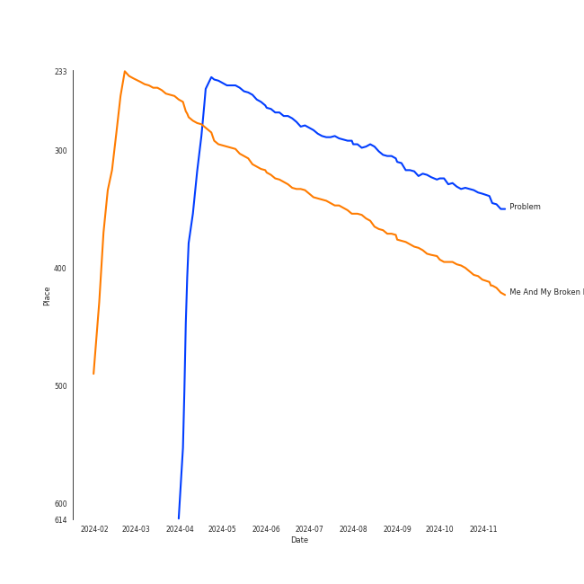

# Tracks in Pop from 2014

## Artists

| Art | Tracks | 💚 | Artist | 🔗 |
|:---|---:|---:|:---|:---|
|  | 8 | 7 | [Taylor Swift](../../../artists/taylor_swift/overview.md) | [🔗](https://open.spotify.com/artist/06HL4z0CvFAxyc27GXpf02) |
|  | 5 | 4 | [Ariana Grande](../../../artists/ariana_grande/overview.md) | [🔗](https://open.spotify.com/artist/66CXWjxzNUsdJxJ2JdwvnR) |
|  | 2 | 2 | Hozier | [🔗](https://open.spotify.com/artist/2FXC3k01G6Gw61bmprjgqS) |
|  | 2 | 1 | Nicki Minaj | [🔗](https://open.spotify.com/artist/0hCNtLu0JehylgoiP8L4Gh) |
|  | 2 | 1 | [Maroon 5](../../../artists/maroon_5/overview.md) | [🔗](https://open.spotify.com/artist/04gDigrS5kc9YWfZHwBETP) |
|  | 1 | 1 | [Clean Bandit](../../../artists/clean_bandit/overview.md) | [🔗](https://open.spotify.com/artist/6MDME20pz9RveH9rEXvrOM) |
|  | 1 | 1 | Iggy Azalea | [🔗](https://open.spotify.com/artist/5yG7ZAZafVaAlMTeBybKAL) |
|  | 1 | 1 | A Great Big World | [🔗](https://open.spotify.com/artist/5xKp3UyavIBUsGy3DQdXeF) |
|  | 1 | 1 | Juicy J | [🔗](https://open.spotify.com/artist/5gCRApTajqwbnHHPbr2Fpi) |
|  | 1 | 1 | Jess Glynne | [🔗](https://open.spotify.com/artist/4ScCswdRlyA23odg9thgIO) |

View all

| Art | Tracks | 💚 | Artist | 🔗 |
|:---|---:|---:|:---|:---|
|  | 1 | 1 | Jessie J | [🔗](https://open.spotify.com/artist/2gsggkzM5R49q6jpPvazou) |
|  | 1 | 1 | USHER | [🔗](https://open.spotify.com/artist/23zg3TcAtWQy7J6upgbUnj) |
|  | 1 | 1 | Christina Aguilera | [🔗](https://open.spotify.com/artist/1l7ZsJRRS8wlW3WfJfPfNS) |
|  | 1 | 1 | Lorde | [🔗](https://open.spotify.com/artist/163tK9Wjr9P9DmM0AVK7lm) |
|  | 1 | 1 | Rixton | [🔗](https://open.spotify.com/artist/0kkxsdcaWmWU2yWAqclDh4) |
|  | 1 | 0 | Zedd | [🔗](https://open.spotify.com/artist/2qxJFvFYMEDqd7ui6kSAcq) |

## Albums

| Art | Tracks | 💚 | Album | Release Date | 🔗 |
|:---|---:|---:|:---|:---|:---|
|  | 8 | 7 | 1989 | 2014-10-27 | [🔗](https://open.spotify.com/album/2QJmrSgbdM35R67eoGQo4j) |
|  | 5 | 4 | My Everything (Deluxe) | 2014-08-22 | [🔗](https://open.spotify.com/album/6EVYTRG1drKdO8OnIQBeEj) |
|  | 2 | 2 | Hozier (Expanded Edition) | 2014-09-19 | [🔗](https://open.spotify.com/album/4Pv7m8D82A1Xun7xNCKZjJ) |
|  | 2 | 1 | V | 2014-09-02 | [🔗](https://open.spotify.com/album/2Auw0pTT6EcQdvHNimhLQI) |
|  | 1 | 1 | Yellow Flicker Beat (From The Hunger Games: Mockingjay Part 1) | 2014-09-30 | [🔗](https://open.spotify.com/album/7sg5iqMiDrM2aJqLAmv83V) |
|  | 1 | 1 | New Eyes | 2014-06-02 | [🔗](https://open.spotify.com/album/4a6DxkhmMvvEdPXxm4ergN) |
|  | 1 | 1 | Let The Road | 2014-01-01 | [🔗](https://open.spotify.com/album/02ae5i5UAoFrt2peVox9Xd) |
|  | 1 | 1 | Is There Anybody Out There? | 2014-01-20 | [🔗](https://open.spotify.com/album/1yOcLa4euMk9sV7rRJ89Dl) |
|  | 1 | 1 | I Don't Mind (feat. Juicy J) | 2014-11-21 | [🔗](https://open.spotify.com/album/5BAqg5IJQ7XFKfdoCiOlJw) |
|  | 1 | 0 | The Pinkprint (Deluxe) | 2014-12-15 | [🔗](https://open.spotify.com/album/5ooCuPIk58IwSo6DRr1JCu) |

## Tracks

| Art | Track | Album | Artists | Label | Rank | 💚 | 🔗 |
|:---|:---|:---|:---|:---|---:|:---|:---|
|  | Problem | My Everything (Deluxe) | [Ariana Grande](../../../artists/ariana_grande/overview.md), Iggy Azalea | [Universal Records](../../../labels/universal_music_llc) | 247 | 💚 | [🔗](https://open.spotify.com/track/7vS3Y0IKjde7Xg85LWIEdP) |
|  | Me And My Broken Heart | Let The Road | Rixton | Silent Records/Giant Little Man | 298 | 💚 | [🔗](https://open.spotify.com/track/1oew3nFNY3vMacJAsvry0S) |
|  | Say Something | Is There Anybody Out There? | A Great Big World, Christina Aguilera | [Epic](../../../labels/epic) | nan | 💚 | [🔗](https://open.spotify.com/track/6Vc5wAMmXdKIAM7WUoEb7N) |
|  | Rather Be (feat. Jess Glynne) | New Eyes | [Clean Bandit](../../../artists/clean_bandit/overview.md), Jess Glynne | [Big Beat Records/Atlantic](../../../labels/atlantic_records) | nan | 💚 | [🔗](https://open.spotify.com/track/0am001WwFBVGDGLwRh3ixi) |
|  | Bang Bang | My Everything (Deluxe) | Jessie J, [Ariana Grande](../../../artists/ariana_grande/overview.md), Nicki Minaj | [Universal Records](../../../labels/universal_music_llc) | nan | 💚 | [🔗](https://open.spotify.com/track/466s1BacUmiRdR3ISvNjyx) |
|  | Break Free | My Everything (Deluxe) | [Ariana Grande](../../../artists/ariana_grande/overview.md), Zedd | [Universal Records](../../../labels/universal_music_llc) | nan | | [🔗](https://open.spotify.com/track/12KUFSHFgT0XCoiSlvdQi4) |
|  | My Everything | My Everything (Deluxe) | [Ariana Grande](../../../artists/ariana_grande/overview.md) | [Universal Records](../../../labels/universal_music_llc) | nan | 💚 | [🔗](https://open.spotify.com/track/4eumFsTnduH3zRfaASoAPs) |
|  | One Last Time | My Everything (Deluxe) | [Ariana Grande](../../../artists/ariana_grande/overview.md) | [Universal Records](../../../labels/universal_music_llc) | nan | 💚 | [🔗](https://open.spotify.com/track/7xoUc6faLbCqZO6fQEYprd) |
|  | Maps | V | [Maroon 5](../../../artists/maroon_5/overview.md) | [Interscope Records*](../../../labels/interscope_records) | nan | | [🔗](https://open.spotify.com/track/4gbVRS8gloEluzf0GzDOFc) |
|  | Sugar | V | [Maroon 5](../../../artists/maroon_5/overview.md) | [Interscope Records*](../../../labels/interscope_records) | nan | 💚 | [🔗](https://open.spotify.com/track/2iuZJX9X9P0GKaE93xcPjk) |

View all

| Art | Track | Album | Artists | Label | Rank | 💚 | 🔗 |
|:---|:---|:---|:---|:---|---:|:---|:---|
|  | Take Me to Church | Hozier (Expanded Edition) | Hozier | [Columbia](../../../labels/columbia) | nan | 💚 | [🔗](https://open.spotify.com/track/1CS7Sd1u5tWkstBhpssyjP) |
|  | Work Song | Hozier (Expanded Edition) | Hozier | [Columbia](../../../labels/columbia) | nan | 💚 | [🔗](https://open.spotify.com/track/5TgEJ62DOzBpGxZ7WRsrqb) |
|  | Yellow Flicker Beat | Yellow Flicker Beat (From The Hunger Games: Mockingjay Part 1) | Lorde | Hunger Games 3/Mockingjay | nan | 💚 | [🔗](https://open.spotify.com/track/0Nf53RDPZEjFrQE4B5n6Vf) |
|  | Blank Space | 1989 | [Taylor Swift](../../../artists/taylor_swift/overview.md) | [Big Machine Records, LLC](../../../labels/big_machine_records) | nan | 💚 | [🔗](https://open.spotify.com/track/1p80LdxRV74UKvL8gnD7ky) |
|  | Clean | 1989 | [Taylor Swift](../../../artists/taylor_swift/overview.md) | [Big Machine Records, LLC](../../../labels/big_machine_records) | nan | 💚 | [🔗](https://open.spotify.com/track/06WgOCf0LV2h4keYXDRnuh) |
|  | I Know Places | 1989 | [Taylor Swift](../../../artists/taylor_swift/overview.md) | [Big Machine Records, LLC](../../../labels/big_machine_records) | nan | 💚 | [🔗](https://open.spotify.com/track/3jBMHD19RZdAqG9iFQh7xc) |
|  | Out Of The Woods | 1989 | [Taylor Swift](../../../artists/taylor_swift/overview.md) | [Big Machine Records, LLC](../../../labels/big_machine_records) | nan | 💚 | [🔗](https://open.spotify.com/track/5OndtwLGA9O6XHFcGm2H7r) |
|  | Shake It Off | 1989 | [Taylor Swift](../../../artists/taylor_swift/overview.md) | [Big Machine Records, LLC](../../../labels/big_machine_records) | nan | 💚 | [🔗](https://open.spotify.com/track/5xTtaWoae3wi06K5WfVUUH) |
|  | Style | 1989 | [Taylor Swift](../../../artists/taylor_swift/overview.md) | [Big Machine Records, LLC](../../../labels/big_machine_records) | nan | 💚 | [🔗](https://open.spotify.com/track/4lIxdJw6W3Fg4vUIYCB0S5) |
|  | Welcome To New York | 1989 | [Taylor Swift](../../../artists/taylor_swift/overview.md) | [Big Machine Records, LLC](../../../labels/big_machine_records) | nan | | [🔗](https://open.spotify.com/track/6qnM0XXPZOINWA778uNqQ9) |
|  | Wildest Dreams | 1989 | [Taylor Swift](../../../artists/taylor_swift/overview.md) | [Big Machine Records, LLC](../../../labels/big_machine_records) | nan | 💚 | [🔗](https://open.spotify.com/track/59HjlYCeBsxdI0fcm3zglw) |
|  | I Don't Mind (feat. Juicy J) | I Don't Mind (feat. Juicy J) | USHER, Juicy J | [RCA Records Label](../../../labels/rca_records_label) | nan | 💚 | [🔗](https://open.spotify.com/track/7aXuop4Qambx5Oi3ynsKQr) |
|  | Anaconda | The Pinkprint (Deluxe) | Nicki Minaj | Nicki Minaj/Cash Money | nan | | [🔗](https://open.spotify.com/track/794F99D5BQHS5ZGRXAs7I5) |

