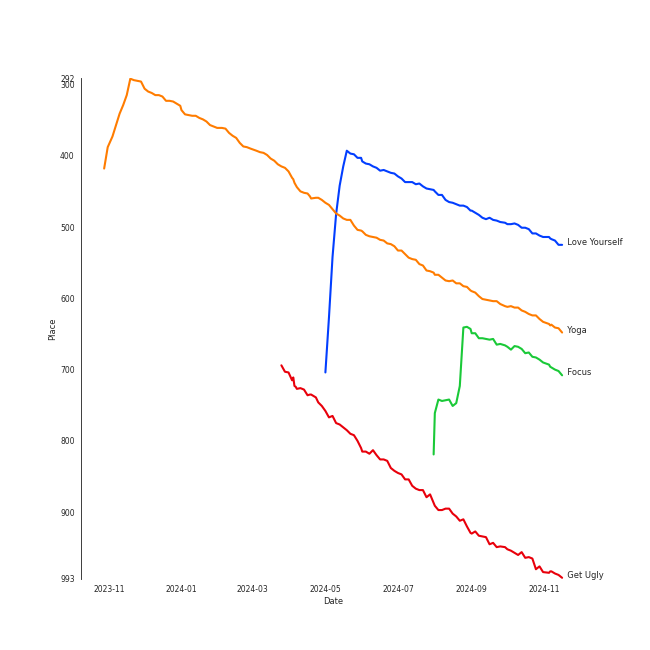

# Tracks in Pop from 2015

## Artists

| Art | Rank | Tracks | 💚 | Artist | 🔗 |
|:---|---:|---:|---:|:---|:---|
|  | 146 | 4 | 4 | [Sia](../../../artists/sia/overview.md) | [🔗](https://open.spotify.com/artist/5WUlDfRSoLAfcVSX1WnrxN) |
|  | 431 | 2 | 2 | Twenty One Pilots | [🔗](https://open.spotify.com/artist/3YQKmKGau1PzlVlkL1iodx) |
|  | 107 | 1 | 1 | [Janelle Monáe](../../../artists/janelle_monáe/overview.md) | [🔗](https://open.spotify.com/artist/6ueGR6SWhUJfvEhqkvMsVs) |
|  | 431 | 1 | 1 | Demi Lovato | [🔗](https://open.spotify.com/artist/6S2OmqARrzebs0tKUEyXyp) |
|  | 431 | 1 | 1 | Kid Ink | [🔗](https://open.spotify.com/artist/6KZDXtSj0SzGOV705nNeh3) |
|  | 33 | 1 | 1 | [Ariana Grande](../../../artists/ariana_grande/overview.md) | [🔗](https://open.spotify.com/artist/66CXWjxzNUsdJxJ2JdwvnR) |
|  | 341 | 1 | 1 | Bebe Rexha | [🔗](https://open.spotify.com/artist/64M6ah0SkkRsnPGtGiRAbb) |
|  | 316 | 1 | 1 | Jidenna | [🔗](https://open.spotify.com/artist/4TsHKU8l8Wq7n7OPVikirn) |
|  | 431 | 1 | 1 | Mark Ronson | [🔗](https://open.spotify.com/artist/3hv9jJF3adDNsBSIQDqcjp) |
|  | 194 | 1 | 1 | Little Mix | [🔗](https://open.spotify.com/artist/3e7awlrlDSwF3iM0WBjGMp) |

View all

| Art | Rank | Tracks | 💚 | Artist | 🔗 |
|:---|---:|---:|---:|:---|:---|
|  | 431 | 1 | 1 | Troye Sivan | [🔗](https://open.spotify.com/artist/3WGpXCj9YhhfX11TToZcXP) |
|  | 200 | 1 | 1 | [Justin Bieber](../../../artists/justin_bieber/overview.md) | [🔗](https://open.spotify.com/artist/1uNFoZAHBGtllmzznpCI3s) |
|  | 431 | 1 | 1 | Fifth Harmony | [🔗](https://open.spotify.com/artist/1l8Fu6IkuTP0U5QetQJ5Xt) |
|  | 92 | 1 | 1 | [Bruno Mars](../../../artists/bruno_mars/overview.md) | [🔗](https://open.spotify.com/artist/0du5cEVh5yTK9QJze8zA0C) |
|  | 285 | 1 | 1 | [Jason Derulo](../../../artists/jason_derulo/overview.md) | [🔗](https://open.spotify.com/artist/07YZf4WDAMNwqr4jfgOZ8y) |
|  | 431 | 1 | 1 | G-Eazy | [🔗](https://open.spotify.com/artist/02kJSzxNuaWGqwubyUba0Z) |
|  | 375 | 1 | 0 | Charlie Puth | [🔗](https://open.spotify.com/artist/6VuMaDnrHyPL1p4EHjYLi7) |
|  | 126 | 1 | 0 | [Lady Gaga](../../../artists/lady_gaga/overview.md) | [🔗](https://open.spotify.com/artist/1HY2Jd0NmPuamShAr6KMms) |
|  | 431 | 1 | 0 | A$AP Rocky | [🔗](https://open.spotify.com/artist/13ubrt8QOOCPljQ2FL1Kca) |
|  | 431 | 1 | 0 | Wiz Khalifa | [🔗](https://open.spotify.com/artist/137W8MRPWKqSmrBGDBFSop) |
|  | 431 | 1 | 0 | Ellie Goulding | [🔗](https://open.spotify.com/artist/0X2BH1fck6amBIoJhDVmmJ) |
|  | 431 | 1 | 0 | Selena Gomez | [🔗](https://open.spotify.com/artist/0C8ZW7ezQVs4URX5aX7Kqx) |

## Albums

| Art | Rank | Tracks | 💚 | Album | Release Date | 🔗 |
|:---|---:|---:|---:|:---|:---|:---|
|  | 644 | 4 | 4 | 1000 Forms Of Fear (Deluxe Version) | 2015-05-04 | [🔗](https://open.spotify.com/album/6FdNvoO5sF4EKwCX9je1MH) |
|  | 644 | 2 | 2 | Blurryface | 2015-05-15 | [🔗](https://open.spotify.com/album/3cQO7jp5S9qLBoIVtbkSM1) |
|  | 412 | 1 | 1 | Yoga | 2015-03-31 | [🔗](https://open.spotify.com/album/5rzxGeVyCV74SvV5hjLRAU) |
|  | 644 | 1 | 1 | When It's Dark Out | 2015-12-04 | [🔗](https://open.spotify.com/album/09Q3WwGYsQe5ognkvVkmCu) |
|  | 644 | 1 | 1 | Uptown Special | 2015-01-12 | [🔗](https://open.spotify.com/album/3vLaOYCNCzngDf8QdBg2V1) |
|  | 644 | 1 | 1 | Reflection (Deluxe) | 2015-01-30 | [🔗](https://open.spotify.com/album/0zAsh6hObeNmFgFPrUiFcP) |
|  | 349 | 1 | 1 | Purpose (Deluxe) | 2015-11-13 | [🔗](https://open.spotify.com/album/6Fr2rQkZ383FcMqFyT7yPr) |
|  | 644 | 1 | 1 | Get Weird (Expanded Edition) | 2015-11-06 | [🔗](https://open.spotify.com/album/2FnfZiFMv7bmXAIATOJDHs) |
|  | 453 | 1 | 1 | Focus | 2015-10-30 | [🔗](https://open.spotify.com/album/3IGM1sXYke2UGII2DORrof) |
|  | 626 | 1 | 1 | Everything Is 4 | 2015-05-29 | [🔗](https://open.spotify.com/album/59eUYETmE1zi31ESb3SUkI) |

View all

| Art | Rank | Tracks | 💚 | Album | Release Date | 🔗 |
|:---|---:|---:|---:|:---|:---|:---|
|  | 644 | 1 | 1 | Confident | 2015-01-01 | [🔗](https://open.spotify.com/album/56yYgfX6M5FlpETfyZSHkn) |
|  | 644 | 1 | 1 | Blue Neighbourhood (Deluxe) | 2015-12-04 | [🔗](https://open.spotify.com/album/5ouTDazE4LF9bVJPx1nlgW) |
|  | 644 | 1 | 0 | Til It Happens To You | 2015-09-18 | [🔗](https://open.spotify.com/album/00qjYaNSNpQCZHhCpAlH60) |
|  | 644 | 1 | 0 | See You Again (feat. Charlie Puth) | 2015 | [🔗](https://open.spotify.com/album/5FXIqS1XqbpfOKNoi5VUwS) |
|  | 644 | 1 | 0 | Revival (Deluxe) | 2015-10-09 | [🔗](https://open.spotify.com/album/7lDBDk8OQarV5dBMu3qrdz) |
|  | 644 | 1 | 0 | Delirium | 2015-11-13 | [🔗](https://open.spotify.com/album/4A43DyDoAVa1Fb8pq6Yejl) |

## Tracks

| Art | Track | Album | Artists | Label | Rank | 💚 | 🔗 |
|:---|:---|:---|:---|:---|---:|:---|:---|
|  | Love Yourself | Purpose (Deluxe) | [Justin Bieber](../../../artists/justin_bieber/overview.md) | RBMG/Def Jam | 497 | 💚 | [🔗](https://open.spotify.com/track/50kpGaPAhYJ3sGmk6vplg0) |
|  | Yoga | Yoga | [Janelle Monáe](../../../artists/janelle_monáe/overview.md), Jidenna | [Wondaland Records/Epic](../../../labels/epic) | 615 | 💚 | [🔗](https://open.spotify.com/track/3IJCSQoLF4YzPAKaxq2JLb) |
|  | Focus | Focus | [Ariana Grande](../../../artists/ariana_grande/overview.md) | [Universal Records](../../../labels/universal_music_llc) | 672 | 💚 | [🔗](https://open.spotify.com/track/1cdzfFjEbUbgTm5nv3FgXR) |
|  | Get Ugly | Everything Is 4 | [Jason Derulo](../../../artists/jason_derulo/overview.md) | [Beluga Heights/Warner Records](../../../labels/warner_records) | 955 | 💚 | [🔗](https://open.spotify.com/track/1dl3vuXJS9anUXE7XnNP75) |
|  | See You Again (feat. Charlie Puth) | See You Again (feat. Charlie Puth) | Wiz Khalifa, Charlie Puth | [Atlantic Records](../../../labels/atlantic_records) | 976 | | [🔗](https://open.spotify.com/track/2JzZzZUQj3Qff7wapcbKjc) |
|  | Stone Cold | Confident | Demi Lovato | [Hollywood Records](../../../labels/hollywood_records) | 976 | 💚 | [🔗](https://open.spotify.com/track/3by8IfnW9dZ2t4pZw1WVxz) |
|  | Uptown Funk (feat. Bruno Mars) | Uptown Special | Mark Ronson, [Bruno Mars](../../../artists/bruno_mars/overview.md) | [Columbia](../../../labels/columbia) | 976 | 💚 | [🔗](https://open.spotify.com/track/32OlwWuMpZ6b0aN2RZOeMS) |
|  | Worth It (feat. Kid Ink) | Reflection (Deluxe) | Fifth Harmony, Kid Ink | [Epic](../../../labels/epic), [Syco Music](../../../labels/syco_music) | 976 | 💚 | [🔗](https://open.spotify.com/track/41Fflg7qHiVOD6dEPvsCzO) |
|  | Big Girls Cry | 1000 Forms Of Fear (Deluxe Version) | [Sia](../../../artists/sia/overview.md) | [Monkey Puzzle](../../../labels/monkey_puzzle), [RCA Records Label](../../../labels/rca_records_label) | 976 | 💚 | [🔗](https://open.spotify.com/track/7zE6pyXLjUCOy8PG0UL5SZ) |
|  | Chandelier | 1000 Forms Of Fear (Deluxe Version) | [Sia](../../../artists/sia/overview.md) | [Monkey Puzzle](../../../labels/monkey_puzzle), [RCA Records Label](../../../labels/rca_records_label) | 976 | 💚 | [🔗](https://open.spotify.com/track/2s1sdSqGcKxpPr5lCl7jAV) |

View all

| Art | Track | Album | Artists | Label | Rank | 💚 | 🔗 |
|:---|:---|:---|:---|:---|---:|:---|:---|
|  | Elastic Heart | 1000 Forms Of Fear (Deluxe Version) | [Sia](../../../artists/sia/overview.md) | [Monkey Puzzle](../../../labels/monkey_puzzle), [RCA Records Label](../../../labels/rca_records_label) | 976 | 💚 | [🔗](https://open.spotify.com/track/5S9lfZu1YF8xKkgSsqL2Bd) |
|  | Eye of the Needle | 1000 Forms Of Fear (Deluxe Version) | [Sia](../../../artists/sia/overview.md) | [Monkey Puzzle](../../../labels/monkey_puzzle), [RCA Records Label](../../../labels/rca_records_label) | 976 | 💚 | [🔗](https://open.spotify.com/track/6H8UxS43KArEIu2vGZI9Dj) |
|  | Ride | Blurryface | Twenty One Pilots | [Fueled By Ramen](../../../labels/fueled_by_ramen) | 976 | 💚 | [🔗](https://open.spotify.com/track/2Z8WuEywRWYTKe1NybPQEW) |
|  | Stressed Out | Blurryface | Twenty One Pilots | [Fueled By Ramen](../../../labels/fueled_by_ramen) | 976 | 💚 | [🔗](https://open.spotify.com/track/3CRDbSIZ4r5MsZ0YwxuEkn) |
|  | Til It Happens To You | Til It Happens To You | [Lady Gaga](../../../artists/lady_gaga/overview.md) | [Interscope](../../../labels/interscope_records) | 976 | | [🔗](https://open.spotify.com/track/0bCCGLHflR08UVA6oJJc8I) |
|  | Good For You | Revival (Deluxe) | Selena Gomez, A$AP Rocky | Selena Gomez PS | 976 | | [🔗](https://open.spotify.com/track/578Eooad7oUyn4stovZiPg) |
|  | Black Magic | Get Weird (Expanded Edition) | Little Mix | [Syco Music](../../../labels/syco_music) | 976 | 💚 | [🔗](https://open.spotify.com/track/6rmXhRIemCTPyMYZRDN7Qg) |
|  | Something In The Way You Move | Delirium | Ellie Goulding | [Polydor Records](../../../labels/polydor_records) | 976 | | [🔗](https://open.spotify.com/track/7is4okCIwDa9vc7pUjda1H) |
|  | YOUTH | Blue Neighbourhood (Deluxe) | Troye Sivan | EMI Recorded Music Australia Pty Ltd | 976 | 💚 | [🔗](https://open.spotify.com/track/1cOyWWUr3oXJIxY0AjJEx9) |
|  | Me, Myself & I | When It's Dark Out | G-Eazy, Bebe Rexha | [BPG/RVG/RCA Records](../../../labels/rca_records_label) | 976 | 💚 | [🔗](https://open.spotify.com/track/40YcuQysJ0KlGQTeGUosTC) |

