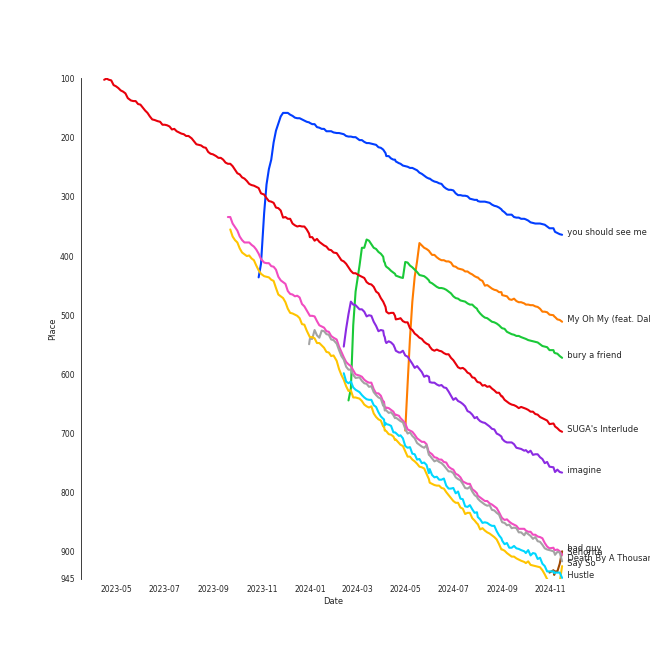

# Tracks in Pop from 2019

## Artists

| Art | Rank | Tracks | 💚 | Artist | 🔗 |
|:---|---:|---:|---:|:---|:---|
|  | 20 | 8 | 6 | [Taylor Swift](../../../artists/taylor_swift/overview.md) | [🔗](https://open.spotify.com/artist/06HL4z0CvFAxyc27GXpf02) |
|  | 46 | 6 | 6 | [Billie Eilish](../../../artists/billie_eilish/overview.md) | [🔗](https://open.spotify.com/artist/6qqNVTkY8uBg9cP3Jd7DAH) |
|  | 33 | 7 | 3 | [Ariana Grande](../../../artists/ariana_grande/overview.md) | [🔗](https://open.spotify.com/artist/66CXWjxzNUsdJxJ2JdwvnR) |
|  | 264 | 4 | 3 | [Camila Cabello](../../../artists/camila_cabello/overview.md) | [🔗](https://open.spotify.com/artist/4nDoRrQiYLoBzwC5BhVJzF) |
|  | 434 | 3 | 2 | Harry Styles | [🔗](https://open.spotify.com/artist/6KImCVD70vtIoJWnq6nGn3) |
|  | 434 | 1 | 1 | half•alive | [🔗](https://open.spotify.com/artist/7sOR7gk6XUlGnxj3p9F54k) |
|  | 324 | 1 | 1 | Shawn Mendes | [🔗](https://open.spotify.com/artist/7n2wHs1TKAczGzO7Dd2rGr) |
|  | 434 | 1 | 1 | Jonas Brothers | [🔗](https://open.spotify.com/artist/7gOdHgIoIKoe4i9Tta6qdD) |
|  | 434 | 1 | 1 | H 3 F | [🔗](https://open.spotify.com/artist/6jIK3obS1fJqb3Vu74AYX3) |
|  | 92 | 1 | 1 | [Kimbra](../../../artists/kimbra/overview.md) | [🔗](https://open.spotify.com/artist/6hk7Yq1DU9QcCCrz9uc0Ti) |

View all

| Art | Rank | Tracks | 💚 | Artist | 🔗 |
|:---|---:|---:|---:|:---|:---|
|  | 434 | 1 | 1 | Ally Brooke | [🔗](https://open.spotify.com/artist/6TXM1kV4L8DsDAkAfbOPYk) |
|  | 198 | 1 | 1 | Iggy Azalea | [🔗](https://open.spotify.com/artist/5yG7ZAZafVaAlMTeBybKAL) |
|  | 204 | 1 | 1 | [Doja Cat](../../../artists/doja_cat/overview.md) | [🔗](https://open.spotify.com/artist/5cj0lLjcoR7YOSnhnX0Po5) |
|  | 187 | 1 | 1 | Faouzia | [🔗](https://open.spotify.com/artist/5NhgsV7qPWHZqYEMKzbYvo) |
|  | 434 | 1 | 1 | Tyga | [🔗](https://open.spotify.com/artist/5LHRHt1k9lMyONurDHEdrp) |
|  | 434 | 1 | 1 | Lizzo | [🔗](https://open.spotify.com/artist/56oDRnqbIiwx4mymNEv7dS) |
|  | 274 | 1 | 1 | DaBaby | [🔗](https://open.spotify.com/artist/4r63FhuTkUYltbVAg5TQnk) |
|  | 434 | 1 | 1 | Cardi B | [🔗](https://open.spotify.com/artist/4kYSro6naA4h99UJvo89HB) |
|  | 27 | 1 | 1 | [BTS](../../../artists/bts/overview.md) | [🔗](https://open.spotify.com/artist/3Nrfpe0tUJi4K4DXYWgMUX) |
|  | 434 | 1 | 1 | Zedd | [🔗](https://open.spotify.com/artist/2qxJFvFYMEDqd7ui6kSAcq) |
|  | 434 | 1 | 1 | Tones And I | [🔗](https://open.spotify.com/artist/2NjfBq1NflQcKSeiDooVjY) |
|  | 434 | 1 | 1 | Gotye | [🔗](https://open.spotify.com/artist/2AsusXITU8P25dlRNhcAbG) |
|  | 340 | 1 | 1 | Halsey | [🔗](https://open.spotify.com/artist/26VFTg2z8YR0cCuwLzESi2) |
|  | 79 | 1 | 1 | [Jackson Wang](../../../artists/jackson_wang/overview.md) | [🔗](https://open.spotify.com/artist/1kfWoWgCugPkyxQP8lkRlY) |
|  | 434 | 1 | 1 | Mabel | [🔗](https://open.spotify.com/artist/1MIVXf74SZHmTIp4V4paH4) |
|  | 395 | 1 | 1 | P!nk | [🔗](https://open.spotify.com/artist/1KCSPY1glIKqW2TotWuXOR) |
|  | 434 | 1 | 1 | Niall Horan | [🔗](https://open.spotify.com/artist/1Hsdzj7Dlq2I7tHP7501T4) |
|  | 434 | 1 | 1 | 88rising | [🔗](https://open.spotify.com/artist/1AhjOkOLkbHUfcHDSErXQs) |
|  | 338 | 1 | 1 | SUGA | [🔗](https://open.spotify.com/artist/0ebNdVaOfp6N0oZ1guIxM8) |
|  | 91 | 1 | 1 | [Bruno Mars](../../../artists/bruno_mars/overview.md) | [🔗](https://open.spotify.com/artist/0du5cEVh5yTK9QJze8zA0C) |
|  | 434 | 1 | 1 | Kehlani | [🔗](https://open.spotify.com/artist/0cGUm45nv7Z6M6qdXYQGTX) |
|  | 434 | 1 | 1 | Stephanie Poetri | [🔗](https://open.spotify.com/artist/0HS00NN7MAfF59aJnfcxSO) |
|  | 220 | 2 | 0 | Miley Cyrus | [🔗](https://open.spotify.com/artist/5YGY8feqx7naU7z4HrwZM6) |
|  | 434 | 1 | 0 | Lil Nas X | [🔗](https://open.spotify.com/artist/7jVv8c5Fj3E9VhNjxT4snq) |
|  | 434 | 1 | 0 | Billy Ray Cyrus | [🔗](https://open.spotify.com/artist/60rpJ9SgigSd16DOAG7GSa) |
|  | 434 | 1 | 0 | John Legend | [🔗](https://open.spotify.com/artist/5y2Xq6xcjJb2jVM54GHK3t) |
|  | 434 | 1 | 0 | Social House | [🔗](https://open.spotify.com/artist/5UjifI1TYefXWn9GdqDOHl) |
|  | 119 | 1 | 0 | [Lana Del Rey](../../../artists/lana_del_rey/overview.md) | [🔗](https://open.spotify.com/artist/00FQb4jTyendYWaN8pK0wa) |

## Albums

| Art | Rank | Tracks | 💚 | Album | Release Date | 🔗 |
|:---|---:|---:|---:|:---|:---|:---|
|  | 598 | 8 | 6 | Lover | 2019-08-23 | [🔗](https://open.spotify.com/album/1NAmidJlEaVgA3MpcPFYGq) |
|  | 222 | 5 | 5 | WHEN WE ALL FALL ASLEEP, WHERE DO WE GO? | 2019-03-29 | [🔗](https://open.spotify.com/album/0S0KGZnfBGSIssfF54WSJh) |
|  | 510 | 5 | 3 | thank u, next | 2019-02-08 | [🔗](https://open.spotify.com/album/2fYhqwDWXjbpjaIJPEfKFw) |
|  | 340 | 3 | 2 | Romance | 2019-12-06 | [🔗](https://open.spotify.com/album/3Vsbl0diFGw8HNSjG8ue9m) |
|  | 665 | 3 | 2 | Fine Line | 2019-12-13 | [🔗](https://open.spotify.com/album/7xV2TzoaVc0ycW7fwBwAml) |
|  | 665 | 1 | 1 | everything i wanted | 2019-11-13 | [🔗](https://open.spotify.com/album/4i3rAwPw7Ln2YrKDusaWyT) |
|  | 461 | 1 | 1 | SUGA's Interlude | 2019-12-06 | [🔗](https://open.spotify.com/album/0JfaSjTaej3QB27ofjnbQV) |
|  | 665 | 1 | 1 | Put A Little Love On Me | 2019-12-06 | [🔗](https://open.spotify.com/album/7dUgmUMDNnQAejhNLeIQWz) |
|  | 665 | 1 | 1 | Please Me | 2019-02-15 | [🔗](https://open.spotify.com/album/5a4sJJ3qjn6hqRsvm0Veso) |
|  | 665 | 1 | 1 | Now, Not Yet | 2019-08-09 | [🔗](https://open.spotify.com/album/2KSWrd22LGc0Hmqs2Z5i7z) |

View all

| Art | Rank | Tracks | 💚 | Album | Release Date | 🔗 |
|:---|---:|---:|---:|:---|:---|:---|
|  | 665 | 1 | 1 | Low Key (feat. Tyga) | 2019-01-31 | [🔗](https://open.spotify.com/album/5Wba3IvT61Jz2kZDVKbrxH) |
|  | 665 | 1 | 1 | Ivy To Roses (Mixtape) | 2019-01-18 | [🔗](https://open.spotify.com/album/0syM7OUAhV7S6XmOa4nLUZ) |
|  | 665 | 1 | 1 | In My Defense | 2019-07-19 | [🔗](https://open.spotify.com/album/3kQvfhjfU6Mleis6k6vpmw) |
|  | 616 | 1 | 1 | Hurts 2B Human | 2019-04-26 | [🔗](https://open.spotify.com/album/6JKkXVEljQJ1wKbRG5MywC) |
|  | 665 | 1 | 1 | How Can I | 2019-06-23 | [🔗](https://open.spotify.com/album/3qEib9B2LiOpc81jRYC4Fi) |
|  | 626 | 1 | 1 | Hot Pink | 2019-11-07 | [🔗](https://open.spotify.com/album/1MmVkhiwTH0BkNOU3nw5d3) |
|  | 665 | 1 | 1 | Head In The Clouds II | 2019-10-11 | [🔗](https://open.spotify.com/album/7bOpX6Ilc9UCFmH9uGyUDy) |
|  | 665 | 1 | 1 | Happiness Begins | 2019-06-07 | [🔗](https://open.spotify.com/album/1Uf67JAtkVWfdydzFFqNF2) |
|  | 665 | 1 | 1 | Good Thing (with Kehlani) | 2019-09-27 | [🔗](https://open.spotify.com/album/3wpdeV1FZfiEnelZSfAFp4) |
|  | 665 | 1 | 1 | Dance Monkey (Stripped Back) / Dance Monkey | 2019-10-17 | [🔗](https://open.spotify.com/album/0UywfDKYlyiu1b38DRrzYD) |
|  | 665 | 1 | 1 | Cuz I Love You (Deluxe) | 2019-05-03 | [🔗](https://open.spotify.com/album/74gSdSHe71q7urGWMMn3qB) |
|  | 665 | 1 | 1 | Cry for Me | 2019-10-04 | [🔗](https://open.spotify.com/album/2dq4ae5hiyxlFPG1s8rlq5) |
|  | 665 | 1 | 1 | Born Without a Heart | 2019-03-28 | [🔗](https://open.spotify.com/album/5EOIYFpu56h7AgQxCRcyZG) |
|  | 665 | 1 | 1 | Aussie Legends | 2019-11-22 | [🔗](https://open.spotify.com/album/3IGRFGa4ErR0CU8aMMrRql) |
|  | 665 | 1 | 0 | boyfriend | 2019-08-02 | [🔗](https://open.spotify.com/album/3zVB99XMdbP9HTVNg0GJwV) |
|  | 665 | 1 | 0 | Slide Away | 2019-08-16 | [🔗](https://open.spotify.com/album/0SHGFAL8WZUvpWb5iLPp6E) |
|  | 665 | 1 | 0 | Preach | 2019-02-15 | [🔗](https://open.spotify.com/album/32r4o1R9a1lK5DoVXGEC7E) |
|  | 665 | 1 | 0 | Charlie's Angels (Original Motion Picture Soundtrack) | 2019-11-01 | [🔗](https://open.spotify.com/album/4NBuascXb3uK0mFUYuJ63f) |
|  | 665 | 1 | 0 | 7 EP | 2019-06-21 | [🔗](https://open.spotify.com/album/4IRiXE5NROxknUSAUSjMoO) |

## Tracks

| Art | Track | Album | Artists | Label | Rank | 💚 | 🔗 |
|:---|:---|:---|:---|:---|---:|:---|:---|
|  | you should see me in a crown | WHEN WE ALL FALL ASLEEP, WHERE DO WE GO? | [Billie Eilish](../../../artists/billie_eilish/overview.md) | [Darkroom](../../../labels/darkroom), [Interscope Records](../../../labels/interscope_records) | 359 | 💚 | [🔗](https://open.spotify.com/track/3XF5xLJHOQQRbWya6hBp7d) |
|  | My Oh My (feat. DaBaby) | Romance | [Camila Cabello](../../../artists/camila_cabello/overview.md), DaBaby | [Epic](../../../labels/epic), [Syco Music](../../../labels/syco_music) | 503 | 💚 | [🔗](https://open.spotify.com/track/3yOlyBJuViE2YSGn3nVE1K) |
|  | bury a friend | WHEN WE ALL FALL ASLEEP, WHERE DO WE GO? | [Billie Eilish](../../../artists/billie_eilish/overview.md) | [Darkroom](../../../labels/darkroom), [Interscope Records](../../../labels/interscope_records) | 567 | 💚 | [🔗](https://open.spotify.com/track/4SSnFejRGlZikf02HLewEF) |
|  | SUGA's Interlude | SUGA's Interlude | Halsey, SUGA, [BTS](../../../artists/bts/overview.md) | [Capitol Records](../../../labels/capitol_records) | 691 | 💚 | [🔗](https://open.spotify.com/track/5a0nHa7F4S9hb0Zi0zLS8w) |
|  | imagine | thank u, next | [Ariana Grande](../../../artists/ariana_grande/overview.md) | [Republic Records](../../../labels/republic_records) | 771 | 💚 | [🔗](https://open.spotify.com/track/39LmTF9RgyakzSYX8txrow) |
|  | Señorita | Romance | Shawn Mendes, [Camila Cabello](../../../artists/camila_cabello/overview.md) | [Epic](../../../labels/epic), [Syco Music](../../../labels/syco_music) | 902 | 💚 | [🔗](https://open.spotify.com/track/3BVgrFWuH01GmCUy9Y2EE8) |
|  | Death By A Thousand Cuts | Lover | [Taylor Swift](../../../artists/taylor_swift/overview.md) | [Taylor Swift](../../../labels/taylor_swift) | 911 | 💚 | [🔗](https://open.spotify.com/track/2dgFqt3w9xIQRjhPtwNk3D) |
|  | Hustle | Hurts 2B Human | P!nk | [RCA Records Label](../../../labels/rca_records_label) | 937 | 💚 | [🔗](https://open.spotify.com/track/6BVmygBQhe4pTZQgKkzstD) |
|  | bad guy | WHEN WE ALL FALL ASLEEP, WHERE DO WE GO? | [Billie Eilish](../../../artists/billie_eilish/overview.md) | [Darkroom](../../../labels/darkroom), [Interscope Records](../../../labels/interscope_records) | 938 | 💚 | [🔗](https://open.spotify.com/track/2Fxmhks0bxGSBdJ92vM42m) |
|  | Say So | Hot Pink | [Doja Cat](../../../artists/doja_cat/overview.md) | [Kemosabe Records/RCA Records](../../../labels/rca_records_label) | 960 | 💚 | [🔗](https://open.spotify.com/track/3Dv1eDb0MEgF93GpLXlucZ) |

View all

| Art | Track | Album | Artists | Label | Rank | 💚 | 🔗 |
|:---|:---|:---|:---|:---|---:|:---|:---|
|  | xanny | WHEN WE ALL FALL ASLEEP, WHERE DO WE GO? | [Billie Eilish](../../../artists/billie_eilish/overview.md) | [Darkroom](../../../labels/darkroom), [Interscope Records](../../../labels/interscope_records) | 1003 | 💚 | [🔗](https://open.spotify.com/track/4QIo4oxwzzafcBWkKjDpXY) |
|  | Don't Call Me Up | Ivy To Roses (Mixtape) | Mabel | [Polydor Records](../../../labels/polydor_records) | 1015 | 💚 | [🔗](https://open.spotify.com/track/5WHTFyqSii0lmT9R21abT8) |
|  | Low Key (feat. Tyga) | Low Key (feat. Tyga) | Ally Brooke, Tyga | [Latium/Atlantic](../../../labels/atlantic_records) | 1015 | 💚 | [🔗](https://open.spotify.com/track/7xhvCzIguRfyfQyGrnWuVn) |
|  | 7 rings | thank u, next | [Ariana Grande](../../../artists/ariana_grande/overview.md) | [Republic Records](../../../labels/republic_records) | 1015 | 💚 | [🔗](https://open.spotify.com/track/6ocbgoVGwYJhOv1GgI9NsF) |
|  | bloodline | thank u, next | [Ariana Grande](../../../artists/ariana_grande/overview.md) | [Republic Records](../../../labels/republic_records) | 1015 | 💚 | [🔗](https://open.spotify.com/track/2hloaUoRonYssMuqLCBLTX) |
|  | break up with your girlfriend, i'm bored | thank u, next | [Ariana Grande](../../../artists/ariana_grande/overview.md) | [Republic Records](../../../labels/republic_records) | 1015 | | [🔗](https://open.spotify.com/track/4kV4N9D1iKVxx1KLvtTpjS) |
|  | thank u, next | thank u, next | [Ariana Grande](../../../artists/ariana_grande/overview.md) | [Republic Records](../../../labels/republic_records) | 1015 | | [🔗](https://open.spotify.com/track/3e9HZxeyfWwjeyPAMmWSSQ) |
|  | Please Me | Please Me | Cardi B, [Bruno Mars](../../../artists/bruno_mars/overview.md) | [Atlantic/KSR](../../../labels/atlantic_records) | 1015 | 💚 | [🔗](https://open.spotify.com/track/0PG9fbaaHFHfre2gUVo7AN) |
|  | Preach | Preach | John Legend | [Columbia](../../../labels/columbia) | 1015 | | [🔗](https://open.spotify.com/track/2AaF78iCWISMWYog5RnSi5) |
|  | Born Without a Heart | Born Without a Heart | Faouzia | Faouzia 2019 | 1015 | 💚 | [🔗](https://open.spotify.com/track/6i5jBmnB22alUpJ7hpznuj) |
|  | when the party's over | WHEN WE ALL FALL ASLEEP, WHERE DO WE GO? | [Billie Eilish](../../../artists/billie_eilish/overview.md) | [Darkroom](../../../labels/darkroom), [Interscope Records](../../../labels/interscope_records) | 1015 | 💚 | [🔗](https://open.spotify.com/track/43zdsphuZLzwA9k4DJhU0I) |
|  | Truth Hurts | Cuz I Love You (Deluxe) | Lizzo | [Nice Life/Atlantic](../../../labels/atlantic_records) | 1015 | 💚 | [🔗](https://open.spotify.com/track/5qmq61DAAOUaW8AUo8xKhh) |
|  | Sucker | Happiness Begins | Jonas Brothers | Jonas Brothers Recording | 1015 | 💚 | [🔗](https://open.spotify.com/track/22vgEDb5hykfaTwLuskFGD) |
|  | Old Town Road - Remix | 7 EP | Lil Nas X, Billy Ray Cyrus | [Columbia](../../../labels/columbia) | 1015 | | [🔗](https://open.spotify.com/track/2YpeDb67231RjR0MgVLzsG) |
|  | How Can I | How Can I | H 3 F | H 3 F | 1015 | 💚 | [🔗](https://open.spotify.com/track/3Ka0IJwEvxI3ssqbF48SWZ) |
|  | Sally Walker | In My Defense | Iggy Azalea | Bad Dreams Records / EMPIRE | 1015 | 💚 | [🔗](https://open.spotify.com/track/1bPoQ1zaUWZmiYrckwfulU) |
|  | boyfriend (with Social House) | boyfriend | [Ariana Grande](../../../artists/ariana_grande/overview.md), Social House | [Republic Records](../../../labels/republic_records) | 1015 | | [🔗](https://open.spotify.com/track/0Ryd8975WihbObpp5cPW1t) |
|  | still feel. | Now, Not Yet | half•alive | [half·alive/RCA Records](../../../labels/rca_records_label) | 1015 | 💚 | [🔗](https://open.spotify.com/track/48XkVAagIoQHCsOlJtXUd5) |
|  | Slide Away | Slide Away | Miley Cyrus | [RCA Records Label](../../../labels/rca_records_label) | 1015 | | [🔗](https://open.spotify.com/track/44ADyYoY5liaRa3EOAl4uf) |
|  | Cornelia Street | Lover | [Taylor Swift](../../../artists/taylor_swift/overview.md) | [Taylor Swift](../../../labels/taylor_swift) | 1015 | 💚 | [🔗](https://open.spotify.com/track/12M5uqx0ZuwkpLp5rJim1a) |
|  | Cruel Summer | Lover | [Taylor Swift](../../../artists/taylor_swift/overview.md) | [Taylor Swift](../../../labels/taylor_swift) | 1015 | 💚 | [🔗](https://open.spotify.com/track/1BxfuPKGuaTgP7aM0Bbdwr) |
|  | False God | Lover | [Taylor Swift](../../../artists/taylor_swift/overview.md) | [Taylor Swift](../../../labels/taylor_swift) | 1015 | | [🔗](https://open.spotify.com/track/5hQSXkFgbxjZo9uCwd11so) |
|  | I Think He Knows | Lover | [Taylor Swift](../../../artists/taylor_swift/overview.md) | [Taylor Swift](../../../labels/taylor_swift) | 1015 | | [🔗](https://open.spotify.com/track/2YWtcWi3a83pdEg3Gif4Pd) |
|  | London Boy | Lover | [Taylor Swift](../../../artists/taylor_swift/overview.md) | [Taylor Swift](../../../labels/taylor_swift) | 1015 | 💚 | [🔗](https://open.spotify.com/track/1LLXZFeAHK9R4xUramtUKw) |
|  | Lover | Lover | [Taylor Swift](../../../artists/taylor_swift/overview.md) | [Taylor Swift](../../../labels/taylor_swift) | 1015 | 💚 | [🔗](https://open.spotify.com/track/1dGr1c8CrMLDpV6mPbImSI) |
|  | Paper Rings | Lover | [Taylor Swift](../../../artists/taylor_swift/overview.md) | [Taylor Swift](../../../labels/taylor_swift) | 1015 | 💚 | [🔗](https://open.spotify.com/track/4y5bvROuBDPr5fuwXbIBZR) |
|  | Good Thing (with Kehlani) | Good Thing (with Kehlani) | Zedd, Kehlani | [Interscope Records](../../../labels/interscope_records) | 1015 | 💚 | [🔗](https://open.spotify.com/track/5aUSEPNd3m5xliFK4pn5mU) |
|  | Cry for Me | Cry for Me | [Camila Cabello](../../../artists/camila_cabello/overview.md) | [Epic](../../../labels/epic), [Syco Music](../../../labels/syco_music) | 1015 | 💚 | [🔗](https://open.spotify.com/track/40nPimvmG05WYS7983bawZ) |
|  | I Love You 3000 II | Head In The Clouds II | 88rising, Stephanie Poetri, [Jackson Wang](../../../artists/jackson_wang/overview.md) | [88rising Music](../../../labels/88rising_music), [Warner Records](../../../labels/warner_records) | 1015 | 💚 | [🔗](https://open.spotify.com/track/3witRpHWHqArlnt6GTlH2Y) |
|  | Dance Monkey | Dance Monkey (Stripped Back) / Dance Monkey | Tones And I | Elektra (NEK) | 1015 | 💚 | [🔗](https://open.spotify.com/track/2XU0oxnq2qxCpomAAuJY8K) |
|  | Don’t Call Me Angel (Charlie’s Angels) (with Miley Cyrus & Lana Del Rey) | Charlie's Angels (Original Motion Picture Soundtrack) | [Ariana Grande](../../../artists/ariana_grande/overview.md), Miley Cyrus, [Lana Del Rey](../../../artists/lana_del_rey/overview.md) | Silver Cloud/Charlie's Angels | 1015 | | [🔗](https://open.spotify.com/track/6zegtH6XXd2PDPLvy1Y0n2) |
|  | everything i wanted | everything i wanted | [Billie Eilish](../../../artists/billie_eilish/overview.md) | [Darkroom](../../../labels/darkroom), [Interscope Records](../../../labels/interscope_records) | 1015 | 💚 | [🔗](https://open.spotify.com/track/3ZCTVFBt2Brf31RLEnCkWJ) |
|  | Somebody That I Used To Know | Aussie Legends | Gotye, [Kimbra](../../../artists/kimbra/overview.md) | UMG Recordings, Inc. | 1015 | 💚 | [🔗](https://open.spotify.com/track/54ZV2zBKOn1EVDUs7Jvf2F) |
|  | Put A Little Love On Me | Put A Little Love On Me | Niall Horan | [Capitol Records](../../../labels/capitol_records) | 1015 | 💚 | [🔗](https://open.spotify.com/track/1hCTxutVVYvggAQcUUUZAT) |
|  | Living Proof | Romance | [Camila Cabello](../../../artists/camila_cabello/overview.md) | [Epic](../../../labels/epic), [Syco Music](../../../labels/syco_music) | 1015 | | [🔗](https://open.spotify.com/track/4jFD7byoPdGkEdjHLMduR9) |
|  | Adore You | Fine Line | Harry Styles | [Columbia](../../../labels/columbia) | 1015 | | [🔗](https://open.spotify.com/track/3jjujdWJ72nww5eGnfs2E7) |
|  | Falling | Fine Line | Harry Styles | [Columbia](../../../labels/columbia) | 1015 | 💚 | [🔗](https://open.spotify.com/track/1ZMiCix7XSAbfAJlEZWMCp) |
|  | Watermelon Sugar | Fine Line | Harry Styles | [Columbia](../../../labels/columbia) | 1015 | 💚 | [🔗](https://open.spotify.com/track/6UelLqGlWMcVH1E5c4H7lY) |

