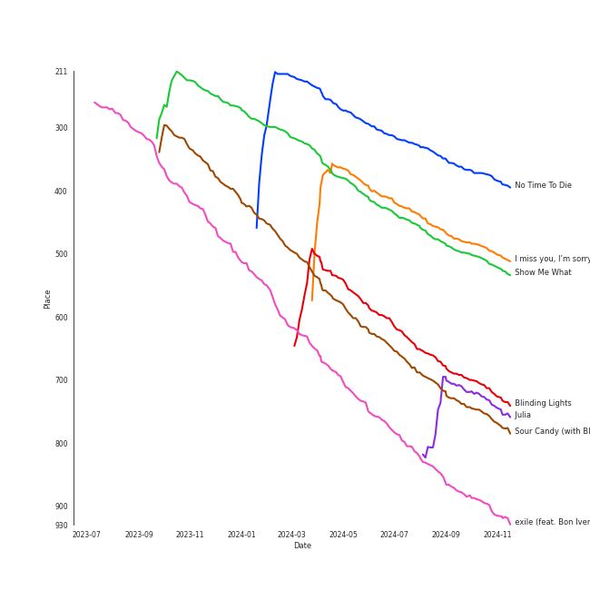

# Tracks in Pop from 2020

## Artists

| Art | Rank | Tracks | 💚 | Artist | 🔗 |
|:---|---:|---:|---:|:---|:---|
|  | 19 | 12 | 7 | [Taylor Swift](../../../artists/taylor_swift/overview.md) | [🔗](https://open.spotify.com/artist/06HL4z0CvFAxyc27GXpf02) |
|  | 86 | 8 | 4 | [Dua Lipa](../../../artists/dua_lipa/overview.md) | [🔗](https://open.spotify.com/artist/6M2wZ9GZgrQXHCFfjv46we) |
|  | 34 | 5 | 2 | [Ariana Grande](../../../artists/ariana_grande/overview.md) | [🔗](https://open.spotify.com/artist/66CXWjxzNUsdJxJ2JdwvnR) |
|  | 201 | 3 | 2 | [Doja Cat](../../../artists/doja_cat/overview.md) | [🔗](https://open.spotify.com/artist/5cj0lLjcoR7YOSnhnX0Po5) |
|  | 194 | 3 | 2 | [Justin Bieber](../../../artists/justin_bieber/overview.md) | [🔗](https://open.spotify.com/artist/1uNFoZAHBGtllmzznpCI3s) |
|  | 368 | 2 | 2 | Lauv | [🔗](https://open.spotify.com/artist/5JZ7CnR6gTvEMKX4g70Amv) |
|  | 340 | 2 | 2 | The Weeknd | [🔗](https://open.spotify.com/artist/1Xyo4u8uXC1ZmMpatF05PJ) |
|  | 417 | 2 | 1 | Rina Sawayama | [🔗](https://open.spotify.com/artist/2KEqzdPS7M5YwGmiuPTdr5) |
|  | 125 | 2 | 1 | [Lady Gaga](../../../artists/lady_gaga/overview.md) | [🔗](https://open.spotify.com/artist/1HY2Jd0NmPuamShAr6KMms) |
|  | 47 | 1 | 1 | [HWASA](../../../artists/hwasa/overview.md) | [🔗](https://open.spotify.com/artist/7bmYpVgQub656uNTu6qGNQ) |

View all

| Art | Rank | Tracks | 💚 | Artist | 🔗 |
|:---|---:|---:|---:|:---|:---|
|  | 313 | 1 | 1 | The Pussycat Dolls | [🔗](https://open.spotify.com/artist/6wPhSqRtPu1UhRCDX5yaDJ) |
|  | 42 | 1 | 1 | [Billie Eilish](../../../artists/billie_eilish/overview.md) | [🔗](https://open.spotify.com/artist/6qqNVTkY8uBg9cP3Jd7DAH) |
|  | 417 | 1 | 1 | 24kGoldn | [🔗](https://open.spotify.com/artist/6fWVd57NKTalqvmjRd2t8Z) |
|  | 417 | 1 | 1 | Saweetie | [🔗](https://open.spotify.com/artist/6cK3NBO6uP7hh0oyuVELFl) |
|  | 417 | 1 | 1 | [Clean Bandit](../../../artists/clean_bandit/overview.md) | [🔗](https://open.spotify.com/artist/6MDME20pz9RveH9rEXvrOM) |
|  | 328 | 1 | 1 | Bebe Rexha | [🔗](https://open.spotify.com/artist/64M6ah0SkkRsnPGtGiRAbb) |
|  | 417 | 1 | 1 | Stellar | [🔗](https://open.spotify.com/artist/5yw4tA8D5uG7tT3NaDvq10) |
|  | 417 | 1 | 1 | benny blanco | [🔗](https://open.spotify.com/artist/5CiGnKThu5ctn9pBxv7DGa) |
|  | 263 | 1 | 1 | Gracie Abrams | [🔗](https://open.spotify.com/artist/4tuJ0bMpJh08umKkEXKUI5) |
|  | 261 | 1 | 1 | DaBaby | [🔗](https://open.spotify.com/artist/4r63FhuTkUYltbVAg5TQnk) |
|  | 417 | 1 | 1 | Ava Max | [🔗](https://open.spotify.com/artist/4npEfmQ6YuiwW1GpUmaq3F) |
|  | 417 | 1 | 1 | Cardi B | [🔗](https://open.spotify.com/artist/4kYSro6naA4h99UJvo89HB) |
|  | 387 | 1 | 1 | Bon Iver | [🔗](https://open.spotify.com/artist/4LEiUm1SRbFMgfqnQTwUbQ) |
|  | 417 | 1 | 1 | Bazzi | [🔗](https://open.spotify.com/artist/4GvEc3ANtPPjt1ZJllr5Zl) |
|  | 3 | 1 | 1 | [BLACKPINK](../../../artists/blackpink/overview.md) | [🔗](https://open.spotify.com/artist/41MozSoPIsD1dJM0CLPjZF) |
|  | 417 | 1 | 1 | Jhorrmountain | [🔗](https://open.spotify.com/artist/3aAX2y0amckZ7WcWoz2f2o) |
|  | 417 | 1 | 1 | Puri | [🔗](https://open.spotify.com/artist/3ADyFy1orEwODaiHmRRMQp) |
|  | 272 | 1 | 1 | A. G. Cook | [🔗](https://open.spotify.com/artist/335TWGWGFan4vaacJzSiU8) |
|  | 417 | 1 | 1 | Pink Sweat$ | [🔗](https://open.spotify.com/artist/1W7FNibLa0O0b572tB2w7t) |
|  | 417 | 1 | 1 | Mabel | [🔗](https://open.spotify.com/artist/1MIVXf74SZHmTIp4V4paH4) |
|  | 417 | 1 | 1 | Megan Thee Stallion | [🔗](https://open.spotify.com/artist/181bsRPaVXVlUKXrxwZfHK) |
|  | 417 | 1 | 1 | GALXARA | [🔗](https://open.spotify.com/artist/0tu3jGW89NZZ8qrpd8c7xC) |
|  | 271 | 1 | 1 | Cecile Believe | [🔗](https://open.spotify.com/artist/0nZHjqvdLoBy50ZzUH5FNU) |
|  | 417 | 1 | 1 | Jenevieve | [🔗](https://open.spotify.com/artist/0dUYLC7DLjeS8gIh8cz2Pq) |
|  | 417 | 1 | 1 | Ellie Goulding | [🔗](https://open.spotify.com/artist/0X2BH1fck6amBIoJhDVmmJ) |
|  | 275 | 1 | 1 | [Jason Derulo](../../../artists/jason_derulo/overview.md) | [🔗](https://open.spotify.com/artist/07YZf4WDAMNwqr4jfgOZ8y) |
|  | 307 | 1 | 0 | Shawn Mendes | [🔗](https://open.spotify.com/artist/7n2wHs1TKAczGzO7Dd2rGr) |
|  | 417 | 1 | 0 | Glass Animals | [🔗](https://open.spotify.com/artist/4yvcSjfu4PC0CYQyLy4wSq) |
|  | 417 | 1 | 0 | Bad Bunny | [🔗](https://open.spotify.com/artist/4q3ewBCX7sLwd24euuV69X) |
|  | 377 | 1 | 0 | HAIM | [🔗](https://open.spotify.com/artist/4Ui2kfOqGujY81UcPrb5KE) |
|  | 417 | 1 | 0 | Conan Gray | [🔗](https://open.spotify.com/artist/4Uc8Dsxct0oMqx0P6i60ea) |
|  | 198 | 1 | 0 | keshi | [🔗](https://open.spotify.com/artist/3pc0bOVB5whxmD50W79wwO) |
|  | 417 | 1 | 0 | Sam Smith | [🔗](https://open.spotify.com/artist/2wY79sveU1sp5g7SokKOiI) |
|  | 323 | 1 | 0 | Halsey | [🔗](https://open.spotify.com/artist/26VFTg2z8YR0cCuwLzESi2) |
|  | 417 | 1 | 0 | J Balvin | [🔗](https://open.spotify.com/artist/1vyhD5VmyZ7KMfW5gqLgo5) |
|  | 417 | 1 | 0 | Tainy | [🔗](https://open.spotify.com/artist/0GM7qgcRCORpGnfcN2tCiB) |

## Albums

| Art | Rank | Tracks | 💚 | Album | Release Date | 🔗 |
|:---|---:|---:|---:|:---|:---|:---|
|  | 561 | 10 | 6 | folklore | 2020-07-24 | [🔗](https://open.spotify.com/album/2fenSS68JI1h4Fo296JfGr) |
|  | 616 | 6 | 3 | Future Nostalgia | 2020-03-27 | [🔗](https://open.spotify.com/album/5lKlFlReHOLShQKyRv6AL9) |
|  | 616 | 3 | 1 | Positions | 2020-10-30 | [🔗](https://open.spotify.com/album/3euz4vS7ezKGnNSwgyvKcd) |
|  | 449 | 2 | 2 | After Hours | 2020-03-20 | [🔗](https://open.spotify.com/album/4yP0hdKOZPNshxUOjY0cZj) |
|  | 616 | 2 | 1 | evermore | 2020-12-11 | [🔗](https://open.spotify.com/album/2Xoteh7uEpea4TohMxjtaq) |
|  | 616 | 2 | 1 | SAWAYAMA | 2020-04-17 | [🔗](https://open.spotify.com/album/3stadz88XVpHcXnVYMHc4J) |
|  | 473 | 2 | 1 | Chromatica | 2020-05-29 | [🔗](https://open.spotify.com/album/05c49JgPmL4Uz2ZeqRx5SP) |
|  | 527 | 1 | 1 | ~how i'm feeling~ | 2020-03-06 | [🔗](https://open.spotify.com/album/3ZuE680xhR1A4bCFGvL8mi) |
|  | 324 | 1 | 1 | minor | 2020-07-14 | [🔗](https://open.spotify.com/album/2UZw04wDxLVceADw2Gi1Qy) |
|  | 616 | 1 | 1 | WAP (feat. Megan Thee Stallion) | 2020-08-07 | [🔗](https://open.spotify.com/album/2ogiazbrNEx0kQHGl5ZBTQ) |

View all

| Art | Rank | Tracks | 💚 | Album | Release Date | 🔗 |
|:---|---:|---:|---:|:---|:---|:---|
|  | 616 | 1 | 1 | Tick Tock (feat. 24kGoldn) | 2020-08-21 | [🔗](https://open.spotify.com/album/3tuAs968COA2vxKjiLvmxr) |
|  | 616 | 1 | 1 | The Prelude | 2020-07-17 | [🔗](https://open.spotify.com/album/3Qj2vsFzmaB8jcH6Q60WIG) |
|  | 616 | 1 | 1 | Sway With Me (with GALXARA) | 2020-01-31 | [🔗](https://open.spotify.com/album/5uC0YWUVDKRZD9x1cRgjyu) |
|  | 616 | 1 | 1 | Stuck with U | 2020-05-08 | [🔗](https://open.spotify.com/album/5mUdh6YWnUvf0MfklEk1oi) |
|  | 616 | 1 | 1 | Slow Grenade | 2020-06-30 | [🔗](https://open.spotify.com/album/15Zgvxqql6EPHE3NJlUt0R) |
|  | 616 | 1 | 1 | React | 2020-02-07 | [🔗](https://open.spotify.com/album/3iJA3r8NBh2p3ZwRCiMxYz) |
|  | 616 | 1 | 1 | Physical (feat. Hwa Sa) | 2020-01-28 | [🔗](https://open.spotify.com/album/6apIJi4hf7U6cBOFwIqq1b) |
|  | 246 | 1 | 1 | No Time To Die | 2020-02-13 | [🔗](https://open.spotify.com/album/5sXSHscDjBez8VF20cSyad) |
|  | 616 | 1 | 1 | Lonely (with benny blanco) | 2020-10-16 | [🔗](https://open.spotify.com/album/3P5WIUJO0Ots1lQx09TOxk) |
|  | 616 | 1 | 1 | I Don't Think I'm Okay | 2020-07-09 | [🔗](https://open.spotify.com/album/2FVXY7JKhLrYb5CExY0CDq) |
|  | 616 | 1 | 1 | Heaven & Hell | 2020-09-18 | [🔗](https://open.spotify.com/album/26c7MmQ4w8EAvVLb4jilaM) |
|  | 616 | 1 | 1 | Coño | 2020-07-03 | [🔗](https://open.spotify.com/album/1h3x5tLWXhf438Y5AK60Ml) |
|  | 616 | 1 | 1 | Boss Bitch | 2020-01-23 | [🔗](https://open.spotify.com/album/4pmyFpGicLLIgNPc1TQXKc) |
|  | 616 | 1 | 1 | Baby, I'm Jealous (feat. Doja Cat) | 2020-10-09 | [🔗](https://open.spotify.com/album/2N367tN1eIXrHNVe86aVy4) |
|  | 616 | 1 | 1 | Baby Powder | 2020-03-25 | [🔗](https://open.spotify.com/album/3nqQxvxUB95Bi2UBseY1u1) |
|  | 616 | 1 | 1 | Ashes | 2020-05-03 | [🔗](https://open.spotify.com/album/41gMZm0ib3Je8hU0eFNUwS) |
|  | 335 | 1 | 1 | 7G | 2020-08-12 | [🔗](https://open.spotify.com/album/16NHNs15w1bpkFiBOUgDaB) |
|  | 616 | 1 | 0 | bandaids | 2020-03-24 | [🔗](https://open.spotify.com/album/4LfFHT00C9ImLMUjHkqWjQ) |
|  | 616 | 1 | 0 | UN DIA (ONE DAY) (Feat. Tainy) | 2020-07-24 | [🔗](https://open.spotify.com/album/6aqSlutLYNpzSsK4dV5jTr) |
|  | 616 | 1 | 0 | Monster | 2020-11-20 | [🔗](https://open.spotify.com/album/3yVVL2EYLp8g7gT08VvYKy) |
|  | 616 | 1 | 0 | Manic | 2020-01-17 | [🔗](https://open.spotify.com/album/68enXe5XcJdciSDAZr0Alr) |
|  | 616 | 1 | 0 | Love Goes | 2020-10-30 | [🔗](https://open.spotify.com/album/5XCBX16KNYsAe7V5hQV9mC) |
|  | 616 | 1 | 0 | Kid Krow | 2020-03-20 | [🔗](https://open.spotify.com/album/2CMlkzFI2oDAy5MbyV7OV5) |
|  | 616 | 1 | 0 | Dreamland (+ Bonus Levels) | 2020-08-06 | [🔗](https://open.spotify.com/album/0KTj6k94XZh0c6IEMfxeWV) |

## Tracks

| Art | Track | Album | Artists | Label | Rank | 💚 | 🔗 |
|:---|:---|:---|:---|:---|---:|:---|:---|
|  | No Time To Die | No Time To Die | [Billie Eilish](../../../artists/billie_eilish/overview.md) | [Darkroom](../../../labels/darkroom), [Interscope Records](../../../labels/interscope_records) | 344 | 💚 | [🔗](https://open.spotify.com/track/73SpzrcaHk0RQPFP73vqVR) |
|  | I miss you, I’m sorry | minor | Gracie Abrams | Gracie Abrams, under exclusive license to Interscope Records | 458 | 💚 | [🔗](https://open.spotify.com/track/4nyF5lmSziBAt7ESAUjpbx) |
|  | Show Me What | 7G | A. G. Cook, Cecile Believe | PC Music | 477 | 💚 | [🔗](https://open.spotify.com/track/0qJtV82bKOgB2kvfa8IrZp) |
|  | Blinding Lights | After Hours | The Weeknd | [Republic Records](../../../labels/republic_records) | 665 | 💚 | [🔗](https://open.spotify.com/track/0VjIjW4GlUZAMYd2vXMi3b) |
|  | Sour Candy (with BLACKPINK) | Chromatica | [Lady Gaga](../../../artists/lady_gaga/overview.md), [BLACKPINK](../../../artists/blackpink/overview.md) | [Interscope](../../../labels/interscope_records) | 706 | 💚 | [🔗](https://open.spotify.com/track/1IWNylpZ477gIVUDpJL66u) |
|  | Julia | ~how i'm feeling~ | Lauv | Lauv | 785 | 💚 | [🔗](https://open.spotify.com/track/12YVZ3Tg4LyAJNsMJVtwQq) |
|  | exile (feat. Bon Iver) | folklore | [Taylor Swift](../../../artists/taylor_swift/overview.md), Bon Iver | [Taylor Swift](../../../labels/taylor_swift) | 843 | 💚 | [🔗](https://open.spotify.com/track/4pvb0WLRcMtbPGmtejJJ6y) |
|  | Without Me | Manic | Halsey | [Capitol Records](../../../labels/capitol_records) | 929 | | [🔗](https://open.spotify.com/track/6FZDfxM3a3UCqtzo5pxSLZ) |
|  | Boss Bitch | Boss Bitch | [Doja Cat](../../../artists/doja_cat/overview.md) | [Atlantic Records](../../../labels/atlantic_records) | 929 | 💚 | [🔗](https://open.spotify.com/track/78qd8dvwea0Gosb6Fe6j3k) |
|  | Physical (feat. Hwa Sa) | Physical (feat. Hwa Sa) | [Dua Lipa](../../../artists/dua_lipa/overview.md), [HWASA](../../../artists/hwasa/overview.md) | [Warner Records](../../../labels/warner_records) | 929 | 💚 | [🔗](https://open.spotify.com/track/23jEeXRyrjFbfs2Q8tBwdI) |

View all

| Art | Track | Album | Artists | Label | Rank | 💚 | 🔗 |
|:---|:---|:---|:---|:---|---:|:---|:---|
|  | Sway With Me (with GALXARA) | Sway With Me (with GALXARA) | Saweetie, GALXARA | [Atlantic Records](../../../labels/atlantic_records) | 929 | 💚 | [🔗](https://open.spotify.com/track/5gqLY5H1ZyT3BScVr0nDMs) |
|  | React | React | The Pussycat Dolls | Access Records | 929 | 💚 | [🔗](https://open.spotify.com/track/0qMAJBLMTshMx03CJkJl6O) |
|  | Save Your Tears | After Hours | The Weeknd | [Republic Records](../../../labels/republic_records) | 929 | 💚 | [🔗](https://open.spotify.com/track/5QO79kh1waicV47BqGRL3g) |
|  | Maniac | Kid Krow | Conan Gray | [Republic Records](../../../labels/republic_records) | 929 | | [🔗](https://open.spotify.com/track/6KfoDhO4XUWSbnyKjNp9c4) |
|  | right here | bandaids | keshi | [Island Records](../../../labels/island_records) | 929 | | [🔗](https://open.spotify.com/track/2Q3QRjA8MjzqpFaIkFludb) |
|  | Baby Powder | Baby Powder | Jenevieve | JOYFACE Records, LLC | 929 | 💚 | [🔗](https://open.spotify.com/track/7t4ihBlcMdkyUeO6W1DfYH) |
|  | Break My Heart | Future Nostalgia | [Dua Lipa](../../../artists/dua_lipa/overview.md) | [Warner Records](../../../labels/warner_records) | 929 | 💚 | [🔗](https://open.spotify.com/track/59CrwNtNqzOmODXRxwaknc) |
|  | Don't Start Now | Future Nostalgia | [Dua Lipa](../../../artists/dua_lipa/overview.md) | [Warner Records](../../../labels/warner_records) | 929 | 💚 | [🔗](https://open.spotify.com/track/1AVtceapuF36oZqI9gzp0o) |
|  | Hallucinate | Future Nostalgia | [Dua Lipa](../../../artists/dua_lipa/overview.md) | [Warner Records](../../../labels/warner_records) | 929 | | [🔗](https://open.spotify.com/track/2MUKw7zEirXqdZZ3xC4hOf) |
|  | Levitating (feat. DaBaby) | Future Nostalgia | [Dua Lipa](../../../artists/dua_lipa/overview.md), DaBaby | [Warner Records](../../../labels/warner_records) | 929 | 💚 | [🔗](https://open.spotify.com/track/5nujrmhLynf4yMoMtj8AQF) |
|  | Physical | Future Nostalgia | [Dua Lipa](../../../artists/dua_lipa/overview.md) | [Warner Records](../../../labels/warner_records) | 929 | | [🔗](https://open.spotify.com/track/7toYVidBIpAmM8Ife3LGrP) |
|  | Pretty Please | Future Nostalgia | [Dua Lipa](../../../artists/dua_lipa/overview.md) | [Warner Records](../../../labels/warner_records) | 929 | | [🔗](https://open.spotify.com/track/5Pc594FhDA2Fa2prE75GT0) |
|  | Comme Des Garçons (Like The Boys) | SAWAYAMA | Rina Sawayama | Dirty Hit | 929 | 💚 | [🔗](https://open.spotify.com/track/43bYs8QkPdCdy5esfnmU1T) |
|  | XS | SAWAYAMA | Rina Sawayama | Dirty Hit | 929 | | [🔗](https://open.spotify.com/track/1TWNKyNQOBfNUkWWs7FooF) |
|  | Ashes | Ashes | Stellar | Arista Records | 929 | 💚 | [🔗](https://open.spotify.com/track/3Pj6u2KTgepyyidp5xfbHp) |
|  | Stuck with U (with Justin Bieber) | Stuck with U | [Ariana Grande](../../../artists/ariana_grande/overview.md), [Justin Bieber](../../../artists/justin_bieber/overview.md) | Ariana Grande & Justin Bieber "Stuck With U"- Charity | 929 | 💚 | [🔗](https://open.spotify.com/track/4HBZA5flZLE435QTztThqH) |
|  | Rain On Me (with Ariana Grande) | Chromatica | [Lady Gaga](../../../artists/lady_gaga/overview.md), [Ariana Grande](../../../artists/ariana_grande/overview.md) | [Interscope](../../../labels/interscope_records) | 929 | | [🔗](https://open.spotify.com/track/7ju97lgwC2rKQ6wwsf9no9) |
|  | Slow Grenade | Slow Grenade | Ellie Goulding, Lauv | [Polydor Records](../../../labels/polydor_records) | 929 | 💚 | [🔗](https://open.spotify.com/track/5z8uLrYMcUVvzTV28twt44) |
|  | Coño | Coño | [Jason Derulo](../../../artists/jason_derulo/overview.md), Puri, Jhorrmountain | Spinnin' Records | 929 | 💚 | [🔗](https://open.spotify.com/track/5DV4ZSCqbFv74ui3ZhimXo) |
|  | I Don't Think I'm Okay | I Don't Think I'm Okay | Bazzi | iamcosmic | 929 | 💚 | [🔗](https://open.spotify.com/track/0PUkanqCGTb6qseXPKOw1F) |
|  | At My Worst | The Prelude | Pink Sweat$ | [Atlantic Records](../../../labels/atlantic_records) | 929 | 💚 | [🔗](https://open.spotify.com/track/0ri0Han4IRJhzvERHOZTMr) |
|  | UN DIA (ONE DAY) (Feat. Tainy) | UN DIA (ONE DAY) (Feat. Tainy) | J Balvin, [Dua Lipa](../../../artists/dua_lipa/overview.md), Bad Bunny, Tainy | Universal Music Latino/ NEON16 | 929 | | [🔗](https://open.spotify.com/track/0EhpEsp4L0oRGM0vmeaN5e) |
|  | august | folklore | [Taylor Swift](../../../artists/taylor_swift/overview.md) | [Taylor Swift](../../../labels/taylor_swift) | 929 | 💚 | [🔗](https://open.spotify.com/track/3hUxzQpSfdDqwM3ZTFQY0K) |
|  | cardigan | folklore | [Taylor Swift](../../../artists/taylor_swift/overview.md) | [Taylor Swift](../../../labels/taylor_swift) | 929 | 💚 | [🔗](https://open.spotify.com/track/4R2kfaDFhslZEMJqAFNpdd) |
|  | epiphany | folklore | [Taylor Swift](../../../artists/taylor_swift/overview.md) | [Taylor Swift](../../../labels/taylor_swift) | 929 | | [🔗](https://open.spotify.com/track/08fa9LFcFBTcilB3iq2e2A) |
|  | illicit affairs | folklore | [Taylor Swift](../../../artists/taylor_swift/overview.md) | [Taylor Swift](../../../labels/taylor_swift) | 929 | | [🔗](https://open.spotify.com/track/2NmsngXHeC1GQ9wWrzhOMf) |
|  | invisible string | folklore | [Taylor Swift](../../../artists/taylor_swift/overview.md) | [Taylor Swift](../../../labels/taylor_swift) | 929 | 💚 | [🔗](https://open.spotify.com/track/6VsvKPJ4xjVNKpI8VVZ3SV) |
|  | mad woman | folklore | [Taylor Swift](../../../artists/taylor_swift/overview.md) | [Taylor Swift](../../../labels/taylor_swift) | 929 | | [🔗](https://open.spotify.com/track/2QDyYdZyhlP2fp79KZX8Bi) |
|  | peace | folklore | [Taylor Swift](../../../artists/taylor_swift/overview.md) | [Taylor Swift](../../../labels/taylor_swift) | 929 | | [🔗](https://open.spotify.com/track/7MbT4I8qGntX4fMdqMQgke) |
|  | the 1 | folklore | [Taylor Swift](../../../artists/taylor_swift/overview.md) | [Taylor Swift](../../../labels/taylor_swift) | 929 | 💚 | [🔗](https://open.spotify.com/track/0Jlcvv8IykzHaSmj49uNW8) |
|  | the last great american dynasty | folklore | [Taylor Swift](../../../artists/taylor_swift/overview.md) | [Taylor Swift](../../../labels/taylor_swift) | 929 | 💚 | [🔗](https://open.spotify.com/track/2Eeur20xVqfUoM3Q7EFPFt) |
|  | Heat Waves | Dreamland (+ Bonus Levels) | Glass Animals | [Polydor Records](../../../labels/polydor_records) | 929 | | [🔗](https://open.spotify.com/track/02MWAaffLxlfxAUY7c5dvx) |
|  | WAP (feat. Megan Thee Stallion) | WAP (feat. Megan Thee Stallion) | Cardi B, Megan Thee Stallion | [Atlantic/KSR](../../../labels/atlantic_records) | 929 | 💚 | [🔗](https://open.spotify.com/track/4Oun2ylbjFKMPTiaSbbCih) |
|  | Tick Tock (feat. 24kGoldn) | Tick Tock (feat. 24kGoldn) | [Clean Bandit](../../../artists/clean_bandit/overview.md), Mabel, 24kGoldn | Atlantic Records UK | 929 | 💚 | [🔗](https://open.spotify.com/track/27u7t9d7ZQoyjsCROHuZJ3) |
|  | Sweet but Psycho | Heaven & Hell | Ava Max | [Atlantic Records](../../../labels/atlantic_records) | 929 | 💚 | [🔗](https://open.spotify.com/track/7DnAm9FOTWE3cUvso43HhI) |
|  | Baby, I'm Jealous (feat. Doja Cat) | Baby, I'm Jealous (feat. Doja Cat) | Bebe Rexha, [Doja Cat](../../../artists/doja_cat/overview.md) | [Warner Records](../../../labels/warner_records) | 929 | 💚 | [🔗](https://open.spotify.com/track/2fTdRdN73RgIgcUZN33dvt) |
|  | Lonely (with benny blanco) | Lonely (with benny blanco) | [Justin Bieber](../../../artists/justin_bieber/overview.md), benny blanco | Friends Keep Secrets, [Def Jam Recordings](../../../labels/def_jam_recordings), [Interscope Records](../../../labels/interscope_records) | 929 | 💚 | [🔗](https://open.spotify.com/track/4y4spB9m0Q6026KfkAvy9Q) |
|  | Kids Again | Love Goes | Sam Smith | [Capitol](../../../labels/capitol_records) | 929 | | [🔗](https://open.spotify.com/track/5LL9lSNn26GBoC5StQ3itk) |
|  | motive (with Doja Cat) | Positions | [Ariana Grande](../../../artists/ariana_grande/overview.md), [Doja Cat](../../../artists/doja_cat/overview.md) | [Republic Records](../../../labels/republic_records) | 929 | | [🔗](https://open.spotify.com/track/5GkQIP5mWPi4KZLLXeuFTT) |
|  | positions | Positions | [Ariana Grande](../../../artists/ariana_grande/overview.md) | [Republic Records](../../../labels/republic_records) | 929 | 💚 | [🔗](https://open.spotify.com/track/35mvY5S1H3J2QZyna3TFe0) |
|  | pov | Positions | [Ariana Grande](../../../artists/ariana_grande/overview.md) | [Republic Records](../../../labels/republic_records) | 929 | | [🔗](https://open.spotify.com/track/3UoULw70kMsiVXxW0L3A33) |
|  | Monster (Shawn Mendes & Justin Bieber) | Monster | Shawn Mendes, [Justin Bieber](../../../artists/justin_bieber/overview.md) | [Shawn Mendes LP4-5 PS/ Island](../../../labels/island_records) | 929 | | [🔗](https://open.spotify.com/track/2Z8yfpFX0ZMavHkcIeHiO1) |
|  | no body, no crime (feat. HAIM) | evermore | [Taylor Swift](../../../artists/taylor_swift/overview.md), HAIM | [Taylor Swift](../../../labels/taylor_swift) | 929 | | [🔗](https://open.spotify.com/track/3RaT22zZsxVYxxKR7TAaYF) |
|  | willow | evermore | [Taylor Swift](../../../artists/taylor_swift/overview.md) | [Taylor Swift](../../../labels/taylor_swift) | 929 | 💚 | [🔗](https://open.spotify.com/track/0lx2cLdOt3piJbcaXIV74f) |

