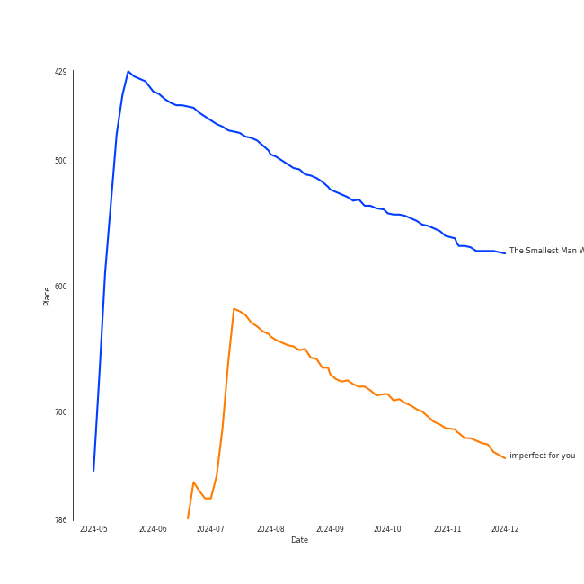

# Tracks in Pop from 2024

## Artists

| Art | Rank | Tracks | 💚 | Artist | 🔗 |
|:---|---:|---:|---:|:---|:---|
|  | 33 | 7 | 5 | [Ariana Grande](../../../artists/ariana_grande/overview.md) | [🔗](https://open.spotify.com/artist/66CXWjxzNUsdJxJ2JdwvnR) |
|  | 448 | 4 | 4 | Sabrina Carpenter | [🔗](https://open.spotify.com/artist/74KM79TiuVKeVCqs8QtB0B) |
|  | 47 | 4 | 4 | [Billie Eilish](../../../artists/billie_eilish/overview.md) | [🔗](https://open.spotify.com/artist/6qqNVTkY8uBg9cP3Jd7DAH) |
|  | 20 | 6 | 2 | [Taylor Swift](../../../artists/taylor_swift/overview.md) | [🔗](https://open.spotify.com/artist/06HL4z0CvFAxyc27GXpf02) |
|  | 302 | 3 | 2 | Charli xcx | [🔗](https://open.spotify.com/artist/25uiPmTg16RbhZWAqwLBy5) |
|  | 142 | 1 | 1 | [Beyoncé](../../../artists/beyoncé/overview.md) | [🔗](https://open.spotify.com/artist/6vWDO969PvNqNYHIOW5v0m) |
|  | 448 | 1 | 1 | Tate McRae | [🔗](https://open.spotify.com/artist/45dkTj5sMRSjrmBSBeiHym) |
|  | 299 | 1 | 1 | [Olivia Rodrigo](../../../artists/olivia_rodrigo/overview.md) | [🔗](https://open.spotify.com/artist/1McMsnEElThX1knmY4oliG) |
|  | 448 | 1 | 0 | Nonna | [🔗](https://open.spotify.com/artist/6maPmKkdwM4eyhz5O4lbkP) |

## Albums

| Art | Rank | Tracks | 💚 | Album | Release Date | 🔗 |
|:---|---:|---:|---:|:---|:---|:---|
|  | 500 | 7 | 5 | eternal sunshine | 2024-03-08 | [🔗](https://open.spotify.com/album/5EYKrEDnKhhcNxGedaRQeK) |
|  | 395 | 6 | 2 | THE TORTURED POETS DEPARTMENT: THE ANTHOLOGY | 2024-04-19 | [🔗](https://open.spotify.com/album/5H7ixXZfsNMGbIE5OBSpcb) |
|  | 690 | 3 | 3 | HIT ME HARD AND SOFT | 2024-05-17 | [🔗](https://open.spotify.com/album/7aJuG4TFXa2hmE4z1yxc3n) |
|  | 690 | 2 | 2 | Short n' Sweet | 2024-08-23 | [🔗](https://open.spotify.com/album/3iPSVi54hsacKKl1xIR2eH) |
|  | 690 | 2 | 1 | BRAT | 2024-06-07 | [🔗](https://open.spotify.com/album/2lIZef4lzdvZkiiCzvPKj7) |
|  | 690 | 1 | 1 | Please Please Please | 2024-06-06 | [🔗](https://open.spotify.com/album/5bBaoign62r1i7OV8w7mi9) |
|  | 690 | 1 | 1 | It's ok I'm ok | 2024-09-12 | [🔗](https://open.spotify.com/album/5qfivA7g2aAhAIPnSb0csp) |
|  | 690 | 1 | 1 | GUTS (spilled) | 2024-03-22 | [🔗](https://open.spotify.com/album/1D06fz3cuob62ysTS8k6gu) |
|  | 690 | 1 | 1 | Espresso | 2024-04-12 | [🔗](https://open.spotify.com/album/5quMTd5zeI9yW5UDua8wS4) |
|  | 690 | 1 | 1 | COWBOY CARTER | 2024-03-29 | [🔗](https://open.spotify.com/album/6BzxX6zkDsYKFJ04ziU5xQ) |

View all

| Art | Rank | Tracks | 💚 | Album | Release Date | 🔗 |
|:---|---:|---:|---:|:---|:---|:---|
|  | 690 | 1 | 1 | Brat and it’s completely different but also still brat | 2024-10-11 | [🔗](https://open.spotify.com/album/36P07bti6xD99o7S1acmin) |

## Tracks

| Art | Track | Album | Artists | Label | Rank | 💚 | 🔗 |
|:---|:---|:---|:---|:---|---:|:---|:---|
|  | The Smallest Man Who Ever Lived | THE TORTURED POETS DEPARTMENT: THE ANTHOLOGY | [Taylor Swift](../../../artists/taylor_swift/overview.md) | [Taylor Swift](../../../labels/taylor_swift) | 582 | | [🔗](https://open.spotify.com/track/1xtw1krCR6Dw2KwkXw5z63) |
|  | imperfect for you | eternal sunshine | [Ariana Grande](../../../artists/ariana_grande/overview.md) | [Republic Records](../../../labels/republic_records) | 742 | 💚 | [🔗](https://open.spotify.com/track/6XXKB32Om6WuXg3uEWwTob) |
|  | don't wanna break up again | eternal sunshine | [Ariana Grande](../../../artists/ariana_grande/overview.md) | [Republic Records](../../../labels/republic_records) | 1054 | 💚 | [🔗](https://open.spotify.com/track/0o3ua5ufFK7nfRzbDUNoGA) |
|  | ordinary things (feat. Nonna) | eternal sunshine | [Ariana Grande](../../../artists/ariana_grande/overview.md), Nonna | [Republic Records](../../../labels/republic_records) | 1054 | | [🔗](https://open.spotify.com/track/4mHM5d2fK3n8xgymjf92w2) |
|  | the boy is mine | eternal sunshine | [Ariana Grande](../../../artists/ariana_grande/overview.md) | [Republic Records](../../../labels/republic_records) | 1054 | 💚 | [🔗](https://open.spotify.com/track/0Lmbke3KNVFXtoH2mMSHCw) |
|  | true story | eternal sunshine | [Ariana Grande](../../../artists/ariana_grande/overview.md) | [Republic Records](../../../labels/republic_records) | 1054 | | [🔗](https://open.spotify.com/track/14kyXBpg91RVq8bNRDS1q2) |
|  | we can't be friends (wait for your love) | eternal sunshine | [Ariana Grande](../../../artists/ariana_grande/overview.md) | [Republic Records](../../../labels/republic_records) | 1054 | 💚 | [🔗](https://open.spotify.com/track/51ZQ1vr10ffzbwIjDCwqm4) |
|  | yes, and? | eternal sunshine | [Ariana Grande](../../../artists/ariana_grande/overview.md) | [Republic Records](../../../labels/republic_records) | 1054 | 💚 | [🔗](https://open.spotify.com/track/5D34wRmbFS29AjtTOP2QJe) |
|  | obsessed | GUTS (spilled) | [Olivia Rodrigo](../../../artists/olivia_rodrigo/overview.md) | Olivia Rodrigo PS | 1054 | 💚 | [🔗](https://open.spotify.com/track/6tNgRQ0K2NYZ0Rb9l9DzL8) |
|  | TEXAS HOLD 'EM | COWBOY CARTER | [Beyoncé](../../../artists/beyoncé/overview.md) | [Columbia](../../../labels/columbia), [Parkwood Entertainment](../../../labels/parkwood_entertainment) | 1054 | 💚 | [🔗](https://open.spotify.com/track/7wLShogStyDeZvL0a6daN5) |

View all

| Art | Track | Album | Artists | Label | Rank | 💚 | 🔗 |
|:---|:---|:---|:---|:---|---:|:---|:---|
|  | Espresso | Espresso | Sabrina Carpenter | [Island Records](../../../labels/island_records) | 1054 | 💚 | [🔗](https://open.spotify.com/track/2qSkIjg1o9h3YT9RAgYN75) |
|  | Down Bad | THE TORTURED POETS DEPARTMENT: THE ANTHOLOGY | [Taylor Swift](../../../artists/taylor_swift/overview.md) | [Taylor Swift](../../../labels/taylor_swift) | 1054 | | [🔗](https://open.spotify.com/track/1kbEbBdEgQdQeLXCJh28pJ) |
|  | Guilty as Sin? | THE TORTURED POETS DEPARTMENT: THE ANTHOLOGY | [Taylor Swift](../../../artists/taylor_swift/overview.md) | [Taylor Swift](../../../labels/taylor_swift) | 1054 | | [🔗](https://open.spotify.com/track/799KrpEbhZp0MHeiA8YK9P) |
|  | I Can Do It With a Broken Heart | THE TORTURED POETS DEPARTMENT: THE ANTHOLOGY | [Taylor Swift](../../../artists/taylor_swift/overview.md) | [Taylor Swift](../../../labels/taylor_swift) | 1054 | 💚 | [🔗](https://open.spotify.com/track/2fPvQfGQEZOKtJ9qXeL4x8) |
|  | So Long, London | THE TORTURED POETS DEPARTMENT: THE ANTHOLOGY | [Taylor Swift](../../../artists/taylor_swift/overview.md) | [Taylor Swift](../../../labels/taylor_swift) | 1054 | 💚 | [🔗](https://open.spotify.com/track/7wAkQFShJ27V8362MqevQr) |
|  | The Tortured Poets Department | THE TORTURED POETS DEPARTMENT: THE ANTHOLOGY | [Taylor Swift](../../../artists/taylor_swift/overview.md) | [Taylor Swift](../../../labels/taylor_swift) | 1054 | | [🔗](https://open.spotify.com/track/4PdLaGZubp4lghChqp8erB) |
|  | BIRDS OF A FEATHER | HIT ME HARD AND SOFT | [Billie Eilish](../../../artists/billie_eilish/overview.md) | [Darkroom](../../../labels/darkroom), [Interscope Records](../../../labels/interscope_records) | 1054 | 💚 | [🔗](https://open.spotify.com/track/6dOtVTDdiauQNBQEDOtlAB) |
|  | BLUE | HIT ME HARD AND SOFT | [Billie Eilish](../../../artists/billie_eilish/overview.md) | [Darkroom](../../../labels/darkroom), [Interscope Records](../../../labels/interscope_records) | 1054 | 💚 | [🔗](https://open.spotify.com/track/2prqm9sPLj10B4Wg0wE5x9) |
|  | LUNCH | HIT ME HARD AND SOFT | [Billie Eilish](../../../artists/billie_eilish/overview.md) | [Darkroom](../../../labels/darkroom), [Interscope Records](../../../labels/interscope_records) | 1054 | 💚 | [🔗](https://open.spotify.com/track/629DixmZGHc7ILtEntuiWE) |
|  | Please Please Please | Please Please Please | Sabrina Carpenter | [Island Records](../../../labels/island_records) | 1054 | 💚 | [🔗](https://open.spotify.com/track/5N3hjp1WNayUPZrA8kJmJP) |
|  | 360 | BRAT | Charli xcx | [Atlantic Records](../../../labels/atlantic_records) | 1054 | | [🔗](https://open.spotify.com/track/4w2GLmK2wnioVnb5CPQeex) |
|  | 365 | BRAT | Charli xcx | [Atlantic Records](../../../labels/atlantic_records) | 1054 | 💚 | [🔗](https://open.spotify.com/track/5h68SoVFGleijCtjEja3xG) |
|  | Bed Chem | Short n' Sweet | Sabrina Carpenter | [Island Records](../../../labels/island_records) | 1054 | 💚 | [🔗](https://open.spotify.com/track/1UHS8Rf6h5Ar3CDWRd3wjF) |
|  | Taste | Short n' Sweet | Sabrina Carpenter | [Island Records](../../../labels/island_records) | 1054 | 💚 | [🔗](https://open.spotify.com/track/5G2f63n7IPVPPjfNIGih7Q) |
|  | It's ok I'm ok | It's ok I'm ok | Tate McRae | [RCA Records Label](../../../labels/rca_records_label) | 1054 | 💚 | [🔗](https://open.spotify.com/track/24XihnoVPWXlKJ4BgXqjVM) |
|  | Guess featuring billie eilish | Brat and it’s completely different but also still brat | Charli xcx, [Billie Eilish](../../../artists/billie_eilish/overview.md) | [Atlantic Records](../../../labels/atlantic_records) | 1054 | 💚 | [🔗](https://open.spotify.com/track/0IsIY8pfu1yaGkPUD7pkDx) |

