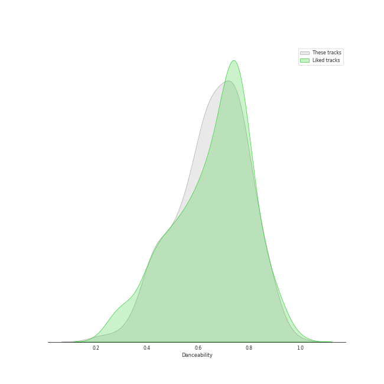
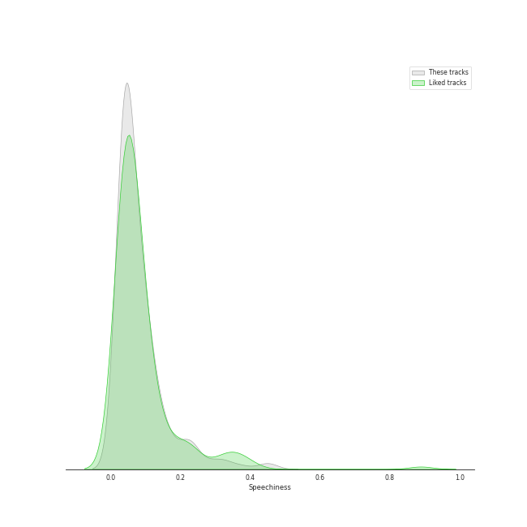
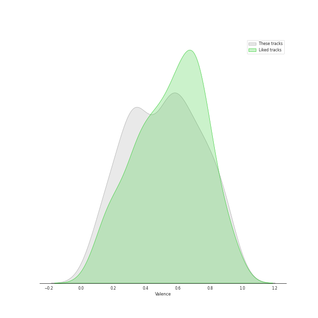
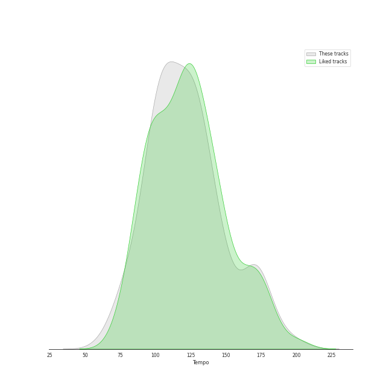

# Audio Features for Pop

## Danceability

| 10 most Danceable tracks | 10 least Danceable tracks |
|:---|:---|
| SexyBack (feat. Timbaland) (0.967) | Fix You (0.209) |
| Anaconda (0.964) | Gravity (0.27) |
| WAP (feat. Megan Thee Stallion) (0.935) | La Vie En Rose (0.276) |
| Pretty Please (0.906) | exile (feat. Bon Iver) (0.298) |
| bury a friend (0.905) | Happier Than Ever (0.332) |
| Sally Walker (0.905) | Skyfall (0.346) |
| Coño (0.899) | Jar of Hearts (0.349) |
| I Think He Knows (0.897) | We All Need Saving (0.35) |
| Yeah! (feat. Lil Jon & Ludacris) (0.894) | lovely (with Khalid) (0.351) |
| LoveGame (0.894) | epiphany (0.354) |

## Energy

| 10 most Energetic tracks | 10 least Energetic tracks |
|:---|:---|
| Larger Than Life (0.973) | when the party's over (0.111) |
| Boss Bitch (0.955) | xanny (0.125) |
| This Is What You Came For (0.927) | Julia (0.128) |
| Bye Bye Bye (0.926) | Say Something (0.147) |
| Bad Romance (0.921) | Come Home (0.155) |
| Red (0.896) | Your Song (0.195) |
| Levitating (0.884) | No Time To Die (0.219) |
| Green Light (feat. André 3000) (0.882) | everything i wanted (0.225) |
| Don't Call Me Up (0.881) | Happier Than Ever (0.225) |
| Focus (0.876) | Off My Face (0.228) |

## Speechiness

| 10 most Speechy tracks | 10 least Speechy tracks |
|:---|:---|
| Youngblood (0.463) | All Too Well (0.0243) |
| boyfriend (with Social House) (0.461) | The Scientist (0.0243) |
| WAP (feat. Megan Thee Stallion) (0.375) | Old Fashioned (0.0246) |
| bad guy (0.375) | Set Fire to the Rain (0.0249) |
| Bubblegum (feat. Tyga) (0.34) | Chasing Pavements (0.0251) |
| 7 rings (0.334) | Show Me the Meaning of Being Lonely (0.0252) |
| bury a friend (0.332) | Everything (0.0254) |
| Hustle (0.326) | Put A Little Love On Me (0.0262) |
| Light Switch (0.308) | Begin Again (0.0263) |
| Show Me What (0.287) | no body, no crime (feat. HAIM) (0.0264) |

## Acousticness

| 10 most Acoustic tracks | 10 least Acoustic tracks |
|:---|:---|
| when the party's over (0.978) | Pon de Replay (0.000155) |
| Take It All (0.957) | Misery (0.000315) |
| Come Home (0.947) | Coño (0.000554) |
| Stay (0.945) | Out Of The Woods (0.00103) |
| Your Song (0.936) | Blinding Lights (0.00146) |
| lovely (with Khalid) (0.934) | Maniac (0.00162) |
| When I Was Your Man (0.932) | I Kissed A Girl (0.00223) |
| All of Me (0.922) | Don’t Call Me Angel (Charlie’s Angels) (with Miley Cyrus & Lana Del Rey) (0.00237) |
| Off My Face (0.92) | Yellow (0.00239) |
| peace (0.918) | Style (0.00253) |

## Instrumentalness

| 10 most Instrumental tracks | 10 least Instrumental tracks |
|:---|:---|
| Abeja (0.915) | Leave The Door Open (0.0) |
| everything i wanted (0.657) | Clean (0.0) |
| Instant Crush (feat. Julian Casablancas) (0.619) | This Is Why We Can't Have Nice Things (0.0) |
| you should see me in a crown (0.219) | Love Me Like You Do (0.0) |
| golden hour (0.162) | UN DIA (ONE DAY) (Feat. Tainy) (0.0) |
| bury a friend (0.162) | React (0.0) |
| GOLDWING (0.159) | TiK ToK (0.0) |
| Therefore I Am (0.135) | Jar of Hearts (0.0) |
| bad guy (0.13) | Lucky (0.0) |
| This Is What You Came For (0.119) | That's What I Like (0.0) |

## Liveness

| 10 most Live tracks | 10 least Live tracks |
|:---|:---|
| La Vie En Rose (0.706) | Finesse - Remix; feat. Cardi B (0.0215) |
| Radioactive (0.668) | Finesse (0.0232) |
| What Now (0.628) | Oh My God (0.0264) |
| Larger Than Life (0.617) | Flowers (0.0322) |
| Feel Good Inc. (0.613) | Uptown Funk (feat. Bruno Mars) (0.0344) |
| Super Bass (0.601) | It's Gonna Be Me (0.0372) |
| Good Girls Go Bad (feat. Leighton Meester) (0.549) | Yeah! (feat. Lil Jon & Ludacris) (0.0388) |
| (I Got That) Boom Boom (feat. Ying Yang Twins) (0.508) | I Knew You Were Trouble. (0.0398) |
| Sour Candy (with BLACKPINK) (0.489) | Good Thing (with Kehlani) (0.0409) |
| In the Name of Love (0.454) | Hot In It (0.0413) |

## Valence

| 10 most Happy tracks | 10 least Happy tracks |
|:---|:---|
| There's Nothing Holdin' Me Back (0.969) | Delicate (0.0499) |
| Sugar, Sugar (0.967) | No Time To Die (0.0517) |
| Mercy (0.964) | xanny (0.0528) |
| SexyBack (feat. Timbaland) (0.964) | Falling (0.0592) |
| I'm a Slave 4 U (0.963) | Yellow Flicker Beat (0.0597) |
| Sucker (0.952) | Say Something (0.0765) |
| I Choose You (0.947) | Skyfall (0.0789) |
| Tick Tock (feat. 24kGoldn) (0.946) | Dress (0.0851) |
| Peacock (0.945) | I Don’t Wanna Live Forever (Fifty Shades Darker) - From "Fifty Shades Darker (Original Motion Picture Soundtrack)" (0.0862) |
| Shake It Off (0.943) | Jar of Hearts (0.0886) |

## Tempo

| 10 most Fast tracks | 10 least Fast tracks |
|:---|:---|
| That's My Girl (202.049) | My Everything (61.975) |
| boyfriend (with Social House) (190.097) | River (62.507) |
| Good Thing (with Kehlani) (185.913) | imagine (62.52) |
| Brave (185.063) | Lover (68.534) |
| Light Switch (184.008) | Rehab (71.515) |
| deja vu (181.088) | When I Was Your Man (72.795) |
| What Now (180.158) | No Time To Die (73.537) |
| I Love You 3000 II (179.727) | Jar of Hearts (74.541) |
| MONTERO (Call Me By Your Name) (178.818) | We All Need Saving (74.717) |
| Stuck with U (with Justin Bieber) (178.765) | Ride (74.989) |
