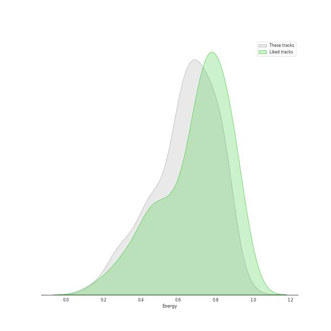
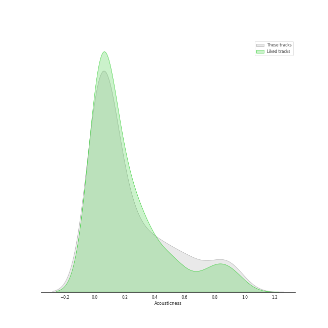
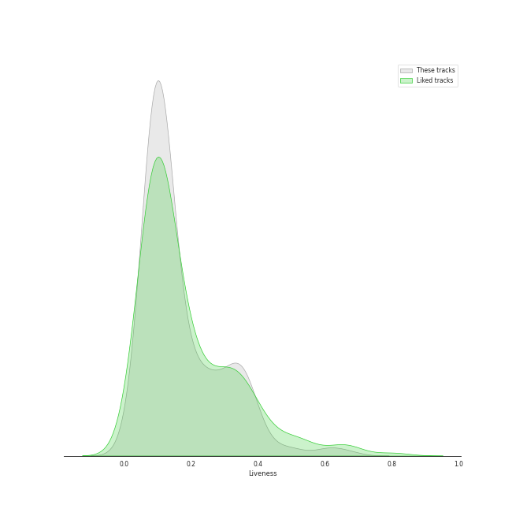

# Track Features for Pop

## Danceability

| ​ | 10 most Danceable tracks | ​​ | 10 least Danceable tracks |
|:---|:---|:---|:---|
|  | SexyBack (feat. Timbaland) (0.967) |  | epiphany (0.175) |
|  | Anaconda (0.964) |  | Fix You (0.209) |
|  | WAP (feat. Megan Thee Stallion) (0.935) |  | Gravity (0.27) |
|  | Pretty Please (0.906) |  | exile (feat. Bon Iver) (0.298) |
|  | bury a friend (0.905) |  | La Vie En Rose (0.303) |
|  | Sally Walker (0.905) |  | Happier Than Ever (0.332) |
|  | Coño (0.899) |  | No Time To Die (0.344) |
|  | I Think He Knows (0.897) |  | Skyfall (0.346) |
|  | Yeah! (feat. Lil Jon & Ludacris) (0.894) |  | jar of hearts (0.349) |
|  | LoveGame (0.894) |  | BLUE (0.349) |

## Energy

| ​ | 10 most Energetic tracks | ​​ | 10 least Energetic tracks |
|:---|:---|:---|:---|
|  | Larger Than Life (0.973) |  | when the party's over (0.111) |
|  | Boss Bitch (0.955) |  | xanny (0.125) |
|  | Beg for You (feat. Rina Sawayama) (0.945) |  | Julia (0.128) |
|  | Judas (0.937) |  | Say Something (0.147) |
|  | XS (0.929) |  | Your Song (0.195) |
|  | This Is What You Came For (0.927) |  | No Time To Die (0.22) |
|  | Bye Bye Bye - From Deadpool and Wolverine Soundtrack (0.926) |  | everything i wanted (0.225) |
|  | Bad Romance (0.921) |  | Happier Than Ever (0.225) |
|  | Red (0.896) |  | Off My Face (0.228) |
|  | Hey, Soul Sister (0.886) |  | TV (0.236) |

## Speechiness

| ​ | 10 most Speechy tracks | ​​ | 10 least Speechy tracks |
|:---|:---|:---|:---|
|  | Youngblood (0.463) |  | All Too Well (0.0243) |
|  | boyfriend (with Social House) (0.461) |  | The Scientist (0.0243) |
|  | Love Yourself (0.438) |  | Old Fashioned (0.0246) |
|  | WAP (feat. Megan Thee Stallion) (0.375) |  | Set Fire to the Rain (0.0249) |
|  | bad guy (0.375) |  | Chasing Pavements (0.0251) |
|  | Bubblegum (feat. Tyga) (0.34) |  | Show Me the Meaning of Being Lonely (0.0252) |
|  | bury a friend (0.332) |  | Everything (0.0254) |
|  | &burn (with Vince Staples) (0.331) |  | The Tortured Poets Department (0.0255) |
|  | Hustle (0.326) |  | Guilty as Sin? (0.0261) |
|  | So Long, London (0.322) |  | Put A Little Love On Me (0.0262) |

## Acousticness

| ​ | 10 most Acoustic tracks | ​​ | 10 least Acoustic tracks |
|:---|:---|:---|:---|
|  | when the party's over (0.978) |  | Pon de Replay (0.000155) |
|  | Take It All (0.957) |  | Misery (0.000315) |
|  | Stay (0.945) |  | So What (0.000334) |
|  | Your Song (0.937) |  | Coño (0.000554) |
|  | lovely (with Khalid) (0.934) |  | Judas (0.000967) |
|  | When I Was Your Man (0.932) |  | Out Of The Woods (0.00103) |
|  | All of Me (0.922) |  | Party In The U.S.A. (0.00112) |
|  | Off My Face (0.92) |  | Blinding Lights (0.00143) |
|  | peace (0.918) |  | Maniac (0.00162) |
|  | No Time To Die (0.917) |  | I Kissed A Girl (0.00226) |

## Instrumentalness

| ​ | 10 most Instrumental tracks | ​​ | 10 least Instrumental tracks |
|:---|:---|:---|:---|
|  | everything i wanted (0.657) |  | Leave The Door Open (0.0) |
|  | Instant Crush (feat. Julian Casablancas) (0.619) |  | Clean (0.0) |
|  | you should see me in a crown (0.219) |  | This Is Why We Can't Have Nice Things (0.0) |
|  | BLUE (0.172) |  | Love Me Like You Do (0.0) |
|  | Kill Bill (0.169) |  | UN DIA (ONE DAY) (Feat. Tainy) (0.0) |
|  | golden hour (0.162) |  | TiK ToK (0.0) |
|  | bury a friend (0.162) |  | jar of hearts (0.0) |
|  | GOLDWING (0.159) |  | Lucky (0.0) |
|  | Titanium (feat. Sia) (0.153) |  | So What (0.0) |
|  | Therefore I Am (0.135) |  | That's What I Like (0.0) |

## Liveness

| ​ | 10 most Live tracks | ​​ | 10 least Live tracks |
|:---|:---|:---|:---|
|  | La Vie En Rose (0.706) |  | Finesse - Remix; feat. Cardi B (0.0215) |
|  | Radioactive (0.668) |  | Finesse (0.0232) |
|  | What Now (0.628) |  | Flowers (0.0232) |
|  | Larger Than Life (0.617) |  | Oh My God (0.0264) |
|  | Feel Good Inc. (0.613) |  | Babydoll (0.0271) |
|  | Super Bass (0.601) |  | Uptown Funk (feat. Bruno Mars) (0.0344) |
|  | Good Girls Go Bad (feat. Leighton Meester) (0.549) |  | It's Gonna Be Me (0.0372) |
|  | Save Your Tears (0.543) |  | Yeah! (feat. Lil Jon & Ludacris) (0.0388) |
|  | (I Got That) Boom Boom (feat. Ying Yang Twins) (0.508) |  | Good Thing (with Kehlani) (0.0409) |
|  | Sour Candy (with BLACKPINK) (0.489) |  | Hot In It (feat. Charli XCX) (0.0413) |

## Valence

| ​ | 10 most Happy tracks | ​​ | 10 least Happy tracks |
|:---|:---|:---|:---|
|  | There's Nothing Holdin' Me Back (0.969) |  | BLUE (0.0365) |
|  | Sugar, Sugar (0.967) |  | Delicate (0.0499) |
|  | Mercy (0.964) |  | No Time To Die (0.0522) |
|  | SexyBack (feat. Timbaland) (0.964) |  | xanny (0.0528) |
|  | I'm a Slave 4 U (0.963) |  | Falling (0.0592) |
|  | Sucker (0.952) |  | Yellow Flicker Beat (0.0597) |
|  | I Choose You (0.947) |  | Say Something (0.0765) |
|  | Tick Tock (feat. 24kGoldn) (0.946) |  | Skyfall (0.0789) |
|  | LUNCH (0.945) |  | Dress (0.0851) |
|  | Peacock (0.945) |  | I Don’t Wanna Live Forever (Fifty Shades Darker) - From "Fifty Shades Darker (Original Motion Picture Soundtrack)" (0.0862) |

## Tempo

| ​ | 10 most Fast tracks | ​​ | 10 least Fast tracks |
|:---|:---|:---|:---|
|  | Buttons (210.857) |  | River (62.507) |
|  | That's My Girl (202.049) |  | imagine (62.519) |
|  | Single Ladies (Put a Ring on It) (193.437) |  | Lover (68.534) |
|  | boyfriend (with Social House) (190.097) |  | No Time To Die (70.895) |
|  | Good Thing (with Kehlani) (185.913) |  | Rehab (71.515) |
|  | Brave (185.063) |  | When I Was Your Man (72.795) |
|  | Light Switch (184.008) |  | Malibu Nights (74.002) |
|  | deja vu (181.088) |  | jar of hearts (74.541) |
|  | What Now (180.107) |  | We All Need Saving (74.717) |
|  | I Love You 3000 II (179.727) |  | Let Her Go (74.897) |
