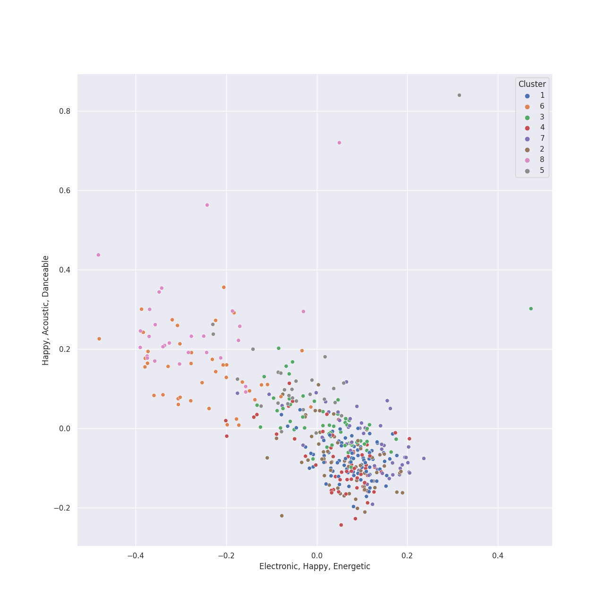

# Clusters in Pop

## Cluster #1

31 tracks

| Art | Track | Album | Artists | Label | Rank | 💚 | 🔗 |
|:---|:---|:---|:---|:---|---:|:---|:---|
|  | Dancing With Our Hands Tied | reputation | [Taylor Swift](../../../../artists/taylor_swift/overview.md) | [Big Machine Records, LLC](../../../../labels/big_machine_records) | 921 | 💚 | [🔗](https://open.spotify.com/track/7I7JbDv63ZJJsSi24DyJrz) |
|  | pov | Positions | [Ariana Grande](../../../../artists/ariana_grande/overview.md) | [Republic Records](../../../../labels/republic_records) | 921 | | [🔗](https://open.spotify.com/track/3UoULw70kMsiVXxW0L3A33) |
|  | Minefields | CITIZENS | Faouzia, John Legend | [Atlantic Records](../../../../labels/atlantic_records) | 921 | | [🔗](https://open.spotify.com/track/0vH52Icuf6LzOFrkHE8mZG) |
|  | Let Her Go | All The Little Lights | Passenger | [Nettwerk Music Group](../../../../labels/nettwerk_music_group) | 921 | 💚 | [🔗](https://open.spotify.com/track/1KxwZYyzWNyZSRyErj2ojT) |
|  | Eye of the Needle | 1000 Forms Of Fear (Deluxe Version) | [Sia](../../../../artists/sia/overview.md) | [Monkey Puzzle](../../../../labels/monkey_puzzle), [RCA Records Label](../../../../labels/rca_records_label) | 921 | 💚 | [🔗](https://open.spotify.com/track/6H8UxS43KArEIu2vGZI9Dj) |
|  | Never Be the Same | Camila | [Camila Cabello](../../../../artists/camila_cabello/overview.md) | [Epic](../../../../labels/epic), [Syco Music](../../../../labels/syco_music) | 921 | 💚 | [🔗](https://open.spotify.com/track/4eWQlBRaTjPPUlzacqEeoQ) |
|  | Because of You | Breakaway | Kelly Clarkson | [RCA Records Label](../../../../labels/rca_records_label) | 921 | 💚 | [🔗](https://open.spotify.com/track/3f3omU8n47Mqyab5nCaGyT) |
|  | Good For You | Revival (Deluxe) | Selena Gomez, A$AP Rocky | Selena Gomez PS | 921 | | [🔗](https://open.spotify.com/track/578Eooad7oUyn4stovZiPg) |
|  | SUGA's Interlude | SUGA's Interlude | Halsey, SUGA, [BTS](../../../../artists/bts/overview.md) | [Capitol Records](../../../../labels/capitol_records) | 624 | 💚 | [🔗](https://open.spotify.com/track/5a0nHa7F4S9hb0Zi0zLS8w) |
|  | Bleeding Love | Spirit | Leona Lewis | Syco Music UK | 921 | | [🔗](https://open.spotify.com/track/7wZUrN8oemZfsEd1CGkbXE) |
## Cluster #2

43 tracks

| Art | Track | Album | Artists | Label | Rank | 💚 | 🔗 |
|:---|:---|:---|:---|:---|---:|:---|:---|
|  | TiK ToK | Animal (Expanded Edition) | Kesha | [RCA Records Label](../../../../labels/rca_records_label) | 921 | 💚 | [🔗](https://open.spotify.com/track/0HPD5WQqrq7wPWR7P7Dw1i) |
|  | Sour Candy (with BLACKPINK) | Chromatica | [Lady Gaga](../../../../artists/lady_gaga/overview.md), [BLACKPINK](../../../../artists/blackpink/overview.md) | [Interscope](../../../../labels/interscope_records) | 700 | 💚 | [🔗](https://open.spotify.com/track/1IWNylpZ477gIVUDpJL66u) |
|  | Bang Bang | My Everything (Deluxe) | Jessie J, [Ariana Grande](../../../../artists/ariana_grande/overview.md), Nicki Minaj | [Universal Records](../../../../labels/universal_music_llc) | 921 | 💚 | [🔗](https://open.spotify.com/track/466s1BacUmiRdR3ISvNjyx) |
|  | Dance The Night - From Barbie The Album | Dance The Night (From Barbie The Album) | [Dua Lipa](../../../../artists/dua_lipa/overview.md) | [Atlantic Records](../../../../labels/atlantic_records) | 921 | 💚 | [🔗](https://open.spotify.com/track/1vYXt7VSjH9JIM5oRRo7vA) |
|  | Kiss and Make Up | Dua Lipa (Complete Edition) | [Dua Lipa](../../../../artists/dua_lipa/overview.md), [BLACKPINK](../../../../artists/blackpink/overview.md) | [Warner Records](../../../../labels/warner_records) | 921 | 💚 | [🔗](https://open.spotify.com/track/7jr3iPu4O4bTCVwLMbdU2i) |
|  | Grace Kelly | Life in Cartoon Motion | MIKA | Casablanca Records/Island UK | 921 | 💚 | [🔗](https://open.spotify.com/track/7dzUZec5MnWMyQnk5klnKR) |
|  | About Damn Time | About Damn Time | Lizzo | [Nice Life/Atlantic](../../../../labels/atlantic_records) | 921 | 💚 | [🔗](https://open.spotify.com/track/1PckUlxKqWQs3RlWXVBLw3) |
|  | Comme Des Garçons (Like The Boys) | SAWAYAMA | Rina Sawayama | Dirty Hit | 921 | 💚 | [🔗](https://open.spotify.com/track/43bYs8QkPdCdy5esfnmU1T) |
|  | Hips Don't Lie (feat. Wyclef Jean) | Oral Fixation, Vol. 2 (Expanded Edition) | Shakira, Wyclef Jean | [Epic](../../../../labels/epic) | 921 | 💚 | [🔗](https://open.spotify.com/track/3ZFTkvIE7kyPt6Nu3PEa7V) |
|  | Beggin' | Chosen | Måneskin | [RCA Records Label](../../../../labels/rca_records_label) | 603 | 💚 | [🔗](https://open.spotify.com/track/3Wrjm47oTz2sjIgck11l5e) |
## Cluster #3

80 tracks

| Art | Track | Album | Artists | Label | Rank | 💚 | 🔗 |
|:---|:---|:---|:---|:---|---:|:---|:---|
|  | Blank Space | 1989 | [Taylor Swift](../../../../artists/taylor_swift/overview.md) | [Big Machine Records, LLC](../../../../labels/big_machine_records) | 921 | 💚 | [🔗](https://open.spotify.com/track/1p80LdxRV74UKvL8gnD7ky) |
|  | London Boy | Lover | [Taylor Swift](../../../../artists/taylor_swift/overview.md) | [Taylor Swift](../../../../labels/taylor_swift) | 921 | 💚 | [🔗](https://open.spotify.com/track/1LLXZFeAHK9R4xUramtUKw) |
|  | We Found Love | Talk That Talk | [Rihanna](../../../../artists/rihanna/overview.md), Calvin Harris | [Def Jam Recordings](../../../../labels/def_jam_recordings) | 921 | 💚 | [🔗](https://open.spotify.com/track/0U10zFw4GlBacOy9VDGfGL) |
|  | One Kiss (with Dua Lipa) | One Kiss (with Dua Lipa) | Calvin Harris, [Dua Lipa](../../../../artists/dua_lipa/overview.md) | Sony Music UK | 921 | | [🔗](https://open.spotify.com/track/7ef4DlsgrMEH11cDZd32M6) |
|  | React | React | The Pussycat Dolls | Access Records | 921 | 💚 | [🔗](https://open.spotify.com/track/0qMAJBLMTshMx03CJkJl6O) |
|  | She Will Be Loved | Songs About Jane | [Maroon 5](../../../../artists/maroon_5/overview.md) | [Interscope Records*](../../../../labels/interscope_records) | 921 | 💚 | [🔗](https://open.spotify.com/track/7sapKrjDij2fpDVj0GxP66) |
|  | Adore You | Fine Line | Harry Styles | [Columbia](../../../../labels/columbia) | 921 | | [🔗](https://open.spotify.com/track/3jjujdWJ72nww5eGnfs2E7) |
|  | Ride | Blurryface | Twenty One Pilots | [Fueled By Ramen](../../../../labels/fueled_by_ramen) | 921 | 💚 | [🔗](https://open.spotify.com/track/2Z8WuEywRWYTKe1NybPQEW) |
|  | Bad At Love | hopeless fountain kingdom (Deluxe) | Halsey | Astralwerks (ASW) | 921 | | [🔗](https://open.spotify.com/track/7y9iMe8SOB6z3NoHE2OfXl) |
|  | Sweet but Psycho | Heaven & Hell | Ava Max | [Atlantic Records](../../../../labels/atlantic_records) | 921 | 💚 | [🔗](https://open.spotify.com/track/7DnAm9FOTWE3cUvso43HhI) |
## Cluster #4

53 tracks

| Art | Track | Album | Artists | Label | Rank | 💚 | 🔗 |
|:---|:---|:---|:---|:---|---:|:---|:---|
|  | ...Ready For It? | reputation | [Taylor Swift](../../../../artists/taylor_swift/overview.md) | [Big Machine Records, LLC](../../../../labels/big_machine_records) | 450 | 💚 | [🔗](https://open.spotify.com/track/2yLa0QULdQr0qAIvVwN6B5) |
|  | Begin Again | Red | [Taylor Swift](../../../../artists/taylor_swift/overview.md) | [Big Machine Records, LLC](../../../../labels/big_machine_records) | 870 | 💚 | [🔗](https://open.spotify.com/track/0L4YCNRfXAoTvdpWeH2RGj) |
|  | Back To December | Speak Now | [Taylor Swift](../../../../artists/taylor_swift/overview.md) | [Big Machine Records, LLC](../../../../labels/big_machine_records) | 921 | | [🔗](https://open.spotify.com/track/3DrjZArsPsoqbLzUZZV1Id) |
|  | UN DIA (ONE DAY) (Feat. Tainy) | UN DIA (ONE DAY) (Feat. Tainy) | J Balvin, [Dua Lipa](../../../../artists/dua_lipa/overview.md), Bad Bunny, Tainy | Universal Music Latino/ NEON16 | 921 | | [🔗](https://open.spotify.com/track/0EhpEsp4L0oRGM0vmeaN5e) |
|  | Into You | Dangerous Woman | [Ariana Grande](../../../../artists/ariana_grande/overview.md) | [Universal Records](../../../../labels/universal_music_llc) | 921 | 💚 | [🔗](https://open.spotify.com/track/63y6xWR4gXz7bnUGOk8iI6) |
|  | no tears left to cry | Sweetener | [Ariana Grande](../../../../artists/ariana_grande/overview.md) | [Republic Records](../../../../labels/republic_records) | 921 | 💚 | [🔗](https://open.spotify.com/track/2qT1uLXPVPzGgFOx4jtEuo) |
|  | breathin | Sweetener | [Ariana Grande](../../../../artists/ariana_grande/overview.md) | [Republic Records](../../../../labels/republic_records) | 921 | 💚 | [🔗](https://open.spotify.com/track/4OafepJy2teCjYJbvFE60J) |
|  | Salute | Salute (Expanded Edition) | Little Mix | [Syco Music](../../../../labels/syco_music) | 921 | 💚 | [🔗](https://open.spotify.com/track/1iupzLgX4O0Qosb4yDpYoz) |
|  | vampire | GUTS | [Olivia Rodrigo](../../../../artists/olivia_rodrigo/overview.md) | Olivia Rodrigo PS | 496 | 💚 | [🔗](https://open.spotify.com/track/1kuGVB7EU95pJObxwvfwKS) |
|  | Say (All I Need) | Dreaming Out Loud | OneRepublic | [Mosley / Interscope](../../../../labels/interscope_records) | 921 | 💚 | [🔗](https://open.spotify.com/track/6H4vq5gz0rlNjH0LBzu4An) |
## Cluster #5

45 tracks

| Art | Track | Album | Artists | Label | Rank | 💚 | 🔗 |
|:---|:---|:---|:---|:---|---:|:---|:---|
|  | Grenade | Doo-Wops & Hooligans | [Bruno Mars](../../../../artists/bruno_mars/overview.md) | [Atlantic Records](../../../../labels/atlantic_records) | 921 | 💚 | [🔗](https://open.spotify.com/track/2tJulUYLDKOg9XrtVkMgcJ) |
|  | Sincerely, Jane | Metropolis: The Chase Suite (Special Edition) | [Janelle Monáe](../../../../artists/janelle_monáe/overview.md) | [Bad Boy Records](../../../../labels/bad_boy) | 673 | 💚 | [🔗](https://open.spotify.com/track/06I6iDFVtZDGcRu9BgHraA) |
|  | I Did Something Bad | reputation | [Taylor Swift](../../../../artists/taylor_swift/overview.md) | [Big Machine Records, LLC](../../../../labels/big_machine_records) | 921 | 💚 | [🔗](https://open.spotify.com/track/4svZDCRz4cJoneBpjpx8DJ) |
|  | Chasing Pavements | 19 | [Adele](../../../../artists/adele/overview.md) | [XL Recordings](../../../../labels/xl_recordings) | 921 | | [🔗](https://open.spotify.com/track/71WAtDcWVYMoCsblD2uQXx) |
|  | break up with your girlfriend, i'm bored | thank u, next | [Ariana Grande](../../../../artists/ariana_grande/overview.md) | [Republic Records](../../../../labels/republic_records) | 921 | | [🔗](https://open.spotify.com/track/4kV4N9D1iKVxx1KLvtTpjS) |
|  | Royals | Pure Heroine | Lorde | Universal Music New Zealand Limited | 921 | 💚 | [🔗](https://open.spotify.com/track/2dLLR6qlu5UJ5gk0dKz0h3) |
|  | Truth Hurts | Cuz I Love You (Deluxe) | Lizzo | [Nice Life/Atlantic](../../../../labels/atlantic_records) | 921 | 💚 | [🔗](https://open.spotify.com/track/5qmq61DAAOUaW8AUo8xKhh) |
|  | Havana (feat. Young Thug) | Camila | [Camila Cabello](../../../../artists/camila_cabello/overview.md), Young Thug | [Epic](../../../../labels/epic), [Syco Music](../../../../labels/syco_music) | 921 | 💚 | [🔗](https://open.spotify.com/track/1rfofaqEpACxVEHIZBJe6W) |
|  | right here | bandaids | keshi | [Island Records](../../../../labels/island_records) | 921 | | [🔗](https://open.spotify.com/track/2Q3QRjA8MjzqpFaIkFludb) |
|  | There Goes My Baby | Raymond v Raymond (Expanded Edition) | USHER | LaFace Records | 921 | 💚 | [🔗](https://open.spotify.com/track/6IUiqtI8tE49sqGbmtrNd8) |
## Cluster #6

37 tracks

| Art | Track | Album | Artists | Label | Rank | 💚 | 🔗 |
|:---|:---|:---|:---|:---|---:|:---|:---|
|  | Heat Waves | Dreamland (+ Bonus Levels) | Glass Animals | [Polydor Records](../../../../labels/polydor_records) | 921 | | [🔗](https://open.spotify.com/track/02MWAaffLxlfxAUY7c5dvx) |
|  | The Other Side Of Paradise | How To Be A Human Being | Glass Animals | Wolf Tone | 921 | 💚 | [🔗](https://open.spotify.com/track/0rRjGruFonCGOt0S5zAJNQ) |
|  | I'm Yours | We Sing. We Dance. We Steal Things. | Jason Mraz | [Atlantic Records/ATG](../../../../labels/atlantic_records) | 921 | 💚 | [🔗](https://open.spotify.com/track/1EzrEOXmMH3G43AXT1y7pA) |
|  | Paint The Town Red | Paint The Town Red | [Doja Cat](../../../../artists/doja_cat/overview.md) | [Kemosabe Records/RCA Records](../../../../labels/rca_records_label) | 921 | 💚 | [🔗](https://open.spotify.com/track/2IGMVunIBsBLtEQyoI1Mu7) |
|  | You Don't Know Me | You Don't Know Me | Jax Jones, RAYE | [Polydor Records](../../../../labels/polydor_records) | 921 | | [🔗](https://open.spotify.com/track/1rFMYAZxBoAKSzXI54brMu) |
|  | River | Church Of Scars | Bishop Briggs | [Teleport Records / Island Records](../../../../labels/island_records) | 921 | 💚 | [🔗](https://open.spotify.com/track/3mRLHiSHYtC8Hk7bzZdUs1) |
|  | Without Me | Manic | Halsey | [Capitol Records](../../../../labels/capitol_records) | 921 | | [🔗](https://open.spotify.com/track/6FZDfxM3a3UCqtzo5pxSLZ) |
|  | Sweetest Pie | Sweetest Pie | Megan Thee Stallion, [Dua Lipa](../../../../artists/dua_lipa/overview.md) | 300 Entertainment | 921 | 💚 | [🔗](https://open.spotify.com/track/7mFj0LlWtEJaEigguaWqYh) |
|  | Baby Powder | Baby Powder | Jenevieve | JOYFACE Records, LLC | 921 | 💚 | [🔗](https://open.spotify.com/track/7t4ihBlcMdkyUeO6W1DfYH) |
|  | Low Key (feat. Tyga) | Low Key (feat. Tyga) | Ally Brooke, Tyga | [Latium/Atlantic](../../../../labels/atlantic_records) | 921 | 💚 | [🔗](https://open.spotify.com/track/7xhvCzIguRfyfQyGrnWuVn) |
## Cluster #7

70 tracks

| Art | Track | Album | Artists | Label | Rank | 💚 | 🔗 |
|:---|:---|:---|:---|:---|---:|:---|:---|
|  | I Can See You (Taylor’s Version) (From The Vault) | Speak Now (Taylor's Version) | [Taylor Swift](../../../../artists/taylor_swift/overview.md) | [Taylor Swift](../../../../labels/taylor_swift) | 921 | 💚 | [🔗](https://open.spotify.com/track/5kHMfzgLZP95O9NBy0ku4v) |
|  | S&M | Loud | [Rihanna](../../../../artists/rihanna/overview.md) | [Def Jam Recordings](../../../../labels/def_jam_recordings) | 921 | 💚 | [🔗](https://open.spotify.com/track/08Bfk5Y2S5fCxgxk371Eel) |
|  | Lights - Single Version | Lights | Ellie Goulding | [Polydor Records](../../../../labels/polydor_records) | 921 | 💚 | [🔗](https://open.spotify.com/track/5qftsSFD6Qgndcx13SSqQj) |
|  | Get Lucky (feat. Pharrell Williams and Nile Rodgers) | Random Access Memories | [Daft Punk](../../../../artists/daft_punk/overview.md), Pharrell Williams, Nile Rodgers | [Columbia](../../../../labels/columbia) | 433 | 💚 | [🔗](https://open.spotify.com/track/69kOkLUCkxIZYexIgSG8rq) |
|  | yes, and? | eternal sunshine | [Ariana Grande](../../../../artists/ariana_grande/overview.md) | [Republic Records](../../../../labels/republic_records) | 921 | 💚 | [🔗](https://open.spotify.com/track/5D34wRmbFS29AjtTOP2QJe) |
|  | Greedy | Dangerous Woman | [Ariana Grande](../../../../artists/ariana_grande/overview.md) | [Universal Records](../../../../labels/universal_music_llc) | 921 | | [🔗](https://open.spotify.com/track/1FFUXkoWIc9of8yOscGiaC) |
|  | Woman | Planet Her | [Doja Cat](../../../../artists/doja_cat/overview.md) | [Kemosabe Records/RCA Records](../../../../labels/rca_records_label) | 921 | | [🔗](https://open.spotify.com/track/6Uj1ctrBOjOas8xZXGqKk4) |
|  | Haven't Met You Yet | Crazy Love | [Michael Bublé](../../../../artists/michael_bublé/overview.md) | [143](../../../../labels/143), [Reprise](../../../../labels/reprise) | 921 | 💚 | [🔗](https://open.spotify.com/track/4fIWvT19w9PR0VVBuPYpWA) |
|  | Lollipop | Life in Cartoon Motion | MIKA | Casablanca Records/Island UK | 921 | 💚 | [🔗](https://open.spotify.com/track/1JAnC4VkVIbO7C6Vislnue) |
|  | Sugar | V | [Maroon 5](../../../../artists/maroon_5/overview.md) | [Interscope Records*](../../../../labels/interscope_records) | 921 | 💚 | [🔗](https://open.spotify.com/track/2iuZJX9X9P0GKaE93xcPjk) |
## Cluster #8

27 tracks

| Art | Track | Album | Artists | Label | Rank | 💚 | 🔗 |
|:---|:---|:---|:---|:---|---:|:---|:---|
|  | mad woman | folklore | [Taylor Swift](../../../../artists/taylor_swift/overview.md) | [Taylor Swift](../../../../labels/taylor_swift) | 921 | | [🔗](https://open.spotify.com/track/2QDyYdZyhlP2fp79KZX8Bi) |
|  | august | folklore | [Taylor Swift](../../../../artists/taylor_swift/overview.md) | [Taylor Swift](../../../../labels/taylor_swift) | 921 | 💚 | [🔗](https://open.spotify.com/track/3hUxzQpSfdDqwM3ZTFQY0K) |
|  | cardigan | folklore | [Taylor Swift](../../../../artists/taylor_swift/overview.md) | [Taylor Swift](../../../../labels/taylor_swift) | 921 | 💚 | [🔗](https://open.spotify.com/track/4R2kfaDFhslZEMJqAFNpdd) |
|  | true story | eternal sunshine | [Ariana Grande](../../../../artists/ariana_grande/overview.md) | [Republic Records](../../../../labels/republic_records) | 921 | | [🔗](https://open.spotify.com/track/14kyXBpg91RVq8bNRDS1q2) |
|  | TEXAS HOLD 'EM | COWBOY CARTER | [Beyoncé](../../../../artists/beyoncé/overview.md) | [Columbia](../../../../labels/columbia), [Parkwood Entertainment](../../../../labels/parkwood_entertainment) | 921 | 💚 | [🔗](https://open.spotify.com/track/7wLShogStyDeZvL0a6daN5) |
|  | Buttons | PCD | The Pussycat Dolls | Pussycat Dolls | 843 | 💚 | [🔗](https://open.spotify.com/track/3BxWKCI06eQ5Od8TY2JBeA) |
|  | Take Me to Church | Hozier (Expanded Edition) | Hozier | [Columbia](../../../../labels/columbia) | 921 | 💚 | [🔗](https://open.spotify.com/track/1CS7Sd1u5tWkstBhpssyjP) |
|  | Happy Ending | Life in Cartoon Motion | MIKA | Casablanca Records/Island UK | 921 | 💚 | [🔗](https://open.spotify.com/track/1wl3u4FrzcuBv2LQ97Z6TQ) |
|  | Stone Cold | Confident | Demi Lovato | [Hollywood Records](../../../../labels/hollywood_records) | 921 | 💚 | [🔗](https://open.spotify.com/track/3by8IfnW9dZ2t4pZw1WVxz) |
|  | How Can I | How Can I | H 3 F | H 3 F | 921 | 💚 | [🔗](https://open.spotify.com/track/3Ka0IJwEvxI3ssqbF48SWZ) |
## Cluster #9

52 tracks

| Art | Track | Album | Artists | Label | Rank | 💚 | 🔗 |
|:---|:---|:---|:---|:---|---:|:---|:---|
|  | Take It All | 21 | [Adele](../../../../artists/adele/overview.md) | [XL Recordings](../../../../labels/xl_recordings) | 268 | 💚 | [🔗](https://open.spotify.com/track/08YJEcxGtYXwCGqXMZDiyQ) |
|  | Someone Like You | 21 | [Adele](../../../../artists/adele/overview.md) | [XL Recordings](../../../../labels/xl_recordings) | 921 | 💚 | [🔗](https://open.spotify.com/track/1zwMYTA5nlNjZxYrvBB2pV) |
|  | The Scientist | A Rush of Blood to the Head | [Coldplay](../../../../artists/coldplay/overview.md) | Parlophone Records Limited | 921 | 💚 | [🔗](https://open.spotify.com/track/75JFxkI2RXiU7L9VXzMkle) |
|  | Malibu Nights | Malibu Nights | LANY | [Polydor Records](../../../../labels/polydor_records) | 921 | 💚 | [🔗](https://open.spotify.com/track/0Eqg0CQ7bK3RQIMPw1A7pl) |
|  | ocean eyes | dont smile at me | [Billie Eilish](../../../../artists/billie_eilish/overview.md) | [Darkroom](../../../../labels/darkroom) | 921 | 💚 | [🔗](https://open.spotify.com/track/7hDVYcQq6MxkdJGweuCtl9) |
|  | Work Song | Hozier (Expanded Edition) | Hozier | [Columbia](../../../../labels/columbia) | 921 | 💚 | [🔗](https://open.spotify.com/track/5TgEJ62DOzBpGxZ7WRsrqb) |
|  | Who Hurt You? | Who Hurt You? | Daniel Caesar | Golden Child Recordings | 921 | | [🔗](https://open.spotify.com/track/23c9gmiiv7RCu7twft0Mym) |
|  | drivers license | drivers license | [Olivia Rodrigo](../../../../artists/olivia_rodrigo/overview.md) | Olivia Rodrigo PS | 921 | 💚 | [🔗](https://open.spotify.com/track/7lPN2DXiMsVn7XUKtOW1CS) |
|  | All of Me | Love In The Future (Expanded Edition) | John Legend | [G.O.O.D. Music/Columbia](../../../../labels/columbia) | 921 | 💚 | [🔗](https://open.spotify.com/track/3U4isOIWM3VvDubwSI3y7a) |
|  | If I Ain't Got You | The Diary Of Alicia Keys | Alicia Keys | J Records | 921 | 💚 | [🔗](https://open.spotify.com/track/3XVBdLihbNbxUwZosxcGuJ) |