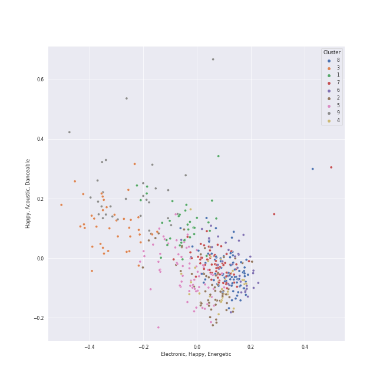

# Clusters in Pop

## Cluster #1

40 tracks

| Art | Track | Album | Artists | Label | 💚 | 🔗 |
|:---|:---|:---|:---|:---|:---|:---|
|  | Smokin Out The Window | An Evening With Silk Sonic | [Bruno Mars](../../../../artists/bruno_mars/overview.md), Anderson .Paak, Silk Sonic | [Aftermath Entertainment/Atlantic](../../../../labels/atlantic_records) | 💚 | [🔗](https://open.spotify.com/track/3xVZYkcuWalGudeKl861wb) |
|  | Kiss and Make Up | Dua Lipa (Complete Edition) | [Dua Lipa](../../../../artists/dua_lipa/overview.md), [BLACKPINK](../../../../artists/blackpink/overview.md) | [Warner Records](../../../../labels/warner_records) | 💚 | [🔗](https://open.spotify.com/track/7jr3iPu4O4bTCVwLMbdU2i) |
|  | Bang Bang | My Everything (Deluxe) | Jessie J, [Ariana Grande](../../../../artists/ariana_grande/overview.md), Nicki Minaj | [Universal Records](../../../../labels/universal_music_llc) | 💚 | [🔗](https://open.spotify.com/track/466s1BacUmiRdR3ISvNjyx) |
|  | TiK ToK | Animal (Expanded Edition) | Kesha | [RCA Records Label](../../../../labels/rca_records_label) | 💚 | [🔗](https://open.spotify.com/track/0HPD5WQqrq7wPWR7P7Dw1i) |
|  | About Damn Time | About Damn Time | Lizzo | [Nice Life/Atlantic](../../../../labels/atlantic_records) | 💚 | [🔗](https://open.spotify.com/track/1PckUlxKqWQs3RlWXVBLw3) |
|  | Grace Kelly | Life in Cartoon Motion | MIKA | Casablanca Records/Island UK | 💚 | [🔗](https://open.spotify.com/track/7dzUZec5MnWMyQnk5klnKR) |
|  | Home | Carencro | Marc Broussard | [Island Records](../../../../labels/island_records) | 💚 | [🔗](https://open.spotify.com/track/1XhzO8cuPaqsqUKw92Wbwc) |
|  | Beggin' | Chosen | Måneskin | [RCA Records Label](../../../../labels/rca_records_label) | 💚 | [🔗](https://open.spotify.com/track/3Wrjm47oTz2sjIgck11l5e) |
|  | Watch n' Learn | Talk That Talk | [Rihanna](../../../../artists/rihanna/overview.md) | [Def Jam Recordings](../../../../labels/def_jam_recordings) | 💚 | [🔗](https://open.spotify.com/track/1ROCX1nquOZ5i05YfGysu0) |
|  | Hips Don't Lie (feat. Wyclef Jean) | Oral Fixation, Vol. 2 (Expanded Edition) | Shakira, Wyclef Jean | [Epic](../../../../labels/epic) | 💚 | [🔗](https://open.spotify.com/track/3ZFTkvIE7kyPt6Nu3PEa7V) |
## Cluster #2

77 tracks

| Art | Track | Album | Artists | Label | 💚 | 🔗 |
|:---|:---|:---|:---|:---|:---|:---|
|  | Greedy | Dangerous Woman | [Ariana Grande](../../../../artists/ariana_grande/overview.md) | [Universal Records](../../../../labels/universal_music_llc) | | [🔗](https://open.spotify.com/track/1FFUXkoWIc9of8yOscGiaC) |
|  | Love's Train | Love's Train | [Bruno Mars](../../../../artists/bruno_mars/overview.md), Anderson .Paak, Silk Sonic | [Aftermath Entertainment/Atlantic](../../../../labels/atlantic_records) | | [🔗](https://open.spotify.com/track/60gTdTwaNtGAzIxKfeGVfJ) |
|  | Good Ones | CRASH | Charli XCX | [Atlantic Records](../../../../labels/atlantic_records) | 💚 | [🔗](https://open.spotify.com/track/2grSOc6HNTXQQXNoRKt9UM) |
|  | Poker Face | The Fame | [Lady Gaga](../../../../artists/lady_gaga/overview.md) | [Interscope](../../../../labels/interscope_records) | 💚 | [🔗](https://open.spotify.com/track/5R8dQOPq8haW94K7mgERlO) |
|  | Lollipop | Life in Cartoon Motion | MIKA | Casablanca Records/Island UK | 💚 | [🔗](https://open.spotify.com/track/1JAnC4VkVIbO7C6Vislnue) |
|  | Sugar | V | [Maroon 5](../../../../artists/maroon_5/overview.md) | [Interscope Records*](../../../../labels/interscope_records) | 💚 | [🔗](https://open.spotify.com/track/2iuZJX9X9P0GKaE93xcPjk) |
|  | Haven't Met You Yet | Crazy Love | [Michael Bublé](../../../../artists/michael_bubl_/overview.md) | [143](../../../../labels/143), [Reprise](../../../../labels/reprise) | 💚 | [🔗](https://open.spotify.com/track/4fIWvT19w9PR0VVBuPYpWA) |
|  | Waka Waka (This Time for Africa) [The Official 2010 FIFA World Cup (TM) Song] (feat. Freshlyground) | Waka Waka (This Time for Africa) [The Official 2010 FIFA World Cup (TM) Song] (feat. Freshlyground) | Shakira, Freshlyground | [Epic](../../../../labels/epic) | 💚 | [🔗](https://open.spotify.com/track/2Cd9iWfcOpGDHLz6tVA3G4) |
|  | We Are Never Ever Getting Back Together | Red | [Taylor Swift](../../../../artists/taylor_swift/overview.md) | [Big Machine Records, LLC](../../../../labels/big_machine_records) | | [🔗](https://open.spotify.com/track/7AEAGTc8cReDqcbPoY9gwo) |
|  | I Can See You (Taylor’s Version) (From The Vault) | Speak Now (Taylor's Version) | [Taylor Swift](../../../../artists/taylor_swift/overview.md) | [Taylor Swift](../../../../labels/taylor_swift) | 💚 | [🔗](https://open.spotify.com/track/5kHMfzgLZP95O9NBy0ku4v) |
## Cluster #3

40 tracks

| Art | Track | Album | Artists | Label | 💚 | 🔗 |
|:---|:---|:---|:---|:---|:---|:---|
|  | Someone Like You | 21 | Adele | [XL Recordings](../../../../labels/xl_recordings) | | [🔗](https://open.spotify.com/track/1zwMYTA5nlNjZxYrvBB2pV) |
|  | If I Ain't Got You | The Diary Of Alicia Keys | Alicia Keys | J Records | 💚 | [🔗](https://open.spotify.com/track/3XVBdLihbNbxUwZosxcGuJ) |
|  | ocean eyes | dont smile at me | [Billie Eilish](../../../../artists/billie_eilish/overview.md) | [Darkroom](../../../../labels/darkroom) | 💚 | [🔗](https://open.spotify.com/track/7hDVYcQq6MxkdJGweuCtl9) |
|  | TV | Guitar Songs | [Billie Eilish](../../../../artists/billie_eilish/overview.md) | [Darkroom](../../../../labels/darkroom), [Interscope Records](../../../../labels/interscope_records) | | [🔗](https://open.spotify.com/track/3GYlZ7tbxLOxe6ewMNVTkw) |
|  | The Scientist | A Rush of Blood to the Head | [Coldplay](../../../../artists/coldplay/overview.md) | Parlophone Records Limited | 💚 | [🔗](https://open.spotify.com/track/75JFxkI2RXiU7L9VXzMkle) |
|  | Who Hurt You? | Who Hurt You? | Daniel Caesar | Golden Child Recordings | | [🔗](https://open.spotify.com/track/23c9gmiiv7RCu7twft0Mym) |
|  | I miss you, I’m sorry | minor | Gracie Abrams | Gracie Abrams, under exclusive license to Interscope Records | 💚 | [🔗](https://open.spotify.com/track/4nyF5lmSziBAt7ESAUjpbx) |
|  | Work Song | Hozier (Expanded Edition) | Hozier | [Columbia](../../../../labels/columbia) | 💚 | [🔗](https://open.spotify.com/track/5TgEJ62DOzBpGxZ7WRsrqb) |
|  | Put A Little Love On Me | Put A Little Love On Me | Niall Horan | [Capitol Records](../../../../labels/capitol_records) | 💚 | [🔗](https://open.spotify.com/track/1hCTxutVVYvggAQcUUUZAT) |
|  | drivers license | drivers license | Olivia Rodrigo | Olivia Rodrigo PS | 💚 | [🔗](https://open.spotify.com/track/7lPN2DXiMsVn7XUKtOW1CS) |
## Cluster #4

65 tracks

| Art | Track | Album | Artists | Label | 💚 | 🔗 |
|:---|:---|:---|:---|:---|:---|:---|
|  | Problem | My Everything (Deluxe) | [Ariana Grande](../../../../artists/ariana_grande/overview.md), Iggy Azalea | [Universal Records](../../../../labels/universal_music_llc) | 💚 | [🔗](https://open.spotify.com/track/7vS3Y0IKjde7Xg85LWIEdP) |
|  | Meant to Be (feat. Florida Georgia Line) | Expectations | Bebe Rexha, Florida Georgia Line | [Warner Records](../../../../labels/warner_records) | | [🔗](https://open.spotify.com/track/4e4fqjx0Izh4svvTef1z7e) |
|  | Adore You | Fine Line | Harry Styles | [Columbia](../../../../labels/columbia) | | [🔗](https://open.spotify.com/track/3jjujdWJ72nww5eGnfs2E7) |
|  | Teenage Dream | Teenage Dream | [Katy Perry](../../../../artists/katy_perry/overview.md) | [Capitol Records](../../../../labels/capitol_records) | 💚 | [🔗](https://open.spotify.com/track/6AOdKVvWB8Ulb3lGCnyPBY) |
|  | She Will Be Loved | Songs About Jane | [Maroon 5](../../../../artists/maroon_5/overview.md) | [Interscope Records*](../../../../labels/interscope_records) | 💚 | [🔗](https://open.spotify.com/track/7sapKrjDij2fpDVj0GxP66) |
|  | In My Blood | Shawn Mendes | Shawn Mendes | [Island Records](../../../../labels/island_records) | | [🔗](https://open.spotify.com/track/2QZ7WLBE8h2y1Y5Fb8RYbH) |
|  | Forever & Always | Fearless | [Taylor Swift](../../../../artists/taylor_swift/overview.md) | [Big Machine Records, LLC](../../../../labels/big_machine_records) | | [🔗](https://open.spotify.com/track/47HtKpfzpAt8rQjjXWotFj) |
|  | London Boy | Lover | [Taylor Swift](../../../../artists/taylor_swift/overview.md) | [Taylor Swift](../../../../labels/taylor_swift) | 💚 | [🔗](https://open.spotify.com/track/1LLXZFeAHK9R4xUramtUKw) |
|  | YOUTH | Blue Neighbourhood (Deluxe) | Troye Sivan | EMI Recorded Music Australia Pty Ltd | 💚 | [🔗](https://open.spotify.com/track/1cOyWWUr3oXJIxY0AjJEx9) |
|  | Ride | Blurryface | Twenty One Pilots | Fueled By Ramen | 💚 | [🔗](https://open.spotify.com/track/2Z8WuEywRWYTKe1NybPQEW) |
## Cluster #5

58 tracks

| Art | Track | Album | Artists | Label | 💚 | 🔗 |
|:---|:---|:---|:---|:---|:---|:---|
|  | River | Church Of Scars | Bishop Briggs | [Teleport Records / Island Records](../../../../labels/island_records) | 💚 | [🔗](https://open.spotify.com/track/3mRLHiSHYtC8Hk7bzZdUs1) |
|  | Rather Be (feat. Jess Glynne) | New Eyes | [Clean Bandit](../../../../artists/clean_bandit/overview.md), Jess Glynne | [Big Beat Records/Atlantic](../../../../labels/atlantic_records) | 💚 | [🔗](https://open.spotify.com/track/0am001WwFBVGDGLwRh3ixi) |
|  | Slow Grenade | Slow Grenade | Ellie Goulding, Lauv | [Polydor Records](../../../../labels/polydor_records) | 💚 | [🔗](https://open.spotify.com/track/5z8uLrYMcUVvzTV28twt44) |
|  | Without Me | Manic | Halsey | [Capitol Records](../../../../labels/capitol_records) | | [🔗](https://open.spotify.com/track/6FZDfxM3a3UCqtzo5pxSLZ) |
|  | Coño | Coño | [Jason Derulo](../../../../artists/jason_derulo/overview.md), Puri, Jhorrmountain | Spinnin' Records | 💚 | [🔗](https://open.spotify.com/track/5DV4ZSCqbFv74ui3ZhimXo) |
|  | Just Give Me a Reason (feat. Nate Ruess) | The Truth About Love | P!nk, Nate Ruess | [RCA Records Label](../../../../labels/rca_records_label) | 💚 | [🔗](https://open.spotify.com/track/4VC5nFbYO4avKksJ9jN4pY) |
|  | Pon de Replay | Music Of The Sun | [Rihanna](../../../../artists/rihanna/overview.md) | [Def Jam Recordings](../../../../labels/def_jam_recordings) | | [🔗](https://open.spotify.com/track/4TsmezEQVSZNNPv5RJ65Ov) |
|  | Take A Bow | Good Girl Gone Bad: Reloaded | [Rihanna](../../../../artists/rihanna/overview.md) | [Def Jam Recordings](../../../../labels/def_jam_recordings) | 💚 | [🔗](https://open.spotify.com/track/3goSVuTt3fDYDP6kRnFwuL) |
|  | Ashes | Ashes | Stellar | Arista Records | 💚 | [🔗](https://open.spotify.com/track/3Pj6u2KTgepyyidp5xfbHp) |
|  | Gorgeous | reputation | [Taylor Swift](../../../../artists/taylor_swift/overview.md) | [Big Machine Records, LLC](../../../../labels/big_machine_records) | 💚 | [🔗](https://open.spotify.com/track/1ZY1PqizIl78geGM4xWlEA) |
## Cluster #6

20 tracks

| Art | Track | Album | Artists | Label | 💚 | 🔗 |
|:---|:---|:---|:---|:---|:---|:---|
|  | positions | Positions | [Ariana Grande](../../../../artists/ariana_grande/overview.md) | [Republic Records](../../../../labels/republic_records) | 💚 | [🔗](https://open.spotify.com/track/35mvY5S1H3J2QZyna3TFe0) |
|  | Take Me to Church | Hozier (Expanded Edition) | Hozier | [Columbia](../../../../labels/columbia) | 💚 | [🔗](https://open.spotify.com/track/1CS7Sd1u5tWkstBhpssyjP) |
|  | Trumpets | Talk Dirty | [Jason Derulo](../../../../artists/jason_derulo/overview.md) | [Beluga Heights/Warner Records](../../../../labels/warner_records) | 💚 | [🔗](https://open.spotify.com/track/5KONnBIQ9LqCxyeSPin26k) |
|  | good 4 u | good 4 u | Olivia Rodrigo | Olivia Rodrigo PS | 💚 | [🔗](https://open.spotify.com/track/6PERP62TejQjgHu81OHxgM) |
|  | Hustle | Hurts 2B Human | P!nk | [RCA Records Label](../../../../labels/rca_records_label) | 💚 | [🔗](https://open.spotify.com/track/6BVmygBQhe4pTZQgKkzstD) |
|  | Kids Again | Love Goes | Sam Smith | [Capitol](../../../../labels/capitol_records) | | [🔗](https://open.spotify.com/track/5LL9lSNn26GBoC5StQ3itk) |
|  | cardigan | folklore | [Taylor Swift](../../../../artists/taylor_swift/overview.md) | [Taylor Swift](../../../../labels/taylor_swift) | 💚 | [🔗](https://open.spotify.com/track/4R2kfaDFhslZEMJqAFNpdd) |
|  | mad woman | folklore | [Taylor Swift](../../../../artists/taylor_swift/overview.md) | [Taylor Swift](../../../../labels/taylor_swift) | | [🔗](https://open.spotify.com/track/2QDyYdZyhlP2fp79KZX8Bi) |
|  | no body, no crime (feat. HAIM) | evermore | [Taylor Swift](../../../../artists/taylor_swift/overview.md), HAIM | [Taylor Swift](../../../../labels/taylor_swift) | | [🔗](https://open.spotify.com/track/3RaT22zZsxVYxxKR7TAaYF) |
|  | I Feel It Coming | Starboy | The Weeknd, [Daft Punk](../../../../artists/daft_punk/overview.md) | Universal Republic Records | | [🔗](https://open.spotify.com/track/3dhjNA0jGA8vHBQ1VdD6vV) |
## Cluster #7

21 tracks

| Art | Track | Album | Artists | Label | 💚 | 🔗 |
|:---|:---|:---|:---|:---|:---|:---|
|  | My Everything | My Everything (Deluxe) | [Ariana Grande](../../../../artists/ariana_grande/overview.md) | [Universal Records](../../../../labels/universal_music_llc) | 💚 | [🔗](https://open.spotify.com/track/4eumFsTnduH3zRfaASoAPs) |
|  | When I Was Your Man | Unorthodox Jukebox | [Bruno Mars](../../../../artists/bruno_mars/overview.md) | [Atlantic Records](../../../../labels/atlantic_records) | 💚 | [🔗](https://open.spotify.com/track/0nJW01T7XtvILxQgC5J7Wh) |
|  | Consequences | Camila | [Camila Cabello](../../../../artists/camila_cabello/overview.md) | [Epic](../../../../labels/epic), [Syco Music](../../../../labels/syco_music) | 💚 | [🔗](https://open.spotify.com/track/7sTtHHrD0zDpmzQzH3zegz) |
|  | Best Part (feat. H.E.R.) | Freudian | Daniel Caesar, H.E.R. | Golden Child Recordings | 💚 | [🔗](https://open.spotify.com/track/1RMJOxR6GRPsBHL8qeC2ux) |
|  | Your Song | Lights | Ellie Goulding | [Polydor Records](../../../../labels/polydor_records) | | [🔗](https://open.spotify.com/track/562NFiDgGSylJpitA7dUhE) |
|  | Off My Face | Justice | [Justin Bieber](../../../../artists/justin_bieber/overview.md) | RBMG/Def Jam | 💚 | [🔗](https://open.spotify.com/track/3T03rPwlL8NVk1yIaxeD8U) |
|  | Julia | ~how i'm feeling~ | Lauv | Lauv | 💚 | [🔗](https://open.spotify.com/track/12YVZ3Tg4LyAJNsMJVtwQq) |
|  | illicit affairs | folklore | [Taylor Swift](../../../../artists/taylor_swift/overview.md) | [Taylor Swift](../../../../labels/taylor_swift) | | [🔗](https://open.spotify.com/track/2NmsngXHeC1GQ9wWrzhOMf) |
|  | invisible string | folklore | [Taylor Swift](../../../../artists/taylor_swift/overview.md) | [Taylor Swift](../../../../labels/taylor_swift) | 💚 | [🔗](https://open.spotify.com/track/6VsvKPJ4xjVNKpI8VVZ3SV) |
|  | peace | folklore | [Taylor Swift](../../../../artists/taylor_swift/overview.md) | [Taylor Swift](../../../../labels/taylor_swift) | | [🔗](https://open.spotify.com/track/7MbT4I8qGntX4fMdqMQgke) |
## Cluster #8

67 tracks

| Art | Track | Album | Artists | Label | 💚 | 🔗 |
|:---|:---|:---|:---|:---|:---|:---|
|  | Break Free | My Everything (Deluxe) | [Ariana Grande](../../../../artists/ariana_grande/overview.md), Zedd | [Universal Records](../../../../labels/universal_music_llc) | | [🔗](https://open.spotify.com/track/12KUFSHFgT0XCoiSlvdQi4) |
|  | Never Be the Same | Camila | [Camila Cabello](../../../../artists/camila_cabello/overview.md) | [Epic](../../../../labels/epic), [Syco Music](../../../../labels/syco_music) | 💚 | [🔗](https://open.spotify.com/track/4eWQlBRaTjPPUlzacqEeoQ) |
|  | Love Me Like You Do | Fifty Shades Freed (Original Motion Picture Soundtrack) | Ellie Goulding | FSF, [Republic Records](../../../../labels/republic_records), [Universal Music LLC](../../../../labels/universal_music_llc) | 💚 | [🔗](https://open.spotify.com/track/0Cy7wt6IlRfBPHXXjmZbcP) |
|  | Who You Are | Who You Are (Platinum Edition) | Jessie J | [Lava Music/Republic Records](../../../../labels/republic_records) | 💚 | [🔗](https://open.spotify.com/track/65lIGCfW59BxcEJnnIOCq3) |
|  | Slide Away | Slide Away | Miley Cyrus | [RCA Records Label](../../../../labels/rca_records_label) | | [🔗](https://open.spotify.com/track/44ADyYoY5liaRa3EOAl4uf) |
|  | vampire | vampire | Olivia Rodrigo | Olivia Rodrigo PS | 💚 | [🔗](https://open.spotify.com/track/3k79jB4aGmMDUQzEwa46Rz) |
|  | Good For You | Revival (Deluxe) | Selena Gomez, A$AP Rocky | Selena Gomez PS | | [🔗](https://open.spotify.com/track/578Eooad7oUyn4stovZiPg) |
|  | Love Story | Fearless | [Taylor Swift](../../../../artists/taylor_swift/overview.md) | [Big Machine Records, LLC](../../../../labels/big_machine_records) | | [🔗](https://open.spotify.com/track/1vrd6UOGamcKNGnSHJQlSt) |
|  | Begin Again | Red | [Taylor Swift](../../../../artists/taylor_swift/overview.md) | [Big Machine Records, LLC](../../../../labels/big_machine_records) | 💚 | [🔗](https://open.spotify.com/track/0L4YCNRfXAoTvdpWeH2RGj) |
|  | Dancing With Our Hands Tied | reputation | [Taylor Swift](../../../../artists/taylor_swift/overview.md) | [Big Machine Records, LLC](../../../../labels/big_machine_records) | 💚 | [🔗](https://open.spotify.com/track/7I7JbDv63ZJJsSi24DyJrz) |