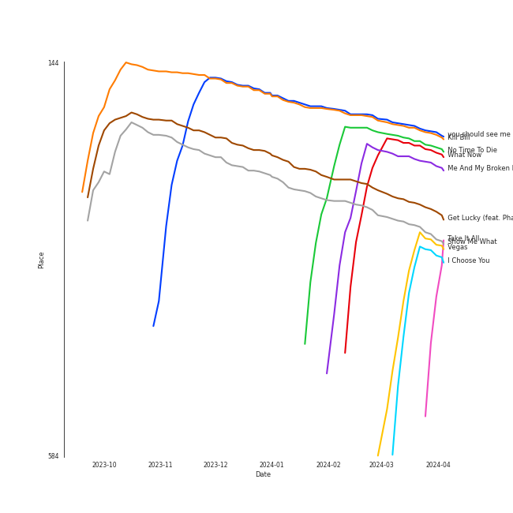
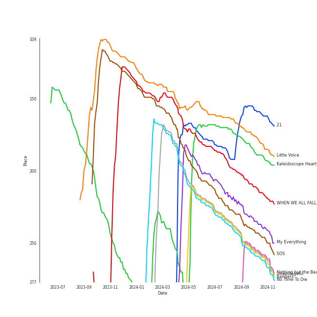

# Pop

[441 tracks (321 liked) 🔗](https://open.spotify.com/playlist/1WZ2RqQv2SPX5uzmjWhgSh)

[See Track Features](audio_features.md)

[See Clusters](clusters/overview.md)

## Top Artists

| Art | Rank | Tracks | 💚 | Artist | 🔗 |
|:---|---:|---:|---:|:---|:---|
|  | 19 | 55 | 35 | [Taylor Swift](../../artists/taylor_swift/overview.md) | [🔗](https://open.spotify.com/artist/06HL4z0CvFAxyc27GXpf02) |
|  | 34 | 33 | 22 | [Ariana Grande](../../artists/ariana_grande/overview.md) | [🔗](https://open.spotify.com/artist/66CXWjxzNUsdJxJ2JdwvnR) |
|  | 41 | 19 | 16 | [Billie Eilish](../../artists/billie_eilish/overview.md) | [🔗](https://open.spotify.com/artist/6qqNVTkY8uBg9cP3Jd7DAH) |
|  | 92 | 16 | 12 | [Bruno Mars](../../artists/bruno_mars/overview.md) | [🔗](https://open.spotify.com/artist/0du5cEVh5yTK9QJze8zA0C) |
|  | 124 | 15 | 12 | [Rihanna](../../artists/rihanna/overview.md) | [🔗](https://open.spotify.com/artist/5pKCCKE2ajJHZ9KAiaK11H) |
|  | 123 | 14 | 9 | [Lady Gaga](../../artists/lady_gaga/overview.md) | [🔗](https://open.spotify.com/artist/1HY2Jd0NmPuamShAr6KMms) |
|  | 199 | 11 | 9 | [Doja Cat](../../artists/doja_cat/overview.md) | [🔗](https://open.spotify.com/artist/5cj0lLjcoR7YOSnhnX0Po5) |
|  | 84 | 13 | 8 | [Dua Lipa](../../artists/dua_lipa/overview.md) | [🔗](https://open.spotify.com/artist/6M2wZ9GZgrQXHCFfjv46we) |
|  | 163 | 8 | 8 | [Sia](../../artists/sia/overview.md) | [🔗](https://open.spotify.com/artist/5WUlDfRSoLAfcVSX1WnrxN) |
|  | 250 | 8 | 7 | [Camila Cabello](../../artists/camila_cabello/overview.md) | [🔗](https://open.spotify.com/artist/4nDoRrQiYLoBzwC5BhVJzF) |

See top 100 artists

| Art | Rank | Tracks | 💚 | Artist | 🔗 |
|:---|---:|---:|---:|:---|:---|
|  | 139 | 8 | 5 | [Adele](../../artists/adele/overview.md) | [🔗](https://open.spotify.com/artist/4dpARuHxo51G3z768sgnrY) |
|  | 138 | 8 | 5 | [Britney Spears](../../artists/britney_spears/overview.md) | [🔗](https://open.spotify.com/artist/26dSoYclwsYLMAKD3tpOr4) |
|  | 108 | 8 | 5 | [Maroon 5](../../artists/maroon_5/overview.md) | [🔗](https://open.spotify.com/artist/04gDigrS5kc9YWfZHwBETP) |
|  | 193 | 6 | 5 | [Justin Bieber](../../artists/justin_bieber/overview.md) | [🔗](https://open.spotify.com/artist/1uNFoZAHBGtllmzznpCI3s) |
|  | 273 | 6 | 5 | [Jason Derulo](../../artists/jason_derulo/overview.md) | [🔗](https://open.spotify.com/artist/07YZf4WDAMNwqr4jfgOZ8y) |
|  | 106 | 5 | 5 | [Janelle Monáe](../../artists/janelle_monáe/overview.md) | [🔗](https://open.spotify.com/artist/6ueGR6SWhUJfvEhqkvMsVs) |
|  | 414 | 5 | 5 | [Clean Bandit](../../artists/clean_bandit/overview.md) | [🔗](https://open.spotify.com/artist/6MDME20pz9RveH9rEXvrOM) |
|  | 237 | 5 | 5 | [Coldplay](../../artists/coldplay/overview.md) | [🔗](https://open.spotify.com/artist/4gzpq5DPGxSnKTe4SA8HAU) |
|  | 280 | 5 | 5 | [Olivia Rodrigo](../../artists/olivia_rodrigo/overview.md) | [🔗](https://open.spotify.com/artist/1McMsnEElThX1knmY4oliG) |
|  | 414 | 7 | 4 | Katy Perry | [🔗](https://open.spotify.com/artist/6jJ0s89eD6GaHleKKya26X) |
|  | 187 | 4 | 4 | Little Mix | [🔗](https://open.spotify.com/artist/3e7awlrlDSwF3iM0WBjGMp) |
|  | 25 | 4 | 4 | [Sara Bareilles](../../artists/sara_bareilles/overview.md) | [🔗](https://open.spotify.com/artist/2Sqr0DXoaYABbjBo9HaMkM) |
|  | 414 | 6 | 3 | Silk Sonic | [🔗](https://open.spotify.com/artist/6PvvGcCY2XtUcSRld1Wilr) |
|  | 414 | 6 | 3 | Anderson .Paak | [🔗](https://open.spotify.com/artist/3jK9MiCrA42lLAdMGUZpwa) |
|  | 325 | 5 | 3 | Bebe Rexha | [🔗](https://open.spotify.com/artist/64M6ah0SkkRsnPGtGiRAbb) |
|  | 375 | 5 | 3 | P!nk | [🔗](https://open.spotify.com/artist/1KCSPY1glIKqW2TotWuXOR) |
|  | 414 | 5 | 3 | Nicki Minaj | [🔗](https://open.spotify.com/artist/0hCNtLu0JehylgoiP8L4Gh) |
|  | 414 | 5 | 3 | Ellie Goulding | [🔗](https://open.spotify.com/artist/0X2BH1fck6amBIoJhDVmmJ) |
|  | 359 | 4 | 3 | Charlie Puth | [🔗](https://open.spotify.com/artist/6VuMaDnrHyPL1p4EHjYLi7) |
|  | 388 | 4 | 3 | Amy Winehouse | [🔗](https://open.spotify.com/artist/6Q192DXotxtaysaqNPy5yR) |
|  | 414 | 4 | 3 | Harry Styles | [🔗](https://open.spotify.com/artist/6KImCVD70vtIoJWnq6nGn3) |
|  | 336 | 4 | 3 | The Weeknd | [🔗](https://open.spotify.com/artist/1Xyo4u8uXC1ZmMpatF05PJ) |
|  | 385 | 3 | 3 | The Pussycat Dolls | [🔗](https://open.spotify.com/artist/6wPhSqRtPu1UhRCDX5yaDJ) |
|  | 414 | 3 | 3 | CeeLo Green | [🔗](https://open.spotify.com/artist/5nLYd9ST4Cnwy6NHaCxbj8) |
|  | 414 | 3 | 3 | MIKA | [🔗](https://open.spotify.com/artist/5MmVJVhhYKQ86izuGHzJYA) |
|  | 414 | 3 | 3 | Tyga | [🔗](https://open.spotify.com/artist/5LHRHt1k9lMyONurDHEdrp) |
|  | 414 | 3 | 3 | Cardi B | [🔗](https://open.spotify.com/artist/4kYSro6naA4h99UJvo89HB) |
|  | 414 | 3 | 3 | Jessie J | [🔗](https://open.spotify.com/artist/2gsggkzM5R49q6jpPvazou) |
|  | 212 | 6 | 2 | Miley Cyrus | [🔗](https://open.spotify.com/artist/5YGY8feqx7naU7z4HrwZM6) |
|  | 306 | 4 | 2 | Shawn Mendes | [🔗](https://open.spotify.com/artist/7n2wHs1TKAczGzO7Dd2rGr) |
|  | 132 | 4 | 2 | [Beyoncé](../../artists/beyoncé/overview.md) | [🔗](https://open.spotify.com/artist/6vWDO969PvNqNYHIOW5v0m) |
|  | 414 | 4 | 2 | John Legend | [🔗](https://open.spotify.com/artist/5y2Xq6xcjJb2jVM54GHK3t) |
|  | 414 | 4 | 2 | Backstreet Boys | [🔗](https://open.spotify.com/artist/5rSXSAkZ67PYJSvpUpkOr7) |
|  | 414 | 4 | 2 | USHER | [🔗](https://open.spotify.com/artist/23zg3TcAtWQy7J6upgbUnj) |
|  | 414 | 3 | 2 | Demi Lovato | [🔗](https://open.spotify.com/artist/6S2OmqARrzebs0tKUEyXyp) |
|  | 253 | 3 | 2 | [Daft Punk](../../artists/daft_punk/overview.md) | [🔗](https://open.spotify.com/artist/4tZwfgrHOc3mvqYlEYSvVi) |
|  | 414 | 3 | 2 | Mark Ronson | [🔗](https://open.spotify.com/artist/3hv9jJF3adDNsBSIQDqcjp) |
|  | 414 | 3 | 2 | Twenty One Pilots | [🔗](https://open.spotify.com/artist/3YQKmKGau1PzlVlkL1iodx) |
|  | 414 | 3 | 2 | Rina Sawayama | [🔗](https://open.spotify.com/artist/2KEqzdPS7M5YwGmiuPTdr5) |
|  | 414 | 3 | 2 | Charli xcx | [🔗](https://open.spotify.com/artist/25uiPmTg16RbhZWAqwLBy5) |
|  | 414 | 3 | 2 | Christina Aguilera | [🔗](https://open.spotify.com/artist/1l7ZsJRRS8wlW3WfJfPfNS) |
|  | 414 | 3 | 2 | Megan Thee Stallion | [🔗](https://open.spotify.com/artist/181bsRPaVXVlUKXrxwZfHK) |
|  | 340 | 3 | 2 | JVKE | [🔗](https://open.spotify.com/artist/164Uj4eKjl6zTBKfJLFKKK) |
|  | 200 | 2 | 2 | SZA | [🔗](https://open.spotify.com/artist/7tYKF4w9nC0nq9CsPZTHyP) |
|  | 414 | 2 | 2 | *NSYNC | [🔗](https://open.spotify.com/artist/6Ff53KvcvAj5U7Z1vojB5o) |
|  | 190 | 2 | 2 | Iggy Azalea | [🔗](https://open.spotify.com/artist/5yG7ZAZafVaAlMTeBybKAL) |
|  | 414 | 2 | 2 | B.o.B | [🔗](https://open.spotify.com/artist/5ndkK3dpZLKtBklKjxNQwT) |
|  | 374 | 2 | 2 | Lauv | [🔗](https://open.spotify.com/artist/5JZ7CnR6gTvEMKX4g70Amv) |
|  | 414 | 2 | 2 | Lizzo | [🔗](https://open.spotify.com/artist/56oDRnqbIiwx4mymNEv7dS) |
|  | 372 | 2 | 2 | Imagine Dragons | [🔗](https://open.spotify.com/artist/53XhwfbYqKCa1cC15pYq2q) |
|  | 260 | 2 | 2 | DaBaby | [🔗](https://open.spotify.com/artist/4r63FhuTkUYltbVAg5TQnk) |
|  | 362 | 2 | 2 | Jason Mraz | [🔗](https://open.spotify.com/artist/4phGZZrJZRo4ElhRtViYdl) |
|  | 3 | 2 | 2 | [BLACKPINK](../../artists/blackpink/overview.md) | [🔗](https://open.spotify.com/artist/41MozSoPIsD1dJM0CLPjZF) |
|  | 414 | 2 | 2 | Hozier | [🔗](https://open.spotify.com/artist/2FXC3k01G6Gw61bmprjgqS) |
|  | 414 | 2 | 2 | Mabel | [🔗](https://open.spotify.com/artist/1MIVXf74SZHmTIp4V4paH4) |
|  | 414 | 2 | 2 | Niall Horan | [🔗](https://open.spotify.com/artist/1Hsdzj7Dlq2I7tHP7501T4) |
|  | 93 | 2 | 2 | [Michael Bublé](../../artists/michael_bublé/overview.md) | [🔗](https://open.spotify.com/artist/1GxkXlMwML1oSg5eLPiAz3) |
|  | 207 | 2 | 2 | Lorde | [🔗](https://open.spotify.com/artist/163tK9Wjr9P9DmM0AVK7lm) |
|  | 153 | 2 | 2 | Shakira | [🔗](https://open.spotify.com/artist/0EmeFodog0BfCgMzAIvKQp) |
|  | 414 | 3 | 1 | Lil Nas X | [🔗](https://open.spotify.com/artist/7jVv8c5Fj3E9VhNjxT4snq) |
|  | 414 | 3 | 1 | Calvin Harris | [🔗](https://open.spotify.com/artist/7CajNmpbOovFoOoasH2HaY) |
|  | 322 | 3 | 1 | Halsey | [🔗](https://open.spotify.com/artist/26VFTg2z8YR0cCuwLzESi2) |
|  | 414 | 3 | 1 | Fifth Harmony | [🔗](https://open.spotify.com/artist/1l8Fu6IkuTP0U5QetQJ5Xt) |
|  | 414 | 2 | 1 | Jon McLaughlin | [🔗](https://open.spotify.com/artist/6z29S0IoiBJpSMP8plyCj7) |
|  | 414 | 2 | 1 | Juicy J | [🔗](https://open.spotify.com/artist/5gCRApTajqwbnHHPbr2Fpi) |
|  | 183 | 2 | 1 | Faouzia | [🔗](https://open.spotify.com/artist/5NhgsV7qPWHZqYEMKzbYvo) |
|  | 414 | 2 | 1 | Glass Animals | [🔗](https://open.spotify.com/artist/4yvcSjfu4PC0CYQyLy4wSq) |
|  | 414 | 2 | 1 | Sam Smith | [🔗](https://open.spotify.com/artist/2wY79sveU1sp5g7SokKOiI) |
|  | 414 | 2 | 1 | Zedd | [🔗](https://open.spotify.com/artist/2qxJFvFYMEDqd7ui6kSAcq) |
|  | 414 | 2 | 1 | Daniel Caesar | [🔗](https://open.spotify.com/artist/20wkVLutqVOYrc0kxFs7rA) |
|  | 414 | 2 | 1 | Selena Gomez | [🔗](https://open.spotify.com/artist/0C8ZW7ezQVs4URX5aX7Kqx) |
|  | 414 | 1 | 1 | half•alive | [🔗](https://open.spotify.com/artist/7sOR7gk6XUlGnxj3p9F54k) |
|  | 414 | 1 | 1 | Snoop Dogg | [🔗](https://open.spotify.com/artist/7hJcb9fa4alzcOq3EaNPoG) |
|  | 414 | 1 | 1 | Jonas Brothers | [🔗](https://open.spotify.com/artist/7gOdHgIoIKoe4i9Tta6qdD) |
|  | 45 | 1 | 1 | [HWASA](../../artists/hwasa/overview.md) | [🔗](https://open.spotify.com/artist/7bmYpVgQub656uNTu6qGNQ) |
|  | 414 | 1 | 1 | Wyclef Jean | [🔗](https://open.spotify.com/artist/7aBzpmFXB4WWpPl2F7RjBe) |
|  | 414 | 1 | 1 | Freshlyground | [🔗](https://open.spotify.com/artist/7AcV1lk8Zrgo1691PDWEle) |
|  | 414 | 1 | 1 | PinkPantheress | [🔗](https://open.spotify.com/artist/78rUTD7y6Cy67W1RVzYs7t) |
|  | 414 | 1 | 1 | André 3000 | [🔗](https://open.spotify.com/artist/74V3dE1a51skRkdII8y2C6) |
|  | 414 | 1 | 1 | Sabrina Carpenter | [🔗](https://open.spotify.com/artist/74KM79TiuVKeVCqs8QtB0B) |
|  | 414 | 1 | 1 | H 3 F | [🔗](https://open.spotify.com/artist/6jIK3obS1fJqb3Vu74AYX3) |
|  | 89 | 1 | 1 | [Kimbra](../../artists/kimbra/overview.md) | [🔗](https://open.spotify.com/artist/6hk7Yq1DU9QcCCrz9uc0Ti) |
|  | 414 | 1 | 1 | 24kGoldn | [🔗](https://open.spotify.com/artist/6fWVd57NKTalqvmjRd2t8Z) |
|  | 414 | 1 | 1 | Saweetie | [🔗](https://open.spotify.com/artist/6cK3NBO6uP7hh0oyuVELFl) |
|  | 361 | 1 | 1 | Colbie Caillat | [🔗](https://open.spotify.com/artist/6aZyMrc4doVtZyKNilOmwu) |
|  | 414 | 1 | 1 | Dominic Fike | [🔗](https://open.spotify.com/artist/6USv9qhCn6zfxlBQIYJ9qs) |
|  | 414 | 1 | 1 | Ally Brooke | [🔗](https://open.spotify.com/artist/6TXM1kV4L8DsDAkAfbOPYk) |
|  | 414 | 1 | 1 | mgk | [🔗](https://open.spotify.com/artist/6TIYQ3jFPwQSRmorSezPxX) |
|  | 414 | 1 | 1 | Khalid | [🔗](https://open.spotify.com/artist/6LuN9FCkKOj5PcnpouEgny) |
|  | 414 | 1 | 1 | Kesha | [🔗](https://open.spotify.com/artist/6LqNN22kT3074XbTVUrhzX) |

## Top Tracks

Most and least listened tracks

| Rank | ​ | Most listened tracks | Rank | ​​ | Least listened tracks |
|---:|:---|:---|---:|:---|:---|
| 268 |  | [Take It All](../../artists/adele/overview.md) | 921 |  | [Big Girls Cry](../../artists/sia/overview.md) |
| 300 |  | [Problem](../../artists/ariana_grande/overview.md) | 921 |  | Babydoll |
| 312 |  | [you should see me in a crown](../../artists/billie_eilish/overview.md) | 921 |  | Bad At Love |
| 315 |  | Kill Bill | 921 |  | [One Last Time](../../artists/ariana_grande/overview.md) |
| 334 |  | Wrecking Ball | 921 |  | Low Key (feat. Tyga) |
| 336 |  | [No Time To Die](../../artists/billie_eilish/overview.md) | 921 |  | Bleeding Love |
| 343 |  | [What Now](../../artists/rihanna/overview.md) | 921 |  | [TEXAS HOLD 'EM](../../artists/beyoncé/overview.md) |
| 361 |  | Me And My Broken Heart | 921 |  | [So Long, London](../../artists/taylor_swift/overview.md) |
| 433 |  | [Get Lucky (feat. Pharrell Williams and Nile Rodgers)](../../artists/daft_punk/overview.md) | 921 |  | [&burn (with Vince Staples)](../../artists/billie_eilish/overview.md) |
| 449 |  | [My Oh My (feat. DaBaby)](../../artists/camila_cabello/overview.md) | 921 |  | [Physical](../../artists/dua_lipa/overview.md) |

## Top Albums

| Art | Rank | Tracks | 💚 | Album | Release Date | 🔗 |
|:---|---:|---:|---:|:---|:---|:---|
|  | 320 | 10 | 9 | reputation | 2017-11-10 | [🔗](https://open.spotify.com/album/6DEjYFkNZh67HP7R9PSZvv) |
|  | 557 | 10 | 6 | folklore | 2020-07-24 | [🔗](https://open.spotify.com/album/2fenSS68JI1h4Fo296JfGr) |
|  | 612 | 8 | 7 | 1989 | 2014-10-27 | [🔗](https://open.spotify.com/album/2QJmrSgbdM35R67eoGQo4j) |
|  | 551 | 8 | 6 | Lover | 2019-08-23 | [🔗](https://open.spotify.com/album/1NAmidJlEaVgA3MpcPFYGq) |
|  | 440 | 7 | 5 | eternal sunshine | 2024-03-08 | [🔗](https://open.spotify.com/album/5EYKrEDnKhhcNxGedaRQeK) |
|  | 612 | 6 | 3 | Future Nostalgia | 2020-03-27 | [🔗](https://open.spotify.com/album/5lKlFlReHOLShQKyRv6AL9) |
|  | 204 | 5 | 5 | WHEN WE ALL FALL ASLEEP, WHERE DO WE GO? | 2019-03-29 | [🔗](https://open.spotify.com/album/0S0KGZnfBGSIssfF54WSJh) |
|  | 221 | 5 | 4 | My Everything (Deluxe) | 2014-08-22 | [🔗](https://open.spotify.com/album/6EVYTRG1drKdO8OnIQBeEj) |
|  | 461 | 5 | 3 | thank u, next | 2019-02-08 | [🔗](https://open.spotify.com/album/2fYhqwDWXjbpjaIJPEfKFw) |
|  | 612 | 5 | 3 | An Evening With Silk Sonic | 2021-11-11 | [🔗](https://open.spotify.com/album/1YgekJJTEueWDaMr7BYqPk) |

See top 100 albums

| Art | Rank | Tracks | 💚 | Album | Release Date | 🔗 |
|:---|---:|---:|---:|:---|:---|:---|
|  | 612 | 5 | 2 | THE TORTURED POETS DEPARTMENT: THE ANTHOLOGY | 2024-04-19 | [🔗](https://open.spotify.com/album/5H7ixXZfsNMGbIE5OBSpcb) |
|  | 612 | 4 | 4 | 1000 Forms Of Fear (Deluxe Version) | 2015-05-04 | [🔗](https://open.spotify.com/album/6FdNvoO5sF4EKwCX9je1MH) |
|  | 612 | 4 | 3 | Teenage Dream | 2010-01-01 | [🔗](https://open.spotify.com/album/3BoUxfC7YhxNq3TpOfnRif) |
|  | 578 | 4 | 3 | Red | 2012-10-22 | [🔗](https://open.spotify.com/album/1EoDsNmgTLtmwe1BDAVxV5) |
|  | 612 | 4 | 3 | Good Girl Gone Bad: Reloaded | 2008-06-02 | [🔗](https://open.spotify.com/album/3JSWZWeTHF4HDGt5Eozdy7) |
|  | 612 | 4 | 3 | Dangerous Woman | 2016-05-20 | [🔗](https://open.spotify.com/album/3pdKKSqqLVIKmRTGw0x2N7) |
|  | 199 | 4 | 3 | 21 | 2011-01-24 | [🔗](https://open.spotify.com/album/0Lg1uZvI312TPqxNWShFXL) |
|  | 612 | 4 | 2 | The Fame | 2008-01-01 | [🔗](https://open.spotify.com/album/1jpUMnKpRlng1OJN7LJauV) |
|  | 612 | 3 | 3 | dont smile at me | 2017-12-22 | [🔗](https://open.spotify.com/album/7fRrTyKvE4Skh93v97gtcU) |
|  | 240 | 3 | 3 | Unapologetic (Deluxe) | 2012-12-11 | [🔗](https://open.spotify.com/album/4eddbruVtOqw8khwxSH6H2) |
|  | 612 | 3 | 3 | This Is Acting (Deluxe Version) | 2016-10-21 | [🔗](https://open.spotify.com/album/2eV6DIPDnGl1idcjww6xyX) |
|  | 612 | 3 | 3 | Songs About Jane | 2002-06-25 | [🔗](https://open.spotify.com/album/1Rv9WRKyYhFaGbuYDaQunN) |
|  | 612 | 3 | 3 | Life in Cartoon Motion | 2007-02-05 | [🔗](https://open.spotify.com/album/4wKkXYJXQWDa9sndBSx0gI) |
|  | 612 | 3 | 3 | Camila | 2018-01-12 | [🔗](https://open.spotify.com/album/2vD3zSQr8hNlg0obNel4TE) |
|  | 304 | 3 | 2 | Romance | 2019-12-06 | [🔗](https://open.spotify.com/album/3Vsbl0diFGw8HNSjG8ue9m) |
|  | 612 | 3 | 2 | Planet Her | 2021-06-25 | [🔗](https://open.spotify.com/album/1nAQbHeOWTfQzbOoFrvndW) |
|  | 612 | 3 | 2 | Millennium | 1999-05-18 | [🔗](https://open.spotify.com/album/5ySxm9hxBNss01WCL7GLyQ) |
|  | 494 | 3 | 2 | Happier Than Ever | 2021-07-30 | [🔗](https://open.spotify.com/album/0JGOiO34nwfUdDrD612dOp) |
|  | 612 | 3 | 2 | HIT ME HARD AND SOFT | 2024-05-17 | [🔗](https://open.spotify.com/album/7aJuG4TFXa2hmE4z1yxc3n) |
|  | 612 | 3 | 2 | Fine Line | 2019-12-13 | [🔗](https://open.spotify.com/album/7xV2TzoaVc0ycW7fwBwAml) |
|  | 612 | 3 | 2 | 24K Magic | 2016-11-17 | [🔗](https://open.spotify.com/album/4PgleR09JVnm3zY1fW3XBA) |
|  | 612 | 3 | 1 | Positions | 2020-10-30 | [🔗](https://open.spotify.com/album/3euz4vS7ezKGnNSwgyvKcd) |
|  | 612 | 3 | 0 | Fearless | 2008-11-11 | [🔗](https://open.spotify.com/album/2dqn5yOQWdyGwOpOIi9O4x) |
|  | 435 | 2 | 2 | Yours Truly | 2013-01-01 | [🔗](https://open.spotify.com/album/5xSvNPstcxHtR4ap2vvN8A) |
|  | 612 | 2 | 2 | Who You Are (Platinum Edition) | 2011-01-01 | [🔗](https://open.spotify.com/album/3ga4adzUpLaS2LDcoqfs2r) |
|  | 612 | 2 | 2 | What Is Love? (Deluxe Edition) | 2018-11-30 | [🔗](https://open.spotify.com/album/1MvF4ulZKH7SaDQs9rE5nc) |
|  | 521 | 2 | 2 | We Sing. We Dance. We Steal Things. | 2008-05-12 | [🔗](https://open.spotify.com/album/04G0YylSjvDQZrjOfE5jA5) |
|  | 468 | 2 | 2 | Unorthodox Jukebox | 2012-12-07 | [🔗](https://open.spotify.com/album/58ufpQsJ1DS5kq4hhzQDiI) |
|  | 612 | 2 | 2 | The Lady Killer | 2010-11-09 | [🔗](https://open.spotify.com/album/3MXU6UoWrf4w4bOvjZTlvY) |
|  | 612 | 2 | 2 | The Fame Monster (Deluxe Edition) | 2009-11-05 | [🔗](https://open.spotify.com/album/6rePArBMb5nLWEaY9aQqL4) |
|  | 247 | 2 | 2 | The Blessed Unrest | 2013-07-16 | [🔗](https://open.spotify.com/album/7lpbyGc4fHsQkBTsfWVBhp) |
|  | 612 | 2 | 2 | Talk That Talk | 2011-11-19 | [🔗](https://open.spotify.com/album/1Kw1bVd07oRqcjrcjQKC8T) |
|  | 612 | 2 | 2 | Talk Dirty | 2013-09-10 | [🔗](https://open.spotify.com/album/4PeZu0It7qVrTG40t3HM9A) |
|  | 612 | 2 | 2 | Sweetener | 2018-08-17 | [🔗](https://open.spotify.com/album/3tx8gQqWbGwqIGZHqDNrGe) |
|  | 307 | 2 | 2 | Random Access Memories | 2013-05-20 | [🔗](https://open.spotify.com/album/4m2880jivSbbyEGAKfITCa) |
|  | 562 | 2 | 2 | PCD | 2005-01-01 | [🔗](https://open.spotify.com/album/5x8e8UcCeOgrOzSnDGuPye) |
|  | 612 | 2 | 2 | No Strings Attached | 2000-03-21 | [🔗](https://open.spotify.com/album/20RMokVwJ2wjQ0s8FOdOFC) |
|  | 612 | 2 | 2 | Loud | 2010-11-16 | [🔗](https://open.spotify.com/album/6UHhmTLl9T1scRYLmpHcDX) |
|  | 612 | 2 | 2 | Hozier (Expanded Edition) | 2014-09-19 | [🔗](https://open.spotify.com/album/4Pv7m8D82A1Xun7xNCKZjJ) |
|  | 612 | 2 | 2 | Dua Lipa (Complete Edition) | 2018-10-19 | [🔗](https://open.spotify.com/album/0obMz8EHnr3dg6NCUK4xWp) |
|  | 612 | 2 | 2 | Doo-Wops & Hooligans | 2010-05-11 | [🔗](https://open.spotify.com/album/1uyf3l2d4XYwiEqAb7t7fX) |
|  | 612 | 2 | 2 | Dirty Computer | 2018-04-27 | [🔗](https://open.spotify.com/album/2PjlaxlMunGOUvcRzlTbtE) |
|  | 612 | 2 | 2 | CRASH | 2022-03-18 | [🔗](https://open.spotify.com/album/1QqipMXWzJhr6yfcNKTp8B) |
|  | 612 | 2 | 2 | Born This Way | 2011-01-01 | [🔗](https://open.spotify.com/album/2KkMVsxymoNR7hRmBcMttd) |
|  | 612 | 2 | 2 | Blurryface | 2015-05-15 | [🔗](https://open.spotify.com/album/3cQO7jp5S9qLBoIVtbkSM1) |
|  | 569 | 2 | 2 | Back To Black | 2006-10-27 | [🔗](https://open.spotify.com/album/097eYvf9NKjFnv4xA9s2oV) |
|  | 446 | 2 | 2 | After Hours | 2020-03-20 | [🔗](https://open.spotify.com/album/4yP0hdKOZPNshxUOjY0cZj) |
|  | 612 | 2 | 2 | A Star Is Born Soundtrack | 2018-10-05 | [🔗](https://open.spotify.com/album/4sLtOBOzn4s3GDUv3c5oJD) |
|  | 519 | 2 | 2 | A Rush of Blood to the Head | 2002-08-27 | [🔗](https://open.spotify.com/album/0RHX9XECH8IVI3LNgWDpmQ) |
|  | 459 | 2 | 1 | this is what ____ feels like (Vol. 1-4) | 2022-09-23 | [🔗](https://open.spotify.com/album/69AaAkdktFGnk9POmHENkT) |
|  | 612 | 2 | 1 | evermore | 2020-12-11 | [🔗](https://open.spotify.com/album/2Xoteh7uEpea4TohMxjtaq) |
|  | 612 | 2 | 1 | V | 2014-09-02 | [🔗](https://open.spotify.com/album/2Auw0pTT6EcQdvHNimhLQI) |
|  | 612 | 2 | 1 | SAWAYAMA | 2020-04-17 | [🔗](https://open.spotify.com/album/3stadz88XVpHcXnVYMHc4J) |
|  | 612 | 2 | 1 | Raymond v Raymond (Expanded Edition) | 2010-03-30 | [🔗](https://open.spotify.com/album/6A1F3Fkq5dYeYYNkXflcTX) |
|  | 612 | 2 | 1 | Lights | 2011-01-01 | [🔗](https://open.spotify.com/album/3duZhvcaoqdNveQYXf9dMV) |
|  | 612 | 2 | 1 | In The Zone | 2003-11-13 | [🔗](https://open.spotify.com/album/0z7pVBGOD7HCIB7S8eLkLI) |
|  | 467 | 2 | 1 | Chromatica | 2020-05-29 | [🔗](https://open.spotify.com/album/05c49JgPmL4Uz2ZeqRx5SP) |
|  | 612 | 2 | 0 | Speak Now | 2010-10-25 | [🔗](https://open.spotify.com/album/5MfAxS5zz8MlfROjGQVXhy) |
|  | 612 | 2 | 0 | Circus (Deluxe Version) | 2008-12-02 | [🔗](https://open.spotify.com/album/2tve5DGwub1TtbX1khPX5j) |
|  | 612 | 2 | 0 | 7/27 (Deluxe) | 2016-05-27 | [🔗](https://open.spotify.com/album/0pF0oyuPNdOObniB1Ng0kW) |
|  | 542 | 1 | 1 | ~how i'm feeling~ | 2020-03-06 | [🔗](https://open.spotify.com/album/3ZuE680xhR1A4bCFGvL8mi) |
|  | 612 | 1 | 1 | this is what falling in love feels like (554Hz) | 2022-10-03 | [🔗](https://open.spotify.com/album/2uiQo0DIcriQKVm5ivXuDO) |
|  | 321 | 1 | 1 | minor | 2020-07-14 | [🔗](https://open.spotify.com/album/2UZw04wDxLVceADw2Gi1Qy) |
|  | 612 | 1 | 1 | lovely (with Khalid) | 2018-04-19 | [🔗](https://open.spotify.com/album/2sBB17RXTamvj7Ncps15AK) |
|  | 612 | 1 | 1 | good 4 u | 2021-05-14 | [🔗](https://open.spotify.com/album/3rMjL8NA5Wh2hbMNk2fSlY) |
|  | 612 | 1 | 1 | everything i wanted | 2019-11-13 | [🔗](https://open.spotify.com/album/4i3rAwPw7Ln2YrKDusaWyT) |
|  | 612 | 1 | 1 | drivers license | 2021-01-08 | [🔗](https://open.spotify.com/album/66FPnVL9G4CMKy3wvaGTcr) |
|  | 612 | 1 | 1 | deja vu | 2021-04-01 | [🔗](https://open.spotify.com/album/3lwHyR4joA1xB7Nun21EP6) |
|  | 612 | 1 | 1 | channel ORANGE | 2012-07-10 | [🔗](https://open.spotify.com/album/392p3shh2jkxUxY2VHvlH8) |
|  | 612 | 1 | 1 | bloom | 2017-05-12 | [🔗](https://open.spotify.com/album/3yWRq9Dd2UO5xyqxTjLDmp) |
|  | 612 | 1 | 1 | Youngblood (Deluxe) | 2018-06-15 | [🔗](https://open.spotify.com/album/2D0Hi3Jj6RFnpWDcSa0Otu) |
|  | 387 | 1 | 1 | Yoga | 2015-03-31 | [🔗](https://open.spotify.com/album/5rzxGeVyCV74SvV5hjLRAU) |
|  | 612 | 1 | 1 | Yellow Flicker Beat (From The Hunger Games: Mockingjay Part 1) | 2014-09-30 | [🔗](https://open.spotify.com/album/7sg5iqMiDrM2aJqLAmv83V) |
|  | 612 | 1 | 1 | X&Y | 2005-06-07 | [🔗](https://open.spotify.com/album/4E7bV0pzG0LciBSWTszra6) |
|  | 612 | 1 | 1 | When It's Dark Out | 2015-12-04 | [🔗](https://open.spotify.com/album/09Q3WwGYsQe5ognkvVkmCu) |
|  | 612 | 1 | 1 | Waka Waka (This Time for Africa) [The Official 2010 FIFA World Cup (TM) Song] (feat. Freshlyground) | 2010-05-07 | [🔗](https://open.spotify.com/album/3pzQF7YgU1f66pBayA8uHv) |
|  | 612 | 1 | 1 | WAP (feat. Megan Thee Stallion) | 2020-08-07 | [🔗](https://open.spotify.com/album/2ogiazbrNEx0kQHGl5ZBTQ) |
|  | 612 | 1 | 1 | Voicenotes | 2018-05-11 | [🔗](https://open.spotify.com/album/0mZIUXje90JtHxPNzWsJNR) |
|  | 612 | 1 | 1 | Viva La Vida or Death and All His Friends | 2008-05-26 | [🔗](https://open.spotify.com/album/1CEODgTmTwLyabvwd7HBty) |
|  | 612 | 1 | 1 | Version | 2007-07-10 | [🔗](https://open.spotify.com/album/74ooEOK4jY2ZCWjMK6pYmk) |
|  | 612 | 1 | 1 | Uptown Special | 2015-01-12 | [🔗](https://open.spotify.com/album/3vLaOYCNCzngDf8QdBg2V1) |
|  | 612 | 1 | 1 | Unholy (feat. Kim Petras) | 2022-09-22 | [🔗](https://open.spotify.com/album/0gX9tkL5njRax8ymWcXARi) |
|  | 612 | 1 | 1 | Tick Tock (feat. 24kGoldn) | 2020-08-21 | [🔗](https://open.spotify.com/album/3tuAs968COA2vxKjiLvmxr) |
|  | 612 | 1 | 1 | The Truth About Love | 2012-09-18 | [🔗](https://open.spotify.com/album/2Q9oTK48eb85waX1fFJsvj) |
|  | 612 | 1 | 1 | The Prelude | 2020-07-17 | [🔗](https://open.spotify.com/album/3Qj2vsFzmaB8jcH6Q60WIG) |
|  | 612 | 1 | 1 | The Diary Of Alicia Keys | 2003-12-02 | [🔗](https://open.spotify.com/album/6TqRKHLjDu5QZuC8u5Woij) |
|  | 612 | 1 | 1 | The ArchAndroid | 2010-05-17 | [🔗](https://open.spotify.com/album/7MvSB0JTdtl1pSwZcgvYQX) |
|  | 612 | 1 | 1 | Tattoos (Deluxe Edition) | 2013-09-10 | [🔗](https://open.spotify.com/album/3wDeTllVvayYsWTHsFNWZQ) |
|  | 612 | 1 | 1 | Sweetest Pie | 2022-03-11 | [🔗](https://open.spotify.com/album/4qw41n8iWrdR70Ui3hYBPv) |
|  | 612 | 1 | 1 | Sway With Me (with GALXARA) | 2020-01-31 | [🔗](https://open.spotify.com/album/5uC0YWUVDKRZD9x1cRgjyu) |

## Top Record Labels

| Tracks | 💚 | Label |
|---:|---:|:---|
| 40 | 29 | [Interscope Records](../../labels/interscope_records/overview.md) |
| 31 | 27 | [RCA Records Label](../../labels/rca_records_label/overview.md) |
| 35 | 26 | [Atlantic Records](../../labels/atlantic_records/overview.md) |
| 27 | 19 | [Big Machine Records](../../labels/big_machine_records/overview.md) |
| 25 | 17 | [Republic Records](../../labels/republic_records/overview.md) |
| 27 | 16 | [Taylor Swift](../../labels/taylor_swift/overview.md) |
| 26 | 16 | [Columbia](../../labels/columbia/overview.md) |
| 19 | 16 | [Darkroom](../../labels/darkroom/overview.md) |
| 21 | 15 | [Warner Records](../../labels/warner_records/overview.md) |
| 18 | 15 | [Epic](../../labels/epic/overview.md) |

See top 100 labels

| Tracks | 💚 | Label |
|---:|---:|:---|
| 14 | 12 | [Universal Music LLC](../../labels/universal_music_llc/overview.md) |
| 14 | 12 | [Def Jam Recordings](../../labels/def_jam_recordings/overview.md) |
| 14 | 11 | [Syco Music](../../labels/syco_music/overview.md) |
| 14 | 10 | [Jive](../../labels/jive/overview.md) |
| 11 | 7 | [Capitol Records](../../labels/capitol_records/overview.md) |
| 7 | 7 | [Monkey Puzzle](../../labels/monkey_puzzle/overview.md) |
| 7 | 6 | Kemosabe Records |
| 9 | 5 | [Polydor Records](../../labels/polydor_records/overview.md) |
| 5 | 5 | Olivia Rodrigo PS |
| 5 | 5 | [Bad Boy](../../labels/bad_boy/overview.md) |
| 6 | 4 | [XL Recordings](../../labels/xl_recordings/overview.md) |
| 5 | 4 | Beluga Heights |
| 4 | 4 | Atlantic Records UK |
| 6 | 3 | [Island Records](../../labels/island_records/overview.md) |
| 6 | 3 | Aftermath Entertainment |
| 3 | 3 | Parlophone Records Limited |
| 3 | 3 | Island UK |
| 3 | 3 | Def Jam |
| 3 | 3 | Casablanca Records |
| 5 | 2 | LaFace Records |
| 3 | 2 | [Universal-Island Records Ltd.](../../labels/universal-island_records_ltd_/overview.md) |
| 3 | 2 | [Parlophone UK](../../labels/parlophone_uk/overview.md) |
| 3 | 2 | JVKE |
| 3 | 2 | [Fueled By Ramen](../../labels/fueled_by_ramen/overview.md) |
| 2 | 2 | Wondaland |
| 2 | 2 | Roc Nation |
| 2 | 2 | [Reprise](../../labels/reprise/overview.md) |
| 2 | 2 | Radiculture |
| 2 | 2 | RBMG |
| 2 | 2 | Pussycat Dolls |
| 2 | 2 | Nice Life |
| 2 | 2 | Lava Music |
| 2 | 2 | Kid Ina Korner |
| 2 | 2 | KSR |
| 2 | 2 | G.O.O.D. Music |
| 2 | 2 | Elektra (NEK) |
| 2 | 2 | Elektra |
| 2 | 2 | EMPIRE |
| 2 | 2 | Artist Partner |
| 2 | 2 | ATG |
| 2 | 2 | A Star is Born OST |
| 2 | 2 | [143](../../labels/143/overview.md) |
| 3 | 1 | [Hollywood Records](../../labels/hollywood_records/overview.md) |
| 2 | 1 | [Parkwood Entertainment](../../labels/parkwood_entertainment/overview.md) |
| 2 | 1 | Nicki Minaj |
| 2 | 1 | Island Def Jam |
| 2 | 1 | Golden Child Recordings |
| 2 | 1 | Dirty Hit |
| 2 | 1 | Cash Money |
| 1 | 1 | under exclusive license to Interscope Records |
| 1 | 1 | iamcosmic |
| 1 | 1 | half·alive |
| 1 | 1 | ZAR |
| 1 | 1 | Wolf Tone |
| 1 | 1 | VÉRITÉ |
| 1 | 1 | Universal Music New Zealand Limited |
| 1 | 1 | UMLE |
| 1 | 1 | UMG Recordings |
| 1 | 1 | Top Dawg Entertainment |
| 1 | 1 | Teleport Records |
| 1 | 1 | Spinnin' Records |
| 1 | 1 | Silent Records |
| 1 | 1 | Rihanna |
| 1 | 1 | Red Zone Entertainment |
| 1 | 1 | RVG |
| 1 | 1 | Parlophone (France) |
| 1 | 1 | PC Music |
| 1 | 1 | Nu America Music |
| 1 | 1 | [Nettwerk Music Group](../../labels/nettwerk_music_group/overview.md) |
| 1 | 1 | Mosley |
| 1 | 1 | Mockingjay |
| 1 | 1 | MSFTS |
| 1 | 1 | Lauv |
| 1 | 1 | Latium |
| 1 | 1 | Last Kings Music |
| 1 | 1 | Jonas Brothers Recording |
| 1 | 1 | JOYFACE Records |
| 1 | 1 | J Records |
| 1 | 1 | IDJ |
| 1 | 1 | Hunger Games 3 |
| 1 | 1 | House of Iona |
| 1 | 1 | H 3 F |
| 1 | 1 | Gracie Abrams |
| 1 | 1 | Giant Little Man |
| 1 | 1 | Friends Keep Secrets |
| 1 | 1 | Fez's Finest |
| 1 | 1 | Faouzia 2019 |
| 1 | 1 | FSF |
| 1 | 1 | EMI Recorded Music Australia Pty Ltd |
| 1 | 1 | [EMI](../../labels/emi/overview.md) |

## Genres

| Tracks | 💚 | Genre |
|---:|---:|:---|
| 353 | 254 | [pop](../../genres/pop/overview.md) |
| 109 | 76 | [dance pop](../../genres/dance_pop/overview.md) |
| 39 | 30 | [art pop](../../genres/art_pop/overview.md) |
| 33 | 23 | [uk pop](../../genres/uk_pop/overview.md) |
| 23 | 18 | [urban contemporary](../../genres/urban_contemporary/overview.md) |
| 17 | 13 | [r&b](../../genres/r_b/overview.md) |
| 15 | 13 | neo soul |
| 14 | 12 | barbadian pop |
| 15 | 10 | [canadian pop](../../genres/canadian_pop/overview.md) |
| 14 | 10 | [rap](../../genres/rap/overview.md) |

See top 100 genres

| Tracks | 💚 | Genre |
|---:|---:|:---|
| 14 | 10 | pov: indie |
| 12 | 10 | atl hip hop |
| 14 | 9 | pop soul |
| 12 | 9 | [modern rock](../../genres/modern_rock/overview.md) |
| 11 | 9 | [neo mellow](../../genres/neo_mellow/overview.md) |
| 11 | 9 | metropopolis |
| 13 | 8 | british soul |
| 11 | 8 | girl group |
| 10 | 8 | [viral pop](../../genres/viral_pop/overview.md) |
| 10 | 7 | talent show |
| 10 | 7 | [post-teen pop](../../genres/post-teen_pop/overview.md) |
| 9 | 7 | [acoustic pop](../../genres/acoustic_pop/overview.md) |
| 8 | 7 | pop rap |
| 7 | 7 | alternative r&b |
| 9 | 6 | electropop |
| 8 | 6 | [rock](../../genres/rock/overview.md) |
| 8 | 6 | boy band |
| 7 | 6 | [pop rock](../../genres/pop_rock/overview.md) |
| 8 | 5 | uk dance |
| 5 | 5 | uk funky |
| 5 | 5 | [permanent wave](../../genres/permanent_wave/overview.md) |
| 5 | 5 | afrofuturism |
| 7 | 4 | indietronica |
| 5 | 4 | escape room |
| 5 | 4 | alt z |
| 4 | 4 | trap queen |
| 4 | 4 | [lilith](../../genres/lilith/overview.md) |
| 4 | 4 | [ectofolk](../../genres/ectofolk/overview.md) |
| 5 | 3 | canadian contemporary r&b |
| 4 | 3 | [piano rock](../../genres/piano_rock/overview.md) |
| 3 | 3 | latin pop |
| 3 | 3 | australian pop |
| 8 | 2 | edm |
| 6 | 2 | pop dance |
| 4 | 2 | south carolina hip hop |
| 4 | 2 | lgbtq+ hip hop |
| 4 | 2 | indie poptimism |
| 4 | 2 | contemporary r&b |
| 3 | 2 | singer-songwriter pop |
| 3 | 2 | modern indie pop |
| 2 | 2 | nz pop |
| 2 | 2 | modern alternative rock |
| 2 | 2 | minnesota hip hop |
| 2 | 2 | [lounge](../../genres/lounge/overview.md) |
| 2 | 2 | jazz pop |
| 2 | 2 | irish singer-songwriter |
| 2 | 2 | folk-pop |
| 2 | 2 | filter house |
| 2 | 2 | electro |
| 2 | 2 | colombian pop |
| 2 | 2 | candy pop |
| 2 | 2 | [adult standards](../../genres/adult_standards/overview.md) |
| 3 | 1 | etherpop |
| 2 | 1 | trap |
| 2 | 1 | southern hip hop |
| 2 | 1 | shiver pop |
| 2 | 1 | queens hip hop |
| 2 | 1 | indy indie |
| 2 | 1 | indie pop |
| 2 | 1 | hip pop |
| 2 | 1 | [hip hop](../../genres/hip_hop/overview.md) |
| 2 | 1 | gauze pop |
| 2 | 1 | big room |
| 2 | 1 | bedroom pop |
| 1 | 1 | vapor pop |
| 1 | 1 | thai indie pop |
| 1 | 1 | teen pop |
| 1 | 1 | stomp and holler |
| 1 | 1 | social media pop |
| 1 | 1 | puerto rican pop |
| 1 | 1 | proto-hyperpop |
| 1 | 1 | opm |
| 1 | 1 | ohio hip hop |
| 1 | 1 | oakland hip hop |
| 1 | 1 | nyc pop |
| 1 | 1 | la pop |
| 1 | 1 | la indie |
| 1 | 1 | italian pop |
| 1 | 1 | indie rock italiano |
| 1 | 1 | indie pop rap |
| 1 | 1 | hyperpop |
| 1 | 1 | houston rap |
| 1 | 1 | ghanaian pop |
| 1 | 1 | ghanaian alternative |
| 1 | 1 | german techno |
| 1 | 1 | dark pop |
| 1 | 1 | complextro |
| 1 | 1 | cali rap |
| 1 | 1 | bubblegum bass |
| 1 | 1 | brooklyn indie |

## Top Producers

| Art | Producer | Tracks | Credit Types |
|:---|:---|---:|:---|
| | [Serban Ghenea](../../producers/serban_ghenea/overview.md) | 75 | Producer |
| | [John Hanes](../../producers/john_hanes/overview.md) | 37 | Producer |
|  | [Taylor Swift](../../artists/taylor_swift/overview.md) | 36 | Producer, Songwriter, Lyricist |
| | [Max Martin](../../producers/max_martin/overview.md) | 36 | Producer, Songwriter, Lyricist, Arranger |
| | [Sam Holland](../../producers/sam_holland/overview.md) | 27 | Producer |
| | [Manny Marroquin](../../producers/manny_marroquin/overview.md) | 19 | Producer |
| | [FINNEAS](../../producers/finneas/overview.md) | 17 | Lyricist, Producer, Songwriter, Arranger |
| | [Laura Sisk](../../producers/laura_sisk/overview.md) | 16 | Producer |
|  | [Ariana Grande](../../artists/ariana_grande/overview.md) | 16 | Lyricist, Producer, Songwriter, Arranger |
| | [Jack Antonoff](../../producers/jack_antonoff/overview.md) | 15 | Songwriter, Producer |

View all

| Art | Producer | Tracks | Credit Types |
|:---|:---|---:|:---|
| | [ILYA](../../producers/ilya/overview.md) | 14 | Producer, Songwriter, Arranger |
| | [Łukasz Gottwald (Gottwald, Łukasz)](../../producers/łukasz_gottwald_(gottwald,_łukasz)/overview.md) | 13 | Songwriter |
| | [Shellback](../../producers/shellback/overview.md) | 13 | Producer, Songwriter, Lyricist |
|  | [Bruno Mars](../../artists/bruno_mars/overview.md) | 13 | Songwriter, Producer |
| | [Mark "Spike" Stent](../../producers/mark__spike__stent/overview.md) | 12 | Producer |
|  | [Billie Eilish](../../artists/billie_eilish/overview.md) | 12 | Lyricist, Songwriter, Producer |
| | [Rob Kinelski](../../producers/rob_kinelski/overview.md) | 11 | Producer |
| | [Phil Tan](../../producers/phil_tan/overview.md) | 10 | Producer |
| | Dr. Luke | 10 | Producer |
| | Michael Ilbert | 10 | Producer |
|  | [Lady Gaga](../../artists/lady_gaga/overview.md) | 10 | Songwriter, Producer, Arranger |
| | Kuk Harrell | 9 | Producer |
| | [Marcos Tovar](../../producers/marcos_tovar/overview.md) | 9 | Producer |
| | Bryce Bordone | 9 | Producer |
| | Philip Lawrence | 9 | Songwriter |
| | [Savan Kotecha](../../producers/savan_kotecha/overview.md) | 9 | Songwriter, Producer |
|  | [Sia](../../artists/sia/overview.md) | 8 | Lyricist, Songwriter, Producer |
|  | [Doja Cat](../../artists/doja_cat/overview.md) | 8 | Songwriter |
| | [Josh Gudwin](../../producers/josh_gudwin/overview.md) | 8 | Producer |
| | Jonathan Low | 8 | Producer |
| | Stargate | 7 | Producer |
| | [Aaron Dessner](../../producers/aaron_dessner/overview.md) | 7 | Producer, Songwriter |
|  | benny blanco | 7 | Producer, Songwriter |
| | Tor Erik Hermansen | 7 | Songwriter |
| | [Mikkel Storleer Eriksen](../../producers/mikkel_storleer_eriksen/overview.md) | 7 | Songwriter, Producer |
| | [Greg Kurstin](../../producers/greg_kurstin/overview.md) | 7 | Producer, Songwriter |
|  | [Dua Lipa](../../artists/dua_lipa/overview.md) | 7 | Songwriter |
| | Tom Elmhirst | 7 | Producer |
| | Charles Moniz | 7 | Producer |
| | [Ricky Reed](../../producers/ricky_reed/overview.md) | 6 | Producer, Songwriter, Arranger |
| | Alex Pasco | 6 | Producer |
|  | [Camila Cabello](../../artists/camila_cabello/overview.md) | 6 | Songwriter |
| | Emily Wright | 6 | Producer |
| | Bryce Dessner | 6 | Arranger |
|  | Mark Ronson | 6 | Producer, Songwriter, Arranger |
|  | [Adele](../../artists/adele/overview.md) | 6 | Producer, Songwriter |
| | Guy Berryman | 5 | Songwriter |
| | Jaycen Joshua | 5 | Producer |
| | Julian Burg | 5 | Producer |
| | Will Champion | 5 | Songwriter |
| | Louis Bell | 5 | Songwriter, Producer |
| | Tyler Johnson | 5 | Producer, Songwriter |
| | James Fauntleroy | 5 | Songwriter |
| | [RedOne](../../producers/redone/overview.md) | 5 | Producer, Songwriter, Arranger |
|  | [Olivia Rodrigo](../../artists/olivia_rodrigo/overview.md) | 5 | Songwriter, Lyricist |
| | Jonny Buckland | 5 | Songwriter |
| | Brody Brown | 5 | Songwriter |
| | Ari Levine | 5 | Producer, Songwriter |
| | Rami | 5 | Songwriter, Producer |
| | Jack Patterson | 5 | Producer, Songwriter |
| | [Daniel Nigro](../../producers/daniel_nigro/overview.md) | 5 | Producer, Songwriter, Lyricist |
| | Jacob Kasher | 5 | Songwriter |
| | Andrew Watt | 5 | Songwriter, Producer |
|  | [Justin Bieber](../../artists/justin_bieber/overview.md) | 5 | Songwriter |
|  | Chris Martin | 5 | Songwriter |
| | Lou Carrao | 5 | Producer |
| | Frank Dukes | 5 | Songwriter, Producer |
| | [Cirkut](../../producers/cirkut/overview.md) | 5 | Songwriter, Producer |
| | Ali Tamposi | 5 | Songwriter |
| | Adam Levine | 5 | Lyricist, Songwriter |
| | Kyle Resnick | 4 | Producer |
| | TBHits | 4 | Producer, Songwriter |
| | Justin Tranter | 4 | Songwriter |
| | Oscar Holter | 4 | Producer, Songwriter |
| | Jesse Shatkin | 4 | Producer, Songwriter |
| | Ray McCullough | 4 | Songwriter |
| | The Smeezingtons | 4 | Producer |
| | Caroline Ailin | 4 | Songwriter, Producer |
| | Ken Nelson | 4 | Producer |
|  | [Coldplay](../../artists/coldplay/overview.md) | 4 | Producer |
| | Peter Carlsson | 4 | Producer |
| | Jeremy Reeves | 4 | Songwriter |
| | Jeff Bhasker | 4 | Producer, Songwriter |
| | Jonathan Yip | 4 | Songwriter |
| | Ray Romulus | 4 | Songwriter |
| | Jason Evigan | 4 | Songwriter, Producer |
|  | Katy Perry | 4 | Songwriter |
| | KAMILLE | 4 | Songwriter |
|  | Nicki Minaj | 4 | Songwriter |
|  | MIKA | 3 | Lyricist, Songwriter, Producer |
| | D'Mile | 3 | Producer, Songwriter |
|  | P!nk | 3 | Songwriter, Lyricist |
| | Ammo | 3 | Producer, Songwriter |
| | [Ryan Tedder](../../producers/ryan_tedder/overview.md) | 3 | Producer, Songwriter |
| | Ian Kirkpatrick | 3 | Producer, Songwriter |
| | Boo Mitchell | 3 | Producer |
| | [Kid Harpoon](../../producers/kid_harpoon/overview.md) | 3 | Producer, Songwriter |
| | Dan Reynolds | 3 | Producer, Songwriter |
|  | The Weeknd | 3 | Producer, Songwriter |
| | Andreas Carlsson | 3 | Songwriter, Lyricist |

## Years

View all years

| Year | Number of Tracks |
|:---|---:|
| 2024 | 18 |
| 2023 | 7 |
| 2022 | 17 |
| [2021](2021/overview.md) | 25 |
| [2020](2020/overview.md) | 54 |
| [2019](2019/overview.md) | 48 |
| [2018](2018/overview.md) | 27 |
| [2017](2017/overview.md) | 29 |
| [2016](2016/overview.md) | 25 |
| [2015](2015/overview.md) | 20 |
| [2014](2014/overview.md) | 23 |
| 2013 | 17 |
| 2012 | 19 |
| 2011 | 14 |
| [2010](2010/overview.md) | 24 |
| 2009 | 6 |
| [2008](2008/overview.md) | 24 |
| 2007 | 10 |
| 2006 | 6 |
| 2005 | 6 |
| 2004 | 3 |
| 2003 | 3 |
| 2002 | 6 |
| 2001 | 1 |
| 2000 | 4 |
| 1999 | 4 |
| 1996 | 1 |

| ​ | 10 newest albums | ​​ | 10 oldest albums |
|:---|:---|:---|:---|
|  | Please Please Please (2024-06-06) |  | Spice (1996-01-01) |
|  | HIT ME HARD AND SOFT (2024-05-17) |  | ...Baby One More Time (Digital Deluxe Version) (1999-01-12) |
|  | THE TORTURED POETS DEPARTMENT: THE ANTHOLOGY (2024-04-19) |  | Millennium (1999-05-18) |
|  | COWBOY CARTER (2024-03-29) |  | No Strings Attached (2000-03-21) |
|  | GUTS (spilled) (2024-03-22) |  | Oops!... I Did It Again (2000-05-16) |
|  | eternal sunshine (2024-03-08) |  | Parachutes (2000-07-10) |
|  | Heaven knows (2023-11-10) |  | Britney (Digital Deluxe Version) (2001-10-31) |
|  | GUTS (2023-09-08) |  | Songs About Jane (2002-06-25) |
|  | Endless Summer Vacation (2023-08-18) |  | A Rush of Blood to the Head (2002-08-27) |
|  | Paint The Town Red (2023-08-04) |  | A Beautiful World (2002-12-13) |