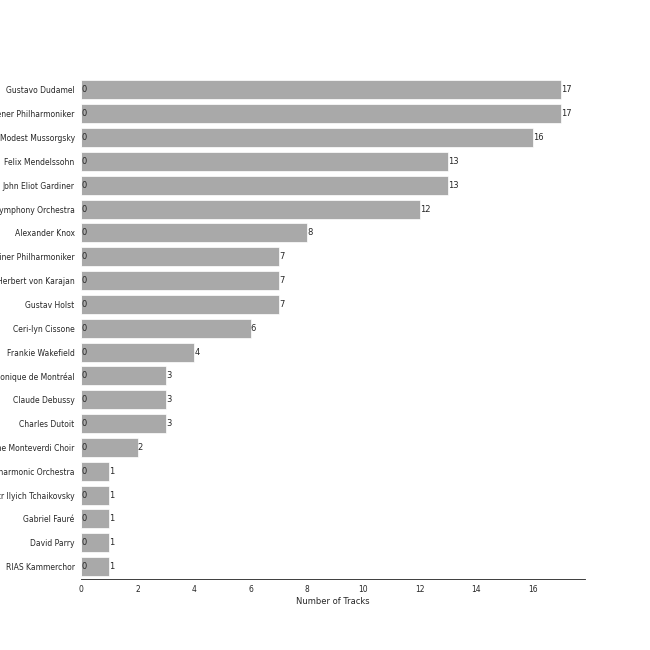

# Program Music

[41 songs](program_music_tracks.md)

## Top Artists

See all 21 artists

|   Number of Tracks | Art                                                                                              | Artist                                                               | 🔗                                                           |
|-------------------:|:-------------------------------------------------------------------------------------------------|:---------------------------------------------------------------------|:------------------------------------------------------------|
|                 17 |  | [Gustavo Dudamel](../artists/gustavo_dudamel.md)                     | [🔗](https://open.spotify.com/artist/0cxXnDhpgxcMMkKddhORHY) |
|                 17 |  | [Wiener Philharmoniker](../artists/wiener_philharmoniker.md)         | [🔗](https://open.spotify.com/artist/003f4bk13c6Q3gAUXv7dGJ) |
|                 16 |  | [Modest Mussorgsky](../artists/modest_mussorgsky.md)                 | [🔗](https://open.spotify.com/artist/284mnx33IWcymQEpMxyfHl) |
|                 13 |  | [Felix Mendelssohn](../artists/felix_mendelssohn.md)                 | [🔗](https://open.spotify.com/artist/6MF58APd3YV72Ln2eVg710) |
|                 13 |  | [John Eliot Gardiner](../artists/john_eliot_gardiner.md)             | [🔗](https://open.spotify.com/artist/1qIRoGEKXINqrCx5N1engi) |
|                 12 |  | [London Symphony Orchestra](../artists/london_symphony_orchestra.md) | [🔗](https://open.spotify.com/artist/5yxyJsFanEAuwSM5kOuZKc) |
|                  8 |                                                               | Alexander Knox                                                       | [🔗](https://open.spotify.com/artist/4vzwv4zzBTlG8qsFCqP2Yv) |
|                  7 |  | [Berliner Philharmoniker](../artists/berliner_philharmoniker.md)     | [🔗](https://open.spotify.com/artist/6uRJnvQ3f8whVnmeoecv5Z) |
|                  7 |  | [Herbert von Karajan](../artists/herbert_von_karajan.md)             | [🔗](https://open.spotify.com/artist/5zCaQxjl110XTrm4LQ1CxY) |
|                  7 |  | Gustav Holst                                                         | [🔗](https://open.spotify.com/artist/5B7uXBeLc2TkR5Jk23qKIZ) |
|                  6 |                                                               | Ceri-lyn Cissone                                                     | [🔗](https://open.spotify.com/artist/6F3jOFmhUwRxRdWAZU6G1A) |
|                  4 |                                                               | Frankie Wakefield                                                    | [🔗](https://open.spotify.com/artist/7jobsaZIFhejECE605yxx6) |
|                  3 |  | Orchestre Symphonique de Montréal                                    | [🔗](https://open.spotify.com/artist/4AcXapei4U7xnWecv9AEBd) |
|                  3 |  | [Claude Debussy](../artists/claude_debussy.md)                       | [🔗](https://open.spotify.com/artist/1Uff91EOsvd99rtAupatMP) |
|                  3 |  | Charles Dutoit                                                       | [🔗](https://open.spotify.com/artist/0Ku5VBNL7cfGXRhp2BxXEQ) |
|                  2 |  | The Monteverdi Choir                                                 | [🔗](https://open.spotify.com/artist/0Cqfz92flAzrp94pgN1jEW) |
|                  1 |  | London Philharmonic Orchestra                                        | [🔗](https://open.spotify.com/artist/3PfJE6ebCbCHeuqO4BfNeA) |
|                  1 |  | [Pyotr Ilyich Tchaikovsky](../artists/pyotr_ilyich_tchaikovsky.md)   | [🔗](https://open.spotify.com/artist/3MKCzCnpzw3TjUYs2v7vDA) |
|                  1 |  | Gabriel Fauré                                                        | [🔗](https://open.spotify.com/artist/2gClsBep1tt1rv1CN210SO) |
|                  1 |  | David Parry                                                          | [🔗](https://open.spotify.com/artist/2dfDjeZroUd3LWmSFrAZCD) |
|                  1 |  | RIAS Kammerchor                                                      | [🔗](https://open.spotify.com/artist/2UVXU77knJMYOM6Avvw6Yx) |

## Top Albums

See all 5 albums

|   Number of Tracks | Art                                                                                              | Album                                                                                                         | 🔗                                                          |
|-------------------:|:-------------------------------------------------------------------------------------------------|:--------------------------------------------------------------------------------------------------------------|:-----------------------------------------------------------|
|                 17 |  | Mussorgsky: Pictures At An Exhibition                                                                         | [🔗](https://open.spotify.com/album/1b2aoeaYZZBWmJoavOQhnd) |
|                 13 |  | Mendelssohn: A Midsummer Night's Dream                                                                        | [🔗](https://open.spotify.com/album/60J66evwnrnfH03HgDTrwN) |
|                  7 |  | Holst: The Planets                                                                                            | [🔗](https://open.spotify.com/album/4v0Xyz0LVToUsSTGdsvKSK) |
|                  3 |  | Debussy: La Mer; Jeux; Prélude à l'après-midi d'un faune; Le Martyre de Saint Sébastien (Symphonic Fragments) | [🔗](https://open.spotify.com/album/5egJ0o1mVH2liUfecDWYqk) |
|                  1 |  | Fauré Pavane                                                                                                  | [🔗](https://open.spotify.com/album/0FaQ2LW8NNG3YXYJXFikJF) |

## Top Record Labels

See all 4 labels

|   Number of Tracks | Label                                                                                   |
|-------------------:|:----------------------------------------------------------------------------------------|
|                 24 | [Deutsche Grammophon (DG)](../labels/deutsche_grammophon__dg_.md)                       |
|                 13 | [Lso Live](../labels/lso_live.md)                                                       |
|                  3 | [Decca Music Group Ltd.](../labels/decca_music_group_ltd_.md)                           |
|                  1 | [Warner Music Group - X5 Music Group](../labels/warner_music_group___x5_music_group.md) |

## Genres

See all 8 genres

|   Number of Tracks | Genre                                                   |
|-------------------:|:--------------------------------------------------------|
|                 25 | [classical](../genres/classical.md)                     |
|                 17 | [russian romanticism](../genres/russian_romanticism.md) |
|                 17 | [late romantic era](../genres/late_romantic_era.md)     |
|                 13 | [german romanticism](../genres/german_romanticism.md)   |
|                 13 | [early romantic era](../genres/early_romantic_era.md)   |
|                 11 | [post-romantic era](../genres/post_romantic_era.md)     |
|                  7 | british modern classical                                |
|                  3 | impressionism                                           |

## Audio Features

| 10 most Danceable tracks                                                                       | 10 least Danceable tracks                                                       |
|:-----------------------------------------------------------------------------------------------|:--------------------------------------------------------------------------------|
| A Midsummer Night's Dream, Incidental Music, Op. 61: "Ay Me! For Aught That I Could Ever Read" | The Planets, Op. 32: 5. Saturn, the Bringer of Old Age                          |
| Pictures at an Exhibition (Orch. Ravel): V. Ballet of the Unhatched Chicks                     | Pictures at an Exhibition (Orch. Ravel): VIIIa. Catacombae (Sepulchrum Romanum) |
| Pictures at an Exhibition (Orch. Ravel): Promenade III                                         | Pictures at an Exhibition (Orch. Ravel): X. The Great Gate of Kiev              |
| A Midsummer Night's Dream, Incidental Music, Op. 61: No. 1, Scherzo                            | Fauré Pavane                                                                    |
| A Midsummer Night's Dream, Incidental Music, Op. 61: No. 2, L'istesso tempo                    | Pictures at an Exhibition (Orch. Ravel): Promenade II                           |
| Pictures at an Exhibition (Orch. Ravel): VII. The Market at Limoges                            | La Mer, L.109: 3. Dialogue Of The Wind And The Sea                              |
| A Midsummer Night's Dream, Incidental Music, Op. 61: No. 4, Andante                            | The Planets, Op. 32: 2. Venus, the Bringer of Peace                             |
| A Midsummer Night's Dream, Incidental Music, Op. 61: No. 2a, Allegro vivace                    | Pictures at an Exhibition (Orch. Ravel): II. The Old Castle                     |
| Pictures at an Exhibition (Orch. Ravel): III. Tuileries Gardens                                | La Mer, L.109: 1. From Dawn Till Noon On The Sea (De l'aube à midi sur la mer)  |
| A Midsummer Night's Dream, Incidental Music, Op. 61: No. 8, Andante                            | The Planets, Op. 32: 7. Neptune, the Mystic                                     |

| 10 most Energetic tracks                                                   | 10 least Energetic tracks                                                                 |
|:---------------------------------------------------------------------------|:------------------------------------------------------------------------------------------|
| The Planets, Op. 32: 1. Mars, the Bringer of War                           | The Planets, Op. 32: 5. Saturn, the Bringer of Old Age                                    |
| Pictures at an Exhibition (Orch. Ravel): VII. The Market at Limoges        | A Midsummer Night's Dream, Incidental Music, Op. 61: No. 7, Nocturne. Con moto tranquillo |
| The Planets, Op. 32: 4. Jupiter, the Bringer of Jollity                    | The Planets, Op. 32: 2. Venus, the Bringer of Peace                                       |
| The Planets, Op. 32: 6. Uranus, the Magician                               | A Midsummer Night's Dream, Incidental Music, Op. 61: No. 8, Andante                       |
| Pictures at an Exhibition (Orch. Ravel): X. The Great Gate of Kiev         | A Midsummer Night's Dream, Incidental Music, Op. 61: No. 4, Andante                       |
| Night on Bald Mountain                                                     | Pictures at an Exhibition (Orch. Ravel): VIIIb. Cum mortuis in lingua mortua              |
| Pictures at an Exhibition (Orch. Ravel): IX. The Hut on Chicken's Legs     | Pictures at an Exhibition (Orch. Ravel): II. The Old Castle                               |
| Pictures at an Exhibition (Orch. Ravel): V. Ballet of the Unhatched Chicks | The Planets, Op. 32: 7. Neptune, the Mystic                                               |
| La Mer, L.109: 3. Dialogue Of The Wind And The Sea                         | Pictures at an Exhibition (Orch. Ravel): Promenade II                                     |
| La Mer, L.109: 2. Play of the Waves (Jeux de vagues)                       | Pictures at an Exhibition (Orch. Ravel): VIIIa. Catacombae (Sepulchrum Romanum)           |

| 10 most Speechy tracks                                                                                                         | 10 least Speechy tracks                                                      |
|:-------------------------------------------------------------------------------------------------------------------------------|:-----------------------------------------------------------------------------|
| A Midsummer Night's Dream, Incidental Music, Op. 61: No. 2, L'istesso tempo                                                    | The Planets, Op. 32: 5. Saturn, the Bringer of Old Age                       |
| A Midsummer Night's Dream, Incidental Music, Op. 61: "Ay Me! For Aught That I Could Ever Read"                                 | The Planets, Op. 32: 1. Mars, the Bringer of War                             |
| A Midsummer Night's Dream, Incidental Music, Op. 61: No. 2a, Allegro vivace                                                    | Pictures at an Exhibition (Orch. Ravel): VIIIb. Cum mortuis in lingua mortua |
| A Midsummer Night's Dream, Incidental Music, Op. 61: No. 4, Andante                                                            | Fauré Pavane                                                                 |
| A Midsummer Night's Dream, Incidental Music, Op. 61: No. 9, Hochzeitmarsch "Wedding March" - No. 12, Allegro vivace come primo | Pictures at an Exhibition (Orch. Ravel): IX. The Hut on Chicken's Legs       |
| The Planets, Op. 32: 6. Uranus, the Magician                                                                                   | The Planets, Op. 32: 4. Jupiter, the Bringer of Jollity                      |
| A Midsummer Night's Dream, Incidental Music, Op. 61: No. 8, Andante                                                            | Pictures at an Exhibition (Orch. Ravel): X. The Great Gate of Kiev           |
| Pictures at an Exhibition (Orch. Ravel): I. Gnomus                                                                             | Pictures at an Exhibition (Orch. Ravel): Promenade III                       |
| Pictures at an Exhibition (Orch. Ravel): V. Ballet of the Unhatched Chicks                                                     | A Midsummer Night's Dream, Incidental Music, Op. 61: No. 1, Scherzo          |
| A Midsummer Night's Dream, Incidental Music, Op. 61: No. 5, Allegro appassionato                                               | Pictures at an Exhibition (Orch. Ravel): IV. Bydlo                           |

| 10 most Acoustic tracks                                                                   | 10 least Acoustic tracks                                                                       |
|:------------------------------------------------------------------------------------------|:-----------------------------------------------------------------------------------------------|
| Pictures at an Exhibition (Orch. Ravel): Promenade II                                     | The Planets, Op. 32: 6. Uranus, the Magician                                                   |
| Pictures at an Exhibition (Orch. Ravel): III. Tuileries Gardens                           | A Midsummer Night's Dream, Incidental Music, Op. 61: Finale. Allegro di molto                  |
| Pictures at an Exhibition (Orch. Ravel): VIIIa. Catacombae (Sepulchrum Romanum)           | Overture to "A Midsummer Night's Dream", Op. 21: Allegro di molto                              |
| Pictures at an Exhibition (Orch. Ravel): VII. The Market at Limoges                       | La Mer, L.109: 3. Dialogue Of The Wind And The Sea                                             |
| Pictures at an Exhibition (Orch. Ravel): V. Ballet of the Unhatched Chicks                | The Planets, Op. 32: 1. Mars, the Bringer of War                                               |
| Fauré Pavane                                                                              | A Midsummer Night's Dream, Incidental Music, Op. 61: No. 4, Andante                            |
| A Midsummer Night's Dream, Incidental Music, Op. 61: No. 7, Nocturne. Con moto tranquillo | A Midsummer Night's Dream, Incidental Music, Op. 61: No. 2a, Allegro vivace                    |
| Pictures at an Exhibition (Orch. Ravel): II. The Old Castle                               | A Midsummer Night's Dream, Incidental Music, Op. 61: No. 8, Andante                            |
| Pictures at an Exhibition (Orch. Ravel): Promenade I                                      | A Midsummer Night's Dream, Incidental Music, Op. 61: No. 2, L'istesso tempo                    |
| Pictures at an Exhibition (Orch. Ravel): Promenade III                                    | A Midsummer Night's Dream, Incidental Music, Op. 61: "Ay Me! For Aught That I Could Ever Read" |

| 10 most Instrumental tracks                                                  | 10 least Instrumental tracks                                                                                                   |
|:-----------------------------------------------------------------------------|:-------------------------------------------------------------------------------------------------------------------------------|
| Pictures at an Exhibition (Orch. Ravel): IV. Bydlo                           | A Midsummer Night's Dream, Incidental Music, Op. 61: No. 9, Hochzeitmarsch "Wedding March" - No. 12, Allegro vivace come primo |
| Pictures at an Exhibition (Orch. Ravel): Promenade I                         | Pictures at an Exhibition (Orch. Ravel): VIIIa. Catacombae (Sepulchrum Romanum)                                                |
| A Midsummer Night's Dream, Incidental Music, Op. 61: No. 1, Scherzo          | A Midsummer Night's Dream, Incidental Music, Op. 61: No. 5, Allegro appassionato                                               |
| Pictures at an Exhibition (Orch. Ravel): VIIIb. Cum mortuis in lingua mortua | A Midsummer Night's Dream, Incidental Music, Op. 61: No. 3, Lied mit Chor                                                      |
| Pictures at an Exhibition (Orch. Ravel): VII. The Market at Limoges          | A Midsummer Night's Dream, Incidental Music, Op. 61: No. 2a, Allegro vivace                                                    |
| The Planets, Op. 32: 4. Jupiter, the Bringer of Jollity                      | A Midsummer Night's Dream, Incidental Music, Op. 61: Finale. Allegro di molto                                                  |
| The Planets, Op. 32: 5. Saturn, the Bringer of Old Age                       | A Midsummer Night's Dream, Incidental Music, Op. 61: No. 4, Andante                                                            |
| Pictures at an Exhibition (Orch. Ravel): X. The Great Gate of Kiev           | A Midsummer Night's Dream, Incidental Music, Op. 61: No. 8, Andante                                                            |
| Pictures at an Exhibition (Orch. Ravel): II. The Old Castle                  | A Midsummer Night's Dream, Incidental Music, Op. 61: No. 2, L'istesso tempo                                                    |
| La Mer, L.109: 3. Dialogue Of The Wind And The Sea                           | A Midsummer Night's Dream, Incidental Music, Op. 61: "Ay Me! For Aught That I Could Ever Read"                                 |

| 10 most Live tracks                                                          | 10 least Live tracks                                                                                                           |
|:-----------------------------------------------------------------------------|:-------------------------------------------------------------------------------------------------------------------------------|
| Pictures at an Exhibition (Orch. Ravel): VIIIb. Cum mortuis in lingua mortua | Pictures at an Exhibition (Orch. Ravel): Promenade II                                                                          |
| Pictures at an Exhibition (Orch. Ravel): IX. The Hut on Chicken's Legs       | Overture to "A Midsummer Night's Dream", Op. 21: Allegro di molto                                                              |
| Pictures at an Exhibition (Orch. Ravel): VII. The Market at Limoges          | A Midsummer Night's Dream, Incidental Music, Op. 61: No. 7, Nocturne. Con moto tranquillo                                      |
| Pictures at an Exhibition (Orch. Ravel): I. Gnomus                           | Swan Lake Suite, Op. 20a: II. Waltz                                                                                            |
| Night on Bald Mountain                                                       | La Mer, L.109: 3. Dialogue Of The Wind And The Sea                                                                             |
| A Midsummer Night's Dream, Incidental Music, Op. 61: No. 4, Andante          | Overture to "A Midsummer Night's Dream", Op. 21: Tempo primo                                                                   |
| A Midsummer Night's Dream, Incidental Music, Op. 61: No. 2a, Allegro vivace  | A Midsummer Night's Dream, Incidental Music, Op. 61: No. 9, Hochzeitmarsch "Wedding March" - No. 12, Allegro vivace come primo |
| A Midsummer Night's Dream, Incidental Music, Op. 61: No. 8, Andante          | Pictures at an Exhibition (Orch. Ravel): Promenade IV                                                                          |
| Pictures at an Exhibition (Orch. Ravel): VI. Samuel Goldenberg und Schmuÿle  | The Planets, Op. 32: 7. Neptune, the Mystic                                                                                    |
| A Midsummer Night's Dream, Incidental Music, Op. 61: No. 2, L'istesso tempo  | A Midsummer Night's Dream, Incidental Music, Op. 61: No. 3, Lied mit Chor                                                      |

| 10 most Happy tracks                                                                           | 10 least Happy tracks                                                                     |
|:-----------------------------------------------------------------------------------------------|:------------------------------------------------------------------------------------------|
| Pictures at an Exhibition (Orch. Ravel): V. Ballet of the Unhatched Chicks                     | Pictures at an Exhibition (Orch. Ravel): VIIIa. Catacombae (Sepulchrum Romanum)           |
| A Midsummer Night's Dream, Incidental Music, Op. 61: No. 1, Scherzo                            | Pictures at an Exhibition (Orch. Ravel): VIIIb. Cum mortuis in lingua mortua              |
| Pictures at an Exhibition (Orch. Ravel): VII. The Market at Limoges                            | La Mer, L.109: 2. Play of the Waves (Jeux de vagues)                                      |
| Pictures at an Exhibition (Orch. Ravel): Promenade III                                         | La Mer, L.109: 1. From Dawn Till Noon On The Sea (De l'aube à midi sur la mer)            |
| A Midsummer Night's Dream, Incidental Music, Op. 61: "Ay Me! For Aught That I Could Ever Read" | A Midsummer Night's Dream, Incidental Music, Op. 61: No. 7, Nocturne. Con moto tranquillo |
| A Midsummer Night's Dream, Incidental Music, Op. 61: No. 2, L'istesso tempo                    | La Mer, L.109: 3. Dialogue Of The Wind And The Sea                                        |
| The Planets, Op. 32: 4. Jupiter, the Bringer of Jollity                                        | Pictures at an Exhibition (Orch. Ravel): II. The Old Castle                               |
| Pictures at an Exhibition (Orch. Ravel): III. Tuileries Gardens                                | The Planets, Op. 32: 5. Saturn, the Bringer of Old Age                                    |
| Pictures at an Exhibition (Orch. Ravel): IX. The Hut on Chicken's Legs                         | The Planets, Op. 32: 7. Neptune, the Mystic                                               |
| Pictures at an Exhibition (Orch. Ravel): Promenade II                                          | The Planets, Op. 32: 2. Venus, the Bringer of Peace                                       |
