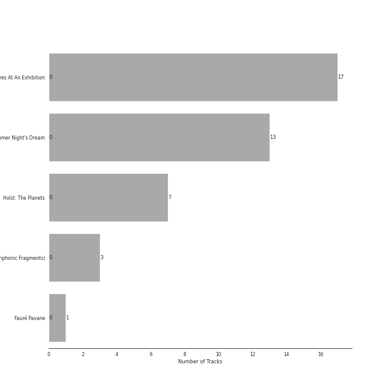
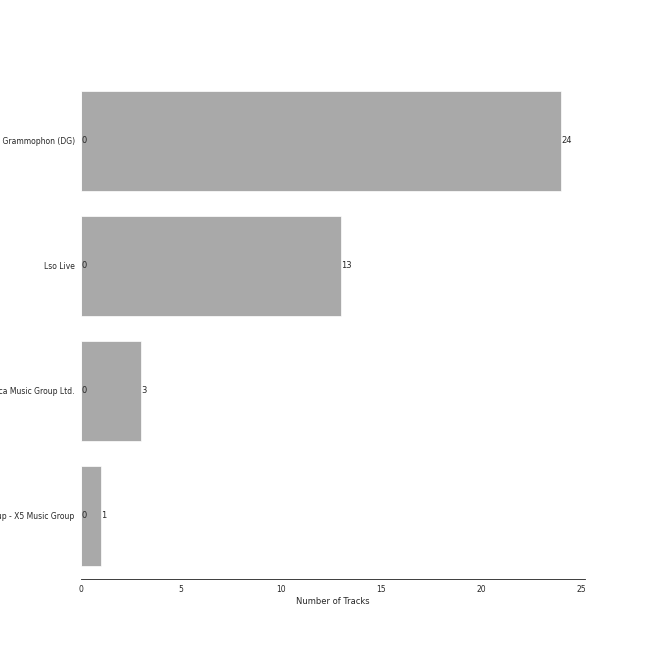

# Program Music

41 songs

## Top Artists

See all 21 artists

|   Number of Tracks | Art                                                                                              | Artist                                                                       | 🔗                                                           |
|-------------------:|:-------------------------------------------------------------------------------------------------|:-----------------------------------------------------------------------------|:------------------------------------------------------------|
|                 17 |  | [Gustavo Dudamel](../artists/gustavo_dudamel.md)                             | [🔗](https://open.spotify.com/artist/0cxXnDhpgxcMMkKddhORHY) |
|                 17 |  | [Wiener Philharmoniker](../artists/wiener_philharmoniker.md)                 | [🔗](https://open.spotify.com/artist/003f4bk13c6Q3gAUXv7dGJ) |
|                 16 |  | [Modest Mussorgsky](../artists/modest_mussorgsky.md)                         | [🔗](https://open.spotify.com/artist/284mnx33IWcymQEpMxyfHl) |
|                 13 |  | [Felix Mendelssohn](../artists/felix_mendelssohn.md)                         | [🔗](https://open.spotify.com/artist/6MF58APd3YV72Ln2eVg710) |
|                 13 |  | [John Eliot Gardiner](../artists/john_eliot_gardiner.md)                     | [🔗](https://open.spotify.com/artist/1qIRoGEKXINqrCx5N1engi) |
|                 12 |  | [London Symphony Orchestra](../artists/london_symphony_orchestra.md)         | [🔗](https://open.spotify.com/artist/5yxyJsFanEAuwSM5kOuZKc) |
|                  8 |                                                               | Alexander Knox                                                               | [🔗](https://open.spotify.com/artist/4vzwv4zzBTlG8qsFCqP2Yv) |
|                  7 |  | [Berliner Philharmoniker](../artists/berliner_philharmoniker.md)             | [🔗](https://open.spotify.com/artist/6uRJnvQ3f8whVnmeoecv5Z) |
|                  7 |  | [Herbert von Karajan](../artists/herbert_von_karajan.md)                     | [🔗](https://open.spotify.com/artist/5zCaQxjl110XTrm4LQ1CxY) |
|                  7 |  | Gustav Holst                                                                 | [🔗](https://open.spotify.com/artist/5B7uXBeLc2TkR5Jk23qKIZ) |
|                  6 |                                                               | Ceri-lyn Cissone                                                             | [🔗](https://open.spotify.com/artist/6F3jOFmhUwRxRdWAZU6G1A) |
|                  4 |                                                               | Frankie Wakefield                                                            | [🔗](https://open.spotify.com/artist/7jobsaZIFhejECE605yxx6) |
|                  3 |  | Orchestre Symphonique de Montréal                                            | [🔗](https://open.spotify.com/artist/4AcXapei4U7xnWecv9AEBd) |
|                  3 |  | [Claude Debussy](../artists/claude_debussy.md)                               | [🔗](https://open.spotify.com/artist/1Uff91EOsvd99rtAupatMP) |
|                  3 |  | Charles Dutoit                                                               | [🔗](https://open.spotify.com/artist/0Ku5VBNL7cfGXRhp2BxXEQ) |
|                  2 |  | The Monteverdi Choir                                                         | [🔗](https://open.spotify.com/artist/0Cqfz92flAzrp94pgN1jEW) |
|                  1 |  | [London Philharmonic Orchestra](../artists/london_philharmonic_orchestra.md) | [🔗](https://open.spotify.com/artist/3PfJE6ebCbCHeuqO4BfNeA) |
|                  1 |  | [Pyotr Ilyich Tchaikovsky](../artists/pyotr_ilyich_tchaikovsky.md)           | [🔗](https://open.spotify.com/artist/3MKCzCnpzw3TjUYs2v7vDA) |
|                  1 |  | Gabriel Fauré                                                                | [🔗](https://open.spotify.com/artist/2gClsBep1tt1rv1CN210SO) |
|                  1 |  | David Parry                                                                  | [🔗](https://open.spotify.com/artist/2dfDjeZroUd3LWmSFrAZCD) |
|                  1 |  | RIAS Kammerchor                                                              | [🔗](https://open.spotify.com/artist/2UVXU77knJMYOM6Avvw6Yx) |

## Top Albums

See all 5 albums

|   Number of Tracks | Art                                                                                              | Album                                                                                                         | 🔗                                                          |
|-------------------:|:-------------------------------------------------------------------------------------------------|:--------------------------------------------------------------------------------------------------------------|:-----------------------------------------------------------|
|                 17 |  | Mussorgsky: Pictures At An Exhibition                                                                         | [🔗](https://open.spotify.com/album/1b2aoeaYZZBWmJoavOQhnd) |
|                 13 |  | Mendelssohn: A Midsummer Night's Dream                                                                        | [🔗](https://open.spotify.com/album/60J66evwnrnfH03HgDTrwN) |
|                  7 |  | Holst: The Planets                                                                                            | [🔗](https://open.spotify.com/album/4v0Xyz0LVToUsSTGdsvKSK) |
|                  3 |  | Debussy: La Mer; Jeux; Prélude à l'après-midi d'un faune; Le Martyre de Saint Sébastien (Symphonic Fragments) | [🔗](https://open.spotify.com/album/5egJ0o1mVH2liUfecDWYqk) |
|                  1 |  | Fauré Pavane                                                                                                  | [🔗](https://open.spotify.com/album/0FaQ2LW8NNG3YXYJXFikJF) |

## Top Record Labels

See all 4 labels

|   Number of Tracks | Label                               |
|-------------------:|:------------------------------------|
|                 24 | Deutsche Grammophon (DG)            |
|                 13 | Lso Live                            |
|                  3 | Decca Music Group Ltd.              |
|                  1 | Warner Music Group - X5 Music Group |

## Tracks

| Art                                                                                              | Track                                                                                                                          | Album                                                                                                         | Artists                                                                                                                                                                                                                                                         | Label                               | 💚   | 🔗                                                          |
|:-------------------------------------------------------------------------------------------------|:-------------------------------------------------------------------------------------------------------------------------------|:--------------------------------------------------------------------------------------------------------------|:----------------------------------------------------------------------------------------------------------------------------------------------------------------------------------------------------------------------------------------------------------------|:------------------------------------|:----|:-----------------------------------------------------------|
|  | La Mer, L.109: 1. From Dawn Till Noon On The Sea (De l'aube à midi sur la mer)                                                 | Debussy: La Mer; Jeux; Prélude à l'après-midi d'un faune; Le Martyre de Saint Sébastien (Symphonic Fragments) | [Claude Debussy](../artists/claude_debussy.md), Orchestre Symphonique de Montréal, Charles Dutoit                                                                                                                                                               | Decca Music Group Ltd.              |     | [🔗](https://open.spotify.com/track/50FSASeAGce3AQqlEKDXXZ) |
|  | La Mer, L.109: 2. Play of the Waves (Jeux de vagues)                                                                           | Debussy: La Mer; Jeux; Prélude à l'après-midi d'un faune; Le Martyre de Saint Sébastien (Symphonic Fragments) | [Claude Debussy](../artists/claude_debussy.md), Orchestre Symphonique de Montréal, Charles Dutoit                                                                                                                                                               | Decca Music Group Ltd.              |     | [🔗](https://open.spotify.com/track/55lmbVc4FLYlbHaPqiVjv2) |
|  | La Mer, L.109: 3. Dialogue Of The Wind And The Sea                                                                             | Debussy: La Mer; Jeux; Prélude à l'après-midi d'un faune; Le Martyre de Saint Sébastien (Symphonic Fragments) | [Claude Debussy](../artists/claude_debussy.md), Orchestre Symphonique de Montréal, Charles Dutoit                                                                                                                                                               | Decca Music Group Ltd.              |     | [🔗](https://open.spotify.com/track/49wWvRfrD7lABh3Rk4adg0) |
|  | A Midsummer Night's Dream, Incidental Music, Op. 61: "Ay Me! For Aught That I Could Ever Read"                                 | Mendelssohn: A Midsummer Night's Dream                                                                        | [Felix Mendelssohn](../artists/felix_mendelssohn.md), [John Eliot Gardiner](../artists/john_eliot_gardiner.md), Alexander Knox                                                                                                                                  | Lso Live                            |     | [🔗](https://open.spotify.com/track/1EGPsb3zw2L5Q6ocFc3G83) |
|  | A Midsummer Night's Dream, Incidental Music, Op. 61: No. 7, Nocturne. Con moto tranquillo                                      | Mendelssohn: A Midsummer Night's Dream                                                                        | [Felix Mendelssohn](../artists/felix_mendelssohn.md), [London Symphony Orchestra](../artists/london_symphony_orchestra.md), [John Eliot Gardiner](../artists/john_eliot_gardiner.md)                                                                            | Lso Live                            |     | [🔗](https://open.spotify.com/track/5lmp8r1rxxI6FuluNPBm82) |
|  | Overture to "A Midsummer Night's Dream", Op. 21: Allegro di molto                                                              | Mendelssohn: A Midsummer Night's Dream                                                                        | [Felix Mendelssohn](../artists/felix_mendelssohn.md), [London Symphony Orchestra](../artists/london_symphony_orchestra.md), [John Eliot Gardiner](../artists/john_eliot_gardiner.md)                                                                            | Lso Live                            |     | [🔗](https://open.spotify.com/track/7pz2npttELZeXmDgYfCDlE) |
|  | Overture to "A Midsummer Night's Dream", Op. 21: Tempo primo                                                                   | Mendelssohn: A Midsummer Night's Dream                                                                        | [Felix Mendelssohn](../artists/felix_mendelssohn.md), [London Symphony Orchestra](../artists/london_symphony_orchestra.md), [John Eliot Gardiner](../artists/john_eliot_gardiner.md)                                                                            | Lso Live                            |     | [🔗](https://open.spotify.com/track/2idvFSH2im8mdSaMiE81vn) |
|  | A Midsummer Night's Dream, Incidental Music, Op. 61: No. 1, Scherzo                                                            | Mendelssohn: A Midsummer Night's Dream                                                                        | [Felix Mendelssohn](../artists/felix_mendelssohn.md), [London Symphony Orchestra](../artists/london_symphony_orchestra.md), [John Eliot Gardiner](../artists/john_eliot_gardiner.md), Alexander Knox                                                            | Lso Live                            |     | [🔗](https://open.spotify.com/track/359jW2zuaHCdC0gCJRcX5o) |
|  | A Midsummer Night's Dream, Incidental Music, Op. 61: No. 9, Hochzeitmarsch "Wedding March" - No. 12, Allegro vivace come primo | Mendelssohn: A Midsummer Night's Dream                                                                        | [Felix Mendelssohn](../artists/felix_mendelssohn.md), [London Symphony Orchestra](../artists/london_symphony_orchestra.md), [John Eliot Gardiner](../artists/john_eliot_gardiner.md), Alexander Knox                                                            | Lso Live                            |     | [🔗](https://open.spotify.com/track/1ipR2jLKKgr7X9xJyd54Kx) |
|  | A Midsummer Night's Dream, Incidental Music, Op. 61: No. 2, L'istesso tempo                                                    | Mendelssohn: A Midsummer Night's Dream                                                                        | [Felix Mendelssohn](../artists/felix_mendelssohn.md), [London Symphony Orchestra](../artists/london_symphony_orchestra.md), [John Eliot Gardiner](../artists/john_eliot_gardiner.md), Alexander Knox, Ceri-lyn Cissone                                          | Lso Live                            |     | [🔗](https://open.spotify.com/track/68afyO04jLHCK9Na8cgsGR) |
|  | A Midsummer Night's Dream, Incidental Music, Op. 61: No. 5, Allegro appassionato                                               | Mendelssohn: A Midsummer Night's Dream                                                                        | [Felix Mendelssohn](../artists/felix_mendelssohn.md), [London Symphony Orchestra](../artists/london_symphony_orchestra.md), [John Eliot Gardiner](../artists/john_eliot_gardiner.md), Alexander Knox, Ceri-lyn Cissone                                          | Lso Live                            |     | [🔗](https://open.spotify.com/track/5XWKRz9i2PQWI3PsW0FmQj) |
|  | A Midsummer Night's Dream, Incidental Music, Op. 61: No. 8, Andante                                                            | Mendelssohn: A Midsummer Night's Dream                                                                        | [Felix Mendelssohn](../artists/felix_mendelssohn.md), [London Symphony Orchestra](../artists/london_symphony_orchestra.md), [John Eliot Gardiner](../artists/john_eliot_gardiner.md), Alexander Knox, Ceri-lyn Cissone, Frankie Wakefield                       | Lso Live                            |     | [🔗](https://open.spotify.com/track/2QYtN5MiVrF7OJFpkJvLrS) |
|  | A Midsummer Night's Dream, Incidental Music, Op. 61: Finale. Allegro di molto                                                  | Mendelssohn: A Midsummer Night's Dream                                                                        | [Felix Mendelssohn](../artists/felix_mendelssohn.md), [London Symphony Orchestra](../artists/london_symphony_orchestra.md), [John Eliot Gardiner](../artists/john_eliot_gardiner.md), Alexander Knox, Ceri-lyn Cissone, Frankie Wakefield, The Monteverdi Choir | Lso Live                            |     | [🔗](https://open.spotify.com/track/5iGRKlJcFcSx0PA4OGpiYD) |
|  | A Midsummer Night's Dream, Incidental Music, Op. 61: No. 2a, Allegro vivace                                                    | Mendelssohn: A Midsummer Night's Dream                                                                        | [Felix Mendelssohn](../artists/felix_mendelssohn.md), [London Symphony Orchestra](../artists/london_symphony_orchestra.md), [John Eliot Gardiner](../artists/john_eliot_gardiner.md), Alexander Knox, Frankie Wakefield                                         | Lso Live                            |     | [🔗](https://open.spotify.com/track/58VxRBZ7XFR3vWgNwz5fYT) |
|  | A Midsummer Night's Dream, Incidental Music, Op. 61: No. 4, Andante                                                            | Mendelssohn: A Midsummer Night's Dream                                                                        | [Felix Mendelssohn](../artists/felix_mendelssohn.md), [London Symphony Orchestra](../artists/london_symphony_orchestra.md), [John Eliot Gardiner](../artists/john_eliot_gardiner.md), Ceri-lyn Cissone, Frankie Wakefield                                       | Lso Live                            |     | [🔗](https://open.spotify.com/track/67eEYhol9DXQ65kUFt7jdk) |
|  | A Midsummer Night's Dream, Incidental Music, Op. 61: No. 3, Lied mit Chor                                                      | Mendelssohn: A Midsummer Night's Dream                                                                        | [Felix Mendelssohn](../artists/felix_mendelssohn.md), [London Symphony Orchestra](../artists/london_symphony_orchestra.md), [John Eliot Gardiner](../artists/john_eliot_gardiner.md), Ceri-lyn Cissone, The Monteverdi Choir                                    | Lso Live                            |     | [🔗](https://open.spotify.com/track/1dDvLHCOPEVgNhHtVnB2is) |
|  | Fauré Pavane                                                                                                                   | Fauré Pavane                                                                                                  | Gabriel Fauré, David Parry, [London Philharmonic Orchestra](../artists/london_philharmonic_orchestra.md)                                                                                                                                                        | Warner Music Group - X5 Music Group |     | [🔗](https://open.spotify.com/track/2BzQ1604JsM3oNzaRYhnoG) |
|  | The Planets, Op. 32: 1. Mars, the Bringer of War                                                                               | Holst: The Planets                                                                                            | [Herbert von Karajan](../artists/herbert_von_karajan.md), Gustav Holst, [Berliner Philharmoniker](../artists/berliner_philharmoniker.md)                                                                                                                        | Deutsche Grammophon (DG)            |     | [🔗](https://open.spotify.com/track/1C3RIRKQZhSk5d2iioIhkg) |
|  | The Planets, Op. 32: 2. Venus, the Bringer of Peace                                                                            | Holst: The Planets                                                                                            | [Herbert von Karajan](../artists/herbert_von_karajan.md), Gustav Holst, [Berliner Philharmoniker](../artists/berliner_philharmoniker.md)                                                                                                                        | Deutsche Grammophon (DG)            |     | [🔗](https://open.spotify.com/track/0kEBYD0sMCPtsfpwFLG9aj) |
|  | The Planets, Op. 32: 3. Mercury, the Winged Messenger                                                                          | Holst: The Planets                                                                                            | [Herbert von Karajan](../artists/herbert_von_karajan.md), Gustav Holst, [Berliner Philharmoniker](../artists/berliner_philharmoniker.md)                                                                                                                        | Deutsche Grammophon (DG)            |     | [🔗](https://open.spotify.com/track/4rehJ6QJSNLQCK3Rav7pAe) |
|  | The Planets, Op. 32: 4. Jupiter, the Bringer of Jollity                                                                        | Holst: The Planets                                                                                            | [Herbert von Karajan](../artists/herbert_von_karajan.md), Gustav Holst, [Berliner Philharmoniker](../artists/berliner_philharmoniker.md)                                                                                                                        | Deutsche Grammophon (DG)            |     | [🔗](https://open.spotify.com/track/59Id4KrBWiizuq53doxWtp) |
|  | The Planets, Op. 32: 5. Saturn, the Bringer of Old Age                                                                         | Holst: The Planets                                                                                            | [Herbert von Karajan](../artists/herbert_von_karajan.md), Gustav Holst, [Berliner Philharmoniker](../artists/berliner_philharmoniker.md)                                                                                                                        | Deutsche Grammophon (DG)            |     | [🔗](https://open.spotify.com/track/6JN1TOTbij0lynXvKNUlFw) |
|  | The Planets, Op. 32: 6. Uranus, the Magician                                                                                   | Holst: The Planets                                                                                            | [Herbert von Karajan](../artists/herbert_von_karajan.md), Gustav Holst, [Berliner Philharmoniker](../artists/berliner_philharmoniker.md)                                                                                                                        | Deutsche Grammophon (DG)            |     | [🔗](https://open.spotify.com/track/47fxroOKrDiF1KGNnuUFqr) |
|  | The Planets, Op. 32: 7. Neptune, the Mystic                                                                                    | Holst: The Planets                                                                                            | [Herbert von Karajan](../artists/herbert_von_karajan.md), Gustav Holst, [Berliner Philharmoniker](../artists/berliner_philharmoniker.md), RIAS Kammerchor                                                                                                       | Deutsche Grammophon (DG)            |     | [🔗](https://open.spotify.com/track/1MUMbwhbg0ym7jt6nTeXk8) |
|  | Swan Lake Suite, Op. 20a: II. Waltz                                                                                            | Mussorgsky: Pictures At An Exhibition                                                                         | [Pyotr Ilyich Tchaikovsky](../artists/pyotr_ilyich_tchaikovsky.md), [Wiener Philharmoniker](../artists/wiener_philharmoniker.md), [Gustavo Dudamel](../artists/gustavo_dudamel.md)                                                                              | Deutsche Grammophon (DG)            |     | [🔗](https://open.spotify.com/track/0NOiSayyUFYnLllkTdFa1k) |
|  | Night on Bald Mountain                                                                                                         | Mussorgsky: Pictures At An Exhibition                                                                         | [Wiener Philharmoniker](../artists/wiener_philharmoniker.md), [Modest Mussorgsky](../artists/modest_mussorgsky.md), [Gustavo Dudamel](../artists/gustavo_dudamel.md)                                                                                            | Deutsche Grammophon (DG)            |     | [🔗](https://open.spotify.com/track/6ejFaLGH7F4J5tnaYirs2G) |
|  | Pictures at an Exhibition (Orch. Ravel): I. Gnomus                                                                             | Mussorgsky: Pictures At An Exhibition                                                                         | [Wiener Philharmoniker](../artists/wiener_philharmoniker.md), [Modest Mussorgsky](../artists/modest_mussorgsky.md), [Gustavo Dudamel](../artists/gustavo_dudamel.md)                                                                                            | Deutsche Grammophon (DG)            |     | [🔗](https://open.spotify.com/track/4gKrD45pSLOwGndDsmtisn) |
|  | Pictures at an Exhibition (Orch. Ravel): II. The Old Castle                                                                    | Mussorgsky: Pictures At An Exhibition                                                                         | [Wiener Philharmoniker](../artists/wiener_philharmoniker.md), [Modest Mussorgsky](../artists/modest_mussorgsky.md), [Gustavo Dudamel](../artists/gustavo_dudamel.md)                                                                                            | Deutsche Grammophon (DG)            |     | [🔗](https://open.spotify.com/track/7B6kLePNk9ySaaPMXCGysA) |
|  | Pictures at an Exhibition (Orch. Ravel): III. Tuileries Gardens                                                                | Mussorgsky: Pictures At An Exhibition                                                                         | [Wiener Philharmoniker](../artists/wiener_philharmoniker.md), [Modest Mussorgsky](../artists/modest_mussorgsky.md), [Gustavo Dudamel](../artists/gustavo_dudamel.md)                                                                                            | Deutsche Grammophon (DG)            |     | [🔗](https://open.spotify.com/track/5ePWR9SYDsADEMLyAcCcJU) |
|  | Pictures at an Exhibition (Orch. Ravel): IV. Bydlo                                                                             | Mussorgsky: Pictures At An Exhibition                                                                         | [Wiener Philharmoniker](../artists/wiener_philharmoniker.md), [Modest Mussorgsky](../artists/modest_mussorgsky.md), [Gustavo Dudamel](../artists/gustavo_dudamel.md)                                                                                            | Deutsche Grammophon (DG)            |     | [🔗](https://open.spotify.com/track/1TZ9VIzwoQcSBQbJlbHOrH) |
|  | Pictures at an Exhibition (Orch. Ravel): IX. The Hut on Chicken's Legs                                                         | Mussorgsky: Pictures At An Exhibition                                                                         | [Wiener Philharmoniker](../artists/wiener_philharmoniker.md), [Modest Mussorgsky](../artists/modest_mussorgsky.md), [Gustavo Dudamel](../artists/gustavo_dudamel.md)                                                                                            | Deutsche Grammophon (DG)            |     | [🔗](https://open.spotify.com/track/4Eev1NK5U0fm4ZADOu9KKq) |
|  | Pictures at an Exhibition (Orch. Ravel): Promenade I                                                                           | Mussorgsky: Pictures At An Exhibition                                                                         | [Wiener Philharmoniker](../artists/wiener_philharmoniker.md), [Modest Mussorgsky](../artists/modest_mussorgsky.md), [Gustavo Dudamel](../artists/gustavo_dudamel.md)                                                                                            | Deutsche Grammophon (DG)            |     | [🔗](https://open.spotify.com/track/4edX8xopbaXGJN8n1rW7Vk) |
|  | Pictures at an Exhibition (Orch. Ravel): Promenade II                                                                          | Mussorgsky: Pictures At An Exhibition                                                                         | [Wiener Philharmoniker](../artists/wiener_philharmoniker.md), [Modest Mussorgsky](../artists/modest_mussorgsky.md), [Gustavo Dudamel](../artists/gustavo_dudamel.md)                                                                                            | Deutsche Grammophon (DG)            |     | [🔗](https://open.spotify.com/track/7etkHCIevRXLnNIg0bvxKi) |
|  | Pictures at an Exhibition (Orch. Ravel): Promenade III                                                                         | Mussorgsky: Pictures At An Exhibition                                                                         | [Wiener Philharmoniker](../artists/wiener_philharmoniker.md), [Modest Mussorgsky](../artists/modest_mussorgsky.md), [Gustavo Dudamel](../artists/gustavo_dudamel.md)                                                                                            | Deutsche Grammophon (DG)            |     | [🔗](https://open.spotify.com/track/09lmHgk6RgtzK2uszcrSVM) |
|  | Pictures at an Exhibition (Orch. Ravel): Promenade IV                                                                          | Mussorgsky: Pictures At An Exhibition                                                                         | [Wiener Philharmoniker](../artists/wiener_philharmoniker.md), [Modest Mussorgsky](../artists/modest_mussorgsky.md), [Gustavo Dudamel](../artists/gustavo_dudamel.md)                                                                                            | Deutsche Grammophon (DG)            |     | [🔗](https://open.spotify.com/track/76T40WZcGyMDp187cQoWv1) |
|  | Pictures at an Exhibition (Orch. Ravel): V. Ballet of the Unhatched Chicks                                                     | Mussorgsky: Pictures At An Exhibition                                                                         | [Wiener Philharmoniker](../artists/wiener_philharmoniker.md), [Modest Mussorgsky](../artists/modest_mussorgsky.md), [Gustavo Dudamel](../artists/gustavo_dudamel.md)                                                                                            | Deutsche Grammophon (DG)            |     | [🔗](https://open.spotify.com/track/6vbjbDunJDJLot3rhHB0Lx) |
|  | Pictures at an Exhibition (Orch. Ravel): VI. Samuel Goldenberg und Schmuÿle                                                    | Mussorgsky: Pictures At An Exhibition                                                                         | [Wiener Philharmoniker](../artists/wiener_philharmoniker.md), [Modest Mussorgsky](../artists/modest_mussorgsky.md), [Gustavo Dudamel](../artists/gustavo_dudamel.md)                                                                                            | Deutsche Grammophon (DG)            |     | [🔗](https://open.spotify.com/track/0z8qN0Tn05N5wzFjDaHmMJ) |
|  | Pictures at an Exhibition (Orch. Ravel): VII. The Market at Limoges                                                            | Mussorgsky: Pictures At An Exhibition                                                                         | [Wiener Philharmoniker](../artists/wiener_philharmoniker.md), [Modest Mussorgsky](../artists/modest_mussorgsky.md), [Gustavo Dudamel](../artists/gustavo_dudamel.md)                                                                                            | Deutsche Grammophon (DG)            |     | [🔗](https://open.spotify.com/track/5mWkqRpS1V5DHMW9VGJ4Dr) |
|  | Pictures at an Exhibition (Orch. Ravel): VIIIa. Catacombae (Sepulchrum Romanum)                                                | Mussorgsky: Pictures At An Exhibition                                                                         | [Wiener Philharmoniker](../artists/wiener_philharmoniker.md), [Modest Mussorgsky](../artists/modest_mussorgsky.md), [Gustavo Dudamel](../artists/gustavo_dudamel.md)                                                                                            | Deutsche Grammophon (DG)            |     | [🔗](https://open.spotify.com/track/6kXCQVQ1B0i7SqxF9cFAd7) |
|  | Pictures at an Exhibition (Orch. Ravel): VIIIb. Cum mortuis in lingua mortua                                                   | Mussorgsky: Pictures At An Exhibition                                                                         | [Wiener Philharmoniker](../artists/wiener_philharmoniker.md), [Modest Mussorgsky](../artists/modest_mussorgsky.md), [Gustavo Dudamel](../artists/gustavo_dudamel.md)                                                                                            | Deutsche Grammophon (DG)            |     | [🔗](https://open.spotify.com/track/3vUKiu1KUSA0a790dw8l2o) |
|  | Pictures at an Exhibition (Orch. Ravel): X. The Great Gate of Kiev                                                             | Mussorgsky: Pictures At An Exhibition                                                                         | [Wiener Philharmoniker](../artists/wiener_philharmoniker.md), [Modest Mussorgsky](../artists/modest_mussorgsky.md), [Gustavo Dudamel](../artists/gustavo_dudamel.md)                                                                                            | Deutsche Grammophon (DG)            |     | [🔗](https://open.spotify.com/track/0LA9d83t4o38aoXfFRIwJz) |
