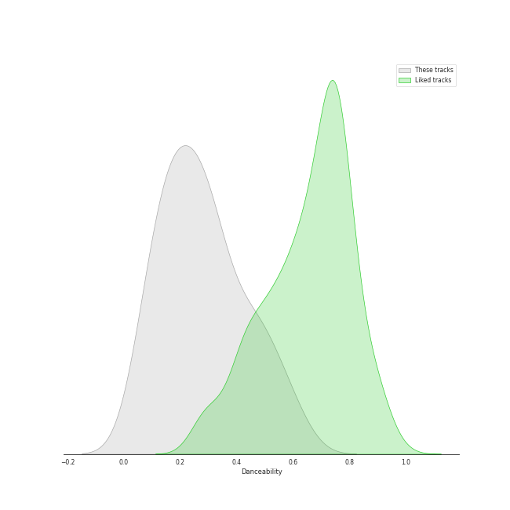
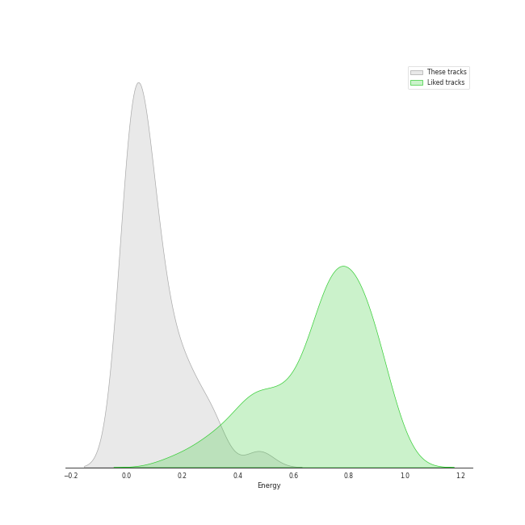
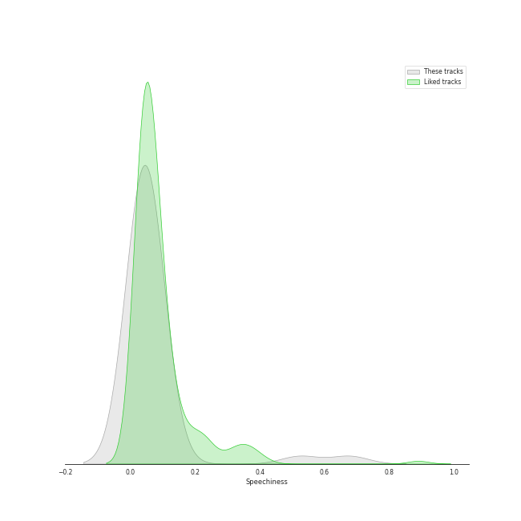
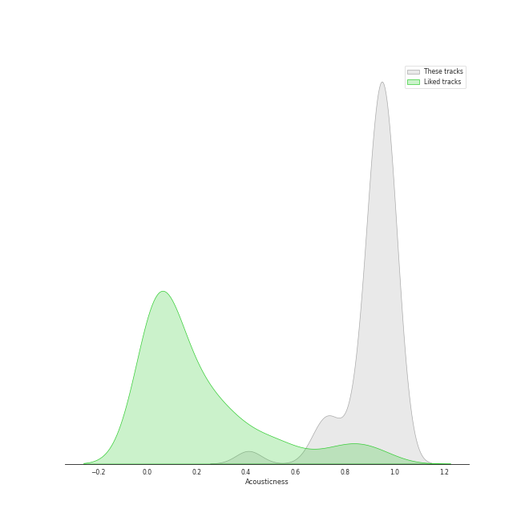
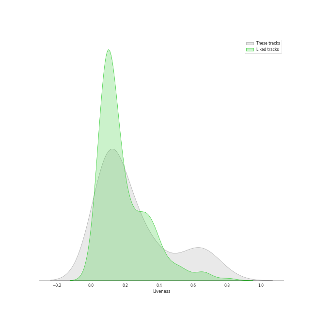
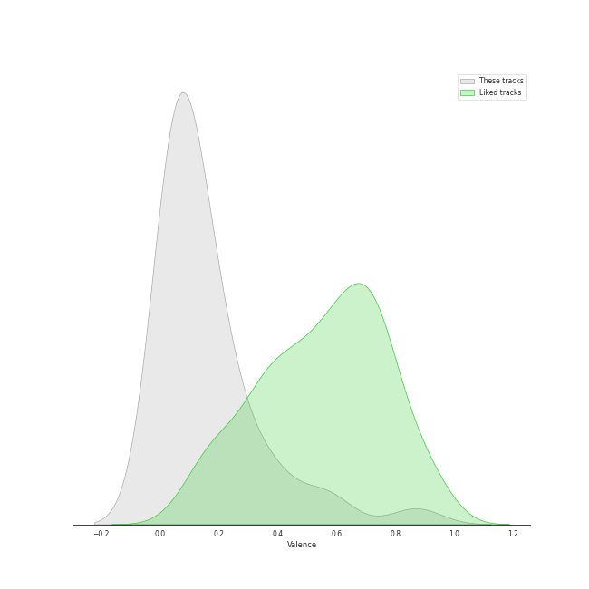
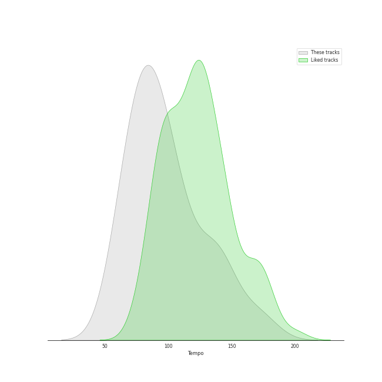

# Audio Features for Program Music

## Danceability

| ​ | 10 most Danceable tracks | ​​ | 10 least Danceable tracks |
|:---|:---|:---|:---|
|  | A Midsummer Night's Dream, Incidental Music, Op. 61: "Ay Me! For Aught That I Could Ever Read" (0.614) |  | The Planets, Op. 32: 7. Neptune, the Mystic (0.0601) |
|  | Pictures at an Exhibition (Orch. Ravel): V. Ballet of the Unhatched Chicks (0.571) |  | La Mer, L.109: 1. From Dawn Till Noon On The Sea (De l'aube à midi sur la mer) (0.0633) |
|  | Pictures at an Exhibition (Orch. Ravel): Promenade III (0.543) |  | Pictures at an Exhibition (Orch. Ravel): II. The Old Castle (0.0799) |
|  | A Midsummer Night's Dream, Incidental Music, Op. 61: No. 1, Scherzo (0.505) |  | The Planets, Op. 32: 2. Venus, the Bringer of Peace (0.0864) |
|  | A Midsummer Night's Dream, Incidental Music, Op. 61: No. 2, L'istesso tempo (0.485) |  | La Mer, L.109: 3. Dialogue Of The Wind And The Sea (0.0986) |
|  | Pictures at an Exhibition (Orch. Ravel): VII. The Market at Limoges (0.48) |  | Fauré Pavane (0.137) |
|  | A Midsummer Night's Dream, Incidental Music, Op. 61: No. 4, Andante (0.451) |  | Pictures at an Exhibition (Orch. Ravel): Promenade II (0.137) |
|  | A Midsummer Night's Dream, Incidental Music, Op. 61: No. 2a, Allegro vivace (0.438) |  | Pictures at an Exhibition (Orch. Ravel): X. The Great Gate of Kiev (0.143) |
|  | Pictures at an Exhibition (Orch. Ravel): III. Tuileries Gardens (0.422) |  | Pictures at an Exhibition (Orch. Ravel): VIIIa. Catacombae (Sepulchrum Romanum) (0.144) |
|  | A Midsummer Night's Dream, Incidental Music, Op. 61: No. 8, Andante (0.387) |  | The Planets, Op. 32: 5. Saturn, the Bringer of Old Age (0.153) |

## Energy

| ​ | 10 most Energetic tracks | ​​ | 10 least Energetic tracks |
|:---|:---|:---|:---|
|  | The Planets, Op. 32: 1. Mars, the Bringer of War (0.478) |  | Pictures at an Exhibition (Orch. Ravel): VIIIa. Catacombae (Sepulchrum Romanum) (0.000845) |
|  | Pictures at an Exhibition (Orch. Ravel): VII. The Market at Limoges (0.322) |  | Pictures at an Exhibition (Orch. Ravel): Promenade II (0.00371) |
|  | The Planets, Op. 32: 4. Jupiter, the Bringer of Jollity (0.297) |  | The Planets, Op. 32: 7. Neptune, the Mystic (0.00757) |
|  | The Planets, Op. 32: 6. Uranus, the Magician (0.294) |  | Pictures at an Exhibition (Orch. Ravel): II. The Old Castle (0.00788) |
|  | Night on Bald Mountain (0.219) |  | Pictures at an Exhibition (Orch. Ravel): VIIIb. Cum mortuis in lingua mortua (0.00794) |
|  | Pictures at an Exhibition (Orch. Ravel): X. The Great Gate of Kiev (0.219) |  | A Midsummer Night's Dream, Incidental Music, Op. 61: No. 4, Andante (0.0082) |
|  | Pictures at an Exhibition (Orch. Ravel): IX. The Hut on Chicken's Legs (0.218) |  | A Midsummer Night's Dream, Incidental Music, Op. 61: No. 8, Andante (0.00913) |
|  | Pictures at an Exhibition (Orch. Ravel): V. Ballet of the Unhatched Chicks (0.217) |  | The Planets, Op. 32: 2. Venus, the Bringer of Peace (0.00922) |
|  | La Mer, L.109: 3. Dialogue Of The Wind And The Sea (0.163) |  | A Midsummer Night's Dream, Incidental Music, Op. 61: No. 7, Nocturne. Con moto tranquillo (0.0115) |
|  | La Mer, L.109: 2. Play of the Waves (Jeux de vagues) (0.149) |  | The Planets, Op. 32: 5. Saturn, the Bringer of Old Age (0.0136) |

## Speechiness

| ​ | 10 most Speechy tracks | ​​ | 10 least Speechy tracks |
|:---|:---|:---|:---|
|  | A Midsummer Night's Dream, Incidental Music, Op. 61: No. 2, L'istesso tempo (0.676) |  | Pictures at an Exhibition (Orch. Ravel): IV. Bydlo (0.0311) |
|  | A Midsummer Night's Dream, Incidental Music, Op. 61: "Ay Me! For Aught That I Could Ever Read" (0.524) |  | A Midsummer Night's Dream, Incidental Music, Op. 61: No. 1, Scherzo (0.0314) |
|  | A Midsummer Night's Dream, Incidental Music, Op. 61: No. 2a, Allegro vivace (0.0884) |  | Pictures at an Exhibition (Orch. Ravel): Promenade III (0.0345) |
|  | A Midsummer Night's Dream, Incidental Music, Op. 61: No. 4, Andante (0.0791) |  | Pictures at an Exhibition (Orch. Ravel): X. The Great Gate of Kiev (0.0359) |
|  | A Midsummer Night's Dream, Incidental Music, Op. 61: No. 9, Hochzeitmarsch "Wedding March" - No. 12, Allegro vivace come primo (0.0636) |  | The Planets, Op. 32: 4. Jupiter, the Bringer of Jollity (0.037) |
|  | The Planets, Op. 32: 6. Uranus, the Magician (0.0633) |  | Fauré Pavane (0.0371) |
|  | A Midsummer Night's Dream, Incidental Music, Op. 61: No. 8, Andante (0.0574) |  | Pictures at an Exhibition (Orch. Ravel): IX. The Hut on Chicken's Legs (0.0371) |
|  | Pictures at an Exhibition (Orch. Ravel): I. Gnomus (0.0571) |  | Pictures at an Exhibition (Orch. Ravel): VIIIb. Cum mortuis in lingua mortua (0.0375) |
|  | Pictures at an Exhibition (Orch. Ravel): V. Ballet of the Unhatched Chicks (0.0532) |  | The Planets, Op. 32: 1. Mars, the Bringer of War (0.0381) |
|  | A Midsummer Night's Dream, Incidental Music, Op. 61: No. 5, Allegro appassionato (0.0502) |  | The Planets, Op. 32: 5. Saturn, the Bringer of Old Age (0.0382) |

## Acousticness

| ​ | 10 most Acoustic tracks | ​​ | 10 least Acoustic tracks |
|:---|:---|:---|:---|
|  | Pictures at an Exhibition (Orch. Ravel): Promenade II (0.994) |  | A Midsummer Night's Dream, Incidental Music, Op. 61: "Ay Me! For Aught That I Could Ever Read" (0.41) |
|  | Pictures at an Exhibition (Orch. Ravel): III. Tuileries Gardens (0.991) |  | A Midsummer Night's Dream, Incidental Music, Op. 61: No. 2, L'istesso tempo (0.69) |
|  | Pictures at an Exhibition (Orch. Ravel): VIIIa. Catacombae (Sepulchrum Romanum) (0.984) |  | A Midsummer Night's Dream, Incidental Music, Op. 61: No. 8, Andante (0.715) |
|  | Pictures at an Exhibition (Orch. Ravel): VII. The Market at Limoges (0.983) |  | A Midsummer Night's Dream, Incidental Music, Op. 61: No. 2a, Allegro vivace (0.745) |
|  | Pictures at an Exhibition (Orch. Ravel): V. Ballet of the Unhatched Chicks (0.982) |  | A Midsummer Night's Dream, Incidental Music, Op. 61: No. 4, Andante (0.75) |
|  | A Midsummer Night's Dream, Incidental Music, Op. 61: No. 7, Nocturne. Con moto tranquillo (0.981) |  | The Planets, Op. 32: 1. Mars, the Bringer of War (0.83) |
|  | Fauré Pavane (0.981) |  | La Mer, L.109: 3. Dialogue Of The Wind And The Sea (0.886) |
|  | Pictures at an Exhibition (Orch. Ravel): II. The Old Castle (0.98) |  | Overture to "A Midsummer Night's Dream", Op. 21: Allegro di molto (0.887) |
|  | Pictures at an Exhibition (Orch. Ravel): Promenade I (0.979) |  | A Midsummer Night's Dream, Incidental Music, Op. 61: Finale. Allegro di molto (0.891) |
|  | Pictures at an Exhibition (Orch. Ravel): Promenade III (0.975) |  | The Planets, Op. 32: 6. Uranus, the Magician (0.899) |

## Instrumentalness

| ​ | 10 most Instrumental tracks | ​​ | 10 least Instrumental tracks |
|:---|:---|:---|:---|
|  | Pictures at an Exhibition (Orch. Ravel): IV. Bydlo (0.983) |  | A Midsummer Night's Dream, Incidental Music, Op. 61: "Ay Me! For Aught That I Could Ever Read" (0.0) |
|  | Pictures at an Exhibition (Orch. Ravel): Promenade I (0.962) |  | A Midsummer Night's Dream, Incidental Music, Op. 61: No. 8, Andante (0.0) |
|  | A Midsummer Night's Dream, Incidental Music, Op. 61: No. 1, Scherzo (0.952) |  | A Midsummer Night's Dream, Incidental Music, Op. 61: No. 4, Andante (0.0) |
|  | Pictures at an Exhibition (Orch. Ravel): VIIIb. Cum mortuis in lingua mortua (0.95) |  | A Midsummer Night's Dream, Incidental Music, Op. 61: No. 2, L'istesso tempo (0.0) |
|  | Pictures at an Exhibition (Orch. Ravel): VII. The Market at Limoges (0.948) |  | A Midsummer Night's Dream, Incidental Music, Op. 61: Finale. Allegro di molto (3.2e-06) |
|  | The Planets, Op. 32: 4. Jupiter, the Bringer of Jollity (0.925) |  | A Midsummer Night's Dream, Incidental Music, Op. 61: No. 2a, Allegro vivace (1.33e-05) |
|  | The Planets, Op. 32: 5. Saturn, the Bringer of Old Age (0.922) |  | A Midsummer Night's Dream, Incidental Music, Op. 61: No. 3, Lied mit Chor (0.00137) |
|  | Pictures at an Exhibition (Orch. Ravel): X. The Great Gate of Kiev (0.903) |  | A Midsummer Night's Dream, Incidental Music, Op. 61: No. 5, Allegro appassionato (0.00512) |
|  | Pictures at an Exhibition (Orch. Ravel): II. The Old Castle (0.895) |  | Pictures at an Exhibition (Orch. Ravel): VIIIa. Catacombae (Sepulchrum Romanum) (0.0557) |
|  | La Mer, L.109: 3. Dialogue Of The Wind And The Sea (0.89) |  | A Midsummer Night's Dream, Incidental Music, Op. 61: No. 9, Hochzeitmarsch "Wedding March" - No. 12, Allegro vivace come primo (0.0798) |

## Liveness

| ​ | 10 most Live tracks | ​​ | 10 least Live tracks |
|:---|:---|:---|:---|
|  | Pictures at an Exhibition (Orch. Ravel): VIIIb. Cum mortuis in lingua mortua (0.767) |  | A Midsummer Night's Dream, Incidental Music, Op. 61: No. 3, Lied mit Chor (0.0609) |
|  | Pictures at an Exhibition (Orch. Ravel): IX. The Hut on Chicken's Legs (0.689) |  | The Planets, Op. 32: 7. Neptune, the Mystic (0.0614) |
|  | Pictures at an Exhibition (Orch. Ravel): VII. The Market at Limoges (0.65) |  | Pictures at an Exhibition (Orch. Ravel): Promenade IV (0.0644) |
|  | Pictures at an Exhibition (Orch. Ravel): I. Gnomus (0.648) |  | A Midsummer Night's Dream, Incidental Music, Op. 61: No. 9, Hochzeitmarsch "Wedding March" - No. 12, Allegro vivace come primo (0.0646) |
|  | Night on Bald Mountain (0.628) |  | Overture to "A Midsummer Night's Dream", Op. 21: Tempo primo (0.0675) |
|  | A Midsummer Night's Dream, Incidental Music, Op. 61: No. 4, Andante (0.626) |  | La Mer, L.109: 3. Dialogue Of The Wind And The Sea (0.0769) |
|  | A Midsummer Night's Dream, Incidental Music, Op. 61: No. 2a, Allegro vivace (0.539) |  | Swan Lake Suite, Op. 20a: II. Waltz (0.0875) |
|  | A Midsummer Night's Dream, Incidental Music, Op. 61: No. 8, Andante (0.488) |  | A Midsummer Night's Dream, Incidental Music, Op. 61: No. 7, Nocturne. Con moto tranquillo (0.0899) |
|  | Pictures at an Exhibition (Orch. Ravel): VI. Samuel Goldenberg und Schmuÿle (0.386) |  | Overture to "A Midsummer Night's Dream", Op. 21: Allegro di molto (0.0936) |
|  | A Midsummer Night's Dream, Incidental Music, Op. 61: No. 2, L'istesso tempo (0.354) |  | Pictures at an Exhibition (Orch. Ravel): Promenade II (0.0992) |

## Valence

| ​ | 10 most Happy tracks | ​​ | 10 least Happy tracks |
|:---|:---|:---|:---|
|  | Pictures at an Exhibition (Orch. Ravel): V. Ballet of the Unhatched Chicks (0.869) |  | The Planets, Op. 32: 2. Venus, the Bringer of Peace (0.0301) |
|  | A Midsummer Night's Dream, Incidental Music, Op. 61: No. 1, Scherzo (0.584) |  | The Planets, Op. 32: 7. Neptune, the Mystic (0.0305) |
|  | Pictures at an Exhibition (Orch. Ravel): VII. The Market at Limoges (0.536) |  | The Planets, Op. 32: 5. Saturn, the Bringer of Old Age (0.0316) |
|  | Pictures at an Exhibition (Orch. Ravel): Promenade III (0.397) |  | Pictures at an Exhibition (Orch. Ravel): II. The Old Castle (0.0345) |
|  | A Midsummer Night's Dream, Incidental Music, Op. 61: "Ay Me! For Aught That I Could Ever Read" (0.378) |  | La Mer, L.109: 3. Dialogue Of The Wind And The Sea (0.0351) |
|  | A Midsummer Night's Dream, Incidental Music, Op. 61: No. 2, L'istesso tempo (0.338) |  | A Midsummer Night's Dream, Incidental Music, Op. 61: No. 7, Nocturne. Con moto tranquillo (0.0353) |
|  | The Planets, Op. 32: 4. Jupiter, the Bringer of Jollity (0.279) |  | La Mer, L.109: 1. From Dawn Till Noon On The Sea (De l'aube à midi sur la mer) (0.0368) |
|  | Pictures at an Exhibition (Orch. Ravel): III. Tuileries Gardens (0.224) |  | La Mer, L.109: 2. Play of the Waves (Jeux de vagues) (0.0375) |
|  | Pictures at an Exhibition (Orch. Ravel): IX. The Hut on Chicken's Legs (0.221) |  | Pictures at an Exhibition (Orch. Ravel): VIIIb. Cum mortuis in lingua mortua (0.038) |
|  | Pictures at an Exhibition (Orch. Ravel): Promenade II (0.215) |  | Pictures at an Exhibition (Orch. Ravel): VIIIa. Catacombae (Sepulchrum Romanum) (0.0386) |

## Tempo

| ​ | 10 most Fast tracks | ​​ | 10 least Fast tracks |
|:---|:---|:---|:---|
|  | A Midsummer Night's Dream, Incidental Music, Op. 61: Finale. Allegro di molto (175.796) |  | The Planets, Op. 32: 7. Neptune, the Mystic (57.624) |
|  | Pictures at an Exhibition (Orch. Ravel): IX. The Hut on Chicken's Legs (165.944) |  | Pictures at an Exhibition (Orch. Ravel): I. Gnomus (60.214) |
|  | The Planets, Op. 32: 1. Mars, the Bringer of War (148.689) |  | La Mer, L.109: 1. From Dawn Till Noon On The Sea (De l'aube à midi sur la mer) (61.399) |
|  | Overture to "A Midsummer Night's Dream", Op. 21: Tempo primo (140.454) |  | Pictures at an Exhibition (Orch. Ravel): VIIIb. Cum mortuis in lingua mortua (68.548) |
|  | The Planets, Op. 32: 4. Jupiter, the Bringer of Jollity (139.855) |  | Night on Bald Mountain (68.687) |
|  | Overture to "A Midsummer Night's Dream", Op. 21: Allegro di molto (137.416) |  | A Midsummer Night's Dream, Incidental Music, Op. 61: No. 7, Nocturne. Con moto tranquillo (68.74) |
|  | A Midsummer Night's Dream, Incidental Music, Op. 61: No. 2a, Allegro vivace (137.327) |  | Pictures at an Exhibition (Orch. Ravel): X. The Great Gate of Kiev (69.224) |
|  | A Midsummer Night's Dream, Incidental Music, Op. 61: No. 1, Scherzo (134.158) |  | A Midsummer Night's Dream, Incidental Music, Op. 61: "Ay Me! For Aught That I Could Ever Read" (69.651) |
|  | Pictures at an Exhibition (Orch. Ravel): VII. The Market at Limoges (123.495) |  | Pictures at an Exhibition (Orch. Ravel): VIIIa. Catacombae (Sepulchrum Romanum) (71.322) |
|  | Pictures at an Exhibition (Orch. Ravel): VI. Samuel Goldenberg und Schmuÿle (113.888) |  | A Midsummer Night's Dream, Incidental Music, Op. 61: No. 2, L'istesso tempo (77.716) |
