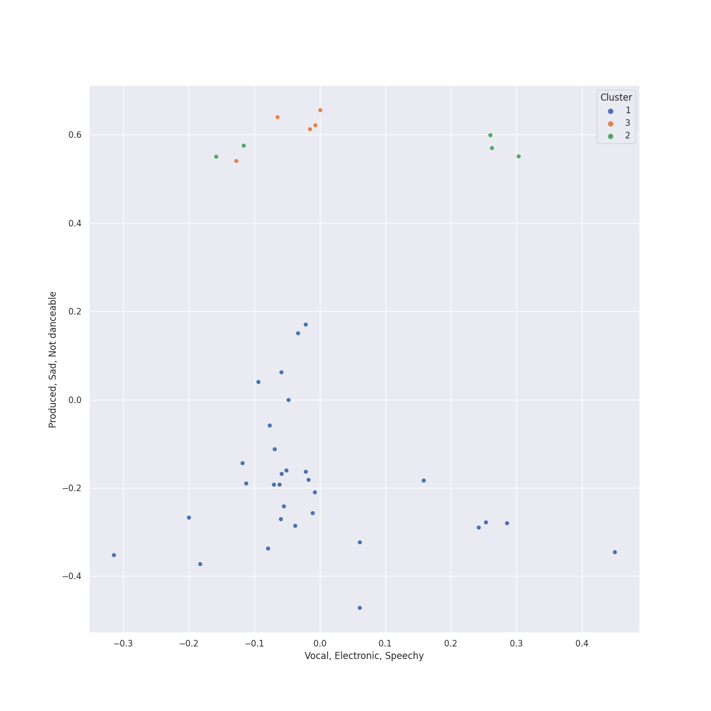

# Clusters in Program Music

## Cluster #1

31 tracks

| Art | Track | Album | Artists | Label | 💚 | 🔗 |
|:---|:---|:---|:---|:---|:---|:---|
|  | La Mer, L.109: 2. Play of the Waves (Jeux de vagues) | Debussy: La Mer; Jeux; Prélude à l'après-midi d'un faune; Le Martyre de Saint Sébastien (Symphonic Fragments) | Charles Dutoit, Claude Debussy, Orchestre Symphonique de Montréal | [Decca Music Group Ltd.](../../../../labels/decca_music_group_ltd_) | | [🔗](https://open.spotify.com/track/55lmbVc4FLYlbHaPqiVjv2) |
|  | Overture to "A Midsummer Night's Dream", Op. 21: Allegro di molto | Mendelssohn: A Midsummer Night's Dream | John Eliot Gardiner, London Symphony Orchestra, Felix Mendelssohn | [Lso Live](../../../../labels/lso_live) | | [🔗](https://open.spotify.com/track/7pz2npttELZeXmDgYfCDlE) |
|  | Fauré Pavane | Fauré Pavane | David Parry, Gabriel Fauré, London Philharmonic Orchestra | [Warner Music Group - X5 Music Group](../../../../labels/warner_music_group___x5_music_group) | | [🔗](https://open.spotify.com/track/2BzQ1604JsM3oNzaRYhnoG) |
|  | The Planets, Op. 32: 3. Mercury, the Winged Messenger | Holst: The Planets | Gustav Holst, Herbert von Karajan, Berliner Philharmoniker | [Deutsche Grammophon (DG)](../../../../labels/deutsche_grammophon__dg_) | | [🔗](https://open.spotify.com/track/4rehJ6QJSNLQCK3Rav7pAe) |
|  | The Planets, Op. 32: 6. Uranus, the Magician | Holst: The Planets | Gustav Holst, Herbert von Karajan, Berliner Philharmoniker | [Deutsche Grammophon (DG)](../../../../labels/deutsche_grammophon__dg_) | | [🔗](https://open.spotify.com/track/47fxroOKrDiF1KGNnuUFqr) |
|  | Pictures at an Exhibition (Orch. Ravel): Promenade I | Mussorgsky: Pictures At An Exhibition | Wiener Philharmoniker, Gustavo Dudamel, Modest Mussorgsky | [Deutsche Grammophon (DG)](../../../../labels/deutsche_grammophon__dg_) | | [🔗](https://open.spotify.com/track/4edX8xopbaXGJN8n1rW7Vk) |
|  | Pictures at an Exhibition (Orch. Ravel): Promenade IV | Mussorgsky: Pictures At An Exhibition | Wiener Philharmoniker, Gustavo Dudamel, Modest Mussorgsky | [Deutsche Grammophon (DG)](../../../../labels/deutsche_grammophon__dg_) | | [🔗](https://open.spotify.com/track/76T40WZcGyMDp187cQoWv1) |
|  | Pictures at an Exhibition (Orch. Ravel): VI. Samuel Goldenberg und Schmuÿle | Mussorgsky: Pictures At An Exhibition | Wiener Philharmoniker, Gustavo Dudamel, Modest Mussorgsky | [Deutsche Grammophon (DG)](../../../../labels/deutsche_grammophon__dg_) | | [🔗](https://open.spotify.com/track/0z8qN0Tn05N5wzFjDaHmMJ) |
|  | Pictures at an Exhibition (Orch. Ravel): X. The Great Gate of Kiev | Mussorgsky: Pictures At An Exhibition | Wiener Philharmoniker, Gustavo Dudamel, Modest Mussorgsky | [Deutsche Grammophon (DG)](../../../../labels/deutsche_grammophon__dg_) | | [🔗](https://open.spotify.com/track/0LA9d83t4o38aoXfFRIwJz) |
|  | Swan Lake Suite, Op. 20a: II. Waltz | Mussorgsky: Pictures At An Exhibition | Wiener Philharmoniker, Gustavo Dudamel, Pyotr Ilyich Tchaikovsky | [Deutsche Grammophon (DG)](../../../../labels/deutsche_grammophon__dg_) | | [🔗](https://open.spotify.com/track/0NOiSayyUFYnLllkTdFa1k) |
## Cluster #2

5 tracks

| Art | Track | Album | Artists | Label | 💚 | 🔗 |
|:---|:---|:---|:---|:---|:---|:---|
|  | A Midsummer Night's Dream, Incidental Music, Op. 61: "Ay Me! For Aught That I Could Ever Read" | Mendelssohn: A Midsummer Night's Dream | John Eliot Gardiner, Alexander Knox, Felix Mendelssohn | [Lso Live](../../../../labels/lso_live) | | [🔗](https://open.spotify.com/track/1EGPsb3zw2L5Q6ocFc3G83) |
|  | A Midsummer Night's Dream, Incidental Music, Op. 61: No. 2, L'istesso tempo | Mendelssohn: A Midsummer Night's Dream | John Eliot Gardiner, Alexander Knox, London Symphony Orchestra, Ceri-lyn Cissone, Felix Mendelssohn | [Lso Live](../../../../labels/lso_live) | | [🔗](https://open.spotify.com/track/68afyO04jLHCK9Na8cgsGR) |
|  | A Midsummer Night's Dream, Incidental Music, Op. 61: No. 2a, Allegro vivace | Mendelssohn: A Midsummer Night's Dream | John Eliot Gardiner, Alexander Knox, London Symphony Orchestra, Felix Mendelssohn, Frankie Wakefield | [Lso Live](../../../../labels/lso_live) | | [🔗](https://open.spotify.com/track/58VxRBZ7XFR3vWgNwz5fYT) |
|  | A Midsummer Night's Dream, Incidental Music, Op. 61: No. 4, Andante | Mendelssohn: A Midsummer Night's Dream | John Eliot Gardiner, London Symphony Orchestra, Ceri-lyn Cissone, Felix Mendelssohn, Frankie Wakefield | [Lso Live](../../../../labels/lso_live) | | [🔗](https://open.spotify.com/track/67eEYhol9DXQ65kUFt7jdk) |
|  | A Midsummer Night's Dream, Incidental Music, Op. 61: No. 8, Andante | Mendelssohn: A Midsummer Night's Dream | John Eliot Gardiner, Alexander Knox, London Symphony Orchestra, Ceri-lyn Cissone, Felix Mendelssohn, Frankie Wakefield | [Lso Live](../../../../labels/lso_live) | | [🔗](https://open.spotify.com/track/2QYtN5MiVrF7OJFpkJvLrS) |
## Cluster #3

5 tracks

| Art | Track | Album | Artists | Label | 💚 | 🔗 |
|:---|:---|:---|:---|:---|:---|:---|
|  | A Midsummer Night's Dream, Incidental Music, Op. 61: Finale. Allegro di molto | Mendelssohn: A Midsummer Night's Dream | The Monteverdi Choir, John Eliot Gardiner, Alexander Knox, London Symphony Orchestra, Ceri-lyn Cissone, Felix Mendelssohn, Frankie Wakefield | [Lso Live](../../../../labels/lso_live) | | [🔗](https://open.spotify.com/track/5iGRKlJcFcSx0PA4OGpiYD) |
|  | A Midsummer Night's Dream, Incidental Music, Op. 61: No. 3, Lied mit Chor | Mendelssohn: A Midsummer Night's Dream | The Monteverdi Choir, John Eliot Gardiner, London Symphony Orchestra, Ceri-lyn Cissone, Felix Mendelssohn | [Lso Live](../../../../labels/lso_live) | | [🔗](https://open.spotify.com/track/1dDvLHCOPEVgNhHtVnB2is) |
|  | A Midsummer Night's Dream, Incidental Music, Op. 61: No. 5, Allegro appassionato | Mendelssohn: A Midsummer Night's Dream | John Eliot Gardiner, Alexander Knox, London Symphony Orchestra, Ceri-lyn Cissone, Felix Mendelssohn | [Lso Live](../../../../labels/lso_live) | | [🔗](https://open.spotify.com/track/5XWKRz9i2PQWI3PsW0FmQj) |
|  | A Midsummer Night's Dream, Incidental Music, Op. 61: No. 9, Hochzeitmarsch "Wedding March" - No. 12, Allegro vivace come primo | Mendelssohn: A Midsummer Night's Dream | John Eliot Gardiner, Alexander Knox, London Symphony Orchestra, Felix Mendelssohn | [Lso Live](../../../../labels/lso_live) | | [🔗](https://open.spotify.com/track/1ipR2jLKKgr7X9xJyd54Kx) |
|  | Pictures at an Exhibition (Orch. Ravel): VIIIa. Catacombae (Sepulchrum Romanum) | Mussorgsky: Pictures At An Exhibition | Wiener Philharmoniker, Gustavo Dudamel, Modest Mussorgsky | [Deutsche Grammophon (DG)](../../../../labels/deutsche_grammophon__dg_) | | [🔗](https://open.spotify.com/track/6kXCQVQ1B0i7SqxF9cFAd7) |