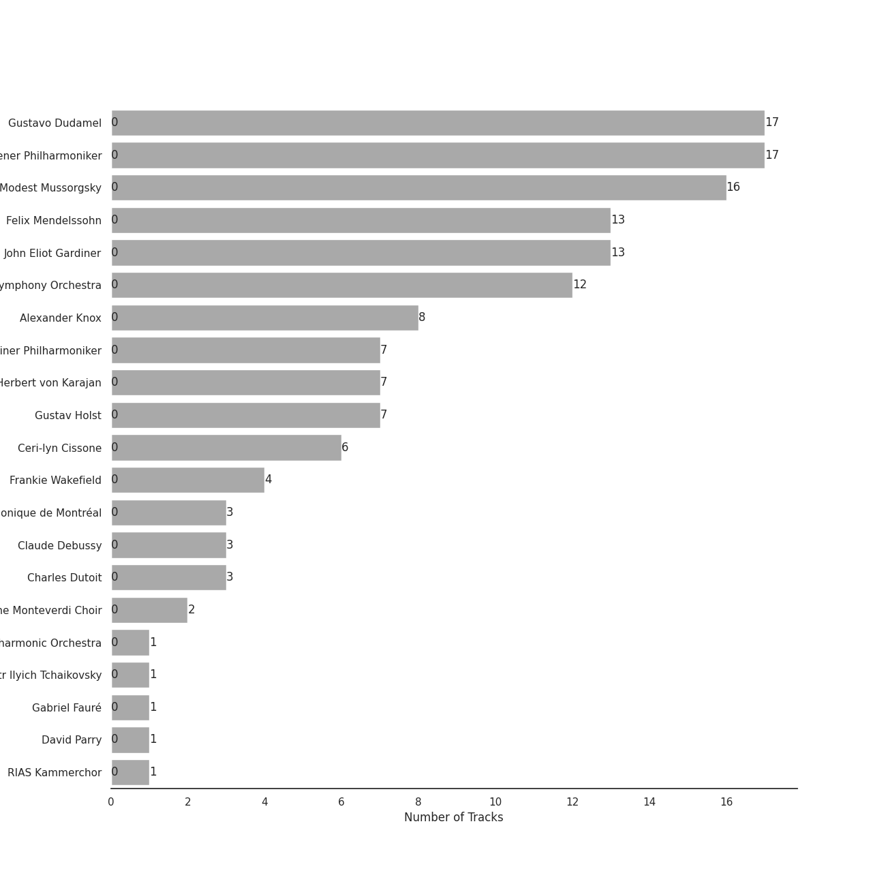
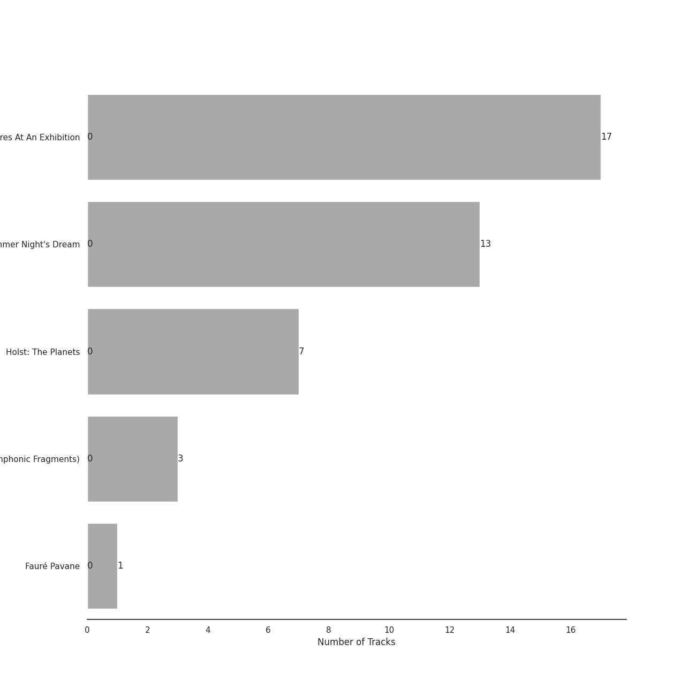
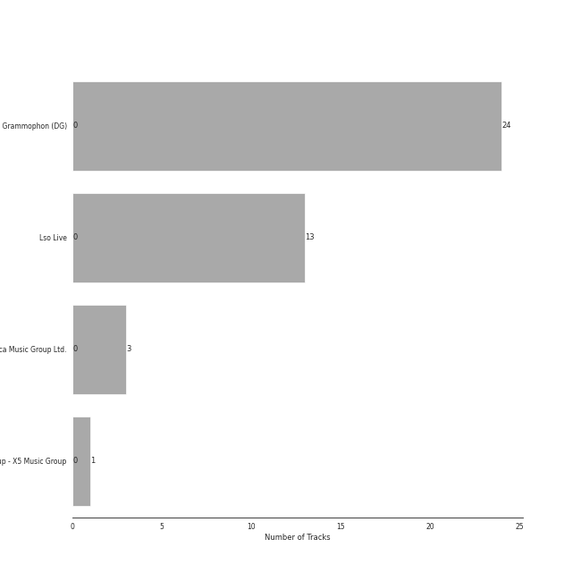
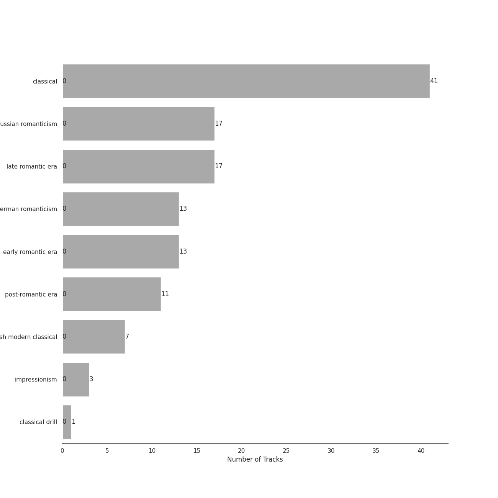
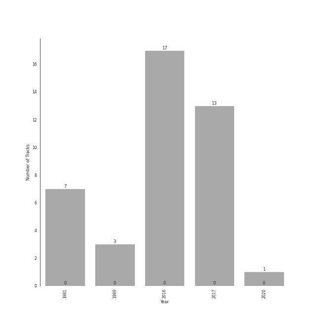

# Program Music

[41 tracks (0 liked) 🔗](https://open.spotify.com/playlist/1PyrZgdZpE6UzIA3lANOlR)

## Top Artists

| Art | Rank | Tracks | 💚 | Artist | 🔗 |
|:---|---:|---:|---:|:---|:---|
|  | 448 | 17 | 0 | Gustavo Dudamel | [🔗](https://open.spotify.com/artist/0cxXnDhpgxcMMkKddhORHY) |
|  | 448 | 17 | 0 | Wiener Philharmoniker | [🔗](https://open.spotify.com/artist/003f4bk13c6Q3gAUXv7dGJ) |
|  | 448 | 16 | 0 | Modest Mussorgsky | [🔗](https://open.spotify.com/artist/284mnx33IWcymQEpMxyfHl) |
|  | 448 | 13 | 0 | Felix Mendelssohn | [🔗](https://open.spotify.com/artist/6MF58APd3YV72Ln2eVg710) |
|  | 448 | 13 | 0 | John Eliot Gardiner | [🔗](https://open.spotify.com/artist/1qIRoGEKXINqrCx5N1engi) |
|  | 448 | 12 | 0 | [London Symphony Orchestra](../../artists/london_symphony_orchestra/overview.md) | [🔗](https://open.spotify.com/artist/5yxyJsFanEAuwSM5kOuZKc) |
| | 448 | 8 | 0 | Alexander Knox | [🔗](https://open.spotify.com/artist/4vzwv4zzBTlG8qsFCqP2Yv) |
|  | 448 | 7 | 0 | [Berliner Philharmoniker](../../artists/berliner_philharmoniker/overview.md) | [🔗](https://open.spotify.com/artist/6uRJnvQ3f8whVnmeoecv5Z) |
|  | 448 | 7 | 0 | [Herbert von Karajan](../../artists/herbert_von_karajan/overview.md) | [🔗](https://open.spotify.com/artist/5zCaQxjl110XTrm4LQ1CxY) |
|  | 448 | 7 | 0 | Gustav Holst | [🔗](https://open.spotify.com/artist/5B7uXBeLc2TkR5Jk23qKIZ) |

See all 21 artists

| Art | Rank | Tracks | 💚 | Artist | 🔗 |
|:---|---:|---:|---:|:---|:---|
| | 448 | 6 | 0 | Ceri-lyn Cissone | [🔗](https://open.spotify.com/artist/6F3jOFmhUwRxRdWAZU6G1A) |
| | 448 | 4 | 0 | Frankie Wakefield | [🔗](https://open.spotify.com/artist/7jobsaZIFhejECE605yxx6) |
|  | 448 | 3 | 0 | Orchestre Symphonique de Montréal | [🔗](https://open.spotify.com/artist/4AcXapei4U7xnWecv9AEBd) |
|  | 448 | 3 | 0 | Claude Debussy | [🔗](https://open.spotify.com/artist/1Uff91EOsvd99rtAupatMP) |
|  | 448 | 3 | 0 | Charles Dutoit | [🔗](https://open.spotify.com/artist/0Ku5VBNL7cfGXRhp2BxXEQ) |
|  | 448 | 2 | 0 | The Monteverdi Choir | [🔗](https://open.spotify.com/artist/0Cqfz92flAzrp94pgN1jEW) |
|  | 448 | 1 | 0 | London Philharmonic Orchestra | [🔗](https://open.spotify.com/artist/3PfJE6ebCbCHeuqO4BfNeA) |
|  | 448 | 1 | 0 | [Pyotr Ilyich Tchaikovsky](../../artists/pyotr_ilyich_tchaikovsky/overview.md) | [🔗](https://open.spotify.com/artist/3MKCzCnpzw3TjUYs2v7vDA) |
|  | 448 | 1 | 0 | Gabriel Fauré | [🔗](https://open.spotify.com/artist/2gClsBep1tt1rv1CN210SO) |
|  | 448 | 1 | 0 | David Parry | [🔗](https://open.spotify.com/artist/2dfDjeZroUd3LWmSFrAZCD) |
|  | 448 | 1 | 0 | RIAS Kammerchor | [🔗](https://open.spotify.com/artist/2UVXU77knJMYOM6Avvw6Yx) |

## Top Tracks

Most and least listened tracks

| Rank | ​ | Most listened tracks | Rank | ​​ | Least listened tracks |
|---:|:---|:---|---:|:---|:---|
| 1054 |  | Pictures at an Exhibition (Orch. Ravel): Promenade III | 1054 |  | Overture to "A Midsummer Night's Dream", Op. 21: Allegro di molto |
| 1054 |  | Pictures at an Exhibition (Orch. Ravel): X. The Great Gate of Kiev | 1054 |  | Pictures at an Exhibition (Orch. Ravel): Promenade II |
| 1054 |  | [Swan Lake Suite, Op. 20a: II. Waltz](../../artists/pyotr_ilyich_tchaikovsky/overview.md) | 1054 |  | Pictures at an Exhibition (Orch. Ravel): II. The Old Castle |
| 1054 |  | The Planets, Op. 32: II. Venus, the Bringer of Peace | 1054 |  | Pictures at an Exhibition (Orch. Ravel): Promenade IV |
| 1054 |  | Pictures at an Exhibition (Orch. Ravel): VI. Samuel Goldenberg und Schmuÿle | 1054 |  | Pictures at an Exhibition (Orch. Ravel): V. Ballet of the Unhatched Chicks |
| 1054 |  | The Planets, Op. 32: I. Mars, the Bringer of War | 1054 |  | Pictures at an Exhibition (Orch. Ravel): VIIIa. Catacombae (Sepulchrum Romanum) |
| 1054 |  | A Midsummer Night's Dream, Incidental Music, Op. 61: "Ay Me! For Aught That I Could Ever Read" | 1054 |  | Night on Bald Mountain |
| 1054 |  | The Planets, Op. 32: VII. Neptune, the Mystic | 1054 |  | The Planets, Op. 32: V. Saturn, the Bringer of Old Age |
| 1054 |  | Pictures at an Exhibition (Orch. Ravel): IV. Bydlo | 1054 |  | A Midsummer Night's Dream, Incidental Music, Op. 61: No. 2, L'istesso tempo |
| 1054 |  | A Midsummer Night's Dream, Incidental Music, Op. 61: No. 3, Lied mit Chor | 1054 |  | A Midsummer Night's Dream, Incidental Music, Op. 61: No. 4, Andante |

## Top Albums

| Art | Rank | Tracks | 💚 | Album | Release Date | 🔗 |
|:---|---:|---:|---:|:---|:---|:---|
|  | 690 | 17 | 0 | Mussorgsky: Pictures At An Exhibition | 2016-12-02 | [🔗](https://open.spotify.com/album/1b2aoeaYZZBWmJoavOQhnd) |
|  | 690 | 13 | 0 | Mendelssohn: A Midsummer Night's Dream | 2017-02-03 | [🔗](https://open.spotify.com/album/60J66evwnrnfH03HgDTrwN) |
|  | 690 | 7 | 0 | Holst: The Planets | 1981-01-01 | [🔗](https://open.spotify.com/album/4v0Xyz0LVToUsSTGdsvKSK) |
|  | 690 | 3 | 0 | Debussy: La Mer; Jeux; Prélude à l'après-midi d'un faune; Le Martyre de Saint Sébastien (Symphonic Fragments) | 1989-01-01 | [🔗](https://open.spotify.com/album/5egJ0o1mVH2liUfecDWYqk) |
|  | 690 | 1 | 0 | Fauré Pavane | 2020-05-30 | [🔗](https://open.spotify.com/album/0FaQ2LW8NNG3YXYJXFikJF) |

## Top Record Labels

| Tracks | 💚 | Label |
|---:|---:|:---|
| 24 | 0 | [Deutsche Grammophon (DG)](../../labels/deutsche_grammophon_(dg)/overview.md) |
| 13 | 0 | [Lso Live](../../labels/lso_live/overview.md) |
| 3 | 0 | [Decca Music Group Ltd.](../../labels/decca_music_group_ltd_/overview.md) |
| 1 | 0 | [Warner Music Group - X5 Music Group](../../labels/warner_music_group_-_x5_music_group/overview.md) |

## Genres

| Tracks | 💚 | Genre |
|---:|---:|:---|
| 41 | 0 | [classical](../../genres/classical/overview.md) |
| 17 | 0 | [russian romanticism](../../genres/russian_romanticism/overview.md) |
| 17 | 0 | [late romantic era](../../genres/late_romantic_era/overview.md) |
| 16 | 0 | [early modern classical](../../genres/early_modern_classical/overview.md) |
| 13 | 0 | [german romanticism](../../genres/german_romanticism/overview.md) |
| 13 | 0 | [early romantic era](../../genres/early_romantic_era/overview.md) |
| 11 | 0 | [post-romantic era](../../genres/post-romantic_era/overview.md) |
| 7 | 0 | british modern classical |
| 3 | 0 | impressionism |

## Years

| ​ | 10 newest albums | ​​ | 10 oldest albums |
|:---|:---|:---|:---|
|  | Fauré Pavane (2020-05-30) |  | Holst: The Planets (1981-01-01) |
|  | Mendelssohn: A Midsummer Night's Dream (2017-02-03) |  | Debussy: La Mer; Jeux; Prélude à l'après-midi d'un faune; Le Martyre de Saint Sébastien (Symphonic Fragments) (1989-01-01) |
|  | Mussorgsky: Pictures At An Exhibition (2016-12-02) |  | Mussorgsky: Pictures At An Exhibition (2016-12-02) |
|  | Debussy: La Mer; Jeux; Prélude à l'après-midi d'un faune; Le Martyre de Saint Sébastien (Symphonic Fragments) (1989-01-01) |  | Mendelssohn: A Midsummer Night's Dream (2017-02-03) |
|  | Holst: The Planets (1981-01-01) |  | Fauré Pavane (2020-05-30) |