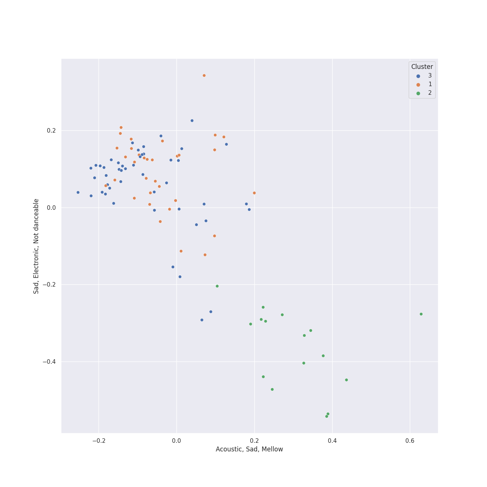

# Clusters in R&B

## Cluster #1

52 tracks

| Art | Track | Album | Artists | Label | Rank | 💚 | 🔗 |
|:---|:---|:---|:---|:---|---:|:---|:---|
|  | 24K Magic | 24K Magic | [Bruno Mars](../../../../artists/bruno_mars/overview.md) | [Atlantic Records](../../../../labels/atlantic_records) | 1018 | | [🔗](https://open.spotify.com/track/6b8Be6ljOzmkOmFslEb23P) |
|  | Love's Train | Love's Train | [Bruno Mars](../../../../artists/bruno_mars/overview.md), Anderson .Paak, Silk Sonic | [Aftermath Entertainment/Atlantic](../../../../labels/atlantic_records) | 1018 | | [🔗](https://open.spotify.com/track/60gTdTwaNtGAzIxKfeGVfJ) |
|  | Tightrope (feat. Big Boi) - Big Boi Vocal Edit | The ArchAndroid | [Janelle Monáe](../../../../artists/janelle_monáe/overview.md), Big Boi | [Bad Boy/Wondaland](../../../../labels/bad_boy) | 1018 | 💚 | [🔗](https://open.spotify.com/track/1ljzHUgt2SU2ADkhfa9eBC) |
|  | S&M | Loud | [Rihanna](../../../../artists/rihanna/overview.md) | [Def Jam Recordings](../../../../labels/def_jam_recordings) | 1018 | 💚 | [🔗](https://open.spotify.com/track/08Bfk5Y2S5fCxgxk371Eel) |
|  | Disturbia | Good Girl Gone Bad: Reloaded | [Rihanna](../../../../artists/rihanna/overview.md) | [Def Jam Recordings](../../../../labels/def_jam_recordings) | 1018 | 💚 | [🔗](https://open.spotify.com/track/2VOomzT6VavJOGBeySqaMc) |
|  | Naughty Girl | Dangerously In Love | [Beyoncé](../../../../artists/beyoncé/overview.md) | [Columbia](../../../../labels/columbia) | 1018 | 💚 | [🔗](https://open.spotify.com/track/0YGQ3hZcRLC5YX7o0hdmHg) |
|  | Signed, Sealed, Delivered (I'm Yours) | Signed, Sealed And Delivered | Stevie Wonder | [MOTOWN](../../../../labels/motown), [UNI](../../../../labels/uni) | 1018 | 💚 | [🔗](https://open.spotify.com/track/2eF8pWbiivYsYRpbntYsnc) |
|  | Swalla (feat. Nicki Minaj & Ty Dolla $ign) | Swalla (feat. Nicki Minaj & Ty Dolla $ign) | [Jason Derulo](../../../../artists/jason_derulo/overview.md), Nicki Minaj, Ty Dolla $ign | [Beluga Heights/Warner Records](../../../../labels/warner_records) | 1018 | | [🔗](https://open.spotify.com/track/6kex4EBAj0WHXDKZMEJaaF) |
|  | When I Get You Alone | A Beautiful World | Robin Thicke | Nu America Music | 1018 | 💚 | [🔗](https://open.spotify.com/track/1jzWQHcMT8rxvgUjUiqGIH) |
|  | Hit 'Em Up Style (Oops!) | Bittersweet | Blu Cantrell | Arista | 1018 | 💚 | [🔗](https://open.spotify.com/track/3flAV51ACbtIcEixb0QeZv) |
## Cluster #2

43 tracks

| Art | Track | Album | Artists | Label | Rank | 💚 | 🔗 |
|:---|:---|:---|:---|:---|---:|:---|:---|
|  | Electric Lady (feat. Solange) | The Electric Lady | [Janelle Monáe](../../../../artists/janelle_monáe/overview.md), Roman GianArthur, Solange | [Bad Boy/Wondaland](../../../../labels/bad_boy) | 1018 | 💚 | [🔗](https://open.spotify.com/track/69vzkewKl2LPquyEiqD8BB) |
|  | Yoga | Yoga | [Janelle Monáe](../../../../artists/janelle_monáe/overview.md), Jidenna | [Wondaland Records/Epic](../../../../labels/epic) | 648 | 💚 | [🔗](https://open.spotify.com/track/3IJCSQoLF4YzPAKaxq2JLb) |
|  | Love On The Brain | ANTI (Deluxe) | [Rihanna](../../../../artists/rihanna/overview.md) | Roc Nation / Rihanna | 1018 | 💚 | [🔗](https://open.spotify.com/track/5oO3drDxtziYU2H1X23ZIp) |
|  | Sure Thing | All I Want Is You | Miguel | [Jive](../../../../labels/jive) | 1018 | 💚 | [🔗](https://open.spotify.com/track/0JXXNGljqupsJaZsgSbMZV) |
|  | Best Thing I Never Had | 4 | [Beyoncé](../../../../artists/beyoncé/overview.md) | [Columbia](../../../../labels/columbia), [Parkwood Entertainment](../../../../labels/parkwood_entertainment) | 1018 | | [🔗](https://open.spotify.com/track/3lBRNqXjPp2j3JMTCXDTNO) |
|  | Truth Hurts | Cuz I Love You (Deluxe) | Lizzo | [Nice Life/Atlantic](../../../../labels/atlantic_records) | 1018 | 💚 | [🔗](https://open.spotify.com/track/5qmq61DAAOUaW8AUo8xKhh) |
|  | Wet The Bed (feat. Ludacris) | F.A.M.E. (Expanded Edition) | Chris Brown, Ludacris | [Jive](../../../../labels/jive) | 1018 | | [🔗](https://open.spotify.com/track/2xRGPubKBTHX6iyrpQvtCy) |
|  | Preach | Preach | John Legend | [Columbia](../../../../labels/columbia) | 1018 | | [🔗](https://open.spotify.com/track/2AaF78iCWISMWYog5RnSi5) |
|  | Kill Bill | SOS | SZA | [Top Dawg Entertainment/RCA Records](../../../../labels/rca_records_label) | 368 | 💚 | [🔗](https://open.spotify.com/track/3OHfY25tqY28d16oZczHc8) |
|  | Snooze | SOS | SZA | [Top Dawg Entertainment/RCA Records](../../../../labels/rca_records_label) | 1018 | 💚 | [🔗](https://open.spotify.com/track/4iZ4pt7kvcaH6Yo8UoZ4s2) |
## Cluster #3

24 tracks

| Art | Track | Album | Artists | Label | Rank | 💚 | 🔗 |
|:---|:---|:---|:---|:---|---:|:---|:---|
|  | Desert Rose | High Highs to Low Lows | Lolo Zouaï | [Keep It On The Lolo/RCA Records](../../../../labels/rca_records_label) | 1018 | | [🔗](https://open.spotify.com/track/0HUdWSPyrr98kiAdR3Mvyp) |
|  | Best Part (feat. H.E.R.) | Freudian | Daniel Caesar, H.E.R. | Golden Child Recordings | 1018 | 💚 | [🔗](https://open.spotify.com/track/1RMJOxR6GRPsBHL8qeC2ux) |
|  | Who Hurt You? | Who Hurt You? | Daniel Caesar | Golden Child Recordings | 1018 | | [🔗](https://open.spotify.com/track/23c9gmiiv7RCu7twft0Mym) |
|  | I'd Rather Go Blind | Tell Mama | Etta James | [Geffen](../../../../labels/geffen) | 1018 | 💚 | [🔗](https://open.spotify.com/track/1kPBT8S2wJFNAyBMnGVZgL) |
|  | All of Me | Love In The Future (Expanded Edition) | John Legend | [G.O.O.D. Music/Columbia](../../../../labels/columbia) | 1018 | 💚 | [🔗](https://open.spotify.com/track/3U4isOIWM3VvDubwSI3y7a) |
|  | Heartbreak Anniversary | TAKE TIME | Giveon | [Epic/Not So Fast](../../../../labels/epic) | 1018 | 💚 | [🔗](https://open.spotify.com/track/3FAJ6O0NOHQV8Mc5Ri6ENp) |
|  | How Can I | How Can I | H 3 F | H 3 F | 1018 | 💚 | [🔗](https://open.spotify.com/track/3Ka0IJwEvxI3ssqbF48SWZ) |
|  | If I Ain't Got You | The Diary Of Alicia Keys | Alicia Keys | J Records | 1018 | 💚 | [🔗](https://open.spotify.com/track/3XVBdLihbNbxUwZosxcGuJ) |
|  | City Burns | Cheers to the Fall | Andra Day | [Warner Records/Buskin](../../../../labels/warner_records) | 1018 | 💚 | [🔗](https://open.spotify.com/track/5hL8VGl2wsLWSXPiTq3Fdk) |
|  | Mushroom Chocolate (with 6LACK) | LUCID | QUIN, 6LACK | [Fantasy Soul/Interscope Records](../../../../labels/interscope_records) | 1018 | 💚 | [🔗](https://open.spotify.com/track/6DEhBd4RGr8MbSAtSNNtai) |