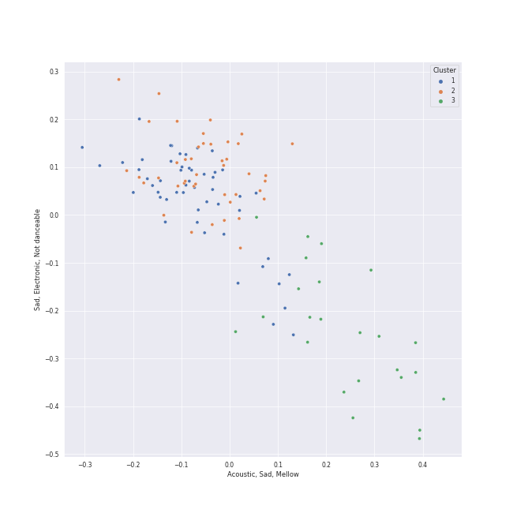

# Clusters in R&B

## Cluster #1

30 tracks

| Art | Track | Album | Artists | Label | 💚 | 🔗 |
|:---|:---|:---|:---|:---|:---|:---|
|  | Gone | Pandora : Beneath the Paradise, Pt. 3 (Original Television Soundtrack) | AILEE | [Genie Music Corporation](../../../../labels/genie_music_corporation) | | [🔗](https://open.spotify.com/track/4Xfix99TcepR0aGFVW8kYN) |
|  | Best Thing I Never Had | 4 | [Beyoncé](../../../../artists/beyonc_/overview.md) | [Parkwood Entertainment/Columbia](../../../../labels/columbia) | | [🔗](https://open.spotify.com/track/3lBRNqXjPp2j3JMTCXDTNO) |
|  | Grenade | Doo-Wops & Hooligans | [Bruno Mars](../../../../artists/bruno_mars/overview.md) | [Atlantic Records](../../../../labels/atlantic_records) | 💚 | [🔗](https://open.spotify.com/track/2tJulUYLDKOg9XrtVkMgcJ) |
|  | Wet The Bed (feat. Ludacris) | F.A.M.E. (Expanded Edition) | Ludacris, Chris Brown | [Jive](../../../../labels/jive) | 💚 | [🔗](https://open.spotify.com/track/2xRGPubKBTHX6iyrpQvtCy) |
|  | Easy | Commodores | Commodores | [Motown](../../../../labels/motown) | 💚 | [🔗](https://open.spotify.com/track/1JQ6Xm1JrvHfvAqhl5pwaA) |
|  | Sincerely, Jane | Metropolis: The Chase Suite (Special Edition) | Janelle Monáe | Bad Boy Records | 💚 | [🔗](https://open.spotify.com/track/06I6iDFVtZDGcRu9BgHraA) |
|  | Preach | Preach | John Legend | [Columbia](../../../../labels/columbia) | | [🔗](https://open.spotify.com/track/2AaF78iCWISMWYog5RnSi5) |
|  | Truth Hurts | Cuz I Love You (Deluxe) | Lizzo | [Nice Life/Atlantic](../../../../labels/atlantic_records) | 💚 | [🔗](https://open.spotify.com/track/5qmq61DAAOUaW8AUo8xKhh) |
|  | Love On The Brain | ANTI (Deluxe) | [Rihanna](../../../../artists/rihanna/overview.md) | Roc Nation / Rihanna | 💚 | [🔗](https://open.spotify.com/track/5oO3drDxtziYU2H1X23ZIp) |
|  | There Goes My Baby | Raymond v Raymond (Expanded Edition) | Usher | LaFace Records | 💚 | [🔗](https://open.spotify.com/track/6IUiqtI8tE49sqGbmtrNd8) |
## Cluster #2

51 tracks

| Art | Track | Album | Artists | Label | 💚 | 🔗 |
|:---|:---|:---|:---|:---|:---|:---|
|  | Crazy In Love (feat. Jay-Z) | Dangerously In Love | JAY-Z, [Beyoncé](../../../../artists/beyonc_/overview.md) | [Columbia](../../../../labels/columbia) | | [🔗](https://open.spotify.com/track/5IVuqXILoxVWvWEPm82Jxr) |
|  | Hit 'Em Up Style (Oops!) | Bittersweet | Blu Cantrell | Arista | 💚 | [🔗](https://open.spotify.com/track/3flAV51ACbtIcEixb0QeZv) |
|  | 24K Magic | 24K Magic | [Bruno Mars](../../../../artists/bruno_mars/overview.md) | [Atlantic Records](../../../../labels/atlantic_records) | | [🔗](https://open.spotify.com/track/6b8Be6ljOzmkOmFslEb23P) |
|  | Leave The Door Open | An Evening With Silk Sonic | [Bruno Mars](../../../../artists/bruno_mars/overview.md), Anderson .Paak, Silk Sonic | [Aftermath Entertainment/Atlantic](../../../../labels/atlantic_records) | 💚 | [🔗](https://open.spotify.com/track/4pryE6cN2gFL1FVF5fYINl) |
|  | Love's Train | Love's Train | [Bruno Mars](../../../../artists/bruno_mars/overview.md), Anderson .Paak, Silk Sonic | [Aftermath Entertainment/Atlantic](../../../../labels/atlantic_records) | | [🔗](https://open.spotify.com/track/60gTdTwaNtGAzIxKfeGVfJ) |
|  | Bootylicious | Survivor | Destiny's Child | [Columbia](../../../../labels/columbia) | | [🔗](https://open.spotify.com/track/31CsLSgn0HdZEVC8Bnnmvr) |
|  | Tightrope (feat. Big Boi) - Big Boi Vocal Edit | The ArchAndroid | Big Boi, Janelle Monáe | Bad Boy/Wondaland | 💚 | [🔗](https://open.spotify.com/track/1ljzHUgt2SU2ADkhfa9eBC) |
|  | Swalla (feat. Nicki Minaj & Ty Dolla $ign) | Swalla (feat. Nicki Minaj & Ty Dolla $ign) | Jason Derulo, Nicki Minaj, Ty Dolla $ign | [Beluga Heights/Warner Records](../../../../labels/warner_records) | | [🔗](https://open.spotify.com/track/6kex4EBAj0WHXDKZMEJaaF) |
|  | Disturbia | Good Girl Gone Bad: Reloaded | [Rihanna](../../../../artists/rihanna/overview.md) | [Def Jam Recordings](../../../../labels/def_jam_recordings) | 💚 | [🔗](https://open.spotify.com/track/2VOomzT6VavJOGBeySqaMc) |
|  | Signed, Sealed, Delivered (I'm Yours) | Signed, Sealed And Delivered | Stevie Wonder | [MOTOWN](../../../../labels/motown), [UNI](../../../../labels/uni) | 💚 | [🔗](https://open.spotify.com/track/2eF8pWbiivYsYRpbntYsnc) |
## Cluster #3

15 tracks

| Art | Track | Album | Artists | Label | 💚 | 🔗 |
|:---|:---|:---|:---|:---|:---|:---|
|  | Ave Maria | I AM...SASHA FIERCE | [Beyoncé](../../../../artists/beyonc_/overview.md) | [Music World Music/Columbia](../../../../labels/columbia) | | [🔗](https://open.spotify.com/track/1j9HwUMSkRUeVFRWlHcFsy) |
|  | When I Was Your Man | Unorthodox Jukebox | [Bruno Mars](../../../../artists/bruno_mars/overview.md) | [Atlantic Records](../../../../labels/atlantic_records) | 💚 | [🔗](https://open.spotify.com/track/0nJW01T7XtvILxQgC5J7Wh) |
|  | Best Part (feat. H.E.R.) | Freudian | Daniel Caesar, H.E.R. | Golden Child Recordings | 💚 | [🔗](https://open.spotify.com/track/1RMJOxR6GRPsBHL8qeC2ux) |
|  | Who Hurt You? | Who Hurt You? | Daniel Caesar | Golden Child Recordings | | [🔗](https://open.spotify.com/track/23c9gmiiv7RCu7twft0Mym) |
|  | I'd Rather Go Blind | Tell Mama | Etta James | [Geffen](../../../../labels/geffen) | 💚 | [🔗](https://open.spotify.com/track/1kPBT8S2wJFNAyBMnGVZgL) |
|  | How Can I | How Can I | H 3 F | H 3 F | 💚 | [🔗](https://open.spotify.com/track/3Ka0IJwEvxI3ssqbF48SWZ) |
|  | Unknown (To You) | Village | Jacob Banks | UMGRI Interscope | 💚 | [🔗](https://open.spotify.com/track/4jDDaKTqcZQWvgubuW6N7l) |
|  | Trumpets | Talk Dirty | Jason Derulo | [Beluga Heights/Warner Records](../../../../labels/warner_records) | 💚 | [🔗](https://open.spotify.com/track/5KONnBIQ9LqCxyeSPin26k) |
|  | All of Me | Love In The Future (Expanded Edition) | John Legend | [G.O.O.D. Music/Columbia](../../../../labels/columbia) | 💚 | [🔗](https://open.spotify.com/track/3U4isOIWM3VvDubwSI3y7a) |
|  | Mushroom Chocolate (with 6LACK) | LUCID | QUIN, 6LACK | [Fantasy Soul/Interscope Records](../../../../labels/interscope_records) | 💚 | [🔗](https://open.spotify.com/track/6DEhBd4RGr8MbSAtSNNtai) |