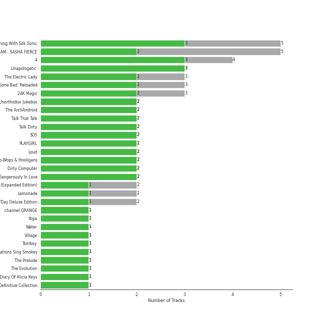
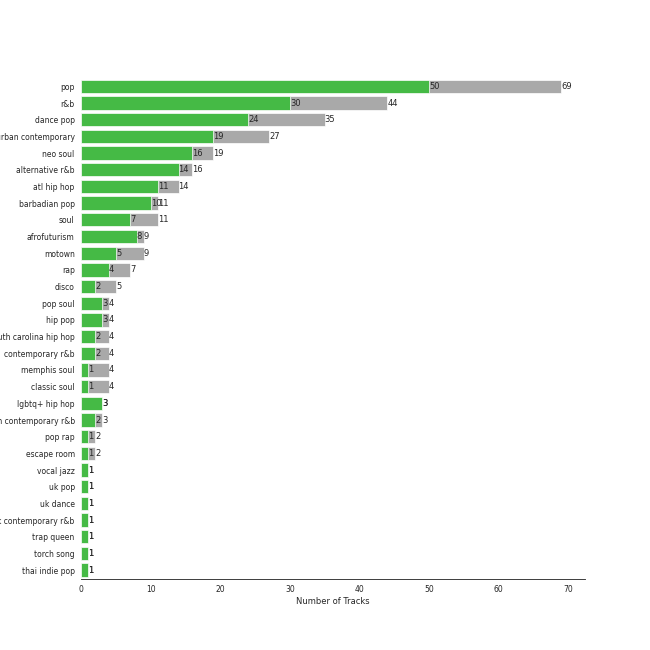
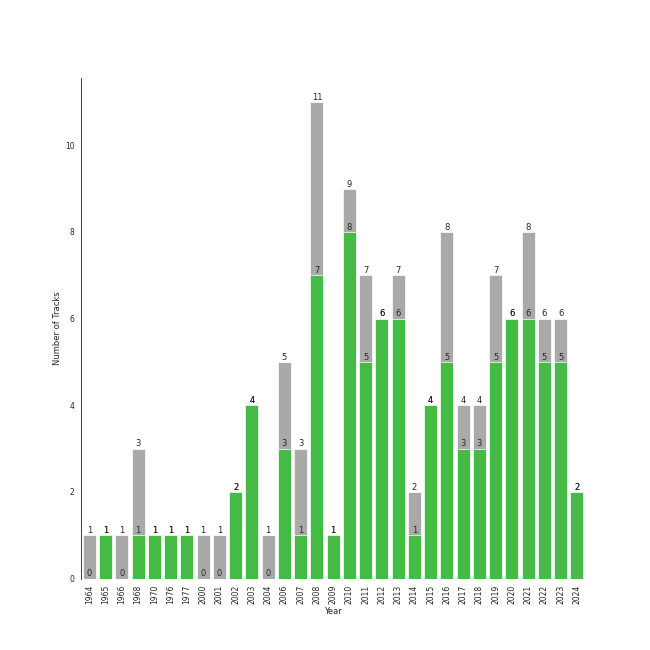

# R&B

[90 songs](tracks.md)

## Top Artists

See all 58 artists

| Number of Tracks | Art | Artist | 🔗 |
|---:|:---|:---|:---|
| 15 |  | [Beyoncé](../../artists/beyonc_.md) | [🔗](https://open.spotify.com/artist/6vWDO969PvNqNYHIOW5v0m) |
| 11 |  | [Rihanna](../../artists/rihanna.md) | [🔗](https://open.spotify.com/artist/5pKCCKE2ajJHZ9KAiaK11H) |
| 10 |  | [Bruno Mars](../../artists/bruno_mars.md) | [🔗](https://open.spotify.com/artist/0du5cEVh5yTK9QJze8zA0C) |
| 6 |  | Jason Derulo | [🔗](https://open.spotify.com/artist/07YZf4WDAMNwqr4jfgOZ8y) |
| 5 |  | Janelle Monáe | [🔗](https://open.spotify.com/artist/6ueGR6SWhUJfvEhqkvMsVs) |
| 4 |  | Stevie Wonder | [🔗](https://open.spotify.com/artist/7guDJrEfX3qb6FEbdPA5qi) |
| 4 |  | The Temptations | [🔗](https://open.spotify.com/artist/3RwQ26hR2tJtA8F9p2n7jG) |
| 4 |  | Usher | [🔗](https://open.spotify.com/artist/23zg3TcAtWQy7J6upgbUnj) |
| 3 |  | John Legend | [🔗](https://open.spotify.com/artist/5y2Xq6xcjJb2jVM54GHK3t) |
| 2 |  | Silk Sonic | [🔗](https://open.spotify.com/artist/6PvvGcCY2XtUcSRld1Wilr) |
| 2 |  | Doja Cat | [🔗](https://open.spotify.com/artist/5cj0lLjcoR7YOSnhnX0Po5) |
| 2 |  | JAY-Z | [🔗](https://open.spotify.com/artist/3nFkdlSjzX9mRTtwJOzDYB) |
| 2 |  | Anderson .Paak | [🔗](https://open.spotify.com/artist/3jK9MiCrA42lLAdMGUZpwa) |
| 2 |  | Ludacris | [🔗](https://open.spotify.com/artist/3ipn9JLAPI5GUEo4y4jcoi) |
| 2 |  | Daniel Caesar | [🔗](https://open.spotify.com/artist/20wkVLutqVOYrc0kxFs7rA) |
| 2 |  | The Weeknd | [🔗](https://open.spotify.com/artist/1Xyo4u8uXC1ZmMpatF05PJ) |
| 1 |  | Lil Jon | [🔗](https://open.spotify.com/artist/7sfl4Xt5KmfyDs2T3SVSMK) |
| 1 |  | Lil Nas X | [🔗](https://open.spotify.com/artist/7jVv8c5Fj3E9VhNjxT4snq) |
| 1 |  | Ty Dolla $ign | [🔗](https://open.spotify.com/artist/7c0XG5cIJTrrAgEC3ULPiq) |
| 1 |  | Chris Brown | [🔗](https://open.spotify.com/artist/7bXgB6jMjp9ATFy66eO08Z) |
| 1 |  | Calvin Harris | [🔗](https://open.spotify.com/artist/7CajNmpbOovFoOoasH2HaY) |
| 1 |  | André 3000 | [🔗](https://open.spotify.com/artist/74V3dE1a51skRkdII8y2C6) |
| 1 |  | Blu Cantrell | [🔗](https://open.spotify.com/artist/6vytZ677lz4LzCrUDcDokM) |
| 1 |  | Commodores | [🔗](https://open.spotify.com/artist/6twIAGnYuIT1pncMAsXnEm) |
| 1 |  | H 3 F | [🔗](https://open.spotify.com/artist/6jIK3obS1fJqb3Vu74AYX3) |
| 1 |  | Destiny Rogers | [🔗](https://open.spotify.com/artist/6gezkje7GoJlQbHBgLXHuu) |
| 1 |  | Ella Eyre | [🔗](https://open.spotify.com/artist/66TrUkUZ3RM29dqeDQRgyA) |
| 1 |  | B.o.B | [🔗](https://open.spotify.com/artist/5ndkK3dpZLKtBklKjxNQwT) |
| 1 |  | CeeLo Green | [🔗](https://open.spotify.com/artist/5nLYd9ST4Cnwy6NHaCxbj8) |
| 1 |  | Juicy J | [🔗](https://open.spotify.com/artist/5gCRApTajqwbnHHPbr2Fpi) |
| 1 |  | Gnarls Barkley | [🔗](https://open.spotify.com/artist/5SbkVQYYzlw1kte75QIabH) |
| 1 |  | Tyga | [🔗](https://open.spotify.com/artist/5LHRHt1k9lMyONurDHEdrp) |
| 1 |  | Lizzo | [🔗](https://open.spotify.com/artist/56oDRnqbIiwx4mymNEv7dS) |
| 1 |  | Cardi B | [🔗](https://open.spotify.com/artist/4kYSro6naA4h99UJvo89HB) |
| 1 |  | Jidenna | [🔗](https://open.spotify.com/artist/4TsHKU8l8Wq7n7OPVikirn) |
| 1 |  | 6LACK | [🔗](https://open.spotify.com/artist/4IVAbR2w4JJNJDDRFP3E83) |
| 1 |  | The Foundations | [🔗](https://open.spotify.com/artist/4GITZM5LCR2KcdlgEOrNLD) |
| 1 |  | QUIN | [🔗](https://open.spotify.com/artist/3sHS70DMNgPxRqx2fUNrRA) |
| 1 |  | Jhorrmountain | [🔗](https://open.spotify.com/artist/3aAX2y0amckZ7WcWoz2f2o) |
| 1 |  | H.E.R. | [🔗](https://open.spotify.com/artist/3Y7RZ31TRPVadSFVy1o8os) |
| 1 |  | Puri | [🔗](https://open.spotify.com/artist/3ADyFy1orEwODaiHmRRMQp) |
| 1 |  | Miguel | [🔗](https://open.spotify.com/artist/360IAlyVv4PCEVjgyMZrxK) |
| 1 |  | Big Boi | [🔗](https://open.spotify.com/artist/2ht3wxeT69CzyKFChNnNAB) |
| 1 |  | Frank Ocean | [🔗](https://open.spotify.com/artist/2h93pZq0e7k5yf4dywlkpM) |
| 1 |  | Jordin Sparks | [🔗](https://open.spotify.com/artist/2AQjGvtT0pFYfxR3neFcvz) |
| 1 |  | Corinne Bailey Rae | [🔗](https://open.spotify.com/artist/29WzbAQtDnBJF09es0uddn) |
| 1 |  | Cassie | [🔗](https://open.spotify.com/artist/27FGXRNruFoOdf1vP8dqcH) |
| 1 |  | Ne-Yo | [🔗](https://open.spotify.com/artist/21E3waRsmPlU7jZsS13rcj) |
| 1 |  | Mikky Ekko | [🔗](https://open.spotify.com/artist/1buzCmyYZE4kcdLRudsb8V) |
| 1 |  | Destiny's Child | [🔗](https://open.spotify.com/artist/1Y8cdNmUJH7yBTd9yOvr5i) |
| 1 |  | Pink Sweat$ | [🔗](https://open.spotify.com/artist/1W7FNibLa0O0b572tB2w7t) |
| 1 |  | 2 Chainz | [🔗](https://open.spotify.com/artist/17lzZA2AlOHwCwFALHttmp) |
| 1 |  | Etta James | [🔗](https://open.spotify.com/artist/0iOVhN3tnSvgDbcg25JoJb) |
| 1 |  | Nicki Minaj | [🔗](https://open.spotify.com/artist/0hCNtLu0JehylgoiP8L4Gh) |
| 1 |  | Jenevieve | [🔗](https://open.spotify.com/artist/0dUYLC7DLjeS8gIh8cz2Pq) |
| 1 |  | Robin Thicke | [🔗](https://open.spotify.com/artist/0ZrpamOxcZybMHGg1AYtHP) |
| 1 |  | Pitbull | [🔗](https://open.spotify.com/artist/0TnOYISbd1XYRBk9myaseg) |
| 1 |  | Jacob Banks | [🔗](https://open.spotify.com/artist/0AepkoQhYvkjEzzwIcGxdV) |

## Top Albums

See all 69 albums

| Number of Tracks | Art | Album | Release Date | 🔗 |
|---:|:---|:---|:---|:---|
| 4 |  | I AM...SASHA FIERCE | 2008-11-14 | [🔗](https://open.spotify.com/album/23Y5wdyP5byMFktZf8AcWU) |
| 4 |  | 4 | 2011-06-24 | [🔗](https://open.spotify.com/album/1gIC63gC3B7o7FfpPACZQJ) |
| 3 |  | Unapologetic (Deluxe) | 2012-12-11 | [🔗](https://open.spotify.com/album/4eddbruVtOqw8khwxSH6H2) |
| 3 |  | Good Girl Gone Bad: Reloaded | 2008-06-02 | [🔗](https://open.spotify.com/album/3JSWZWeTHF4HDGt5Eozdy7) |
| 3 |  | 24K Magic | 2016-11-17 | [🔗](https://open.spotify.com/album/4PgleR09JVnm3zY1fW3XBA) |
| 2 |  | Unorthodox Jukebox | 2012-12-07 | [🔗](https://open.spotify.com/album/58ufpQsJ1DS5kq4hhzQDiI) |
| 2 |  | Talk That Talk | 2011-11-19 | [🔗](https://open.spotify.com/album/1Kw1bVd07oRqcjrcjQKC8T) |
| 2 |  | Talk Dirty | 2013-09-10 | [🔗](https://open.spotify.com/album/4PeZu0It7qVrTG40t3HM9A) |
| 2 |  | Raymond v Raymond (Expanded Edition) | 2010-03-30 | [🔗](https://open.spotify.com/album/6A1F3Fkq5dYeYYNkXflcTX) |
| 2 |  | Loud | 2010-11-16 | [🔗](https://open.spotify.com/album/6UHhmTLl9T1scRYLmpHcDX) |
| 2 |  | Lemonade | 2016-04-23 | [🔗](https://open.spotify.com/album/7dK54iZuOxXFarGhXwEXfF) |
| 2 |  | Doo-Wops & Hooligans | 2010-10-05 | [🔗](https://open.spotify.com/album/1uyf3l2d4XYwiEqAb7t7fX) |
| 2 |  | Dirty Computer | 2018-04-27 | [🔗](https://open.spotify.com/album/2PjlaxlMunGOUvcRzlTbtE) |
| 2 |  | B'Day Deluxe Edition | 2007-05-29 | [🔗](https://open.spotify.com/album/0Zd10MKN5j9KwUST0TdBBB) |
| 1 |  | channel ORANGE | 2012-07-10 | [🔗](https://open.spotify.com/album/392p3shh2jkxUxY2VHvlH8) |
| 1 |  | Yoga | 2015-03-31 | [🔗](https://open.spotify.com/album/5rzxGeVyCV74SvV5hjLRAU) |
| 1 |  | Who Hurt You? | 2018-10-16 | [🔗](https://open.spotify.com/album/15M9pZ8gsdoN67yLjyQ039) |
| 1 |  | Village | 2018-11-02 | [🔗](https://open.spotify.com/album/2KxC2M0bVm5hrK3GgGMuV9) |
| 1 |  | Tomboy | 2019-02-28 | [🔗](https://open.spotify.com/album/2uDZBeyyQ7mfwF9mUJeYUG) |
| 1 |  | The Temptations Sing Smokey | 1965-03-22 | [🔗](https://open.spotify.com/album/45tweuKI0zdh8zgKo05cTw) |
| 1 |  | The Prelude | 2020-07-17 | [🔗](https://open.spotify.com/album/3Qj2vsFzmaB8jcH6Q60WIG) |
| 1 |  | The Foundations | 1968-01-01 | [🔗](https://open.spotify.com/album/3j1kw5l2mEeKCUuXXwjhWp) |
| 1 |  | The Definitive Collection | 2002-10-29 | [🔗](https://open.spotify.com/album/4E1itnJOhTMRSATNaxh0Sq) |
| 1 |  | The ArchAndroid | 2010-05-17 | [🔗](https://open.spotify.com/album/7MvSB0JTdtl1pSwZcgvYQX) |
| 1 |  | Tell Mama | 1968-04-18 | [🔗](https://open.spotify.com/album/4ReJ59T4YxC62WkfyVTWpr) |
| 1 |  | Tattoos (Deluxe Edition) | 2013-09-10 | [🔗](https://open.spotify.com/album/3wDeTllVvayYsWTHsFNWZQ) |
| 1 |  | Swalla (feat. Nicki Minaj & Ty Dolla $ign) | 2017-02-23 | [🔗](https://open.spotify.com/album/2e5CxfyEwBW115beiwh7Mc) |
| 1 |  | Survivor | 2001-05-01 | [🔗](https://open.spotify.com/album/480AZOo2VQ1kf3GedAiKV9) |
| 1 |  | St. Elsewhere | 2006-05-02 | [🔗](https://open.spotify.com/album/7p2aWivr9OLXocSTTKtG9B) |
| 1 |  | Songs In The Key Of Life | 1976-09-28 | [🔗](https://open.spotify.com/album/6YUCc2RiXcEKS9ibuZxjt0) |
| 1 |  | Signed, Sealed And Delivered | 1970-08-07 | [🔗](https://open.spotify.com/album/54ootLtDyMZFr9obtWQvvO) |
| 1 |  | Preach | 2019-02-15 | [🔗](https://open.spotify.com/album/32r4o1R9a1lK5DoVXGEC7E) |
| 1 |  | Planet Her | 2021-06-25 | [🔗](https://open.spotify.com/album/1nAQbHeOWTfQzbOoFrvndW) |
| 1 |  | Music From The Motion Picture Cadillac Records | 2008-11-28 | [🔗](https://open.spotify.com/album/4b2zuwf7CPesdiTg1kFDjU) |
| 1 |  | Metropolis: The Chase Suite (Special Edition) | 2008-08-12 | [🔗](https://open.spotify.com/album/3T3bJi3cvwR5U7ihwgEwF1) |
| 1 |  | Meet The Temptations | 1964 | [🔗](https://open.spotify.com/album/199rfdL0k6q5ReLA7V4KMt) |
| 1 |  | MONTERO (Call Me By Your Name) | 2021-03-31 | [🔗](https://open.spotify.com/album/2Hjcfw8zHN4dJDZJGOzLd6) |
| 1 |  | Love's Train | 2022-02-14 | [🔗](https://open.spotify.com/album/6QKXGIgwWmWBMmIktMOchR) |
| 1 |  | Love In The Future (Expanded Edition) | 2013-08-30 | [🔗](https://open.spotify.com/album/4OTAx9un4e6NfoHuVRiOrC) |
| 1 |  | LUCID | 2019-11-15 | [🔗](https://open.spotify.com/album/5qQhQ1rmPjqQgv8RmfaQU3) |
| 1 |  | Jordin Sparks | 2007-11-20 | [🔗](https://open.spotify.com/album/6JCNOvp9UeMrFuXwNW0JW6) |
| 1 |  | In My Own Words | 2006-01-01 | [🔗](https://open.spotify.com/album/6gkwOLmk0ALMOjWs5WhAEr) |
| 1 |  | I Don't Mind (feat. Juicy J) | 2014-11-21 | [🔗](https://open.spotify.com/album/5BAqg5IJQ7XFKfdoCiOlJw) |
| 1 |  | How Can I | 2019-06-23 | [🔗](https://open.spotify.com/album/3qEib9B2LiOpc81jRYC4Fi) |
| 1 |  | Gettin' Ready (Expanded Edition) | 1966 | [🔗](https://open.spotify.com/album/3RE8NUULcBzFvVtCmlI4lb) |
| 1 |  | Freudian | 2017-08-25 | [🔗](https://open.spotify.com/album/3xybjP7r2VsWzwvDQipdM0) |
| 1 |  | For Once In My Life | 1968-12-01 | [🔗](https://open.spotify.com/album/3pPBbp1Nl9n1AM9xFpdKtZ) |
| 1 |  | Finesse (Remix) [feat. Cardi B] | 2017-12-20 | [🔗](https://open.spotify.com/album/3mumK2ar9b4JPhVOZR0V2p) |
| 1 |  | F.A.M.E. (Expanded Edition) | 2011-03-22 | [🔗](https://open.spotify.com/album/6df0qvkMXoyHGt9J8cujZb) |
| 1 |  | Evolver | 2008-10-27 | [🔗](https://open.spotify.com/album/11sKu4dBGvmEZTuVw9EC9A) |
| 1 |  | Everything Is 4 | 2015-05-29 | [🔗](https://open.spotify.com/album/59eUYETmE1zi31ESb3SUkI) |
| 1 |  | Ella Eyre | 2015-01-12 | [🔗](https://open.spotify.com/album/5J69OYtRXeI9dHDK2R95h5) |
| 1 |  | Dangerously In Love | 2003-06-24 | [🔗](https://open.spotify.com/album/6oxVabMIqCMJRYN1GqR3Vf) |
| 1 |  | Cuz I Love You (Deluxe) | 2019-05-03 | [🔗](https://open.spotify.com/album/74gSdSHe71q7urGWMMn3qB) |
| 1 |  | Coño | 2020-07-03 | [🔗](https://open.spotify.com/album/1h3x5tLWXhf438Y5AK60Ml) |
| 1 |  | Corinne Bailey Rae | 2006-01-01 | [🔗](https://open.spotify.com/album/141Mp3P2VKHQMhtkW1DyQg) |
| 1 |  | Confessions (Expanded Edition) | 2004-03-23 | [🔗](https://open.spotify.com/album/1RM6MGv6bcl6NrAG8PGoZk) |
| 1 |  | Commodores | 1977-01-01 | [🔗](https://open.spotify.com/album/2tzbNCAUTmW4MIM2Ulvrwl) |
| 1 |  | Cassie (U.S. Version) | 2006-08-07 | [🔗](https://open.spotify.com/album/0j1qzjaJmsF1FkcICf3hRu) |
| 1 |  | Boss Bitch | 2020-01-23 | [🔗](https://open.spotify.com/album/4pmyFpGicLLIgNPc1TQXKc) |
| 1 |  | Bittersweet | 2003 | [🔗](https://open.spotify.com/album/3UviDOQkc4WbXkNi6DIBZu) |
| 1 |  | Baby Powder | 2020-03-25 | [🔗](https://open.spotify.com/album/3nqQxvxUB95Bi2UBseY1u1) |
| 1 |  | BEYONCÉ [Platinum Edition] | 2014-11-24 | [🔗](https://open.spotify.com/album/2UJwKSBUz6rtW4QLK74kQu) |
| 1 |  | An Evening With Silk Sonic | 2021-11-11 | [🔗](https://open.spotify.com/album/1YgekJJTEueWDaMr7BYqPk) |
| 1 |  | All I Want Is You | 2010-11-26 | [🔗](https://open.spotify.com/album/493HYe7N5pleudEZRyhE7R) |
| 1 |  | After Hours | 2020-03-20 | [🔗](https://open.spotify.com/album/4yP0hdKOZPNshxUOjY0cZj) |
| 1 |  | ANTI (Deluxe) | 2016-01-28 | [🔗](https://open.spotify.com/album/4UlGauD7ROb3YbVOFMgW5u) |
| 1 |  | A Beautiful World | 2002-12-13 | [🔗](https://open.spotify.com/album/76wI74XuASLFrY9pUVLhO9) |
| 1 |  | 20th Century Masters: The Millennium Collection: Best Of The Temptations, Vol. 2 - The '70s, '80s, '90s | 2000-01-11 | [🔗](https://open.spotify.com/album/2kzUxFepw1uLjbgqV537eP) |

## Top Record Labels

See all 42 labels

| Number of Tracks | Label |
|---:|:---|
| 20 | [Columbia](../../labels/columbia.md) |
| 13 | [Atlantic Records](../../labels/atlantic_records.md) |
| 10 | [Def Jam Recordings](../../labels/def_jam_recordings.md) |
| 9 | [MOTOWN](../../labels/motown.md) |
| 7 | Parkwood Entertainment |
| 5 | [Warner Records](../../labels/warner_records.md) |
| 5 | UNI |
| 5 | Music World Music |
| 5 | Beluga Heights |
| 5 | Bad Boy |
| 3 | LaFace Records |
| 2 | Wondaland |
| 2 | [RCA Records Label](../../labels/rca_records_label.md) |
| 2 | [Jive](../../labels/jive.md) |
| 2 | Golden Child Recordings |
| 2 | G.O.O.D. Music |
| 2 | Aftermath Entertainment |
| 1 | [Virgin Records](../../labels/virgin_records.md) |
| 1 | UMGRI Interscope |
| 1 | Spinnin' Records |
| 1 | Roc Nation |
| 1 | Rihanna |
| 1 | [Republic Records](../../labels/republic_records.md) |
| 1 | Red Zone Entertainment |
| 1 | Nu America Music |
| 1 | Not specified |
| 1 | Nice Life |
| 1 | Kemosabe Records |
| 1 | JOYFACE Records |
| 1 | [Interscope Records](../../labels/interscope_records.md) |
| 1 | IDJ |
| 1 | H 3 F |
| 1 | Geffen |
| 1 | Fantasy Soul |
| 1 | [Epic](../../labels/epic.md) |
| 1 | EMI |
| 1 | Downtown Recordings |
| 1 | Def Soul |
| 1 | Castle Communications |
| 1 | Arista |
| 1 | ATL |
| 1 | 19 Recordings Limited |

## Genres

See all 49 genres

| Number of Tracks | Genre |
|---:|:---|
| 66 | [pop](../../genres/pop.md) |
| 46 | [dance pop](../../genres/dance_pop.md) |
| 32 | [r&b](../../genres/r_b.md) |
| 24 | urban contemporary |
| 12 | soul |
| 12 | neo soul |
| 11 | barbadian pop |
| 10 | atl hip hop |
| 9 | funk |
| 8 | [post-teen pop](../../genres/post_teen_pop.md) |
| 8 | motown |
| 6 | pop rap |
| 6 | edm |
| 6 | alternative r&b |
| 6 | [adult standards](../../genres/adult_standards.md) |
| 5 | quiet storm |
| 5 | [neo mellow](../../genres/neo_mellow.md) |
| 5 | [electropop](../../genres/electropop.md) |
| 5 | contemporary r&b |
| 5 | afrofuturism |
| 4 | south carolina hip hop |
| 4 | pop soul |
| 4 | memphis soul |
| 4 | hip pop |
| 4 | classic soul |
| 3 | canadian contemporary r&b |
| 2 | lgbtq+ hip hop |
| 2 | indie r&b |
| 2 | chill r&b |
| 1 | vocal jazz |
| 1 | uk pop |
| 1 | uk contemporary r&b |
| 1 | tropical house |
| 1 | trap queen |
| 1 | torch song |
| 1 | thai indie pop |
| 1 | soul blues |
| 1 | [soft rock](../../genres/soft_rock.md) |
| 1 | minnesota hip hop |
| 1 | [mellow gold](../../genres/mellow_gold.md) |
| 1 | jazz blues |
| 1 | hip hop |
| 1 | girl group |
| 1 | escape room |
| 1 | disco |
| 1 | canadian pop |
| 1 | bubblegum pop |
| 1 | british soul |
| 1 | bedroom soul |

## Years

| 10 newest albums | 10 oldest albums |
|:---|:---|
| 
 Love's Train (2022-02-14)
 | 
 Meet The Temptations (1964)
 |
| 
 An Evening With Silk Sonic (2021-11-11)
 | 
 The Temptations Sing Smokey (1965-03-22)
 |
| 
 Planet Her (2021-06-25)
 | 
 Gettin' Ready (Expanded Edition) (1966)
 |
| 
 MONTERO (Call Me By Your Name) (2021-03-31)
 | 
 The Foundations (1968-01-01)
 |
| 
 The Prelude (2020-07-17)
 | 
 Tell Mama (1968-04-18)
 |
| 
 Coño (2020-07-03)
 | 
 For Once In My Life (1968-12-01)
 |
| 
 Baby Powder (2020-03-25)
 | 
 Signed, Sealed And Delivered (1970-08-07)
 |
| 
 After Hours (2020-03-20)
 | 
 Songs In The Key Of Life (1976-09-28)
 |
| 
 Boss Bitch (2020-01-23)
 | 
 Commodores (1977-01-01)
 |
| 
 LUCID (2019-11-15)
 | 
 20th Century Masters: The Millennium Collection: Best Of The Temptations, Vol. 2 - The '70s, '80s, '90s (2000-01-11)
 |
## Audio Features

| 10 most Danceable tracks | 10 least Danceable tracks |
|:---|:---|
| Coño (0.899) | I'd Rather Go Blind (0.326) |
| Yeah! (feat. Lil Jon & Ludacris) (0.894) | Ave Maria (0.35) |
| I Don't Mind (feat. Juicy J) (0.87) | Unknown (To You) (0.367) |
| Make Me Feel (0.859) | Half Of Me (0.391) |
| Bubblegum (feat. Tyga) (0.856) | What Now (0.402) |
| That's What I Like (0.853) | Partition (0.418) |
| Bootylicious (0.835) | All of Me (0.422) |
| Crazy (0.835) | Listen (From the Motion Picture "Dreamgirls") (0.432) |
| Don't Stop The Music (0.835) | Irreplaceable (0.447) |
| You Right (0.828) | So Sick (0.452) |

| 10 most Energetic tracks | 10 least Energetic tracks |
|:---|:---|
| Boss Bitch (0.955) | All of Me (0.264) |
| Green Light (feat. André 3000) (0.882) | When I Was Your Man (0.28) |
| DJ Got Us Fallin' In Love (feat. Pitbull) (0.861) | Stay (0.31) |
| Finesse - Remix; feat. Cardi B (0.859) | Thinkin Bout You (0.339) |
| When I Get You Alone (0.857) | Best Part (feat. H.E.R.) (0.364) |
| Bootylicious (0.833) | Easy (0.384) |
| Umbrella (0.829) | Hold Up (0.397) |
| Isn't She Lovely (0.826) | Ave Maria (0.403) |
| Sweet Dreams (0.825) | Papa Was A Rollin' Stone - Single Version (0.405) |
| Swalla (feat. Nicki Minaj & Ty Dolla $ign) (0.817) | Make Me Feel (0.413) |

| 10 most Speechy tracks | 10 least Speechy tracks |
|:---|:---|
| Hold Up (0.405) | I'd Rather Go Blind (0.0247) |
| Irreplaceable (0.382) | Ave Maria (0.0279) |
| Bubblegum (feat. Tyga) (0.34) | Stay (0.0283) |
| So Sick (0.31) | One Step At a Time (0.0289) |
| Bootylicious (0.284) | Build Me Up Buttercup (0.0293) |
| Partition (0.283) | Me & U (0.0294) |
| Trumpets (0.258) | The Other Side (feat. CeeLo Green and B.o.B) (0.0303) |
| Talk Dirty (feat. 2 Chainz) (0.232) | Love's Train (0.031) |
| Crazy In Love (feat. Jay-Z) (0.226) | If I Were a Boy (0.0313) |
| Boss Bitch (0.222) | I'd Rather Go Blind (0.032) |

| 10 most Acoustic tracks | 10 least Acoustic tracks |
|:---|:---|
| Stay (0.945) | Coño (0.000554) |
| When I Was Your Man (0.932) | Blinding Lights (0.00146) |
| All of Me (0.922) | Bootylicious (0.00247) |
| Unknown (To You) (0.895) | Crazy In Love (feat. Jay-Z) (0.00249) |
| Best Part (feat. H.E.R.) (0.808) | Watch n' Learn (0.00304) |
| Ave Maria (0.786) | Finesse (0.00781) |
| At My Worst (0.777) | Umbrella (0.00864) |
| Mushroom Chocolate (with 6LACK) (0.765) | If I Go (0.00959) |
| How Can I (0.759) | S&M (0.0113) |
| Hold Up (0.745) | That's What I Like (0.013) |

| 10 most Instrumental tracks | 10 least Instrumental tracks |
|:---|:---|
| Partition (0.0707) | Leave The Door Open (0.0) |
| Crazy (0.0577) | That's What I Like (0.0) |
| Papa Was A Rollin' Stone - Single Version (0.0507) | What Now (0.0) |
| Coño (0.0101) | When I Was Your Man (0.0) |
| Superstition - Single Version (0.0064) | At My Worst (0.0) |
| Tomboy (0.00512) | Hold Up (0.0) |
| Isn't She Lovely (0.00352) | Bubblegum (feat. Tyga) (0.0) |
| I Like That (0.00243) | Best Part (feat. H.E.R.) (0.0) |
| You Right (0.00233) | Ave Maria (0.0) |
| Thinkin Bout You (0.00153) | When I Get You Alone (0.0) |

| 10 most Live tracks | 10 least Live tracks |
|:---|:---|
| What Now (0.628) | Finesse - Remix; feat. Cardi B (0.0215) |
| Love On Top (0.604) | Finesse (0.0232) |
| For Once In My Life (0.523) | One Step At a Time (0.0384) |
| Hold Up (0.521) | Superstition - Single Version (0.0385) |
| MONTERO (Call Me By Your Name) (0.384) | Yeah! (feat. Lil Jon & Ludacris) (0.0388) |
| Half Of Me (0.36) | Umbrella (0.0426) |
| The Way You Do The Things You Do (0.358) | Papa Was A Rollin' Stone - Single Version (0.0468) |
| If I Were a Boy (0.354) | Baby Powder (0.0518) |
| Daddy Lessons (0.349) | Don't Stop The Music (0.0535) |
| Make Me Feel (0.334) | When I Get You Alone (0.0549) |

| 10 most Happy tracks | 10 least Happy tracks |
|:---|:---|
| Finesse (0.939) | Stay (0.125) |
| Ain't Too Proud To Beg (0.926) | I Like That (0.17) |
| Finesse - Remix; feat. Cardi B (0.926) | Partition (0.172) |
| Papa Was A Rollin' Stone - Single Version (0.898) | Listen (From the Motion Picture "Dreamgirls") (0.187) |
| Superstition - Single Version (0.872) | Thinkin Bout You (0.2) |
| Locked out of Heaven (0.867) | Ave Maria (0.201) |
| That's What I Like (0.86) | What Now (0.227) |
| Build Me Up Buttercup (0.855) | I Was Here (0.235) |
| For Once In My Life (0.847) | Grenade (0.245) |
| S&M (0.833) | There Goes My Baby (0.257) |
