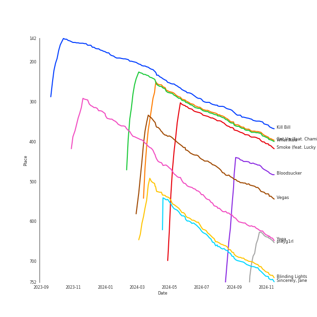
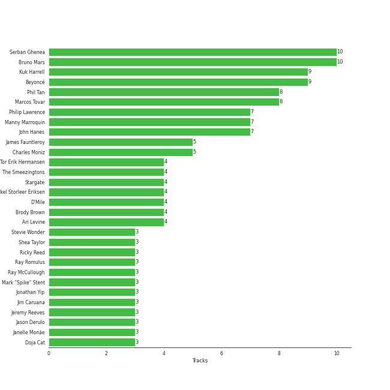

# R&B

[115 tracks (86 liked) 🔗](https://open.spotify.com/playlist/1RsGeysyOdV3wZHqlto0Gb)

[See Track Features](audio_features.md)

[See Clusters](clusters/overview.md)

## Top Artists

| Art | Tracks | 💚 | Artist | 🔗 |
|:---|---:|---:|:---|:---|
|  | 16 | 10 | [Beyoncé](../../artists/beyoncé/overview.md) | [🔗](https://open.spotify.com/artist/6vWDO969PvNqNYHIOW5v0m) |
|  | 14 | 10 | [Bruno Mars](../../artists/bruno_mars/overview.md) | [🔗](https://open.spotify.com/artist/0du5cEVh5yTK9QJze8zA0C) |
|  | 11 | 10 | [Rihanna](../../artists/rihanna/overview.md) | [🔗](https://open.spotify.com/artist/5pKCCKE2ajJHZ9KAiaK11H) |
|  | 9 | 8 | [Janelle Monáe](../../artists/janelle_monáe/overview.md) | [🔗](https://open.spotify.com/artist/6ueGR6SWhUJfvEhqkvMsVs) |
|  | 6 | 5 | [Jason Derulo](../../artists/jason_derulo/overview.md) | [🔗](https://open.spotify.com/artist/07YZf4WDAMNwqr4jfgOZ8y) |
|  | 7 | 3 | Anderson .Paak | [🔗](https://open.spotify.com/artist/3jK9MiCrA42lLAdMGUZpwa) |
|  | 6 | 3 | Silk Sonic | [🔗](https://open.spotify.com/artist/6PvvGcCY2XtUcSRld1Wilr) |
|  | 4 | 3 | Stevie Wonder | [🔗](https://open.spotify.com/artist/7guDJrEfX3qb6FEbdPA5qi) |
|  | 3 | 3 | [Doja Cat](../../artists/doja_cat/overview.md) | [🔗](https://open.spotify.com/artist/5cj0lLjcoR7YOSnhnX0Po5) |
|  | 4 | 2 | USHER | [🔗](https://open.spotify.com/artist/23zg3TcAtWQy7J6upgbUnj) |

See all 79 artists

| Art | Tracks | 💚 | Artist | 🔗 |
|:---|---:|---:|:---|:---|
|  | 3 | 2 | John Legend | [🔗](https://open.spotify.com/artist/5y2Xq6xcjJb2jVM54GHK3t) |
|  | 2 | 2 | SZA | [🔗](https://open.spotify.com/artist/7tYKF4w9nC0nq9CsPZTHyP) |
|  | 2 | 2 | Tyla | [🔗](https://open.spotify.com/artist/3SozjO3Lat463tQICI9LcE) |
|  | 2 | 2 | Ciara | [🔗](https://open.spotify.com/artist/2NdeV5rLm47xAvogXrYhJX) |
|  | 2 | 2 | The Weeknd | [🔗](https://open.spotify.com/artist/1Xyo4u8uXC1ZmMpatF05PJ) |
|  | 2 | 2 | Kali Uchis | [🔗](https://open.spotify.com/artist/1U1el3k54VvEUzo3ybLPlM) |
|  | 4 | 1 | The Temptations | [🔗](https://open.spotify.com/artist/3RwQ26hR2tJtA8F9p2n7jG) |
|  | 2 | 1 | JAY-Z | [🔗](https://open.spotify.com/artist/3nFkdlSjzX9mRTtwJOzDYB) |
|  | 2 | 1 | Daniel Caesar | [🔗](https://open.spotify.com/artist/20wkVLutqVOYrc0kxFs7rA) |
|  | 1 | 1 | Lil Nas X | [🔗](https://open.spotify.com/artist/7jVv8c5Fj3E9VhNjxT4snq) |
|  | 1 | 1 | Roman GianArthur | [🔗](https://open.spotify.com/artist/7hgRzsQGjlm1zifNoigyB9) |
|  | 1 | 1 | Calvin Harris | [🔗](https://open.spotify.com/artist/7CajNmpbOovFoOoasH2HaY) |
|  | 1 | 1 | André 3000 | [🔗](https://open.spotify.com/artist/74V3dE1a51skRkdII8y2C6) |
|  | 1 | 1 | Blu Cantrell | [🔗](https://open.spotify.com/artist/6vytZ677lz4LzCrUDcDokM) |
|  | 1 | 1 | Chamillionaire | [🔗](https://open.spotify.com/artist/6vdMPayKk8YJxxeNP5oMCb) |
|  | 1 | 1 | Commodores | [🔗](https://open.spotify.com/artist/6twIAGnYuIT1pncMAsXnEm) |
|  | 1 | 1 | H 3 F | [🔗](https://open.spotify.com/artist/6jIK3obS1fJqb3Vu74AYX3) |
|  | 1 | 1 | Destiny Rogers | [🔗](https://open.spotify.com/artist/6gezkje7GoJlQbHBgLXHuu) |
|  | 1 | 1 | The Womack Sisters | [🔗](https://open.spotify.com/artist/6BjLHAiun9TeqC55KB3L6s) |
|  | 1 | 1 | Ella Eyre | [🔗](https://open.spotify.com/artist/66TrUkUZ3RM29dqeDQRgyA) |
|  | 1 | 1 | Victoria Monét | [🔗](https://open.spotify.com/artist/63XBtGSEZINSyXylZxEUbv) |
|  | 1 | 1 | B.o.B | [🔗](https://open.spotify.com/artist/5ndkK3dpZLKtBklKjxNQwT) |
|  | 1 | 1 | CeeLo Green | [🔗](https://open.spotify.com/artist/5nLYd9ST4Cnwy6NHaCxbj8) |
|  | 1 | 1 | Juicy J | [🔗](https://open.spotify.com/artist/5gCRApTajqwbnHHPbr2Fpi) |
|  | 1 | 1 | Lucky Daye | [🔗](https://open.spotify.com/artist/5Vuvs6Py2JRU7WiFDVsI7J) |
|  | 1 | 1 | Gnarls Barkley | [🔗](https://open.spotify.com/artist/5SbkVQYYzlw1kte75QIabH) |
|  | 1 | 1 | Tyga | [🔗](https://open.spotify.com/artist/5LHRHt1k9lMyONurDHEdrp) |
|  | 1 | 1 | Lizzo | [🔗](https://open.spotify.com/artist/56oDRnqbIiwx4mymNEv7dS) |
|  | 1 | 1 | Cardi B | [🔗](https://open.spotify.com/artist/4kYSro6naA4h99UJvo89HB) |
|  | 1 | 1 | Giveon | [🔗](https://open.spotify.com/artist/4fxd5Ee7UefO4CUXgwJ7IP) |
|  | 1 | 1 | Jidenna | [🔗](https://open.spotify.com/artist/4TsHKU8l8Wq7n7OPVikirn) |
|  | 1 | 1 | 6LACK | [🔗](https://open.spotify.com/artist/4IVAbR2w4JJNJDDRFP3E83) |
|  | 1 | 1 | QUIN | [🔗](https://open.spotify.com/artist/3sHS70DMNgPxRqx2fUNrRA) |
|  | 1 | 1 | Jhorrmountain | [🔗](https://open.spotify.com/artist/3aAX2y0amckZ7WcWoz2f2o) |
|  | 1 | 1 | H.E.R. | [🔗](https://open.spotify.com/artist/3Y7RZ31TRPVadSFVy1o8os) |
|  | 1 | 1 | Alicia Keys | [🔗](https://open.spotify.com/artist/3DiDSECUqqY1AuBP8qtaIa) |
|  | 1 | 1 | Puri | [🔗](https://open.spotify.com/artist/3ADyFy1orEwODaiHmRRMQp) |
|  | 1 | 1 | Miguel | [🔗](https://open.spotify.com/artist/360IAlyVv4PCEVjgyMZrxK) |
|  | 1 | 1 | Justin Timberlake | [🔗](https://open.spotify.com/artist/31TPClRtHm23RisEBtV3X7) |
|  | 1 | 1 | Zedd | [🔗](https://open.spotify.com/artist/2qxJFvFYMEDqd7ui6kSAcq) |
|  | 1 | 1 | Big Boi | [🔗](https://open.spotify.com/artist/2ht3wxeT69CzyKFChNnNAB) |
|  | 1 | 1 | Moliy | [🔗](https://open.spotify.com/artist/2hVWBpjLW4Q7fboYz2pVYK) |
|  | 1 | 1 | Frank Ocean | [🔗](https://open.spotify.com/artist/2h93pZq0e7k5yf4dywlkpM) |
|  | 1 | 1 | Solange | [🔗](https://open.spotify.com/artist/2auiVi8sUZo17dLy1HwrTU) |
|  | 1 | 1 | Corinne Bailey Rae | [🔗](https://open.spotify.com/artist/29WzbAQtDnBJF09es0uddn) |
|  | 1 | 1 | Amaarae | [🔗](https://open.spotify.com/artist/21UPYSRWFKwtqvSAnFnSvS) |
|  | 1 | 1 | Mikky Ekko | [🔗](https://open.spotify.com/artist/1buzCmyYZE4kcdLRudsb8V) |
|  | 1 | 1 | Pink Sweat$ | [🔗](https://open.spotify.com/artist/1W7FNibLa0O0b572tB2w7t) |
|  | 1 | 1 | 2 Chainz | [🔗](https://open.spotify.com/artist/17lzZA2AlOHwCwFALHttmp) |
|  | 1 | 1 | Etta James | [🔗](https://open.spotify.com/artist/0iOVhN3tnSvgDbcg25JoJb) |
|  | 1 | 1 | Jenevieve | [🔗](https://open.spotify.com/artist/0dUYLC7DLjeS8gIh8cz2Pq) |
|  | 1 | 1 | Kehlani | [🔗](https://open.spotify.com/artist/0cGUm45nv7Z6M6qdXYQGTX) |
|  | 1 | 1 | Robin Thicke | [🔗](https://open.spotify.com/artist/0ZrpamOxcZybMHGg1AYtHP) |
|  | 1 | 1 | Jacob Banks | [🔗](https://open.spotify.com/artist/0AepkoQhYvkjEzzwIcGxdV) |
|  | 2 | 0 | Ludacris | [🔗](https://open.spotify.com/artist/3ipn9JLAPI5GUEo4y4jcoi) |
|  | 1 | 0 | Lil Jon | [🔗](https://open.spotify.com/artist/7sfl4Xt5KmfyDs2T3SVSMK) |
|  | 1 | 0 | Ty Dolla $ign | [🔗](https://open.spotify.com/artist/7c0XG5cIJTrrAgEC3ULPiq) |
|  | 1 | 0 | Chris Brown | [🔗](https://open.spotify.com/artist/7bXgB6jMjp9ATFy66eO08Z) |
|  | 1 | 0 | Erykah Badu | [🔗](https://open.spotify.com/artist/7IfculRW2WXyzNQ8djX8WX) |
|  | 1 | 0 | Bootsy Collins | [🔗](https://open.spotify.com/artist/5K0rbdBrs2tNXe5LeWMATT) |
|  | 1 | 0 | Thundercat | [🔗](https://open.spotify.com/artist/4frXpPxQQZwbCu3eTGnZEw) |
|  | 1 | 0 | The Foundations | [🔗](https://open.spotify.com/artist/4GITZM5LCR2KcdlgEOrNLD) |
|  | 1 | 0 | AILEE | [🔗](https://open.spotify.com/artist/3uGFTJ7JMllvhgGpumieHF) |
|  | 1 | 0 | Jordin Sparks | [🔗](https://open.spotify.com/artist/2AQjGvtT0pFYfxR3neFcvz) |
|  | 1 | 0 | Cassie | [🔗](https://open.spotify.com/artist/27FGXRNruFoOdf1vP8dqcH) |
|  | 1 | 0 | Ne-Yo | [🔗](https://open.spotify.com/artist/21E3waRsmPlU7jZsS13rcj) |
|  | 1 | 0 | Destiny's Child | [🔗](https://open.spotify.com/artist/1Y8cdNmUJH7yBTd9yOvr5i) |
|  | 1 | 0 | Nicki Minaj | [🔗](https://open.spotify.com/artist/0hCNtLu0JehylgoiP8L4Gh) |
|  | 1 | 0 | Pitbull | [🔗](https://open.spotify.com/artist/0TnOYISbd1XYRBk9myaseg) |

## Top Tracks

Most and least listened tracks

| ​ | Most listened tracks | Rank | ​​ | Least listened tracks | Rank |
|:---|:---|---:|:---|:---|---:|
|  | Get Up (feat. Chamillionaire) | 518 |  | Baby Powder | 2599 |
|  | [When I Was Your Man](../../artists/bruno_mars/overview.md) | 548 |  | Me & U | 2599 |
|  | [What Now](../../artists/rihanna/overview.md) | 550 |  | I Don't Mind (feat. Juicy J) | 2599 |
|  | [Yoga](../../artists/janelle_monáe/overview.md) | 578 |  | Papa Was A Rollin' Stone - Single Version | 2599 |
|  | [Sincerely, Jane](../../artists/janelle_monáe/overview.md) | 587 |  | Thinkin Bout You | 2599 |
|  | [Vegas](../../artists/doja_cat/overview.md) | 596 |  | My Girl | 2599 |
|  | [Stay](../../artists/rihanna/overview.md) | 622 |  | Green Light (feat. André 3000) | 2599 |
|  | [Get Ugly](../../artists/jason_derulo/overview.md) | 652 |  | Silicon Valley | 2599 |
|  | Blinding Lights | 673 |  | Build Me Up Buttercup | 2599 |
|  | Smoke (feat. Lucky Daye) | 699 |  | So Sick | 2599 |

## Top Albums

| Art | Tracks | 💚 | Album | Release Date | 🔗 |
|:---|---:|---:|:---|:---|:---|
|  | 5 | 3 | An Evening With Silk Sonic | 2021-11-11 | [🔗](https://open.spotify.com/album/1YgekJJTEueWDaMr7BYqPk) |
|  | 4 | 3 | 4 | 2011-06-24 | [🔗](https://open.spotify.com/album/1gIC63gC3B7o7FfpPACZQJ) |
|  | 4 | 2 | I AM...SASHA FIERCE | 2008-11-14 | [🔗](https://open.spotify.com/album/23Y5wdyP5byMFktZf8AcWU) |
|  | 3 | 3 | Unapologetic (Deluxe) | 2012-12-11 | [🔗](https://open.spotify.com/album/4eddbruVtOqw8khwxSH6H2) |
|  | 3 | 2 | The Electric Lady | 2013-09-06 | [🔗](https://open.spotify.com/album/3bnHtSmmsgJiG82hGCmsq9) |
|  | 3 | 2 | Good Girl Gone Bad: Reloaded | 2008-06-02 | [🔗](https://open.spotify.com/album/3JSWZWeTHF4HDGt5Eozdy7) |
|  | 3 | 2 | 24K Magic | 2016-11-17 | [🔗](https://open.spotify.com/album/4PgleR09JVnm3zY1fW3XBA) |
|  | 2 | 2 | Unorthodox Jukebox | 2012-12-07 | [🔗](https://open.spotify.com/album/58ufpQsJ1DS5kq4hhzQDiI) |
|  | 2 | 2 | The ArchAndroid | 2010-05-17 | [🔗](https://open.spotify.com/album/7MvSB0JTdtl1pSwZcgvYQX) |
|  | 2 | 2 | Talk That Talk | 2011-11-19 | [🔗](https://open.spotify.com/album/1Kw1bVd07oRqcjrcjQKC8T) |

See all 85 albums

| Art | Tracks | 💚 | Album | Release Date | 🔗 |
|:---|---:|---:|:---|:---|:---|
|  | 2 | 2 | Talk Dirty | 2013-09-10 | [🔗](https://open.spotify.com/album/4PeZu0It7qVrTG40t3HM9A) |
|  | 2 | 2 | SOS | 2022-12-09 | [🔗](https://open.spotify.com/album/07w0rG5TETcyihsEIZR3qG) |
|  | 2 | 2 | Loud | 2010-11-16 | [🔗](https://open.spotify.com/album/6UHhmTLl9T1scRYLmpHcDX) |
|  | 2 | 2 | Doo-Wops & Hooligans | 2010-10-05 | [🔗](https://open.spotify.com/album/1uyf3l2d4XYwiEqAb7t7fX) |
|  | 2 | 2 | Dirty Computer | 2018-04-27 | [🔗](https://open.spotify.com/album/2PjlaxlMunGOUvcRzlTbtE) |
|  | 2 | 2 | Dangerously In Love | 2003-06-24 | [🔗](https://open.spotify.com/album/6oxVabMIqCMJRYN1GqR3Vf) |
|  | 2 | 1 | Raymond v Raymond (Expanded Edition) | 2010-03-30 | [🔗](https://open.spotify.com/album/6A1F3Fkq5dYeYYNkXflcTX) |
|  | 2 | 1 | Lemonade | 2016-04-23 | [🔗](https://open.spotify.com/album/7dK54iZuOxXFarGhXwEXfF) |
|  | 2 | 1 | B'Day Deluxe Edition | 2007-05-29 | [🔗](https://open.spotify.com/album/0Zd10MKN5j9KwUST0TdBBB) |
|  | 1 | 1 | channel ORANGE | 2012-07-10 | [🔗](https://open.spotify.com/album/392p3shh2jkxUxY2VHvlH8) |
|  | 1 | 1 | Yoga | 2015-03-31 | [🔗](https://open.spotify.com/album/5rzxGeVyCV74SvV5hjLRAU) |
|  | 1 | 1 | Water | 2023-07-28 | [🔗](https://open.spotify.com/album/22sXXkKgjEuawIFL1e1tRw) |
|  | 1 | 1 | Village | 2018-11-02 | [🔗](https://open.spotify.com/album/2KxC2M0bVm5hrK3GgGMuV9) |
|  | 1 | 1 | Tomboy | 2019-02-28 | [🔗](https://open.spotify.com/album/2uDZBeyyQ7mfwF9mUJeYUG) |
|  | 1 | 1 | The Temptations Sing Smokey | 1965-03-22 | [🔗](https://open.spotify.com/album/45tweuKI0zdh8zgKo05cTw) |
|  | 1 | 1 | The Prelude | 2020-07-17 | [🔗](https://open.spotify.com/album/3Qj2vsFzmaB8jcH6Q60WIG) |
|  | 1 | 1 | The Evolution | 2006 | [🔗](https://open.spotify.com/album/0hfJ35SzCkWesdUpLKXLto) |
|  | 1 | 1 | The Diary Of Alicia Keys | 2003-12-02 | [🔗](https://open.spotify.com/album/6TqRKHLjDu5QZuC8u5Woij) |
|  | 1 | 1 | The Definitive Collection | 2002-10-29 | [🔗](https://open.spotify.com/album/4E1itnJOhTMRSATNaxh0Sq) |
|  | 1 | 1 | Tell Mama | 1968-04-18 | [🔗](https://open.spotify.com/album/4ReJ59T4YxC62WkfyVTWpr) |
|  | 1 | 1 | Tattoos (Deluxe Edition) | 2013-09-10 | [🔗](https://open.spotify.com/album/3wDeTllVvayYsWTHsFNWZQ) |
|  | 1 | 1 | TYLA | 2024-03-22 | [🔗](https://open.spotify.com/album/3KGVOGmIbinlrR97aFufGE) |
|  | 1 | 1 | TAKE TIME | 2020-03-27 | [🔗](https://open.spotify.com/album/1zHR48K6XtWYm6bhrw4J6C) |
|  | 1 | 1 | St. Elsewhere | 2006-05-02 | [🔗](https://open.spotify.com/album/7p2aWivr9OLXocSTTKtG9B) |
|  | 1 | 1 | Songs In The Key Of Life | 1976-09-28 | [🔗](https://open.spotify.com/album/6YUCc2RiXcEKS9ibuZxjt0) |
|  | 1 | 1 | Signed, Sealed And Delivered | 1970-08-07 | [🔗](https://open.spotify.com/album/54ootLtDyMZFr9obtWQvvO) |
|  | 1 | 1 | SAD GIRLZ LUV MONEY Remix (feat. Kali Uchis and Moliy) | 2021-09-16 | [🔗](https://open.spotify.com/album/4q4rHdKxyCzxuQrPcdjPyC) |
|  | 1 | 1 | Red Moon In Venus | 2023-03-03 | [🔗](https://open.spotify.com/album/5OZ44LaqZbpP3m9B3oT8br) |
|  | 1 | 1 | Planet Her | 2021-06-25 | [🔗](https://open.spotify.com/album/1nAQbHeOWTfQzbOoFrvndW) |
|  | 1 | 1 | Music From The Motion Picture Cadillac Records | 2008-11-28 | [🔗](https://open.spotify.com/album/4b2zuwf7CPesdiTg1kFDjU) |
|  | 1 | 1 | Metropolis: The Chase Suite (Special Edition) | 2008-08-12 | [🔗](https://open.spotify.com/album/3T3bJi3cvwR5U7ihwgEwF1) |
|  | 1 | 1 | MONTERO (Call Me By Your Name) | 2021-03-31 | [🔗](https://open.spotify.com/album/2Hjcfw8zHN4dJDZJGOzLd6) |
|  | 1 | 1 | Love In The Future (Expanded Edition) | 2013-08-30 | [🔗](https://open.spotify.com/album/4OTAx9un4e6NfoHuVRiOrC) |
|  | 1 | 1 | LUCID | 2019-11-15 | [🔗](https://open.spotify.com/album/5qQhQ1rmPjqQgv8RmfaQU3) |
|  | 1 | 1 | JAGUAR II | 2023-08-25 | [🔗](https://open.spotify.com/album/6WlGOgNNtpwFt2gfRFfqgZ) |
|  | 1 | 1 | I Don't Mind (feat. Juicy J) | 2014-11-21 | [🔗](https://open.spotify.com/album/5BAqg5IJQ7XFKfdoCiOlJw) |
|  | 1 | 1 | How Can I | 2019-06-23 | [🔗](https://open.spotify.com/album/3qEib9B2LiOpc81jRYC4Fi) |
|  | 1 | 1 | Good Thing (with Kehlani) | 2019-09-27 | [🔗](https://open.spotify.com/album/3wpdeV1FZfiEnelZSfAFp4) |
|  | 1 | 1 | Freudian | 2017-08-25 | [🔗](https://open.spotify.com/album/3xybjP7r2VsWzwvDQipdM0) |
|  | 1 | 1 | Finesse (Remix) [feat. Cardi B] | 2017-12-20 | [🔗](https://open.spotify.com/album/3mumK2ar9b4JPhVOZR0V2p) |
|  | 1 | 1 | Fantasy Ride | 2009-05-05 | [🔗](https://open.spotify.com/album/5bIi3gz4jULkZV38aTwLPn) |
|  | 1 | 1 | Evolver | 2008-10-27 | [🔗](https://open.spotify.com/album/11sKu4dBGvmEZTuVw9EC9A) |
|  | 1 | 1 | Everything Is 4 | 2015-05-29 | [🔗](https://open.spotify.com/album/59eUYETmE1zi31ESb3SUkI) |
|  | 1 | 1 | Ella Eyre | 2015-01-12 | [🔗](https://open.spotify.com/album/5J69OYtRXeI9dHDK2R95h5) |
|  | 1 | 1 | ELVIS (Original Motion Picture Soundtrack) | 2022-06-24 | [🔗](https://open.spotify.com/album/74g0V2gxEA5MCSaivAwZyb) |
|  | 1 | 1 | Darling | 2017-02-03 | [🔗](https://open.spotify.com/album/7pDkPCnYRapjr8dXcwkNIB) |
|  | 1 | 1 | Cuz I Love You (Deluxe) | 2019-05-03 | [🔗](https://open.spotify.com/album/74gSdSHe71q7urGWMMn3qB) |
|  | 1 | 1 | Coño | 2020-07-03 | [🔗](https://open.spotify.com/album/1h3x5tLWXhf438Y5AK60Ml) |
|  | 1 | 1 | Corinne Bailey Rae | 2006-01-01 | [🔗](https://open.spotify.com/album/141Mp3P2VKHQMhtkW1DyQg) |
|  | 1 | 1 | Commodores | 1977-01-01 | [🔗](https://open.spotify.com/album/2tzbNCAUTmW4MIM2Ulvrwl) |
|  | 1 | 1 | Boss Bitch | 2020-01-23 | [🔗](https://open.spotify.com/album/4pmyFpGicLLIgNPc1TQXKc) |
|  | 1 | 1 | Bittersweet | 2003 | [🔗](https://open.spotify.com/album/3UviDOQkc4WbXkNi6DIBZu) |
|  | 1 | 1 | Baby Powder | 2020-03-25 | [🔗](https://open.spotify.com/album/3nqQxvxUB95Bi2UBseY1u1) |
|  | 1 | 1 | All I Want Is You | 2010-11-26 | [🔗](https://open.spotify.com/album/493HYe7N5pleudEZRyhE7R) |
|  | 1 | 1 | After Hours | 2020-03-20 | [🔗](https://open.spotify.com/album/4yP0hdKOZPNshxUOjY0cZj) |
|  | 1 | 1 | ANTI (Deluxe) | 2016-01-28 | [🔗](https://open.spotify.com/album/4UlGauD7ROb3YbVOFMgW5u) |
|  | 1 | 1 | A Beautiful World | 2002-12-13 | [🔗](https://open.spotify.com/album/76wI74XuASLFrY9pUVLhO9) |
|  | 1 | 0 | Who Hurt You? | 2018-10-16 | [🔗](https://open.spotify.com/album/15M9pZ8gsdoN67yLjyQ039) |
|  | 1 | 0 | The Foundations | 1968-01-01 | [🔗](https://open.spotify.com/album/3j1kw5l2mEeKCUuXXwjhWp) |
|  | 1 | 0 | Swalla (feat. Nicki Minaj & Ty Dolla $ign) | 2017-02-23 | [🔗](https://open.spotify.com/album/2e5CxfyEwBW115beiwh7Mc) |
|  | 1 | 0 | Survivor | 2001-05-01 | [🔗](https://open.spotify.com/album/480AZOo2VQ1kf3GedAiKV9) |
|  | 1 | 0 | Preach | 2019-02-15 | [🔗](https://open.spotify.com/album/32r4o1R9a1lK5DoVXGEC7E) |
|  | 1 | 0 | Pandora : Beneath the Paradise, Pt. 3 (Original Television Soundtrack) | 2023-04-02 | [🔗](https://open.spotify.com/album/28afuQsobhUrDWQRaJWclH) |
|  | 1 | 0 | Meet The Temptations | 1964 | [🔗](https://open.spotify.com/album/199rfdL0k6q5ReLA7V4KMt) |
|  | 1 | 0 | Malibu | 2016-01-15 | [🔗](https://open.spotify.com/album/4VFG1DOuTeDMBjBLZT7hCK) |
|  | 1 | 0 | Love's Train | 2022-02-14 | [🔗](https://open.spotify.com/album/6QKXGIgwWmWBMmIktMOchR) |
|  | 1 | 0 | Jordin Sparks | 2007-11-20 | [🔗](https://open.spotify.com/album/6JCNOvp9UeMrFuXwNW0JW6) |
|  | 1 | 0 | In My Own Words | 2006-01-01 | [🔗](https://open.spotify.com/album/6gkwOLmk0ALMOjWs5WhAEr) |
|  | 1 | 0 | Gettin' Ready (Expanded Edition) | 1966 | [🔗](https://open.spotify.com/album/3RE8NUULcBzFvVtCmlI4lb) |
|  | 1 | 0 | For Once In My Life | 1968-12-01 | [🔗](https://open.spotify.com/album/3pPBbp1Nl9n1AM9xFpdKtZ) |
|  | 1 | 0 | F.A.M.E. (Expanded Edition) | 2011-03-22 | [🔗](https://open.spotify.com/album/6df0qvkMXoyHGt9J8cujZb) |
|  | 1 | 0 | Confessions (Expanded Edition) | 2004-03-23 | [🔗](https://open.spotify.com/album/1RM6MGv6bcl6NrAG8PGoZk) |
|  | 1 | 0 | Cassie (U.S. Version) | 2006-08-07 | [🔗](https://open.spotify.com/album/0j1qzjaJmsF1FkcICf3hRu) |
|  | 1 | 0 | BEYONCÉ [Platinum Edition] | 2014-11-24 | [🔗](https://open.spotify.com/album/2UJwKSBUz6rtW4QLK74kQu) |
|  | 1 | 0 | 20th Century Masters: The Millennium Collection: Best Of The Temptations, Vol. 2 - The '70s, '80s, '90s | 2000-01-11 | [🔗](https://open.spotify.com/album/2kzUxFepw1uLjbgqV537eP) |

## Top Record Labels

| Tracks | 💚 | Label |
|---:|---:|:---|
| 21 | 13 | [Columbia](../../labels/columbia/overview.md) |
| 17 | 13 | [Atlantic Records](../../labels/atlantic_records/overview.md) |
| 10 | 9 | [Def Jam Recordings](../../labels/def_jam_recordings/overview.md) |
| 9 | 7 | [Bad Boy](../../labels/bad_boy/overview.md) |
| 6 | 6 | [RCA Records Label](../../labels/rca_records_label/overview.md) |
| 9 | 5 | [MOTOWN](../../labels/motown/overview.md) |
| 6 | 5 | Wondaland |
| 7 | 4 | Parkwood Entertainment |
| 5 | 4 | [Warner Records](../../labels/warner_records/overview.md) |
| 5 | 4 | [UNI](../../labels/uni/overview.md) |

See all 55 labels

| Tracks | 💚 | Label |
|---:|---:|:---|
| 5 | 4 | Beluga Heights |
| 4 | 4 | [Epic](../../labels/epic/overview.md) |
| 6 | 3 | Aftermath Entertainment |
| 5 | 3 | Music World Music |
| 5 | 3 | LaFace Records |
| 2 | 2 | Top Dawg Entertainment |
| 2 | 2 | [Interscope Records](../../labels/interscope_records/overview.md) |
| 2 | 2 | [Geffen](../../labels/geffen/overview.md) |
| 2 | 2 | G.O.O.D. Music |
| 2 | 2 | FAX Records |
| 2 | 1 | [Jive](../../labels/jive/overview.md) |
| 2 | 1 | Golden Child Recordings |
| 1 | 1 | ZAR |
| 1 | 1 | [Virgin Records](../../labels/virgin_records/overview.md) |
| 1 | 1 | UMGRI Interscope |
| 1 | 1 | Spinnin' Records |
| 1 | 1 | Roc Nation |
| 1 | 1 | Rihanna |
| 1 | 1 | [Republic Records](../../labels/republic_records/overview.md) |
| 1 | 1 | Red Zone Entertainment |
| 1 | 1 | Nu America Music |
| 1 | 1 | Not specified |
| 1 | 1 | Not So Fast |
| 1 | 1 | Nice Life |
| 1 | 1 | Lovett Music |
| 1 | 1 | Kemosabe Records |
| 1 | 1 | JOYFACE Records |
| 1 | 1 | J Records |
| 1 | 1 | IDJ |
| 1 | 1 | House of Iona |
| 1 | 1 | H 3 F |
| 1 | 1 | Fantasy Soul |
| 1 | 1 | [EMI](../../labels/emi/overview.md) |
| 1 | 1 | Downtown Recordings |
| 1 | 1 | Def Jam |
| 1 | 1 | Arista |
| 1 | 1 | ATL |
| 1 | 0 | Steel Wool |
| 1 | 0 | OBE |
| 1 | 0 | [Genie Music Corporation](../../labels/genie_music_corporation/overview.md) |
| 1 | 0 | EMPIRE |
| 1 | 0 | Def Soul |
| 1 | 0 | Castle Communications |
| 1 | 0 | Art Club |
| 1 | 0 | 19 Recordings Limited |

## Genres

| Tracks | 💚 | Genre |
|---:|---:|:---|
| 68 | 50 | [pop](../../genres/pop/overview.md) |
| 42 | 29 | [r&b](../../genres/r_b/overview.md) |
| 35 | 24 | [dance pop](../../genres/dance_pop/overview.md) |
| 27 | 19 | [urban contemporary](../../genres/urban_contemporary/overview.md) |
| 18 | 15 | neo soul |
| 14 | 11 | atl hip hop |
| 12 | 11 | alternative r&b |
| 11 | 10 | barbadian pop |
| 9 | 8 | afrofuturism |
| 11 | 7 | [soul](../../genres/soul/overview.md) |

See all 58 genres

| Tracks | 💚 | Genre |
|---:|---:|:---|
| 9 | 5 | motown |
| 7 | 4 | [rap](../../genres/rap/overview.md) |
| 4 | 3 | pop soul |
| 4 | 3 | hip pop |
| 4 | 2 | south carolina hip hop |
| 4 | 2 | contemporary r&b |
| 3 | 2 | canadian contemporary r&b |
| 2 | 2 | lgbtq+ hip hop |
| 4 | 1 | memphis soul |
| 4 | 1 | classic soul |
| 2 | 1 | pop rap |
| 2 | 1 | escape room |
| 1 | 1 | [vocal jazz](../../genres/vocal_jazz/overview.md) |
| 1 | 1 | [uk pop](../../genres/uk_pop/overview.md) |
| 1 | 1 | uk dance |
| 1 | 1 | uk contemporary r&b |
| 1 | 1 | trap queen |
| 1 | 1 | torch song |
| 1 | 1 | thai indie pop |
| 1 | 1 | talent show |
| 1 | 1 | soul blues |
| 1 | 1 | [soft rock](../../genres/soft_rock/overview.md) |
| 1 | 1 | quiet storm |
| 1 | 1 | pop dance |
| 1 | 1 | minnesota hip hop |
| 1 | 1 | [mellow gold](../../genres/mellow_gold/overview.md) |
| 1 | 1 | jazz blues |
| 1 | 1 | indie r&b |
| 1 | 1 | ghanaian pop |
| 1 | 1 | ghanaian alternative |
| 1 | 1 | german techno |
| 1 | 1 | funk |
| 1 | 1 | edm |
| 1 | 1 | disco |
| 1 | 1 | complextro |
| 1 | 1 | colombian pop |
| 1 | 1 | [canadian pop](../../genres/canadian_pop/overview.md) |
| 1 | 1 | british soul |
| 1 | 1 | bedroom soul |
| 1 | 1 | afrobeats |
| 1 | 1 | afro r&b |
| 1 | 1 | [adult standards](../../genres/adult_standards/overview.md) |
| 1 | 0 | [post-teen pop](../../genres/post-teen_pop/overview.md) |
| 1 | 0 | [k-pop](../../genres/k-pop/overview.md) |
| 1 | 0 | indie soul |
| 1 | 0 | [hip hop](../../genres/hip_hop/overview.md) |
| 1 | 0 | girl group |
| 1 | 0 | bubblegum pop |

## Top Producers

| Art | Producer | Tracks | Credit Types |
|:---|:---|---:|:---|
| | [Serban Ghenea](../../producers/serban_ghenea/overview.md) | 10 | Producer |
|  | [Bruno Mars](../../artists/bruno_mars/overview.md) | 10 | Songwriter, Producer |
| | Kuk Harrell | 9 | Producer |
|  | [Beyoncé](../../artists/beyoncé/overview.md) | 9 | Producer, Songwriter |
| | [Marcos Tovar](../../producers/marcos_tovar/overview.md) | 8 | Producer |
| | [Phil Tan](../../producers/phil_tan/overview.md) | 8 | Producer |
| | [Manny Marroquin](../../producers/manny_marroquin/overview.md) | 7 | Producer |
| | Philip Lawrence | 7 | Songwriter |
| | [John Hanes](../../producers/john_hanes/overview.md) | 7 | Producer |
| | Charles Moniz | 5 | Producer |

View all

| Art | Producer | Tracks | Credit Types |
|:---|:---|---:|:---|
| | James Fauntleroy | 5 | Songwriter |
| | The Smeezingtons | 4 | Producer |
| | Brody Brown | 4 | Songwriter |
| | Ari Levine | 4 | Producer, Songwriter |
| | D'Mile | 4 | Songwriter, Producer |
| | Stargate | 4 | Producer |
| | Tor Erik Hermansen | 4 | Songwriter |
| | [Mikkel Storleer Eriksen](../../producers/mikkel_storleer_eriksen/overview.md) | 4 | Songwriter, Producer |
| | Brandon Paak Anderson | 3 | Songwriter |
| | Shea Taylor | 3 | Producer, Songwriter |
|  | [Doja Cat](../../artists/doja_cat/overview.md) | 3 | Songwriter |
| | [Ricky Reed](../../producers/ricky_reed/overview.md) | 3 | Producer, Songwriter |
|  | Stevie Wonder | 3 | Lyricist, Songwriter |
| | Ray Romulus | 3 | Songwriter |
|  | [Janelle Monáe](../../artists/janelle_monáe/overview.md) | 3 | Songwriter, Producer |
| | Jonathan Yip | 3 | Songwriter |
| | [Mark "Spike" Stent](../../producers/mark__spike__stent/overview.md) | 3 | Producer |
|  | [Jason Derulo](../../artists/jason_derulo/overview.md) | 3 | Songwriter |
| | Ray McCullough | 3 | Songwriter |
| | Jim Caruana | 3 | Producer |
| | Jeremy Reeves | 3 | Songwriter |
| | Sean Douglas | 2 | Songwriter |
| | Sandy Wilhelm | 2 | Songwriter |
| | The-Dream | 2 | Songwriter |
| | Larry Gold | 2 | Arranger |
| | Andrew Wyatt | 2 | Songwriter |
| | [Łukasz Gottwald (Gottwald, Łukasz)](../../producers/łukasz_gottwald_(gottwald,_łukasz)/overview.md) | 2 | Songwriter |
|  | The Weeknd | 2 | Producer, Songwriter |
| | Jason Evigan | 2 | Songwriter |
|  | SZA | 2 | Songwriter |
|  | [Rihanna](../../artists/rihanna/overview.md) | 2 | Songwriter |
| | Shampoo Press & Curl | 2 | Producer |
| | Boo Mitchell | 2 | Producer |
| | Miles Walker | 2 | Producer |
| | Sandy Vee | 2 | Producer |
| | [Tony Maserati](../../producers/tony_maserati/overview.md) | 2 | Producer |
| | DJ Swivel | 2 | Producer |
| | [Josh Gudwin](../../producers/josh_gudwin/overview.md) | 2 | Producer |
| | Daniela Rivera | 2 | Producer |
| | The Stereotypes | 2 | Producer |
| | Ester Dean | 2 | Songwriter |
| | [Ryan Tedder](../../producers/ryan_tedder/overview.md) | 2 | Arranger, Producer, Songwriter |
|  | Chris Brown | 2 | Songwriter |
|  | Corinne Bailey Rae | 1 | Songwriter |
| | Robert Waller | 1 | Songwriter |
| | Matthew Burnett | 1 | Producer |
| | Michael Bivins | 1 | Songwriter |
| | Wayne Gordon | 1 | Producer |
| | Rogét Chahayed (Chahayed, Rogét) | 1 | Producer, Songwriter |
| | Josh Collins | 1 | Producer |
| | Tom Elmhirst | 1 | Producer |
| | Donna Summer | 1 | Songwriter |
| | Robert Allen | 1 | Songwriter |
| | Derek Dixie | 1 | Producer |
| | Billy Foster | 1 | Lyricist |
|  | Lizzo | 1 | Songwriter |
| | Cashmere Cat | 1 | Songwriter |
| | David Biral | 1 | Producer, Songwriter |
| | Timothy Thomas | 1 | Songwriter |
| | Big Sean | 1 | Songwriter |
|  | B.o.B | 1 | Songwriter |
| | Nathaniel Irvin, III | 1 | Songwriter |
| | Jens Jungkurth | 1 | Producer |
| | Corey Marlon Lindsay-Keay | 1 | Lyricist, Producer, Songwriter |
| | Andre Merritt | 1 | Songwriter |
| | Jeff Bhasker | 1 | Producer |
| | Jeremy Wheatley | 1 | Producer |
| | Anne Preven | 1 | Songwriter |
|  | Lucky Daye | 1 | Songwriter |
| | Jesse Saint John | 1 | Songwriter |
| | Veronika Bozeman | 1 | Producer |
| | Juan Pablo Negrete Ortiz | 1 | Producer |
| | Shin Kamiyama | 1 | Producer |
| | Diana Gordon | 1 | Songwriter |
| | Pat Thrall | 1 | Producer |
| | David Campbell | 1 | Arranger |
| | Hit-Boy | 1 | Producer, Songwriter |
| | Rich Harrison | 1 | Producer, Songwriter |
| | James Anthony Carmichael | 1 | Producer |
| | Crystal Nicole | 1 | Songwriter |
| | Cainon Lamb | 1 | Songwriter |
| | Kevin Cossom | 1 | Songwriter |
| | Mike Caren | 1 | Songwriter |
|  | 2 Chainz | 1 | Songwriter |
| | Rob Bisel | 1 | Songwriter |
| | Parker Ighile | 1 | Producer, Songwriter |
| | Maurice White | 1 | Songwriter |
| | Frank Romano | 1 | Songwriter |
| | Matt Friedman | 1 | Songwriter |
| | Elof Loelv | 1 | Producer, Songwriter |

## Years

| ​ | 10 newest albums | ​​ | 10 oldest albums |
|:---|:---|:---|:---|
|  | TYLA (2024-03-22) |  | Meet The Temptations (1964) |
|  | JAGUAR II (2023-08-25) |  | The Temptations Sing Smokey (1965-03-22) |
|  | Water (2023-07-28) |  | Gettin' Ready (Expanded Edition) (1966) |
|  | Pandora : Beneath the Paradise, Pt. 3 (Original Television Soundtrack) (2023-04-02) |  | The Foundations (1968-01-01) |
|  | Red Moon In Venus (2023-03-03) |  | Tell Mama (1968-04-18) |
|  | SOS (2022-12-09) |  | For Once In My Life (1968-12-01) |
|  | ELVIS (Original Motion Picture Soundtrack) (2022-06-24) |  | Signed, Sealed And Delivered (1970-08-07) |
|  | Love's Train (2022-02-14) |  | Songs In The Key Of Life (1976-09-28) |
|  | An Evening With Silk Sonic (2021-11-11) |  | Commodores (1977-01-01) |
|  | SAD GIRLZ LUV MONEY Remix (feat. Kali Uchis and Moliy) (2021-09-16) |  | 20th Century Masters: The Millennium Collection: Best Of The Temptations, Vol. 2 - The '70s, '80s, '90s (2000-01-11) |