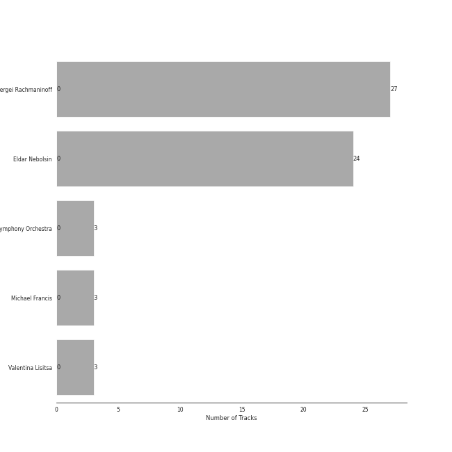

# Rachmaninov

[27 songs](rachmaninov_tracks.md)

## Top Artists

See all 5 artists

|   Number of Tracks | Art                                                                                              | Artist                                                               | 🔗                                                           |
|-------------------:|:-------------------------------------------------------------------------------------------------|:---------------------------------------------------------------------|:------------------------------------------------------------|
|                 27 |  | [Sergei Rachmaninoff](../artists/sergei_rachmaninoff.md)             | [🔗](https://open.spotify.com/artist/0Kekt6CKSo0m5mivKcoH51) |
|                 24 |  | [Eldar Nebolsin](../artists/eldar_nebolsin.md)                       | [🔗](https://open.spotify.com/artist/45ts2AJTWlzJ9JrQlCGxpX) |
|                  3 |  | [London Symphony Orchestra](../artists/london_symphony_orchestra.md) | [🔗](https://open.spotify.com/artist/5yxyJsFanEAuwSM5kOuZKc) |
|                  3 |  | Michael Francis                                                      | [🔗](https://open.spotify.com/artist/4znpeZQkiPbcXtHlRbfTqF) |
|                  3 |  | Valentina Lisitsa                                                    | [🔗](https://open.spotify.com/artist/0gOrXuu1vCBXe3pwTyb5Ca) |

## Top Albums

See all 2 albums

|   Number of Tracks | Art                                                                                              | Album                                      | 🔗                                                          |
|-------------------:|:-------------------------------------------------------------------------------------------------|:-------------------------------------------|:-----------------------------------------------------------|
|                 24 |  | Rachmaninov: Preludes for Piano (Complete) | [🔗](https://open.spotify.com/album/1vlnwUAidj7bEmRhsq4zTv) |
|                  3 |  | Rachmaninov: Piano Concerto No.2           | [🔗](https://open.spotify.com/album/5lVqgXqdoIH3W1wUM2hzPx) |

## Top Record Labels

See all 2 labels

|   Number of Tracks | Label                                                         |
|-------------------:|:--------------------------------------------------------------|
|                 24 | [Naxos](../labels/naxos.md)                                   |
|                  3 | [Decca Music Group Ltd.](../labels/decca_music_group_ltd_.md) |

