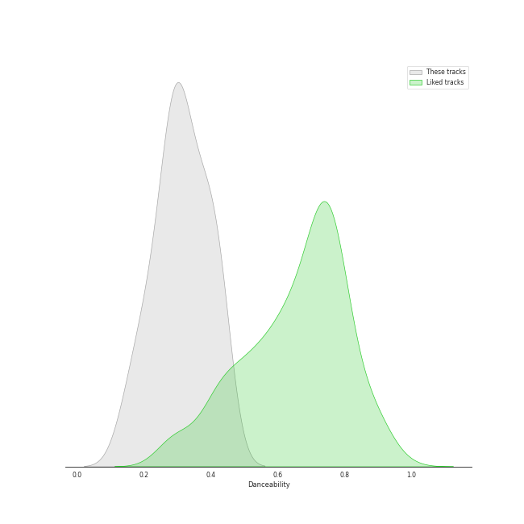
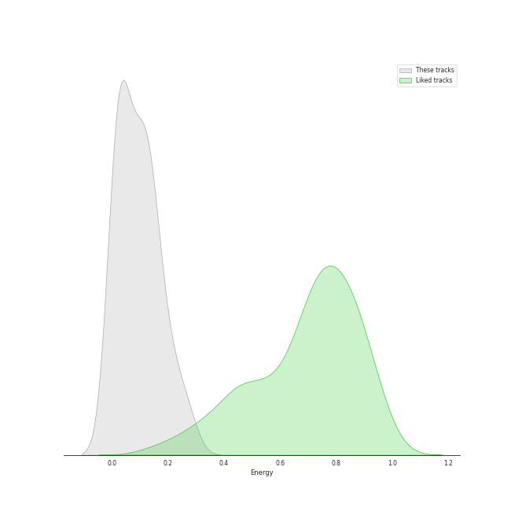
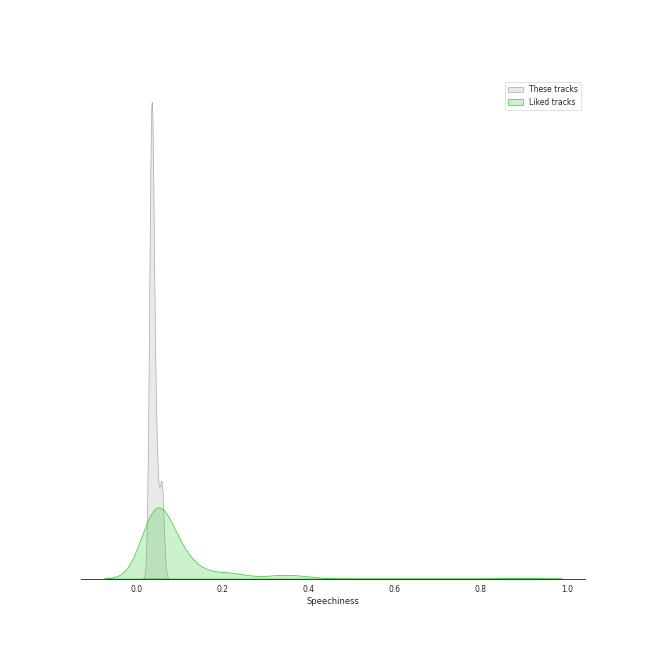
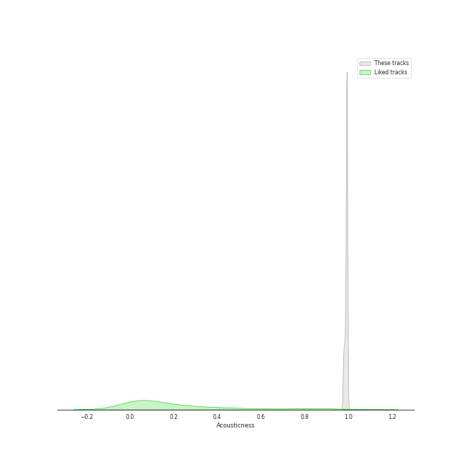
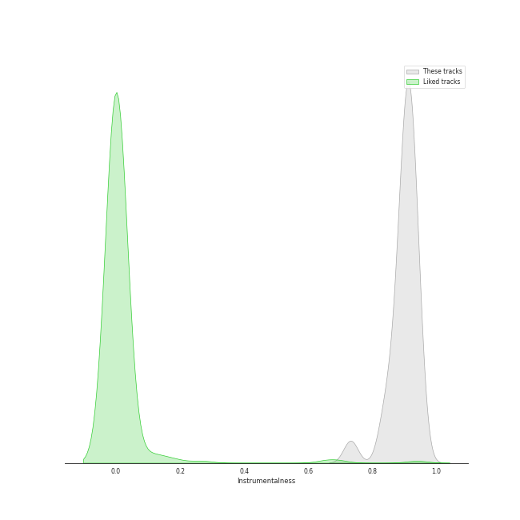
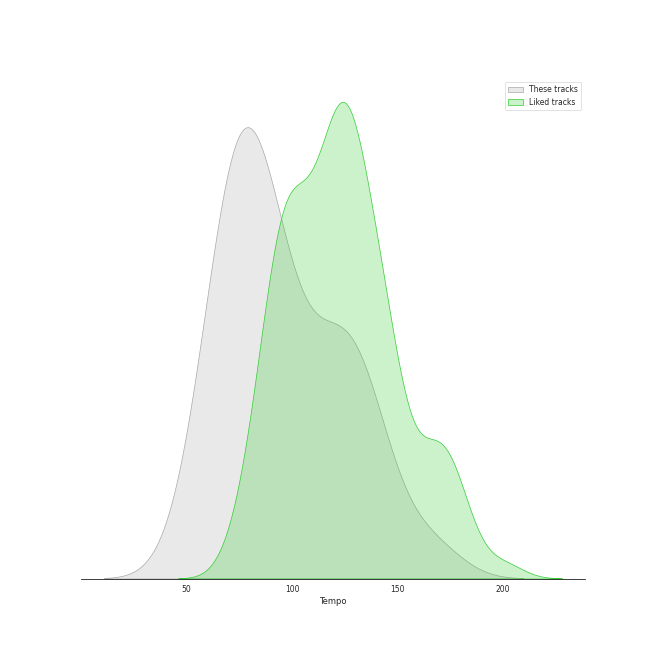

# Track Features for Rachmaninov

## Danceability

| ​ | 10 most Danceable tracks | ​​ | 10 least Danceable tracks |
|:---|:---|:---|:---|
|  | 13 Preludes, Op. 32: No. 3 in E Major: Allegro vivace (0.437) |  | Piano Concerto No. 2 in C Minor, Op. 18: 1. Moderato (0.144) |
|  | 13 Preludes, Op. 32: No. 8 in A Minor: Vivo (0.428) |  | 10 Preludes, Op. 23: No. 8 in A-Flat Major: Allegro vivace (0.177) |
|  | Morceaux de fantaisie, Op. 3: No. 2, Prelude in C-Sharp Minor (0.423) |  | Piano Concerto No. 2 in C Minor, Op. 18: 2. Adagio sostenuto (0.194) |
|  | 13 Preludes, Op. 32: No. 11 in B Major: Allegretto (0.414) |  | 10 Preludes, Op. 23: No. 2 in B-Flat Major: Maestoso (0.221) |
|  | 10 Preludes, Op. 23: No. 10 in G-Flat Major: Largo (0.414) |  | 13 Preludes, Op. 32: No. 7 in F Major: Moderato (0.223) |
|  | 10 Preludes, Op. 23: No. 5 in G Minor: Alla marcia (0.376) |  | 13 Preludes, Op. 32: No. 5 in G Major: Moderato (0.259) |
|  | 10 Preludes, Op. 23: No. 6 in E-Flat Major: Andante (0.375) |  | 10 Preludes, Op. 23: No. 4 in D Major: Andante cantabile (0.261) |
|  | 10 Preludes, Op. 23: No. 1 in F-Sharp Minor: Largo (0.373) |  | 13 Preludes, Op. 32: No. 2 in B-Flat Minor: Allegretto (0.265) |
|  | 10 Preludes, Op. 23: No. 3 in D Minor: Tempo di minuetto (0.373) |  | 13 Preludes, Op. 32: No. 13 in D-Flat Major: Grave - Allegro (0.282) |
|  | 13 Preludes, Op. 32: No. 1 in C Major: Allegro vivace (0.338) |  | 10 Preludes, Op. 23: No. 7 in C Minor: Allegro (0.288) |

## Energy

| ​ | 10 most Energetic tracks | ​​ | 10 least Energetic tracks |
|:---|:---|:---|:---|
|  | 10 Preludes, Op. 23: No. 2 in B-Flat Major: Maestoso (0.272) |  | 10 Preludes, Op. 23: No. 10 in G-Flat Major: Largo (0.00644) |
|  | 13 Preludes, Op. 32: No. 3 in E Major: Allegro vivace (0.23) |  | 13 Preludes, Op. 32: No. 5 in G Major: Moderato (0.00941) |
|  | 13 Preludes, Op. 32: No. 1 in C Major: Allegro vivace (0.205) |  | 13 Preludes, Op. 32: No. 7 in F Major: Moderato (0.0106) |
|  | 13 Preludes, Op. 32: No. 8 in A Minor: Vivo (0.173) |  | 10 Preludes, Op. 23: No. 1 in F-Sharp Minor: Largo (0.0136) |
|  | 10 Preludes, Op. 23: No. 5 in G Minor: Alla marcia (0.164) |  | 13 Preludes, Op. 32: No. 11 in B Major: Allegretto (0.0164) |
|  | 10 Preludes, Op. 23: No. 9 in E-Flat Minor: Presto (0.152) |  | 10 Preludes, Op. 23: No. 4 in D Major: Andante cantabile (0.0181) |
|  | Piano Concerto No. 2 in C Minor, Op. 18: 3. Allegro scherzando (0.148) |  | 10 Preludes, Op. 23: No. 6 in E-Flat Major: Andante (0.0248) |
|  | 13 Preludes, Op. 32: No. 4 in E Minor: Allegro con brio (0.125) |  | 13 Preludes, Op. 32: No. 2 in B-Flat Minor: Allegretto (0.036) |
|  | 13 Preludes, Op. 32: No. 13 in D-Flat Major: Grave - Allegro (0.124) |  | 13 Preludes, Op. 32: No. 10 in B Minor: Lento (0.0382) |
|  | 13 Preludes, Op. 32: No. 6 in F Minor: Allegro appassionato (0.123) |  | 10 Preludes, Op. 23: No. 3 in D Minor: Tempo di minuetto (0.0483) |

## Speechiness

| ​ | 10 most Speechy tracks | ​​ | 10 least Speechy tracks |
|:---|:---|:---|:---|
|  | 10 Preludes, Op. 23: No. 1 in F-Sharp Minor: Largo (0.0614) |  | 13 Preludes, Op. 32: No. 6 in F Minor: Allegro appassionato (0.0304) |
|  | Morceaux de fantaisie, Op. 3: No. 2, Prelude in C-Sharp Minor (0.0594) |  | 10 Preludes, Op. 23: No. 7 in C Minor: Allegro (0.0312) |
|  | 13 Preludes, Op. 32: No. 11 in B Major: Allegretto (0.0592) |  | 10 Preludes, Op. 23: No. 2 in B-Flat Major: Maestoso (0.0327) |
|  | 13 Preludes, Op. 32: No. 10 in B Minor: Lento (0.0535) |  | 10 Preludes, Op. 23: No. 6 in E-Flat Major: Andante (0.0333) |
|  | 13 Preludes, Op. 32: No. 13 in D-Flat Major: Grave - Allegro (0.0473) |  | Piano Concerto No. 2 in C Minor, Op. 18: 3. Allegro scherzando (0.0336) |
|  | 10 Preludes, Op. 23: No. 10 in G-Flat Major: Largo (0.0469) |  | 10 Preludes, Op. 23: No. 3 in D Minor: Tempo di minuetto (0.034) |
|  | 13 Preludes, Op. 32: No. 8 in A Minor: Vivo (0.0466) |  | 13 Preludes, Op. 32: No. 1 in C Major: Allegro vivace (0.0348) |
|  | 13 Preludes, Op. 32: No. 4 in E Minor: Allegro con brio (0.0416) |  | 10 Preludes, Op. 23: No. 5 in G Minor: Alla marcia (0.0353) |
|  | 10 Preludes, Op. 23: No. 8 in A-Flat Major: Allegro vivace (0.0408) |  | 13 Preludes, Op. 32: No. 2 in B-Flat Minor: Allegretto (0.0358) |
|  | 13 Preludes, Op. 32: No. 12 in G-Sharp Minor: Allegro (0.04) |  | 13 Preludes, Op. 32: No. 9 in A Major: Allegro moderato (0.0364) |

## Acousticness

| ​ | 10 most Acoustic tracks | ​​ | 10 least Acoustic tracks |
|:---|:---|:---|:---|
|  | 13 Preludes, Op. 32: No. 10 in B Minor: Lento (0.995) |  | 10 Preludes, Op. 23: No. 2 in B-Flat Major: Maestoso (0.977) |
|  | 13 Preludes, Op. 32: No. 7 in F Major: Moderato (0.995) |  | Piano Concerto No. 2 in C Minor, Op. 18: 1. Moderato (0.978) |
|  | 10 Preludes, Op. 23: No. 1 in F-Sharp Minor: Largo (0.995) |  | Piano Concerto No. 2 in C Minor, Op. 18: 3. Allegro scherzando (0.981) |
|  | 13 Preludes, Op. 32: No. 5 in G Major: Moderato (0.995) |  | Piano Concerto No. 2 in C Minor, Op. 18: 2. Adagio sostenuto (0.983) |
|  | 13 Preludes, Op. 32: No. 2 in B-Flat Minor: Allegretto (0.995) |  | 10 Preludes, Op. 23: No. 9 in E-Flat Minor: Presto (0.984) |
|  | 10 Preludes, Op. 23: No. 10 in G-Flat Major: Largo (0.995) |  | 13 Preludes, Op. 32: No. 6 in F Minor: Allegro appassionato (0.988) |
|  | 13 Preludes, Op. 32: No. 11 in B Major: Allegretto (0.994) |  | 13 Preludes, Op. 32: No. 13 in D-Flat Major: Grave - Allegro (0.988) |
|  | 10 Preludes, Op. 23: No. 6 in E-Flat Major: Andante (0.994) |  | 13 Preludes, Op. 32: No. 1 in C Major: Allegro vivace (0.99) |
|  | 13 Preludes, Op. 32: No. 3 in E Major: Allegro vivace (0.994) |  | 10 Preludes, Op. 23: No. 8 in A-Flat Major: Allegro vivace (0.99) |
|  | 10 Preludes, Op. 23: No. 4 in D Major: Andante cantabile (0.994) |  | Morceaux de fantaisie, Op. 3: No. 2, Prelude in C-Sharp Minor (0.991) |

## Instrumentalness

| ​ | 10 most Instrumental tracks | ​​ | 10 least Instrumental tracks |
|:---|:---|:---|:---|
|  | Piano Concerto No. 2 in C Minor, Op. 18: 2. Adagio sostenuto (0.945) |  | 13 Preludes, Op. 32: No. 1 in C Major: Allegro vivace (0.732) |
|  | 13 Preludes, Op. 32: No. 5 in G Major: Moderato (0.944) |  | 10 Preludes, Op. 23: No. 2 in B-Flat Major: Maestoso (0.836) |
|  | 13 Preludes, Op. 32: No. 3 in E Major: Allegro vivace (0.938) |  | 10 Preludes, Op. 23: No. 7 in C Minor: Allegro (0.841) |
|  | 10 Preludes, Op. 23: No. 9 in E-Flat Minor: Presto (0.937) |  | 13 Preludes, Op. 32: No. 13 in D-Flat Major: Grave - Allegro (0.866) |
|  | 10 Preludes, Op. 23: No. 3 in D Minor: Tempo di minuetto (0.928) |  | 10 Preludes, Op. 23: No. 5 in G Minor: Alla marcia (0.875) |
|  | Morceaux de fantaisie, Op. 3: No. 2, Prelude in C-Sharp Minor (0.926) |  | 13 Preludes, Op. 32: No. 2 in B-Flat Minor: Allegretto (0.877) |
|  | 13 Preludes, Op. 32: No. 9 in A Major: Allegro moderato (0.926) |  | 13 Preludes, Op. 32: No. 6 in F Minor: Allegro appassionato (0.888) |
|  | 10 Preludes, Op. 23: No. 6 in E-Flat Major: Andante (0.92) |  | 13 Preludes, Op. 32: No. 10 in B Minor: Lento (0.891) |
|  | 10 Preludes, Op. 23: No. 10 in G-Flat Major: Largo (0.916) |  | 13 Preludes, Op. 32: No. 8 in A Minor: Vivo (0.895) |
|  | 10 Preludes, Op. 23: No. 4 in D Major: Andante cantabile (0.916) |  | 10 Preludes, Op. 23: No. 8 in A-Flat Major: Allegro vivace (0.898) |

## Liveness

| ​ | 10 most Live tracks | ​​ | 10 least Live tracks |
|:---|:---|:---|:---|
|  | 10 Preludes, Op. 23: No. 9 in E-Flat Minor: Presto (0.145) |  | 13 Preludes, Op. 32: No. 7 in F Major: Moderato (0.0533) |
|  | 10 Preludes, Op. 23: No. 5 in G Minor: Alla marcia (0.133) |  | Piano Concerto No. 2 in C Minor, Op. 18: 2. Adagio sostenuto (0.0551) |
|  | 10 Preludes, Op. 23: No. 2 in B-Flat Major: Maestoso (0.127) |  | 13 Preludes, Op. 32: No. 8 in A Minor: Vivo (0.0631) |
|  | 13 Preludes, Op. 32: No. 3 in E Major: Allegro vivace (0.126) |  | Piano Concerto No. 2 in C Minor, Op. 18: 1. Moderato (0.0646) |
|  | 10 Preludes, Op. 23: No. 3 in D Minor: Tempo di minuetto (0.115) |  | 13 Preludes, Op. 32: No. 5 in G Major: Moderato (0.0677) |
|  | 13 Preludes, Op. 32: No. 6 in F Minor: Allegro appassionato (0.104) |  | 10 Preludes, Op. 23: No. 4 in D Major: Andante cantabile (0.0691) |
|  | 13 Preludes, Op. 32: No. 13 in D-Flat Major: Grave - Allegro (0.0966) |  | 13 Preludes, Op. 32: No. 9 in A Major: Allegro moderato (0.07) |
|  | 10 Preludes, Op. 23: No. 7 in C Minor: Allegro (0.0958) |  | 13 Preludes, Op. 32: No. 2 in B-Flat Minor: Allegretto (0.0758) |
|  | 10 Preludes, Op. 23: No. 8 in A-Flat Major: Allegro vivace (0.0931) |  | 10 Preludes, Op. 23: No. 10 in G-Flat Major: Largo (0.076) |
|  | 10 Preludes, Op. 23: No. 6 in E-Flat Major: Andante (0.0918) |  | Piano Concerto No. 2 in C Minor, Op. 18: 3. Allegro scherzando (0.0772) |

## Valence

| ​ | 10 most Happy tracks | ​​ | 10 least Happy tracks |
|:---|:---|:---|:---|
|  | 13 Preludes, Op. 32: No. 3 in E Major: Allegro vivace (0.345) |  | 13 Preludes, Op. 32: No. 10 in B Minor: Lento (0.0374) |
|  | 13 Preludes, Op. 32: No. 8 in A Minor: Vivo (0.27) |  | 13 Preludes, Op. 32: No. 12 in G-Sharp Minor: Allegro (0.0379) |
|  | 10 Preludes, Op. 23: No. 2 in B-Flat Major: Maestoso (0.268) |  | Piano Concerto No. 2 in C Minor, Op. 18: 2. Adagio sostenuto (0.0385) |
|  | 13 Preludes, Op. 32: No. 6 in F Minor: Allegro appassionato (0.209) |  | 10 Preludes, Op. 23: No. 1 in F-Sharp Minor: Largo (0.0387) |
|  | 10 Preludes, Op. 23: No. 9 in E-Flat Minor: Presto (0.203) |  | Piano Concerto No. 2 in C Minor, Op. 18: 1. Moderato (0.0393) |
|  | 13 Preludes, Op. 32: No. 1 in C Major: Allegro vivace (0.185) |  | Morceaux de fantaisie, Op. 3: No. 2, Prelude in C-Sharp Minor (0.0408) |
|  | 10 Preludes, Op. 23: No. 3 in D Minor: Tempo di minuetto (0.185) |  | 10 Preludes, Op. 23: No. 4 in D Major: Andante cantabile (0.0414) |
|  | 10 Preludes, Op. 23: No. 5 in G Minor: Alla marcia (0.134) |  | 13 Preludes, Op. 32: No. 2 in B-Flat Minor: Allegretto (0.0511) |
|  | 10 Preludes, Op. 23: No. 10 in G-Flat Major: Largo (0.121) |  | 13 Preludes, Op. 32: No. 13 in D-Flat Major: Grave - Allegro (0.0571) |
|  | 13 Preludes, Op. 32: No. 11 in B Major: Allegretto (0.119) |  | 13 Preludes, Op. 32: No. 5 in G Major: Moderato (0.066) |

## Tempo

| ​ | 10 most Fast tracks | ​​ | 10 least Fast tracks |
|:---|:---|:---|:---|
|  | 10 Preludes, Op. 23: No. 8 in A-Flat Major: Allegro vivace (165.488) |  | Piano Concerto No. 2 in C Minor, Op. 18: 1. Moderato (54.898) |
|  | Piano Concerto No. 2 in C Minor, Op. 18: 2. Adagio sostenuto (140.966) |  | 13 Preludes, Op. 32: No. 13 in D-Flat Major: Grave - Allegro (63.387) |
|  | Piano Concerto No. 2 in C Minor, Op. 18: 3. Allegro scherzando (134.886) |  | 10 Preludes, Op. 23: No. 6 in E-Flat Major: Andante (68.123) |
|  | 13 Preludes, Op. 32: No. 11 in B Major: Allegretto (132.844) |  | 13 Preludes, Op. 32: No. 12 in G-Sharp Minor: Allegro (69.581) |
|  | 10 Preludes, Op. 23: No. 1 in F-Sharp Minor: Largo (126.619) |  | 13 Preludes, Op. 32: No. 7 in F Major: Moderato (69.643) |
|  | 10 Preludes, Op. 23: No. 9 in E-Flat Minor: Presto (125.898) |  | 13 Preludes, Op. 32: No. 10 in B Minor: Lento (70.858) |
|  | 10 Preludes, Op. 23: No. 10 in G-Flat Major: Largo (125.513) |  | 10 Preludes, Op. 23: No. 4 in D Major: Andante cantabile (72.343) |
|  | 10 Preludes, Op. 23: No. 5 in G Minor: Alla marcia (114.233) |  | 13 Preludes, Op. 32: No. 9 in A Major: Allegro moderato (73.308) |
|  | 13 Preludes, Op. 32: No. 3 in E Major: Allegro vivace (109.836) |  | 13 Preludes, Op. 32: No. 8 in A Minor: Vivo (78.582) |
|  | 13 Preludes, Op. 32: No. 5 in G Major: Moderato (108.929) |  | 13 Preludes, Op. 32: No. 2 in B-Flat Minor: Allegretto (78.934) |
