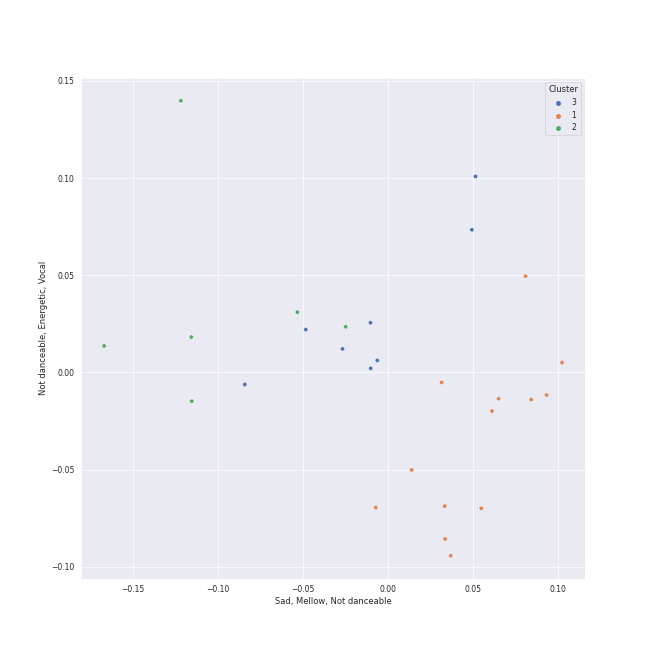

# Clusters in Rachmaninov

## Cluster #1

13 tracks

| Art | Track | Album | Artists | Label | Score | 💚 | 🔗 |
|:---|:---|:---|:---|:---|---:|:---|:---|
|  | 10 Preludes, Op. 23: No. 4 in D Major: Andante cantabile | Rachmaninov: Preludes for Piano (Complete) | Sergei Rachmaninoff, Eldar Nebolsin | [Naxos](../../../../labels/naxos) | 0 | | [🔗](https://open.spotify.com/track/0NtUQYljbdO9M2oIvUarTB) |
|  | 13 Preludes, Op. 32: No. 2 in B-Flat Minor: Allegretto | Rachmaninov: Preludes for Piano (Complete) | Sergei Rachmaninoff, Eldar Nebolsin | [Naxos](../../../../labels/naxos) | 0 | | [🔗](https://open.spotify.com/track/2jcKSE0ixtPCCfDPEln1FI) |
|  | 13 Preludes, Op. 32: No. 5 in G Major: Moderato | Rachmaninov: Preludes for Piano (Complete) | Sergei Rachmaninoff, Eldar Nebolsin | [Naxos](../../../../labels/naxos) | 0 | | [🔗](https://open.spotify.com/track/3bKoITIhcQfjzAvhQn3NCU) |
|  | Morceaux de fantaisie, Op. 3: No. 2, Prelude in C-Sharp Minor | Rachmaninov: Preludes for Piano (Complete) | Sergei Rachmaninoff, Eldar Nebolsin | [Naxos](../../../../labels/naxos) | 0 | | [🔗](https://open.spotify.com/track/3jyko3okSMjZbIGdElSQN5) |
|  | 10 Preludes, Op. 23: No. 1 in F-Sharp Minor: Largo | Rachmaninov: Preludes for Piano (Complete) | Sergei Rachmaninoff, Eldar Nebolsin | [Naxos](../../../../labels/naxos) | 0 | | [🔗](https://open.spotify.com/track/4JGHKe4tmlVDg4PoTWaoq7) |
|  | 10 Preludes, Op. 23: No. 6 in E-Flat Major: Andante | Rachmaninov: Preludes for Piano (Complete) | Sergei Rachmaninoff, Eldar Nebolsin | [Naxos](../../../../labels/naxos) | 0 | | [🔗](https://open.spotify.com/track/4VH21d5xLD6DtFKcawuoXw) |
|  | 13 Preludes, Op. 32: No. 7 in F Major: Moderato | Rachmaninov: Preludes for Piano (Complete) | Sergei Rachmaninoff, Eldar Nebolsin | [Naxos](../../../../labels/naxos) | 0 | | [🔗](https://open.spotify.com/track/4g9sNU83qPH85xNoFAZqED) |
|  | 13 Preludes, Op. 32: No. 11 in B Major: Allegretto | Rachmaninov: Preludes for Piano (Complete) | Sergei Rachmaninoff, Eldar Nebolsin | [Naxos](../../../../labels/naxos) | 0 | | [🔗](https://open.spotify.com/track/5RrWiz8zrTJCjHENxHTAJZ) |
|  | 13 Preludes, Op. 32: No. 10 in B Minor: Lento | Rachmaninov: Preludes for Piano (Complete) | Sergei Rachmaninoff, Eldar Nebolsin | [Naxos](../../../../labels/naxos) | 0 | | [🔗](https://open.spotify.com/track/6dclMhwb2xkTzcGFXYdUeQ) |
|  | 13 Preludes, Op. 32: No. 12 in G-Sharp Minor: Allegro | Rachmaninov: Preludes for Piano (Complete) | Sergei Rachmaninoff, Eldar Nebolsin | [Naxos](../../../../labels/naxos) | 0 | | [🔗](https://open.spotify.com/track/7JsvE4iJtehI0KbUeljgj5) |
## Cluster #2

6 tracks

| Art | Track | Album | Artists | Label | Score | 💚 | 🔗 |
|:---|:---|:---|:---|:---|---:|:---|:---|
|  | 13 Preludes, Op. 32: No. 3 in E Major: Allegro vivace | Rachmaninov: Preludes for Piano (Complete) | Sergei Rachmaninoff, Eldar Nebolsin | [Naxos](../../../../labels/naxos) | 0 | | [🔗](https://open.spotify.com/track/2cRFzJYirvLmlJX2DXO940) |
|  | 13 Preludes, Op. 32: No. 1 in C Major: Allegro vivace | Rachmaninov: Preludes for Piano (Complete) | Sergei Rachmaninoff, Eldar Nebolsin | [Naxos](../../../../labels/naxos) | 0 | | [🔗](https://open.spotify.com/track/3I7u1AhIGc9XHKQIjb1ZBG) |
|  | 10 Preludes, Op. 23: No. 2 in B-Flat Major: Maestoso | Rachmaninov: Preludes for Piano (Complete) | Sergei Rachmaninoff, Eldar Nebolsin | [Naxos](../../../../labels/naxos) | 0 | | [🔗](https://open.spotify.com/track/4pgud5L6apTBZ6sqeqnt44) |
|  | 13 Preludes, Op. 32: No. 8 in A Minor: Vivo | Rachmaninov: Preludes for Piano (Complete) | Sergei Rachmaninoff, Eldar Nebolsin | [Naxos](../../../../labels/naxos) | 0 | | [🔗](https://open.spotify.com/track/5BuaEWlAqAY71w10Q4Yd6B) |
|  | 10 Preludes, Op. 23: No. 9 in E-Flat Minor: Presto | Rachmaninov: Preludes for Piano (Complete) | Sergei Rachmaninoff, Eldar Nebolsin | [Naxos](../../../../labels/naxos) | 0 | | [🔗](https://open.spotify.com/track/5v2O3vGKHlmLVLqNKcOwCO) |
|  | 13 Preludes, Op. 32: No. 6 in F Minor: Allegro appassionato | Rachmaninov: Preludes for Piano (Complete) | Sergei Rachmaninoff, Eldar Nebolsin | [Naxos](../../../../labels/naxos) | 0 | | [🔗](https://open.spotify.com/track/67SGGqw9rymqT1DvdT5ka6) |
## Cluster #3

8 tracks

| Art | Track | Album | Artists | Label | Score | 💚 | 🔗 |
|:---|:---|:---|:---|:---|---:|:---|:---|
|  | 13 Preludes, Op. 32: No. 9 in A Major: Allegro moderato | Rachmaninov: Preludes for Piano (Complete) | Sergei Rachmaninoff, Eldar Nebolsin | [Naxos](../../../../labels/naxos) | 0 | | [🔗](https://open.spotify.com/track/07EzJ4VrpLaQtTzKyOAH3w) |
|  | 10 Preludes, Op. 23: No. 5 in G Minor: Alla marcia | Rachmaninov: Preludes for Piano (Complete) | Sergei Rachmaninoff, Eldar Nebolsin | [Naxos](../../../../labels/naxos) | 0 | | [🔗](https://open.spotify.com/track/0dwRX7z5Yzr1K96QhAKOBh) |
|  | 10 Preludes, Op. 23: No. 7 in C Minor: Allegro | Rachmaninov: Preludes for Piano (Complete) | Sergei Rachmaninoff, Eldar Nebolsin | [Naxos](../../../../labels/naxos) | 0 | | [🔗](https://open.spotify.com/track/1BKKpyRblOv1OWjZ0CcAWo) |
|  | 10 Preludes, Op. 23: No. 8 in A-Flat Major: Allegro vivace | Rachmaninov: Preludes for Piano (Complete) | Sergei Rachmaninoff, Eldar Nebolsin | [Naxos](../../../../labels/naxos) | 0 | | [🔗](https://open.spotify.com/track/3nJNmPeYs4buaULmYJ26X6) |
|  | 13 Preludes, Op. 32: No. 4 in E Minor: Allegro con brio | Rachmaninov: Preludes for Piano (Complete) | Sergei Rachmaninoff, Eldar Nebolsin | [Naxos](../../../../labels/naxos) | 0 | | [🔗](https://open.spotify.com/track/5GjDNg9mTkPrqUfg6CI8Zc) |
|  | 13 Preludes, Op. 32: No. 13 in D-Flat Major: Grave - Allegro | Rachmaninov: Preludes for Piano (Complete) | Sergei Rachmaninoff, Eldar Nebolsin | [Naxos](../../../../labels/naxos) | 0 | | [🔗](https://open.spotify.com/track/6LsBz8fLOpY96erLer7cRj) |
|  | Piano Concerto No. 2 in C Minor, Op. 18: 3. Allegro scherzando | Rachmaninov: Piano Concerto No.2 | Sergei Rachmaninoff, Valentina Lisitsa, London Symphony Orchestra, Michael Francis | [Decca Music Group Ltd.](../../../../labels/decca_music_group_ltd_) | 0 | | [🔗](https://open.spotify.com/track/253y3nl2iT4vWs2jHP4G3q) |
|  | Piano Concerto No. 2 in C Minor, Op. 18: 1. Moderato | Rachmaninov: Piano Concerto No.2 | Sergei Rachmaninoff, Valentina Lisitsa, London Symphony Orchestra, Michael Francis | [Decca Music Group Ltd.](../../../../labels/decca_music_group_ltd_) | 0 | | [🔗](https://open.spotify.com/track/6B1RtXteyMp3mJZTeuFRmE) |