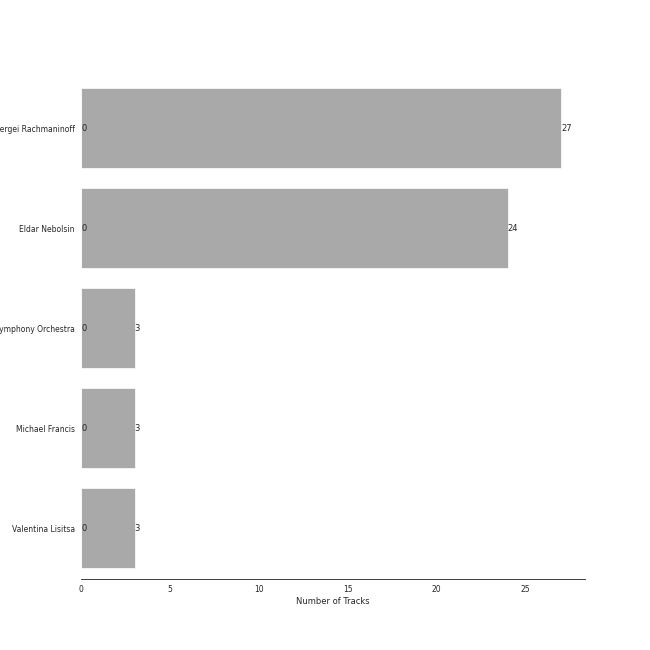
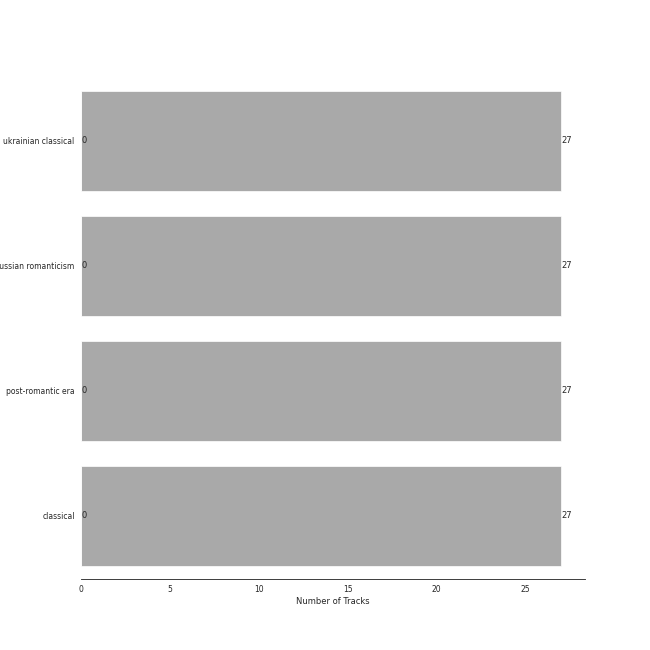

# Rachmaninov

[27 tracks (0 liked) 🔗](https://open.spotify.com/playlist/7LeSS5dq68CWVIOy81oza1)

[See Track Features](audio_features.md)

[See Clusters](clusters/overview.md)

## Top Artists

| Art | Tracks | 💚 | Artist | 🔗 |
|:---|---:|---:|:---|:---|
|  | 27 | 0 | Sergei Rachmaninoff | [🔗](https://open.spotify.com/artist/0Kekt6CKSo0m5mivKcoH51) |
|  | 24 | 0 | Eldar Nebolsin | [🔗](https://open.spotify.com/artist/45ts2AJTWlzJ9JrQlCGxpX) |
|  | 3 | 0 | London Symphony Orchestra | [🔗](https://open.spotify.com/artist/5yxyJsFanEAuwSM5kOuZKc) |
|  | 3 | 0 | Michael Francis | [🔗](https://open.spotify.com/artist/4znpeZQkiPbcXtHlRbfTqF) |
|  | 3 | 0 | Valentina Lisitsa | [🔗](https://open.spotify.com/artist/0gOrXuu1vCBXe3pwTyb5Ca) |

## Top Albums

| Art | Tracks | 💚 | Album | Release Date | 🔗 |
|:---|---:|---:|:---|:---|:---|
|  | 24 | 0 | Rachmaninov: Preludes for Piano (Complete) | 2007-05-29 | [🔗](https://open.spotify.com/album/1vlnwUAidj7bEmRhsq4zTv) |
|  | 3 | 0 | Rachmaninov: Piano Concerto No.2 | 2012-01-01 | [🔗](https://open.spotify.com/album/5lVqgXqdoIH3W1wUM2hzPx) |

## Top Record Labels

| Tracks | 💚 | Label |
|---:|---:|:---|
| 24 | 0 | [Naxos](../../labels/naxos/overview.md) |
| 3 | 0 | [Decca Music Group Ltd.](../../labels/decca_music_group_ltd_/overview.md) |

## Genres

| Tracks | 💚 | Genre |
|---:|---:|:---|
| 27 | 0 | ukrainian classical |
| 27 | 0 | [russian romanticism](../../genres/russian_romanticism/overview.md) |
| 27 | 0 | [post-romantic era](../../genres/post_romantic_era/overview.md) |
| 27 | 0 | [classical](../../genres/classical/overview.md) |

## Years

View all years

| Year | Number of Tracks |
|:---|---:|
| 2012 | 3 |
| [2007](2007.md) | 24 |

| ​ | 5 newest albums | ​​ | 5 oldest albums |
|:---|:---|:---|:---|
|  | Rachmaninov: Piano Concerto No.2 (2012-01-01) |  | Rachmaninov: Preludes for Piano (Complete) (2007-05-29) |
|  | Rachmaninov: Preludes for Piano (Complete) (2007-05-29) |  | Rachmaninov: Piano Concerto No.2 (2012-01-01) |