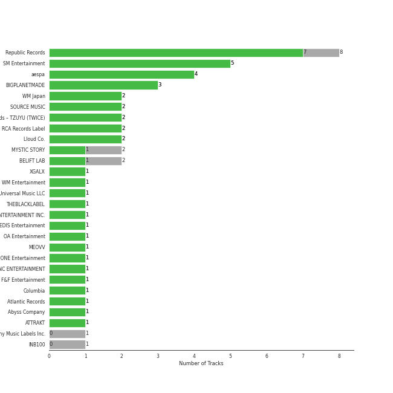

# Recent Comebacks

[62 songs](recent_comebacks_tracks.md)

## Top Artists

See all 28 artists

|   Number of Tracks | Art                                                                                              | Artist                                 | 🔗                                                           |
|-------------------:|:-------------------------------------------------------------------------------------------------|:---------------------------------------|:------------------------------------------------------------|
|                 11 |  | [Stray Kids](../artists/stray_kids.md) | [🔗](https://open.spotify.com/artist/2dIgFjalVxs4ThymZ67YCE) |
|                  6 |  | [BLACKPINK](../artists/blackpink.md)   | [🔗](https://open.spotify.com/artist/41MozSoPIsD1dJM0CLPjZF) |
|                  5 |  | [aespa](../artists/aespa.md)           | [🔗](https://open.spotify.com/artist/6YVMFz59CuY7ngCxTxjpxE) |
|                  5 |  | [Red Velvet](../artists/red_velvet.md) | [🔗](https://open.spotify.com/artist/1z4g3DjTBBZKhvAroFlhOM) |
|                  4 |  | NewJeans                               | [🔗](https://open.spotify.com/artist/6HvZYsbFfjnjFrWF950C9d) |
|                  4 |  | [ENHYPEN](../artists/enhypen.md)       | [🔗](https://open.spotify.com/artist/5t5FqBwTcgKTaWmfEbwQY9) |
|                  4 |  | [(G)I-DLE](../artists/_g_i_dle.md)     | [🔗](https://open.spotify.com/artist/2AfmfGFbe0A0WsTYm0SDTx) |
|                  3 |  | LE SSERAFIM                            | [🔗](https://open.spotify.com/artist/4SpbR6yFEvexJuaBpgAU5p) |
|                  3 |  | SEULGI                                 | [🔗](https://open.spotify.com/artist/2QM5S4yO6xHgnNvF0nbZZq) |
|                  3 |  | Jackson Wang                           | [🔗](https://open.spotify.com/artist/1kfWoWgCugPkyxQP8lkRlY) |
|                  2 |  | BIBI                                   | [🔗](https://open.spotify.com/artist/6UbmqUEgjLA6jAcXwbM1Z9) |
|                  2 |  | BoA                                    | [🔗](https://open.spotify.com/artist/4muJrGMndyYWqZtfk8OWy4) |
|                  2 |  | [ITZY](../artists/itzy.md)             | [🔗](https://open.spotify.com/artist/2KC9Qb60EaY0kW4eH68vr3) |
|                  1 |  | [NCT 127](../artists/nct_127.md)       | [🔗](https://open.spotify.com/artist/7f4ignuCJhLXfZ9giKT7rH) |
|                  1 |  | MAX CHANGMIN                           | [🔗](https://open.spotify.com/artist/7FiAkNWMb6ZBYI8tbQLuIS) |
|                  1 |  | IVE                                    | [🔗](https://open.spotify.com/artist/6RHTUrRF63xao58xh9FXYJ) |
|                  1 |  | ATEEZ                                  | [🔗](https://open.spotify.com/artist/68KmkJeZGfwe1OUaivBa2L) |
|                  1 |  | NINGNING                               | [🔗](https://open.spotify.com/artist/5t1uryofgueHrjrryqX8vM) |
|                  1 |  | HEIZE                                  | [🔗](https://open.spotify.com/artist/5dCvSnVduaFleCnyy98JMo) |
|                  1 |                                                               | Changbin                               | [🔗](https://open.spotify.com/artist/5OTVNUu0UHn6ddPyEAi419) |
|                  1 |                                                               | Bang Chan                              | [🔗](https://open.spotify.com/artist/4qy7HANJDOZRObts4Z0KSV) |
|                  1 |  | [TAEYEON](../artists/taeyeon.md)       | [🔗](https://open.spotify.com/artist/3qNVuliS40BLgXGxhdBdqu) |
|                  1 |  | WINTER                                 | [🔗](https://open.spotify.com/artist/3mPquBmMu97Iq9TpzQ6ayI) |
|                  1 |  | TEN                                    | [🔗](https://open.spotify.com/artist/3Q5Qep7ytrjVleNnMnntgQ) |
|                  1 |  | TREASURE                               | [🔗](https://open.spotify.com/artist/3KonOYiLsU53m4yT7gNotP) |
|                  1 |  | &TEAM                                  | [🔗](https://open.spotify.com/artist/2xfxRiKxoHl5tI0MKyvqV7) |
|                  1 |  | Billlie                                | [🔗](https://open.spotify.com/artist/2GQxKDojobwBjZMPf7aoh0) |
|                  1 |  | WENDY                                  | [🔗](https://open.spotify.com/artist/0FRUZvZNPzM3YJMABJxf2K) |

## Top Albums

See all 26 albums

|   Number of Tracks | Art                                                                                              | Album                                          | 🔗                                                          |
|-------------------:|:-------------------------------------------------------------------------------------------------|:-----------------------------------------------|:-----------------------------------------------------------|
|                  8 |  | SKZ-REPLAY                                     | [🔗](https://open.spotify.com/album/3UXrliH0JUQvcaLnBD8Txz) |
|                  6 |  | BORN PINK                                      | [🔗](https://open.spotify.com/album/7jaSNQUBJbvfbZHLNFrV7P) |
|                  4 |  | ‘The ReVe Festival 2022 - Birthday’            | [🔗](https://open.spotify.com/album/58OR7UoaJkJzqeQGClHzh1) |
|                  4 |  | I love                                         | [🔗](https://open.spotify.com/album/2Hyuin3i1cSZ1FlQFeCPZH) |
|                  4 |  | Girls - The 2nd Mini Album                     | [🔗](https://open.spotify.com/album/4w1dbvUy1crv0knXQvcSeY) |
|                  3 |  | MANIFESTO : DAY 1                              | [🔗](https://open.spotify.com/album/5J8MNLLViH5zqM6VoGErz8) |
|                  3 |  | MAGIC MAN                                      | [🔗](https://open.spotify.com/album/2VZ4og2ZbwyTQ3X1rbgCe1) |
|                  3 |  | ANTIFRAGILE                                    | [🔗](https://open.spotify.com/album/3u0ggfmK0vjuHMNdUbtaa9) |
|                  3 |  | 28 Reasons - The 1st Mini Album                | [🔗](https://open.spotify.com/album/1t5a29WYbJj83iy3RNICHw) |
|                  3 |  | 2022 Winter SMTOWN : SMCU PALACE               | [🔗](https://open.spotify.com/album/1HwnXJfZx8N8qDfzwUbxcw) |
|                  2 |  | NewJeans 1st EP 'New Jeans'                    | [🔗](https://open.spotify.com/album/1HMLpmZAnNyl9pxvOnTovV) |
|                  2 |  | NewJeans 'OMG'                                 | [🔗](https://open.spotify.com/album/45ozep8uHHnj5CCittuyXj) |
|                  2 |  | MAXIDENT                                       | [🔗](https://open.spotify.com/album/0T6hYH0UyDjNraWZk2mZWi) |
|                  2 |  | Lowlife Princess: Noir                         | [🔗](https://open.spotify.com/album/0AwCgoJKJUOgLp1imhnxuH) |
|                  2 |  | CHESHIRE                                       | [🔗](https://open.spotify.com/album/2a1ezg7hE6Dyuymv1aCnkm) |
|                  1 |  | the Billage of perception: chapter two         | [🔗](https://open.spotify.com/album/0NuM7kwh6u6fIRjn7Zh7Ss) |
|                  1 |  | Undo                                           | [🔗](https://open.spotify.com/album/2xR7YEyRweqClzs50bbW3J) |
|                  1 |  | THE SECOND STEP : CHAPTER TWO                  | [🔗](https://open.spotify.com/album/4l5YvRcmno5RMKZCZp1j0g) |
|                  1 |  | Street Man Fighter Original Vol.4 (Crew Songs) | [🔗](https://open.spotify.com/album/7dwRGP1A80POqE3O9At5Vw) |
|                  1 |  | SPIN OFF : FROM THE WITNESS                    | [🔗](https://open.spotify.com/album/0NQQk6vo9LOOwKjZc2iUwm) |
|                  1 |  | One In A Billion                               | [🔗](https://open.spotify.com/album/19Jm8Jk0zQYs6zMaxhYJFd) |
|                  1 |  | Forgive Me - The 3rd Mini Album                | [🔗](https://open.spotify.com/album/0vufEpmNpfB9NUPLkbIBN7) |
|                  1 |  | First Howling : ME                             | [🔗](https://open.spotify.com/album/3jqV1FFra3A2179rdtiNdo) |
|                  1 |  | Birthday - SM STATION : NCT LAB                | [🔗](https://open.spotify.com/album/6tcPTRUC3gwmG1iyWyzRzr) |
|                  1 |  | After LIKE                                     | [🔗](https://open.spotify.com/album/0nzRF7khA2UDSZa9T0B6Da) |
|                  1 |  | 2 Baddies - The 4th Album                      | [🔗](https://open.spotify.com/album/6p80QT3z7kOHpYdnsItQTQ) |

## Top Record Labels

See all 18 labels

|   Number of Tracks | Label                                                               |
|-------------------:|:--------------------------------------------------------------------|
|                 13 | [SM Entertainment](../labels/sm_entertainment.md)                   |
|                 12 | [Republic Records](../labels/republic_records.md)                   |
|                  7 | [YG Entertainment](../labels/yg_entertainment.md)                   |
|                  7 | [Warner Records](../labels/warner_records.md)                       |
|                  6 | [Interscope Records](../labels/interscope_records.md)               |
|                  5 | [88rising Music](../labels/88rising_music.md)                       |
|                  4 | [CUBE ENTERTAINMENT](../labels/cube_entertainment.md)               |
|                  4 | [BELIFT LAB](../labels/belift_lab.md)                               |
|                  4 | [ADOR](../labels/ador.md)                                           |
|                  3 | [TEAM WANG records](../labels/team_wang_records.md)                 |
|                  3 | [SOURCE MUSIC](../labels/source_music.md)                           |
|                  2 | [Genie Music Corporation](../labels/genie_music_corporation.md)     |
|                  2 | [Feel Ghood Music](../labels/feel_ghood_music.md)                   |
|                  1 | [Stone Music Entertainment](../labels/stone_music_entertainment.md) |
|                  1 | [Starship Entertainment](../labels/starship_entertainment.md)       |
|                  1 | [MYSTIC STORY](../labels/mystic_story.md)                           |
|                  1 | [KQ Entertainment](../labels/kq_entertainment.md)                   |
|                  1 | [HYBE LABELS JAPAN](../labels/hybe_labels_japan.md)                 |

## Genres

See all 6 genres

|   Number of Tracks | Genre                                             |
|-------------------:|:--------------------------------------------------|
|                 44 | [k-pop](../genres/k_pop.md)                       |
|                 26 | [k-pop girl group](../genres/k_pop_girl_group.md) |
|                 17 | [k-pop boy group](../genres/k_pop_boy_group.md)   |
|                  4 | anime                                             |
|                  3 | korean r&b                                        |
|                  1 | korean pop                                        |

## Audio Features

| 10 most Danceable tracks   | 10 least Danceable tracks   |
|:---------------------------|:----------------------------|
| RUN (HAN)                  | Girls                       |
| Typa Girl                  | Dead Man Runnin’            |
| HEYDAY (Prod. Czaer)       | Birthday                    |
| ANTIFRAGILE                | Blow                        |
| LOVE                       | i hate to admit (Bang Chan) |
| Maknae On Top (I.N)        | Life's Too Short            |
| Shut Down                  | Deep end (Felix)            |
| On A Ride                  | HALAZIA                     |
| Ditto                      | BIBI Vengeance              |
| CASE 143                   | Time After Time             |

| 10 most Energetic tracks              | 10 least Energetic tracks   |
|:--------------------------------------|:----------------------------|
| Girls                                 | Crown                       |
| One In A Billion                      | HELLO                       |
| RING ma Bell (what a wonderful world) | Animal Farm                 |
| Hype Boy                              | Time After Time             |
| After LIKE                            | Birthday                    |
| 2 Baddies                             | Cruel                       |
| Nxde                                  | The Happiest Girl           |
| Future Perfect (Pass the MIC)         | miss you (Hyunjin)          |
| Forgive Me                            | Deep end (Felix)            |
| CASE 143                              | i hate to admit (Bang Chan) |

| 10 most Speechy tracks        | 10 least Speechy tracks   |
|:------------------------------|:--------------------------|
| I GOT IT (HAN)                | Impurities                |
| Girls                         | Time After Time           |
| Future Perfect (Pass the MIC) | Attention                 |
| 2 Baddies                     | TFW (That Feeling When)   |
| RUN (HAN)                     | Yeah Yeah Yeah            |
| Hype Boy                      | Come Alive                |
| CASE 143                      | The Happiest Girl         |
| Birthday                      | Animal Farm               |
| Nxde                          | Beautiful Christmas       |
| Sculpture                     | Cruel                     |

| 10 most Acoustic tracks     | 10 least Acoustic tracks   |
|:----------------------------|:---------------------------|
| Deep end (Felix)            | Animal Farm                |
| miss you (Hyunjin)          | Pink Venom                 |
| i hate to admit (Bang Chan) | No Celestial               |
| RUN (HAN)                   | Hard to Love               |
| ZOOM                        | Yeah Yeah Yeah             |
| The Happiest Girl           | Blow                       |
| Crown                       | Shut Down                  |
| Life's Too Short            | Come Alive                 |
| Hug Me (I.N)                | Cruel                      |
| OMG                         | HALAZIA                    |

| 10 most Instrumental tracks   | 10 least Instrumental tracks   |
|:------------------------------|:-------------------------------|
| Lingo                         | RUN (HAN)                      |
| Girls                         | ANTIFRAGILE                    |
| HALAZIA                       | I GOT IT (HAN)                 |
| Crown                         | Forgive Me                     |
| BIBI Vengeance                | BYE BYE                        |
| Priority                      | Birthday                       |
| Cruel                         | Sculpture                      |
| ZOOM                          | Deep end (Felix)               |
| On A Ride                     | ParadoXXX Invasion             |
| Maknae On Top (I.N)           | Shut Down                      |

| 10 most Live tracks   | 10 least Live tracks                                |
|:----------------------|:----------------------------------------------------|
| Typa Girl             | I GOT IT (HAN)                                      |
| Animal Farm           | BIBI Vengeance                                      |
| Forgive Me            | Yeah Yeah Yeah                                      |
| Nxde                  | Come Alive                                          |
| BYE BYE               | Up All Night (Bang Chan, Changbin, Felix, Seungmin) |
| Cheshire              | Birthday                                            |
| Time After Time       | Maknae On Top (I.N)                                 |
| ParadoXXX Invasion    | Scent of you                                        |
| Beautiful Christmas   | HEYDAY (Prod. Czaer)                                |
| Illusion              | CASE 143                                            |

| 10 most Happy tracks                                | 10 least Happy tracks   |
|:----------------------------------------------------|:------------------------|
| Up All Night (Bang Chan, Changbin, Felix, Seungmin) | LOVE                    |
| TFW (That Feeling When)                             | Priority                |
| Maknae On Top (I.N)                                 | Crown                   |
| ANTIFRAGILE                                         | Change                  |
| Give Me Your TMI                                    | miss you (Hyunjin)      |
| I GOT IT (HAN)                                      | Dead Man Runnin’        |
| ZOOM                                                | Sculpture               |
| Blow                                                | Deep end (Felix)        |
| Hug Me (I.N)                                        | Ditto                   |
| Snowy                                               | Time After Time         |
