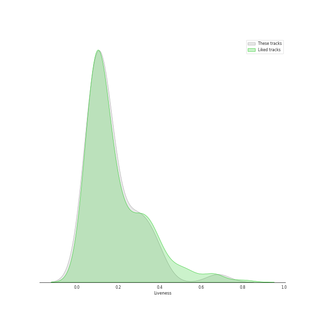

# Track Features for Recent Comebacks

## Danceability

| ​ | 10 most Danceable tracks | ​​ | 10 least Danceable tracks |
|:---|:---|:---|:---|
|  | Sensitive (0.918) |  | Will I Ever See You Again? (0.364) |
|  | BET ON ME (0.917) |  | All For Nothing (0.435) |
|  | Love Lee (0.914) |  | Nightmare (0.466) |
|  | Monster (0.913) |  | Naked Gold (Prod. Czaer) (0.468) |
|  | BATTER UP (0.903) |  | STRANGER (0.475) |
|  | Get A Guitar (0.9) |  | Sad Waltz (0.49) |
|  | Sweet Venom (English Ver.) (0.866) |  | OOTD (0.499) |
|  | Bratty (0.859) |  | Chill Kill (0.531) |
|  | 3D (feat. Jack Harlow) (0.853) |  | Social Path (Feat. LiSA) (Korean Ver.) (0.549) |
|  | Hot Air Balloon (0.848) |  | Funny Valentine (0.553) |

## Energy

| ​ | 10 most Energetic tracks | ​​ | 10 least Energetic tracks |
|:---|:---|:---|:---|
|  | The Flash (0.953) |  | Sad Waltz (0.218) |
|  | Galileo (0.943) |  | All For Nothing (0.287) |
|  | ZOOM ZOOM (0.941) |  | Hongdae R&B (0.44) |
|  | YOLO (0.936) |  | Burn It Down (0.495) |
|  | RINGO (0.921) |  | Tarantino (0.505) |
|  | Killin’ Me Good (0.918) |  | Love Lee (0.532) |
|  | LIP GLOSS (0.912) |  | Nightmare (0.534) |
|  | God of Music (0.912) |  | MOVE (T5) (0.552) |
|  | Social Path (Feat. LiSA) (Korean Ver.) (0.909) |  | Fry’s Dream (0.557) |
|  | Fact Check (0.908) |  | You & Me (0.573) |

## Speechiness

| ​ | 10 most Speechy tracks | ​​ | 10 least Speechy tracks |
|:---|:---|:---|:---|
|  | Nightmare (0.429) |  | Perfect Night (0.0308) |
|  | Chili (0.318) |  | I DO (0.0317) |
|  | Baggy Jeans (0.289) |  | AGASSY (0.032) |
|  | Bad News (0.233) |  | Orange Flower (You Complete Me) (0.0324) |
|  | PADO (0.222) |  | It's not easy for you (0.0328) |
|  | YOLO (0.19) |  | DALALA (0.0338) |
|  | Do not touch (0.188) |  | Melt Away (0.0353) |
|  | Social Path (Feat. LiSA) (Korean Ver.) (0.187) |  | GRL GVNG (0.0372) |
|  | God of Music (0.167) |  | Talk Saxy (0.0385) |
|  | Amigos (with Becky G) (0.163) |  | Tarantino (0.0398) |

## Acousticness

| ​ | 10 most Acoustic tracks | ​​ | 10 least Acoustic tracks |
|:---|:---|:---|:---|
|  | All For Nothing (0.873) |  | Fast Forward (0.00125) |
|  | Sad Waltz (0.856) |  | THE GIRLS - BLACKPINK THE GAME OST (0.00199) |
|  | None of My Business (0.539) |  | OOTD (0.00614) |
|  | Hongdae R&B (0.504) |  | MEGAVERSE (0.00875) |
|  | Nightmare (0.483) |  | I DO (0.00905) |
|  | One Kiss (0.465) |  | Baggy Jeans (0.0102) |
|  | Either Way (0.461) |  | Tarantino (0.0106) |
|  | Melt Away (0.453) |  | Naked Gold (Prod. Czaer) (0.0139) |
|  | Love Lee (0.453) |  | You & Me (0.0147) |
|  | NOBODY (0.437) |  | The Flash (0.0152) |

## Instrumentalness

| ​ | 10 most Instrumental tracks | ​​ | 10 least Instrumental tracks |
|:---|:---|:---|:---|
|  | Tarantino (0.792) |  | DALALA (0.0) |
|  | Sad Waltz (0.0346) |  | BONA BONA (0.0) |
|  | Better Things (0.00323) |  | Nightmare (0.0) |
|  | YOLO (0.000588) |  | Jingle Bell Rock (0.0) |
|  | I Want That (0.000584) |  | Nightmare (0.0) |
|  | Nightmare (0.000488) |  | Behind The Curtain (0.0) |
|  | Fast Forward (0.000295) |  | LALALALA (0.0) |
|  | Naked Gold (Prod. Czaer) (0.000258) |  | Monster (0.0) |
|  | AGASSY (0.000243) |  | THE GIRLS - BLACKPINK THE GAME OST (0.0) |
|  | Picture (0.000189) |  | Hot Air Balloon (0.0) |

## Liveness

| ​ | 10 most Live tracks | ​​ | 10 least Live tracks |
|:---|:---|:---|:---|
|  | LALALALA (0.653) |  | Do not touch (0.0418) |
|  | Better Things (0.496) |  | CAKE (0.0431) |
|  | OOTD (0.467) |  | Killin’ Me Good (0.0449) |
|  | The Flash (0.461) |  | WATCH IT (0.0507) |
|  | None of My Business (0.445) |  | Hot Air Balloon (0.0513) |
|  | YOLO (0.415) |  | LIP GLOSS (0.0539) |
|  | Don't Blink (0.384) |  | SLAY (0.0621) |
|  | Drama (0.363) |  | Perfect Night (0.0631) |
|  | Knock Knock (Who's There?) (0.356) |  | PADO (0.0647) |
|  | RINGO (0.347) |  | Sensitive (0.0649) |

## Valence

| ​ | 10 most Happy tracks | ​​ | 10 least Happy tracks |
|:---|:---|:---|:---|
|  | LIP GLOSS (0.961) |  | SLAY (0.203) |
|  | Nightmare (0.921) |  | All For Nothing (0.228) |
|  | Good & Great (0.915) |  | Sad Waltz (0.259) |
|  | Sweet Venom (0.911) |  | CRUSH (0.274) |
|  | Sweet Venom (English Ver.) (0.905) |  | MOVE (T5) (0.307) |
|  | Get A Guitar (0.895) |  | Nightmare (0.321) |
|  | NOBODY (0.891) |  | WATCH IT (0.327) |
|  | Seven (feat. Latto) (Explicit Ver.) (0.89) |  | BONA BONA (0.36) |
|  | DALALA (0.89) |  | THE GIRLS - BLACKPINK THE GAME OST (0.36) |
|  | 3D (feat. Jack Harlow) (0.888) |  | Social Path (Feat. LiSA) (Korean Ver.) (0.37) |

## Tempo

| ​ | 10 most Fast tracks | ​​ | 10 least Fast tracks |
|:---|:---|:---|:---|
|  | Funny Valentine (185.968) |  | Naked Gold (Prod. Czaer) (62.107) |
|  | One Kiss (180.058) |  | STRANGER (62.644) |
|  | OOTD (176.181) |  | It's not easy for you (80.017) |
|  | Social Path (Feat. LiSA) (Korean Ver.) (172.025) |  | Bandit (80.017) |
|  | Be Mine (170.001) |  | Guilty (81.983) |
|  | Nightmare (162.0) |  | Behind The Curtain (82.449) |
|  | Nightmare (161.861) |  | Bad News (83.687) |
|  | Nightmare (160.19) |  | Baggy Jeans (88.666) |
|  | THE GIRLS - BLACKPINK THE GAME OST (160.07) |  | Talk Saxy (89.007) |
|  | MEGAVERSE (160.051) |  | Je Ne Sais Quoi (91.968) |
