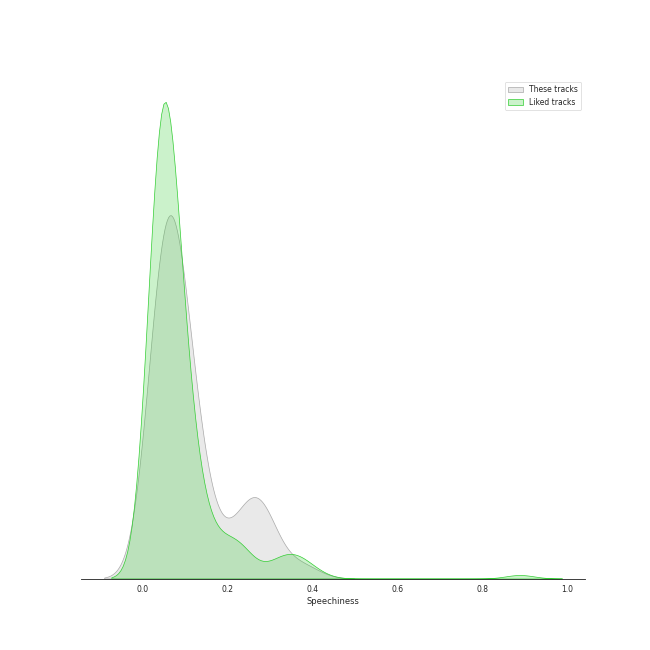
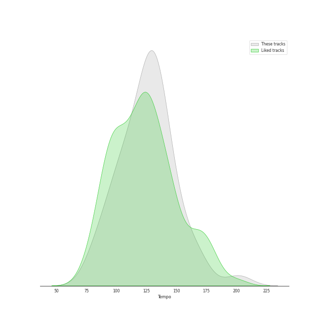

# Track Features for Recent Comebacks

## Danceability

| ​ | 10 most Danceable tracks | ​​ | 10 least Danceable tracks |
|:---|:---|:---|:---|
|  | ASAP (0.934) |  | AMYGDALA (0.311) |
|  | Sensitive (0.918) |  | Seed (0.395) |
|  | BET ON ME (0.917) |  | 'Til We Meet Again (0.474) |
|  | Love Lee (0.914) |  | Sad Waltz (0.49) |
|  | Get A Guitar (0.9) |  | Dust (0.497) |
|  | S-Class (0.886) |  | Save Me (0.527) |
|  | Cheetah (0.885) |  | BOUNCY (K-HOT CHILLI PEPPERS) (0.532) |
|  | Slow (with Ciara) (0.863) |  | Sacrifice (Eat Me Up) (0.536) |
|  | Bratty (0.859) |  | In Bloom (0.551) |
|  | Macarena (0.854) |  | Funny Valentine (0.553) |

## Energy

| ​ | 10 most Energetic tracks | ​​ | 10 least Energetic tracks |
|:---|:---|:---|:---|
|  | ISTJ (0.956) |  | Sad Waltz (0.218) |
|  | The Flash (0.953) |  | Seed (0.33) |
|  | Galileo (0.943) |  | Hongdae R&B (0.44) |
|  | ZOOM ZOOM (0.941) |  | ASAP (0.486) |
|  | RINGO (0.921) |  | Tarantino (0.505) |
|  | Allergy (0.92) |  | Love Lee (0.532) |
|  | Killin’ Me Good (0.918) |  | MOVE (T5) (0.552) |
|  | LIP GLOSS (0.912) |  | Fry’s Dream (0.557) |
|  | Fact Check (0.908) |  | You & Me (0.573) |
|  | TROUBLE (0.903) |  | People Pt.2 (feat. IU) (0.574) |

## Speechiness

| ​ | 10 most Speechy tracks | ​​ | 10 least Speechy tracks |
|:---|:---|:---|:---|
|  | S-Class (0.333) |  | Welcome To MY World (feat. nævis) (0.0304) |
|  | Chili (0.318) |  | I DO (0.0307) |
|  | Haegeum (0.304) |  | Lips (0.0324) |
|  | Baggy Jeans (0.289) |  | It's not easy for you (0.0328) |
|  | Cheetah (0.225) |  | DALALA (0.0338) |
|  | PADO (0.222) |  | KNOCK (0.035) |
|  | Hall of Fame (0.214) |  | Seed (0.0358) |
|  | TOPLINE (Feat. Tiger JK) (0.213) |  | GRL GVNG (0.0372) |
|  | Eve, Psyche & The Bluebeard’s wife (0.2) |  | Blue Blood (0.0374) |
|  | Do not touch (0.188) |  | Perfume (0.0377) |

## Acousticness

| ​ | 10 most Acoustic tracks | ​​ | 10 least Acoustic tracks |
|:---|:---|:---|:---|
|  | Sad Waltz (0.856) |  | KNOCK (0.000545) |
|  | Cool With You (0.653) |  | Fast Forward (0.00125) |
|  | Thirsty (0.549) |  | THE GIRLS - BLACKPINK THE GAME OST (0.00199) |
|  | None of My Business (0.539) |  | Blue Blood (0.0041) |
|  | New Jeans (0.51) |  | Shoong! (feat. LISA of BLACKPINK) (0.00789) |
|  | Hongdae R&B (0.504) |  | BOUNCY (K-HOT CHILLI PEPPERS) (0.00869) |
|  | ASAP (0.466) |  | Baggy Jeans (0.0102) |
|  | Seed (0.454) |  | Fire in the belly (0.0106) |
|  | Love Lee (0.453) |  | Tarantino (0.0106) |
|  | Sacrifice (Eat Me Up) (0.444) |  | I AM (0.0115) |

## Instrumentalness

| ​ | 10 most Instrumental tracks | ​​ | 10 least Instrumental tracks |
|:---|:---|:---|:---|
|  | Tarantino (0.792) |  | Fire in the belly (0.0) |
|  | Sad Waltz (0.0346) |  | DALALA (0.0) |
|  | Better Things (0.00323) |  | CRIMINAL LOVE (0.0) |
|  | New Jeans (0.00216) |  | BONA BONA (0.0) |
|  | Cool With You (0.00136) |  | Lips (0.0) |
|  | Make Me Feel (0.00062) |  | Nightmare (0.0) |
|  | I Want That (0.000584) |  | Perfume (0.0) |
|  | Room (0.000464) |  | TOPLINE (Feat. Tiger JK) (0.0) |
|  | Fast Forward (0.000295) |  | Behind The Curtain (0.0) |
|  | Queencard (0.000268) |  | ITEM (0.0) |

## Liveness

| ​ | 10 most Live tracks | ​​ | 10 least Live tracks |
|:---|:---|:---|:---|
|  | Better Things (0.496) |  | Fire in the belly (0.0266) |
|  | Haegeum (0.471) |  | HARD (0.0347) |
|  | The Flash (0.461) |  | Do not touch (0.0418) |
|  | None of My Business (0.445) |  | CAKE (0.0431) |
|  | Shoong! (feat. LISA of BLACKPINK) (0.409) |  | Killin’ Me Good (0.0449) |
|  | CRIMINAL LOVE (0.404) |  | Allergy (0.0467) |
|  | Giddy (0.367) |  | Kitsch (0.0495) |
|  | Cheetah (0.35) |  | Eve, Psyche & The Bluebeard’s wife (0.0519) |
|  | RINGO (0.347) |  | LIP GLOSS (0.0539) |
|  | WICKED LOVE (0.34) |  | KNOCK (0.055) |

## Valence

| ​ | 10 most Happy tracks | ​​ | 10 least Happy tracks |
|:---|:---|:---|:---|
|  | LIP GLOSS (0.961) |  | AMYGDALA (0.16) |
|  | No-Return (Into the unknown) (0.948) |  | SLAY (0.203) |
|  | WICKED LOVE (0.945) |  | Seed (0.215) |
|  | One and Only (0.936) |  | Shoong! (feat. LISA of BLACKPINK) (0.255) |
|  | KNOCK (0.935) |  | Sad Waltz (0.259) |
|  | Good & Great (0.915) |  | MOVE (T5) (0.307) |
|  | Sunshower (0.902) |  | Make Me Feel (0.315) |
|  | STUPID (0.897) |  | Room (0.328) |
|  | Get A Guitar (0.895) |  | I'm Unhappy (0.334) |
|  | Seven (feat. Latto) (Explicit Ver.) (0.89) |  | Bills (0.347) |

## Tempo

| ​ | 10 most Fast tracks | ​​ | 10 least Fast tracks |
|:---|:---|:---|:---|
|  | Funny Valentine (185.968) |  | Sacrifice (Eat Me Up) (68.985) |
|  | Save Me (171.815) |  | Thirsty (77.513) |
|  | Be Mine (170.001) |  | AMYGDALA (78.265) |
|  | WICKED LOVE (165.871) |  | It's not easy for you (80.017) |
|  | Allergy (165.087) |  | Bandit (80.017) |
|  | 섬찟 (Hypnosis) (164.918) |  | I'm Unhappy (81.947) |
|  | Dust (164.904) |  | In Bloom (82.034) |
|  | ITEM (161.994) |  | Behind The Curtain (82.449) |
|  | Nightmare (160.19) |  | Haegeum (85.097) |
|  | Hall of Fame (160.164) |  | Baggy Jeans (88.666) |
