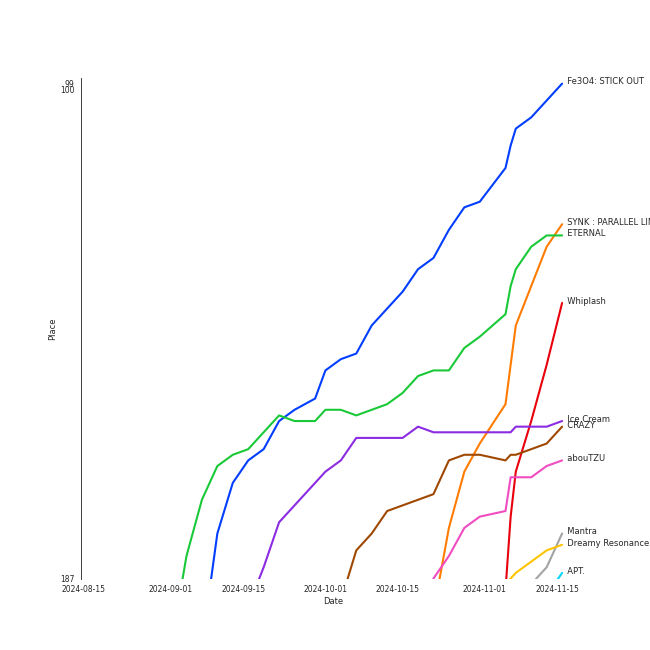

# Recent Comebacks

[80 tracks (70 liked) 🔗](https://open.spotify.com/playlist/2UAy7fw8nOjoJvFsNZtjbI)

[See Track Features](audio_features.md)

[See Clusters](clusters/overview.md)

## Top Artists

| Art | Rank | Tracks | 💚 | Artist | 🔗 |
|:---|---:|---:|---:|:---|:---|
|  | 1 | 10 | 10 | [aespa](../../artists/aespa/overview.md) | [🔗](https://open.spotify.com/artist/6YVMFz59CuY7ngCxTxjpxE) |
|  | 7 | 10 | 9 | [ENHYPEN](../../artists/enhypen/overview.md) | [🔗](https://open.spotify.com/artist/5t5FqBwTcgKTaWmfEbwQY9) |
|  | 20 | 6 | 5 | [NMIXX](../../artists/nmixx/overview.md) | [🔗](https://open.spotify.com/artist/28ot3wh4oNmoFOdVajibBl) |
|  | 17 | 5 | 4 | [IVE](../../artists/ive/overview.md) | [🔗](https://open.spotify.com/artist/6RHTUrRF63xao58xh9FXYJ) |
|  | 23 | 4 | 4 | [NewJeans](../../artists/newjeans/overview.md) | [🔗](https://open.spotify.com/artist/6HvZYsbFfjnjFrWF950C9d) |
|  | 2 | 4 | 4 | [Red Velvet](../../artists/red_velvet/overview.md) | [🔗](https://open.spotify.com/artist/1z4g3DjTBBZKhvAroFlhOM) |
|  | 65 | 4 | 3 | [Solar](../../artists/solar/overview.md) | [🔗](https://open.spotify.com/artist/5cYcI546S8Lf97m4mNdYLD) |
|  | 16 | 4 | 3 | [STAYC](../../artists/stayc/overview.md) | [🔗](https://open.spotify.com/artist/01XYiBYaoMJcNhPokrg0l0) |
|  | 10 | 3 | 2 | [Stray Kids](../../artists/stray_kids/overview.md) | [🔗](https://open.spotify.com/artist/2dIgFjalVxs4ThymZ67YCE) |
|  | 72 | 3 | 2 | [TAEMIN](../../artists/taemin/overview.md) | [🔗](https://open.spotify.com/artist/13rF01aOogvnkuQXOlgTW8) |

See all 35 artists

| Art | Rank | Tracks | 💚 | Artist | 🔗 |
|:---|---:|---:|---:|:---|:---|
|  | 12 | 2 | 2 | [SEVENTEEN](../../artists/seventeen/overview.md) | [🔗](https://open.spotify.com/artist/7nqOGRxlXj7N2JYbgNEjYH) |
|  | 39 | 2 | 2 | [EVERGLOW](../../artists/everglow/overview.md) | [🔗](https://open.spotify.com/artist/3ZZzT0naD25RhY2uZvIKkJ) |
|  | 5 | 2 | 2 | [ITZY](../../artists/itzy/overview.md) | [🔗](https://open.spotify.com/artist/2KC9Qb60EaY0kW4eH68vr3) |
|  | 147 | 2 | 2 | NAYEON | [🔗](https://open.spotify.com/artist/1VwDG9aBflQupaFNjUru9A) |
|  | 43 | 2 | 1 | [KISS OF LIFE](../../artists/kiss_of_life/overview.md) | [🔗](https://open.spotify.com/artist/4TEK9tIkcoxib4GxT3O4ky) |
|  | 66 | 1 | 1 | JEON SOMI | [🔗](https://open.spotify.com/artist/7zYj9S9SdIunYCfSm7vzAR) |
|  | 419 | 1 | 1 | Kid Milli | [🔗](https://open.spotify.com/artist/7IWshUcKfJyDWrbiF2XT8J) |
|  | 67 | 1 | 1 | [AKMU](../../artists/akmu/overview.md) | [🔗](https://open.spotify.com/artist/6OwKE9Ez6ALxpTaKcT5ayv) |
|  | 40 | 1 | 1 | [SUNMI](../../artists/sunmi/overview.md) | [🔗](https://open.spotify.com/artist/6MoXcK2GyGg7FIyxPU5yW6) |
|  | 361 | 1 | 1 | SUHO | [🔗](https://open.spotify.com/artist/5zkf2Na8DKKJmtWX5Xrx3m) |
|  | 29 | 1 | 1 | [Dreamcatcher](../../artists/dreamcatcher/overview.md) | [🔗](https://open.spotify.com/artist/5V1qsQHdXNm4ZEZHWvFnqQ) |
|  | 419 | 1 | 1 | UNIS | [🔗](https://open.spotify.com/artist/48xyu8QHo1IhsQZGlgNGYZ) |
|  | 8 | 1 | 1 | [TAEYEON](../../artists/taeyeon/overview.md) | [🔗](https://open.spotify.com/artist/3qNVuliS40BLgXGxhdBdqu) |
|  | 419 | 1 | 1 | KATSEYE | [🔗](https://open.spotify.com/artist/3c0gDdb9lhnHGFtP4prQpn) |
| | 419 | 1 | 1 | JULIE | [🔗](https://open.spotify.com/artist/3ZMTicGYs90UxyTEIScT5h) |
|  | 158 | 1 | 1 | JO1 | [🔗](https://open.spotify.com/artist/2koP6FEfIEVk4l2Fe6jFhu) |
|  | 88 | 1 | 1 | RIIZE | [🔗](https://open.spotify.com/artist/2jOm3cYujQx6o1dxuiuqaX) |
|  | 419 | 1 | 1 | BADVILLAIN | [🔗](https://open.spotify.com/artist/2Y7fY3aflbCTxp6h5hw0CV) |
|  | 6 | 1 | 1 | [(G)I-DLE](../../artists/(g)i-dle/overview.md) | [🔗](https://open.spotify.com/artist/2AfmfGFbe0A0WsTYm0SDTx) |
|  | 419 | 1 | 1 | fromis_9 | [🔗](https://open.spotify.com/artist/24nUVBIlCGi4twz4nYxJum) |
|  | 419 | 1 | 1 | ARTMS | [🔗](https://open.spotify.com/artist/213zHiFZwtDVEqyxeCbk07) |
|  | 384 | 1 | 1 | Xdinary Heroes | [🔗](https://open.spotify.com/artist/1khChLj7REGqjM043PlYyn) |
|  | 28 | 1 | 1 | [WENDY](../../artists/wendy/overview.md) | [🔗](https://open.spotify.com/artist/0FRUZvZNPzM3YJMABJxf2K) |
|  | 279 | 1 | 0 | LISA | [🔗](https://open.spotify.com/artist/5L1lO4eRHmJ7a0Q6csE5cT) |
|  | 221 | 1 | 0 | XG | [🔗](https://open.spotify.com/artist/0LOK81e9H5lr61HlGGHqwA) |

## Top Tracks

Most and least listened tracks

| Rank | ​ | Most listened tracks | Rank | ​​ | Least listened tracks |
|---:|:---|:---|---:|:---|:---|
| 69 |  | [Armageddon](../../artists/aespa/overview.md) | 934 |  | [Red light sign, but we go](../../artists/nmixx/overview.md) |
| 111 |  | [Mine](../../artists/aespa/overview.md) | 934 |  | [Lucifer](../../artists/enhypen/overview.md) |
| 119 |  | [Supernova](../../artists/aespa/overview.md) | 934 |  | Rockstar |
| 156 |  | [Long Chat (#♥)](../../artists/aespa/overview.md) | 934 |  | Magic (Feat. JULIE of KISS OF LIFE) |
| 182 |  | [Cosmic](../../artists/red_velvet/overview.md) | 934 |  | [JJAM](../../artists/stray_kids/overview.md) |
| 185 |  | [Fatal Trouble](../../artists/enhypen/overview.md) | 934 |  | Supersonic |
| 193 |  | [Sunflower](../../artists/red_velvet/overview.md) | 934 |  | Touch |
| 195 |  | [Blue Heart](../../artists/ive/overview.md) | 934 |  | [Colourz](../../artists/everglow/overview.md) |
| 210 |  | [Scream](../../artists/enhypen/overview.md) | 934 |  | [Supernatural](../../artists/newjeans/overview.md) |
| 223 |  | [Love Arcade](../../artists/red_velvet/overview.md) | 934 |  | [ZOMBIE](../../artists/everglow/overview.md) |

## Top Albums

| Art | Rank | Tracks | 💚 | Album | Release Date | 🔗 |
|:---|---:|---:|---:|:---|:---|:---|
|  | 22 | 9 | 9 | Armageddon - The 1st Album | 2024-05-27 | [🔗](https://open.spotify.com/album/058hCti9Bupb5CJc6bd3VB) |
|  | 160 | 6 | 5 | ROMANCE : UNTOLD | 2024-07-12 | [🔗](https://open.spotify.com/album/05I8FltCMnGa3kE38mpOkL) |
|  | 521 | 5 | 4 | Fe3O4: STICK OUT | 2024-08-19 | [🔗](https://open.spotify.com/album/2pb2RscdByJ8pc7dPT1SY2) |
|  | 129 | 4 | 4 | IVE SWITCH | 2024-04-29 | [🔗](https://open.spotify.com/album/7z61DsZtWO2S4nC5xd0b9p) |
|  | 119 | 4 | 4 | DARK MOON SPECIAL ALBUM <MEMORABILIA> | 2024-05-13 | [🔗](https://open.spotify.com/album/0OhJwEzXbK9Km6GQSPdmPU) |
|  | 101 | 4 | 4 | Cosmic | 2024-06-24 | [🔗](https://open.spotify.com/album/5E8apoFsaUFhZxGGSju6aW) |
|  | 174 | 4 | 3 | Metamorphic | 2024-07-01 | [🔗](https://open.spotify.com/album/6eTCq3XOz0rVJnelXro3Vk) |
|  | 164 | 4 | 3 | COLOURS | 2024-04-30 | [🔗](https://open.spotify.com/album/5Q1cKPuB4vPk8bIdfZH7Fm) |
|  | 591 | 3 | 2 | ETERNAL | 2024-08-19 | [🔗](https://open.spotify.com/album/13M8K1l146FLdFoObJIVj9) |
|  | 308 | 3 | 2 | ATE | 2024-07-19 | [🔗](https://open.spotify.com/album/3WdsoMKRqtw5Sgg67YrpnY) |

See all 37 albums

| Art | Rank | Tracks | 💚 | Album | Release Date | 🔗 |
|:---|---:|---:|---:|:---|:---|:---|
|  | 619 | 2 | 2 | ZOMBIE | 2024-06-10 | [🔗](https://open.spotify.com/album/6vGrWJmYXU9VqiqpOwPJ2r) |
|  | 507 | 2 | 2 | Supernatural | 2024-06-21 | [🔗](https://open.spotify.com/album/1FVw30SoC91lq1UZ6N9rwN) |
|  | 236 | 2 | 2 | SEVENTEEN BEST ALBUM '17 IS RIGHT HERE' | 2024-04-29 | [🔗](https://open.spotify.com/album/2Jrp37x38qZqtyrIrfxN4H) |
|  | 283 | 2 | 2 | NA | 2024-06-14 | [🔗](https://open.spotify.com/album/5zQI9dFbS9TrhvC9clgjz7) |
|  | 195 | 2 | 2 | How Sweet | 2024-05-24 | [🔗](https://open.spotify.com/album/0EhZEM4RRz0yioTgucDhJq) |
|  | 157 | 2 | 2 | Algorhythm | 2024-05-15 | [🔗](https://open.spotify.com/album/7ji7zKkvRlYOsu3ehctQRx) |
|  | 193 | 2 | 1 | Sticky | 2024-07-01 | [🔗](https://open.spotify.com/album/3p68B7ZhETVmNbOov8JcF5) |
|  | 619 | 1 | 1 | [VirtuouS] | 2024-07-10 | [🔗](https://open.spotify.com/album/4PkR73YJKj5RGkC7QZVpM2) |
|  | 558 | 1 | 1 | Troubleshooting | 2024-04-30 | [🔗](https://open.spotify.com/album/26ogXm7X0kUSidtoaQVBei) |
|  | 619 | 1 | 1 | Touch | 2024-07-26 | [🔗](https://open.spotify.com/album/1hjqg3TuQ2YqooaPhxHwdv) |
|  | 619 | 1 | 1 | Supersonic | 2024-08-12 | [🔗](https://open.spotify.com/album/1sxOavrEVy7krHpcbCsiJi) |
|  | 205 | 1 | 1 | RIIZING - The 1st Mini Album | 2024-06-17 | [🔗](https://open.spotify.com/album/23TA2tnqYnphv1MKkiS6x2) |
|  | 619 | 1 | 1 | OVERSTEP | 2024-06-03 | [🔗](https://open.spotify.com/album/15rdrWfjFtnMnzdZIemvoQ) |
|  | 192 | 1 | 1 | Love seeker | 2024-05-11 | [🔗](https://open.spotify.com/album/0fcbyNShvGubuLdQqpMSbF) |
|  | 619 | 1 | 1 | LOVE EPISODE | 2024-06-03 | [🔗](https://open.spotify.com/album/3HG5kKZPdKRspJFUvShae7) |
|  | 414 | 1 | 1 | Ice Cream | 2024-08-02 | [🔗](https://open.spotify.com/album/5Q41ZTpaEpDVtgu1yAtAPR) |
|  | 352 | 1 | 1 | I SWAY | 2024-07-08 | [🔗](https://open.spotify.com/album/5WzUVTkKAvOayPui3DnsDz) |
|  | 217 | 1 | 1 | Hot Mess | 2024-07-03 | [🔗](https://open.spotify.com/album/2PvpuCui1GVO8DkFcCHzYU) |
|  | 167 | 1 | 1 | Heaven | 2024-07-08 | [🔗](https://open.spotify.com/album/68taLckvPxHRtNa8QjQJ5e) |
|  | 619 | 1 | 1 | FEIFEI | 2024-07-31 | [🔗](https://open.spotify.com/album/3iM9IcCKlZrTtvjgKvbtBW) |
|  | 511 | 1 | 1 | Cheese | 2024-05-20 | [🔗](https://open.spotify.com/album/7qx75T9tAxkomFYsmFADV1) |
|  | 619 | 1 | 1 | CURIOUS | 2024-08-06 | [🔗](https://open.spotify.com/album/5SooWgzvq5BzwkQV57ltbM) |
|  | 619 | 1 | 1 | Balloon in Love | 2024-06-13 | [🔗](https://open.spotify.com/album/2AxY2j1VRmHSoIooqtQ7p9) |
|  | 619 | 1 | 1 | <Dall> | 2024-05-31 | [🔗](https://open.spotify.com/album/0hJloArA2Kb9xNBIv34osS) |
|  | 619 | 1 | 0 | WOKE UP | 2024-05-21 | [🔗](https://open.spotify.com/album/2e9eizo3Euh2aaBef2B2bw) |
|  | 619 | 1 | 0 | Rockstar | 2024-06-27 | [🔗](https://open.spotify.com/album/7wIIhHPyaxAHRvdNQQO2G9) |
|  | 619 | 1 | 0 | CRUSH | 2024-08-07 | [🔗](https://open.spotify.com/album/607R3veMPfNTZ4VzMEVy3d) |

## Top Record Labels

| Tracks | 💚 | Label |
|---:|---:|:---|
| 16 | 16 | [SM Entertainment](../../labels/sm_entertainment/overview.md) |
| 10 | 9 | [BELIFT LAB](../../labels/belift_lab/overview.md) |
| 9 | 7 | [Republic Records](../../labels/republic_records/overview.md) |
| 4 | 4 | [Starship Entertainment](../../labels/starship_entertainment/overview.md) |
| 4 | 4 | [ADOR](../../labels/ador/overview.md) |
| 4 | 3 | [RBW Inc.](../../labels/rbw_inc_/overview.md) |
| 4 | 3 | [High Up Entertainment](../../labels/high_up_entertainment/overview.md) |
| 4 | 3 | BIGPLANETMADE |
| 3 | 3 | [WM Japan](../../labels/wm_japan/overview.md) |
| 3 | 3 | [PLEDIS Entertainment](../../labels/pledis_entertainment/overview.md) |

See all 29 labels

| Tracks | 💚 | Label |
|---:|---:|:---|
| 2 | 2 | [Stone Music Entertainment](../../labels/stone_music_entertainment/overview.md) |
| 2 | 2 | Republic Records – NAYEON (TWICE) |
| 2 | 2 | [Genie Music Corporation](../../labels/genie_music_corporation/overview.md) |
| 2 | 1 | [S2 ENTERTAINMENT INC.](../../labels/s2_entertainment_inc_/overview.md) |
| 2 | 1 | [RCA Records Label](../../labels/rca_records_label/overview.md) |
| 1 | 1 | [YG Entertainment](../../labels/yg_entertainment/overview.md) |
| 1 | 1 | THEBLACKLABEL |
| 1 | 1 | MODHAUS |
| 1 | 1 | LAPONE Entertainment |
| 1 | 1 | I ONE Entertainment |
| 1 | 1 | HYBE |
| 1 | 1 | [Geffen](../../labels/geffen/overview.md) |
| 1 | 1 | F&F Entertainment |
| 1 | 1 | [DREAMCATCHER COMPANY](../../labels/dreamcatcher_company/overview.md) |
| 1 | 1 | [CUBE ENTERTAINMENT](../../labels/cube_entertainment/overview.md) |
| 1 | 1 | Abyss Company |
| 1 | 0 | XGALX |
| 1 | 0 | [Sony Music Labels Inc.](../../labels/sony_music_labels_inc_/overview.md) |
| 1 | 0 | Lloud Co. |

## Genres

| Tracks | 💚 | Genre |
|---:|---:|:---|
| 44 | 38 | [k-pop](../../genres/k-pop/overview.md) |
| 43 | 38 | [k-pop girl group](../../genres/k-pop_girl_group/overview.md) |
| 16 | 14 | [k-pop boy group](../../genres/k-pop_boy_group/overview.md) |
| 10 | 9 | [anime](../../genres/anime/overview.md) |
| 7 | 6 | [5th gen k-pop](../../genres/5th_gen_k-pop/overview.md) |
| 3 | 2 | [pop](../../genres/pop/overview.md) |
| 1 | 1 | j-pop boy group |

## Top Producers

| Art | Producer | Tracks | Credit Types |
|:---|:---|---:|:---|
| | [Ryan S. Jhun](../../producers/ryan_s__jhun/overview.md) | 2 | Songwriter |
|  | [TAEMIN](../../artists/taemin/overview.md) | 2 | Songwriter |
| | 한 (Han) | 2 | Lyricist, Songwriter |
| | 채강해 (Chae, Kanghae) | 1 | Songwriter |
| | BADD | 1 | Arranger |
| | Jang Yi-jeong | 1 | Arranger, Songwriter |
| | Jaden Jeong | 1 | Lyricist |
| | Dem Jointz | 1 | Songwriter |
| | Sungwoo Kim | 1 | Lyricist |
| | Bang Chan | 1 | Lyricist, Songwriter |

View all

| Art | Producer | Tracks | Credit Types |
|:---|:---|---:|:---|
| | [이태섭 (Lee, Tae-Sub)](../../producers/이태섭_(lee,_tae-sub)/overview.md) | 1 | Producer |
| | ZENUR | 1 | Arranger, Songwriter |
| | RESTART | 1 | Songwriter |
| | Arte | 1 | Arranger, Songwriter |
| | Nano | 1 | Arranger, Songwriter |
| | Ronnie Icon | 1 | Songwriter |
| | 김종수 (Kim, Jong-soo) | 1 | Songwriter |
| | Maria Marcus | 1 | Songwriter |
| | Andrew Choi | 1 | Songwriter |
| | BB ELLIOT | 1 | Songwriter |
| | 창빈 (Changbin) | 1 | Lyricist, Songwriter |
| | Dallas Koehike | 1 | Songwriter |
| | 김승현 (Kim, Seung-Hyeon) | 1 | Arranger |

## Years

View all years

| Year | Number of Tracks |
|:---|---:|
| [2024](2024/overview.md) | 80 |

| ​ | 10 newest albums | ​​ | 10 oldest albums |
|:---|:---|:---|:---|
|  | ETERNAL (2024-08-19) |  | IVE SWITCH (2024-04-29) |
|  | Fe3O4: STICK OUT (2024-08-19) |  | SEVENTEEN BEST ALBUM '17 IS RIGHT HERE' (2024-04-29) |
|  | Supersonic (2024-08-12) |  | COLOURS (2024-04-30) |
|  | CRUSH (2024-08-07) |  | Troubleshooting (2024-04-30) |
|  | CURIOUS (2024-08-06) |  | Love seeker (2024-05-11) |
|  | Ice Cream (2024-08-02) |  | DARK MOON SPECIAL ALBUM <MEMORABILIA> (2024-05-13) |
|  | FEIFEI (2024-07-31) |  | Algorhythm (2024-05-15) |
|  | Touch (2024-07-26) |  | Cheese (2024-05-20) |
|  | ATE (2024-07-19) |  | WOKE UP (2024-05-21) |
|  | ROMANCE : UNTOLD (2024-07-12) |  | How Sweet (2024-05-24) |