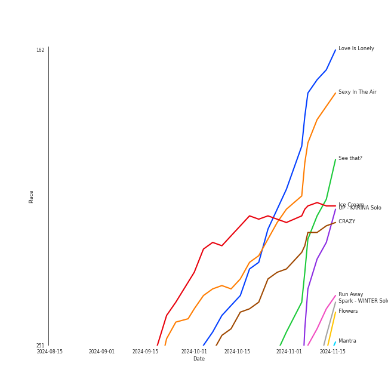

# Recent Comebacks

[63 tracks (53 liked) 🔗](https://open.spotify.com/playlist/2UAy7fw8nOjoJvFsNZtjbI)

[See Track Features](audio_features.md)

[See Clusters](clusters/overview.md)

## Top Artists

| Art | Rank | Tracks | 💚 | Artist | 🔗 |
|:---|---:|---:|---:|:---|:---|
|  | 1 | 8 | 8 | [aespa](../../artists/aespa/overview.md) | [🔗](https://open.spotify.com/artist/6YVMFz59CuY7ngCxTxjpxE) |
|  | 7 | 5 | 4 | [ENHYPEN](../../artists/enhypen/overview.md) | [🔗](https://open.spotify.com/artist/5t5FqBwTcgKTaWmfEbwQY9) |
|  | 18 | 5 | 4 | [NMIXX](../../artists/nmixx/overview.md) | [🔗](https://open.spotify.com/artist/28ot3wh4oNmoFOdVajibBl) |
|  | 16 | 5 | 4 | [STAYC](../../artists/stayc/overview.md) | [🔗](https://open.spotify.com/artist/01XYiBYaoMJcNhPokrg0l0) |
|  | 5 | 3 | 3 | [ITZY](../../artists/itzy/overview.md) | [🔗](https://open.spotify.com/artist/2KC9Qb60EaY0kW4eH68vr3) |
|  | 188 | 3 | 2 | LISA | [🔗](https://open.spotify.com/artist/5L1lO4eRHmJ7a0Q6csE5cT) |
|  | 36 | 3 | 2 | [KISS OF LIFE](../../artists/kiss_of_life/overview.md) | [🔗](https://open.spotify.com/artist/4TEK9tIkcoxib4GxT3O4ky) |
|  | 10 | 3 | 2 | [Stray Kids](../../artists/stray_kids/overview.md) | [🔗](https://open.spotify.com/artist/2dIgFjalVxs4ThymZ67YCE) |
|  | 13 | 2 | 2 | [LE SSERAFIM](../../artists/le_sserafim/overview.md) | [🔗](https://open.spotify.com/artist/4SpbR6yFEvexJuaBpgAU5p) |
|  | 138 | 2 | 2 | TZUYU | [🔗](https://open.spotify.com/artist/1arCVYXeStgCY2UazBNBLK) |

See all 35 artists

| Art | Rank | Tracks | 💚 | Artist | 🔗 |
|:---|---:|---:|---:|:---|:---|
|  | 56 | 2 | 2 | [TAEMIN](../../artists/taemin/overview.md) | [🔗](https://open.spotify.com/artist/13rF01aOogvnkuQXOlgTW8) |
|  | 22 | 2 | 1 | [Billlie](../../artists/billlie/overview.md) | [🔗](https://open.spotify.com/artist/2GQxKDojobwBjZMPf7aoh0) |
|  | 69 | 1 | 1 | JEON SOMI | [🔗](https://open.spotify.com/artist/7zYj9S9SdIunYCfSm7vzAR) |
|  | 372 | 1 | 1 | ROSALÍA | [🔗](https://open.spotify.com/artist/7ltDVBr6mKbRvohxheJ9h1) |
|  | 52 | 1 | 1 | [PURPLE KISS](../../artists/purple_kiss/overview.md) | [🔗](https://open.spotify.com/artist/62T5PGHWJ9sxP2SJq20IHq) |
|  | 29 | 1 | 1 | [Dreamcatcher](../../artists/dreamcatcher/overview.md) | [🔗](https://open.spotify.com/artist/5V1qsQHdXNm4ZEZHWvFnqQ) |
|  | 233 | 1 | 1 | FIFTY FIFTY | [🔗](https://open.spotify.com/artist/4GJ6xDCF5jaUqD6avOuQT6) |
|  | 432 | 1 | 1 | UNIS | [🔗](https://open.spotify.com/artist/48xyu8QHo1IhsQZGlgNGYZ) |
|  | 8 | 1 | 1 | [TAEYEON](../../artists/taeyeon/overview.md) | [🔗](https://open.spotify.com/artist/3qNVuliS40BLgXGxhdBdqu) |
|  | 152 | 1 | 1 | ROSÉ | [🔗](https://open.spotify.com/artist/3eVa5w3URK5duf6eyVDbu9) |
|  | 251 | 1 | 1 | KATSEYE | [🔗](https://open.spotify.com/artist/3c0gDdb9lhnHGFtP4prQpn) |
|  | 57 | 1 | 1 | HYO | [🔗](https://open.spotify.com/artist/3U7bOaJLuFkrmDQ1C1OqKl) |
|  | 113 | 1 | 1 | [P1Harmony](../../artists/p1harmony/overview.md) | [🔗](https://open.spotify.com/artist/3JjvsPeGMbDJqsphe2z8xU) |
|  | 209 | 1 | 1 | pH-1 | [🔗](https://open.spotify.com/artist/2u7CP5T30c8ctenzXgEV1W) |
|  | 432 | 1 | 1 | BamBam | [🔗](https://open.spotify.com/artist/2p48L95TwEaYkSdn6R7LOr) |
|  | 6 | 1 | 1 | [(G)I-DLE](../../artists/(g)i-dle/overview.md) | [🔗](https://open.spotify.com/artist/2AfmfGFbe0A0WsTYm0SDTx) |
|  | 103 | 1 | 1 | JENNIE | [🔗](https://open.spotify.com/artist/250b0Wlc5Vk0CoUsaCY84M) |
|  | 168 | 1 | 1 | fromis_9 | [🔗](https://open.spotify.com/artist/24nUVBIlCGi4twz4nYxJum) |
|  | 90 | 1 | 1 | [OH MY GIRL](../../artists/oh_my_girl/overview.md) | [🔗](https://open.spotify.com/artist/2019zR22qK2RBvCqtudBaI) |
|  | 388 | 1 | 1 | JAEHYUN | [🔗](https://open.spotify.com/artist/0qQI2kmsvSe2ex9k94T5vu) |
|  | 92 | 1 | 1 | [Bruno Mars](../../artists/bruno_mars/overview.md) | [🔗](https://open.spotify.com/artist/0du5cEVh5yTK9QJze8zA0C) |
|  | 381 | 1 | 1 | MEOVV | [🔗](https://open.spotify.com/artist/08hHTBHlv0WRXWlyrsb6Kv) |
|  | 17 | 1 | 0 | [IVE](../../artists/ive/overview.md) | [🔗](https://open.spotify.com/artist/6RHTUrRF63xao58xh9FXYJ) |
|  | 54 | 1 | 0 | [BAEKHYUN](../../artists/baekhyun/overview.md) | [🔗](https://open.spotify.com/artist/4ufh0WuMZh6y4Dmdnklvdl) |
|  | 41 | 1 | 0 | MISAMO | [🔗](https://open.spotify.com/artist/0IwZVmMMGE7nNXS7vN9SIo) |

## Top Tracks

Most and least listened tracks

| Rank | ​ | Most listened tracks | Rank | ​​ | Least listened tracks |
|---:|:---|:---|---:|:---|:---|
| 137 |  | [Heaven](../../artists/taeyeon/overview.md) | 1010 |  | [Red light sign, but we go](../../artists/nmixx/overview.md) |
| 190 |  | [Brought The Heat Back](../../artists/enhypen/overview.md) | 1010 |  | Rockstar |
| 210 |  | [Love Is Lonely](../../artists/nmixx/overview.md) | 1010 |  | [JJAM](../../artists/stray_kids/overview.md) |
| 213 |  | Ice Cream | 1010 |  | Mi Último Deseo |
| 214 |  | [Sexy In The Air](../../artists/taemin/overview.md) | 1010 |  | [ON MY BIKE](../../artists/purple_kiss/overview.md) |
| 220 |  | [Moonstruck](../../artists/enhypen/overview.md) | 1010 |  | Moonlit Floor (Kiss Me) |
| 229 |  | [CRAZY](../../artists/le_sserafim/overview.md) | 1010 |  | [remembrance candy](../../artists/billlie/overview.md) |
| 234 |  | [1 Thing](../../artists/stayc/overview.md) | 1010 |  | [Bad Girls R Us](../../artists/itzy/overview.md) |
| 248 |  | [Hot Mess](../../artists/aespa/overview.md) | 1010 |  | Curious |
| 250 |  | [BEAT BEAT](../../artists/nmixx/overview.md) | 979 |  | [1-800-hot-n-fun](../../artists/le_sserafim/overview.md) |

## Top Albums

| Art | Rank | Tracks | 💚 | Album | Release Date | 🔗 |
|:---|---:|---:|---:|:---|:---|:---|
|  | 102 | 5 | 4 | ROMANCE : UNTOLD | 2024-07-12 | [🔗](https://open.spotify.com/album/05I8FltCMnGa3kE38mpOkL) |
|  | 262 | 4 | 4 | Whiplash - The 5th Mini Album | 2024-10-21 | [🔗](https://open.spotify.com/album/7J41hCLBI2kEwL6RVSxfNx) |
|  | 151 | 4 | 3 | Metamorphic | 2024-07-01 | [🔗](https://open.spotify.com/album/6eTCq3XOz0rVJnelXro3Vk) |
|  | 121 | 4 | 3 | Fe3O4: STICK OUT | 2024-08-19 | [🔗](https://open.spotify.com/album/2pb2RscdByJ8pc7dPT1SY2) |
|  | 168 | 3 | 3 | SYNK : PARALLEL LINE - Special Digital Single | 2024-10-09 | [🔗](https://open.spotify.com/album/4vLGHlTnlIIxMSfefCY0cU) |
|  | 361 | 3 | 3 | GOLD | 2024-10-15 | [🔗](https://open.spotify.com/album/4CRfobFgSG0GOzplgTI79s) |
|  | 190 | 3 | 2 | ATE | 2024-07-19 | [🔗](https://open.spotify.com/album/3WdsoMKRqtw5Sgg67YrpnY) |
|  | 178 | 2 | 2 | abouTZU | 2024-09-06 | [🔗](https://open.spotify.com/album/0Xj4fXPKV0h6KhGQbUkDvy) |
|  | 146 | 2 | 2 | ETERNAL | 2024-08-19 | [🔗](https://open.spotify.com/album/13M8K1l146FLdFoObJIVj9) |
|  | 165 | 2 | 2 | CRAZY | 2024-08-30 | [🔗](https://open.spotify.com/album/538vEfAgLJ6g2I8ubuOlap) |

See all 39 albums

| Art | Rank | Tracks | 💚 | Album | Release Date | 🔗 |
|:---|---:|---:|---:|:---|:---|:---|
|  | 173 | 2 | 1 | Sticky | 2024-07-01 | [🔗](https://open.spotify.com/album/3p68B7ZhETVmNbOov8JcF5) |
|  | 485 | 2 | 1 | Of All We Have Lost | 2024-10-16 | [🔗](https://open.spotify.com/album/2zMVcW7OkakoPRTiuiOvy9) |
|  | 395 | 1 | 1 | [VirtuouS] | 2024-07-10 | [🔗](https://open.spotify.com/album/4PkR73YJKj5RGkC7QZVpM2) |
|  | 314 | 1 | 1 | Touch | 2024-07-26 | [🔗](https://open.spotify.com/album/1hjqg3TuQ2YqooaPhxHwdv) |
|  | 210 | 1 | 1 | Supersonic | 2024-08-12 | [🔗](https://open.spotify.com/album/1sxOavrEVy7krHpcbCsiJi) |
|  | 567 | 1 | 1 | SAD SONG | 2024-09-20 | [🔗](https://open.spotify.com/album/0NmzOw8evaF6bn2U7tiWSA) |
|  | 313 | 1 | 1 | Retro Romance | 2024-09-26 | [🔗](https://open.spotify.com/album/2G7tH2r50gCP2HYGsVG9UN) |
|  | 546 | 1 | 1 | New Woman (feat. ROSALÍA) | 2024-08-15 | [🔗](https://open.spotify.com/album/2ha4ucrONN0cihLMkP02Ch) |
|  | 662 | 1 | 1 | Moonlit Floor (Kiss Me) | 2024-10-03 | [🔗](https://open.spotify.com/album/2F84s5tvr9RSS6VI772mVb) |
|  | 243 | 1 | 1 | Mantra | 2024-10-10 | [🔗](https://open.spotify.com/album/3e5tDT1kfaAGx10yOjIDgW) |
|  | 354 | 1 | 1 | MEOW / Cheeky Icy Thang (Japanese Ver.) | 2024-08-21 | [🔗](https://open.spotify.com/album/04zQRW9brhcUtaDHQ8SH9u) |
|  | 569 | 1 | 1 | MEOW | 2024-09-06 | [🔗](https://open.spotify.com/album/7mtt73Ch1hIRXT5qScF4s5) |
|  | 573 | 1 | 1 | Love Tune | 2024-09-20 | [🔗](https://open.spotify.com/album/4jCiEqSvakhAN2n7Gr2r2r) |
|  | 588 | 1 | 1 | Lose Yourself | 2024-10-15 | [🔗](https://open.spotify.com/album/4eguh1dJUXRh0IMiLKRwab) |
|  | 582 | 1 | 1 | J - The 1st Album | 2024-08-26 | [🔗](https://open.spotify.com/album/1kQ1X0S06kqh4k2818bc5J) |
|  | 161 | 1 | 1 | Ice Cream | 2024-08-02 | [🔗](https://open.spotify.com/album/5Q41ZTpaEpDVtgu1yAtAPR) |
|  | 220 | 1 | 1 | I SWAY | 2024-07-08 | [🔗](https://open.spotify.com/album/5WzUVTkKAvOayPui3DnsDz) |
|  | 182 | 1 | 1 | Hot Mess | 2024-07-03 | [🔗](https://open.spotify.com/album/2PvpuCui1GVO8DkFcCHzYU) |
|  | 111 | 1 | 1 | Heaven | 2024-07-08 | [🔗](https://open.spotify.com/album/68taLckvPxHRtNa8QjQJ5e) |
|  | 662 | 1 | 1 | HEADWAY | 2024-10-22 | [🔗](https://open.spotify.com/album/5YYGa9YR9gOFnnWGHBybyg) |
|  | 247 | 1 | 1 | FEIFEI | 2024-07-31 | [🔗](https://open.spotify.com/album/3iM9IcCKlZrTtvjgKvbtBW) |
|  | 193 | 1 | 1 | Dreamy Resonance | 2024-08-26 | [🔗](https://open.spotify.com/album/4XZFgEjQ4Un1TNHAtTC87m) |
|  | 662 | 1 | 1 | CURIOUS | 2024-08-06 | [🔗](https://open.spotify.com/album/5SooWgzvq5BzwkQV57ltbM) |
|  | 662 | 1 | 1 | BAMESIS | 2024-08-08 | [🔗](https://open.spotify.com/album/402aahHNiFYPoNKZRg7GaF) |
|  | 297 | 1 | 1 | APT. | 2024-10-18 | [🔗](https://open.spotify.com/album/2IYQwwgxgOIn7t3iF6ufFD) |
|  | 662 | 1 | 0 | Rockstar | 2024-06-27 | [🔗](https://open.spotify.com/album/7wIIhHPyaxAHRvdNQQO2G9) |
|  | 464 | 1 | 0 | NEW LOOK | 2024-10-09 | [🔗](https://open.spotify.com/album/0nIHweIUCe2nVy5stte3GY) |
|  | 392 | 1 | 0 | Hello, World - The 4th Mini Album | 2024-09-06 | [🔗](https://open.spotify.com/album/6t6uh1uD01cnqef1Y7NVxA) |
|  | 282 | 1 | 0 | CRUSH | 2024-08-07 | [🔗](https://open.spotify.com/album/607R3veMPfNTZ4VzMEVy3d) |

## Top Record Labels

| Tracks | 💚 | Label |
|---:|---:|:---|
| 10 | 8 | [Republic Records](../../labels/republic_records/overview.md) |
| 6 | 6 | [SM Entertainment](../../labels/sm_entertainment/overview.md) |
| 5 | 4 | [BELIFT LAB](../../labels/belift_lab/overview.md) |
| 4 | 4 | aespa |
| 4 | 3 | [High Up Entertainment](../../labels/high_up_entertainment/overview.md) |
| 3 | 2 | [S2 ENTERTAINMENT INC.](../../labels/s2_entertainment_inc_/overview.md) |
| 3 | 2 | [RCA Records Label](../../labels/rca_records_label/overview.md) |
| 3 | 2 | Lloud Co. |
| 2 | 2 | [SOURCE MUSIC](../../labels/source_music/overview.md) |
| 2 | 2 | Republic Records – TZUYU (TWICE) |

See all 33 labels

| Tracks | 💚 | Label |
|---:|---:|:---|
| 2 | 2 | BIGPLANETMADE |
| 2 | 1 | [WM Japan](../../labels/wm_japan/overview.md) |
| 2 | 1 | [MYSTIC STORY](../../labels/mystic_story/overview.md) |
| 1 | 1 | [WM Entertainment](../../labels/wm_entertainment/overview.md) |
| 1 | 1 | [Universal Music LLC](../../labels/universal_music_llc/overview.md) |
| 1 | 1 | THEBLACKLABEL |
| 1 | 1 | [RBW Inc.](../../labels/rbw_inc_/overview.md) |
| 1 | 1 | [PLEDIS Entertainment](../../labels/pledis_entertainment/overview.md) |
| 1 | 1 | OA Entertainment |
| 1 | 1 | MEOVV |
| 1 | 1 | I ONE Entertainment |
| 1 | 1 | HYBE |
| 1 | 1 | [Geffen](../../labels/geffen/overview.md) |
| 1 | 1 | [FNC ENTERTAINMENT](../../labels/fnc_entertainment/overview.md) |
| 1 | 1 | F&F Entertainment |
| 1 | 1 | [DREAMCATCHER COMPANY](../../labels/dreamcatcher_company/overview.md) |
| 1 | 1 | [Columbia](../../labels/columbia/overview.md) |
| 1 | 1 | [CUBE ENTERTAINMENT](../../labels/cube_entertainment/overview.md) |
| 1 | 1 | [Atlantic Records](../../labels/atlantic_records/overview.md) |
| 1 | 1 | Abyss Company |
| 1 | 1 | ATTRAKT |
| 1 | 0 | [Sony Music Labels Inc.](../../labels/sony_music_labels_inc_/overview.md) |
| 1 | 0 | INB100 |

## Genres

| Tracks | 💚 | Genre |
|---:|---:|:---|
| 35 | 29 | [k-pop](../../genres/k-pop/overview.md) |
| 33 | 28 | [k-pop girl group](../../genres/k-pop_girl_group/overview.md) |
| 9 | 7 | [k-pop boy group](../../genres/k-pop_boy_group/overview.md) |
| 8 | 6 | [5th gen k-pop](../../genres/5th_gen_k-pop/overview.md) |
| 5 | 4 | [anime](../../genres/anime/overview.md) |
| 3 | 2 | [pop](../../genres/pop/overview.md) |

## Top Producers

| Art | Producer | Tracks | Credit Types |
|:---|:---|---:|:---|
| | [Ryan S. Jhun](../../producers/ryan_s__jhun/overview.md) | 2 | Songwriter |
| | [한 (Han)](../../producers/한_(han)/overview.md) | 2 | Lyricist, Songwriter |
|  | [TAEMIN](../../artists/taemin/overview.md) | 2 | Songwriter |
| | Bang Chan | 1 | Lyricist, Songwriter |
|  | ROSÉ | 1 | Songwriter |
| | 채강해 (Chae, Kanghae) | 1 | Songwriter |
| | Theron Thomas | 1 | Songwriter |
| | Michael Chapman | 1 | Songwriter |
| | RESTART | 1 | Songwriter |
| | Manny Park | 1 | Producer |

View all

| Art | Producer | Tracks | Credit Types |
|:---|:---|---:|:---|
|  | [Bruno Mars](../../artists/bruno_mars/overview.md) | 1 | Songwriter |
| | Dem Jointz | 1 | Songwriter |
| | Rogét Chahayed (Chahayed, Rogét) | 1 | Songwriter |
| | Royal Dive | 1 | Arranger, Songwriter |
| | Omer Fedi | 1 | Songwriter |
| | 오영택 (Oh, Young-Taek) | 1 | Producer |
| | 홍병현 (Hong, Byung-hyun) | 1 | Producer |
| | 김한구 (Kim, Hangoo) | 1 | Producer |
| | 정일진 (Jung, Il-jin) | 1 | Producer |
| | [윤원권 (Yoon, Won-kwon)](../../producers/윤원권_(yoon,_won-kwon)/overview.md) | 1 | Producer |
| | C'SA | 1 | Lyricist, Songwriter |
| | Amy Allen | 1 | Songwriter |
| | Ronnie Icon | 1 | Songwriter |
| | Le'mon | 1 | Lyricist |
| | Philip Lawrence | 1 | Songwriter |
| | BB ELLIOT | 1 | Songwriter |
| | 창빈 (Changbin) | 1 | Lyricist, Songwriter |
| | Nicky Chinn | 1 | Songwriter |
| | Dallas Koehike | 1 | Songwriter |
| | Brody Brown | 1 | Songwriter |
| | [Cirkut](../../producers/cirkut/overview.md) | 1 | Songwriter |
| | 김승현 (Kim, Seung-Hyeon) | 1 | Arranger |

## Years

View all years

| Year | Number of Tracks |
|:---|---:|
| [2024](2024/overview.md) | 63 |

| ​ | 10 newest albums | ​​ | 10 oldest albums |
|:---|:---|:---|:---|
|  | HEADWAY (2024-10-22) |  | Rockstar (2024-06-27) |
|  | Whiplash - The 5th Mini Album (2024-10-21) |  | Metamorphic (2024-07-01) |
|  | APT. (2024-10-18) |  | Sticky (2024-07-01) |
|  | Of All We Have Lost (2024-10-16) |  | Hot Mess (2024-07-03) |
|  | GOLD (2024-10-15) |  | Heaven (2024-07-08) |
|  | Lose Yourself (2024-10-15) |  | I SWAY (2024-07-08) |
|  | Mantra (2024-10-10) |  | [VirtuouS] (2024-07-10) |
|  | NEW LOOK (2024-10-09) |  | ROMANCE : UNTOLD (2024-07-12) |
|  | SYNK : PARALLEL LINE - Special Digital Single (2024-10-09) |  | ATE (2024-07-19) |
|  | Moonlit Floor (Kiss Me) (2024-10-03) |  | Touch (2024-07-26) |