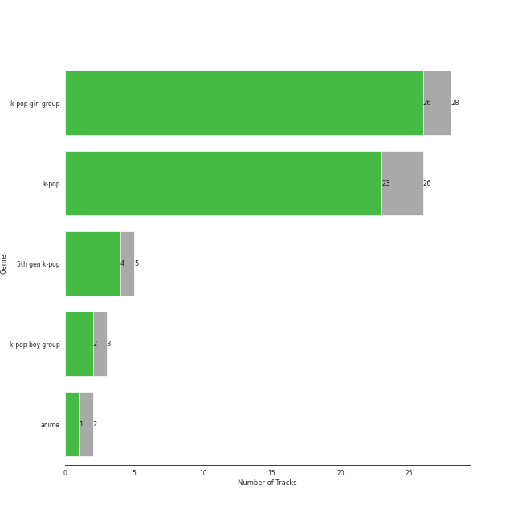
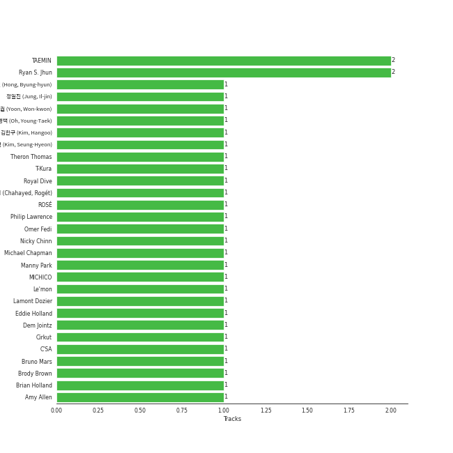

# Recent Comebacks

[73 tracks (61 liked) 🔗](https://open.spotify.com/playlist/2UAy7fw8nOjoJvFsNZtjbI)

[See Track Features](audio_features.md)

[See Clusters](clusters/overview.md)

## Top Artists

| Art | Tracks | 💚 | Artist | 🔗 |
|:---|---:|---:|:---|:---|
|  | 11 | 11 | [aespa](../../artists/aespa/overview.md) | [🔗](https://open.spotify.com/artist/6YVMFz59CuY7ngCxTxjpxE) |
|  | 5 | 5 | [WENDY](../../artists/wendy/overview.md) | [🔗](https://open.spotify.com/artist/0FRUZvZNPzM3YJMABJxf2K) |
|  | 4 | 4 | [IVE](../../artists/ive/overview.md) | [🔗](https://open.spotify.com/artist/6RHTUrRF63xao58xh9FXYJ) |
|  | 4 | 4 | [ENHYPEN](../../artists/enhypen/overview.md) | [🔗](https://open.spotify.com/artist/5t5FqBwTcgKTaWmfEbwQY9) |
|  | 4 | 3 | [Solar](../../artists/solar/overview.md) | [🔗](https://open.spotify.com/artist/5cYcI546S8Lf97m4mNdYLD) |
|  | 4 | 3 | [IU](../../artists/iu/overview.md) | [🔗](https://open.spotify.com/artist/3HqSLMAZ3g3d5poNaI7GOU) |
|  | 3 | 3 | [TWICE](../../artists/twice/overview.md) | [🔗](https://open.spotify.com/artist/7n2Ycct7Beij7Dj7meI4X0) |
|  | 3 | 3 | [YUQI](../../artists/yuqi/overview.md) | [🔗](https://open.spotify.com/artist/22aCD8IrQZjcPgZw728QT6) |
|  | 3 | 2 | [SEVENTEEN](../../artists/seventeen/overview.md) | [🔗](https://open.spotify.com/artist/7nqOGRxlXj7N2JYbgNEjYH) |
|  | 2 | 2 | [KISS OF LIFE](../../artists/kiss_of_life/overview.md) | [🔗](https://open.spotify.com/artist/4TEK9tIkcoxib4GxT3O4ky) |

See all 45 artists

| Art | Tracks | 💚 | Artist | 🔗 |
|:---|---:|---:|:---|:---|
|  | 2 | 2 | [CHUNG HA](../../artists/chung_ha/overview.md) | [🔗](https://open.spotify.com/artist/2PSJ6YriU7JsFucxACpU7Y) |
|  | 2 | 2 | [ITZY](../../artists/itzy/overview.md) | [🔗](https://open.spotify.com/artist/2KC9Qb60EaY0kW4eH68vr3) |
|  | 2 | 2 | BABYMONSTER | [🔗](https://open.spotify.com/artist/1SIocsqdEefUTE6XKGUiVS) |
|  | 3 | 1 | ILLIT | [🔗](https://open.spotify.com/artist/36cgvBn0aadzOijnjjwqMN) |
|  | 2 | 1 | [NewJeans](../../artists/newjeans/overview.md) | [🔗](https://open.spotify.com/artist/6HvZYsbFfjnjFrWF950C9d) |
|  | 2 | 1 | RIIZE | [🔗](https://open.spotify.com/artist/2jOm3cYujQx6o1dxuiuqaX) |
|  | 2 | 1 | [NCT DREAM](../../artists/nct_dream/overview.md) | [🔗](https://open.spotify.com/artist/1gBUSTR3TyDdTVFIaQnc02) |
|  | 1 | 1 | Lexie Liu | [🔗](https://open.spotify.com/artist/6fs2or0cKLEM2xohWq8SoX) |
|  | 1 | 1 | Charlie Puth | [🔗](https://open.spotify.com/artist/6VuMaDnrHyPL1p4EHjYLi7) |
|  | 1 | 1 | [BIBI](../../artists/bibi/overview.md) | [🔗](https://open.spotify.com/artist/6UbmqUEgjLA6jAcXwbM1Z9) |
|  | 1 | 1 | TAEYONG | [🔗](https://open.spotify.com/artist/6SKusTjOAPsTZ6kareKQdm) |
|  | 1 | 1 | SUHO | [🔗](https://open.spotify.com/artist/5zkf2Na8DKKJmtWX5Xrx3m) |
|  | 1 | 1 | Kep1er | [🔗](https://open.spotify.com/artist/5R7AMwDeroq6Ls0COQYpS4) |
|  | 1 | 1 | [BoA](../../artists/boa/overview.md) | [🔗](https://open.spotify.com/artist/4muJrGMndyYWqZtfk8OWy4) |
|  | 1 | 1 | ZICO | [🔗](https://open.spotify.com/artist/4XpUIb8uuNlIWVKmgKZXC0) |
|  | 1 | 1 | [WINTER](../../artists/winter/overview.md) | [🔗](https://open.spotify.com/artist/3mPquBmMu97Iq9TpzQ6ayI) |
|  | 1 | 1 | TOKiMONSTA | [🔗](https://open.spotify.com/artist/3VwKSHAfgzV1DOHV0aANCI) |
| | 1 | 1 | Hongjoong of ATEEZ | [🔗](https://open.spotify.com/artist/3MZLSgcd5kOdhrZasDMecx) |
|  | 1 | 1 | JO1 | [🔗](https://open.spotify.com/artist/2koP6FEfIEVk4l2Fe6jFhu) |
|  | 1 | 1 | [Stray Kids](../../artists/stray_kids/overview.md) | [🔗](https://open.spotify.com/artist/2dIgFjalVxs4ThymZ67YCE) |
|  | 1 | 1 | [(G)I-DLE](../../artists/(g)i-dle/overview.md) | [🔗](https://open.spotify.com/artist/2AfmfGFbe0A0WsTYm0SDTx) |
|  | 1 | 1 | JENNIE | [🔗](https://open.spotify.com/artist/250b0Wlc5Vk0CoUsaCY84M) |
|  | 1 | 1 | BANG YEDAM | [🔗](https://open.spotify.com/artist/1slszTGbkp1uNnI6G5uD0X) |
|  | 1 | 1 | Xdinary Heroes | [🔗](https://open.spotify.com/artist/1khChLj7REGqjM043PlYyn) |
|  | 1 | 1 | [Jackson Wang](../../artists/jackson_wang/overview.md) | [🔗](https://open.spotify.com/artist/1kfWoWgCugPkyxQP8lkRlY) |
|  | 1 | 1 | Moon Byul | [🔗](https://open.spotify.com/artist/1eTft3tXynrKdo6XD7QHLL) |
|  | 1 | 1 | [Jacob Collier](../../artists/jacob_collier/overview.md) | [🔗](https://open.spotify.com/artist/0QWrMNukfcVOmgEU0FEDyD) |
|  | 1 | 1 | Chris Martin | [🔗](https://open.spotify.com/artist/0LQoZQIV0mIs0y0XQb0Sw2) |
|  | 1 | 0 | ZEROBASEONE | [🔗](https://open.spotify.com/artist/7cjg7EkeZy3OI5o9Qthc6n) |
|  | 1 | 0 | [PURPLE KISS](../../artists/purple_kiss/overview.md) | [🔗](https://open.spotify.com/artist/62T5PGHWJ9sxP2SJq20IHq) |
|  | 1 | 0 | YooA | [🔗](https://open.spotify.com/artist/4ur1jCwyNlhgd0viJkOtcQ) |
|  | 1 | 0 | Patti Kim | [🔗](https://open.spotify.com/artist/3YLoKDj5EXsg3AorXDgLlz) |
|  | 1 | 0 | Joe Won Sun | [🔗](https://open.spotify.com/artist/2rbcCyEKbnxdEukZHHGnby) |
|  | 1 | 0 | XG | [🔗](https://open.spotify.com/artist/0LOK81e9H5lr61HlGGHqwA) |
|  | 1 | 0 | HYEIN | [🔗](https://open.spotify.com/artist/01BBFQPvi8ywBqHPzWzoyU) |

## Top Tracks

Most and least listened tracks

| ​ | Most listened tracks | Rank | ​​ | Least listened tracks | Rank |
|:---|:---|---:|:---|:---|---:|
|  | [Holssi](../../artists/iu/overview.md) | 62 |  | LIKE THAT | 838 |
|  | SHEESH | 146 |  | [Lucifer](../../artists/enhypen/overview.md) | 838 |
|  | Officially Cool | 188 |  | Little Things | 838 |
|  | [Midas Touch](../../artists/kiss_of_life/overview.md) | 191 |  | [His Car Isn't Yours](../../artists/wendy/overview.md) | 838 |
|  | SPOT! | 202 |  | [Emptiness](../../artists/boa/overview.md) | 838 |
|  | [Supernova](../../artists/aespa/overview.md) | 209 |  | WOKE UP | 838 |
|  | [Red Rover](../../artists/yuqi/overview.md) | 218 |  | Siren | 838 |
|  | [Get Goin'](../../artists/aespa/overview.md) | 220 |  | [LALALI](../../artists/seventeen/overview.md) | 838 |
|  | TAP | 228 |  | [MAESTRO](../../artists/seventeen/overview.md) | 838 |
|  | [Wish You Hell](../../artists/wendy/overview.md) | 229 |  | [Lose My Breath (Feat. Charlie Puth)](../../artists/stray_kids/overview.md) | 838 |

## Top Albums

| Art | Tracks | 💚 | Album | Release Date | 🔗 |
|:---|---:|---:|:---|:---|:---|
|  | 8 | 8 | Armageddon - The 1st Album | 2024-05-27 | [🔗](https://open.spotify.com/album/058hCti9Bupb5CJc6bd3VB) |
|  | 4 | 4 | Wish You Hell - The 2nd Mini Album | 2024-03-12 | [🔗](https://open.spotify.com/album/3f8n88uX0tNvA8HTROgSkr) |
|  | 4 | 4 | IVE SWITCH | 2024-04-29 | [🔗](https://open.spotify.com/album/7z61DsZtWO2S4nC5xd0b9p) |
|  | 4 | 4 | DARK MOON SPECIAL ALBUM <MEMORABILIA> | 2024-05-13 | [🔗](https://open.spotify.com/album/0OhJwEzXbK9Km6GQSPdmPU) |
|  | 4 | 3 | The Winning | 2024-02-20 | [🔗](https://open.spotify.com/album/08CvAj58nVMpq1Nw7T6maj) |
|  | 4 | 3 | COLOURS | 2024-04-30 | [🔗](https://open.spotify.com/album/5Q1cKPuB4vPk8bIdfZH7Fm) |
|  | 3 | 3 | YUQ1 | 2024-04-23 | [🔗](https://open.spotify.com/album/7LYc8ngbhwha4aGJ5kVauc) |
|  | 3 | 3 | With YOU-th | 2024-02-23 | [🔗](https://open.spotify.com/album/575TQDOQqc0MAheeEeKWUR) |
|  | 3 | 2 | SEVENTEEN BEST ALBUM '17 IS RIGHT HERE' | 2024-04-29 | [🔗](https://open.spotify.com/album/2Jrp37x38qZqtyrIrfxN4H) |
|  | 3 | 1 | SUPER REAL ME | 2024-03-25 | [🔗](https://open.spotify.com/album/6irebIc6UO8fN0jl4UlzBS) |

See all 36 albums

| Art | Tracks | 💚 | Album | Release Date | 🔗 |
|:---|---:|---:|:---|:---|:---|
|  | 2 | 2 | Midas Touch | 2024-04-03 | [🔗](https://open.spotify.com/album/1HfTA0xDoZ0mswFO3GB3ef) |
|  | 2 | 2 | EENIE MEENIE | 2024-03-11 | [🔗](https://open.spotify.com/album/1q2RNzz09Vx3bOKK1yTyyg) |
|  | 2 | 2 | BABYMONS7ER | 2024-04-01 | [🔗](https://open.spotify.com/album/0eSbsl3j8jz96LC2NCLPc4) |
|  | 2 | 2 | Algorhythm | 2024-05-15 | [🔗](https://open.spotify.com/album/7ji7zKkvRlYOsu3ehctQRx) |
|  | 2 | 1 | RIIZING | 2024-04-28 | [🔗](https://open.spotify.com/album/4DdDtcluroMFPVLWFKykqk) |
|  | 2 | 1 | How Sweet | 2024-05-24 | [🔗](https://open.spotify.com/album/0EhZEM4RRz0yioTgucDhJq) |
|  | 2 | 1 | DREAM( )SCAPE | 2024-03-25 | [🔗](https://open.spotify.com/album/2urIpiAu1CySTyyNuQQxcz) |
|  | 1 | 1 | Troubleshooting | 2024-04-30 | [🔗](https://open.spotify.com/album/26ogXm7X0kUSidtoaQVBei) |
|  | 1 | 1 | TAP - The 2nd Mini Album | 2024-02-26 | [🔗](https://open.spotify.com/album/5PliHwqYkEzdXHZnA6scC0) |
|  | 1 | 1 | Straight Line | 2024-04-24 | [🔗](https://open.spotify.com/album/58nZRpRVzO9INTkg5Ystph) |
|  | 1 | 1 | Starlit of Muse | 2024-02-20 | [🔗](https://open.spotify.com/album/1YtCxUGiarZVukgAm2x5RZ) |
|  | 1 | 1 | SPOT! | 2024-04-26 | [🔗](https://open.spotify.com/album/3K3C9JjwCGQAzj3Bu7BUaI) |
|  | 1 | 1 | Officially Cool | 2024-04-02 | [🔗](https://open.spotify.com/album/7ak1PBCmrVLvOANEenebe9) |
|  | 1 | 1 | Love seeker | 2024-05-11 | [🔗](https://open.spotify.com/album/0fcbyNShvGubuLdQqpMSbF) |
|  | 1 | 1 | Lose My Breath (Feat. Charlie Puth) | 2024-05-10 | [🔗](https://open.spotify.com/album/1HSW0KtusVmitWsZGhjaJB) |
|  | 1 | 1 | Fraggle Rock: Back To The Rock - Season 2 (Apple TV+ Original Series Soundtrack) | 2024-03-29 | [🔗](https://open.spotify.com/album/7ADS5WrhmIaFv9r1671yNh) |
|  | 1 | 1 | Feeling Lucky | 2024-04-26 | [🔗](https://open.spotify.com/album/4bc9PfPyv60qCh5S5g5eMb) |
|  | 1 | 1 | Emptiness | 2024-03-26 | [🔗](https://open.spotify.com/album/7Iipt9N6AEqCDHy73xPVtU) |
|  | 1 | 1 | Djesse Vol. 4 | 2024-03-01 | [🔗](https://open.spotify.com/album/13r6eqjYlKELFQlNvVCBz1) |
|  | 1 | 1 | Die Trying | 2024-04-04 | [🔗](https://open.spotify.com/album/2Ov7bn3HyDgvAxtYPLosUR) |
|  | 1 | 1 | Cheese | 2024-05-20 | [🔗](https://open.spotify.com/album/7qx75T9tAxkomFYsmFADV1) |
|  | 1 | 1 | 2 | 2024-01-29 | [🔗](https://open.spotify.com/album/0mC9MXPddkzggVsOXh5gd3) |
|  | 1 | 0 | WOKE UP | 2024-05-21 | [🔗](https://open.spotify.com/album/2e9eizo3Euh2aaBef2B2bw) |
|  | 1 | 0 | SWEAT | 2024-04-24 | [🔗](https://open.spotify.com/album/0s6DjhEFFZOUSfnFmPMVIG) |
|  | 1 | 0 | Borderline | 2024-03-14 | [🔗](https://open.spotify.com/album/3oKhPahFFjuFVbZfWprIkB) |
|  | 1 | 0 | BXX | 2024-03-19 | [🔗](https://open.spotify.com/album/3xX7eBfa5HTqDZXepyvjfw) |

## Top Record Labels

| Tracks | 💚 | Label |
|---:|---:|:---|
| 19 | 17 | [SM Entertainment](../../labels/sm_entertainment/overview.md) |
| 7 | 5 | [BELIFT LAB](../../labels/belift_lab/overview.md) |
| 5 | 5 | [Republic Records](../../labels/republic_records/overview.md) |
| 6 | 4 | [RBW Inc.](../../labels/rbw_inc_/overview.md) |
| 4 | 4 | [Starship Entertainment](../../labels/starship_entertainment/overview.md) |
| 4 | 4 | [CUBE ENTERTAINMENT](../../labels/cube_entertainment/overview.md) |
| 4 | 3 | [EDAM Entertainment](../../labels/edam_entertainment/overview.md) |
| 3 | 2 | [PLEDIS Entertainment](../../labels/pledis_entertainment/overview.md) |
| 2 | 2 | [YG Entertainment](../../labels/yg_entertainment/overview.md) |
| 2 | 2 | [WM Japan](../../labels/wm_japan/overview.md) |

See all 26 labels

| Tracks | 💚 | Label |
|---:|---:|:---|
| 2 | 2 | [S2 ENTERTAINMENT INC.](../../labels/s2_entertainment_inc_/overview.md) |
| 2 | 2 | MORE VISION |
| 2 | 1 | [RCA Records Label](../../labels/rca_records_label/overview.md) |
| 2 | 1 | [ADOR](../../labels/ador/overview.md) |
| 1 | 1 | [WM Korea](../../labels/wm_korea/overview.md) |
| 1 | 1 | WAKEONE |
| 1 | 1 | Netflix Music |
| 1 | 1 | Lakeshore Records |
| 1 | 1 | LAPONE Entertainment |
| 1 | 1 | KOZ Entertainment |
| 1 | 1 | [Decca (UMO)](../../labels/decca_(umo)/overview.md) |
| 1 | 1 | [88rising Music](../../labels/88rising_music/overview.md) |
| 1 | 0 | XGALX |
| 1 | 0 | [WM Entertainment](../../labels/wm_entertainment/overview.md) |
| 1 | 0 | [Stone Music Entertainment](../../labels/stone_music_entertainment/overview.md) |
| 1 | 0 | [Genie Music Corporation](../../labels/genie_music_corporation/overview.md) |

## Genres

| Tracks | 💚 | Genre |
|---:|---:|:---|
| 33 | 28 | [k-pop](../../genres/k-pop/overview.md) |
| 25 | 23 | [k-pop girl group](../../genres/k-pop_girl_group/overview.md) |
| 11 | 9 | [k-pop boy group](../../genres/k-pop_boy_group/overview.md) |
| 8 | 7 | [pop](../../genres/pop/overview.md) |
| 11 | 6 | [5th gen k-pop](../../genres/5th_gen_k-pop/overview.md) |
| 4 | 4 | [korean pop](../../genres/korean_pop/overview.md) |
| 4 | 4 | [anime](../../genres/anime/overview.md) |
| 2 | 2 | [korean r&b](../../genres/korean_r_b/overview.md) |
| 1 | 1 | [uk alternative pop](../../genres/uk_alternative_pop/overview.md) |
| 1 | 1 | j-pop boy group |

## Top Producers

| Art | Producer | Tracks | Credit Types |
|:---|:---|---:|:---|
| | [구종필 (Koo, Jong-Pil)](../../producers/구종필_(koo,_jong-pil)/overview.md) | 5 | Producer |
| | 홍장미 (Hong, Jangmi) | 4 | Producer |
| | [earattack](../../producers/earattack/overview.md) | 3 | Arranger, Producer, Songwriter |
| | [정은경 (Jung, Eun-Kyung)](../../producers/정은경_(jung,_eun-kyung)/overview.md) | 3 | Producer |
| | KayOne | 3 | Producer |
|  | [CHUNG HA](../../artists/chung_ha/overview.md) | 2 | Lyricist |
| | 임찬미 (Kim, Chan-mi) | 2 | Producer |
| | [Fuxxy](../../producers/fuxxy/overview.md) | 2 | Arranger |
| | Melanie Joy Fontana | 2 | Songwriter, Lyricist |
| | 이우현 (Lee, Woo-hyun) | 2 | Arranger, Songwriter |

View all

| Art | Producer | Tracks | Credit Types |
|:---|:---|---:|:---|
| | [Josh Gudwin](../../producers/josh_gudwin/overview.md) | 1 | Producer |
| | [Pop Time](../../producers/pop_time/overview.md) | 1 | Arranger, Songwriter |
|  | Anne-Marie | 1 | Songwriter |
|  | [JEON SOYEON](../../artists/jeon_soyeon/overview.md) | 1 | Arranger, Lyricist, Songwriter |
| | Kyler Niko | 1 | Songwriter |
| | Digital Farm Animals | 1 | Arranger, Lyricist, Songwriter |
| | Tom Hollings | 1 | Songwriter |
| | 서은일 (Seo, Eun-il) | 1 | Producer |
| | [Arschtritt Lindgren](../../producers/arschtritt_lindgren/overview.md) | 1 | Arranger, Songwriter |
| | 최예지 (Choi, Ye-ji) | 1 | Producer |
| | Jack Harvey | 1 | Arranger, Lyricist, Songwriter |
| | Sara Boe | 1 | Songwriter |
| | Jonah Marais | 1 | Lyricist, Songwriter |
| | 유정연 (Yoo, Jeong-yeon) | 1 | Lyricist |
| | [심은지 (Sim, Eunjee)](../../producers/심은지_(sim,_eunjee)/overview.md) | 1 | Lyricist |
| | Lexxi Saal | 1 | Lyricist, Songwriter |
| | Sophia Pae | 1 | Arranger |
| | Maryjane | 1 | Lyricist |
| | [엄세희 (Um, Se-Hee)](../../producers/엄세희_(um,_se-hee)/overview.md) | 1 | Producer |
| | Joe Harvey | 1 | Arranger, Lyricist, Songwriter |
| | GG Ramirez | 1 | Songwriter |
| | 강선영 (강선영) | 1 | Producer |
| | Daniel Seavey | 1 | Lyricist, Songwriter |
| | Daily | 1 | Arranger, Songwriter |
| | [구혜진 (Gu, Hye-jin)](../../producers/구혜진_(gu,_hye-jin)/overview.md) | 1 | Producer |
| | Samuel Brennan | 1 | Songwriter |
| | Jake Torrey | 1 | Lyricist, Songwriter |
| | Billen Ted | 1 | Arranger |
| | Jeremy Stack | 1 | Arranger |
| | 김홍중 (Kim, Hong Joong) | 1 | Lyricist, Songwriter |
| | Likey | 1 | Arranger, Songwriter |
| | [조윤경 (Jo, Yoon Kyung)](../../producers/조윤경_(jo,_yoon_kyung)/overview.md) | 1 | Lyricist |
| | Paulina Cerrilla | 1 | Songwriter |
| | Conor Blake | 1 | Arranger, Songwriter |
| | dwilly | 1 | Arranger, Lyricist, Songwriter |

## Years

View all years

| Year | Number of Tracks |
|:---|---:|
| [2024](2024/overview.md) | 73 |

| ​ | 10 newest albums | ​​ | 10 oldest albums |
|:---|:---|:---|:---|
|  | Armageddon - The 1st Album (2024-05-27) |  | 2 (2024-01-29) |
|  | How Sweet (2024-05-24) |  | Starlit of Muse (2024-02-20) |
|  | WOKE UP (2024-05-21) |  | The Winning (2024-02-20) |
|  | Cheese (2024-05-20) |  | With YOU-th (2024-02-23) |
|  | Algorhythm (2024-05-15) |  | TAP - The 2nd Mini Album (2024-02-26) |
|  | DARK MOON SPECIAL ALBUM <MEMORABILIA> (2024-05-13) |  | Djesse Vol. 4 (2024-03-01) |
|  | Love seeker (2024-05-11) |  | EENIE MEENIE (2024-03-11) |
|  | Lose My Breath (Feat. Charlie Puth) (2024-05-10) |  | Wish You Hell - The 2nd Mini Album (2024-03-12) |
|  | Troubleshooting (2024-04-30) |  | Borderline (2024-03-14) |
|  | COLOURS (2024-04-30) |  | BXX (2024-03-19) |