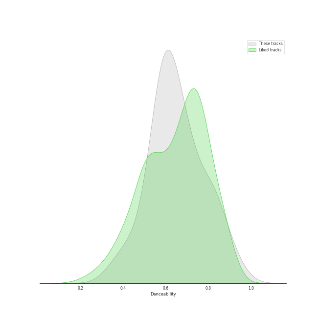
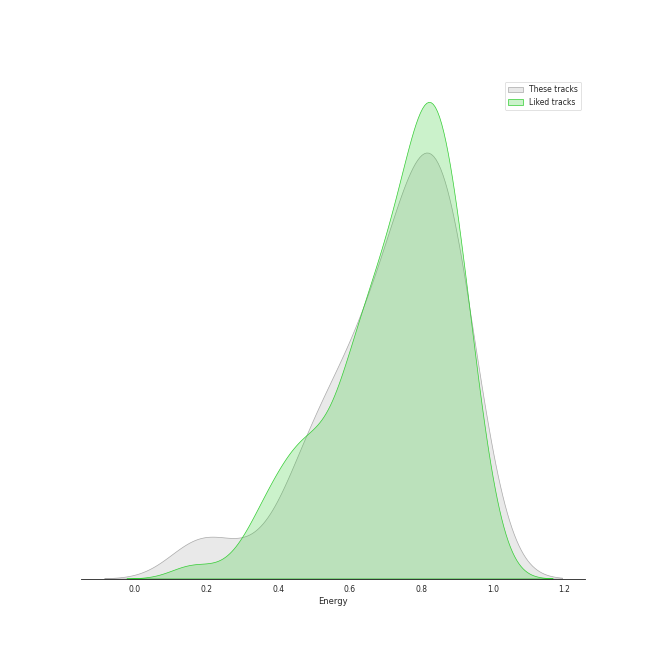
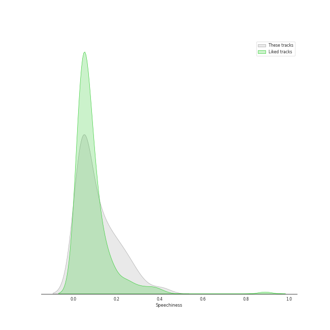
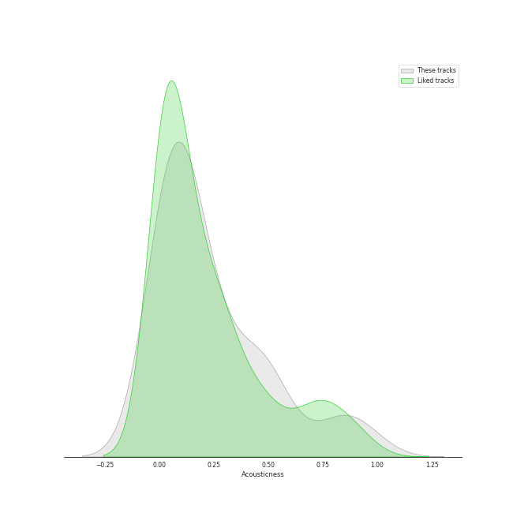
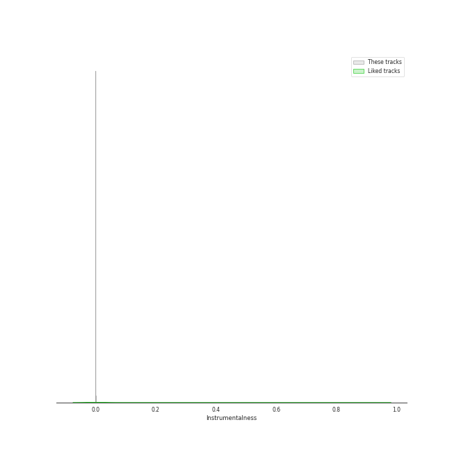
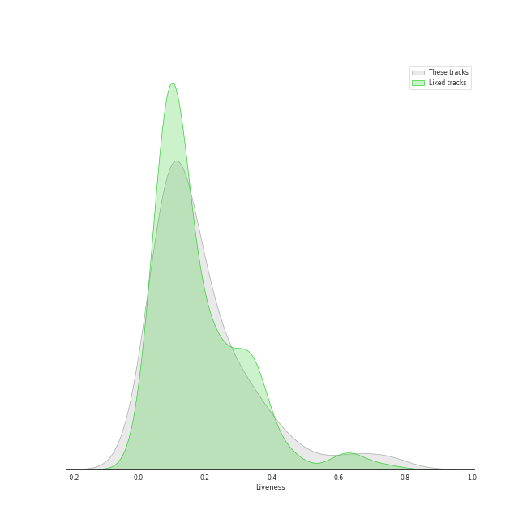
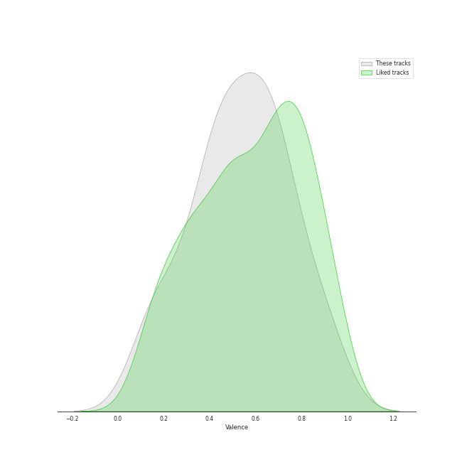
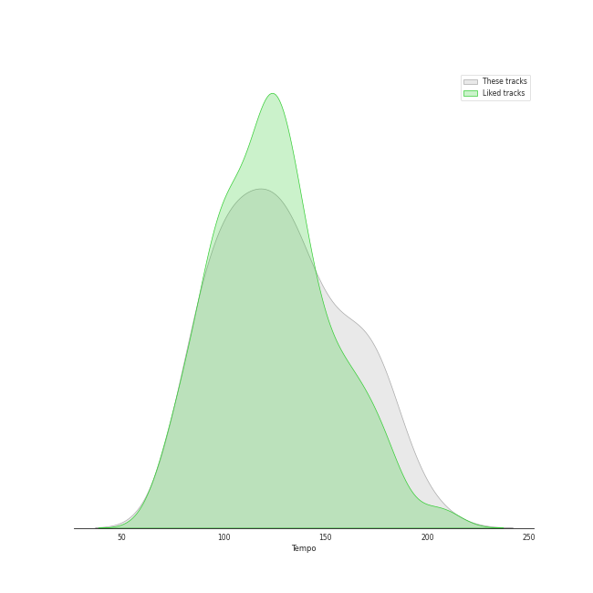

# Track Features for Recommendations for Chris

## Danceability

| ​ | 10 most Danceable tracks | ​​ | 10 least Danceable tracks |
|:---|:---|:---|:---|
|  | ASAP (0.934) |  | Here I Am (0.3) |
|  | S-Class (0.886) |  | Honeybee (0.352) |
|  | Phase Me (0.857) |  | My sea (0.353) |
|  | Sweet Venom (0.84) |  | Desert Song (0.354) |
|  | Next Level (0.82) |  | Feel My Rhythm (0.412) |
|  | WHISTLE (0.818) |  | 7월 7일 One Of These Nights (0.436) |
|  | Ditto (0.814) |  | Strawberry Cake (0.476) |
|  | Oh my god (0.794) |  | Sticker (0.527) |
|  | Toddler (0.784) |  | Gotta Go (0.531) |
|  | Holssi (0.769) |  | Fatal Trouble (0.532) |

## Energy

| ​ | 10 most Energetic tracks | ​​ | 10 least Energetic tracks |
|:---|:---|:---|:---|
|  | Feel My Rhythm (0.94) |  | Desert Song (0.167) |
|  | Ice Cream Cake (0.935) |  | Honeybee (0.186) |
|  | TANK (0.928) |  | ONLY (0.296) |
|  | The Red Shoes (0.922) |  | My sea (0.419) |
|  | 2 Baddies (0.921) |  | Here I Am (0.459) |
|  | What is Love (0.909) |  | ASAP (0.486) |
|  | I'll Make You Cry (0.896) |  | Cruel (0.494) |
|  | Savage (0.879) |  | 7월 7일 One Of These Nights (0.509) |
|  | Beautiful Liar (0.879) |  | When This Rain Stops (0.521) |
|  | FANCY (0.874) |  | Amusement Park (0.562) |

## Speechiness

| ​ | 10 most Speechy tracks | ​​ | 10 least Speechy tracks |
|:---|:---|:---|:---|
|  | MANIAC (0.411) |  | Welcome To MY World (feat. nævis) (0.0304) |
|  | S-Class (0.333) |  | Cruel (0.0309) |
|  | Hold On Tight (0.283) |  | Phase Me (0.0309) |
|  | Sticker (0.28) |  | Here I Am (0.0315) |
|  | 2 Baddies (0.258) |  | Toddler (0.0322) |
|  | TANK (0.241) |  | Fatal Trouble (0.0329) |
|  | Thunderous (0.234) |  | Amusement Park (0.0333) |
|  | Feel My Rhythm (0.215) |  | Still Life (0.034) |
|  | The Red Shoes (0.211) |  | Desert Song (0.0341) |
|  | Fighting (Feat. Lee Young Ji) (0.191) |  | My sea (0.0341) |

## Acousticness

| ​ | 10 most Acoustic tracks | ​​ | 10 least Acoustic tracks |
|:---|:---|:---|:---|
|  | Desert Song (0.948) |  | Cruel (0.00137) |
|  | ONLY (0.892) |  | WHISTLE (0.00561) |
|  | Honeybee (0.871) |  | FANCY (0.0122) |
|  | Amusement Park (0.85) |  | DNA (0.0217) |
|  | When This Rain Stops (0.805) |  | Ditto (0.027) |
|  | I Got Love (0.543) |  | TANK (0.0288) |
|  | The Red Shoes (0.512) |  | Here I Am (0.03) |
|  | Next Level (0.488) |  | Ice Cream Cake (0.0318) |
|  | 7월 7일 One Of These Nights (0.475) |  | Oh my god (0.0358) |
|  | ASAP (0.466) |  | Daisy (0.0362) |

## Instrumentalness

| ​ | 10 most Instrumental tracks | ​​ | 10 least Instrumental tracks |
|:---|:---|:---|:---|
|  | TANK (0.000492) |  | Thunderous (0.0) |
|  | Phase Me (0.000135) |  | Daisy (0.0) |
|  | Cruel (0.000114) |  | Beautiful Liar (0.0) |
|  | ASAP (3.73e-05) |  | Amusement Park (0.0) |
|  | Toddler (1.52e-05) |  | 2 Baddies (0.0) |
|  | Savage (1.17e-05) |  | Gotta Go (0.0) |
|  | Holssi (8.54e-06) |  | Sticker (0.0) |
|  | Next Level (5.94e-06) |  | Sweet Venom (0.0) |
|  | Here I Am (4.88e-06) |  | Feel My Rhythm (0.0) |
|  | Jam Jam (3.72e-06) |  | FANCY (0.0) |

## Liveness

| ​ | 10 most Live tracks | ​​ | 10 least Live tracks |
|:---|:---|:---|:---|
|  | Sticker (0.742) |  | Black Out (0.0243) |
|  | FANCY (0.627) |  | Holssi (0.0483) |
|  | Mr. Vampire (0.479) |  | Still Life (0.0628) |
|  | TANK (0.418) |  | DNA (0.0678) |
|  | Feel My Rhythm (0.358) |  | MANIAC (0.0697) |
|  | My sea (0.35) |  | S-Class (0.0715) |
|  | Beautiful Liar (0.339) |  | Here I Am (0.0826) |
|  | Strawberry Cake (0.324) |  | Psycho (0.0854) |
|  | Welcome To MY World (feat. nævis) (0.292) |  | WHISTLE (0.0866) |
|  | What is Love (0.264) |  | ONLY (0.0873) |

## Valence

| ​ | 10 most Happy tracks | ​​ | 10 least Happy tracks |
|:---|:---|:---|:---|
|  | Nobody Knows (0.927) |  | 7월 7일 One Of These Nights (0.11) |
|  | Fighting (Feat. Lee Young Ji) (0.922) |  | My sea (0.122) |
|  | Sweet Venom (0.911) |  | Here I Am (0.147) |
|  | I Got Love (0.828) |  | ONLY (0.151) |
|  | Next Level (0.82) |  | Ditto (0.183) |
|  | Thunderous (0.79) |  | Honeybee (0.216) |
|  | Black Out (0.778) |  | Desert Song (0.239) |
|  | FANCY (0.775) |  | Still Life (0.239) |
|  | Sticker (0.719) |  | Hold On Tight (0.265) |
|  | MANIAC (0.709) |  | Fatal Trouble (0.295) |

## Tempo

| ​ | 10 most Fast tracks | ​​ | 10 least Fast tracks |
|:---|:---|:---|:---|
|  | Strawberry Cake (199.943) |  | Cruel (78.99) |
|  | One Kiss (180.058) |  | Amusement Park (84.925) |
|  | TANK (179.928) |  | Daisy (85.016) |
|  | Mr. Vampire (173.873) |  | Holssi (86.949) |
|  | Thunderous (172.156) |  | Honeybee (87.919) |
|  | Ice Cream Cake (172.023) |  | Fatal Trouble (88.859) |
|  | 2 Baddies (171.96) |  | Nobody Knows (90.055) |
|  | What is Love (169.966) |  | Armageddon (91.991) |
|  | I'll Make You Cry (164.939) |  | Black Out (98.042) |
|  | Feel My Rhythm (157.964) |  | Here I Am (99.722) |
