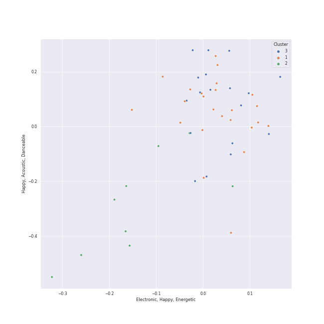

# Clusters in Recommendations for Chris

## Cluster #1

24 tracks

| Art | Track | Album | Artists | Label | Rank | 💚 | 🔗 |
|:---|:---|:---|:---|:---|---:|:---|:---|
|  | What is Love? | Summer Nights | [TWICE](../../../../artists/twice/overview.md) | [Republic Records](../../../../labels/republic_records) | 179 | 💚 | [🔗](https://open.spotify.com/track/3zhbXKFjUDw40pTYyCgt1Y) |
|  | Armageddon | Armageddon - The 1st Album | [aespa](../../../../artists/aespa/overview.md) | [SM Entertainment](../../../../labels/sm_entertainment) | 46 | 💚 | [🔗](https://open.spotify.com/track/4b2fMv44GAYpsDSK4ihbsI) |
|  | Welcome To MY World (feat. nævis) | MY WORLD - The 3rd Mini Album | [aespa](../../../../artists/aespa/overview.md), nævis | [SM Entertainment](../../../../labels/sm_entertainment), [Warner Records](../../../../labels/warner_records) | 2 | 💚 | [🔗](https://open.spotify.com/track/3q5qpprtugUIEPExuI7tRD) |
|  | I'll Make You Cry | Savage - The 1st Mini Album | [aespa](../../../../artists/aespa/overview.md) | [SM Entertainment](../../../../labels/sm_entertainment) | 108 | 💚 | [🔗](https://open.spotify.com/track/6l1dTAhX7P6EKvA11NLNuW) |
|  | Jam Jam | Palette | [IU](../../../../artists/iu/overview.md) | Fave Entertainment | 52 | 💚 | [🔗](https://open.spotify.com/track/3h7WIL3B6nP3171zl6HWj8) |
|  | Oh my god | I trust | [(G)I-DLE](../../../../artists/(g)i-dle/overview.md) | [Universal Music LLC](../../../../labels/universal_music_llc) | 36 | 💚 | [🔗](https://open.spotify.com/track/2DmRXiyn03tOqKgEJXlaiJ) |
|  | Daisy | WE:TH | [PENTAGON](../../../../artists/pentagon/overview.md) | [Universal Music LLC](../../../../labels/universal_music_llc) | 192 | 💚 | [🔗](https://open.spotify.com/track/14pjnaIqkpReO5D0tHofAS) |
|  | Gotta Go | Gotta Go | [CHUNG HA](../../../../artists/chung_ha/overview.md) | [Genie Music Corporation](../../../../labels/genie_music_corporation), [Stone Music Entertainment](../../../../labels/stone_music_entertainment) | 17 | 💚 | [🔗](https://open.spotify.com/track/1exnDFdC34GyBcaLt9ZJfX) |
|  | Fever | Devil - The 2nd Mini Album | MAX CHANGMIN | [SM Entertainment](../../../../labels/sm_entertainment) | 1015 | 💚 | [🔗](https://open.spotify.com/track/5MI2yZmuoT2OZpb8HUws7z) |
|  | Beautiful Liar | REASON | MONSTA X | [Starship Entertainment](../../../../labels/starship_entertainment) | 738 | 💚 | [🔗](https://open.spotify.com/track/1F6qqwgyBjcIMzen8RrOXQ) |
## Cluster #2

9 tracks

| Art | Track | Album | Artists | Label | Rank | 💚 | 🔗 |
|:---|:---|:---|:---|:---|---:|:---|:---|
|  | ASAP | NewJeans 2nd EP 'Get Up' | [NewJeans](../../../../artists/newjeans/overview.md) | [ADOR](../../../../labels/ador) | 174 | 💚 | [🔗](https://open.spotify.com/track/5fpyAakgFOm4YTXkgfPzvV) |
|  | When This Rain Stops | Like Water - The 1st Mini Album | [WENDY](../../../../artists/wendy/overview.md) | [SM Entertainment](../../../../labels/sm_entertainment) | 35 | 💚 | [🔗](https://open.spotify.com/track/6mavVLsxaa4YcPje9qZKcf) |
|  | Amusement Park | Amusement Park | [BAEKHYUN](../../../../artists/baekhyun/overview.md) | [SM Entertainment](../../../../labels/sm_entertainment) | 60 | 💚 | [🔗](https://open.spotify.com/track/1TUkEXQrskATO9SoB4QMUN) |
|  | ONLY | 4 ONLY | [LeeHi](../../../../artists/leehi/overview.md) | [Genie Music Corporation](../../../../labels/genie_music_corporation), [Stone Music Entertainment](../../../../labels/stone_music_entertainment) | 47 | 💚 | [🔗](https://open.spotify.com/track/6TBJkXHPhu3EsMk1bshwuI) |
|  | 7월 7일 One Of These Nights | The Velvet - The 2nd Mini Album | [Red Velvet](../../../../artists/red_velvet/overview.md) | [SM Entertainment](../../../../labels/sm_entertainment) | 40 | 💚 | [🔗](https://open.spotify.com/track/6koMMQlsRWBwHZXdtWxgUk) |
|  | My sea | IU 5th Album 'LILAC' | [IU](../../../../artists/iu/overview.md) | [EDAM Entertainment](../../../../labels/edam_entertainment) | 20 | 💚 | [🔗](https://open.spotify.com/track/46wDG6evLn2iPoQ0F8CUWk) |
|  | The Red Shoes | Modern Times | [IU](../../../../artists/iu/overview.md) | [Kakao Entertainment](../../../../labels/kakao_entertainment) | 50 | 💚 | [🔗](https://open.spotify.com/track/3atsk5EWI5fNxLMIJnfYfJ) |
|  | Honeybee | The 2¢ Show | Steam Powered Giraffe | Steam Powered Giraffe | 224 | 💚 | [🔗](https://open.spotify.com/track/3MZjOGeXhpHbQ9ESMNFFnH) |
|  | Still Life | Still Life | BIGBANG | [YG Entertainment](../../../../labels/yg_entertainment) | 843 | 💚 | [🔗](https://open.spotify.com/track/3TSLqZssCoCdDlMhCJ08XW) |
## Cluster #3

18 tracks

| Art | Track | Album | Artists | Label | Rank | 💚 | 🔗 |
|:---|:---|:---|:---|:---|---:|:---|:---|
|  | Toddler | INVU - The 3rd Album | [TAEYEON](../../../../artists/taeyeon/overview.md) | [SM Entertainment](../../../../labels/sm_entertainment) | 70 | 💚 | [🔗](https://open.spotify.com/track/73pehvxZUb87PhgyJJpTlw) |
|  | DNA | Love Yourself 承 'Her' | [BTS](../../../../artists/bts/overview.md) | [BIGHIT MUSIC](../../../../labels/bighit_music) | 582 | 💚 | [🔗](https://open.spotify.com/track/3uRLwBjI2TahxslcMTvpFs) |
|  | Savage | Savage - The 1st Mini Album | [aespa](../../../../artists/aespa/overview.md) | [SM Entertainment](../../../../labels/sm_entertainment) | 1 | 💚 | [🔗](https://open.spotify.com/track/3dbLT62Cvs46Ju7a8gpr36) |
|  | Thunderous | NOEASY | [Stray Kids](../../../../artists/stray_kids/overview.md) | [Republic Records](../../../../labels/republic_records) | 28 | 💚 | [🔗](https://open.spotify.com/track/0nwTMzpatarzvLvtwwzdCt) |
|  | S-Class | 5-STAR | [Stray Kids](../../../../artists/stray_kids/overview.md) | [Republic Records](../../../../labels/republic_records) | 357 | 💚 | [🔗](https://open.spotify.com/track/3gTQwwDNJ42CCLo3Sf4JDd) |
|  | MANIAC | ODDINARY | [Stray Kids](../../../../artists/stray_kids/overview.md) | [Republic Records](../../../../labels/republic_records) | 709 | 💚 | [🔗](https://open.spotify.com/track/63irPUP3xB74fHdw1Aw9zR) |
|  | Sunny Side Up! | ‘The ReVe Festival’ Day 1 | [Red Velvet](../../../../artists/red_velvet/overview.md) | [SM Entertainment](../../../../labels/sm_entertainment) | 159 | 💚 | [🔗](https://open.spotify.com/track/5yGTiC0ypN09P4Nl6tE3FY) |
|  | Black Out | Palette | [IU](../../../../artists/iu/overview.md) | Fave Entertainment | 268 | 💚 | [🔗](https://open.spotify.com/track/1sUOFqmIU38dQCA13aVKBL) |
|  | DASH | Fe3O4: BREAK | [NMIXX](../../../../artists/nmixx/overview.md) | [Republic Records](../../../../labels/republic_records) | 54 | 💚 | [🔗](https://open.spotify.com/track/2RoYgkPzUY0vY7lhUuyus1) |
|  | Fighting (Feat. Lee Young Ji) | BSS 1st Single Album 'SECOND WIND' | BSS, Lee Young Ji | [PLEDIS Entertainment](../../../../labels/pledis_entertainment) | 55 | 💚 | [🔗](https://open.spotify.com/track/7eBpUuPnDTfbeP1P4P93CS) |