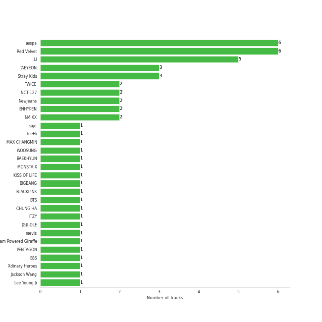
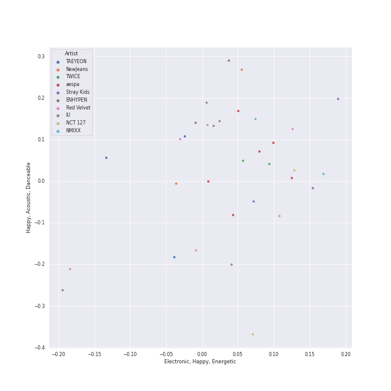
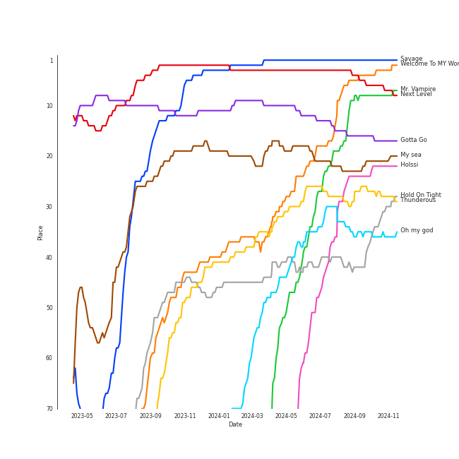
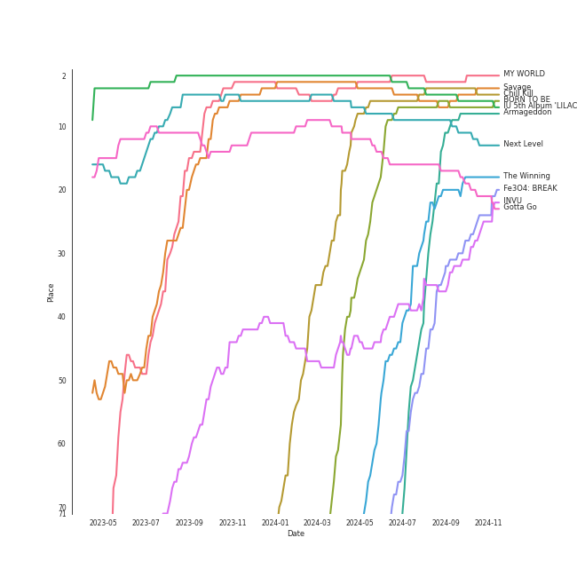
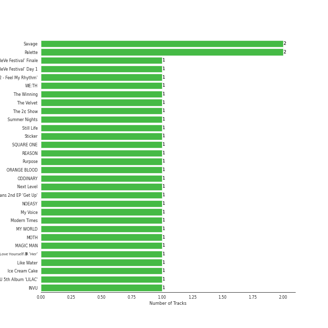
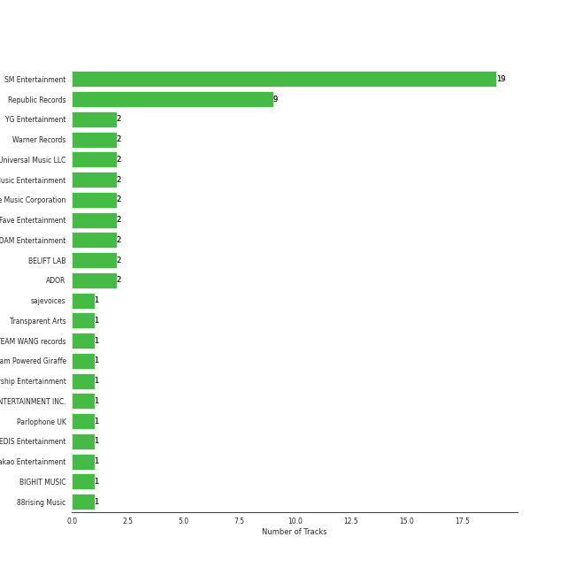
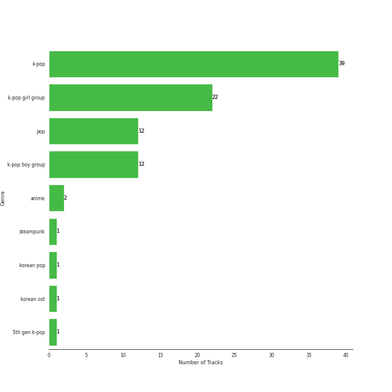

# Recommendations for Chris

[52 tracks 🔗](https://open.spotify.com/playlist/6atwS5eWP6rLUWSuDkuMd8)

[See Track Features](audio_features.md)

[See Clusters](clusters/overview.md)

## Top Artists

| Art | Rank | Tracks | 💚 | Artist | 🔗 |
|:---|---:|---:|---:|:---|:---|
|  | 1 | 6 | 6 | [aespa](../../artists/aespa/overview.md) | [🔗](https://open.spotify.com/artist/6YVMFz59CuY7ngCxTxjpxE) |
|  | 2 | 6 | 6 | [Red Velvet](../../artists/red_velvet/overview.md) | [🔗](https://open.spotify.com/artist/1z4g3DjTBBZKhvAroFlhOM) |
|  | 4 | 5 | 5 | [IU](../../artists/iu/overview.md) | [🔗](https://open.spotify.com/artist/3HqSLMAZ3g3d5poNaI7GOU) |
|  | 8 | 3 | 3 | [TAEYEON](../../artists/taeyeon/overview.md) | [🔗](https://open.spotify.com/artist/3qNVuliS40BLgXGxhdBdqu) |
|  | 10 | 3 | 3 | [Stray Kids](../../artists/stray_kids/overview.md) | [🔗](https://open.spotify.com/artist/2dIgFjalVxs4ThymZ67YCE) |
|  | 9 | 2 | 2 | [TWICE](../../artists/twice/overview.md) | [🔗](https://open.spotify.com/artist/7n2Ycct7Beij7Dj7meI4X0) |
|  | 30 | 2 | 2 | [NCT 127](../../artists/nct_127/overview.md) | [🔗](https://open.spotify.com/artist/7f4ignuCJhLXfZ9giKT7rH) |
|  | 23 | 2 | 2 | [NewJeans](../../artists/newjeans/overview.md) | [🔗](https://open.spotify.com/artist/6HvZYsbFfjnjFrWF950C9d) |
|  | 7 | 2 | 2 | [ENHYPEN](../../artists/enhypen/overview.md) | [🔗](https://open.spotify.com/artist/5t5FqBwTcgKTaWmfEbwQY9) |
|  | 20 | 2 | 2 | [NMIXX](../../artists/nmixx/overview.md) | [🔗](https://open.spotify.com/artist/28ot3wh4oNmoFOdVajibBl) |

See all 31 artists

| Art | Rank | Tracks | 💚 | Artist | 🔗 |
|:---|---:|---:|---:|:---|:---|
|  | 353 | 1 | 1 | säje | [🔗](https://open.spotify.com/artist/7iitvSs52z6e7UvIo2LCYi) |
|  | 11 | 1 | 1 | [LeeHi](../../artists/leehi/overview.md) | [🔗](https://open.spotify.com/artist/7cVZApDoQZpS447nHTsNqu) |
|  | 95 | 1 | 1 | MAX CHANGMIN | [🔗](https://open.spotify.com/artist/7FiAkNWMb6ZBYI8tbQLuIS) |
|  | 217 | 1 | 1 | WOOSUNG | [🔗](https://open.spotify.com/artist/5LHu1iF8m0XtRBEJbbwSoo) |
|  | 53 | 1 | 1 | [BAEKHYUN](../../artists/baekhyun/overview.md) | [🔗](https://open.spotify.com/artist/4ufh0WuMZh6y4Dmdnklvdl) |
|  | 188 | 1 | 1 | MONSTA X | [🔗](https://open.spotify.com/artist/4TnGh5PKbSjpYqpIdlW5nz) |
|  | 42 | 1 | 1 | [KISS OF LIFE](../../artists/kiss_of_life/overview.md) | [🔗](https://open.spotify.com/artist/4TEK9tIkcoxib4GxT3O4ky) |
|  | 172 | 1 | 1 | BIGBANG | [🔗](https://open.spotify.com/artist/4Kxlr1PRlDKEB0ekOCyHgX) |
|  | 3 | 1 | 1 | [BLACKPINK](../../artists/blackpink/overview.md) | [🔗](https://open.spotify.com/artist/41MozSoPIsD1dJM0CLPjZF) |
|  | 27 | 1 | 1 | [BTS](../../artists/bts/overview.md) | [🔗](https://open.spotify.com/artist/3Nrfpe0tUJi4K4DXYWgMUX) |
|  | 14 | 1 | 1 | [CHUNG HA](../../artists/chung_ha/overview.md) | [🔗](https://open.spotify.com/artist/2PSJ6YriU7JsFucxACpU7Y) |
|  | 5 | 1 | 1 | [ITZY](../../artists/itzy/overview.md) | [🔗](https://open.spotify.com/artist/2KC9Qb60EaY0kW4eH68vr3) |
|  | 6 | 1 | 1 | [(G)I-DLE](../../artists/(g)i-dle/overview.md) | [🔗](https://open.spotify.com/artist/2AfmfGFbe0A0WsTYm0SDTx) |
|  | 47 | 1 | 1 | nævis | [🔗](https://open.spotify.com/artist/2067CjQ2nC56cRZX8goeHg) |
|  | 131 | 1 | 1 | Steam Powered Giraffe | [🔗](https://open.spotify.com/artist/1yqs45BSh7457Flyhmdv7f) |
|  | 67 | 1 | 1 | [PENTAGON](../../artists/pentagon/overview.md) | [🔗](https://open.spotify.com/artist/1wKpMkucynaTfG8lyPprYV) |
|  | 64 | 1 | 1 | BSS | [🔗](https://open.spotify.com/artist/1uAT5bTSp6dWbNmixIUP5t) |
|  | 393 | 1 | 1 | Xdinary Heroes | [🔗](https://open.spotify.com/artist/1khChLj7REGqjM043PlYyn) |
|  | 75 | 1 | 1 | [Jackson Wang](../../artists/jackson_wang/overview.md) | [🔗](https://open.spotify.com/artist/1kfWoWgCugPkyxQP8lkRlY) |
|  | 63 | 1 | 1 | Lee Young Ji | [🔗](https://open.spotify.com/artist/0Y2AcMPMpeuPXtPQGVvRBq) |
|  | 28 | 1 | 1 | [WENDY](../../artists/wendy/overview.md) | [🔗](https://open.spotify.com/artist/0FRUZvZNPzM3YJMABJxf2K) |

## Top Tracks

Most and least listened tracks

| Rank | ​ | Most listened tracks | Rank | ​​ | Least listened tracks |
|---:|:---|:---|---:|:---|:---|
| 1 |  | [Savage](../../artists/aespa/overview.md) | 955 |  | Fever |
| 3 |  | [Next Level](../../artists/aespa/overview.md) | 955 |  | Strawberry Cake |
| 5 |  | [Welcome To MY World (feat. nævis)](../../artists/aespa/overview.md) | 802 |  | Desert Song |
| 12 |  | [Mr. Vampire](../../artists/itzy/overview.md) | 781 |  | Still Life |
| 16 |  | [Gotta Go](../../artists/chung_ha/overview.md) | 704 |  | [Cruel](../../artists/jackson_wang/overview.md) |
| 23 |  | [My sea](../../artists/iu/overview.md) | 681 |  | Beautiful Liar |
| 25 |  | [Holssi](../../artists/iu/overview.md) | 658 |  | [MANIAC](../../artists/stray_kids/overview.md) |
| 28 |  | [Thunderous](../../artists/stray_kids/overview.md) | 537 |  | [DNA](../../artists/bts/overview.md) |
| 30 |  | [When This Rain Stops](../../artists/wendy/overview.md) | 385 |  | Phase Me |
| 32 |  | [One Kiss](../../artists/red_velvet/overview.md) | 314 |  | [S-Class](../../artists/stray_kids/overview.md) |

## Top Albums

| Art | Rank | Tracks | 💚 | Album | Release Date | 🔗 |
|:---|---:|---:|---:|:---|:---|:---|
|  | 6 | 2 | 2 | Savage - The 1st Mini Album | 2021-10-05 | [🔗](https://open.spotify.com/album/3vyyDkvYWC36DwgZCYd3Wu) |
|  | 65 | 2 | 2 | Palette | 2017-04-21 | [🔗](https://open.spotify.com/album/5V8n6fqyAPxvFTibPhQVcp) |
|  | 144 | 1 | 1 | ‘The ReVe Festival’ Finale | 2019-12-23 | [🔗](https://open.spotify.com/album/3rVtm00UfbuzWOewdm4iYM) |
|  | 123 | 1 | 1 | ‘The ReVe Festival’ Day 1 | 2019-06-19 | [🔗](https://open.spotify.com/album/2nLEiP268mSFZHW5dajM4R) |
|  | 81 | 1 | 1 | ‘The ReVe Festival 2022 - Feel My Rhythm’ | 2022-03-21 | [🔗](https://open.spotify.com/album/3HgoCO9wWuPcNhz8Ip4C46) |
|  | 141 | 1 | 1 | WE:TH | 2020-10-12 | [🔗](https://open.spotify.com/album/1ASYbBYBwV6Rcfc2ycqmlK) |
|  | 22 | 1 | 1 | The Winning | 2024-02-20 | [🔗](https://open.spotify.com/album/08CvAj58nVMpq1Nw7T6maj) |
|  | 48 | 1 | 1 | The Velvet - The 2nd Mini Album | 2016-03-17 | [🔗](https://open.spotify.com/album/2qgl7dAgslqL1w2l2wQhMA) |
|  | 158 | 1 | 1 | The 2¢ Show | 2012-05-23 | [🔗](https://open.spotify.com/album/4DECRyKlhKJgjZLLuvfAI6) |
|  | 130 | 1 | 1 | Summer Nights | 2018-07-09 | [🔗](https://open.spotify.com/album/2GKTroaa4ysyhEdvzpvUoM) |

See all 50 albums

| Art | Rank | Tracks | 💚 | Album | Release Date | 🔗 |
|:---|---:|---:|---:|:---|:---|:---|
|  | 521 | 1 | 1 | Still Life | 2022-04-05 | [🔗](https://open.spotify.com/album/2oCAY48bhZvQte0l7apmYC) |
|  | 173 | 1 | 1 | Sticker - The 3rd Album | 2021-09-17 | [🔗](https://open.spotify.com/album/6nYbIKGcTmKM5BAlJPPcad) |
|  | 93 | 1 | 1 | SQUARE ONE | 2016-08-08 | [🔗](https://open.spotify.com/album/0FOOodYRlj7gzh7q7IjmNZ) |
|  | 459 | 1 | 1 | REASON | 2023-01-09 | [🔗](https://open.spotify.com/album/5evr2BAxQmxyF8dZyaezzS) |
|  | 147 | 1 | 1 | Purpose - The 2nd Album | 2019-10-28 | [🔗](https://open.spotify.com/album/0h6wCpdgpSOAbYDDYJVuwr) |
|  | 45 | 1 | 1 | ORANGE BLOOD | 2023-11-17 | [🔗](https://open.spotify.com/album/7dsAlxH9cMgyREm8OLdWWT) |
|  | 357 | 1 | 1 | ODDINARY | 2022-03-18 | [🔗](https://open.spotify.com/album/0Gmf4pfe0POEQq2FgGAj2q) |
|  | 9 | 1 | 1 | Next Level | 2021-05-17 | [🔗](https://open.spotify.com/album/2CzbrboOLzeRoaaH1N5K0N) |
|  | 131 | 1 | 1 | NewJeans 2nd EP 'Get Up' | 2023-07-21 | [🔗](https://open.spotify.com/album/4N1fROq2oeyLGAlQ1C1j18) |
|  | 34 | 1 | 1 | NOEASY | 2021-08-23 | [🔗](https://open.spotify.com/album/558tpdCejjVQNFAumRAeQj) |
|  | 63 | 1 | 1 | My Voice - The 1st Album | 2017-02-28 | [🔗](https://open.spotify.com/album/6DlCl3hBP1Gwhn0tgitGfN) |
|  | 57 | 1 | 1 | Modern Times | 2013-10-08 | [🔗](https://open.spotify.com/album/2QcuXvQBWv1ZKyQtEhLbFe) |
|  | 3 | 1 | 1 | MY WORLD - The 3rd Mini Album | 2023-05-08 | [🔗](https://open.spotify.com/album/69xF8jTd0c4Zoo7DT3Rwrn) |
|  | 274 | 1 | 1 | MOTH | 2022-05-13 | [🔗](https://open.spotify.com/album/7JdpeV87hczflCV8GXF3yV) |
|  | 233 | 1 | 1 | MAGIC MAN | 2022-09-09 | [🔗](https://open.spotify.com/album/2VZ4og2ZbwyTQ3X1rbgCe1) |
|  | 368 | 1 | 1 | Love Yourself 承 'Her' | 2017-09-18 | [🔗](https://open.spotify.com/album/07Rq17GzCnIdWJcyVHb57G) |
|  | 21 | 1 | 1 | Like Water - The 1st Mini Album | 2021-04-05 | [🔗](https://open.spotify.com/album/1Ao5vWPO13f4l0ldwxOKL7) |
|  | 61 | 1 | 1 | Ice Cream Cake - The 1st Mini Album | 2015-03-17 | [🔗](https://open.spotify.com/album/27cBQ5FDqv0xLgiJ7qNpZr) |
|  | 5 | 1 | 1 | IU 5th Album 'LILAC' | 2021-03-25 | [🔗](https://open.spotify.com/album/01dPJcwyht77brL4JQiR8R) |
|  | 36 | 1 | 1 | INVU - The 3rd Album | 2022-02-14 | [🔗](https://open.spotify.com/album/7i2YLTVQ0dyngRuUqtGmr9) |
|  | 40 | 1 | 1 | I trust | 2020-04-06 | [🔗](https://open.spotify.com/album/57sl8AvqVqm4Fadre0z8FQ) |
|  | 43 | 1 | 1 | Hold On Tight | 2023-03-30 | [🔗](https://open.spotify.com/album/4bWGRs1SqNwFXaRDXRAANN) |
|  | 630 | 1 | 1 | Hello, world! | 2022-07-20 | [🔗](https://open.spotify.com/album/5zjnlpEemkmaN6iv16vmDm) |
|  | 17 | 1 | 1 | Gotta Go | 2019-01-02 | [🔗](https://open.spotify.com/album/3WgHekDElv10Kam9aCMwnx) |
|  | 35 | 1 | 1 | Fe3O4: BREAK | 2024-01-15 | [🔗](https://open.spotify.com/album/5CCxLQgcI7cVwmgFDlicbP) |
|  | 210 | 1 | 1 | FANCY YOU | 2019-04-22 | [🔗](https://open.spotify.com/album/3aLpWFejbsdyafODLXRqwF) |
|  | 59 | 1 | 1 | Ditto | 2022-12-19 | [🔗](https://open.spotify.com/album/7bnqo1fdJU9nSfXQd3bSMe) |
|  | 168 | 1 | 1 | Devil - The 2nd Mini Album | 2022-01-13 | [🔗](https://open.spotify.com/album/6bG2rY8NzT7dIzUNADDNCR) |
|  | 534 | 1 | 1 | Desert Song | 2020-05-29 | [🔗](https://open.spotify.com/album/01Wmlp4OQ36xv48lqBmDm2) |
|  | 111 | 1 | 1 | DARK MOON SPECIAL ALBUM <MEMORABILIA> | 2024-05-13 | [🔗](https://open.spotify.com/album/0OhJwEzXbK9Km6GQSPdmPU) |
|  | 4 | 1 | 1 | Chill Kill - The 3rd Album | 2023-11-13 | [🔗](https://open.spotify.com/album/4UUICitfodUVCNhzmDFbrO) |
|  | 56 | 1 | 1 | Born to be XX | 2023-11-08 | [🔗](https://open.spotify.com/album/6yDtQxvq1XRC7Y5qtS03Xx) |
|  | 49 | 1 | 1 | BSS 1st Single Album 'SECOND WIND' | 2023-02-06 | [🔗](https://open.spotify.com/album/4dHtpne5cAAGgDYFNHu7jW) |
|  | 7 | 1 | 1 | BORN TO BE | 2024-01-08 | [🔗](https://open.spotify.com/album/3cm3EkNQLpKu58btSJT7fz) |
|  | 16 | 1 | 1 | Armageddon - The 1st Album | 2024-05-27 | [🔗](https://open.spotify.com/album/058hCti9Bupb5CJc6bd3VB) |
|  | 54 | 1 | 1 | Amusement Park | 2020-12-21 | [🔗](https://open.spotify.com/album/1azcqabc4kDgRNMWFA02wZ) |
|  | 223 | 1 | 1 | AD MARE | 2022-02-22 | [🔗](https://open.spotify.com/album/2QbA97qjlAs81t6kVS6zBk) |
|  | 198 | 1 | 1 | 5-STAR | 2023-06-02 | [🔗](https://open.spotify.com/album/3Pel3gWsPxVpZVrciU0Fm6) |
|  | 58 | 1 | 1 | 4 ONLY | 2021-09-09 | [🔗](https://open.spotify.com/album/1DKgZeAYrjslAPZVMe6EFt) |
|  | 132 | 1 | 1 | 2 Baddies - The 4th Album | 2022-09-16 | [🔗](https://open.spotify.com/album/6p80QT3z7kOHpYdnsItQTQ) |

## Top Record Labels

| Tracks | 💚 | Label |
|---:|---:|:---|
| 19 | 19 | [SM Entertainment](../../labels/sm_entertainment/overview.md) |
| 9 | 9 | [Republic Records](../../labels/republic_records/overview.md) |
| 2 | 2 | [YG Entertainment](../../labels/yg_entertainment/overview.md) |
| 2 | 2 | [Warner Records](../../labels/warner_records/overview.md) |
| 2 | 2 | [Universal Music LLC](../../labels/universal_music_llc/overview.md) |
| 2 | 2 | [Stone Music Entertainment](../../labels/stone_music_entertainment/overview.md) |
| 2 | 2 | [Genie Music Corporation](../../labels/genie_music_corporation/overview.md) |
| 2 | 2 | Fave Entertainment |
| 2 | 2 | [EDAM Entertainment](../../labels/edam_entertainment/overview.md) |
| 2 | 2 | [BELIFT LAB](../../labels/belift_lab/overview.md) |

See all 22 labels

| Tracks | 💚 | Label |
|---:|---:|:---|
| 2 | 2 | [ADOR](../../labels/ador/overview.md) |
| 1 | 1 | sajevoices |
| 1 | 1 | Transparent Arts |
| 1 | 1 | TEAM WANG records |
| 1 | 1 | Steam Powered Giraffe |
| 1 | 1 | [Starship Entertainment](../../labels/starship_entertainment/overview.md) |
| 1 | 1 | [S2 ENTERTAINMENT INC.](../../labels/s2_entertainment_inc_/overview.md) |
| 1 | 1 | [Parlophone UK](../../labels/parlophone_uk/overview.md) |
| 1 | 1 | [PLEDIS Entertainment](../../labels/pledis_entertainment/overview.md) |
| 1 | 1 | [Kakao Entertainment](../../labels/kakao_entertainment/overview.md) |
| 1 | 1 | [BIGHIT MUSIC](../../labels/bighit_music/overview.md) |
| 1 | 1 | [88rising Music](../../labels/88rising_music/overview.md) |

## Genres

| Tracks | 💚 | Genre |
|---:|---:|:---|
| 39 | 39 | [k-pop](../../genres/k-pop/overview.md) |
| 22 | 22 | [k-pop girl group](../../genres/k-pop_girl_group/overview.md) |
| 12 | 12 | [pop](../../genres/pop/overview.md) |
| 12 | 12 | [k-pop boy group](../../genres/k-pop_boy_group/overview.md) |
| 2 | 2 | [anime](../../genres/anime/overview.md) |
| 1 | 1 | steampunk |
| 1 | 1 | [korean pop](../../genres/korean_pop/overview.md) |
| 1 | 1 | korean ost |
| 1 | 1 | [5th gen k-pop](../../genres/5th_gen_k-pop/overview.md) |

## Top Producers

| Art | Producer | Tracks | Credit Types |
|:---|:---|---:|:---|
| | [Kenzie](../../producers/kenzie/overview.md) | 3 | Songwriter, Arranger, Lyricist |
| | [유영진 (Yoo, Young-jin)](../../producers/유영진_(yoo,_young-jin)/overview.md) | 3 | Arranger, Lyricist, Producer, Songwriter |
| | 이지홍 (Lee, Ji-hong) | 2 | Producer |
| | [서지음 (Seo, Ji Eum)](../../producers/서지음_(seo,_ji_eum)/overview.md) | 2 | Lyricist |
| | [구혜진 (Gu, Hye-jin)](../../producers/구혜진_(gu,_hye-jin)/overview.md) | 2 | Producer |
| | Kirsten Collins | 2 | Songwriter |
| | Hautboi Rich | 2 | Songwriter |
| | 남궁진 (Nam Goong, Jin) | 2 | Producer |
| | [조윤경 (Jo, Yoon Kyung)](../../producers/조윤경_(jo,_yoon_kyung)/overview.md) | 2 | Lyricist |
| | Rick Bridges | 2 | Lyricist |

View all

| Art | Producer | Tracks | Credit Types |
|:---|:---|---:|:---|
| | 오현선 (Oh, Hyun-sun) | 2 | Lyricist |
| | 김철순 (Kim, Chul-Soon) | 2 | Producer |
| | Adam von Mentzer | 1 | Songwriter |
| | MJ | 1 | Producer |
|  | [IU](../../artists/iu/overview.md) | 1 | Lyricist |
|  | SUGA | 1 | Songwriter |
| | Dem Jointz | 1 | Arranger, Songwriter |
| | Tay Jasper | 1 | Songwriter |
| | 김인 (Kim, In) | 1 | Lyricist |
| | [이민수 (이민수)](../../producers/이민수_(이민수)/overview.md) | 1 | Arranger, Songwriter |
| | 정다연 (Jeong, Dayeon) | 1 | Lyricist |
|  | Bekuh Boom | 1 | Lyricist, Songwriter |
| | 제휘 (Kim, Jea Whi) | 1 | Arranger, Songwriter |
| | 황찬희 (Hwang, Chan-Hee) | 1 | Arranger, Producer, Songwriter |
| | 노민지 (Noh, Min-ji) | 1 | Producer |
| | [정은경 (Jung, Eun-Kyung)](../../producers/정은경_(jung,_eun-kyung)/overview.md) | 1 | Producer |
| | Gigi | 1 | Lyricist |
| | 外山和彦 (Toyama, Kazuhiko) | 1 | Arranger |
| | Bill Zimmerman | 1 | Producer |
| | Bang Chan | 1 | Arranger, Lyricist, Producer, Songwriter |
| | 김동현 (Kim, Dong-hyun) | 1 | Lyricist |
| | Deanna | 1 | Songwriter |
| | EZIT | 1 | Arranger, Songwriter |
| | [Supreme Boi](../../producers/supreme_boi/overview.md) | 1 | Songwriter |
| | 임찬미 (Kim, Chan-mi) | 1 | Producer |
| | Brandon Green | 1 | Arranger, Songwriter |
| | 강효민 (Kang, Hyo-min) | 1 | Producer |
| | Johan Gustafsson | 1 | Arranger, Songwriter |
| | 최규성 (Choi, Kyu-sung) | 1 | Lyricist, Songwriter |
| | [TEDDY](../../producers/teddy/overview.md) | 1 | Arranger, Lyricist, Songwriter |
| | Kass | 1 | Songwriter |
| | 이경원 (Lee, Kyung-won) | 1 | Producer |
| | Hayley Aitken | 1 | Arranger, Songwriter |
| | 오성근 (Oh, Seong-Keun) | 1 | Producer |
| | 오유원 (Oh, Yoo-won) | 1 | Lyricist |
| | 이민규 (Lee, Min-kyu) | 1 | Producer |
| | Deza | 1 | Lyricist |
| | Jia Lih | 1 | Arranger, Songwriter |
| | IMLAY | 1 | Arranger |
| | 성유진 (Sung, Yoojin) | 1 | Lyricist |
| | [정의석 (Jung, Euisuk)](../../producers/정의석_(jung,_euisuk)/overview.md) | 1 | Producer |
| | 서은일 (Seo, Eun-il) | 1 | Producer |
| | Cazzi Opeia | 1 | Songwriter |
| | Sophie Curtis | 1 | Songwriter |
| | PAPRIKAA | 1 | Arranger, Songwriter |
| | Danielle Marsh | 1 | Lyricist |
| | 250 | 1 | Producer, Songwriter |
| | 김영현 (Kim, Young-hyun) | 1 | Producer |
| | 김희원 (Kim, Hee-won) | 1 | Songwriter |
| | 이승주 (Lee Sung-joo) | 1 | Arranger |
| | Pyungwook Lee | 1 | Producer |
| | 채강해 (Chae, Kanghae) | 1 | Arranger, Producer, Songwriter |
| | [Tony Maserati](../../producers/tony_maserati/overview.md) | 1 | Producer |
| | 원지애 (Won, Jiae) | 1 | Lyricist |
| | Fredrik Häggstam (Häggstam, Fredrik) | 1 | Arranger, Songwriter |
| | Fine Glindvad Jensen | 1 | Lyricist, Songwriter |
| | Dr.JO | 1 | Lyricist |
| | 창빈 (Changbin) | 1 | Lyricist, Songwriter |
| | Andreas Öberg (Öberg, Andreas) | 1 | Songwriter |
| | Melange | 1 | Arranger |
| | FUTURE BOUNCE | 1 | Arranger, Songwriter |
| | 장우영 (Jang, Wooyoung) | 1 | Producer |
| | Mario Marchetti | 1 | Arranger, Songwriter |
| | Sebastian Lundberg | 1 | Arranger, Songwriter |
| | Alawn | 1 | Producer |
| | Adam McInnis | 1 | Arranger, Songwriter |
| | [라도 (Rado)](../../producers/라도_(rado)/overview.md) | 1 | Lyricist, Songwriter |
| | [김이나 (Kim, Eana)](../../producers/김이나_(kim,_eana)/overview.md) | 1 | Lyricist |
| | Catharina Stoltenberg | 1 | Lyricist, Producer, Songwriter |
| | 정준호 (Jung, Joon-ho) | 1 | Lyricist |
| | Strong Dragon | 1 | Arranger, Songwriter |
| | Jeff Gartenbaum | 1 | Producer |
| | [Phil Tan](../../producers/phil_tan/overview.md) | 1 | Producer |
| | 김형곤 (Kim, Hyeong-kon) | 1 | Producer |
| | [엄세희 (Um, Se-Hee)](../../producers/엄세희_(um,_se-hee)/overview.md) | 1 | Producer |
| | 이나일 (E, Na-Il) | 1 | Arranger |
| | EJAE | 1 | Songwriter |
| | WKLY | 1 | Lyricist |
| | PUFF | 1 | Arranger, Songwriter |
| | Noémie Legrand (Legrand, Noémie) | 1 | Songwriter |
| | Erika de Casier | 1 | Lyricist, Songwriter |
| | 손명갑 (Son, Myung-gap) | 1 | Producer |
| | 박인영 (Park, In-Young) | 1 | Arranger |
| | RESTART | 1 | Arranger, Producer, Songwriter |
| | [한 (Han)](../../producers/한_(han)/overview.md) | 1 | Lyricist, Songwriter |
| | Chris Calland | 1 | Producer |
| | [Ryan S. Jhun](../../producers/ryan_s__jhun/overview.md) | 1 | Arranger, Songwriter |
| | Druski | 1 | Producer |
| | Ericka Coulter | 1 | Songwriter |
| | Henriette Motzfeldt | 1 | Lyricist, Producer, Songwriter |

## Years

| ​ | 10 newest albums | ​​ | 10 oldest albums |
|:---|:---|:---|:---|
|  | Armageddon - The 1st Album (2024-05-27) |  | The 2¢ Show (2012-05-23) |
|  | DARK MOON SPECIAL ALBUM <MEMORABILIA> (2024-05-13) |  | Modern Times (2013-10-08) |
|  | The Winning (2024-02-20) |  | Ice Cream Cake - The 1st Mini Album (2015-03-17) |
|  | Fe3O4: BREAK (2024-01-15) |  | The Velvet - The 2nd Mini Album (2016-03-17) |
|  | BORN TO BE (2024-01-08) |  | SQUARE ONE (2016-08-08) |
|  | ORANGE BLOOD (2023-11-17) |  | My Voice - The 1st Album (2017-02-28) |
|  | Chill Kill - The 3rd Album (2023-11-13) |  | Palette (2017-04-21) |
|  | Born to be XX (2023-11-08) |  | Love Yourself 承 'Her' (2017-09-18) |
|  | NewJeans 2nd EP 'Get Up' (2023-07-21) |  | Summer Nights (2018-07-09) |
|  | 5-STAR (2023-06-02) |  | Gotta Go (2019-01-02) |