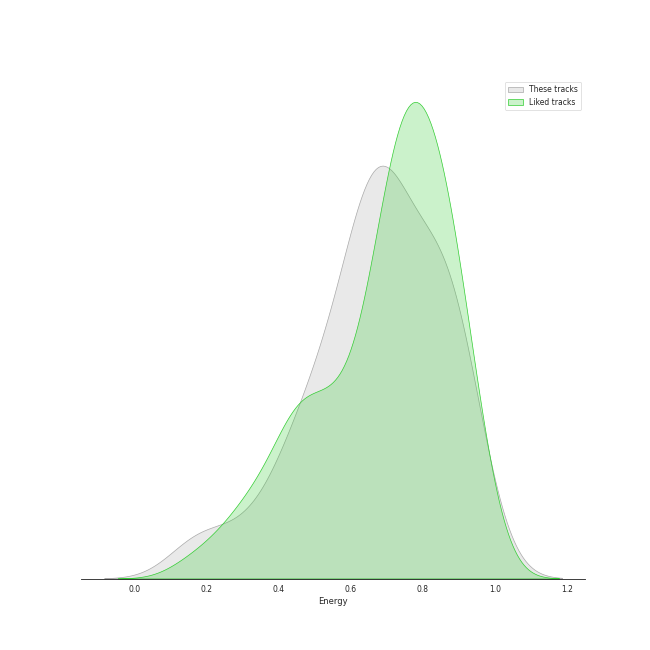
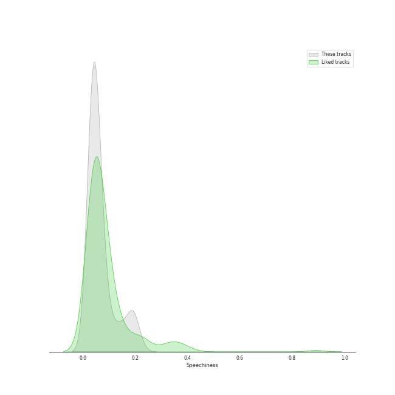
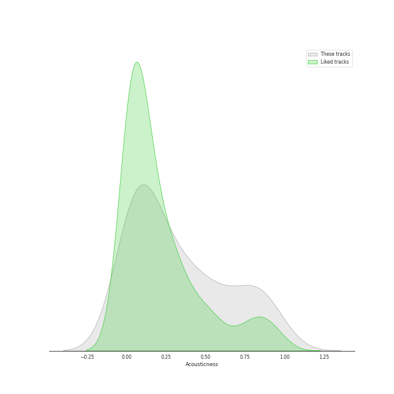
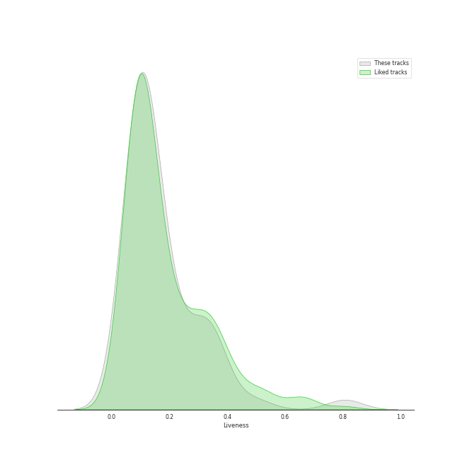
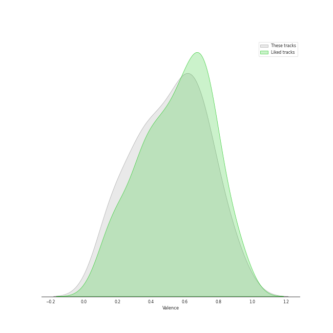
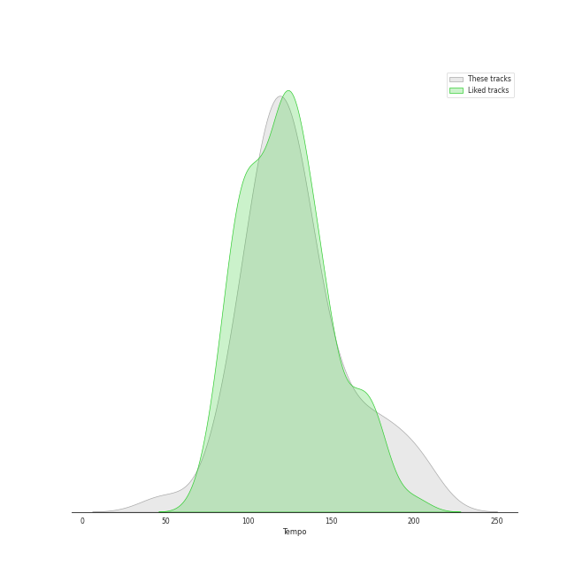

# Track Features for Recommendations for Jeff

## Danceability

| ​ | 10 most Danceable tracks | ​​ | 10 least Danceable tracks |
|:---|:---|:---|:---|
|  | Think About Things (0.871) |  | Here I Am (0.3) |
|  | Phase Me (0.857) |  | Unknown (To You) (0.349) |
|  | Bittersweet (feat. LeeHi) (0.824) |  | Honeybee (0.352) |
|  | Ditto (0.814) |  | My sea (0.353) |
|  | How People Move (0.813) |  | Desert Song (0.354) |
|  | Oh my god (0.794) |  | Hello (0.392) |
|  | Toddler (0.784) |  | HOLO (0.406) |
|  | Undo (0.784) |  | 7월 7일 One Of These Nights (0.436) |
|  | Piano Man (0.783) |  | ドライフラワー (0.463) |
|  | Bubble (0.768) |  | Brass Goggles (0.467) |

## Energy

| ​ | 10 most Energetic tracks | ​​ | 10 least Energetic tracks |
|:---|:---|:---|:---|
|  | Ice Cream Cake (0.935) |  | Desert Song (0.167) |
|  | The Red Shoes (0.922) |  | Honeybee (0.186) |
|  | Red Flavor (0.917) |  | ONLY (0.296) |
|  | What is Love (0.909) |  | Think About Things (0.341) |
|  | YOU&I (0.9) |  | My sea (0.419) |
|  | Hello (0.894) |  | HANN (Alone in winter) (0.429) |
|  | Beautiful Liar (0.879) |  | Here I Am (0.459) |
|  | I AM (0.875) |  | HOLO (0.474) |
|  | Daisy (0.869) |  | Dream (0.476) |
|  | Fighting (Feat. Lee Young Ji) (0.86) |  | 7월 7일 One Of These Nights (0.509) |

## Speechiness

| ​ | 10 most Speechy tracks | ​​ | 10 least Speechy tracks |
|:---|:---|:---|:---|
|  | The Red Shoes (0.211) |  | ドライフラワー (0.0276) |
|  | Fighting (Feat. Lee Young Ji) (0.191) |  | Je T'aime (0.0295) |
|  | Red Flavor (0.189) |  | HOLO (0.0295) |
|  | Ice Cream Cake (0.189) |  | Welcome To MY World (feat. nævis) (0.0304) |
|  | Beautiful Liar (0.186) |  | Phase Me (0.0309) |
|  | I Got Love (0.158) |  | Here I Am (0.0315) |
|  | Dream (0.139) |  | HOLD MY HAND (0.0317) |
|  | That Man (0.138) |  | Toddler (0.0322) |
|  | Ditto (0.111) |  | Cherry Blossom (0.0323) |
|  | Talk It Up (0.0938) |  | Amusement Park (0.0333) |

## Acousticness

| ​ | 10 most Acoustic tracks | ​​ | 10 least Acoustic tracks |
|:---|:---|:---|:---|
|  | Desert Song (0.948) |  | LOVE DIVE (0.00379) |
|  | Unknown (To You) (0.895) |  | I AM (0.0115) |
|  | ONLY (0.892) |  | They (0.0237) |
|  | Honeybee (0.871) |  | Ditto (0.027) |
|  | Amusement Park (0.85) |  | Bubble (0.0299) |
|  | HANN (Alone in winter) (0.814) |  | Here I Am (0.03) |
|  | When This Rain Stops (0.805) |  | Think About Things (0.0311) |
|  | HOLO (0.768) |  | Ice Cream Cake (0.0318) |
|  | That Man (0.761) |  | Oh my god (0.0358) |
|  | Brass Goggles (0.736) |  | Daisy (0.0362) |

## Instrumentalness

| ​ | 10 most Instrumental tracks | ​​ | 10 least Instrumental tracks |
|:---|:---|:---|:---|
|  | Cherry Blossom (0.0171) |  | Traffic light (0.0) |
|  | That Man (0.00307) |  | How People Move (0.0) |
|  | Unknown (To You) (0.000597) |  | enchanted night ~ white night (0.0) |
|  | Phase Me (0.000135) |  | Daisy (0.0) |
|  | Think About Things (0.000124) |  | Je T'aime (0.0) |
|  | Plastic Heaven (7.31e-05) |  | Beautiful Liar (0.0) |
|  | LOVE DIVE (5.43e-05) |  | Amusement Park (0.0) |
|  | Shinunoga E-Wa (4.09e-05) |  | Piano Man (0.0) |
|  | They (2.23e-05) |  | HANN (Alone in winter) (0.0) |
|  | Toddler (1.52e-05) |  | Bittersweet (feat. LeeHi) (0.0) |

## Liveness

| ​ | 10 most Live tracks | ​​ | 10 least Live tracks |
|:---|:---|:---|:---|
|  | Piano Man (0.807) |  | How People Move (0.0511) |
|  | Cherry Blossom (0.493) |  | Je T'aime (0.0676) |
|  | Brass Goggles (0.356) |  | Traffic light (0.0694) |
|  | HOLD MY HAND (0.351) |  | Bubble (0.0695) |
|  | My sea (0.35) |  | Settle Down (0.0733) |
|  | Hello (0.349) |  | Here I Am (0.0826) |
|  | Beautiful Liar (0.339) |  | Think About Things (0.0838) |
|  | LOVE DIVE (0.333) |  | Red Flavor (0.0839) |
|  | Strawberry Cake (0.324) |  | I AM (0.084) |
|  | Welcome To MY World (feat. nævis) (0.292) |  | Bittersweet (feat. LeeHi) (0.0849) |

## Valence

| ​ | 10 most Happy tracks | ​​ | 10 least Happy tracks |
|:---|:---|:---|:---|
|  | Fighting (Feat. Lee Young Ji) (0.922) |  | 7월 7일 One Of These Nights (0.11) |
|  | That Man (0.903) |  | My sea (0.122) |
|  | How People Move (0.848) |  | Here I Am (0.147) |
|  | I Got Love (0.828) |  | ONLY (0.151) |
|  | Piano Man (0.805) |  | Ditto (0.183) |
|  | Bittersweet (feat. LeeHi) (0.772) |  | HOLO (0.206) |
|  | HOLD MY HAND (0.75) |  | Honeybee (0.216) |
|  | Undo (0.734) |  | Desert Song (0.239) |
|  | They (0.729) |  | Unknown (To You) (0.274) |
|  | Bubble (0.717) |  | Amusement Park (0.299) |

## Tempo

| ​ | 10 most Fast tracks | ​​ | 10 least Fast tracks |
|:---|:---|:---|:---|
|  | That Man (207.029) |  | Dream (48.973) |
|  | Strawberry Cake (199.943) |  | Amusement Park (84.925) |
|  | Modern Times (199.923) |  | Daisy (85.016) |
|  | Hello (185.869) |  | Honeybee (87.919) |
|  | HOLO (179.914) |  | Settle Down (93.994) |
|  | HANN (Alone in winter) (179.855) |  | Traffic light (97.026) |
|  | Ice Cream Cake (172.023) |  | Here I Am (99.722) |
|  | What is Love (169.966) |  | Plastic Heaven (99.98) |
|  | Shinunoga E-Wa (158.078) |  | I Got Love (101.956) |
|  | Fighting (Feat. Lee Young Ji) (152.026) |  | Phase Me (104.067) |
