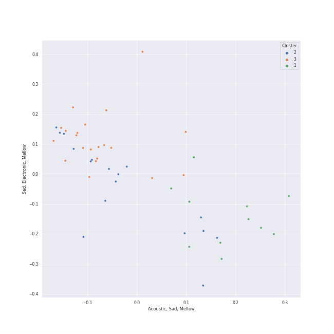

# Clusters in Recommendations for Jeff

## Cluster #1

12 tracks

| Art | Track | Album | Artists | Label | Score | 💚 | 🔗 |
|:---|:---|:---|:---|:---|---:|:---|:---|
|  | When This Rain Stops | Like Water - The 1st Mini Album | [WENDY](../../../../artists/wendy/overview.md) | [SM Entertainment](../../../../labels/sm_entertainment) | 42246 | 💚 | [🔗](https://open.spotify.com/track/6mavVLsxaa4YcPje9qZKcf) |
|  | Amusement Park | Amusement Park | [BAEKHYUN](../../../../artists/baekhyun/overview.md) | [SM Entertainment](../../../../labels/sm_entertainment) | 28068 | 💚 | [🔗](https://open.spotify.com/track/1TUkEXQrskATO9SoB4QMUN) |
|  | ONLY | 4 ONLY | [LeeHi](../../../../artists/leehi/overview.md) | [Genie Music Corporation](../../../../labels/genie_music_corporation), [Stone Music Entertainment](../../../../labels/stone_music_entertainment) | 7502 | 💚 | [🔗](https://open.spotify.com/track/6TBJkXHPhu3EsMk1bshwuI) |
|  | HOLO | HOLO | [LeeHi](../../../../artists/leehi/overview.md) | [Genie Music Corporation](../../../../labels/genie_music_corporation), [Stone Music Entertainment](../../../../labels/stone_music_entertainment) | 51526 | 💚 | [🔗](https://open.spotify.com/track/4BSluGpjdLQihMmKgHXMxp) |
|  | 7월 7일 One Of These Nights | The Velvet - The 2nd Mini Album | [Red Velvet](../../../../artists/red_velvet/overview.md) | [SM Entertainment](../../../../labels/sm_entertainment) | 5874 | 💚 | [🔗](https://open.spotify.com/track/6koMMQlsRWBwHZXdtWxgUk) |
|  | HANN (Alone in winter) | I burn | [(G)I-DLE](../../../../artists/(g)i-dle/overview.md) | [Universal Music LLC](../../../../labels/universal_music_llc) | 1119 | 💚 | [🔗](https://open.spotify.com/track/2qYdsdgdeMLFzpLcMQWG2W) |
|  | Je T'aime | Hello - Special Album | JOY | [SM Entertainment](../../../../labels/sm_entertainment) | 192 | 💚 | [🔗](https://open.spotify.com/track/18m3QugKZFaKjoMbe8CyjL) |
|  | Honeybee | The 2¢ Show | Steam Powered Giraffe | Steam Powered Giraffe | 0 | 💚 | [🔗](https://open.spotify.com/track/3MZjOGeXhpHbQ9ESMNFFnH) |
|  | ドライフラワー | 壱 | Yuuri | [Sony Music Labels Inc.](../../../../labels/sony_music_labels_inc_) | 62 | 💚 | [🔗](https://open.spotify.com/track/4kPlQKwtPrnqLgrmmKFSlA) |
|  | Unknown (To You) | Village | Jacob Banks | UMGRI Interscope | 0 | 💚 | [🔗](https://open.spotify.com/track/4jDDaKTqcZQWvgubuW6N7l) |
## Cluster #2

16 tracks

| Art | Track | Album | Artists | Label | Score | 💚 | 🔗 |
|:---|:---|:---|:---|:---|---:|:---|:---|
|  | What is Love | Summer Nights | [TWICE](../../../../artists/twice/overview.md) | [Republic Records](../../../../labels/republic_records) | 4335 | 💚 | [🔗](https://open.spotify.com/track/3zhbXKFjUDw40pTYyCgt1Y) |
|  | Red Flavor | The Red Summer - Summer Mini Album | [Red Velvet](../../../../artists/red_velvet/overview.md) | [SM Entertainment](../../../../labels/sm_entertainment) | 0 | 💚 | [🔗](https://open.spotify.com/track/7nKQ5WAcjnG48knyLuo8gO) |
|  | Jam Jam | Palette | [IU](../../../../artists/iu/overview.md) | Fave Entertainment | 11954 | 💚 | [🔗](https://open.spotify.com/track/3h7WIL3B6nP3171zl6HWj8) |
|  | Settle Down | Vows (Deluxe Version) | [Kimbra](../../../../artists/kimbra/overview.md) | [Warner Records](../../../../labels/warner_records) | 0 | 💚 | [🔗](https://open.spotify.com/track/6cdslY3YKjh7pImxFhSBVG) |
|  | Oh my god | I trust | [(G)I-DLE](../../../../artists/(g)i-dle/overview.md) | [Universal Music LLC](../../../../labels/universal_music_llc) | 17570 | 💚 | [🔗](https://open.spotify.com/track/2DmRXiyn03tOqKgEJXlaiJ) |
|  | LOVE DIVE | LOVE DIVE | [IVE](../../../../artists/ive/overview.md) | [STARSHIP Entertainment](../../../../labels/starship_entertainment) | 384 | 💚 | [🔗](https://open.spotify.com/track/0Q5VnK2DYzRyfqQRJuUtvi) |
|  | I AM | I've IVE | [IVE](../../../../artists/ive/overview.md) | [Starship Entertainment](../../../../labels/starship_entertainment) | 5921 | 💚 | [🔗](https://open.spotify.com/track/70t7Q6AYG6ZgTYmJWcnkUM) |
|  | Welcome To MY World (feat. nævis) | MY WORLD - The 3rd Mini Album | [aespa](../../../../artists/aespa/overview.md), nævis | [SM Entertainment](../../../../labels/sm_entertainment), [Warner Records](../../../../labels/warner_records) | 25781 | 💚 | [🔗](https://open.spotify.com/track/3q5qpprtugUIEPExuI7tRD) |
|  | Daisy | WE:TH | [PENTAGON](../../../../artists/pentagon/overview.md) | [Universal Music LLC](../../../../labels/universal_music_llc) | 0 | 💚 | [🔗](https://open.spotify.com/track/14pjnaIqkpReO5D0tHofAS) |
|  | Shinunoga E-Wa | HELP EVER HURT NEVER | Fujii Kaze | [Universal Music LLC](../../../../labels/universal_music_llc) | 91 | 💚 | [🔗](https://open.spotify.com/track/0o9zmvc5f3EFApU52PPIyW) |
## Cluster #3

21 tracks

| Art | Track | Album | Artists | Label | Score | 💚 | 🔗 |
|:---|:---|:---|:---|:---|---:|:---|:---|
|  | Toddler | INVU - The 3rd Album | [TAEYEON](../../../../artists/taeyeon/overview.md) | [SM Entertainment](../../../../labels/sm_entertainment) | 6898 | 💚 | [🔗](https://open.spotify.com/track/73pehvxZUb87PhgyJJpTlw) |
|  | I Got Love | My Voice - The 1st Album | [TAEYEON](../../../../artists/taeyeon/overview.md) | [SM Entertainment](../../../../labels/sm_entertainment) | 16430 | 💚 | [🔗](https://open.spotify.com/track/1IgRQvTqj7BKjNWRzjFEE0) |
|  | Sunny Side Up! | ‘The ReVe Festival’ Day 1 | [Red Velvet](../../../../artists/red_velvet/overview.md) | [SM Entertainment](../../../../labels/sm_entertainment) | 2568 | 💚 | [🔗](https://open.spotify.com/track/5yGTiC0ypN09P4Nl6tE3FY) |
|  | dlwlrma | Palette | [IU](../../../../artists/iu/overview.md) | Fave Entertainment | 0 | 💚 | [🔗](https://open.spotify.com/track/4NPARrLIbtMl29ZJv8ESr2) |
|  | YOU&I | Last Fantasy | [IU](../../../../artists/iu/overview.md) | [Kakao Entertainment](../../../../labels/kakao_entertainment) | 229 | 💚 | [🔗](https://open.spotify.com/track/37S86pw74OH8j96ZmMnrpR) |
|  | Undo | Undo | [HEIZE](../../../../artists/heize/overview.md) | [Genie Music Corporation](../../../../labels/genie_music_corporation), [Stone Music Entertainment](../../../../labels/stone_music_entertainment) | 1080 | 💚 | [🔗](https://open.spotify.com/track/6z1pJ3KUmQagUpMVqL62sa) |
|  | How People Move | SPRING | [AKMU](../../../../artists/akmu/overview.md) | [YG Entertainment](../../../../labels/yg_entertainment) | 51 | 💚 | [🔗](https://open.spotify.com/track/0c2Yg75sFgD0hWhRq4voAn) |
|  | enchanted night ~ white night | the Billage of perception: chapter three | [Billlie](../../../../artists/billlie/overview.md) | [MYSTIC STORY](../../../../labels/mystic_story) | 6565 | 💚 | [🔗](https://open.spotify.com/track/0rTXn4ovXalJGkJMx5hsnX) |
|  | Bubble | TEENFRESH | [STAYC](../../../../artists/stayc/overview.md) | [High Up Entertainment](../../../../labels/high_up_entertainment) | 8059 | 💚 | [🔗](https://open.spotify.com/track/4P5ozkI1bxiGxA5rZ27jlO) |
|  | They | Finally Woken | Jem | ATO Records | 0 | 💚 | [🔗](https://open.spotify.com/track/5HiVagjTjqdvu3Ke2aqMc7) |