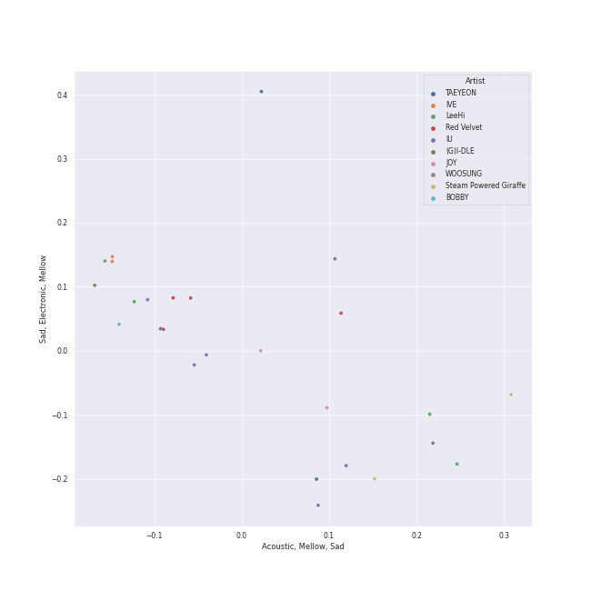
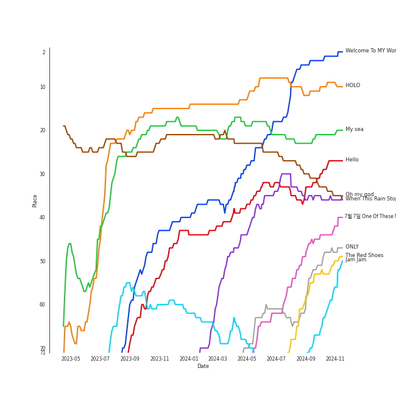
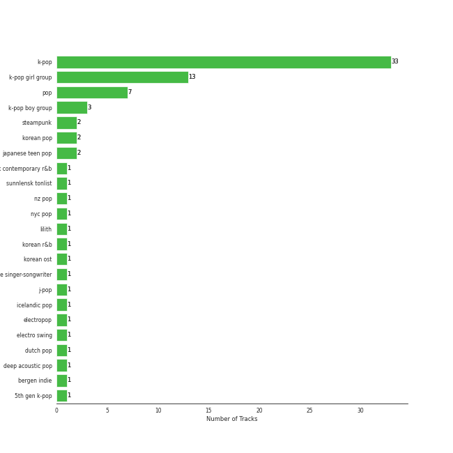
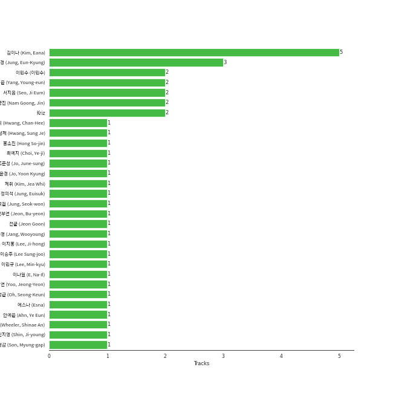

# Recommendations for Jeff

[53 tracks 🔗](https://open.spotify.com/playlist/5Liek0UOC5GmdOjxdWhcob)

[See Track Features](audio_features.md)

[See Clusters](clusters/overview.md)

## Top Artists

| Art | Tracks | 💚 | Artist | 🔗 |
|:---|---:|---:|:---|:---|
|  | 6 | 6 | [IU](../../artists/iu/overview.md) | [🔗](https://open.spotify.com/artist/3HqSLMAZ3g3d5poNaI7GOU) |
|  | 4 | 4 | [LeeHi](../../artists/leehi/overview.md) | [🔗](https://open.spotify.com/artist/7cVZApDoQZpS447nHTsNqu) |
|  | 4 | 4 | [Red Velvet](../../artists/red_velvet/overview.md) | [🔗](https://open.spotify.com/artist/1z4g3DjTBBZKhvAroFlhOM) |
|  | 3 | 3 | [TAEYEON](../../artists/taeyeon/overview.md) | [🔗](https://open.spotify.com/artist/3qNVuliS40BLgXGxhdBdqu) |
|  | 2 | 2 | [IVE](../../artists/ive/overview.md) | [🔗](https://open.spotify.com/artist/6RHTUrRF63xao58xh9FXYJ) |
|  | 2 | 2 | [BAEKHYUN](../../artists/baekhyun/overview.md) | [🔗](https://open.spotify.com/artist/4ufh0WuMZh6y4Dmdnklvdl) |
|  | 2 | 2 | [(G)I-DLE](../../artists/(g)i-dle/overview.md) | [🔗](https://open.spotify.com/artist/2AfmfGFbe0A0WsTYm0SDTx) |
|  | 2 | 2 | Steam Powered Giraffe | [🔗](https://open.spotify.com/artist/1yqs45BSh7457Flyhmdv7f) |
|  | 2 | 2 | JOY | [🔗](https://open.spotify.com/artist/0sYpJ0nCC8AlDrZFeAA7ub) |
|  | 1 | 1 | [TWICE](../../artists/twice/overview.md) | [🔗](https://open.spotify.com/artist/7n2Ycct7Beij7Dj7meI4X0) |

See all 41 artists

| Art | Tracks | 💚 | Artist | 🔗 |
|:---|---:|---:|:---|:---|
|  | 1 | 1 | säje | [🔗](https://open.spotify.com/artist/7iitvSs52z6e7UvIo2LCYi) |
|  | 1 | 1 | BOBBY | [🔗](https://open.spotify.com/artist/7ieMQQDR0bdBPz572mtxwS) |
|  | 1 | 1 | [Kimbra](../../artists/kimbra/overview.md) | [🔗](https://open.spotify.com/artist/6hk7Yq1DU9QcCCrz9uc0Ti) |
|  | 1 | 1 | Fujii Kaze | [🔗](https://open.spotify.com/artist/6bDWAcdtVR3WHz2xtiIPUi) |
|  | 1 | 1 | [aespa](../../artists/aespa/overview.md) | [🔗](https://open.spotify.com/artist/6YVMFz59CuY7ngCxTxjpxE) |
|  | 1 | 1 | [AKMU](../../artists/akmu/overview.md) | [🔗](https://open.spotify.com/artist/6OwKE9Ez6ALxpTaKcT5ayv) |
|  | 1 | 1 | [NewJeans](../../artists/newjeans/overview.md) | [🔗](https://open.spotify.com/artist/6HvZYsbFfjnjFrWF950C9d) |
|  | 1 | 1 | MINGYU | [🔗](https://open.spotify.com/artist/5gUpo0BRmo6EOTbyU3z5Ay) |
|  | 1 | 1 | Andrew Joslyn | [🔗](https://open.spotify.com/artist/5dSCgfYs71v0zjg2AwUq9n) |
|  | 1 | 1 | [HEIZE](../../artists/heize/overview.md) | [🔗](https://open.spotify.com/artist/5dCvSnVduaFleCnyy98JMo) |
|  | 1 | 1 | WOOSUNG | [🔗](https://open.spotify.com/artist/5LHu1iF8m0XtRBEJbbwSoo) |
|  | 1 | 1 | Jem | [🔗](https://open.spotify.com/artist/4v4xuH9VypORYabMnhPLt1) |
|  | 1 | 1 | Lee Mujin | [🔗](https://open.spotify.com/artist/4Xj0peBt3EZHbdF20JmdWC) |
|  | 1 | 1 | Suzy | [🔗](https://open.spotify.com/artist/4U80LJd8sG6U9YTFP5izka) |
|  | 1 | 1 | MONSTA X | [🔗](https://open.spotify.com/artist/4TnGh5PKbSjpYqpIdlW5nz) |
|  | 1 | 1 | Caro Emerald | [🔗](https://open.spotify.com/artist/492hDmhPyuIjP3MgTcIqgm) |
|  | 1 | 1 | WONWOO | [🔗](https://open.spotify.com/artist/3rHcBT06Vb1XGVUWhDALZt) |
|  | 1 | 1 | Sammy Rae & The Friends | [🔗](https://open.spotify.com/artist/3lFDsTyYNPQc8WzJExnQWn) |
|  | 1 | 1 | Will Jordan | [🔗](https://open.spotify.com/artist/3Is3ehDoBlnTKQtCHdEvpd) |
|  | 1 | 1 | Daði Freyr | [🔗](https://open.spotify.com/artist/3Hb64DQZIhDCgyHKrzBXOL) |
|  | 1 | 1 | [Billlie](../../artists/billlie/overview.md) | [🔗](https://open.spotify.com/artist/2GQxKDojobwBjZMPf7aoh0) |
|  | 1 | 1 | nævis | [🔗](https://open.spotify.com/artist/2067CjQ2nC56cRZX8goeHg) |
|  | 1 | 1 | [PENTAGON](../../artists/pentagon/overview.md) | [🔗](https://open.spotify.com/artist/1wKpMkucynaTfG8lyPprYV) |
|  | 1 | 1 | BSS | [🔗](https://open.spotify.com/artist/1uAT5bTSp6dWbNmixIUP5t) |
|  | 1 | 1 | Xdinary Heroes | [🔗](https://open.spotify.com/artist/1khChLj7REGqjM043PlYyn) |
|  | 1 | 1 | Yuuri | [🔗](https://open.spotify.com/artist/0ixzjrK1wkN2zWBXt3VW3W) |
|  | 1 | 1 | Lee Young Ji | [🔗](https://open.spotify.com/artist/0Y2AcMPMpeuPXtPQGVvRBq) |
|  | 1 | 1 | [MAMAMOO](../../artists/mamamoo/overview.md) | [🔗](https://open.spotify.com/artist/0XATRDCYuuGhk0oE7C0o5G) |
|  | 1 | 1 | [WENDY](../../artists/wendy/overview.md) | [🔗](https://open.spotify.com/artist/0FRUZvZNPzM3YJMABJxf2K) |
|  | 1 | 1 | Jacob Banks | [🔗](https://open.spotify.com/artist/0AepkoQhYvkjEzzwIcGxdV) |
|  | 1 | 1 | [STAYC](../../artists/stayc/overview.md) | [🔗](https://open.spotify.com/artist/01XYiBYaoMJcNhPokrg0l0) |

## Top Tracks

Most and least listened tracks

| ​ | Most listened tracks | Rank | ​​ | Least listened tracks | Rank |
|:---|:---|---:|:---|:---|---:|
|  | [HOLO](../../artists/leehi/overview.md) | 8 |  | [Red Flavor](../../artists/red_velvet/overview.md) | 864 |
|  | [Welcome To MY World (feat. nævis)](../../artists/aespa/overview.md) | 19 |  | Phase Me | 864 |
|  | [My sea](../../artists/iu/overview.md) | 21 |  | Unknown (To You) | 864 |
|  | [When This Rain Stops](../../artists/wendy/overview.md) | 25 |  | Strawberry Cake | 864 |
|  | Hello | 32 |  | Think About Things | 864 |
|  | [Oh my god](../../artists/(g)i-dle/overview.md) | 35 |  | Plastic Heaven | 864 |
|  | Fighting (Feat. Lee Young Ji) | 41 |  | That Man | 864 |
|  | [Amusement Park](../../artists/baekhyun/overview.md) | 46 |  | Cherry Blossom | 802 |
|  | [Ditto](../../artists/newjeans/overview.md) | 50 |  | [Piano Man](../../artists/mamamoo/overview.md) | 782 |
|  | [Ice Cream Cake](../../artists/red_velvet/overview.md) | 55 |  | [dlwlrma](../../artists/iu/overview.md) | 731 |

## Top Albums

| Art | Tracks | 💚 | Album | Release Date | 🔗 |
|:---|---:|---:|:---|:---|:---|
|  | 2 | 2 | Palette | 2017-04-21 | [🔗](https://open.spotify.com/album/5V8n6fqyAPxvFTibPhQVcp) |
|  | 2 | 2 | Modern Times | 2013-10-08 | [🔗](https://open.spotify.com/album/2QcuXvQBWv1ZKyQtEhLbFe) |
|  | 2 | 2 | Hello - Special Album | 2021-05-31 | [🔗](https://open.spotify.com/album/37mRfTDwQzVbHihypYY8oE) |
|  | 1 | 1 | 壱 | 2022-01-12 | [🔗](https://open.spotify.com/album/1YWoHzj5wHnG7m6gLlwBQd) |
|  | 1 | 1 | ‘The ReVe Festival’ Day 1 | 2019-06-19 | [🔗](https://open.spotify.com/album/2nLEiP268mSFZHW5dajM4R) |
|  | 1 | 1 | the Billage of perception: chapter three | 2023-03-28 | [🔗](https://open.spotify.com/album/5bt0sTLia4il2rIlpqUo5g) |
|  | 1 | 1 | WE:TH | 2020-10-12 | [🔗](https://open.spotify.com/album/1ASYbBYBwV6Rcfc2ycqmlK) |
|  | 1 | 1 | Vows (Deluxe Version) | 2011 | [🔗](https://open.spotify.com/album/6V9rvW05Um5bIHePPfeI8p) |
|  | 1 | 1 | Village | 2018-11-02 | [🔗](https://open.spotify.com/album/2KxC2M0bVm5hrK3GgGMuV9) |
|  | 1 | 1 | Undo | 2022-06-30 | [🔗](https://open.spotify.com/album/2xR7YEyRweqClzs50bbW3J) |

See all 50 albums

| Art | Tracks | 💚 | Album | Release Date | 🔗 |
|:---|---:|---:|:---|:---|:---|
|  | 1 | 1 | Traffic light | 2021-05-14 | [🔗](https://open.spotify.com/album/4lHGpxL8peLQSZRgl1Lssm) |
|  | 1 | 1 | Think About Things | 2020-04-09 | [🔗](https://open.spotify.com/album/5gEUjiNfaVse6oloI0c6Vt) |
|  | 1 | 1 | The Velvet - The 2nd Mini Album | 2016-03-17 | [🔗](https://open.spotify.com/album/2qgl7dAgslqL1w2l2wQhMA) |
|  | 1 | 1 | The Red Summer - Summer Mini Album | 2017-07-09 | [🔗](https://open.spotify.com/album/6OXg149IkmbgW7zfzbwgS2) |
|  | 1 | 1 | The Good Life | 2018-07-10 | [🔗](https://open.spotify.com/album/4s1igjt5YJe7s7BdCeX3DX) |
|  | 1 | 1 | The 2¢ Show | 2012-05-23 | [🔗](https://open.spotify.com/album/4DECRyKlhKJgjZLLuvfAI6) |
|  | 1 | 1 | TEENFRESH | 2023-08-16 | [🔗](https://open.spotify.com/album/4P5wnRQTBnnjNbjt7A6S6x) |
|  | 1 | 1 | Summer Nights | 2018-07-09 | [🔗](https://open.spotify.com/album/2GKTroaa4ysyhEdvzpvUoM) |
|  | 1 | 1 | SPRING | 2016-05-04 | [🔗](https://open.spotify.com/album/0HtbFp1B1WrbUr9mcBrAhN) |
|  | 1 | 1 | SEOULITE | 2016-03-09 | [🔗](https://open.spotify.com/album/2c41Flo2HQgy0A9P3xuSFf) |
|  | 1 | 1 | REASON | 2023-01-09 | [🔗](https://open.spotify.com/album/5evr2BAxQmxyF8dZyaezzS) |
|  | 1 | 1 | Purpose - The 2nd Album | 2019-10-28 | [🔗](https://open.spotify.com/album/0h6wCpdgpSOAbYDDYJVuwr) |
|  | 1 | 1 | Piano Man | 2014-11-21 | [🔗](https://open.spotify.com/album/1kdURRaOTpDCQqsVIU5CiT) |
|  | 1 | 1 | My Voice - The 1st Album | 2017-02-28 | [🔗](https://open.spotify.com/album/6DlCl3hBP1Gwhn0tgitGfN) |
|  | 1 | 1 | MY WORLD - The 3rd Mini Album | 2023-05-08 | [🔗](https://open.spotify.com/album/69xF8jTd0c4Zoo7DT3Rwrn) |
|  | 1 | 1 | MOTH | 2022-05-13 | [🔗](https://open.spotify.com/album/7JdpeV87hczflCV8GXF3yV) |
|  | 1 | 1 | Like Water - The 1st Mini Album | 2021-04-05 | [🔗](https://open.spotify.com/album/1Ao5vWPO13f4l0ldwxOKL7) |
|  | 1 | 1 | Last Fantasy | 2011-11-29 | [🔗](https://open.spotify.com/album/149BHv6qAyMgJ483vPi77C) |
|  | 1 | 1 | LOVE DIVE | 2022-04-05 | [🔗](https://open.spotify.com/album/1AFVTHHm7kKoQ6Rgb25x3p) |
|  | 1 | 1 | Ice Cream Cake - The 1st Mini Album | 2015-03-17 | [🔗](https://open.spotify.com/album/27cBQ5FDqv0xLgiJ7qNpZr) |
|  | 1 | 1 | IU 5th Album 'LILAC' | 2021-03-25 | [🔗](https://open.spotify.com/album/01dPJcwyht77brL4JQiR8R) |
|  | 1 | 1 | INVU - The 3rd Album | 2022-02-14 | [🔗](https://open.spotify.com/album/7i2YLTVQ0dyngRuUqtGmr9) |
|  | 1 | 1 | I've IVE | 2023-04-10 | [🔗](https://open.spotify.com/album/38VzP4yWfHdHafITKKRHEB) |
|  | 1 | 1 | I trust | 2020-04-06 | [🔗](https://open.spotify.com/album/57sl8AvqVqm4Fadre0z8FQ) |
|  | 1 | 1 | I burn | 2021-01-11 | [🔗](https://open.spotify.com/album/3ma5amx5s3l1NKoWNHaMYe) |
|  | 1 | 1 | Hello, world! | 2022-07-20 | [🔗](https://open.spotify.com/album/5zjnlpEemkmaN6iv16vmDm) |
|  | 1 | 1 | HOLO | 2020-07-23 | [🔗](https://open.spotify.com/album/5xq9sm0jGMMDu5LifpBBo1) |
|  | 1 | 1 | HELP EVER HURT NEVER | 2020-05-20 | [🔗](https://open.spotify.com/album/1OojCidx0eoPKch2M0Kz31) |
|  | 1 | 1 | Finally Woken | 2004-03-23 | [🔗](https://open.spotify.com/album/3RkjNfqqlhWyLrRp0ZCARU) |
|  | 1 | 1 | Dream | 2016-01-07 | [🔗](https://open.spotify.com/album/7ciJtZ2tYXhKsndQ7bf7Vw) |
|  | 1 | 1 | Ditto | 2022-12-19 | [🔗](https://open.spotify.com/album/7bnqo1fdJU9nSfXQd3bSMe) |
|  | 1 | 1 | Desert Song | 2020-05-29 | [🔗](https://open.spotify.com/album/01Wmlp4OQ36xv48lqBmDm2) |
|  | 1 | 1 | Deleted Scenes From The Cutting Room Floor | 2010-01-29 | [🔗](https://open.spotify.com/album/1D8grnftAaivpmBkayUgMR) |
|  | 1 | 1 | Bittersweet (feat. LeeHi) | 2021-05-28 | [🔗](https://open.spotify.com/album/6qVk855QPCh57noNeeHMXQ) |
|  | 1 | 1 | BSS 1st Single Album 'SECOND WIND' | 2023-02-06 | [🔗](https://open.spotify.com/album/4dHtpne5cAAGgDYFNHu7jW) |
|  | 1 | 1 | Awake at the Bottom of the Ocean | 2017-02-10 | [🔗](https://open.spotify.com/album/7G36cnLPx9CuqnmZXYna4a) |
|  | 1 | 1 | Amusement Park | 2020-12-21 | [🔗](https://open.spotify.com/album/1azcqabc4kDgRNMWFA02wZ) |
|  | 1 | 1 | Album One | 2009-10-30 | [🔗](https://open.spotify.com/album/60nJMMPYjHWNjli6APs40v) |
|  | 1 | 1 | 4 ONLY | 2021-09-09 | [🔗](https://open.spotify.com/album/1DKgZeAYrjslAPZVMe6EFt) |
|  | 1 | 1 | 1st Single 'S.i.R' | 2023-03-21 | [🔗](https://open.spotify.com/album/7eZ1MuD9GYRP35jumpZStH) |

## Top Record Labels

| Tracks | 💚 | Label |
|---:|---:|:---|
| 13 | 13 | [SM Entertainment](../../labels/sm_entertainment/overview.md) |
| 5 | 5 | [Stone Music Entertainment](../../labels/stone_music_entertainment/overview.md) |
| 5 | 5 | [Genie Music Corporation](../../labels/genie_music_corporation/overview.md) |
| 4 | 4 | [Universal Music LLC](../../labels/universal_music_llc/overview.md) |
| 3 | 3 | [Starship Entertainment](../../labels/starship_entertainment/overview.md) |
| 3 | 3 | [Kakao Entertainment](../../labels/kakao_entertainment/overview.md) |
| 2 | 2 | [YG Entertainment](../../labels/yg_entertainment/overview.md) |
| 2 | 2 | [Warner Records](../../labels/warner_records/overview.md) |
| 2 | 2 | Steam Powered Giraffe |
| 2 | 2 | [Republic Records](../../labels/republic_records/overview.md) |

See all 29 labels

| Tracks | 💚 | Label |
|---:|---:|:---|
| 2 | 2 | [PLEDIS Entertainment](../../labels/pledis_entertainment/overview.md) |
| 2 | 2 | Fave Entertainment |
| 1 | 1 | sajevoices |
| 1 | 1 | UMGRI Interscope |
| 1 | 1 | Transparent Arts |
| 1 | 1 | [Sony Music Labels Inc.](../../labels/sony_music_labels_inc_/overview.md) |
| 1 | 1 | ShowPLAY ENTERTAINMENT |
| 1 | 1 | Samlist |
| 1 | 1 | [Nettwerk Music Group](../../labels/nettwerk_music_group/overview.md) |
| 1 | 1 | [MYSTIC STORY](../../labels/mystic_story/overview.md) |
| 1 | 1 | MYSTIC Entertainment |
| 1 | 1 | Lux Finite Music |
| 1 | 1 | [JYP Entertainment](../../labels/jyp_entertainment/overview.md) |
| 1 | 1 | [High Up Entertainment](../../labels/high_up_entertainment/overview.md) |
| 1 | 1 | Grandmono Records |
| 1 | 1 | [EDAM Entertainment](../../labels/edam_entertainment/overview.md) |
| 1 | 1 | ChoongangICS |
| 1 | 1 | ATO Records |
| 1 | 1 | [ADOR](../../labels/ador/overview.md) |

## Genres

| Tracks | 💚 | Genre |
|---:|---:|:---|
| 33 | 33 | [k-pop](../../genres/k-pop/overview.md) |
| 13 | 13 | [k-pop girl group](../../genres/k-pop_girl_group/overview.md) |
| 7 | 7 | [pop](../../genres/pop/overview.md) |
| 3 | 3 | [k-pop boy group](../../genres/k-pop_boy_group/overview.md) |
| 2 | 2 | steampunk |
| 2 | 2 | [korean pop](../../genres/korean_pop/overview.md) |
| 2 | 2 | japanese teen pop |
| 1 | 1 | uk contemporary r&b |
| 1 | 1 | sunnlensk tonlist |
| 1 | 1 | nz pop |

See all 22 genres

| Tracks | 💚 | Genre |
|---:|---:|:---|
| 1 | 1 | nyc pop |
| 1 | 1 | [lilith](../../genres/lilith/overview.md) |
| 1 | 1 | [korean r&b](../../genres/korean_r_b/overview.md) |
| 1 | 1 | korean ost |
| 1 | 1 | japanese singer-songwriter |
| 1 | 1 | [j-pop](../../genres/j-pop/overview.md) |
| 1 | 1 | icelandic pop |
| 1 | 1 | electropop |
| 1 | 1 | electro swing |
| 1 | 1 | dutch pop |
| 1 | 1 | deep acoustic pop |
| 1 | 1 | bergen indie |

## Top Producers

| Art | Producer | Tracks | Credit Types |
|:---|:---|---:|:---|
| | [김이나 (Kim, Eana)](../../producers/김이나_(kim,_eana)/overview.md) | 5 | Lyricist |
| | [정은경 (Jung, Eun-Kyung)](../../producers/정은경_(jung,_eun-kyung)/overview.md) | 3 | Producer |
| | 남궁진 (Nam Goong, Jin) | 2 | Producer |
| | [Kriz](../../producers/kriz/overview.md) | 2 | Arranger |
| | [서지음 (Seo, Ji Eum)](../../producers/서지음_(seo,_ji_eum)/overview.md) | 2 | Lyricist |
| | [양영은 (Yang, Young-eun)](../../producers/양영은_(yang,_young-eun)/overview.md) | 2 | Producer |
| | [이민수 (이민수)](../../producers/이민수_(이민수)/overview.md) | 2 | Arranger, Songwriter |
| | Tablo | 1 | Lyricist |
|  | [IU](../../artists/iu/overview.md) | 1 | Lyricist |
| | Johan Gustafsson | 1 | Arranger, Songwriter |

View all

| Art | Producer | Tracks | Credit Types |
|:---|:---|---:|:---|
| | 강효민 (Kang, Hyo-min) | 1 | Producer |
| | 제휘 (Kim, Jea Whi) | 1 | Arranger, Songwriter |
| | Eline Noelia | 1 | Songwriter |
| | Sophia Brenan | 1 | Songwriter |
| | Tom Elmhirst | 1 | Producer |
| | Simon Bergseth | 1 | Producer |
| | 황찬희 (Hwang, Chan-Hee) | 1 | Arranger, Producer, Songwriter |
| | Audun Agnar | 1 | Arranger, Songwriter |
| | 전부연 (Jeon, Bu-yeon) | 1 | Producer |
| | [블랙아이드필승 (Black Eyed Pilseung)](../../producers/블랙아이드필승_(black_eyed_pilseung)/overview.md) | 1 | Arranger, Lyricist, Songwriter |
| | 外山和彦 (Toyama, Kazuhiko) | 1 | Arranger |
|  | [JEON SOYEON](../../artists/jeon_soyeon/overview.md) | 1 | Arranger, Lyricist, Songwriter |
| | 이승주 (Lee Sung-joo) | 1 | Arranger |
|  | Jacob Banks | 1 | Songwriter |
| | 김민희 (Kim, Min Hee) | 1 | Producer |
| | 김철순 (Kim, Chul-Soon) | 1 | Producer |
|  | [Kimbra](../../artists/kimbra/overview.md) | 1 | Lyricist, Songwriter |
| | Hayley Aitken | 1 | Arranger, Songwriter |
| | 오성근 (Oh, Seong-Keun) | 1 | Producer |
| | Vincent Degiorgio | 1 | Songwriter |
| | 이민규 (Lee, Min-kyu) | 1 | Producer |
| | David Schreurs | 1 | Songwriter |
| | [FLYT](../../producers/flyt/overview.md) | 1 | Arranger, Songwriter |
| | 최예지 (Choi, Ye-ji) | 1 | Producer |
| | 정의석 (Jung, Euisuk) | 1 | Producer |
| | 안예은 (Ahn, Ye Eun) | 1 | Arranger, Lyricist, Songwriter |
| | 고현정 (Go, Hyeon-Jeong) | 1 | Producer |
| | 황성제 (Hwang, Sung Je) | 1 | Arranger |
|  | Jem | 1 | Producer, Songwriter |
| | 김희원 (Kim, Hee-won) | 1 | Songwriter |
| | 정석원 (Jung, Seok-won) | 1 | Arranger, Songwriter |
| | [전군 (Jeon Goon)](../../producers/전군_(jeon_goon)/overview.md) | 1 | Lyricist |
| | 김동현 (Kim, Dong-hyun) | 1 | Lyricist |
| | Sebastian Lundberg | 1 | Arranger, Songwriter |
| | 박인영 (Park, In-Young) | 1 | Arranger |
| | 손명갑 (Son, Myung-gap) | 1 | Producer |
| | Nick Hahn | 1 | Arranger, Songwriter |
| | Andreas Öberg (Öberg, Andreas) | 1 | Songwriter |
| | 장우영 (Jang, Wooyoung) | 1 | Producer |
| | GE-OLOGY | 1 | Producer, Songwriter |
| | Elle Campbell | 1 | Songwriter |
| | Alawn | 1 | Producer |
| | 이나일 (E, Na-Il) | 1 | Arranger |
| | [Kenzie](../../producers/kenzie/overview.md) | 1 | Arranger |
|  | [Johann Sebastian Bach](../../artists/johann_sebastian_bach/overview.md) | 1 | Songwriter |
| | Fredrik Häggstam (Häggstam, Fredrik) | 1 | Arranger, Songwriter |
| | Jeff Gartenbaum | 1 | Producer |
| | 에스나 (Esna) | 1 | Songwriter |
| | BreadBeat | 1 | Arranger |
| | 김형곤 (Kim, Hyeong-kon) | 1 | Producer |
| | Maria Marcus | 1 | Songwriter |
| | 이지홍 (Lee, Ji-hong) | 1 | Producer |
|  | Yuuri | 1 | Lyricist, Songwriter |
|  | Daði Freyr | 1 | Lyricist, Songwriter |
| | [조윤경 (Jo, Yoon Kyung)](../../producers/조윤경_(jo,_yoon_kyung)/overview.md) | 1 | Lyricist |
| | Yoad Nevo | 1 | Producer |
| | [Ryan S. Jhun](../../producers/ryan_s__jhun/overview.md) | 1 | Arranger, Songwriter |
| | Robert Castillo | 1 | Producer |
| | 유정연 (Yoo, Jeong-Yeon) | 1 | Songwriter |
|  | Robin Hannibal | 1 | Producer |
| | 조준성 (Jo, June-sung) | 1 | Producer |
| | Zane Lowe | 1 | Songwriter |
| | [François Tétaz (Tétaz, François)](../../producers/françois_tétaz_(tétaz,_françois)/overview.md) | 1 | Lyricist, Producer, Songwriter |
| | 안신애 (Wheeler, Shinae An) | 1 | Lyricist, Songwriter |
| | [김도훈 (Kim, Do-hoon)](../../producers/김도훈_(kim,_do-hoon)/overview.md) | 1 | Arranger, Songwriter |
| | John Newman | 1 | Songwriter |
| | 신지영 (Shin, Ji-young) | 1 | Producer |
| | Kristin Marie | 1 | Arranger, Songwriter |
| | M-Phazes | 1 | Producer |
| | 홍소진 (Hong So-jin) | 1 | Arranger |

## Years

| ​ | 10 newest albums | ​​ | 10 oldest albums |
|:---|:---|:---|:---|
|  | TEENFRESH (2023-08-16) |  | Finally Woken (2004-03-23) |
|  | MY WORLD - The 3rd Mini Album (2023-05-08) |  | Album One (2009-10-30) |
|  | I've IVE (2023-04-10) |  | Deleted Scenes From The Cutting Room Floor (2010-01-29) |
|  | the Billage of perception: chapter three (2023-03-28) |  | Vows (Deluxe Version) (2011) |
|  | 1st Single 'S.i.R' (2023-03-21) |  | Last Fantasy (2011-11-29) |
|  | BSS 1st Single Album 'SECOND WIND' (2023-02-06) |  | The 2¢ Show (2012-05-23) |
|  | REASON (2023-01-09) |  | Modern Times (2013-10-08) |
|  | Ditto (2022-12-19) |  | Piano Man (2014-11-21) |
|  | Hello, world! (2022-07-20) |  | Ice Cream Cake - The 1st Mini Album (2015-03-17) |
|  | Undo (2022-06-30) |  | Dream (2016-01-07) |