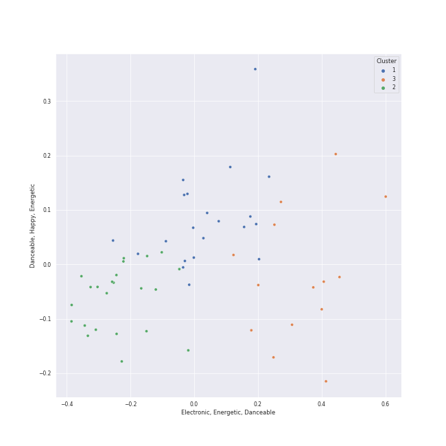

# Clusters in Relax

## Cluster #1

18 tracks

| Art | Track | Album | Artists | Label | Rank | 💚 | 🔗 |
|:---|:---|:---|:---|:---|---:|:---|:---|
|  | Set Myself On Fire | INVU - The 3rd Album | [TAEYEON](../../../../artists/taeyeon/overview.md) | [SM Entertainment](../../../../labels/sm_entertainment) | 925 | 💚 | [🔗](https://open.spotify.com/track/002wiS64p2qXaYYVAP7KOW) |
|  | Wine | Purpose - The 2nd Album | [TAEYEON](../../../../artists/taeyeon/overview.md) | [SM Entertainment](../../../../labels/sm_entertainment) | 925 | 💚 | [🔗](https://open.spotify.com/track/2Bgjj3t5bOh34DfENfgyUY) |
|  | Rain | Rain - SM STATION | [TAEYEON](../../../../artists/taeyeon/overview.md) | [SM Entertainment](../../../../labels/sm_entertainment) | 152 | 💚 | [🔗](https://open.spotify.com/track/1ukyvyEeSg1odSQvhlRAIU) |
|  | The Light | Kaleidoscope Heart | [Sara Bareilles](../../../../artists/sara_bareilles/overview.md) | [Epic](../../../../labels/epic) | 925 | 💚 | [🔗](https://open.spotify.com/track/54byd42gABS9onpYHipyoP) |
|  | December | The Blessed Unrest | [Sara Bareilles](../../../../artists/sara_bareilles/overview.md) | [Epic](../../../../labels/epic) | 925 | 💚 | [🔗](https://open.spotify.com/track/5I6exXg95LKzq9Eb0hCFXM) |
|  | Begin Again | Red | [Taylor Swift](../../../../artists/taylor_swift/overview.md) | [Big Machine Records, LLC](../../../../labels/big_machine_records) | 875 | 💚 | [🔗](https://open.spotify.com/track/0L4YCNRfXAoTvdpWeH2RGj) |
|  | Moonlight Melody | Perfect Velvet - The 2nd Album | [Red Velvet](../../../../artists/red_velvet/overview.md) | [SM Entertainment](../../../../labels/sm_entertainment) | 925 | 💚 | [🔗](https://open.spotify.com/track/1WryFxHMRpm6SOl58n8BYz) |
|  | Je T'aime | Hello - Special Album | JOY | [SM Entertainment](../../../../labels/sm_entertainment) | 484 | 💚 | [🔗](https://open.spotify.com/track/18m3QugKZFaKjoMbe8CyjL) |
|  | Goodbye Yellow Brick Road - Remastered 2014 | Goodbye Yellow Brick Road - Remastered | Elton John | [UMC (Universal Music Catalogue)](../../../../labels/umc_(universal_music_catalogue)) | 925 | 💚 | [🔗](https://open.spotify.com/track/4IRHwIZHzlHT1FQpRa5RdE) |
|  | Dream | Dream | Suzy, [BAEKHYUN](../../../../artists/baekhyun/overview.md) | ChoongangICS, MYSTIC Entertainment, [JYP Entertainment](../../../../labels/jyp_entertainment), [SM Entertainment](../../../../labels/sm_entertainment) | 77 | 💚 | [🔗](https://open.spotify.com/track/3JBnDOUd18QKjDqSYuOfpm) |
## Cluster #2

29 tracks

| Art | Track | Album | Artists | Label | Rank | 💚 | 🔗 |
|:---|:---|:---|:---|:---|---:|:---|:---|
|  | All For Nothing | To. X - The 5th Mini Album | [TAEYEON](../../../../artists/taeyeon/overview.md) | [SM Entertainment](../../../../labels/sm_entertainment) | 925 | | [🔗](https://open.spotify.com/track/6kniGjw06j9O7GFgEFwu8v) |
|  | If | Hong Gil Dong OST | [TAEYEON](../../../../artists/taeyeon/overview.md) | msmedia | 925 | 💚 | [🔗](https://open.spotify.com/track/76do9IBWqoiwV3EyoP25Le) |
|  | Take It All | 21 | [Adele](../../../../artists/adele/overview.md) | [XL Recordings](../../../../labels/xl_recordings) | 269 | 💚 | [🔗](https://open.spotify.com/track/08YJEcxGtYXwCGqXMZDiyQ) |
|  | ONLY | 4 ONLY | [LeeHi](../../../../artists/leehi/overview.md) | [Genie Music Corporation](../../../../labels/genie_music_corporation), [Stone Music Entertainment](../../../../labels/stone_music_entertainment) | 64 | 💚 | [🔗](https://open.spotify.com/track/6TBJkXHPhu3EsMk1bshwuI) |
|  | HOLO | HOLO | [LeeHi](../../../../artists/leehi/overview.md) | [Genie Music Corporation](../../../../labels/genie_music_corporation), [Stone Music Entertainment](../../../../labels/stone_music_entertainment) | 10 | 💚 | [🔗](https://open.spotify.com/track/4BSluGpjdLQihMmKgHXMxp) |
|  | Love wins all | The Winning | [IU](../../../../artists/iu/overview.md) | [EDAM Entertainment](../../../../labels/edam_entertainment) | 307 | 💚 | [🔗](https://open.spotify.com/track/53g7ZIvZE47H9pwXPFYMCH) |
|  | HANN (Alone in winter) | I burn | [(G)I-DLE](../../../../artists/(g)i-dle/overview.md) | [Universal Music LLC](../../../../labels/universal_music_llc) | 98 | 💚 | [🔗](https://open.spotify.com/track/2qYdsdgdeMLFzpLcMQWG2W) |
|  | Samson | Begin to Hope | Regina Spektor | Sire | 925 | 💚 | [🔗](https://open.spotify.com/track/2JAUBPBVkimRLc5BGhAkfJ) |
|  | Honeybee | The 2¢ Show | Steam Powered Giraffe | Steam Powered Giraffe | 216 | 💚 | [🔗](https://open.spotify.com/track/3MZjOGeXhpHbQ9ESMNFFnH) |
|  | Skinny Love | Birdy | Birdy | Atlantic Records UK | 925 | 💚 | [🔗](https://open.spotify.com/track/4RL77hMWUq35NYnPLXBpih) |
## Cluster #3

7 tracks

| Art | Track | Album | Artists | Label | Rank | 💚 | 🔗 |
|:---|:---|:---|:---|:---|---:|:---|:---|
|  | Breathe Again | Kaleidoscope Heart | [Sara Bareilles](../../../../artists/sara_bareilles/overview.md) | [Epic](../../../../labels/epic) | 925 | 💚 | [🔗](https://open.spotify.com/track/0UgmLwOrTeOCUNwV07a5AD) |
|  | Stay | Once Upon Another Time | [Sara Bareilles](../../../../artists/sara_bareilles/overview.md) | [Epic](../../../../labels/epic) | 925 | 💚 | [🔗](https://open.spotify.com/track/24xqELXbmKDFLKkR3271jb) |
|  | Like Water | Like Water - The 1st Mini Album | [WENDY](../../../../artists/wendy/overview.md) | [SM Entertainment](../../../../labels/sm_entertainment) | 116 | 💚 | [🔗](https://open.spotify.com/track/37LhFxchiyAJVop5JgRZgY) |
|  | The Road | Like Water - The 1st Mini Album | [WENDY](../../../../artists/wendy/overview.md) | [SM Entertainment](../../../../labels/sm_entertainment) | 925 | 💚 | [🔗](https://open.spotify.com/track/7cXJOM8t8pftyFgYp5Sm1N) |
|  | 7월 7일 One Of These Nights | The Velvet - The 2nd Mini Album | [Red Velvet](../../../../artists/red_velvet/overview.md) | [SM Entertainment](../../../../labels/sm_entertainment) | 52 | 💚 | [🔗](https://open.spotify.com/track/6koMMQlsRWBwHZXdtWxgUk) |
|  | My sea | IU 5th Album 'LILAC' | [IU](../../../../artists/iu/overview.md) | [EDAM Entertainment](../../../../labels/edam_entertainment) | 23 | 💚 | [🔗](https://open.spotify.com/track/46wDG6evLn2iPoQ0F8CUWk) |
|  | above the time | Love poem | [IU](../../../../artists/iu/overview.md) | [Kakao Entertainment](../../../../labels/kakao_entertainment) | 547 | 💚 | [🔗](https://open.spotify.com/track/2qKZnheMe0HhqYC1XJcdaA) |